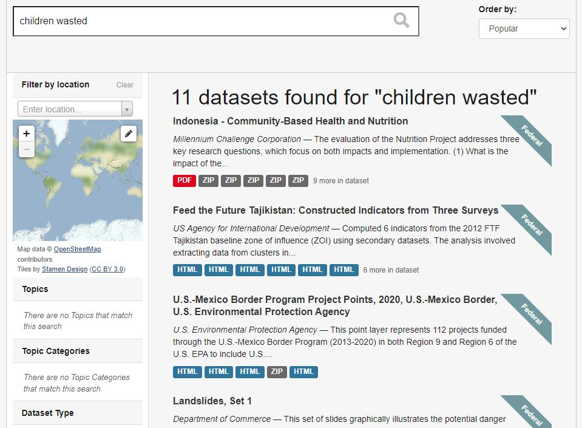
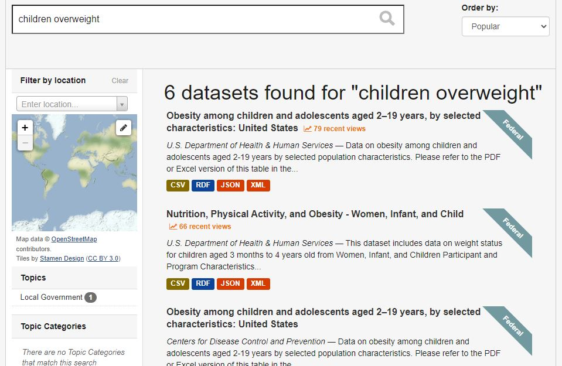
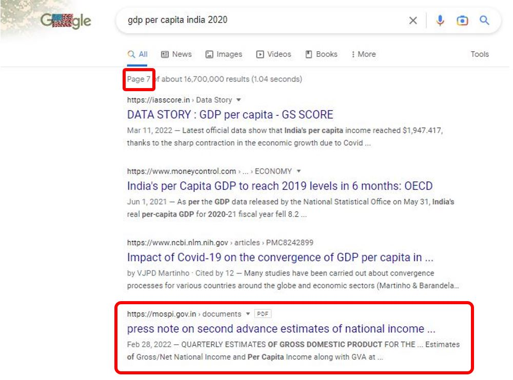

# (PART) RATIONALE AND OBJECTIVES  {-}

# The challenge of finding, assessing, accessing, and using data {#chapter01}

Many national and international organizations have adopted data sharing policies aiming to make their data more accessible to the research community. Sharing data is increasingly a requirement imposed by laws or by sponsors of data collection activities. But a commitment to share data is not sufficient. If the data are difficult to find and use, data sharing policies and regulations will not have the expected impact. Researchers often face challenges in finding, assessing, accessing, and using relevant data. Data are available from a large and gowing number of sources, not all of them easily visible and discoverable. The process of locating and accessing data can be time-consuming and complex, requiring significant effort to identify, locate, acquire, understand, and manage datasets. Many researchers will rely on personal networks to obtain the data they need, and thus make use of "convenient" data that may not be the most relevant data. Improving the accessibility and usability of data will encourage the reuse and repurposing of existing data, leading to greater return on investment in data collection and creation. In this chapter, we will explore several examples that highlight the obstacles researchers encounter when searching for and utilizing data. 

## Finding data

General search engines like Google and Bing are renowned for their remarkable capabilities in locating resources on the web and returning instant answers to users' queries. These search engines are designed to answer relatively simple queries either by providing a direct answer to a question (a trend that will accelerate with the emergence of solutions like chatGPT), or by providing links to resources available online. They are not optimized to find or recommend data that can best help researchers answer complex research questions. Some may be available from data libraries or repositories that implement advanced curation and search engine optimization. But many others may be found in more hidden locations such as article supplements, available as "data services" and not as datasets, and may have limited metadata that make them largely invisible or "unattractive" to web crawlers. Since data are scattered across many sources and locations, users without prior knowledge of what data they need and where to find them will often be poorly served. Google's *Dataset Search* is one attempt to implement a better search engine to a catalog of datasets. But its performance is hampered by the paucity of available metadata. Other data aggregators face the same issue.

Finding a specific dataset is easy. For example, finding "LSMS Albania 2002". But finding datasets based on their content is much more difficult. For example, "pre-school attendance and child malnutrition". Would that query find the Albania 2012 dataset, which contains variables on age, school attendance, level attended, height, and weight? Note that many papers cite data improperly. It is sometimes difficult to identify and locate -then acquire- a dataset used by a researcher. "Planning to incorporate persistent identifiers into the research workflow is a straightforward way to design for findability." Finding a dataset requires first identifying it clearly, which is not always easy.

Data are not found, metadata are found. Metadata is defined as "... structured information that describes, explains, locates, or otherwise makes it easier to retrieve, use or manage that resource" (Data thesaurus, NIH, https://nnlm/gov/data/thesaurus) Metadata must be findable by machines and usable by humans.

While search engines like Google and Bing play a crucial role in bringing users to relevant catalogs and repositories, specialized online data catalogs and platforms maintained by national or international organizations, academic data centers, data archives, or data libraries are better suited for researchers seeking relevant data. These organizations povide a critical service of data curation. However, the search algorithms embedded in data catalogs can also provide unsatisfactory search results due to weaknesses in metadata associated with data resources and the lack of optimization of search indexes and algorithms. Administrators of these catalogs have a responsibility to ensure that their assets are visible in generic search engines and that their specific applications provide additional optimized search and discovery features. 

The examples provided below illustrate some of the problems that researchers encounter when searching for data. It is worth noting that the results shown are as of 11 November 2022 and are subject to variation over time.

**Example 1: Searching for data on education and poverty in Kenya using Google**

Assume an analyst seeking to study the correlation between education and poverty levels in Kenya. A query for *data on poverty and education in Kenya* on Google will return useful results to an analyst looking for processed information, in the form of publications and blogs. An analyst looking for data as an input to her own analysis, not for the output of existing data analysis, will not find these results as relevant. A more specific query for *survey microdata on poverty and education in Kenya* will return more relevant results, but will miss many relevant datasets. Indeed, some datasets may contain variables on education levels and income with no mention of the keyword *poverty*). Also, the metadata associated with many survey datasets will not include a deteiled data dictionary (a comprehensive list of variables with their labels and description), which severely reduces the possibility for even the most advanced search algorithms to identify relevant resources.

 

{width=90%}

 

**Example 2: Searching for *child malnutrition* in the [US Open Data platform (data.gov)](https://catalog.data.gov)**

Child malnutrition is typically measured by the indicators of percentage of *children stunted*, *children wasted*, and *children overweight*. In a survey micro-dataset, one would need to find variables *age in months*, *height*, and *weight* for the dataset to be relevant. A query for *child malnutrition* in the U.S. Government’s open data platform [data.gov](https://catalog.data.gov) returns the following results: 

 

{width=90%}

 

Queries for *children stunted*, *children wasted*, and *children overweight* return significantly different results, with limited overlap between the results of the four queries. 

 

{width=90%}

 

 

{width=90%}

 

 

{width=90%}

 

It is not clear whether the search algorithm has the capacity to identify relevant microdata based on variable names (it is unlikely that it does). But even an apparently less challenging task appears to be too complex for this (and for almost any other) data catalog.     

**Example 3: Searching for *dutch disease* in the [World Bank's Development Data Hub](https://datacatalog.worldbank.org)**

The World Bank Development Data Hub is also a specialized data catalog. The issue we illustrate here is the lack of semantic capability in a search engine. Most data catalogs rely on keyword-based (lexical) search, which may fail to understand the user's intent. In our example, the engine fails to recognize *dutch disease* as an economic concept, and returns non-relevant results related to health and disease prevention. 

 

{width=90%}

 

**Example 4: Searching for *gdp per capita india 2020* in Google**

Search engine like Google are increasingly designed to return not just links, but **answers**. This is intended to provide improved user experience, and to service digital assistants (like Hey Google, Alexa, Siri, and others). Advanced machine learning and natural language processing (NLP) solutions are implemented to generate and rank results, and to provide the "best answer". By doing this, these search engines operate choices which are not always to the advantage of specialized audience and data producers. When searching for *gdp per capita india 2021* for example, Google provides an immediate answer by extracting information from the World Bank, not from the Ministry of Statistics (MOSPI) which is the official producer of GDP estimates for India. 

 

{width=90%}

 

MOSPI's website only appears in the 7th page of results (with a link to a PDF document, not to MOSPI's website or data catalog), which few users will ever access. For many users, the source of the information may not matter; but for others, a link to the originating and "reference" source - where more metadata can possibly be found - may be critical. For the data producer, ranking higher in the search results also matters. Few official data producers understand and invest in search engine optimization. 

 

{width=90%}

 

Data catalogs and generic search engines like Google and Bing both play an essential, but different, role in improving data accessibility and use. A large proportion of data users will likely start their search on these lead search engines. When relevant, the search engines will --or should-- bring them to specialized catalogs, where they will find options to run more specialized queries, browse metadata, and access the data. 

The main obstacles to data visibility and discoverability are that: 

   - **data often come with limited and sub-optimal metadata**. Search engines will index metadata. Many data custodians lack the expertise, the resources, or the incentives to optimally document their data assets.
   - **search engines embedded in specialized data catalogs have limited capabilities.** Most often, they rely on full-text search and do not provide semantic searchability. Ideally, data catalogs would even go beyond providing semantic searchability and be able to operate as *recommender systems*. To best satisfy the needs of data analysts, search tools embedded in data catalogs should also be able to **distinguish different types of data**, and be **optimized to rank results by relevancy**.
   - **specialized data catalogs lack visibility**, due to a lack of search engine optimization.

## Assessing data

Are the data really relevant?
Is the sample size large enough?
Does it cover the entire universe of interest? And the entire geography of interest?
Is the source reliable
Is the method satisfactory
Are data comparable (over time, across sources)
Will the data remain available? Updated?

## Accessing data

Terms of use
Mode of access
- Bulk download
- API
- UI
- Analytical platforms
- Visualizations

File formats
- Proprietary
- Outdated
- Inconvenient (labels, etc)

## Using data

The challenge for data users is not only to discover data, but also to obtain all necessary information to fully understand the data and to use them responsibly and appropriately. A same indicator label, for example *unemployment rate (%)*, can mask significant differences by country, source, and time. The international recommendations for the definition and calculation of *unemployment rate* has changed over time, and not all countries use the same data collection instrument (labor force survey or other) to collect the underlying data. In on-line data dissemination platforms, detailed metadata should therefore always be associated and disseminated with the data. This must be a close association; the relevant metadata will ideally not be more than one click away from the data. This is particularly critical when a platform publishes data from multiple sources that are not fully harmonized.

:::quote
The scope and meaning of labour statistics in general are determined by their source and methodology, and this is certainly true for the unemployment rate. In order to interpret the data accurately, it is crucial to understand what the data convey and how they were collected and constructed, which implies having information on the relevant metadata. The design and characteristics of the data source (typically a labour force survey or similar household survey for the unemployment rate), especially in terms of definitions and concepts used, geographical and age coverage, and reference periods have great implications for the resulting data, making it crucial to take them into account when analysing the statistics. It is also essential to seek information on any methodological changes and breaks in series to assess their impact for trend analysis, and to keep in mind methodological differences across countries when conducting cross-country studies. (From [*Quick guide on interpreting the unemployment rate*](https://ilo.org/wcmsp5/groups/public/---dgreports/---stat/documents/publication/wcms_675155.pdf), International Labour Office – Geneva: ILO, 2019, ISBN : 978-92-2-133323-4 (web pdf)).
:::

Reproducibility: ...

## Solutions

"To solve the information retrieval problem, researchers must therefore think broadly about who needs that information and the context within which it is created, as well as its actual content." "Being mindful of all potential users and how they might need to interact with you and your work is the foundation." (https://doi.org/10.1371/journal.pcbi.1008469)

Combination of better data curation (packaging and documentation), better search engines, and increased visibility of the content of specialized data libraries in general search engines.

The adoption of FAIR principles can help. Data must be Findable, Accessible, Interoperable, and Reusable. Google's Dataset Search is a noteworthy attempt to improve the search engine's performance in finding relevant datasets, but its efficacy is hindered by the paucity of available metadata.

Data curation is essential, not only cataloguing. The whole process, from acquisition to dissemination is important. Objective is to let researcher focus on analysis, by making the process of finding, assessing, accessing, and preparing data as efficient as possible - anticipating theirneeds, and doing the work once to serve many. For sponsors of data collection: invest not only in data production, but also in the curation of data for re-use. 

Findable:
Data catalogs (libraries) with:
- Advanced search algorithms and filters. This includes full text search, advanced search, semantic search, and recommender system. Possibility to enter simple queries, or complex, even a document as a query.
- SEO, as many users will find the catalog via search engines

Accessible:
- Multiple modes of data access

Inter-operable
- Inter-operability

Reusable
- Display of detailed metadata, with possibility to easyly assess fitness for purpose
- Scripts, not only data

In chapter 2, we define the features of a modern catalog in more detail.

