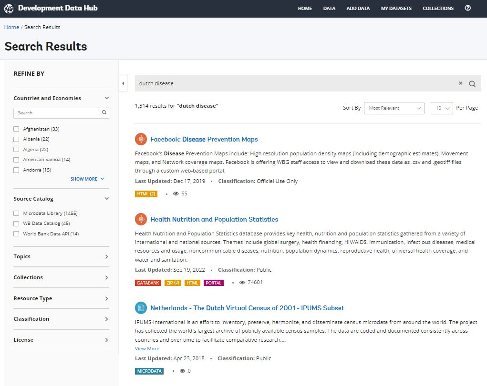

# (PART) RATIONALE AND OBJECTIVES  {-}

# The challenge of finding, assessing, accessing, and using data {#chapter01}

Finding, assessing, accessing, and using the most relevant data can be a challenging task for researchers. Often, they spend significant time identifying, locating, acquiring (and sometimes failing to acquire), understanding, and wrangling the data they need, Some will rely on tribal knowledge and chose to use convenient more than relevant data. Making data easier to find, access, and use can foster the re-use and re-purposing of existing data and increase the return on investments in data collection and creation. We provide in this chapter a few examples that illustrate some of the obstacles that researchers face when looking for, and using data.  

## Finding data

How do researchers look for data when they do not know exactly what data they need to find:
- Queries in specialized catalogs - This assume they know about the data catalog and have some idea of what they can find in it. All catalogs have a limited scope and coverage. 
- Queries in search engines like Google. This is critical. 

They submit queries based on expectation of keyword match (full text search). 

Some simple requests may be answered directly. This is the trend in search engines: provide an answer before providing a link. For complex dataset, only links will be returned. Once a match is returned, browse the content to confirm that the data are indeed useful. Hoping to have as direct access to the data as possible, in the most convenient format. 

Search engines like Google and Bing are designed to search the whole world wide web, not specifically to find data. They perform well for simple data queries that call for a simple answer (e.g., *population of India in 2020*), or when a user searches for a specific resource available on-line (e.g., *Living Standards Measurement Survey Albania 2012*). But they will not (and should not be expected to) perform as well for complex data queries, or to provide recommendations. Researchers will thus often turn to specialized on-line data catalogs and data platforms maintained by national or international organizations, academic data centers, and data archives or data libraries. Unfortunately, the search algorithms embedded in data catalogs also provide unsatisfactory search results. This is due in part to weaknesses in the metadata associated with the data resources, and in part to the lack of optimization of the search indexes and algorithms. Google's *Dataset Search* is an attempt to implement a better search engine to a catalog of datasets. But its performance is also hampered by the paucity of available metadata. The examples below illustrate in an anecdotal manner some of the problems that researchers face when searching for data. The results shown below are as of 11 November 2022, and will be vary over time.

**Example 1: Searching for data on education and poverty in Kenya using Google**

Assume an analyst seeking to study the correlation between education and poverty levels in Kenya. A query for *data on poverty and education in Kenya* on Google will return useful results to an analyst looking for processed information, in the form of publications and blogs. An analyst looking for data as an input to her own analysis, not for the output of existing data analysis, will not find these results as relevant. A more specific query for *survey microdata on poverty and education in Kenya* will return more relevant results, but will miss many relevant datasets. Indeed, some datasets may contain variables on education levels and income with no mention of the keyword *poverty*). Also, the metadata associated with many survey datasets will not include a deteiled data dictionary (a comprehensive list of variables with their labels and description), which severely reduces the possibility for even the most advanced search algorithms to identify relevant resources.

 

{width=90%}

 

**Example 2: Searching for *child malnutrition* in the [US Open Data platform (data.gov)](https://catalog.data.gov)**

Child malnutrition is typically measured by the indicators of percentage of *children stunted*, *children wasted*, and *children overweight*. In a survey micro-dataset, one would need to find variables *age in months*, *height*, and *weight* for the dataset to be relevant. A query for *child malnutrition* in the U.S. Government’s open data platform [data.gov](https://catalog.data.gov) returns the following results: 

 

{width=90%}

 

Queries for *children stunted*, *children wasted*, and *children overweight* return significantly different results, with limited overlap between the results of the four queries. 

 

{width=90%}

 

 

{width=90%}

 

 

{width=90%}

 

It is not clear whether the search algorithm has the capacity to identify relevant microdata based on variable names (it is unlikely that it does). But even an apparently less challenging task appears to be too complex for this (and for almost any other) data catalog.     

**Example 3: Searching for *dutch disease* in the [World Bank's Development Data Hub](https://datacatalog.worldbank.org)**

The World Bank Development Data Hub is also a specialized data catalog. The issue we illustrate here is the lack of semantic capability in a search engine. Most data catalogs rely on keyword-based (lexical) search, which may fail to understand the user's intent. In our example, the engine fails to recognize *dutch disease* as an economic concept, and returns non-relevant results related to health and disease prevention. 

 

{width=90%}

 

**Example 4: Searching for *gdp per capita india 2020* in Google**

Search engine like Google are increasingly designed to return not just links, but **answers**. This is intended to provide improved user experience, and to service digital assistants (like Hey Google, Alexa, Siri, and others). Advanced machine learning and natural language processing (NLP) solutions are implemented to generate and rank results, and to provide the "best answer". By doing this, these search engines operate choices which are not always to the advantage of specialized audience and data producers. When searching for *gdp per capita india 2021* for example, Google provides an immediate answer by extracting information from the World Bank, not from the Ministry of Statistics (MOSPI) which is the official producer of GDP estimates for India. 

 

{width=90%}

 

MOSPI's website only appears in the 7th page of results (with a link to a PDF document, not to MOSPI's website or data catalog), which few users will ever access. For many users, the source of the information may not matter; but for others, a link to the originating and "reference" source - where more metadata can possibly be found - may be critical. For the data producer, ranking higher in the search results also matters. Few official data producers understand and invest in search engine optimization. 

 

{width=90%}

 

Data catalogs and generic search engines like Google and Bing both play an essential, but different, role in improving data accessibility and use. A large proportion of data users will likely start their search on these lead search engines. When relevant, the search engines will --or should-- bring them to specialized catalogs, where they will find options to run more specialized queries, browse metadata, and access the data. 

The main obstacles to data visibility and discoverability are that: 

   - **data often come with limited and sub-optimal metadata**. Search engines will index metadata. Many data custodians lack the expertise, the resources, or the incentives to optimally document their data assets.
   - **search engines embedded in specialized data catalogs have limited capabilities.** Most often, they rely on full-text search and do not provide semantic searchability. Ideally, data catalogs would even go beyond providing semantic searchability and be able to operate as *recommender systems*. To best satisfy the needs of data analysts, search tools embedded in data catalogs should also be able to **distinguish different types of data**, and be **optimized to rank results by relevancy**.
   - **specialized data catalogs lack visibility**, due to a lack of search engine optimization.

## Assessing data

Are the data really relevant?

## Accessing data

Terms of use
Mode of access
- Bulk download
- API
- UI
- Analytical platforms
- Visualizations

File formats
- Proprietary
- Outdated
- Inconvenient (labels, etc)

## Using data

The challenge for data users is not only to discover data, but also to obtain all necessary information to fully understand the data and to use them responsibly and appropriately. A same indicator label, for example *unemployment rate (%)*, can mask significant differences by country, source, and time. The international recommendations for the definition and calculation of *unemployment rate* has changed over time, and not all countries use the same data collection instrument (labor force survey or other) to collect the underlying data. In on-line data dissemination platforms, detailed metadata should therefore always be associated and disseminated with the data. This must be a close association; the relevant metadata will ideally not be more than one click away from the data. This is particularly critical when a platform publishes data from multiple sources that are not fully harmonized.

:::quote
The scope and meaning of labour statistics in general are determined by their source and methodology, and this is certainly true for the unemployment rate. In order to interpret the data accurately, it is crucial to understand what the data convey and how they were collected and constructed, which implies having information on the relevant metadata. The design and characteristics of the data source (typically a labour force survey or similar household survey for the unemployment rate), especially in terms of definitions and concepts used, geographical and age coverage, and reference periods have great implications for the resulting data, making it crucial to take them into account when analysing the statistics. It is also essential to seek information on any methodological changes and breaks in series to assess their impact for trend analysis, and to keep in mind methodological differences across countries when conducting cross-country studies. (From [*Quick guide on interpreting the unemployment rate*](https://ilo.org/wcmsp5/groups/public/---dgreports/---stat/documents/publication/wcms_675155.pdf), International Labour Office – Geneva: ILO, 2019, ISBN : 978-92-2-133323-4 (web pdf)).
:::

## Solutions

