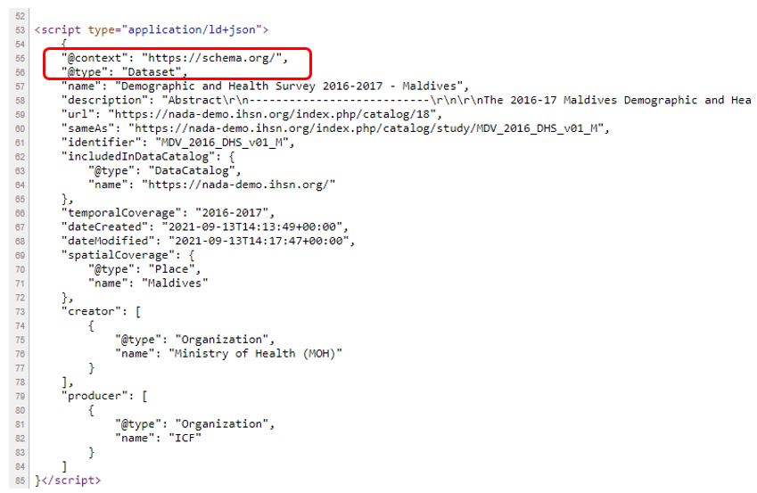

# (PART) GET STARTED  {-}

# The benefits of rich, structured metadata {#chapter01}

Finding, understanding, and using the most relevant data can be a challenging task for researchers and other data users. 

<u>**Finding data**</u>

Search engines like Google and Bing are designed to search the whole world wide web, not specifically to find data. They perform well for simple data queries that call for a simple answer (e.g., *population of India in 2020*), or when a user searches for a specific resource available on-line (e.g., *Living Standards Measurement Survey Albania 2012*). But they will not (and should not be expected to) perform as well for complex data queries. Researchers will thus often turn to specialized on-line data catalogs and data platforms maintained by national or international organizations, academic data centers, and libraries. Unfortunately, the search algorithms embedded in data catalogs often consist of out-of-the-box solutions that also provide unsatisfactory search results. This is due in part to weaknesses in the metadata associated with the data resources, and in part to the lack of optimization of the search indexes and algorithms. Google's *Dataset Search* is an attempt to implement a better search engine to a catalog of datasets. But its performance is also hampered by the paucity of available metadata. The examples below illustrate in an anecdotal manner some of the problems that researchers face when searching for data. The results shown below are as of 11 November 2022, and will be vary over time.

**Example 1: Searching for data on education and poverty in Kenya using Google**

Assume an analyst seeking to study the correlation between education and poverty levels in Kenya. A query for *data on poverty and education in Kenya* on Google will return useful results to an analyst looking for processed information, in the form of publications and blogs. An analyst looking for data as an input to her own analysis, not for the output of existing data analysis, will not find these results as relevant. A more specific query for *survey microdata on poverty and education in Kenya* will return more relevant results, but will miss many relevant datasets. Indeed, some datasets may contain variables on education levels and income with no mention of the keyword *poverty*). Also, the metadata associated with many survey datasets will not include a deteiled data dictionary (a comprehensive list of variables with their labels and description), which severely reduces the possibility for even the most advanced search algorithms to identify relevant resources.

<br>
<center>
{width=90%}
</center>
<br>

**Example 2: Searching for *"child malnutrition"* data in the [US Open Data platform (data.gov)](https://catalog.data.gov)**

Child malnutrition is typically measured by the indicators of percentage of *children stunted*, *children wasted*, and *children overweight". 

A query for *child malnutrition* in the U.S. Government’s open data platform [data.gov]((https://catalog.data.gov)) returns the following results: 

<br>
<center>
{width=90%}
</center>
<br>

Queries for *children stunted*, *children wasted*, and *children overweight* return significantly different results, with limited overlap between the results of the four queries. 

<br>
<center>
{width=90%}
</center>
<br>

<br>
<center>
{width=90%}
</center>
<br>

<br>
<center>
{width=90%}
</center>
<br>

**Example 3: Searching for *"dutch disease"* in the [World Bank's Development Data Hub](https://datacatalog.worldbank.org)**

The World Bank Development Data Hub is also a specialized data catalog. The issue we illustrate here is the lack of semantic capability in a search engine. Most data catalogs rely on keyword-based (lexical) search, which may fail to understand the user's intent. In our example, the engine fails to recognize *dutch disease* as an economic concept, and returns non-relevant results related to health and disease prevention. 

<br>
<center>
{width=90%}
</center>
<br>

**Example 4: Searching for *"gdp per capita india 2020"* in [Google]**

Search engine like Google are increasingly designed to return not just links, but **answers**. This is intended to provide improved user experience, and to service digital assistants (like Hey Google, Alexa, Siri, and others). Advanced machine learning and natural language processing (NLP) solutions are implemented to generate and rank results, and to provide the "best answer". By doing this, these search engines operate choices which are not always to the advantage of specialized audience and data producers. When searching for *gdp per capita india 2021* for example, Google provides an immediate answer by extracting information from the World Bank, not from the Ministry of Statistics (MOSPI) which is the official producer of GDP estimates for India. 

<br>
<center>
{width=90%}
</center>
<br>


MOSPI's website only appears in the 7th page of results (with a link to a PDF document, not to MOSPI's website or data catalog), which few users will ever access. For many users, the source of the information may not matter; but for others, a link to the originating and "reference" source - where more metadata can possibly be found - may be critical. For the data producer, ranking higher in the search results also matters. Few official data producers understand and invest in search engine optimization. 
<br>
<center>
{width=90%}
</center>
<br>

Data catalogs and generic search engines like Google and Bing both play an essential, but different, role in improving data accessibility and use. A large proportion of data users will likely start their search on these lead search engines. When relevant, the search engines will --or should-- bring them to specialized catalogs, where they will find options to run more specialized queries, browse metadata, and access the data. 

The main obstacles to data visibility and discoverability are that: 

   - **data often come with limited and sub-optimal metadata**. Search engines will index metadata. Many data custodians lack the expertise, the resources, or the incentives to optimally document their data assets.
   - **search engines embedded in specialized data catalogs have limited capabilities.** Most often, they rely on full-text search and do not provide semantic searchability. Ideally, data catalogs would even go beyond providing semantic searchability and be able to operate as *recommender systems*. To best satisfy the needs of data analysts, search tools embedded in data catalogs should also be able to **distinguish different types of data**, and be **optimized to rank results by relevancy**.
   - **specialized data catalogs lack visibility**, due to a lack of search engine optimization.

**<u>Understanding and using data</u>**

The challenge for data users is not only to discover data, but also to obtain all necessary information to fully understand the data and to use them responsibly and appropriately. A same indicator label, for example *unemployment rate (%)*, can mask significant differences by country, source, and time. The international recommendations for the definition and calculation of *unemployment rate* has changed over time, and not all countries use the same data collection instrument (labor force survey or other) to collect the underlying data. In on-line data dissemination platforms, detailed metadata should therefore always be associated and disseminated with the data. This must be a close association; the relevant metadata will ideally not be more than one click away from the data. This is particularly critical when a platform publishes data from multiple sources that are not fully harmonized.

:::quote
The scope and meaning of labour statistics in general are determined by their source and methodology, and this is certainly true for the unemployment rate. In order to interpret the data accurately, it is crucial to understand what the data convey and how they were collected and constructed, which implies having information on the relevant metadata. The design and characteristics of the data source (typically a labour force survey or similar household survey for the unemployment rate), especially in terms of definitions and concepts used, geographical and age coverage, and reference periods have great implications for the resulting data, making it crucial to take them into account when analysing the statistics. It is also essential to seek information on any methodological changes and breaks in series to assess their impact for trend analysis, and to keep in mind methodological differences across countries when conducting cross-country studies. (From [*Quick guide on interpreting the unemployment rate*](https://ilo.org/wcmsp5/groups/public/---dgreports/---stat/documents/publication/wcms_675155.pdf), International Labour Office – Geneva: ILO, 2019, ISBN : 978-92-2-133323-4 (web pdf)).
:::

Data producers have a responsibility to generate comprehensive metadata for their datasets. The administrators and curators of data catalogs are responsible for providing well-documented data, specialized search tools, advice to data users, and for making the metadata as visible as possible to the search engines by implementing search engine optimization (SEO). 

To serve the multiple purposes of improving the usability, visibility, discoverability, and accessibility of data, metadata must be **rich** (detailed and comprehensive) and **structured**. Metadata standards and schemas provide a solution to data curators to improve the comprehensiveness of, and to structure, their metadata. And machine learning and other approaches can be implemented to **augment** (or **enhance**) metadata in a largely automated manner, making them richer. 


 <!--  _____  _      _      -->
 <!-- |  __ \(_)    | |     -->
 <!-- | |__) |_  ___| |__   -->
 <!-- |  _  /| |/ __| '_ \  -->
 <!-- | | \ \| | (__| | | | -->
 <!-- |_|  \_\_|\___|_| |_| -->
 
## Rich metadata

*Rich* metadata means detailed and comprehensive metadata. Rich metadata are beneficial to both the users and the providers (producers and curators) of data.

### Benefits for data users

Being provided with rich metadata helps data users:

   - **Find** data of interest. The metadata provide much of the content that the search engine will be able to index and discover. The richer the metadata, the better the search engine will be able to help users identify relevant data. 
   - **Understand** what the data are measuring and how they have been created. Without a proper description of the data, the risk is high that a user will misunderstand and possibly misuse them, or simply decide not to make use of them.
   - **Assess** the quality of the data, including their reliability, fitness for purpose, and consistency with other datasets when the purpose requires integration of multiple datasets. 

### Benefits for data producers

For the data producers, rich metadata will contribute to:

   - Ensure **transparency, auditability, and credibility** of the data and of the derived products.
   - Increase the **visibility** of the data, and thus the demand for, and use of the data.
   - **Reduce the cost** of operating a data dissemination service by lowering the burden of responding to users' requests for information.
   - Support the preservation of **institutional memory**.
   - Provide the meta-database needed to **harmonize data collection** methods and instruments, e.g., by providing convenient tools to compare variables across datasets. A compelling case for rich metadata for transparency and harmonization can be found in ["The Struggle for Integration and Harmonization of Social Statistics in
a Statistical Agency - A Case Study of Statistics Canada"](https://www.ihsn.org/sites/default/files/resources/IHSN-WP004.pdf) by Gordon Priest (2010).<br>
   <center>
   {width=90%}
   </center>
   
### Scope of the metadata

What makes metadata "rich and comprehensive" is not always easy to define, and is specific to each data type. Microdata and geospatial datasets for example will require much more -- and different-- metadata than a document or an image. Metadata standards and schemas provide data curators with detailed lists of *elements* (or *fields*), specific to each data type, that must or may be provided to document a dataset. The metadata elements included in a standard or schema will typically cover *cataloguing material*, *contextual information*, and *explanatory materials*.

#### Cataloguing material

Cataloguing material includes elements such as a title, a unique identifier for the dataset, a version number and description, as well as information related to the data curation (including who generated the metadata and when, or where and when metadata may have been harvested from an external catalog). This information allows the dataset to be uniquely identified within a collection/catalog, and serves as a bibliographic record of the dataset, allowing it to be properly acknowledged and cited in publications.

#### Contextual information

Contextual information describes the context in which the data were collected and how they were put to use. It enables secondary users to understand the background and processes behind the data production. Contextual information should cover topics such as:

   - What justified or required the data collection (the objectives of the data production exercise);
   - Who or what was being studied;
   - The geographic and temporal coverage of the data;
   - Changes and developments that occurred over time in the data collection methodology and in the dataset, if relevant. For repeated cross-section, panel, or time series datasets, this may include information describing changes in the question text, variable labeling, sampling procedures, or others;
   - What are the key output of the data collection, such as a publication, the design or implementation of a policy or project, etc. 
   - Problems encountered in the process of data collection, entry, checking, and cleaning;
   - Other useful information on the life cycle of the dataset.

#### Explanatory material

Explanatory materials are the information that should be created and preserved to ensure the long-term functionality of a dataset and its contents. This applies mostly to microdata, geospatial data, and to some extent to tabulations and to time series and indicators databases. It is less relevant for images, videos, and documents. Explanatory materials include:

   - **Information about the data collection methods**: This section should describe the instruments used and methods employed, and how they were developed. If applicable, details of the sampling design and sampling frames should be included. It is also useful to include information on any monitoring process undertaken during the data collection as well as details of quality controls.
   - **Information about the structure of the dataset**: Key to this information is a detailed data dictionary describing the structure of the dataset, including information about relationships between individual files or records within the study. For example, it should include key variables required for unique identification of subjects across files (required to properly merge data files), the number of cases and variables in each file, and the number of files in the dataset. For relational models, the structure and relations between datasets records and elements should be described.
   - **Technical information**: This information relates to the technical framework and should include the computer system used to generate the data and related files; the software packages with which the files were created.
   - **Variables and values, coding and classification schemes** (for microdata and geospatial data): The documentation should contain an exhaustive list of  variables in the dataset, including a complete explanation and full details about the coding and classifications used for the information allocated to those fields. It is especially important to have blank and missing fields explained and accounted for. It is helpful to identify variables to which standard coding classifications apply, and to record the version of the classification scheme used.
   - **Information about derived variables** (for microdata and geospatial data, and tabulations): Many data producers derive new variables from original data. This may be as simple as grouping raw age (in years) data according to groups of years appropriate for the survey, or it may be much more complex and require the use of sophisticated algorithms. When grouped or derived variables are created, it is important that the logic for the grouping or derivation is clear. Simple grouping, such as for age, can be included within the data dictionary. More complex derivations require other means of recording the information. Sufficient supporting information should be provided to allow an easy link between the core variables used and the resultant variables. In addition, computer algorithms used to create the derivations should be saved together with information on the software.
   - **Weighting and grossing** (for sample survey microdata): Weighting and grossing variables must be fully documented, with explanations of the construction of the variables and clear indications of the circumstances in which they should be used. The latter is particularly important when different weights are applied for different purposes.
   - **Data source**: Details about the source from which the data is derived should be included. For example, when the data source consists of responses to survey questionnaires, each question should be carefully recorded in the documentation. Ideally, the text will include a reference to the generated variable(s). It is also useful to explain the conditions under which a question would be asked, including, if possible, the cases to which it applies and, ideally, a summary of response statistics.
   - **Confidentiality and anonymization**: It is important to determine whether the data contains any confidential information on individuals, households, organizations, or institutions. If so, such information should be recorded together with any agreement on how to use the data, such as with survey respondents. Issues of confidentiality may restrict the analyses to be undertaken or results to be published, particularly if the data is to be made available for secondary use. If the data were anonymized to prevent identification, it is wise to record the anonymization procedure (taking care of not providing information that would enable a reverse-engineering of the procedure) and its impact on the data, as such modification may restrict subsequent analysis.


 <!--   _____ _                   _                      _  -->
 <!--  / ____| |                 | |                    | | -->
 <!-- | (___ | |_ _ __ _   _  ___| |_ _   _ _ __ ___  __| | -->
 <!--  \___ \| __| '__| | | |/ __| __| | | | '__/ _ \/ _` | -->
 <!--  ____) | |_| |  | |_| | (__| |_| |_| | | |  __/ (_| | -->
 <!-- |_____/ \__|_|   \__,_|\___|\__|\__,_|_|  \___|\__,_| -->
                                                      
## Structured metadata

Metadata should not only be comprehensive and detailed, they should also be organized in a **structured** manner, preferably using a standardized structure. **Structured metadata** means that the metadata are stored in specific *fields* (or *elements*) organized in a <u>metadata schema</u>. **Standardized** means that the list and description of elements are commonly agreed by a community of practice.

Some metadata standards have originated from academic data centers, like the [Data Documentation Initiative (DDI)](https://ddialliance.org/), maintained by the [Inter-University Consortium for Political and Social Research](https://www.icpsr.umich.edu/web/pages/) (ICPSR) at the University of Michigan. Other found their origins in specialized communities of practice (like the [ISO 19139](https://www.iso.org/standard/67253.html?browse=tc) for geospatial resources). The private sector also contributes to the development of standards, like the [International Press Telecommunications Council (IPTC)](https://iptc.org/) standard developed by and for news media.

Metadata compliant with standards and schemas will typically be stored as JSON or XML files (described in Chapter 2), which are plain text files. The example below show how a simple free-text content would be structured and stored in JSON format, using metadata elements from the [DDI Codebook](https://ddialliance.org/Specification/DDI-Codebook/2.5/) metadata standard: 

**Free text version**: 

*The Child Mortality Survey (CMS) was conducted by the National Statistics Office of Popstan from July 2010 to June 2011, with financial support from the Child Health Trust Fund (TF123_456).*

**Structured, machine-readable (JSON) version**:

```{json}
  "title"           : "Child Mortality Survey 2010-2011",
  "alternate_title" : "CMS 2010-2011", 
  "authoring_entity": "National Statistics Office (NSO)", 
  "funding_agencies": [{"name":"Child Health Trust Fund (CHTF)", "grant":"TF123_456"}],
  "coll_dates"      : [{"start":"2010-07", "end":"2011-06"}],
  "nation"          : [{"name":"Popstan", "abbreviation":"POP"}] 
}  
```

Both versions contain (almost) the same information. In the structured version, we have added acronyms and the ISO country code. This does not create new information but will help make the existing information more discoverable and inter-operable. The structured version is clearly more suitable for publishing in a meta-database (or catalog). Organizing and storing metadata in such a structured manner will enable all kinds of applications. For example, when metadata for a collection of surveys are stored in a database, it becomes straightforward to apply filters (for example, a filter by country using the nation/name element) and targeted searches to answer questions like "What data are available that cover the month of December 2010?" or "What surveys did the CHTF sponsor?". 

Metadata standards and schemas must be comprehensive and intuitive. They aim to provide comprehensive and granular lists of elements. Some standards may contain a very long list of elements. Most often, only a subset of the available elements will be used to document a specific dataset. For example, the elements of the DDI metadata standard related to sample design will be used to document sample survey datasets but will be ignored when documenting a population census or an administrative dataset. In all standards and schemas, most elements are *optional*, not *required*. Data curators should however try and provide content for all elements for which information is or can be made available.

Complying with metadata standards and schemas contributes to the completeness, usability, discoverability, and inter-operability of the metadata, and to the visibility of the data and metadata.

### Completeness 

When they document datasets, data curators who do not make use of metadata standards and schemas tend to focus on the readily-available documentation and may omit some information that secondary data users --and search engines-- may need. Metadata standards and schemas provide checklists of what information could or should be provided. These checklists are developed by experts, and are regularly updated or upgraded based on feedback received from users or to accommodate new technologies. 

Generating complete metadata will often be a collaborative exercise, as the production of data involves multiple stakeholders. The implementation of a survey, for example, may involve sampling specialists, field managers, data processing experts, subject matter specialists, and programmers. Documenting a dataset should not be seen as a last and independent step in the implementation of a data collection or production project. Ideally, metadata will be captured continuously and in quasi-real time during the entire life cycle of the data collection/production, and contributed by those who have most knowledge of each phase of the data production process. 

Generating complete and detailed metadata may be seen as a burden by some organizations or researchers. But it will typically represent only a small fraction of the time and budget invested in the production of the data, and is an investment that will add much value to the data by increasing their usability and discoverability.
 
### Usability 

Fully understanding a dataset before conducting analysis should be a pre-requisite for all researchers and data users. But this will only be possible when the documentation is easy to obtain and exploit. Convenience to users is key. When using a geographic dataset for example, the user should be able to immediately find the coordinate reference system that was used. When using survey microdata, which may contain hundreds or thousands of variables, the user need to be able to immediately access information on a variable label, underlying question, universe, categories, etc. Structured metadata enables such "convenience", as they can easily be transformed into bookmarked PDF documents, searchable websites, machine-readable codebooks, etc. The way metadata are displayed can be tailored to the specific needs of different categories of users.

### Discoverability

:::quote
Data discoverability is one of the main tasks, next to availability and interoperability, that public policy makers and implementers should take into due consideration in order to foster access, use and re-use of public sector information, particularly in case of open data. Users shall be enabled to easily search and find data they need for the most different purposes. That is clearly highlighted in the introduction statements of the INSPIRE Directive, where we can read that “The loss of time and resources in searching for existing (spatial) data or establishing whether they may be used for a particular purpose is a key obstacle to the full exploitation of the data available”.
From [*Metadata and data portals/catalogues are essential assets to enable that data discoverability.*](https://www.europeandataportal.eu/en/impact-studies/country-insights/italy/italy-discoverability-practice)
:::

What matters is not only <u>what</u> metadata are provided as input to the search engines that matters, it is also <u>how</u> the metadata are provided. To understand the value of structured metadata, we need to take into consideration how search engines ingest, index, and exploit the metadata. In brief, the metadata will need to be acquired, augmented, analyzed and transformed, and indexed before they can be made searchable. We provide here an overview of the process, which is described in detail by D. Turnbull and J. Berryman in ["Relevant Search: With applications for Solr and Elasticsearch"](https://www.manning.com/books/relevant-search) (2016). 

- **Acquisition**: Search engines like Google and Bing acquire metadata by crawling billions of web pages using *web crawlers* (or *bots*), with an objective to cover the entire web. Guidance is available to webmasters on how to optimize websites for visibility (see for example [Google's Search Engine Optimization (SEO) Starter Guide](https://developers.google.com/search/docs/beginner/seo-starter-guide). The search tools embedded in specialized data catalogs have a much simpler task, as the catalog administrators and curators generate or control, and provide, the well-contained content to be indexed. In a cataloguing application like NADA, this content is provided in the form of *structured metadata files* saved in JSON or XML format. For textual data (documents), the content of the document (not only the metadata on the) can also be indexed. The process of acquisition/extraction of metadata by the search engine tool must preserve the structure of the metadata, in its original or in a modified form. This will be critical for optimizing the performance of the search tool and the ranking of query results (e.g., a keyword found in a document title may have more weight than the same keyword found in the document abstract), for implementing facets, or for providing advanced search options (e.g., search only in the "authors" metadata field).  

- **Augmentation** or **enrichment**: the content of the metadata can be *augmented* or *enriched* in multiple ways, often automatically (by extracting information from an external source, or using machine learning algorithms). Part of this augmentation process should happen before the metadata are submitted to the search engine. Other procedures of enrichment of the metadata may be implemented after acquisition of the metadata by the search engine tool. Metadata augmentation can have a significant impact on the discoverability of data. See the section "Augmented (enriched) metadata" below.

- **Analysis** or **transformation**: The metadata generated by the data curator and by the augmentation process will mostly (not exclusively) consist of text. For the purpose of discoverability, some of the text has no value; words like "the", "a", it", "with", etc., referred to as *stop words*, will be removed from the metadata (multiple tools are available for this purpose). The remaining words will be converted to lowercase, may be submitted to spell checkers (to exclude or fix errors), and words will be *stemmed* or *lemmatized*. The stemming or lemmatization consist of converting words to their *stem* or *root*); this will among other transformations change plurals to singular and the conjugated forms of the verbs to their base form. Last, the transformed metadata will be *tokenized*, i.e. split into a list of terms (*tokens*). To enable semantic searchability, the metadata can also be converted into numeric vectors using natural language processing *embedding* models. These vectors will be saved in a database (such as [ElasticSearch](https://github.com/elastic/elasticsearch) or [Milvus](https://milvus.io/)) that will provide functionalities to measure similarity/distance between vectors. Section 1.8 below provide more information on text embedding and semantic searchability.

- **Indexing**: The last phase of metadata processing is the indexing of the tokens. The index of a search engine is an *inverted index*, which will contain a list of all terms found in the metadata, with the following information (among other) attached to each term:
   - The *document frequency*, i.e. the number of metadata documents where the word is found (a *metadata document* is the metadata related to one dataset).
   - The identification of the metadata documents in which the term was found.
   - The *term frequency* in each metadata document. 
   - The *term positions* in the metadata document, i.e. where the term is found in the document. This is important to identify colocations. When a user submits a query for "demographic transition" for example, documents where the two terms are found next to each other will be more relevant than documents where both terms appear but in different parts of the document.

Once the metadata has been acquired, transformed, and indexed, it is available for use via a user interface (UI). A data catalog UI will typically include a search box and facets (filters). The search engine underlying the search box can be simple (out-of-the-box full text search, looking for exact matches of keywords), or advanced (with semantic search capability and optimized ranking of query results). Basic full-text search do not provide satisfactory user experience, as we illustrated in the introduction to this Guide. Rich, structured metadata, combined with advanced search optimization tools and machine learning solutions, allow catalog administrators to tune the search engine, and implement advanced solutions including semantic searchability.  

<center>
{width=100%}
</center>


### Interoperability 

Data catalogs that adopt common metadata standards and schemas can exchange information including through automated harvesting and synchronization of catalogs. This allows them to increase their visibility, and to publish their metadata in hubs. Recommendations and guidelines for improved inter-operability of data catalogs are provided by the [Open Archives Initiative](https://www.openarchives.org/). 

Interoperability between data catalogs can be further improved by the adoption of common controlled vocabularies. For example, the adoption of the ISO country codes in country lists will guarantee that all catalogs will be able to filter dataset by country in a consistent manner. This will solve the issue of possible differences in the spelling of country names (e.g., one catalog referring to the *Democratic Republic of Congo* as *Congo, DR*, and another one as *Congo, Dem. Rep.*). It also solves issues of changing country names, e.g. *Swaziland* renamed as *Eswatini* in 2018). Controlled vocabularies are often used for "categorical" metadata elements like topics, keywords, data type, etc. Some metadata standards like the ISO 19139 for geospatial data include their own recommended controlled vocabularies. Ideally, controlled vocabularies are developed in accordance with [FAIR principles](https://www.go-fair.org/fair-principles/) (Findability, Accessibility, Interoperability, and Reuse of digital assets). "The principles emphasise machine-actionability (i.e., the capacity of computational systems to find, access, interoperate, and reuse data with none or minimal human intervention) because humans increasingly rely on computational support to deal with data as a result of the increase in volume, complexity, and creation speed of data." (https://www.go-fair.org/fair-principles/) 

The adoption of standards and schemas by software developers also contributes to the easy transfer of metadata across applications. For example, data capture tools like [Survey Solutions](https://mysurvey.solutions/en/) by the World Bank and [CsPro](https://www.census.gov/data/software/cspro.html) by the US Census Bureau offer options to export metadata compliant with the DDI Codebook standard; ESRI's ArcGIS software export geospatial metadata in the ISO 19139 standard. 

### Visibility

Data cataloguing applications provide search and filtering tools to help users of the catalog identify data of interest. But not all users will start their search for data directly in specialized data catalogs; many will start their search in Google, Google Dataset Search, Bing, Yahoo! or another search engine.  

Some search engines may provide users with a direct answer to their query, without transiting via the source catalog. This will be the case when the query can be associated with a specific indicator, time and location for which data are openly available or accessible via a public API. For example, a search for "population india 2020" on Google, will provide an *answer* first, followed by links to the underlying sources.
<br>
   <center>
   {width=90%}
   </center>
<br>

In other cases, the search engine will provide users with a link to a specific catalog page, not to the catalog's home page. In such cases, the user will not be directly connected to the catalog's own search engine. For example, a search for "albania lsms 2012" (a Living Standard Measurement Study, i.e. household survey) in Google will send the user directly to the survey page of the catalog, not to the home or search page of the catalog.
<br>
   <center>
   {width=90%}
   </center>
<br>

In some cases, the user may not be brought to the data catalog at all, if the catalog ranked low in the relevance order of the Google query results. User behavior data (2020) showed that "only 9% of Google searchers make it to the bottom of the first page of the search results", and that "only .44% of searchers go to the second page of Google’s search results". (source: https://www.smartinsights.com/search-engine-marketing/search-engine-statistics/)
 
It is thus critical to optimize the visibility of the content of specialized data catalogs in the lead search engines, Google in particular. This optimization process is referred to as **search engine optimization** or SEO. [Wikipedia](https://en.wikipedia.org/wiki/Search_engine_optimization) describes SEO as “the process of improving the quality and quantity of website traffic to a website or a web page from search engines. SEO targets unpaid traffic (known as "natural" or "organic" results) rather than direct traffic or paid traffic. (…) As an Internet marketing strategy, SEO considers how search engines work, the computer-programmed algorithms that dictate search engine behavior, what people search for, the actual search terms or keywords typed into search engines, and which search engines are preferred by their targeted audience. SEO is performed because a website will receive more visitors from a search engine when websites rank higher on the search engine results page.” 

:::quote
Because search engines crawl the web pages that are generated from databases (rather than crawling the databases themselves), your carefully applied metadata inside the database will not even be seen by search engines unless you write scripts to display the metadata tags and their values in HTML meta tags. It is crucial to understand that any metadata offered to search engines must be recognizable as part of a schema and must be machine-readable, which is to say that the search engine must be able to parse the metadata accurately. (For example, if you enter a bibliographic citation into a single metadata field, the search engine probably won’t know how to distinguish the article title from the journal title, or the volume from the issue number. In order for the search engine to read those citations effectively each part of the citation must have its own field. (...) Making sure metadata is machine-readable requires patterns and consistency, which will also prepare it for transformation to other schema. (This is far more important than picking any single metadata schema. (...) *From the blog post "Metadata, Schema.org, and Getting Your Digital Collection Noticed" by Patrick Hogan (https://www.ala.org/tools/article/ala-techsource/metadata-schemaorg-and-getting-your-digital-collection-noticed-3)*
:::

Guidelines for implementing SEO are provided by Google Search, Google Dataset Search, and other lead search engines. These guidelines are to be implemented not only by webmasters, but also by the developers of data cataloguing tools who should embed SEO into their software applications. 

   - [Google Search Engine Optimization Starter Guide](https://developers.google.com/search/docs/beginner/seo-starter-guide)
   - [Google Dataset Search, Advanced SEO](https://developers.google.com/search/docs/data-types/dataset)
   - [Bing webmaster Tools](https://www.bing.com/webmasters/about)

An important element of SEO is the provision of structured metadata that can be exploited directly by the crawlers and indexers of search engines. This is the purpose of a set of schemas known as [**schema.org**](https://schema.org/). In 2011 Google, Microsoft, Yandex, and Yahoo! created a common set of schemas for structured data markup on web pages with the aim of helping search engines to better understand websites. An alternative to schema.org is the [DCAT (Data Catalog Vocabulary)](https://www.w3.org/TR/vocab-dcat-2/) metadata schema recommended by the W3C, also recognized by Google. "DCAT is a vocabulary for publishing data catalogs on the Web, which was originally developed in the context of government data catalogs such as data.gov and data.gov.uk (...)" (https://www.w3.org/TR/vocab-dcat-2/) Mapping augmented and structured metadata to the schema.org and/or DCAT standard is a critical element of such optimization. It will contribute significantly to the visibility of on-line data and metadata. Implementing such structured data markup in digital repositories is the responsibility of data librarians and of developers of data cataloguing applications. 


 <!--                                           _           _  -->
 <!--     /\                                   | |         | | -->
 <!--    /  \  _   _  __ _ _ __ ___   ___ _ __ | |_ ___  __| | -->
 <!--   / /\ \| | | |/ _` | '_ ` _ \ / _ \ '_ \| __/ _ \/ _` | -->
 <!--  / ____ \ |_| | (_| | | | | | |  __/ | | | ||  __/ (_| | -->
 <!-- /_/    \_\__,_|\__, |_| |_| |_|\___|_| |_|\__\___|\__,_| -->
 <!--                 __/ |                                    -->
 <!--                |___/                                     -->

## Augmented (enriched) metadata

Detailed and complete metadata foster usability and discoverability of data. Enrichment of the metadata will therefore be beneficial. There are multiple ways metadata can be made richer, or *augmented*, programmatically and in a largely automated manner. Metadata can be extracted from external sources or from the data themselves. 

**Extraction from external sources**

Metadata can be augmented by tapping into external sources related to the data being documented. For example, in a catalog of documents published in peer-reviewed journals, the [Scimago Journal Rank (SJR)](https://www.scimagojr.com/) indicator could be extracted and added as an additional metadata element for each document. This information can then be used by the catalog's search engine to rank query results, by "boosting" the rank of documents published in prestigious journals.

**Extraction from the data** 

Metadata can be extracted from the data themselves. What metadata can be extracted will be specific to each data type. Examples of metadata augmentation will be provided in the subsequent chapters. We mention a few below.

   - For microdata: variable-level statistics (range of values, number of valid/missing cases, frequencies for categorical variables, summary statistics like means or standard deviations for continuous variables) can be extracted and stored as metadata. The DDI Codebook metadata standard provides elements for that purpose.  
   - For documents: information such as the country counts (how many times each country is mentioned) can be extracted automatically to fill out the metadata element related to geographic coverage. Natural language processing (NLP) models can be applied to automatically extract keywords or topics (e.g., using a Latent Dirichlet Allocation - LDA - topic model). Classification models can be applied to categorize documents by type. 
   - For geospatial data: bounding boxes (i.e. the *extent* of the data) can be derived from the data files. 
   - For photos taken by digital cameras: metadata such as the date and time the photo was taken and possibly the geographic location can be extracted from the EXIF metadata generated by digital cameras and stored in the image file. Also, machine learning models allow image labeling, face detection, text detection and recognition to be applied at low cost (using commercial solutions like [Google Vision](https://cloud.google.com/vision) or [Amazon Rekognition](https://aws.amazon.com/rekognition/) among others). 
   - For videos and audio files, machine learning models of speech-to-text API solutions can be used to automatically generate transcripts (see for example [Amazon Transcribe](https://aws.amazon.com/transcribe/), [Google Cloud Speech-to-Text](https://cloud.google.com/speech-to-text), [Microsoft Azure Speech to Text](https://azure.microsoft.com/en-us/services/cognitive-services/speech-to-text/), or [rev.ai](https://www.rev.ai/)). The content of the transcripts can then be indexed in search engines, making the content of video and audio files more discoverable. 
   - For programs and scripts: a parsing of the commands used in the script may be used to derive information on the methods applied.
   - For all types: user-defined tags can be added, possibly generated by machine learning classification algorithms.


 <!--  _____                                                   _          _  -->
 <!-- |  __ \                                                 | |        | | -->
 <!-- | |__) |___  ___ ___  _ __ ___  _ __ ___   ___ _ __   __| | ___  __| | -->
 <!-- |  _  // _ \/ __/ _ \| '_ ` _ \| '_ ` _ \ / _ \ '_ \ / _` |/ _ \/ _` | -->
 <!-- | | \ \  __/ (_| (_) | | | | | | | | | | |  __/ | | | (_| |  __/ (_| | -->
 <!-- |_|  \_\___|\___\___/|_| |_| |_|_| |_| |_|\___|_| |_|\__,_|\___|\__,_| -->

## Recommended standards and schemas

The standards and schemas we recommend and describe in this guide are the following: 

| Data type                  | Standard or schema                              | 
| -------------------------- | ----------------------------------------------- | 
| Documents                  | Dublin Core Metadata Initiative (DCMI), MARC    | 
| Microdata                  | Data Documentation Initiative 2.5 (Codebook)    | 
| Geographic datasets and services | ISO 19110, ISO19115, ISO19119, ISO 19139  | 
| Time series, Indicators    | Custom-designed schema                          | 
| Statistical tables         | Custom-designed schema                          | 
| Photos / Images            | IPTC (for advanced use) or Dublin Core augmented| 
| Audio files                | Dublin Core augmented with AudioObject from schema.org | 
| Videos                     | Dublin Core augmented with VideoObject from schema.org | 
| Programs and scripts       | Custom-designed schema                          | 
| External resources         | Dublin Core                                     |
| All data types             | DCAT and schema.org  (used for search engine optimization purpose, not as the primary schema to document resources)|

<br>

:::note
Note on SDMX: The metadata standards and schemas described in the Guide do not include the [Statistical Data and Metadata eXchange (SDMX)](https://sdmx.org/?sdmx_news=launching-the-new-sdmx-3-0-standard) standard sponsored by a group of international organisations. Although SDMX includes a metadata component, it is intended to support machine-to-machine data exchange, not data documentation and discoverability. SDMX and the metadata standards and schemas we describe in the Guide could --and should-- be made inter-operable. 
:::

### Documents

**Documents** are bibliographic resource of any type, such as books, working papers and papers published in scientific journals, reports, manuals, and other resources consisting mainly of text. Document libraries have along tradition of using structured metadata to manage their collections, which dates back from before the days this was computerized. Multiple standards are available. The Dublin Core Metadata Initiative specification (DCMI) provides simple and flexible option. The MARC standard (**MA**chine-**R**eadable **C**ataloging) standard used by the United States Library of Congress is another, more advanced one. We make use of the DCMI complemented by a few elements inspired by the MARC.

### Microdata

**Microdata** are <u>unit-level</u> data on a population of individuals, households, dwellings, facilities, establishments or other. Microdata are typically obtained from surveys, censuses, or administrative recording systems. To document microdata, the Data Documentation Initiative (DDI) Alliance has developed the DDI metadata standard. "The Data Documentation Initiative (DDI) is an international standard for describing the data produced by surveys and other observational methods in the social, behavioral, economic, and health sciences. DDI is a free standard that can document and manage different stages in the research data lifecycle, such as conceptualization, collection, processing, distribution, discovery, and archiving. Documenting data with DDI facilitates understanding, interpretation, and use -- by people, software systems, and computer network." (Source: https://ddialliance.org/, accessed on 7 June 2021)

The DDI standard comes in two versions: DDI Codebook and DDI Lifecycle. 

   - [DDI-Codebook](https://ddialliance.org/Specification/DDI-Codebook/2.5/) is a light-weight version of the standard. Its elements include descriptive content for variables, files, source material, and study level information. The standard is designed to support the discovery, preservation, and the informed use of data.
   - [DDI Lifecycle](https://ddialliance.org/Specification/DDI-Lifecycle/3.3/) is designed to document and manage data across the entire life cycle, from conceptualization to data publication, analysis and beyond. It encompasses all of the DDI-Codebook specification and extends it. 
   
In this Guide, which focuses on the use of matadata standards for documentation, cataloguing and dissemination purposes, we recommend the use of the DDI Codebook which is much easier to implement than the DDI LifeCycle. DDI Codebook provides all necessary elements needed for our purpose of improving data discoverability and usability. 

### Geographic datasets, data structures, and data services

Geographic data identify and depict geographic locations, boundaries and characteristics of features on the surface of the earth. **Geographic datasets** include raster and vector data files. More or more data is disseminated not in the form of datasets, but in the form of **geographic data services** mainly via web applications. The ISO Technical Committee on Geographic Information/Geomatics (ISO/TC211), created a set of metadata standards to describe geographic datasets (ISO 19115), the geographic data structures of vector data (ISO 19110), and geographic data services (ISO 19119). These ISO standards are also available as an XML specification, the ISO 19139. In this Guide, we describe a JSON and simplified --but ISO-compatible-- version of this complex schema. 

### Time series, indicators

**Indicators** are summary (or "aggregated") measures related to a key issue or phenomenon and derived from a series of observed facts. For example, the *school enrollment rate* indicator can be obtained from survey or census microdata, and the *GDP per capita* indicator is the output of a complex national accounting process that exploits many sources. When an indicator is repeated over time at a regular frequency (annual, quarterly, monthly or other), and when the time dimension is attached to its values, we obtain a **time series**. National statistical agencies and many other organizations publish indicators and time series. Some well-known public databases of time series indicators include the World Bank's [World Development Indicators (WDI)](https://datatopics.worldbank.org/world-development-indicators/), the Asian Development Bank's [Key Indicators (KI)](https://www.adb.org/publications/series/key-indicators-for-asia-and-the-pacific), and the United Nations Statistics Division [Sustainable Development Goals (SDG) database](https://unstats.un.org/sdgs/indicators/database/). Some databases provide indicators that are not time series, like the Demographic and Health Survey (DHS) [StatCompiler](https://www.statcompiler.com/en/). Time series and indicators must be published with metadata that provide information on their spatial and temporal coverage, definition, methodology, sources, and more. No international standard is available to document indicators and time series. The JSON metadata schema we describe in this guide was developed by compiling a list of metadata elements found in international indicators databases, complemented with elements from other metadata schemas. 

### Statistical tables

**Statistical tables** (or *cross tabulations* or *contingency tables*) are summary presentations of data, presented as arrays of rows and columns that display numeric aggregates in a clearly labeled fashion. They are typically found in publications such as statistical yearbooks, census and survey reports, research papers, or published on-line. We developed the metadata schema presented in this Guide based on a review of a large collection of tables and of the 2015 [W3C Model for Tabular Data and Metadata on the Web](https://www.w3.org/TR/tabular-data-model/#bib-tabular-metadata). This schema is intended to facilitate the cataloguing and discovery of tabular data, not to provide an electronic solution to automatically reproduce tables.

### Images

The **images** we are interested in are photos and images available in electronic format. Some images are generated using digital cameras and are "born digital". Others may have been created by scanning photos, or using other techniques. Note that satellite and remote sensing imagery are not considered in this Guide as images, but as geospatial (raster) data which should be documented using the ISO 19139 schema. To document images, we suggest two options: the [Dublin Core Metadata Initiative](https://dublincore.org/) standard augmented by some [ImageObject (from schema.org)](https://schema.org/ImageObject) elements as a simple option, and the IPTC standard for more advanced uses and users.  

### Audio 

To document and catalog audio recordings, we propose a simple metadata schema that combines elements of the [Dublin Core Metadata Initiative](https://dublincore.org/) and of the [AudioObject (from schema.org)](https://schema.org/AudioObject) schemas.

### Videos

To document and catalog videos, we propose a simple metadata schema that combines elements of the [Dublin Core Metadata Initiative](https://dublincore.org/) and of the [VideoObject (from schema.org)](https://schema.org/VideoObject) schemas.

### Programs and scripts

We are interested in documenting and disseminating **data processing and analysis programs and scripts**. By “programs and scripts” we mean the code written to conduct data processing and data analysis, that results in the production of research and knowledge products including dublications, derived datasets, visualizations, or other. These scripts are produced using statistical analysis software or programming languages like [R](https://www.r-project.org/), Python, [SAS](https://www.sas.com/en_us/software/stat.html), [SPSS](https://www.ibm.com/products/spss-statistics), [Stata](https://www.stata.com/) or equivalent. There are multiple reasons to invest in the documentation and dissemination of reproducible and replicable data processing and analysis (see chapter 11). Increasingly, the dissemination of reproducible scripts is a condition imposed by peer-reviewed journals to authors of papers they publish. Data catalogs should be the go-to place for those who look for reproducible research and examples of good practice in data analysis. As no international metadata schema is available to document and catalog scripts, we developed a schema for this purpose.

### External resources

**External resources** are files and links that we may want to attach to a dataset's published metadata in a data catalog. When we publish metadata in a catalog, what is published is only the textual documentation contained in the JSO or XML metadata file. Other resources attached to a dataset (such as the questionnaire for a survey, technical or training manuals, tabulations, reports, possibly micro-data files, etc.) are not included in these metadata, but also constitute important materials for data users. All these resources are what we consider as *external resources* ("external" to the schema-compliant metadata), which need to be catalogued and (for most of them) published with the metadata. A simple metadata schema, based on the Dublin Core, is used to provide some essential information on these resources.     


 <!--  _____   _____       _______  -->
 <!-- |  __ \ / ____|   /\|__   __| -->
 <!-- | |  | | |       /  \  | |    -->
 <!-- | |  | | |      / /\ \ | |    -->
 <!-- | |__| | |____ / ____ \| |    -->
 <!-- |_____/ \_____/_/    \_\_|    -->
                              
## DCAT and schema.org for search engine optimization

As mentioned in section 1.2.5, data catalogs need to be optimized to improve the visibility and ranking of their content in search engines, including specialized search engines like Google's [Dataset Search](https://datasetsearch.research.google.com/). Guidelines for implementing Search Engine Optimization (SEO) are provided by the main search engines. Basically, optimizing an on-line data catalog for visibility consists of embedding structured metadata in the catalog's html pages. The structure of the metadata must be compliant with a schema.org or with the DCAT metadata schema (schema.org/dataset is built on DCAT).   

According to their [developers' guide](https://developers.google.com/search/docs/data-types/dataset), Google's approach to dataset discovery makes use of schema.org and other metadata standards that can be added to the web pages (i.e. to the html files) that describe datasets. Google's Dataset Search tool "understands" metadata structured using either schema.org Dataset markup, or equivalent structures represented in W3C's Data Catalog Vocabulary ([DCAT](https://www.w3.org/TR/vocab-dcat/#dcat-scope)) format. Schemas from schema.org and DCAT are thus intended to make data more <u>discoverable</u>; they are not primarily intended to make the data more <u>usable</u>. We therefore recommend to document data using the most appropriate standard or schema for each type of data (DDI, Dublin Core, ISO 19139, etc.; see section 1.4), and to map (part of) the content of the metadata to the schema.org or DECAT schemas for search engine optimization.  

:::quote
Making it easier to discover datasets: a [Google blog post by Natasha Noy](https://www.blog.google/products/search/making-it-easier-discover-datasets/) (2018): "There are many thousands of data repositories on the web, providing access to millions of datasets; and local and national governments around the world publish their data as well. To enable easy access to this data, we launched Dataset Search, Similar to how Google Scholar works, Dataset Search lets you find datasets wherever they’re hosted, whether it’s a publisher's site, a digital library, or an author's personal web page. To create Dataset search, we developed guidelines for dataset providers to describe their data in a way that Google (and other search engines) can better understand the content of their pages. These guidelines include salient information about datasets: who created the dataset, when it was published, how the data was collected, what the terms are for using the data, etc. We then collect and link this information, analyze where different versions of the same dataset might be, and find publications that may be describing or discussing the dataset. Our approach is based on an open standard for describing this information (schema.org) and anybody who publishes data can describe their dataset this way. We encourage dataset providers, large and small, to adopt this common standard so that all datasets are part of this robust ecosystem.
:::

Note that if DCAT and schema.org are presented here as a tool for improved visibility and discoverability, the also play a role in fostering inter-operability. Some catalog applications, like CKAN, make use of DCAT to acquire and store metadata. This schema can thus serve as an exchange format between patforms, for example to export metadata from a cataloguing application like NADA to a CKAN catalog, but with a potential loss of information as the DCAT metadata may include only a subset of the original metadata (for example DDI-compliant metadata) and will have a simpler structure. 

### DCAT

[**DCAT**](https://www.w3.org/TR/vocab-dcat-2/) describes datasets and data services using a standard model and vocabulary. It is organized in 13 "classes" (Catalog, Cataloged Resource, Catalog Record, Dataset, Distribution, Data Service, Concept Scheme, Concept, Organization/Person, Relationship, Role, Period of Time, and Location). Within classes, *properties* are used as metadata elements. For example, the class *Cataloged Resource* includes properties like *title*, *description*, *resource creator*; the class *Dataset* includes properties like *spatial resolution*, *temporal coverage*; many of these properties can easily be mapped to equivalent elements of the specialized metadata schemas we recommend in this Guide.

### schema.org

[**schema.org**](www.schema.org) is a collection of schemas designed to document many types of resources. The most generic type is a "thing" which can be a person, an organization, an event, a creative work, etc. A *creative work* can be a book, a movie, a photograph, a data catalog, a dataset, etc. Among the many types of *creative work* for which schemas are available, we are particularly interested in the ones that correspond to the types of data and resources we recommend in this guide. This includes:

   - [**DataCatalog**](https://schema.org/DataCatalog): A data catalog is a collection of datasets.  
   - [**Dataset**](https://schema.org/Dataset): A body of structured information describing some topic(s) of interest.  
   - [**MediaObject**](https://schema.org/MediaObject): A media object, such as an image, video, or audio object embedded in a web page or a downloadable dataset. This includes:
      - [**ImageObject**](https://schema.org/ImageObject): An image file.   
      - [**AudioObject**](https://schema.org/AudioObject): An audio file.   
      - [**VideoObject**](https://schema.org/VideoObject): A video file.   
   - [**Book**](https://schema.org/Book): A book.  
   - [**DigitalDocument**](https://schema.org/DigitalDocument): An electronic file or document.  

The schemas proposed by schema.org have been developed primarily "to improve the web by creating a structured data markup schema supported by major search engines. On-page markup helps search engines understand the information on web pages and provide richer search results." (from [schema.org, Q&A](https://schema.org/docs/faq.html#0)) These schemas have not been developed by specialized communities of practice (statisticians, survey specialists, data librarians) to document datasets for preservation of institutional memory, to increase transparency in the data production process, or to provide data users with the "cook book" they may need to safely and responsibly use data. These schemas are not the ones that statistical organizations need to comply with international recommendations like the Generic Standard Business Process Model (GSBPM). But they play a critical role in improving data discoverability, as they provide webmasters and search engines with a means to better capture and index the content of web-based data platforms. Schemas from schema.org should thus be embedded in data catalogs. Data cataloguing applications should automatically map (some of) the elements of the specialized metadata standards and schemas they use to the appropriate fields of schema.org. Recommended mapping between the specialized standards and schemas and schema.org are not yet available. The production of such mappings, and the development of utilities to facilitate the production of content compliant with schema.org, would contribute to the objective of visibility and discoverability of data.  

### Practical implementation of DCAT and schema.org

The embedding of metadata compliant with schema.org or DCAT should be automated in data cataloguing tools. Practically, this means that the cataloguing application will (i) extract part of the metadata it contains (which should have been generated in compliance with a specialized metadata standard, for example the DDI for microdata), (ii) map the extracted metadata to the DCAT or schema.org schema, and (iii) embed it in the html pages of the data catalog. A mapping between the schema presented in this Guide and DCAT/schema.org is provided in annexes 2 to 10. The screenshots below show an example of the html page for a dataset published in a NADA catalog, with the underlying source code and the result in Google Dataset Search.

<br>
**The HTML page as viewed by the catalog user** - The HTML page displays the full content of the DDI-compliant metadata; this does not make use of the DCAT or schema.org metadata.
<br>

<br>
<center>
{width=80%}
</center>
<br>

<br>
**The HTML page code (abstract)** - The HTML page code (or *page source*) embeds metadata compliant with schema.org, extracted from DDI-compliant metadata. These metadata are visible and captured by web crawlers, but are not directly visible when a user views the page in a web browser. Note that the schema.org metadata can be made accessible to users via API (or via a download option). Some users may appreciate such content, as other data cataloguing applications may be able to ingest it (the CKAN cataloguing tool for example makes use of metadata compliant with DCAT or schema.org).
<br>

<br>
<center>
{width=80%}
</center>
<br>

<br>
**The result - Higher visibility/ranking in Google Dataset Search** - The websites catalog.ihsn.org and microdata.worldbank.org are NADA catalogs, which embed schema.org metadata. 
<br>

<br>
<center>
{width=80%}
</center>
<br>


 <!--   _____            _             _ _          _  -->
 <!--  / ____|          | |           | | |        | | -->
 <!-- | |     ___  _ __ | |_ _ __ ___ | | | ___  __| | -->
 <!-- | |    / _ \| '_ \| __| '__/ _ \| | |/ _ \/ _` | -->
 <!-- | |___| (_) | | | | |_| | | (_) | | |  __/ (_| | -->
 <!--  \_____\___/|_| |_|\__|_|  \___/|_|_|\___|\__,_| -->
                                                 
## Controlled vocabularies

Metadata standards and schemas provide lists of elements with a description of the expected content to be captured in each element. For some elements, it may be appropriate to restrict the valid content to pre-selected options or "controlled vocabularies". A controlled vocabulary is a pre-defined list of values that can be accepted as valid content for some elements. For example. a metadata element "data type" should not be populated with free text, but should make use of a pre-defined taxonomy of data types. The use of controlled vocabularies (for selected metadata elements) will be particularly useful to implement search and filter features in data catalogs (see section 3.1.1 of this Guide), and to foster inter-operability of data catalogs.

:::quote
In library and information science, controlled vocabulary is a carefully selected list of words and phrases, which are used to tag units of information (document or work) so that they may be more easily retrieved by a search.[Wikipedia](https://en.wikipedia.org/wiki/Controlled_vocabulary)
:::

Controlled vocabularies can be specific to an agency, or be developed by a community of practice. For example, the list of countries and codes provided by the [ISO 3166](https://en.wikipedia.org/wiki/List_of_ISO_3166_country_codes) can be used as a controlled vocabulary for a metadata element `country` or `nation`; the [ISO 639](https://en.wikipedia.org/wiki/List_of_ISO_639-1_codes) list of languages can be used as a controlled vocabulary for a metadata element `language`. Or the [CESSDA topics classification](https://vocabularies.cessda.eu/vocabulary/TopicClassification) can be used as a controlled vocabulary for the element `topics` found in most metadata schemas. When a controlled vocabulary is used in a metadata standard or schema, it is good practice to include an identification of its origin and version.  

Some recommended controlled vocabularies are included in the description of the ISO 19139 standard for geographic data and services (see chapter 6). Most standards and schemas we recommend also include a `topics` element. Annex 1 provides a description of the CESSDA topics classification. 

Ideally, controlled vocabulary will be developed in compliance with the [FAIR principles](https://www.go-fair.org/fair-principles/) for scientific data management and stewardship: **F**indability, **A**ccessibility, **I**nteroperability, and **R**euse.


 <!--  _______               -->
 <!-- |__   __|              -->
 <!--    | | __ _  __ _ ___  -->
 <!--    | |/ _` |/ _` / __| -->
 <!--    | | (_| | (_| \__ \ -->
 <!--    |_|\__,_|\__, |___/ -->
 <!--              __/ |     -->
 <!--             |___/      -->

## Tags and tag groups

All metadata standards and schemas described in this guide include a `tags` element, even when this element is not part of a standard. This element enables the implementation of filters (facets) in data cataloguing applications, in a flexible manner. The `tags` metadata element is repeatable (meaning that more than one tag can be attached to a dataset) and contains two sub-elements to capture a `tag` (word or phrase), and the `tag_group` (if any) it belongs to.

<center>
{width=100%}
</center>

To illustrate the use of tags, let's assume that a catalog contains datasets that are available freely, and others that are available for a fee. The catalog administrator may want to provide a filter (facet) in the user interface that would allow users to filter datasets based on their free or not free status. None of the metadata schemas we describe in the Guide contains an element specifically designed to indicate the "free" or "for a fee" nature of the data. But this information can be captured in a tag "*Free*" or "*For a fee*" that would be added to each dataset in the catalog, with a tag group that could be named "free_or_fee". In R, this would be done as follows (for a "Free" dataset):

```{r, eval=F, echo=T}
# ... ,
tags = list(
  list(tag = "Free", tag_group = "free_or_fee")
)
# ... 
```
    
In the NADA catalog, a facet titled "Free or for a fee" can then be created based on the information found in the `tags` element where `tag_group` = "free_or_fee".

<center>
{width=100%}
</center>


 <!--  ______           _              _     _ _                  -->
 <!-- |  ____|         | |            | |   | (_)                 -->
 <!-- | |__   _ __ ___ | |__   ___  __| | __| |_ _ __   __ _ ___  -->
 <!-- |  __| | '_ ` _ \| '_ \ / _ \/ _` |/ _` | | '_ \ / _` / __| -->
 <!-- | |____| | | | | | |_) |  __/ (_| | (_| | | | | | (_| \__ \ -->
 <!-- |______|_| |_| |_|_.__/ \___|\__,_|\__,_|_|_| |_|\__, |___/ -->
 <!--                                                   __/ |     -->
 <!--                                                  |___/      -->
 
## Embeddings and semantic discovery

Previous sections of the chapter showed the value of rich and structured metadata to improve data usability and discoverability. Comprehensive and structured metadata are required to build and develop advanced and optimized <u>lexical</u> search engines (i.e. search engines that return results based on a matching of terms found in a query and in an inverted index). The richness of the metadata guarantees that the search engine will have all necessary "raw material" to identify datasets of interest. The metadata structure allows catalog administrators to tune their search engine (provided they use advanced solutions like Solr or ElasticSearch) to return and rank results in the most relevant manner. But this leaves one issue unsolved: the dependency on keyword matching. A user interested in datasets related to *malnutrition* for example will not find the indicators on *Prevalence of stunting* and *Prevalence of wasting* that the catalog may contain, unless the keyword "malnutrition" was included in these indicators' metadata. Smarter search engines will be able to "understand" users intent, and identify relevant data based not only on a keyword matching process, but also on the **semantic closeness** between a query submitted by thea user and the metadata available in the database. The combination of rich metadata and natural language processing (NLP) models can solve this issue, by enabling semantic searchability in data catalogs.

To enable a semantic search engine (or a recommender system), we need a way to "quantify" the semantic content of a query submitted by the user and the semantic content the metadata associated with a dataset, and to measure the closeness between them. This "quantitative" representation of semantic content can be generated in the form of numeric vectors called **embeddings**. "Word embedding is a term used for the representation of words for text analysis, typically in the form of a real-valued vector that encodes the meaning of the word such that the words that are closer in the vector space are expected to be similar in meaning." (Jurafsky, Daniel; H. James, Martin (2000)). These vectors will typically have a large dimension, with a length of 100 or more. They can be generated for a word, a phrase, or a longer text such as a paragraph or a full document. They are calculated using models like word2vec (Mikolov et al., 2013) or other. Training such models require a large corpus of hundreds of thousands or millions of documents. Pre-trained models and APIs are available that allow data catalog curators to generate embeddings for their metadata and, in real time, for queries submitted by users.

Practically, embeddings are used as follows: metadata (or part of the metadata) associated with a dataset are converted into a numeric vector using a pre-trained embedding model. These embeddings are stored in a database. When a user submits a search query (which can be a term, a phrase, or even a document), the query is analyzed and enhanced (stop words are removed, spelling errors may be fixed, language detection and automatic translation may be applied, and more), then transformed into a vector using the same pre-trained model that was used to generate the metadata vectors. The metadata vectors that have the shortest distance (typically the cosine distance) with the query vector will be identified. The search engine will then return a sorted list of datasets having the highest semantic similarity with the query, or the distance between vectors will be used in combination with other criteria to rank and return results to the user. The fast identification of the closest vectors requires a specialized and optimized tool like the open source [Milvus](https://milvus.io/) application.
