# A search engine and recommender system optimized for data {#chapter02}

In this chapter, we outline the key features that a modern online data catalog should possess in order to effectively meet the diverse needs and expectations of its users. Our goal is to create catalogs that incorporate a variety of search capabilities, including lexical search, semantic search leveraging natural language processing (NLP), filtering, advanced targeted search, and a personalized recommender system. Furthermore, we recognize the importance of providing users with comprehensive metadata, as well as offering a range of convenient formats and modes of access to the data. We also recognize the importance of not limiting the catalog to data and related metadata, but also to provide data users with information on existing analytical output that made use of the data (a citations catalog) and with reproducible or replicable scripts whenever possible.  

## Features of a modern data catalog  

Metadata plays a vital role in making data both usable and discoverable. For data to be usable, it is important to provide comprehensive and detailed metadata to data users in a format that is convenient for them, such as HTML, JSON, PDF, or XML. To make data discoverable, metadata should be indexed and searchable in both generic and specialized search engines, with useful filtering options (facets) provided in data catalogs. Data must also be made visible through search engine optimization.

To achieve usability, discoverability, and visibility objectives, structured metadata should be published in online data catalogs. While our Guide serves as a complement to our NADA open-source cataloging application, other online data cataloging applications like CKAN serve similar purposes, although they may not enforce compliance with the recommended metadata standards. The core features of a modern data catalog are not specific to the NADA application.

In this chapter, we describe the features that an online data catalog should have to better satisfy the needs and expectations of various categories of users. The objective is to develop catalogs that combine lexical search, semantic search (NLP), filtering, advanced search options (targeted), and a recommender system, while also providing users with detailed metadata and convenience in formats and modes of access. We present some desirable features of a modern online data catalog from the perspective of data users and catalog administrators, focusing on the features that are enabled by rich and structured metadata.

### What users want 

In order to create a positive user experience, on-line data catalogs must provide an intuitive and efficient interface that allows users to easily access the most relevant datasets. This requires a combination of user-friendly search tools and filters, commonly known as facets. To meet users' expectations, we can look to the design of successful search engines such as Google or Bing, as well as e-commerce platforms like Amazon, which prioritize simplicity, predictability, relevance, speed, and reliability. Incorporating these principles into the design of data catalogs can provide users with a seamless and user-friendly experience that mirrors the ease and convenience of popular search engines and e-commerce sites, helping them to find and obtain the data they need quickly and effortlessly.

#### A simple search interface

By default: a single search box 

 

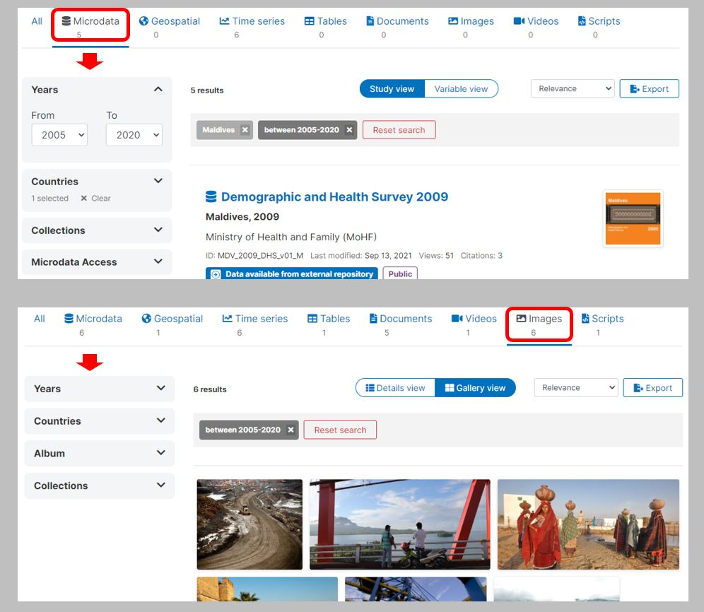{width=100%}

 

For keyword-based search engines, keyword suggestions based on a graph of related words may be helpful to users. Graphs of related words are generated by natural language processing (machine learning) models. The implementation of keyword suggestions based on such graphs requires access to an API that can, in real time, provide suggestions based on a user query. The example below shows a related words graph for the terms "climate change", and the display of the most closely-related terms in a catalog search interface.

 

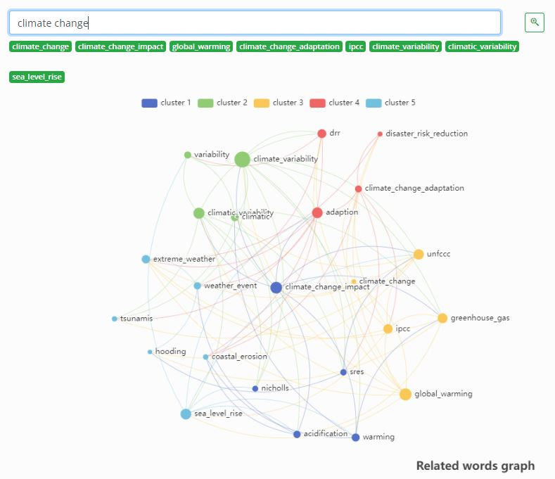{width=100%}

 

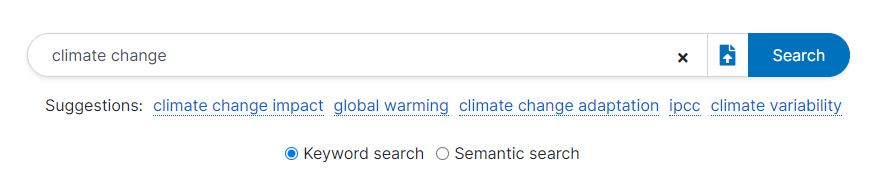{width=100%}

 

The search engine must be able to tolerate spelling mistakes to provide a seamless user experience. These functionalities, such as auto-completion of queries and spell checkers, are independent of the metadata being searched and can be enabled using advanced indexing tools like Solr or ElasticSearch. These tools are designed to optimize performance and deliver efficient search capabilities.

Provide an options for advanced search (targetted search in specific metadata elements), with UI and using syntax in the search box.

{width=100%}

 

#### Lexical and semantic search capability

There are two types of search engines - lexical and semantic. The former matches literal terms in the query to the search engine's index, while the latter aims to identify datasets that have semantically similar metadata to the query. While an ideal data catalog would offer both types of search engines, implementing semantic searchability can be complex. 

In the absence of semantic search, keyword-based searches can still be optimized using tools like Solr or ElasticSearch. Out-of-the-box solutions, such as those provided by SQL databases, rarely deliver satisfactory results. Structured metadata can help optimize search engines by allowing for **boosting** of specific metadata elements. For instance, a query term found in the *title* of a dataset would carry more weight than if it were found in the *notes* element. Similarly, a country name found in the *nation* or *reference country* elements should be given more weight than if it were found in a variable description. Advanced indexing tools like Solr and ElasticSearch provide multiple functionalities to fine-tune search engines and enhance result relevancy. 

#### Flexibility on the query

A search engine should be able to process short or long queries, even accepting a document as a query (when semantic search is implemented). The search engine will then first analyze the semantic content of the document, convert it into an embedding vector, and identify the closest resources available in the catalog. 

{width=100%}

 

{width=100%}

 

#### Results ranking

A search engine not only needs to identify relevant datasets but also must return the results in a proper order of relevance, with the most relevant results at the top of the list. If users fail to find a relevant response among the top results, they may choose to search for data elsewhere. The ability of a search engine to return relevant results in the optimal rank depends on the metadata's content and structure. To optimize the ranking of results, a lot of relevance engineering is required, including tuning advanced search tools like Solr or ElasticSearch. Large data catalogs managed by well-resourced agencies can leverage data scientists to explore the possibility of using machine learning solutions such as "learn-to-rank" to improve result ranking. See section "Improving results ranking" below. For more detailed information, see D. Turnbull and J. Berryman's (2016) in-depth description of tools and methods.

#### Return results by data type

When a data catalog contains multiple types of data, it should offer an easy way for users to filter and display query results by data type. For example, when searching for "US population," one user may only be interested in knowing the total population of the USA, while another may need the public use census microdata sample, and a third may be searching for a publication. To cater to such needs, presenting query results in type-specific tabs (with an "All" option) and/or providing a filter (facet) by type will allow users to focus on the types of data relevant to them. This is similar to commercial platforms that offer search results organized by department, allowing users to search for "keyboard" in either the "music" or "electronics" department.

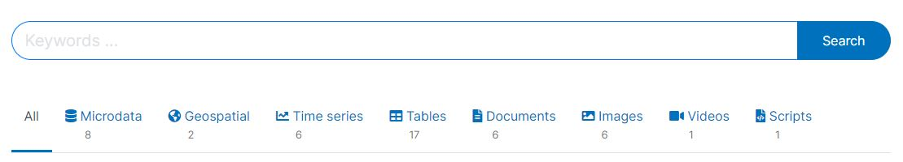{width=100%}

 

#### Filters / facets

Facets or filters are useful for narrowing down datasets based on specific metadata categories. For instance, in a data catalog with datasets from different countries, a "country" facet can help users find relevant datasets quickly. To be effective, filters should be based on metadata elements that have a limited number of categories and a predictable set of options. Controlled vocabularies can be used to enable such filters. Furthermore, as some metadata elements are specific to particular data types, contextual facets should be integrated into the catalog's user interface to offer relevant filters based on the type of data being searched.

{width=100%}

 

Tags and tag groups (which are available in all schemas we recommend) provide much flexibility to implement facets, as we showed in section 1.7. 

#### Variable-level search and comparison

E-commerce platforms commonly allow customers to compare products by displaying their pictures and descriptions (i.e., metadata) side-by-side. Similarly, for data users, the ability to compare datasets can be valuable to evaluate the consistency or comparability of a variable or an indicator over time or across sources and countries. However, to implement this functionality, detailed and structured metadata at the variable level are necessary. These metadata standards, such as DDI and ISO 19110/19139, enable the implementation of this feature. 

In the example below, we show how a query for *water* returns not only a list of seven datasets, but also a list of variables in each dataset that match the query.

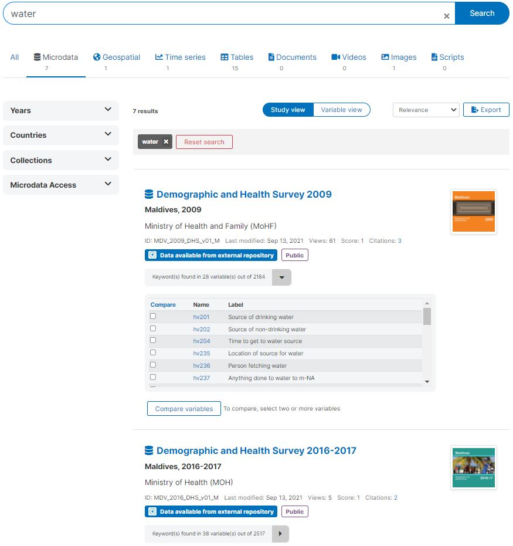{width=100%}

 

The *variable view* shows that a total of 90 variables match the searched keyword.

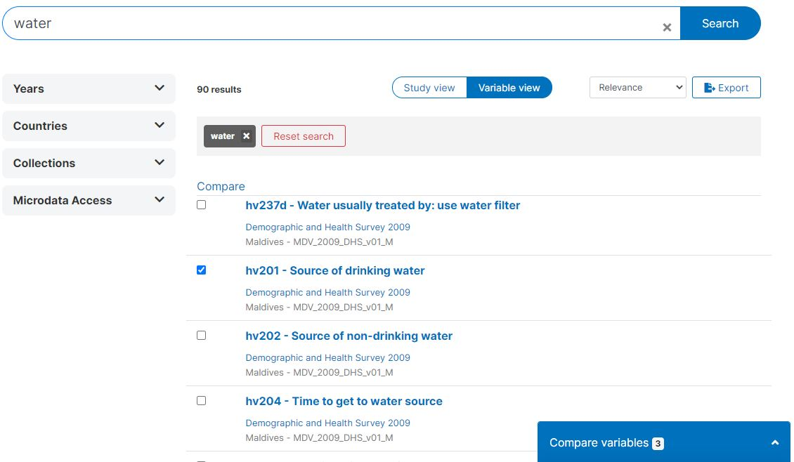{width=100%}

 

After selecting the variables of interest, users should be able to display their metadata in a format that facilitates comparison. The availability of detailed metadata is crucial to ensure the quality and usefulness of these comparisons. For example, when working with a survey dataset, capturing information on the variable universe, categories, questions, interviewer instructions, and summary statistics would be ideal. This comprehensive metadata will enable users to make informed decisions about which variables to use and how to analyze them.

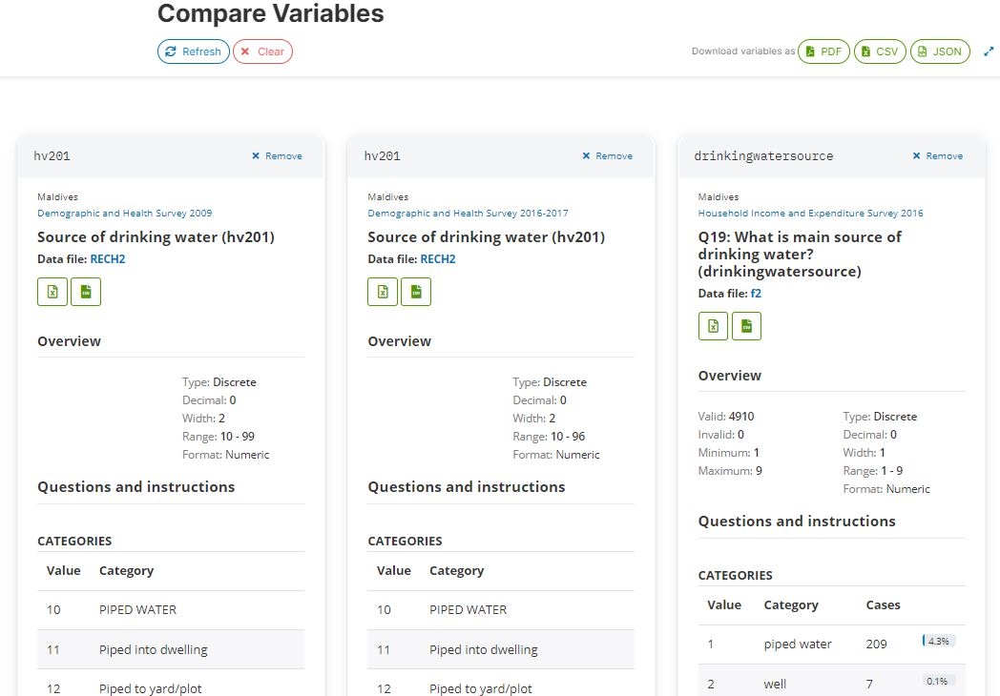{width=100%}

 

#### Metadata display and export

To make metadata easily accessible to users, it's important to display it in a convenient way. The display of metadata will vary depending on the data type being used, as each type uses a specific metadata schema. For online catalogs, style sheets can be utilized to control the appearance of the HTML pages.

In addition to being displayed in HTML format, metadata should be available as electronic files in JSON, XML, and potentially PDF format. Structured metadata provides greater control and flexibility to automatically generate JSON and XML files, as well as format and create PDF outputs. It's important that the JSON and XML files generated by the data catalog comply with the underlying metadata schema and are properly validated. This ensures that the metadata files can be easily and reliably reused and repurposed.

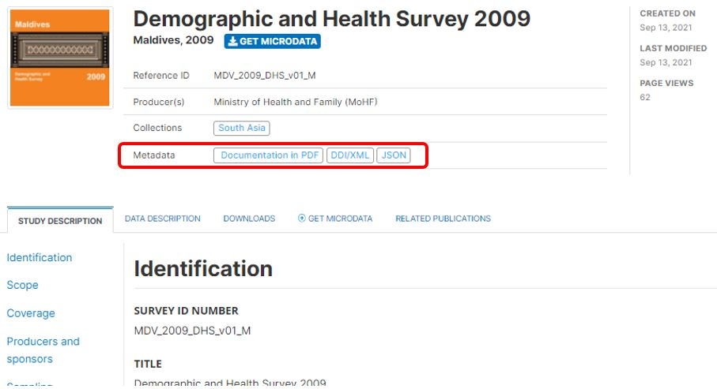{width=100%}

 

#### Data and metadata API

To keep up with modern data management needs, a comprehensive data catalog must provide users with convenient access to both data and metadata through an application programming interface (API). The structured metadata in a catalog allows users to extract specific components of the metadata they need, such as the identifier and title of all microdata and geographic datasets conducted after a certain year. With an API, users can easily and automatically access datasets or subsets of datasets they require. This enables internal features of the catalog such as dynamic visualizations and data previews, making data management more efficient. It is crucial that detailed documentation and guidelines on the use of the data and metadata API are provided to users to maximize the benefits of this feature.

#### Digital Object Identifiers (DOI)

To ensure efficient management and organization of datasets within a data catalog, it is essential to assign a unique identifier to each dataset. This identifier should not only meet technical requirements but also serve other purposes such as facilitating dataset citation. To achieve maximum effectiveness, it is recommended that datasets have a globally unique identifier, which can be accomplished through the assignment of a Digital Object Identifier (DOI). DOIs can be generated in addition to a catalog-specific unique identifier and provide a permanent and persistent identifier for the dataset. For more information about the process of generating DOIs and the reasons to use them, visit the [DataCite website](https://datacite.org/).   

#### Relationships and recommendations

Not all data catalog users know exactly what they are looking for and may need to explore the catalog to find relevant resources. E-commerce platforms use recommender systems to suggest products to customers, and data catalogs should have a similar commitment to bringing relevant resources to users' attention. To achieve this, modern data catalogs display relationships between entries, which may involve data of different types, such as microdata files, analytical scripts, and working papers.

These relationships can be documented in the metadata, such as identifying datasets as part of a series or new versions of a previous dataset. When relationships are not known or documented, machine learning tools such as topic models and word embedding models can be used to establish the topical or semantic closeness between resources of different types. This can be used to implement a recommender system in data catalogs, which automatically identifies and displays related documents and data for a given resource. The image below shows how "related documents" and "related data" can be automatically identified and displayed for a resource (in this case a document).

{width=100%}

 

#### Clarity in access policies

The terms of use (ideally provided in the form of a standard license) and the conditions of access to data should be made transparent and visible in the data catalog. The access policy will preferably be provided using a controlled vocabulary, which can be used to enable a facet (filter) as shown in the screenshot below.

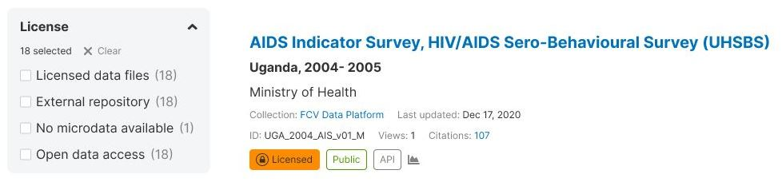{width=100%}

 

#### Visualizations

Embedding visualizations in a data catalog can greatly enhance its usefulness. Different types of data require different types of visualizations. For instance, time series data can be effectively displayed using a line chart, while images with geographic information can be displayed on a map that shows the location of the image capture. For more complex data, other types of charts can be created as well. However, in order to embed dynamic charts in a catalog page, the data needs to be available via API. A good data catalog should offer flexibility in the types of charts and maps that can be embedded in a metadata page. For instance, the NADA catalog provides catalog administrators with the ability to create visualizations using various tools. By including visualizations in a data catalog, users are able to quickly and easily understand the data and gain insights from it.

The NADA catalog allows catalog adinistrators to generate such visualizations using different tools of their choice. The example below were generated using the open-source [Apache eCharts](https://echarts.apache.org/en/index.html) library.

 
*Example: Line chart for a time series*

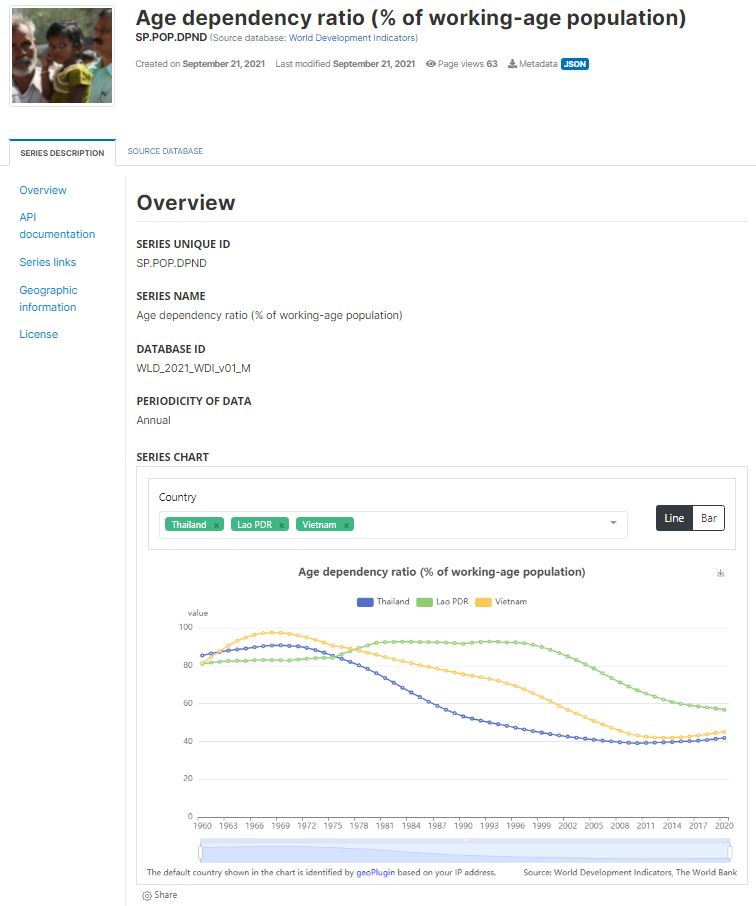{width=100%}

 
*Example: Geo-location of an image*

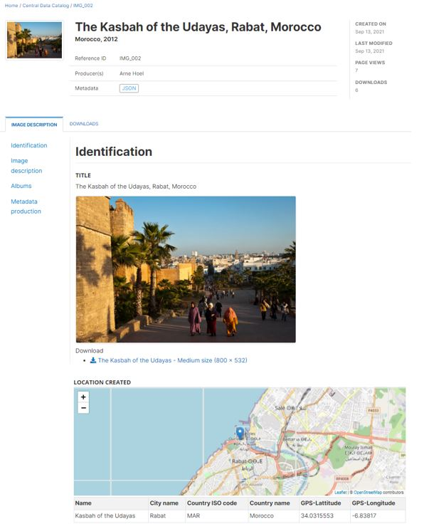{width=100%}

 

#### Data preview

When the data (time series and tabular data, possibly also microdata) are made available via API, the data catalog can also provide a data preview option, and possibly a data extraction option, to the users. Multiple JavaScript tools, some of them open-source, are available to easily embed data grids in catalog pages.

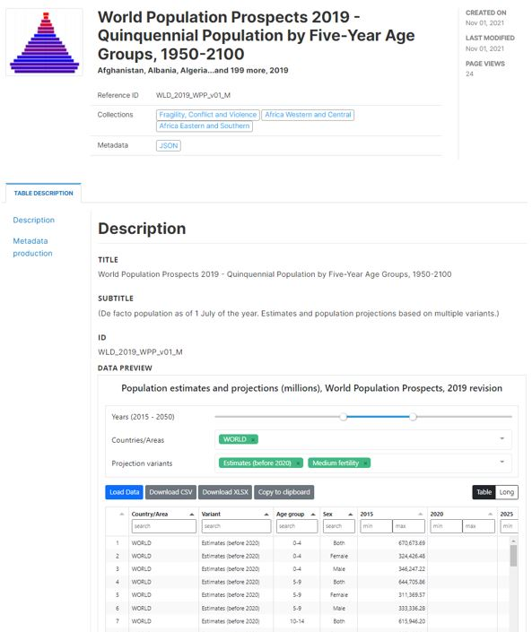{width=80%}

#### Accessible to all

Web Content Accessibility Guidelines (WCAG) international standard. WCAG documents explain how to make web content more accessible to people with disabilities.
ADA provides people with disabilities the same opportunities, free of discrimination.
WCAG is a compilation of accessibility guidelines for websites, whereas ADA is a civil rights law in the same ambit.

#### Reproducible and replicable scripts

 

 

#### Citations

Maintain a catalog of citations of datasets. 

 

 

### What data contributors want

Safety
Visibility
"do not disturb"
Monitoring of usage (downloads and citations)

### What catalog administrators want

In addition to meeting the needs of its users, a modern data catalog should also offer features that a catalog administrator can appreciate or expect. These features may include:

- Availability of the application as an open-source software, accompanied by detailed technical documentation
- Robust security measures, such as compatibility with advanced authentication systems, flexible role/profile definitions, regular upgrades and security patches, and accreditation by information security experts
- Reasonable IT requirements, such as shared server operability and sufficient memory capacity
- Ease of upgrading to the latest version
- Interoperability with other catalogs and applications, as well as compliance with metadata standards. By publishing metadata across multiple catalogs and hubs, data visibility can be increased, and the service provided to users can be maximized. This requires automation to ensure proper synchronization between catalogs (with only one catalog serving as the "owner" of a dataset), which necessitates interoperability between the catalogs, enabled by compliance with common formats and metadata standards and schemas.
- Flexibility in implementing data access policies that conform to the specific procedures and protocols of the organization managing the catalog
- Availability of APIs for catalog administration
- Ability to feature datasets
- Easy activation of usage analytics (using Google Analytics, Omniture, or other)
- Multilingual capability, including internationalization of the code and the option for catalog administrators to translate or adapt software translations
- Advanced search engine functionality
- Ability to implement semantic search and recommender systems using external APIs
- Embedded Search Engine Optimization (SEO) procedures
- Ability to use widgets to embed custom charts, maps, and data grids in the catalog
- Ability to provide feedback and suggestions to the application developers.
   
 
## Machine learning for improved user experience

In Chapter 1, we emphasized the importance of generating comprehensive metadata and how machine learning can be leveraged to enrich it. Natural language processing (NLP) tools and models, in particular, have been employed to enhance the performance of search engines. By utilizing machine learning models, semantic search engines and recommender systems can be developed to aid users in locating relevant data. Moreover, machine learning can improve the ranking of search results to ensure that the most pertinent results are brought to users' attention. Google, Bing, and other leading search engines have employed machine learning for years. While specialized data catalogs may not have the resources to implement such advanced systems, catalog administrators should explore opportunities to utilize machine learning to enhance their users' experience. Catalogs can make use of external APIs to exploit machine learning solutions without requiring administrators to develop machine learning expertise or train their own models. For instance, APIs can be used to automatically and instantly translate queries or convert queries into embeddings. Ideally, a global community of practice will develop such APIs, including training NLP models, and provide them as a global public good.  

### Improving discoverability

In 2019, Google introduced their NLP model, BERT (Biderectional Encoder Representations from Transformers), as a component of their search engine. Other major companies, such as Amazon, Apple, and Microsoft, are also developing similar models to enhance their search engines. One of the objectives of these companies is to create search engines that can support digital assistants like Siri, Alexa, Cortana, and Hey Google, which operate on a conversational mode and provide answers to users rather than just links to resources. Improving NLP models is a continuous and strategic priority for these companies, as not all answers can be found in textual resources. Google is also conducting research to develop solutions for extracting answers from tabular data.

Specialized data catalogs maintained by data centers, statistical agencies, and other data producers still rely almost exclusively on full-text search engines. The search engine within these catalogs looks for matches between keywords submitted by the user and keywords found in an index, without attempting to understand or improve the user's query. This can result in issues such as misinterpretation of the query, as discussed in Chapter 1, where a search for "dutch disease" may be mistakenly interpreted as a health-related query rather than an economic concept.

The administrators of these specialized data catalogs often lack the resources to develop and implement the most advanced NLP solutions, and should not be required to do so. To assist them in transitioning from keyword-based search systems to semantic search and recommender systems, open solutions should be developed and published, such as pre-trained NLP models, open source tools, and open APIs. This would necessitate the creation and publishing of global public goods, including specialized corpora and the training of embedding models on these corpora, open NLP models and APIs that data catalogs can utilize to generate embeddings for their metadata, query parsers that can automatically improve/optimize queries and convert them into numeric vectors, and guidelines for implementing semantic search and recommender systems using tools like Solr, ElasticSearch, and Milvus.

Simple models created from open source tools and publicly-available documents can provide straightforward solutions. In the example below, we demonstrate how these models can "understand" the concept of "dutch disease" and correctly associate it with relevant economic concepts.

 

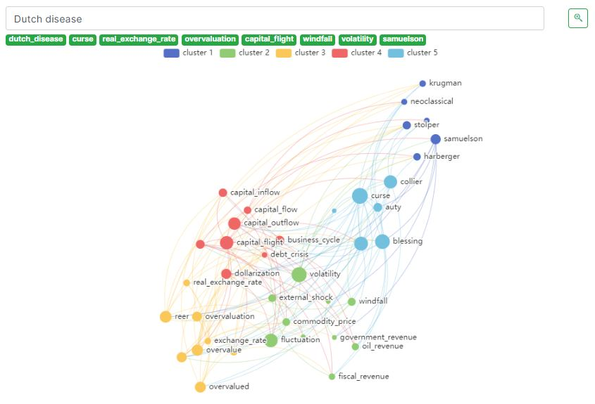{width=100%}

 

### Improving results ranking

Effective search engines not only identify relevant resources, but also rank and present them to users in an optimal order of relevance. As highlighted in Chapter 1, [research](https://www.webfx.com/internet-marketing/seo-statistics.html) shows that 75% of search engine users do not click past the first page, emphasizing the importance of ranking and presenting results effectively.

Data catalog administrators face two challenges in improving their search engine performance. Firstly, they need to improve their ranking in search engines such as Google by enriching metadata and embedding metadata compliant with DCAT or schema.org standards on catalog pages. Secondly, they need to improve the ranking of results returned by their own search engines in response to user queries.

Google's success in 1996 was largely attributed to their revolutionary approach to ranking search results called *PageRank*. Since then, they and other leading search engines have invested heavily in improving ranking methodologies with advanced techniques like *RankBrain* (introduced in 2015). These approaches include primary, contextual, and user-specific ranking, which utilize machine learning models referred to as Learn to Rank models. [Lucidworks](https://lucidworks.com/post/abcs-learning-to-rank/) provides a clear description of this approach, noting that "Learning to rank (LTR) is a class of algorithmic techniques that apply supervised machine learning to solve ranking problems in search relevancy. In other words, it’s what orders query results. Done well, you have happy employees and customers; done poorly, at best you have frustrations, and worse, they will never return. To perform learning to rank you need access to training data, user behaviors, user profiles, and a powerful search engine such as SOLR. The training data for a learning to rank model consists of a list of results for a query and a relevance rating for each of those results with respect to the query. Data scientists create this training data by examining results and deciding to include or exclude each result from the data set."

Implementing Learn to Rank models can be challenging for data catalog administrators due to the resource-intensive nature of building the training dataset, fitting models, and implementing them. An alternative solution is to optimize the implementation of Solr or ElasticSearch, which can often contribute significantly to improving the ranking of search results. For more information on the challenge and available tools and methods for relevancy engineering, refer to D. Turnbull and J. Berryman's 2016 publication.

 

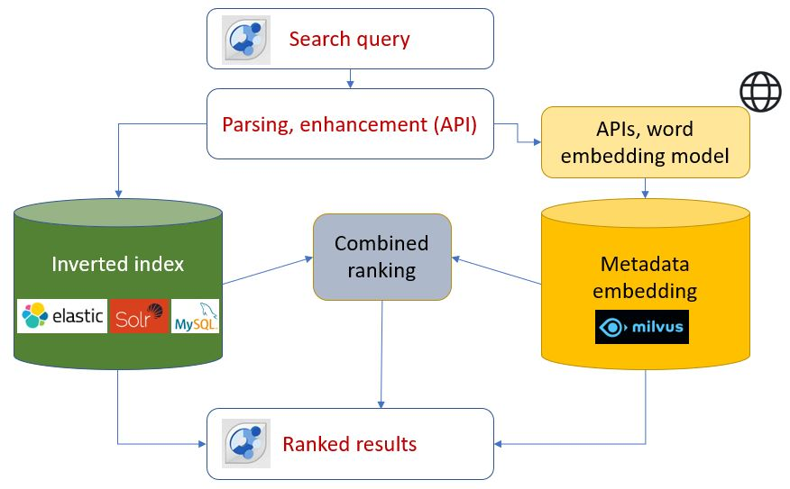{width=100%}

 

## Cataloguing tools

The examples we provided in this chapter are taken from our NADA cataloguing application. Other open-source cataloguing applications are available, including CKAN, GeoNetworks, and Dataverse. 

**CKAN**

[CKAN](https://ckan.org/) is a data management system that provides a platform for cataloging, storing and accessing datasets with a rich front-end, full API (for both data and catalog), visualization tools and more. CKAN is an open source software held in trust by Open Knowledge Foundation. It is open and licensed under the GNU Affero General Public License (AGPL) v3.0. CKAN is used by some of the lead open data platforms, such as the [US data.gov](https://www.data.gov/) or the [OCHA Humanitarian Data Exchange](https://data.humdata.org/). CKAN does not require that the metadata comply with any metadata standard (which brings flexibility, but at a cost in terms of discoverability and quality control), but organizes the metadata in the following elements (information extracted from [CKAN on-line documentation](https://docs.ckan.org/en/2.9/)): 

   - *Title*: allows intuitive labeling of the dataset for search, sharing and linking.
   - *Unique identifier*: dataset has a unique URL which is customizable by the publisher.
   - *Groups*: display of which groups the dataset belongs to if applicable. Groups (such as science data) allow easier data linking, finding and sharing among interested publishers and users.
   - *Description*: additional information describing or analyzing the data. This can either be static or an editable wiki which anyone can contribute to instantly or via admin moderation.
   - *Data preview*: preview [.csv] data quickly and easily in browser to see if this is the dataset you want.
   - *Revision history*: CKAN allows you to display a revision history for datasets which are freely editable by users 
   - *Extra fields*: these hold any additional information, such as location data (see geospatial feature) or types relevant to the publisher or dataset. How and where extra fields display is customizable.
   - *Licence*: instant view of whether the data is available under an open license or not. This makes it clear to users whether they have the rights to use, change and re-distribute the data.
   - *Tags*: see what labels the dataset in question belongs to. Tags also allow for browsing between similarly tagged datasets in addition to enabling better discoverability through tag search and faceting by tags.
   - *Multiple formats* (if provided): see the different formats the data has been made available in quickly in a table, with any further information relating to specific files provided inline.
   - *API key*: allows access every metadata field of the dataset and ability to change the data if you have the relevant permissions via API.

The *extra fields* section allows ingestion of structured metadata, which makes it relatively easy to exporting data and metadata from NADA to CKAN. Importing data and metadata from CKAN to NADA is also possible (using the catalog's respective APIs), but with a reduced metadata structure.

**GeoNetworks**

[GeoNetworks](https://geonetwork-opensource.org/) is a cataloguing tool for geographic data and services (not for other types of data), which includes a specialized metadata editor. According to its website, "It provides powerful metadata editing and search functions as well as an interactive web map viewer. It is currently used in numerous Spatial Data Infrastructure initiatives across the world. (...) The metadata editor support ISO19115/119/110 standards used for spatial resources and also Dublin Core format usually used for opendata portals." 

**DataVerse**

The [Dataverse Project](https://dataverse.org/about) is led by the Institute for Quantitative Social Science (IQSS). Dataverse makes use of the DDI Codebook and Dublin Core metadata standards. According to its website, Dataverse "is an open source web application to share, preserve, cite, explore, and analyze research data. (...) The central insight behind the Dataverse Project is to automate much of the job of the professional archivist, and to provide services for and to distribute credit to the data creator." 

"The Institute for Quantitative Social Science (IQSS) collaborates with the Harvard University Library and Harvard University Information Technology organization to make the installation of the Harvard Dataverse Repository openly available to researchers and data collectors worldwide from all disciplines, to deposit data. IQSS leads the development of the open source Dataverse Project software and, with the Open Data Assistance Program at Harvard (a collaboration with Harvard Library, the Office for Scholarly Communication and IQSS), provides user support." 
