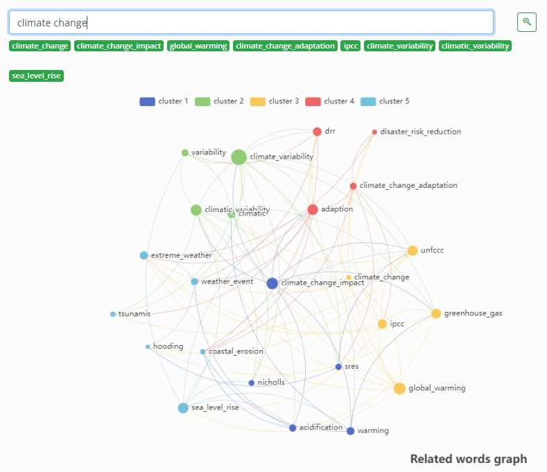
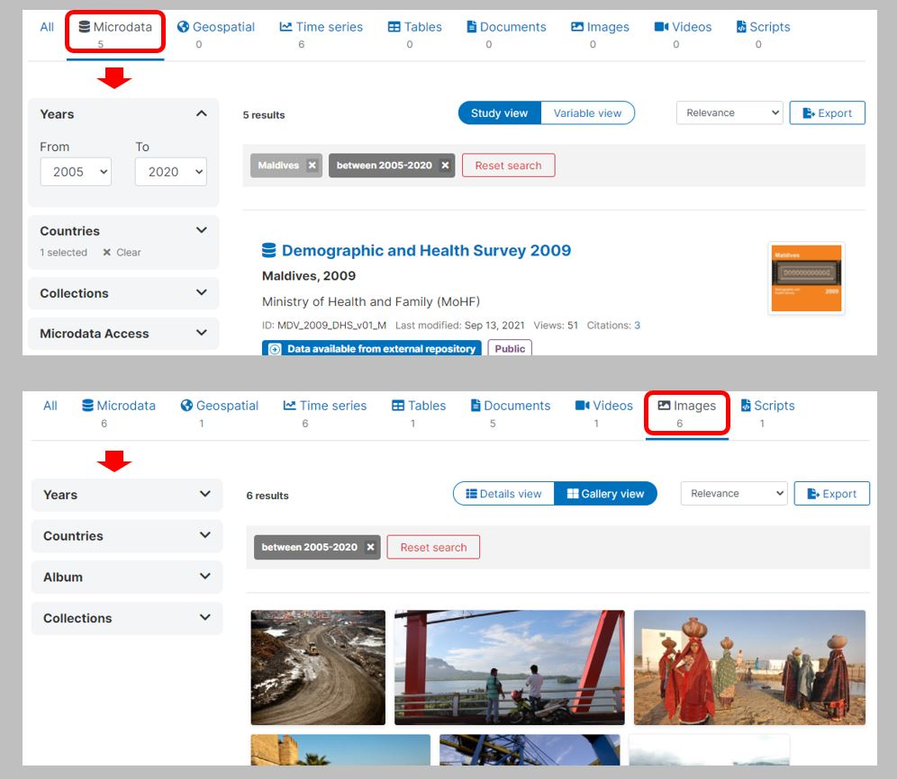
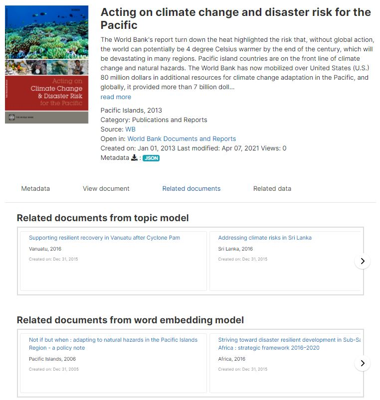
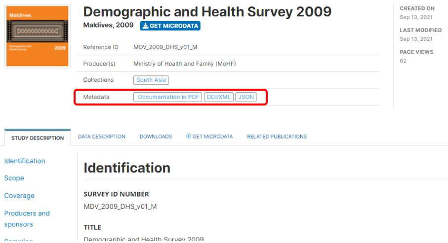
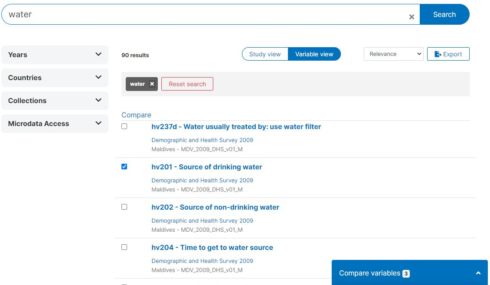
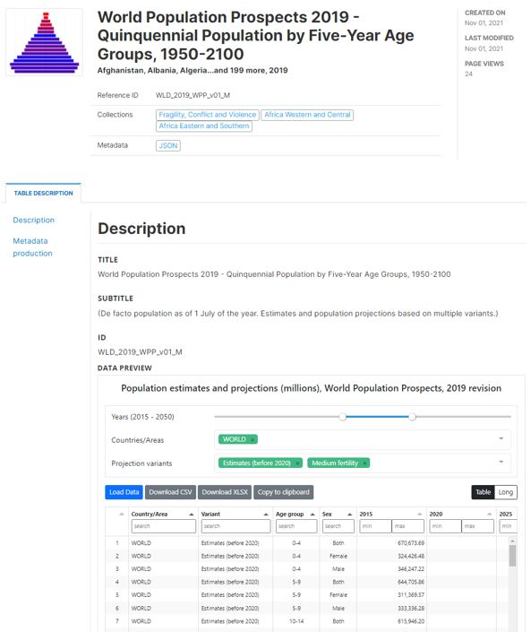
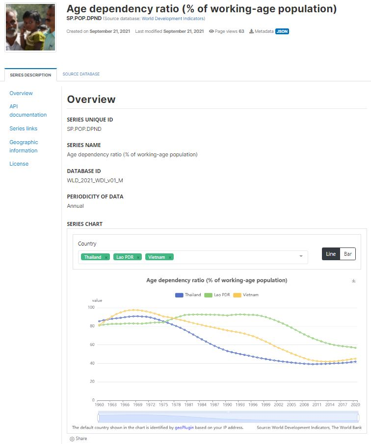
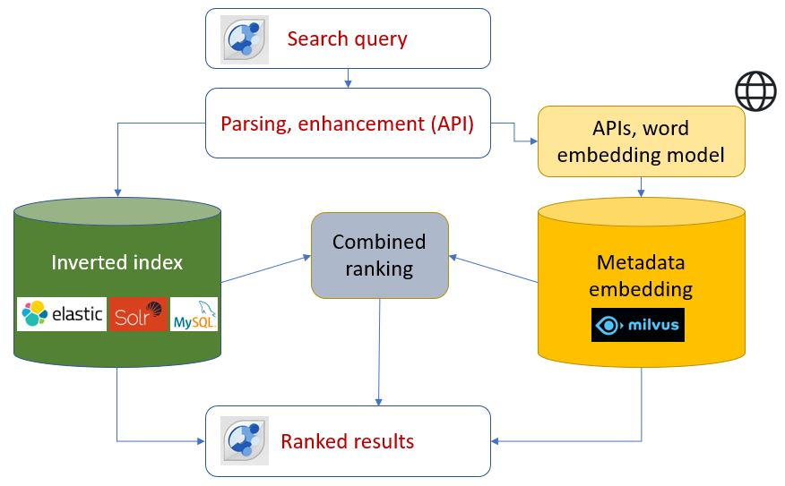

# The features of a modern data dissemination platform {#chapter02}

In the introductory section of this Guide, we proposed that modern data dissemination platforms should be modeled after the most successful e-commerce platforms. These platforms are optimized to serve both buyers (in our context, the data users) and sellers (in our context, the data providers) in the most efficient manner. In this chapter, we outline features that a modern online data catalog should incorporate to adhere to this model.

We provide recommendations for developing data catalogs that encompass lexical search and semantic search, filtering, advanced search functionality, interactive user interfaces, and the capability to operate as recommender systems. We approach the topic from three distinct perspectives: the viewpoint of **data users**, who represent a highly diverse community with varying needs, preferences, expectations, and capabilities; the standpoint of **data suppliers**, who either publish their data or delegate the task to a data library; and the perspective of **catalog administrators**, responsible for curating and disseminating data in a responsible, effective, and efficient manner while optimizing both user and supplier satisfaction.

The creation of a contemporary data dissemination platform is a collaborative endeavor, engaging data curators, user experience (UX) experts, designers, search engineers, and subject matter specialists with a profound understanding of both the data and the users' requirements and preferences. Inclusive in this development process should be the active participation of the users, allowing them to provide feedback that directly influences the system's design.

The examples we provided in this chapter are taken from our NADA cataloguing application. Other open-source cataloguing applications are available. 

## Features for data users 

In order to cultivate a favorable user experience, online data catalogs must offer an intuitive and efficient interface, allowing users to effortlessly access the most pertinent datasets. To meet user expectations effectively, one should emphasize simplicity, predictability, relevance, speed, and reliability. Integrating these principles into the design of data catalogs can deliver a seamless and user-friendly experience, akin to the convenience and ease provided by internet search engines and e-commerce platforms. This, in turn, streamlines the process of discovering and obtaining the necessary data, making it quick and hassle-free for users.

### Browser

Some users will just want to browse a catalog. This should be made easy. The use of cards is recommended. For images, a mosaic view can be provided. For microdata, a variable view.

### Simple search interface

The default option to search for data in a specialized data catalog must be a single search box. Not all users can be expected to provide ideal queries. The search engine must be able to tolerate spelling mistakes. Auto-completion and spell checkers of queries can be enabled using indexing tools such as Solr or ElasticSearch. The query can be entered using the keyboard or audio.

 

 

The search engine must be able to "understand" the user's query and to return the most relevant results ranked in order of importance. This may require an automated process of query parsing and enhancement. AMong other things, the query parsing may derive information on: 
- the type of data that are of interest
- whether the query is related to one or a few specific indicators available in the catalog assets
- whether a geographic location is mentioned
- whether a time is mentioned
- whether a keyword search or a semantic search is most appropriate
- detect the language of the query, and translate if appropriate

Based on this information, the application should be able to determine whether an immediate answer could be provided, and whether the answer should be textual, a data grid, or a visualization.

### Document as a query

A search engine with semantic search capability should be able to process short or long queries, even accepting a document (a PDF or a TXT file) as a query. The search engine will then first analyze the semantic content of the document, convert it into an embedding vector, and identify the closest resources available in the catalog. 

 

 

### Suggested queries

After processing a user query, the application can provide suggestions for related keywords. This can be implemented using a graph of related words generated by natural language processing (NLP) models. Access to an API is necessary to implement keyword suggestions based on such graphs. The example below shows a related words graph for the terms "climate change" as returned by an NLP model.

 

{width=100%}

 

A search interface could retrieve such information via API and display it as follows:

 

{width=100%}

 

### Advanced search 

It is useful also to provide users with an option to build a more advanced search, targetted to specific metadata elements and with boolean operators. Advanced search are enabled by structured metadata, i.e., by the use of metadata standards and schemas. The advanced search should be available as a user interface and using a syntax option. The interface could be as follows:

 

{width=85%}

 

This would correspond to the following syntax that the user could enter directly in the search box (and save and/or share with others):
 

**title:"demographic transition" AND country:(*Kenya*) AND body:(poverty)**

 

### Geographic search

Data catalogs receive numerous queries that are related to a particular geography. Analysis of millions of queries from the World Bank (WB) and International Monetary Fund (IMF) data catalogs revealed that a significant percentage of queries consist of a single country name. For data catalogs that cover multiple countries, creating a "Country page" can provide a quick overview of the most recent and popular datasets of different types, which many users may find helpful.

However, geography is not limited to countries alone. Many users may be interested in sub-national data or geographic areas that do not correspond to administrative areas, such as a watershed or an ocean. Especially when a data catalog contains geographic datasets, it is recommended to provide specialized search tools. Most metadata standards allow the use of bounding boxes to specify geographic coverage, which could be used to develop a "search" tool that enables a user to draw a box on a map. But this option is very imperfect (explain why).

Example from data.gov (https://catalog.data.gov/dataset/?metadata_type=geospatial)
 

 

For geographic datasets, geographic indexing is recommended. The H3 index is a powerful option. (describe)

Also, one must take into account that many users will rely on a keywords search to identify data. For example, a raster image of the Philippines (e.g., dataset from a satellite imagery) will contain the country name in the metadata, but the metadata cannot contain the name of all geographic areas coveregd by the data. A user looking for "Iloilo" for example would not find this relevant dataset based on a simple keyword search. The solution would be for the search engine to parse the query, detect if it contains the name of a geographic area, automatically identify the area (polygon of geographic coordinates) that corresponds to it (possibly using an API built around Nominatim), and retrieve resources in the catalog that cover the area (which requires that the datasets in the catalog be indexed geographically).  

(describe how this works - illustrate from our KCP project "Indexing the world").   

 

 

Example of use of Nominatim: The Nominatim application shows the polygon boundary for the search query “Iloilo City” automatically provided by the API.

 

 

The search API endpoint of Nominatim returns this JSON data which can be processed to generate search cell(s).

 

 

### Query user interface

For time series only

### Semantic search and recommendations

There are two types of search engines: lexical and semantic. The former matches literal terms in the query to the search engine's index, while the latter aims to identify datasets that have semantically similar metadata to the query. While an ideal data catalog would offer both types of search engines, implementing semantic searchability can be complex.

(explain how semantic search workd for different data types - with embeddings and vector indexing and cosine similarity - use of API)

For microdata: embeddings based on thematic variable groupings - an option to implement semantic search and recommendations
Discovery of microdata poses specific challenges. Typically, a data dictionary will be available, with variables organized by data file. A "virtual" organization of variables by thematic group, with a pre-defined ontology, can significantly improve data discoverability. AI solutions can be used to generate such groupings and map variables to them. The DDI metadata standard provides the metadata elements needed to store information on variable groups.

### Latest additions and history

The catalog must provide a list of the most recent additions, and a history of additions and updates.
For each entry, information must be available on the date the entry was first added to the catalog, and when it was last updated.
When a dataset is replaced with a new version, the versioning must be clear.

 

 

### Customized views 

Build your own dashboards
- Allo users to set preferences: thematic, data type, geographies, search query
- Have a page where pre-designed dashboards (country/thematic pages) and custom dashboard are accessible
- Allow sharing of dashboards
- Core idea: all data and metadata accessible via API; platform operates as a service to feed dashboards (within the platform or external) 

### Data and metadata as a service

- Maintain a data service: let external users build dashboards/poaltorms dynamically connected via API; one organization cannot customize to all communities of users.

### Ranking results 

A search engine not only needs to identify relevant datasets but also must return the results in a proper order of relevance, with the most relevant results at the top of the list. If users fail to find a relevant response among the top results, they may choose to search for data elsewhere. The ability of a search engine to return relevant results in the optimal rank depends on the metadata's content and structure. To optimize the ranking of results, a lot of relevance engineering is required, including tuning advanced search tools like Solr or ElasticSearch. Large data catalogs managed by well-resourced agencies can leverage data scientists to explore the possibility of using machine learning solutions such as "learn-to-rank" to improve result ranking. See section "Improving results ranking" below. For more detailed information, see D. Turnbull and J. Berryman's (2016) in-depth description of tools and methods.

Keyword-based searches can be optimized using tools like Solr or ElasticSearch. Out-of-the-box solutions, such as those provided by SQL databases, rarely deliver satisfactory results. Structured metadata can help optimize search engines and the ranking of results by allowing for the boosting of specific metadata elements. For instance, a query term found in the *title* of a dataset would carry more weight than if it were found in the *notes* element, and the results would be ranked accordingly. Similarly, a country name found in the *nation* or *reference country* metadata elements should be given more weight than if it were found in a variable description. Advanced indexing tools like Solr and ElasticSearch provide boosting functionalities to fine-tune search engines and enhance result relevancy.

### Filtering results

Facets or filters are useful for narrowing down datasets based on specific metadata categories. For instance, in a data catalog with datasets from different countries, a "country" facet can help users find relevant datasets quickly. To be effective, filters should be based on metadata elements that have a limited number of categories and a predictable set of options. Controlled vocabularies can be used to enable such filters. Furthermore, as some metadata elements are specific to particular data types, contextual facets should be integrated into the catalog's user interface to offer relevant filters based on the type of data being searched.

{width=100%}

 

Tags and tag groups (which are available in all schemas we recommend) provide much flexibility to implement facets, as we showed in section 1.7. 

(use pills / ...)

### Sorting results

Sorting results

### Collections

Organize entries by collections
Thematic or other

### Linking results 

Not all data catalog users know exactly what they are looking for and may need to explore the catalog to find relevant resources. E-commerce platforms use recommender systems to suggest products to customers, and data catalogs should have a similar commitment to bringing relevant resources to users' attention. To achieve this, modern data catalogs display relationships between entries, which may involve data of different types, such as microdata files, analytical scripts, and working papers.

These relationships can be documented in the metadata, such as identifying datasets as part of a series or new versions of a previous dataset. When relationships are not known or documented, machine learning tools such as topic models and word embedding models can be used to establish the topical or semantic closeness between resources of different types. This can be used to implement a recommender system in data catalogs, which automatically identifies and displays related documents and data for a given resource. The image below shows how "related documents" and "related data" can be automatically identified and displayed for a resource (in this case a document).

{width=100%}

 

### Organized results

When a data catalog contains multiple types of data, it should offer an easy way for users to filter and display query results by data type. For example, when searching for "US population," one user may only be interested in knowing the total population of the USA, while another may need the public use census microdata sample, and a third may be searching for a publication. To cater to such needs, presenting query results in type-specific tabs (with an "All" option) and/or providing a filter (facet) by type will allow users to focus on the types of data relevant to them. This is similar to commercial platforms that offer search results organized by department, allowing users to search for "keyboard" in either the "music" or "electronics" department.

{width=100%}

 

### Saving and sharing results

URL / API query ; export list ; social networks, etc.

### Personalized results

Option for user to set a profile with preferences that may be used to display results. 

### Metadata display and formats

To make metadata easily accessible to users, it's important to display it in a convenient way. The display of metadata will vary depending on the data type being used, as each type uses a specific metadata schema. For online catalogs, style sheets can be utilized to control the appearance of the HTML pages.

In addition to being displayed in HTML format, metadata should be available as electronic files in JSON, XML, and potentially PDF format. Structured metadata provides greater control and flexibility to automatically generate JSON and XML files, as well as format and create PDF outputs. It's important that the JSON and XML files generated by the data catalog comply with the underlying metadata schema and are properly validated. This ensures that the metadata files can be easily and reliably reused and repurposed.

{width=100%}

 

### Variable-level comparison

E-commerce platforms commonly allow customers to compare products by displaying their pictures and descriptions (i.e., metadata) side-by-side. Similarly, for data users, the ability to compare datasets can be valuable to evaluate the consistency or comparability of a variable or an indicator over time or across sources and countries. However, to implement this functionality, detailed and structured metadata at the variable level are necessary. These metadata standards, such as DDI and ISO 19110/19139, enable the implementation of this feature. 

In the example below, we show how a query for *water* returns not only a list of seven datasets, but also a list of variables in each dataset that match the query.

{width=100%}

 

The *variable view* shows that a total of 90 variables match the searched keyword.

{width=100%}

 

After selecting the variables of interest, users should be able to display their metadata in a format that facilitates comparison. The availability of detailed metadata is crucial to ensure the quality and usefulness of these comparisons. For example, when working with a survey dataset, capturing information on the variable universe, categories, questions, interviewer instructions, and summary statistics would be ideal. This comprehensive metadata will enable users to make informed decisions about which variables to use and how to analyze them.

{width=100%}

 

### Transparency in access policies

The terms of use (ideally provided in the form of a standard license) and the conditions of access to data should be made transparent and visible in the data catalog. The access policy will preferably be provided using a controlled vocabulary, which can be used to enable a facet (filter) as shown in the screenshot below.

{width=100%}

 

### Data and metadata API

To keep up with modern data management needs, a comprehensive data catalog must provide users with convenient access to both data and metadata through an application programming interface (API). The structured metadata in a catalog allows users to extract specific components of the metadata they need, such as the identifier and title of all microdata and geographic datasets conducted after a certain year. With an API, users can easily and automatically access datasets or subsets of datasets they require. This enables internal features of the catalog such as dynamic visualizations and data previews, making data management more efficient. It is crucial that detailed documentation and guidelines on the use of the data and metadata API are provided to users to maximize the benefits of this feature.

Metadata (and data) should be accessible via API
The API should be well documented with examples.
API query builder: UI for building an API query

### Online data access forms 

Make the process of registration, requests fully digital, easy, and fully traceable.

#### Bulk download option

Even when UI or visualizations etc are shown, many users just want to downlaod the data and metadata.
(...)

### Data preview

When the data (time series and tabular data, possibly also microdata) are made available via API, the data catalog can also provide a data preview option, and possibly a data extraction option, to the users. Multiple JavaScript tools, some of them open-source, are available to easily embed data grids in catalog pages.

{width=80%}

For a document, the "data preview" would consist of a document viewer that would allow the user to view the document within the application (even when the document is not stored in the catalog itself but in an external website). When implementing such a feature, check that the terms of use of the origination source allows that.

 

 

### Data extraction

For some data (microdata / time series), provide a simple way for users to extract specific variables / observations.

### Data visualizations

Embedding visualizations in a data catalog can greatly enhance its usefulness. Different types of data require different types of visualizations. For instance, time series data can be effectively displayed using a line chart, while images with geographic information can be displayed on a map that shows the location of the image capture. For more complex data, other types of charts can be created as well. However, in order to embed dynamic charts in a catalog page, the data needs to be available via API. A good data catalog should offer flexibility in the types of charts and maps that can be embedded in a metadata page. For instance, the NADA catalog provides catalog administrators with the ability to create visualizations using various tools. By including visualizations in a data catalog, users are able to quickly and easily understand the data and gain insights from it.

The NADA catalog allows catalog adinistrators to generate such visualizations using different tools of their choice. The example below were generated using the open-source [Apache eCharts](https://echarts.apache.org/en/index.html) library.

 
*Example: Line chart for a time series*

{width=100%}

 
*Example: Geo-location of an image*

{width=100%}

 

### Permanent URLs 

To ensure efficient management and organization of datasets within a data catalog, it is essential to assign a unique identifier to each dataset. This identifier should not only meet technical requirements but also serve other purposes such as facilitating dataset citation. To achieve maximum effectiveness, it is recommended that datasets have a globally unique identifier, which can be accomplished through the assignment of a Digital Object Identifier (DOI). DOIs can be generated in addition to a catalog-specific unique identifier and provide a permanent and persistent identifier for the dataset. For more information about the process of generating DOIs and the reasons to use them, visit the [DataCite website](https://datacite.org/).   

Include a citation requirement in metadata.

### Archive / tombstone

When a dataset is removed or replaced, the reproducibility of some analysis may become impossible. This may be a problem for some users. Unless there is a reason for not making them accessible, old versions of datasets should be kept accessible. But they should not be the ones indexed and dislayed in the catalog, to avoid cnfusion or the risk that a user would exploit a version other than the latest. Moving datasts that are replaced to an archive section of the catalog (not indexed) is an option. Note that DOIs require a permanent web page.

### Catalog of citations

A data catalog should not be limited to data. Ideally, the scripts produced by researchers to analyze the data, and the output of their analysis, should also be available. An ideal data catalog will allow a user to:

- search for data, and find/access the related scripts and citations
- search for a document (analytical output), and find/access the related data and scripts
- search for a script, and find/access the data and analytical output

Maintain a catalog of citations of datasets. 

 

 

### Reproducible and replicable scripts

Document, catalog, and publish reproducible/replicable scripts.

 

 

### Notifications or alerts

Users may want to be automatically notified (by email) when new entries of interest are added, or when change are made to a specific resource. A system allowing users to set criteria for automatic notification can be developed.

Example of Google SCholar alerts:

 

 

### Providing feedback

Feedback on catalog certainly. In the form of a "Contact" email and possibly a "feedback form". Also, if the platform itself is open source, GitHub for issues and suggestions on the application itself.

BUT: Users forum, "reviews" as in e-commerce platforms, is not always recommended. Not all users are 'constructive" and qualified. Requires moderation, which can be costly and controversial. May create dis-incentives for data producers to publish their data. Could be a good option for data platforms that are internal to an organization (where comments are attributed, and an authentication system controls who can provide feedback), but not for public data platforms.

### Getting support

Contact, responsive
FAQs

### Web content accessibility

Web Content Accessibility Guidelines (WCAG) international standard. WCAG documents explain how to make web content more accessible to people with disabilities.
ADA provides people with disabilities the same opportunities, free of discrimination.
WCAG is a compilation of accessibility guidelines for websites, whereas ADA is a civil rights law in the same ambit.

## Features for data providers 

When the data catalog is not administered by the producer of the data but by an entrusted repository, data providers want:

### Safety

- Safety, protection against reputation risk (responsible use of data)
- Guarantee that regulations and terms of use will be strictly complied with; reputation of the organization that manages the catalog (Seal of Approval or other accreditation; properly staffed)

### Visibility

- Visibility to maximize the use of data (including options to share/publicize on social media) - screenshot from data.gov

 

 

### Low burden

"do not disturb": low burden of deposit and no burden of serving users (minimum interaction with users; providing detailed metadata helps)

### Real time information on usage

Monitoring of usage (downloads and citations) to assess demand; reports on this (automatically generated)

### Feedback from users

Feedback on quality issues

## Features for catalog administrators

In addition to meeting the needs of its users, a modern data catalog should also offer features that a catalog administrator can appreciate or expect. The features listed below can serve as checklist for choice of an application or development of features. These features may include:

### Data deposit

User friendly interface for data deposit. Compliant with metadata stadards. With embedded quality gateways and clearance procedures.

### Privacy protection

Tools for privacy protection control (e.g., tools to identify direct identifiers)

### Free software

Availability of the application as an open-source software, accompanied by detailed technical documentation

### Security

Robust security measures, such as compatibility with advanced authentication systems, flexible role/profile definitions, regular upgrades and security patches, and accreditation by information security experts

### IT affordability

Reasonable IT requirements, such as shared server operability and sufficient memory capacity

### Ease of maintenance

Ease of upgrading to the latest version

###  Interoperability 

Interoperability with other catalogs and applications, as well as compliance with metadata standards. By publishing metadata across multiple catalogs and hubs, data visibility can be increased, and the service provided to users can be maximized. This requires automation to ensure proper synchronization between catalogs (with only one catalog serving as the "owner" of a dataset), which necessitates interoperability between the catalogs, enabled by compliance with common formats and metadata standards and schemas.

### Flexibility on access policies

Flexibility in implementing data access policies that conform to the specific procedures and protocols of the organization managing the catalog

### API based system for automation and efficiency

Availability of APIs for catalog administration
Easy automation of procedures (harvesting, migration of formats, editing, etc.) This means API-based system.

### Featuring tools

Ability to feature datasets

### Usage monitoring and analytics

Easy activation of usage analytics (using Google Analytics, Omniture, or other)

### Multilingual capability

Multilingual capability, including internationalization of the code and the option for catalog administrators to translate or adapt software translations

### Embedded SEO

Embedded Search Engine Optimization (SEO) procedures

### Widgets and plugins

Ability to use widgets to embed custom charts, maps, and data grids in the catalog

### Feedback to developers

Ability to provide feedback and suggestions to the application developers.
   
 
## Machine learning for a better user experience

In Chapter 1, we emphasized the importance of generating comprehensive metadata and how machine learning can be leveraged to enrich it. Natural language processing (NLP) tools and models, in particular, have been employed to enhance the performance of search engines. By utilizing machine learning models, semantic search engines and recommender systems can be developed to aid users in locating relevant data. Moreover, machine learning can improve the ranking of search results to ensure that the most pertinent results are brought to users' attention. Google, Bing, and other leading search engines have employed machine learning for years. While specialized data catalogs may not have the resources to implement such advanced systems, catalog administrators should explore opportunities to utilize machine learning to enhance their users' experience. Catalogs can make use of external APIs to exploit machine learning solutions without requiring administrators to develop machine learning expertise or train their own models. For instance, APIs can be used to automatically and instantly translate queries or convert queries into embeddings. Ideally, a global community of practice will develop such APIs, including training NLP models, and provide them as a global public good.  

### Improved discoverability

In 2019, Google introduced their NLP model, BERT (Biderectional Encoder Representations from Transformers), as a component of their search engine. Other major companies, such as Amazon, Apple, and Microsoft, are also developing similar models to enhance their search engines. One of the objectives of these companies is to create search engines that can support digital assistants like Siri, Alexa, Cortana, and Hey Google, which operate on a conversational mode and provide answers to users rather than just links to resources. Improving NLP models is a continuous and strategic priority for these companies, as not all answers can be found in textual resources. Google is also conducting research to develop solutions for extracting answers from tabular data.

Specialized data catalogs maintained by data centers, statistical agencies, and other data producers still rely almost exclusively on full-text search engines. The search engine within these catalogs looks for matches between keywords submitted by the user and keywords found in an index, without attempting to understand or improve the user's query. This can result in issues such as misinterpretation of the query, as discussed in Chapter 1, where a search for "dutch disease" may be mistakenly interpreted as a health-related query rather than an economic concept.

The administrators of these specialized data catalogs often lack the resources to develop and implement the most advanced NLP solutions, and should not be required to do so. To assist them in transitioning from keyword-based search systems to semantic search and recommender systems, open solutions should be developed and published, such as pre-trained NLP models, open source tools, and open APIs. This would necessitate the creation and publishing of global public goods, including specialized corpora and the training of embedding models on these corpora, open NLP models and APIs that data catalogs can utilize to generate embeddings for their metadata, query parsers that can automatically improve/optimize queries and convert them into numeric vectors, and guidelines for implementing semantic search and recommender systems using tools like Solr, ElasticSearch, and Milvus.

Simple models created from open source tools and publicly-available documents can provide straightforward solutions. In the example below, we demonstrate how these models can "understand" the concept of "dutch disease" and correctly associate it with relevant economic concepts.

 

{width=100%}

 

### Improved results ranking

Effective search engines not only identify relevant resources, but also rank and present them to users in an optimal order of relevance. As highlighted in Chapter 1, [research](https://www.webfx.com/internet-marketing/seo-statistics.html) shows that 75% of search engine users do not click past the first page, emphasizing the importance of ranking and presenting results effectively.

Data catalog administrators face two challenges in improving their search engine performance. Firstly, they need to improve their ranking in search engines such as Google by enriching metadata and embedding metadata compliant with DCAT or schema.org standards on catalog pages. Secondly, they need to improve the ranking of results returned by their own search engines in response to user queries.

Google's success in 1996 was largely attributed to their revolutionary approach to ranking search results called *PageRank*. Since then, they and other leading search engines have invested heavily in improving ranking methodologies with advanced techniques like *RankBrain* (introduced in 2015). These approaches include primary, contextual, and user-specific ranking, which utilize machine learning models referred to as Learn to Rank models. [Lucidworks](https://lucidworks.com/post/abcs-learning-to-rank/) provides a clear description of this approach, noting that "Learning to rank (LTR) is a class of algorithmic techniques that apply supervised machine learning to solve ranking problems in search relevancy. In other words, it’s what orders query results. Done well, you have happy employees and customers; done poorly, at best you have frustrations, and worse, they will never return. To perform learning to rank you need access to training data, user behaviors, user profiles, and a powerful search engine such as SOLR. The training data for a learning to rank model consists of a list of results for a query and a relevance rating for each of those results with respect to the query. Data scientists create this training data by examining results and deciding to include or exclude each result from the data set."

Implementing Learn to Rank models can be challenging for data catalog administrators due to the resource-intensive nature of building the training dataset, fitting models, and implementing them. An alternative solution is to optimize the implementation of Solr or ElasticSearch, which can often contribute significantly to improving the ranking of search results. For more information on the challenge and available tools and methods for relevancy engineering, refer to D. Turnbull and J. Berryman's 2016 publication.

 

{width=100%}

 

