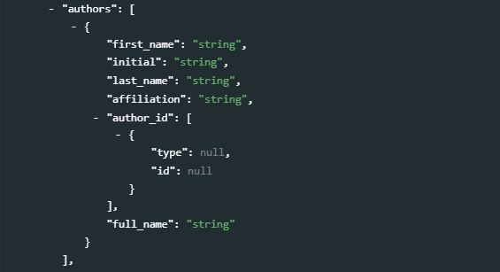
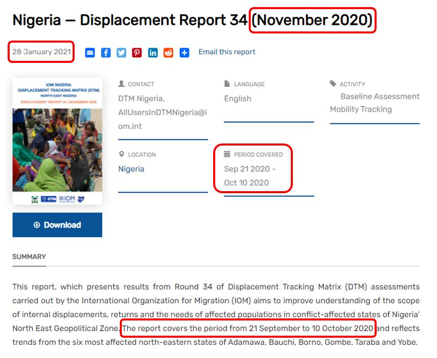
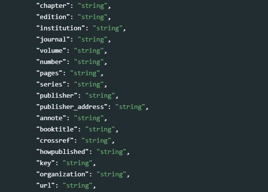
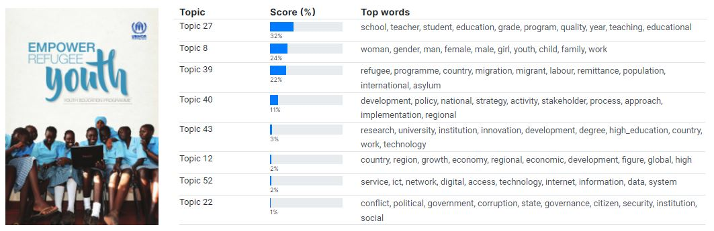
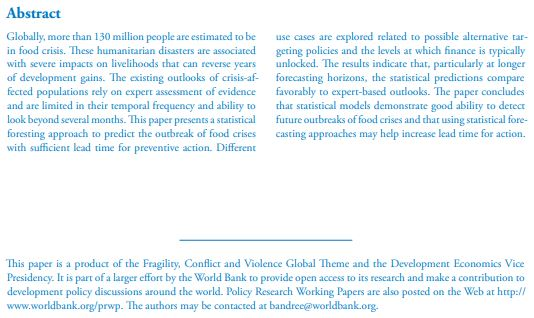

# (PART) STANDARDS AND SCHEMAS {-}

# Documents {#chapter04}

<center>
{width=100%}
</center>
<br>

This chapter describes the use of a metadata schema for documenting *documents*. By *document*, we mean a bibliographic resource of any type such as a book, a working paper or a paper published in a scientific journal, a report, a presentation, a manual, or any another resource consisting mainly of <u>text</u> and available in physical and/or electronic format.

> Suggestions and recommendations to data curators<br>

   - Documents in a data catalog can appear (i) as "data" in the catalog, or as "related resources" attached to other datasets. The schema we describe here is to be used for documents that will be listed as catalog entries and made searchable, not those that will be attached as resources (for which the "external resource" metadata schema must be used.
   - For all types of "data" we describe in this Guide (microdata, geographic, indicators, tables, images, audio, video, and scripts), what is indexed and made searchable in the catalog are the **metadata** associated with the data (some of these metadata may have been extracted directly from the data). For *documents*, not only the metadata but the content of the document (the "data") can and should be indexed and made searchable. Some documents may have been scanned and submitted to optical character recognition (OCR). The OCR process will not always manage to properly convert images to text, resulting in errors and non-existing words that should not be included in an index. It is thus recommended to submit the text version of these documents to a pipeline of quality control and enhancement (spell checker, and other).
   - Including a screenshot of a document cover page in a data catalog adds value. The screenshot is a form of visual metadata. 
   - Documents should be categorized by type, and the *type* metadata element should have a controlled vocabulary. If a document can have more than one type, use the *tags* element (with a *tag_group* = *type*) instead of the non-repeatable *type* element to store this information. Use this information to activate a facet in the catalog user interface. Many users will find it useful to be able to filter documents by type.
   - The document metadata can be augmented in different manners, including by applying automated topic extraction (e.g. using a LDA topic model) and by generating document embeddings. When topic models and embedding models are used, it is important to ensure that the same topic model and the same embedding model is consistently used for all resources in the catalog.
   - Machine learning tools also provide automatic language detection and translation solutions that mey be useful to enhance the metadata.
   - Documenting documents using R or Python is not very complex. For large collections of documents, managing and publishing metadata can be made significantly more efficient when programmatic solutions are used.
   - It is highly recommended to obtain a globally unique identifier for each document, such as a DOI.


## MARC 21, Dublin Core, and BibTex 

Librarians have developed specific standards to describe and catalog documents. The [MARC 21](https://www.loc.gov/marc/bibliographic/) (**MA**chine-**R**eadable **C**ataloging) standard used by the United States Library of Congress is one of them. It provides a detailed structure for documenting bibliographic resources, and is the recommended standard for well-resourced document libraries.

For the purpose of cataloguing documents in a less-specialized repository intended to accommodate data of multiple types, we built our schema on a simpler but also highly popular standard, the **Dublin Core Metadata Element Set**. We will refer to this metadata specification, developed by the [Dublin Core Metadata Initiative](https://dublincore.org/), as the *Dublin Core*. The Dublin Core became an ISO standard (ISO 15836) in 2009. It consists of a list of fifteen core metadata elements, to which more specialized elements can be added. These fifteen elements, with a definition extracted from the Dublin Core [website](https://dublincore.org/), are the following:

|No | Element name         | Description                                                     | 
|-- | -------------------- | --------------------------------------------------------------- | 
|1  | contributor          | An entity responsible for making contributions to the resource. |
|2  | coverage             | The spatial or temporal topic of the resource, the spatial applicability of the resource, or the jurisdiction under which the resource is relevant. |
|3  | creator              | An entity primarily responsible for making the resource.         |
|4  | date                 | A point or period of time associated with an event in the life cycle of the resource. |
|5  | description          | An account of the resource. |
|6  | format               | The file format, physical medium, or dimensions of the resource. |
|7  | identifier           | An unambiguous reference to the resource within a given context. |
|8  | language             | A language of the resource.                                      |
|9  | publisher            | An entity responsible for making the resource available.         |
|10 | relation             | A related resource.                                              |
|11 | rights               | Information about rights held in and over the resource.          |
|12 | source               | A related resource from which the described resource is derived. |
|13 | subject              | The topic of the resource.                                       |
|14 | title                | A name given to the resource.                                    |
|15 | type                 | The nature or genre of the resource.                             |

Due to its simplicity and versatility, this standard is widely used for multiple purposes. It can be used to document not only documents but also resources of other types like images or others. Documents that can be described using the MARC 21 standard can be described using the Dublin Core, although not with the same granularity of information. The US Library of Congress provides a [mapping between the MARC and the Dublin Core](https://www.loc.gov/marc/marc2dc.html) metadata elements. 

MARC 21 and the Dublin Core are used to document a resource (typically, the electronic file containing the document) and its content. Another schema, [BibTex](https://en.wikipedia.org/wiki/BibTeX), has been developed for the specific purpose of recording bibliographic citations. BibTex is a list of fields that may be used to generate bibliographic citations compliant with different bibliography styles. It applies to documents of multiple types: books, articles, reports, etc.  

The metadata schema we propose to document publications and reports is a combination of Dublin Core, MARC 21, and BibTex elements. The technical documentation of the schema and its API is available at https://ihsn.github.io/nada-api-redoc/catalog-admin/#tag/Documents.

## Schema description

The proposed schema comprises two main blocks of elements, **`metadata_information`** and **`document_description`**. It also contains the `tags` element common to all our schemas. The `repository_id`, `published` and `overwrite` items in the schema are not metadata elements *per se*, but parameters used when publishing the metadata in a NADA catalog. 

<br>
<center>
{width=100%}
</center>
<br>

### Metadata information

The **`metadata_information`** contains information not related to the document itself but to its metadata, i.e. it contains "metadata on the metadata". This information is optional but we recommend to enter content at least in the `name` and `date` sub-elements, which indicate who generated the metadata and when. This information is not useful to end-users of document catalogs, but is useful to catalog administrators for two reasons:

   - metadata compliant with standards are intended to be shared and used by inter-operable applications. Data catalogs offer opportunities to harvest (pull) information from other catalogs, or to publish (push) metadata in other catalogs. Metadata information helps to keep track of the provenance of metadata.
   - metadata for a same document may have been generated by more than one person or organization, or one version of the metadata can be updated and replaced with a new version. The `metadata information` helps catalog administrators distinguish and manage different versions of the metadata.
   
  <br>
  {width=100%}
  <br>
  
The elements in the block are:

- **`title`** *[Required ; Not repeatable ; String]* <br>
The title of the metadata document (which may be the title of the document itself). 

- **`idno`** *[Optional ; Not repeatable ; String]* <br> 
A unique identifier for the metadata document (unique in the catalog; ideally also unique globally). This is different from the document unique identifier found in section *title_statement*, although it is good practice to generate identifiers that establish a clear connection between the metadata IDNO and the document IDNO. For example, if the unique identifier of the document is "978-1-4648-1342-9", the identifier in the metadata_information generated by the World Bank Development Data Group could be "WBDG_978-1-4648-1342-9". 

- **`producers`** *[Optional ; Repeatable]* <br> 
This refers to the producer(s) of <u>the metadata</u>, not to the producer(s) of the document itself. 
    - **`name`** *[Optional ; Not repeatable ; String]* <br> 
    The name of the metadata producer/curator. An alternative to entering the name of the curator (e.g. for privacy protection purpose) is to enter the curator identification number (see the element *abbr* below)
    - **`abbr`** *[Optional ; Not repeatable ; String]* <br> 
    An abbreviation of the `name` element, which can be used to provide an identifier of the metadata producer/curator or the acronym of the organization if the name of an organization was entered in `name`.
    - **`affiliation`** *[Optional ; Not repeatable ; String]* <br> 
    The affiliation of the metadata producer/curator.
    - **`role`** *[Optional ; Not repeatable ; String]* <br> 
    The specific role of the person or organization mentioned in `name` in the production of the metadata for the document.

- **`production_date`** *[Optional ; Not repeatable ; String]* <br> 
The date the <u>metadata</u> (not the resource being documented) was produced.

- **`version`** *[Optional ; Not repeatable ; String]* <br> 
The version of the metadata (not the version of the resource being documented).
  
<br>

  > Example in R:
  
  ```{r, eval=F, echo=T}
  my_doc = list(
    
    metadata_information = list(
      
      idno = "WBDG_978-1-4648-1342-9",
      
      producers = list(
        list(name = "Development Data Group, Curation Team", 
             abbr = "WBDG", 
             affiliation = "World Bank")
      ),
      
      production_date = "2020-12-27"
    ),
    
    # ...
    
  ) 
  ```

### Document description

The **`document_description`** block contains the metadata elements used to describe the document. It includes the Dublin Core elements and a few more. The schema also includes elements intended to store information generated by machine learning (natural language processing - NLP) models to augment metadata on documents.

- **`title_statement`** *[Required ; Not repeatable]* <br>
The `title_statement` is a required group of five elements, two of which are required:
   <br>
   {width=100%}
   <br>
    - **`idno`** *[Required ; Not repeatable ; String]* <br>
    A unique identifier to the document. Do not include spaces in the `idno`. This identifier must be unique to the catalog in which the document will be published. Some organizations have their own system to assign unique identifiers to documents. Ideally, an identifier that guarantees uniqueness globally will be used, such as a Digital Object Identifier (DOI) or an ISBN number. Note that a document may have more than one identifier. In such case, the element `idno` (as a non-repeatable element) will contain the main identifier (as selected as the "reference" one by the catalog administrator). The other identifiers will be provided in the element `identifiers` (see below).
    - **`title`** *[Required ; Not repeatable ; String]* <br>
    The title of the document. Pay attention to the use of capitalization in the title, to ensure consistency across documents listed in your catalog. Corresponds to BibTex element *title*. 
    - **`sub_title`** *[Optional ; Not repeatable ; String]* <br>
    The document sub-title, if any. 
    - **`alternate_title`** *[Optional ; Not repeatable ; String]* <br>
    An alternate title of the document (this could possibly be a translated version of the original title). 
    - **`abbreviated_title`** *[Optional ; Not repeatable ; String]* <br>
    An abbreviated version of the title of the document. Some documents may be referred to using a short name. For example, the World Bank's *World Development Report* is often referred to as the *WDR*. <br><br>
    
    > Example in R:
  
    ```{r, eval=F, echo=T}
    my_doc <- list(
      # ... ,
      
      document_description = list(
        title_statement = list(
          idno = "978-1-4648-1342-9",
          title = "The Changing Nature of Work",
          sub-title = "World Development Report 2019",
          abbreviated_title = "WDR 2019"
        ),
        
        # ...
      )  
    )  
    ```

- **`authors`** *[Optional ; Repeatable]* <br>    @@@@ redo screenshot (with full_name element
The authors should be listed in the same order as they appear in the source itself, which is not necessarily alphabetical. If necessary, the elements contained in this block can be used to generate a BibTex-compliant *author* field (in BibTex, the field `author` contains the name(s) of the author(s), separated by *and* when the document has more than one author.)
  <br>
  {width=100%}
  <br>
  - **`first_name`** *[Optional ; Not repeatable ; String]* <br>
  The first name of the author. <br>
  - **`initial`** *[Optional ; Not repeatable ; String]* <br>
  The initials of the author. <br>
  - **`last_name`** *[Optional ; Not repeatable ; String]* <br>
  The last name of the author. <br>
  - **`affiliation`** *[Optional ; Not repeatable ; String]* <br>
  The affiliation of the author. <br>
  - **`author_id`** *[Optional ; Repeatable]* <br>
  The author ID in a registry of academic researchers such as the [Open Researcher and Contributor ID (ORCID)](https://orcid.org/). <br>
     - **`type`** *[Optional ; Not repeatable ; String]* <br>
     The type of ID, i.e. the identification of the registry that assigned the author's identifier, e.g. "ORCID". <br>
     - **`id`** *[Optional ; Not repeatable ; String]* <br>
     The ID of the author in the registry mentioned in `type`.<br>
  - **`full_name`** *[Optional ; Not repeatable ; String]* <br>
  The full name of the author. This element should only be used when the first and last name of an author cannot be distinguished, i.e. when elements `first_name` and `last_name` cannot be filled out. This element can also be used when the author of a document is an organization or other type of entity.<br>   

  <br>
  > Example in R:

  ```{r, eval=F, echo=T}
  my_doc <- list(
    # ... ,
    document_description = list(
      # ... ,
      
      authors = list(
         list(first_name = "John", last_name = "Smith",
              author_id = list(type = "ORCID", id = "0000-0002-1234-XXXX")),
         list(first_name = "Jane", last_name = "Doe"),
              author_id = list(type = "ORCID", id = "0000-0002-5678-YYYY"))
      ),
      
      # ...
    ),
    # ... 
  )  
  ```

- **`editors`** *[Optional ; Repeatable]* <br>
If the source is a text within an edited volume, it should be listed under the name of the author of the text used, not under the name of the editor. The name of the editor should however be provided in the bibliographic citation, in accordance with a [reference style](https://awelu.srv.lu.se/sources-and-referencing/using-a-reference-style/elements-of-the-reference-list/). If necessary, these elements can be used to generate a BibTex-compliant `editor` field, which contains the name(s) of the editor(s).
  <br>
  {width=100%}
  <br>
    - **`first_name`** *[Optional ; Not repeatable ; String]* <br>
    The first name of the editor.
    - **`initial`** *[Optional ; Not repeatable ; String]* <br>
    The initials of the editor.
    - **`last_name`** *[Optional ; Not repeatable ; String]* <br>
    The last name of the editor.
    - **`affiliation`** *[Optional ; Not repeatable ; String]* <br>
    The affiliation of the editor.<br>

<br>
- **`date_created`** *[Optional ; Not repeatable ; String]* <br> 
The date, entered in ISO format (YYYY-MM-DD or YYYY-MM or YYYY), when the document was produced. This can be different from the date the document was published, made available, and from the temporal coverage. The document "Nigeria - Displacement Report" by the International Organization for Migration (IOM) shown below provides an example of this. The document was produced in November 2020 (`date_created`), refers to events that occurred between 21 September and 10 October 2021 (`temporal_coverage`), and was published (`date_published`) on 28 January 2021. The `month` and `year` correspond to the BibTex elements `month` and `year` for unpublished documents (for published documents, BibTex will use the information found in `date_published`; see below). 

  <br>
  {width=100%}
  <br>

- **`date_available`** *[Optional ; Not repeatable ; String]* <br>
The date in ISO format (YYYY-MM-DD or YYYY-MM or YYYY) when the document was made available. This is different from the date it was published (see element `date_published` below). This element will not be used frequently. 

- **`date_modified`** *[Optional ; Not repeatable ; String]* <br> 
The date in ISO 8601 format (YYYY-MM-DD or YYYY-MM or YYYY) when the document was last modified. 

- **`date_published`** *[Optional ; Not repeatable ; String]* <br>
The date in ISO 8601 format (YYYY-MM-DD or YYYY-MM or YYYY) when the document was published. The `month` and `year` correspond to the BibTex elements `month` and `year` for published documents (for unpublished documents, BibTex will use the information found in `date_created`; see above).

<br>
The example below is a [report from the International Organization for Migrations](https://displacement.iom.int/node/10647) (IOM). It shows the difference between the date the document was created (`date_created`), published (`date_published`), and the period it covers (`temporal_coverage`).

  <br>
  <center>
  {width=85%}
  </center>
  <br>

In R, this will be captured as follows:

  ```{r, eval=F, echo=T}
  my_doc <- list(
    # ... ,
    document_description = list(
      # ... ,
      
      temporal_coverage = "21 September 2020 to 10 October 2020",
      date_created = "2020-11",  
      date_published = "2021-01-28",
      
      # ...
    ),
    # ...
    
  )  
  ```

- **`identifiers`** *[Optional ; Repeatable]*   
This element is used to enter document identifiers (IDs) other than the catalog ID entered in the `title_statement` (`idno`). It can for example be a Digital Object Identifier (DOI), an International Standard Book Number (ISBN), or an International Standard Serial Number (ISSN). The ID entered in the `title_statement` can be repeated here (the `title_statement` does not provide a `type` parameter; if a DOI, ISBN, ISSN, or other standard reference ID is used as `idno`, it is recommended to repeat it here with the identification of its `type`). Note that `doi` is a BibTex element, which can be extracted from `identifiers` if a DOI was included in the metadata.
  <br>
  {width=100%}
  <br>    
    - **`type`** *[Optional ; Not repeatable ; String]* <br>
    The type of unique ID, e.g. "DOI", "ISBN", or "ISSN".
    - **`value`** *[Required ; Not repeatable ; String]* <br>
    The identifier itself. <br>
<br>

  > Example in R

  The example shows the list of identifiers of the World Bank World Development Report 2020 *The Changing Nature of Work* (see full metadata for this document in the *Complete Example 2* of this chapter).
    
  ```{r, eval=F, echo=T}
    my_doc <- list(
    
      # ... ,
      
      document_description = list(

        # ... ,
        
        identifiers = list(
          list(type = "ISSN",           value = "0163-5085"),
          list(type = "ISBN softcover", value = "978-1-4648-1328-3"),
          list(type = "ISBN hardcover", value = "978-1-4648-1342-9"),
          list(type = "e-ISBN",         value = "978-1-4648-1356-6"),
          list(type = "DOI softcover",  value = "10.1596/978-1-4648-1328-3"),   
          list(type = "DOI hardcover",  value = "10.1596/978-1-4648-1342-9")   
        ),
        
        # ...
      ),
      # ... 
    )  
  ```

- **`type`** *[Optional ; Not repeatable ; String]* <br>
<br>
{width=100%}
<br>
This describes the nature of the resource. It corresponds to the `type` element in BibTex. It is recommended practice to select a value from a controlled vocabulary, which could for example include the following options: `{article, book, booklet, collection, conference proceedings, manual, master_thesis, patent, phd_thesis, proceedings, technical_report, working-paper, website, other}`. Specialized agencies may want to create their own controlled vocabularies; for example, a national statistical agency may need options like `{press release, methodology document, protocols, yearbooks}`. The `type` element can be used to create a "Document type" facet (filter) in a data catalog. If the controlled vocabulary is such that it contains values that are not mutually exclusive (i.e. if a document could possibly have more than one type), the element `type` cannot be used as it is not repeatable. In such case, the solution is to provide the type of document as `tags`, in a `tag_group` that could for example be named *type* or *document_type*. Note also that the Dublin Core provides a controlled vocabulary (the [DCMI Type Vocabulary](https://www.dublincore.org/specifications/dublin-core/dcmi-terms/#section-7)) for the `type` element, but this vocabulary is related to the types of resources (dataset, event, image, software, sound, etc.), not the type of document which is what we are interested in here. 

- **`status`** *[Optional ; Not repeatable ; String]* <br> 
<br>
{width=100%}
<br>
The status of the document should (but does not have to) be provided using a controlled vocabulary. We suggest the following vocabulary: `{first draft, draft, reviewed draft, final draft, final}`. Most documents published in a catalog will likely be `final`.

- **`description`**  *[Optional ; Not repeatable ; String]* <br>
<br>
{width=100%}
<br>
This element is used to provide a brief description of the document (not an abstract, which would be provided in the field `abstract`). It should not be used to provide content that is contained in other, more specific elements. As stated in the [Dublin Core Usage Guide](https://www.dublincore.org/specifications/dublin-core/usageguide/elements/), "Since the `description` field is a potentially rich source of indexable terms, care should be taken to provide this element when possible. Best practice recommendation for this element is to use full sentences, as description is often used to present information to users to assist in their selection of appropriate resources from a set of search results." 

- **`toc`** *[Optional ; Not repeatable ; String]* <br>
<br>
{width=100%}
<br>
The table of content of the document, provided as a single string element, i.e. with no structure (an structured alternative is provided with the field `toc_structured` described below). This element is also a rich source of indexable terms which can contribute to document discoverability; care should thus be taken to use it (or the `toc_structured` alternative) whenever possible.
<br>
  > Example in R: 

  ```{r, eval=F, echo=T}
  my_doc <- list(
    # ... ,
    document_description = list(
      # ... ,
      
      toc = "Introduction
             1. The importance of rich and structured metadata
             1.1 Rich metadata
             1.2 Structured metadata
             2. Technology: JSON schemas and tools
             2.1 JSON schemas
             2.1.1 Advantages of JSON over XML
             2.2 Defining a metadata schema in JSON format",
      # ...
    ),
    
    # ...
  ) 
  ```

- **`toc_structured`** *[Optional ; Not repeatable]* <br>
<br>
{width=100%}
<br>
This element is used as an alternative to `toc` to provide a <u>structured</u> table of content. The element contains a repeatable block of three sub-elements which provides the possibility to define a hierarchical structure:
    - **`id`** *[Optional ; Not repeatable ; String]* <br> 
    A unique identifier for the element of the table of content. For example, the `id` for Chapter 1 could be "1" while the `id` for section 1 of chapter 1 would be "11".
    - **`parent_id`** *[Optional ; Not repeatable ; String]* <br>
    The `id` of the parent section (e.g., if the TOC is divided into chapters, themselves divided into sections, the `parent_id` of a section would be the id of the chapter it belongs to.)
    - **`name`** *[Required ; Not repeatable ; String]* <br>
    The label of this section of the table of content (e.g., the chapter or section title) <br>
  <br>

  > Example in R 
  
  The example below shows how the content provided in the previous example is presented in a structured format. 

  ```{r, eval=F, echo=T}
  my_doc <- list(
    # ... ,
    document_description = list(
          # ...,
          
          toc_structured = list(
             list(id = "0",   parent_id = "" ,  name = "Introduction"),
             list(id = "1",   parent_id = "" ,  name = "1. The importance of rich and structured metadata"),
             list(id = "11",  parent_id = "1",  name = "1.1 Rich metadata"),
             list(id = "12",  parent_id = "1",  name = "1.2 Structured metadata"),
             list(id = "2",   parent_id = "" ,  name = "2. Technology: JSON schemas and tools"),
             list(id = "21",  parent_id = "2",  name = "2.1 JSON schemas"),
             list(id = "211", parent_id = "21", name = "2.1.1 Advantages of JSON over XML"),
             list(id = "22",  parent_id = "2",  name = "2.2 Defining a metadata schema in JSON format")
             # etc.
          ),
          # ...
    ),
    # ...
  ) 
  ```

- **`abstract`** *[Optional ; Not repeatable ; String]* <br>
<br>
{width=100%}
<br>
The abstract is a summary of the document, usually about one or two paragraph(s) long (around 150 to 300 words).

  > Example in R:

  ```{r, eval=F, echo=T}
  my_doc <- list(
    # ... ,
    document_description = list(
          # ... ,
          
          abstract = "The 2019 World Development Report studies how the nature of work is changing as a result of advances in technology today. 
                      While technology improves overall living standards, the process can be disruptive. 
                      A new social contract is needed to smooth the transition and guard against inequality.",
          
          # ...
    ),
    # ...
  ) 
  ```

- **`notes`** *[Optional ; Repeatable ; String]* <br>
<br>
{width=100%}
<br>
This field can be used to provide information on the document that does not belong to the other, more specific metadata elements provided in the schema. It corresponds to the `note` element in BibTex.
    - **`note`**  <br>
    A note, entered as free text.

  <br>
  > Example in R:
    
  ```{r, eval=F, echo=T}
  my_doc <- list(
    # ... ,
    document_description = list(
      # ... ,
      
      notes = list(
        list(note = "This is note 1"),
        list(note = "This is note 2")
      ),  
      
      # ...
    ),
    # ...
  ) 
  ```

- **`scope`** *[Optional ; Not repeatable ; String]* <br>
<br>
{width=100%}
<br>
A textual description of topics covered in the document, which complements the elements `description` and `topics`.

- **`ref_country`** *[Optional ; Repeatable]* <br>
The list of countries (or regions) covered by the document, if applicable. This is a repeatable block of two elements:
    - **`name`** *[Required ; Not repeatable ; String]* <br>
    The country/region name. Note that many organizations have their own policies on the naming of countries/regions/economies/territories, which data curators will have to comply with.
    - **`code`** *[Optional ; Not repeatable ; String]* <br>
    The country/region code (entered as a string, even for numeric codes). It is recommended to use a standard list of countries and regions, such as the ISO country list ([ISO 3166](https://en.wikipedia.org/wiki/List_of_ISO_3166_country_codes)).
    
  <br>
  {width=100%}
  <br>

The field `ref_country` will often be used as a filter (facet) in data catalogs. When a document is related to only part of a country, we still want to capture this information in the metadata. For example, the `ref_country` element for the document ["Sewerage and sanitation : Jakarta and Manila"](https://documents.worldbank.org/en/publication/documents-reports/documentdetail/880091468095971513/sewerage-and-sanitation-jakarta-and-manila) will list "Indonesia" (code IDN) and "Philippines" (code PHL). 

Considering the importance of the geographic coverage of a document as a filter, the `ref_country` element deserves particular attention. The document title will often but not always provide the necessary information. Using R, Python or other programming languages, a list of all countries mentioned in a document can be automatically extracted, with their frequencies. This approach (which requires a lookup file containing a list of all countries in the world with their different denominations and spelling) can be used to extract the information needed to populate the `ref_country` element (not all countries in the list will have to be included; some threshold can be set to only include countries that are "significantly" mentioned in a document). Tools like the R package [countrycode](https://cran.r-project.org/web/packages/countrycode/index.html) are available to facilitate this process.   

When a document is related to a region (not to specific countries), or when it is related to a topic but not a specific geographic area, the `ref_country` might still be applicable. Try and extract (possibly using a script that parses the document) information on the countries mentioned in the document. For example, `ref_country` for the World Bank document ["The investment climate in South Asia"](http://documents1.worldbank.org/curated/en/242391468114239381/pdf/715140v10ESW0P0Climate0I0OCR0Needed.pdf) should include Afghanistan (mentioned 81 times in the document), Bangladesh (113), Bhutan (94), India (148), Maldives (62), Nepal (64), Pakistan (103), and Sri Lanka (98), but also China (not a South-Asian country, but mentioned 63 times in the document).

If a document is not specific to any country, the element `ref_country` would be ignored (not included in the metadata) if the content of the document is not related to any geographic area (for example, the user's guide of a software application), or would contain "World" (code WLD) if the document is related but not specific to countries (for example, a document on "Climate change mitigation").

> Example in R: 

```{r, eval=F, echo=T}
my_doc <- list(
  # ... ,
  document_description = list(
    # ... ,
    
    ref_country = list(
       list(name = "Bangladesh", code = "BGD"),
       list(name = "India",      code = "IND"),
       list(name = "Nepal",      code = "NPL")
    ),
    
    # ...
  ) 
```

- **`geographic_units`** *[Optional ; Repeatable]* <br>
A list of geographic units covered in the document, other than the countries listed in `ref_country`.
  <br>
  {width=100%}
  <br>
    - **`name`** *[Required ; Not repeatable ; String]* <br>
    The name of the geographic unit.
    - **`code`** *[Optional ; Not repeatable ; String]* <br>
    The code of the geographic unit.
    - **`type`** *[Optional ; Not repeatable ; String]* <br>
    The type of the geographic unit (e.g., "province", "state", "district", or "town").<br>
    
- **`bbox`** *[Optional ; Repeatable]* <br>
The bounding box(es) of geographic units covered in the document. The bounding boxes are the coordinates (latitude and longitude) of rectangular geographic areas that the document covers. This element will rarely be used for documenting publications. Bounding boxes are an optional element, but when a bounding box is defined, all four coordinates are required. 
  <br>
  {width=100%}
  <br>
    - **`west`** *[Required ; Not repeatable ; String]* <br>
    The west limit of the geographic area.
    - **`east`** *[Optional ; Not repeatable ; String]* <br>
    The east limit of the geographic area.
    - **`south`** *[Optional ; Not repeatable ; String]* <br>
    The south limit of the geographic area. 
    - **`north`** *[Optional ; Not repeatable ; String]* <br>
    The north limit of the geographic area.<br>
    <br>

  > Example in R: 

  ```{r, eval=F, echo=T}
  my_doc <- list(
    # ... ,
    document_description = list(
          # ... ,
          
          bbox = list(
            list(west  = "92.12973", 
                 east  = "92.26863", 
                 south = "20.91856", 
                 north = "21.22292")
          ),
          
          # ...
    ),
    # ...
  ) 
  ```
  
- **`spatial_coverage`** *[Optional ; Not repeatable ; String]* <br>
  <br>
  {width=100%}
  <br>
This element provides another space for capturing information on the spatial coverage of a document, which complements the `ref_country`, `geographic_units`, and `bbox` elements. It can be used to qualify the geographic coverage of the document, in the form of a free text. For example, a report on refugee camps in the Cox's Bazar district of Bangladesh would have Bangladesh as reference country, "Cox's Bazar" as a geographic unit, and "Rohingyas refugee camps" as spatial coverage. 
<br>

  > Example in R: 

  ```{r, eval=F, echo=T}
  my_doc <- list(
    # ... ,
    document_description = list(
      # ... ,
      
      ref_country = list(
        list(name = "Bangladesh", code = "BGD")
      ),
      
      geographic_units = list(
        list(name = "Cox's Bazar", type = "District")
      ),  
      
      spatial_coverage = "Rohingyas refugee camps",
      
      # ...
    ),
    # ...
    
  )  
  ```

- **`temporal_coverage`** *[Optional ; Not repeatable ; String]* <br>
  <br>
  {width=100%}
  <br>
Not all documents have a specific time coverage. When they do, it can be specified in this element. 

- **`publication_frequency`** *[Optional ; Not repeatable ; String]* <br>
Some documents are published regularly. The frequency of publications can be documented using this element. 
  <br>
  {width=100%}
  <br>  
It is recommended to use a controlled vocabulary, for example the [PRISM Publishing Frequency Vocabulary](http://prismstandard.org/vocabularies/3.0/pubfrequency.xml) which identifies standard publishing frequencies for a serial or periodical publication.

   | Frequency    | Description                       |
   |--------------|-----------------------------------|
   | annually     | Published once a year             |
   | semiannually | Published twice a year            |
   | quarterly    | Published every 3 months, or once a quarter|
   | bimonthly    | Published twice a month           |
   | monthly      | Published once a month            |
   | biweekly     | Published twice a week            |
   | weekly       | Published once a week             |
   | daily        | Published every day               |
   | continually  | Published continually as new content is added; typical of websites and blogs, typically several times a day|
   | irregularly  | Published on an irregular schedule, such as every month except July and August|
   | other        | Published on another schedule not enumerated in this controlled vocabulary |

- **`languages`** *[Optional ; Repeatable]* <br>
The language(s) in which the document is written. 
  <br>
  {width=100%}
  <br>    
This is a block of two elements (at least one must be provided for each language):
    - **`name`** *[Optional ; Not repeatable ; String]* <br>
    The name of the language.
    - **`code`** *[Optional ; Not repeatable ; String]* <br>
    The code of the language. The use of [ISO 639-2](https://www.loc.gov/standards/iso639-2/php/code_list.php) (the alpha-3 code in Codes for the representation of names of languages) is recommended. Numeric codes must be entered as strings. <br><br>
   
  > Example in R:

  ```{r, eval=F, echo=T}
    my_doc <- list(
      # ... ,
      document_description = list(
        # ... ,
        
        languages = list(
          list(name = "English", code = "EN")
        )
        
        # ...
      ),
      # ... 
    )  
  ```

- **`license`** *[Optional ; Repeatable]* <br>
Information on the license(s) attached to the document, which defines the terms of use. 
    - **`name`** *[Required ; Not repeatable ; String]* <br>
    The name of the license.
    - **`uri`** *[Optional ; Not repeatable ; String]* <br>
    The URL of the license, where detailed information on the license can be obtained.
    <br>
    {width=100%}
    <br>
    
  > Example in R:

  ```{r, eval=F, echo=T}
    my_doc <- list(
      # ... ,
      document_description = list(
        # ... ,
        
        license = list(
          list(name = "Creative Commons Attribution 3.0 IGO license (CC BY 3.0 IGO)", 
               uri = "http://creativecommons.org/licenses/by/3.0/igo")
        ),
        
        # ...
      ),
      # ... 
    )  
  ```

- **`bibliographic_citation`** *[Optional ; Repeatable]* <br> 
The bibliographic citation provides relevant information about the author and the publication. When using the element `bibliographic_citation`, the citation is provided as a single item. It should be provided in a standard style: Modern Language Association ([MLA](https://www.mla.org/)), American Psychological Association ([APA](https://apastyle.apa.org/)), or [Chicago](https://owl.purdue.edu/owl/research_and_citation/chicago_manual_17th_edition/cmos_formatting_and_style_guide/chicago_manual_of_style_17th_edition.html). Note that the schema provides an itemized list of all elements (BibTex fields) required to build a citation in a format of their choice. 
    <br>
    {width=100%}
    <br>
   - **`style`** *[Optional ; Not repeatable ; String]* <br>
   The citation style, e.g. "MLA", "APA", or "Chicago".
   - **`citation`** *[Optional ; Not repeatable ; String]* <br>
   The citation in the style mentioned in `style`.
  <br>
  
  <br>
  > Example in R
  
  The example below shows how the bibliographic citation for an article published in [Econometrica](https://onlinelibrary.wiley.com/doi/abs/10.1111/1468-0262.00167) can be provided in three different formats. 
  
  <br>
  {width=85%}
  <br>
  
  ```{r, eval=F, echo=T}
    my_doc <- list(
      # ... ,
      document_description = list(
        # ... ,
        
        bibliographic_citation = list(
        
          list(style = "MLA", 
               citation = 'Davidson, Russell, and Jean-Yves Duclos. “Statistical Inference for Stochastic Dominance and for the Measurement of Poverty and Inequality.” Econometrica, vol. 68, no. 6, [Wiley, Econometric Society], 2000, pp. 1435–64, http://www.jstor.org/stable/3003995.'),
               
          list(style = "APA", 
               citation = 'Davidson, R., & Duclos, J.-Y. (2000). Statistical Inference for Stochastic Dominance and for the Measurement of Poverty and Inequality. Econometrica, 68(6), 1435–1464. http://www.jstor.org/stable/3003995'),
               
          list(style = "Chicago", 
               citation = 'Davidson, Russell, and Jean-Yves Duclos. “Statistical Inference for Stochastic Dominance and for the Measurement of Poverty and Inequality.” Econometrica 68, no. 6 (2000): 1435–64. http://www.jstor.org/stable/3003995.')   
               
        ),
        
        # ...
      ),
      # ... 
    )  
  ```

-------
**Bibliographic elements**
-------

The elements that follow are bibliographic elements that correspond to BibTex fields. Note that some of the BibTex elements are found elsewhere in the schema (namely `type`, `authors`, `editors`, `year` and `month`, `isbn`, `issn` and `doi`); when constructing a bibliographic citation, these external elements will have to be included as relevant. The description of the bibliographic fields listed below was adapted from [Wikipedia's description of BibTex](https://en.wikipedia.org/wiki/BibTeX). 
    <br>
    {width=100%}  
    <br>

The elements that are required to form a complete bibliographic citation depend on the type of document. The table below, adapted from the [BibTex templates](https://www.bibtex.com/format/), provides a list of required and optional fields by type of document:

   | Document type                      | Required fields                   | Optional fields                      |
   |------------------------------------|-----------------------------------|--------------------------------------|
   | Article from a journal or magazine | author, title, journal, year  | volume, number, pages, month, note, key  |
   | Book with an explicit publisher    | author or editor, title, publisher, year | volume, series, address, edition, month, note, key  |
   | Printed and bound document without a named publisher or sponsoring institution | title  | author, howpublished, address, month, year, note, key  |
   | Part of a book (chapter and/or range of pages) | author or editor, title, chapter and/or pages, publisher, year | volume, series, address, edition, month, note, key  |
   | Part of a book with its own title | author, title, book title, publisher, year | editor, pages, organization, publisher, address, month, note, key  |
   | Article in a conference proceedings | author, title, book title, year | editor, pages, organization, publisher, address, month, note, key  |
   | Technical documentation | title | author, organization, address, edition, month, year, key  |
   | Master's thesis | author, title, school, year | address, month, note, key  |
   | Ph.D. thesis | author, title, school, year | address, month, note, key  |
   | Proceedings of a conference | title, year | editor, publisher, organization, address, month, note, key  |
   | Report published by a school or other institution, usually numbered within a series | author, title, institution, year | type, number, address, month, note, key |  
   | Document with an author and title, but not formally published | author, title, note | month, year, key |

<br>

  - **`chapter`** *[Optional ; Not repeatable ; String]* <br>
  A chapter (or section) number. This element is only used to document a resource which has been extracted from a book.   

  - **`edition`** *[Optional ; Not repeatable ; String]* <br>
  The edition of a book - for example "Second". When a book has no edition number/name present, it can be assumed to be a first edition. If the edition is other than the first, information on the edition of the book being documented must be mentioned in the citation. The edition can be identified by a number, a label (such as “Revised edition” or “Abridged edition”), and/or a year. The first letter of the label should be capitalized.
  
  - **`institution`** *[Optional ; Not repeatable ; String]* <br>
  The sponsoring institution of a technical report. For citations of Master's and Ph.D. thesis, this will be the name of the school.
  
  - **`journal`** *[Optional ; Not repeatable ; String]* <br>
  A journal name. Abbreviations are provided for many journals.
  
  - **`volume`** *[Optional ; Not repeatable ; String]* <br>
  The volume of a journal or multi-volume book. Periodical publications, such as scholarly journals, are published on a regular basis in installments that are called issues. A volume usually consists of the issues published during one year.

  - **`number`** *[Optional ; Not repeatable ; String]* <br>
  The number of a journal, magazine, technical report, or of a work in a series. An issue of a journal or magazine is usually identified by its `volume` (see previous element) and `number`; the organization that issues a technical report usually gives it a number; and sometimes books are given numbers in a named series.

  - **`pages`** *[Optional ; Not repeatable ; String]* <br>
  One or more page numbers or range of numbers, such as 42-111 or 7,41,73-97 or 43+ (the `+' indicates pages following that don't form a simple range).

  - **`series`** *[Optional ; Not repeatable ; String]* <br>
  The name of a series or set of books. When citing an entire book, the title field gives its title and an optional series field gives the name of a series or multi-volume set in which the book is published.

  - **`publisher`** *[Optional ; Not repeatable ; String]* <br> 
  The entity responsible for making the resource available. For major publishing houses, the information can be omitted. For small publishers, providing the complete address is recommended. If the company is a university press, the abbreviation UP (for University Press) can be used. The publisher is not stated for journal articles, working papers, and similar types of documents.

  - **`publisher_address`** *[Optional ; Not repeatable ; String]* <br> 
  The address of the publisher. For major publishing houses, just the city is given. For small publishers, the complete address can be provided.

  - **`annote`** *[Optional ; Not repeatable ; String]* <br>
  An annotation. This element will not be used by standard bibliography styles like the MLA, APA or Chicago, but may be used by others that produce an annotated bibliography.

  - **`booktitle`** *[Optional ; Not repeatable ; String]* <br>
  Title of a book, part of which is being cited. If you are documenting the book itself, this element will not be used; it is only used when <u>part of a book</u> is being documented. 

  - **`crossref`** *[Optional ; Not repeatable ; String]* <br>
  The catalog identifier ("database key") of another catalog entry being cross referenced. This element may be used when multiple entries refer to a same publication, to avoid duplication. 

  - **`howpublished`** *[Optional ; Not repeatable ; String]* <br>
  The `howpublished` element is used to store the notice for unusual publications. The first word should be capitalized. For example, "WebPage", or "Distributed at the local tourist office". 
  
  - **`key`** *[Optional ; Not repeatable ; String]* <br>
  A key is a field used for alphabetizing, cross referencing, and creating a label when the `author' information is missing. 
  
  - **`organization`** *[Optional ; Not repeatable ; String]* <br>
  The organization that sponsors a conference or that publishes a manual.

  - **`url`** *[Optional ; Not repeatable ; String]* <br>
  The URL of the document, preferably a permanent URL.
<br>

  > Example in R 
  
  This example makes use of the same *Econometrica* paper used in the previous example.   

  ```{r, eval=F, echo=T}
    my_doc <- list(
      # ... ,
      document_description = list(
        # ... ,
        
        bibliographic_fields = list(
          doi     = "https://doi.org/10.1111/1468-0262.00167",
          journal = "Econometrica",
          volume  = "68",
          issue   = "6",
          pages   = "1435-1464",
          url     = "https://onlinelibrary.wiley.com/doi/abs/10.1111/1468-0262.00167"
        ),
        
        # ...
      ),
      # ... 
    )  
  
  ```

-------

- **`translators`** *[Optional ; Repeatable]* <br>
Information on translators, for publications that are translations of publication originally created in another language.
  <br>
  {width=100%}
  <br> 
    - **`first_name`** *[Optional ; Not repeatable ; String]* <br>
    The first name of the translator.
    - **`initial`** *[Optional ; Not repeatable ; String]* <br>
    The initials of the translator.
    - **`last_name`** *[Optional ; Not repeatable ; String]* <br>
    The last name of the translator.
    - **`affiliation`** *[Optional ; Not repeatable ; String]* <br>
    The affiliation of the translator. <br><br>

- **`contributors`** *[Optional ; Repeatable]* <br>
These elements are used to acknowledge contributions to the production of the document, other than the ones for which specific metadata elements are provided (like `autors` or `translators`).
  <br>
  {width=100%}
  <br> 
    - **`first_name`** *[Optional ; Not repeatable ; String]* <br>
    The first name of the contributor.
    - **`initial`** *[Optional ; Not repeatable ; String]* <br>
    The initials of the contributor.
    - **`last_name`** *[Optional ; Not repeatable ; String]* <br>
    The last name of the contributor. If the contributor is an organization, enter the name of the organization here.
    - **`affiliation`** *[Optional ; Not repeatable ; String]* <br>
    The affiliation of the contributor. 
    - **`contribution`** *[Optional ; Not repeatable ; String]* <br>
    A brief description of the specific contribution of the person to the document, e.g. "Design of the cover page", or "Proofreading".<br> 
    <br>

- **`rights`** *[Optional ; Not repeatable ; String]* <br>
  <br>
  {width=100%}
  <br>
A statement on the rights associated with the document (others than the copyright, which should be described in the element `copyright` described below). 
<br>

  > Example in R
    
  The example is extracted from the World Bank World Development Report 2019.

  ```{r, eval=F, echo=T}
  my_doc <- list(
    # ... ,
    document_description = list(
      # ... ,
      
      rights = "Some rights reserved. Nothing herein shall constitute or be considered to be a limitation upon or waiver of the privileges and immunities of The World Bank, all of which are specifically reserved.",
      
      # ...
    ),
    # ... 
  )  
  ```

- **`copyright`** *[Optional ; Not repeatable ; String]* <br>
  <br>
  {width=100%}
  <br>
A statement and identifier indicating the legal ownership and rights regarding use and re-use of all or part of the resource. If the document is protected by a copyright, enter the information on the person or organization who owns the rights.

- **`usage_terms`** *[Optional ; Not repeatable ; String]* <br>
  <br>
  {width=100%}
  <br>
This element is used to provide a description of the legal terms or other conditions that a person or organization who wants to use or reproduce the document has to comply with. This could be a simple disclaimer.
<br>

  > Example in R: 

  ```{r, eval=F, echo=T}
    my_doc <- list(
    # ... ,
    document_description = list(
      # ... ,
      usage_terms = "This work is a product of the staff of The World Bank with external contributions. The findings, interpretations, and conclusions expressed in this work do not necessarily reflect the views of The World Bank, its Board of Executive Directors, or the governments they represent. The World Bank does not guarantee the accuracy of the data included in this work. The boundaries, colors, denominations, and other information shown on any map in this work do not imply any judgment on the part of The World Bank concerning the legal status of any territory or the endorsement or acceptance of such boundaries."
      # ...
    ),
    # ... 
  )  
  ```   

- **`disclaimer`** *[Optional ; Not repeatable ; String]* <br>
  <br>
  {width=100%}
  <br>
A disclaimer limits the liability that the Statistics Office has regarding the use of the data. A standard legal statement should be used for all documents from a same agency. 

- **`security_classification`** *[Optional ; Not repeatable ; String]* <br>
  <br>
  {width=100%}
  <br>
Information on the security classification attached to the document. The different levels of classification indicate the degree of sensitivity of the content of the document. This field should make use of a controlled vocabulary, specific or adopted by the organization that curates or disseminates the document. Such a vocabulary could contain the following levels: `public, internal-only, confidential, restricted` 

- **`access_restrictions`** *[Optional ; Not repeatable ; String]* <br>
  <br>
  {width=100%}
  <br>
A textual description of access restrictions that apply to the document.

- **`sources`** *[Optional ; Repeatable]* <br> 
  <br>
  {width=100%}
  <br>
This element is used to describe the sources of different types (except data sources, which must be listed in the next element `data_source`) that were used in the production of the document. 
    - **`source_origin`** *[Optional ; Not repeatable ; String]* <br>
    For historical materials, information about the origin(s) of the sources and the rules followed in establishing the sources should be specified.
    - **`source_char`** *[Optional ; Not repeatable ; String]* <br>
    Characteristics of the source. Assessment of characteristics and quality of source material.
    - **`source_doc`** *[Optional ; Not repeatable ; String]* <br>
    Documentation and access to the source. <br><br>

- **`data_sources`** *[Optional ; Repeatable]* <br>
  <br>
  {width=100%}
  <br>
Used to list the machine-readable data file(s) -if any- that served as the source(s) of the data collection. 
    - **`name`** *[Required ; Not repeatable ; String]* <br>
    Name (title) of the dataset used as source. 
    - **`uri`** *[Optional ; Not repeatable ; String]* <br>
    Link (URL) to the dataset or to a web page describing the dataset. <br>
    - **`note`** *[Optional ; Not repeatable ; String]* <br>
    Additional information on the data source. <br>
<br>

    > Example in R:
    
    The data source for the publication [Bangladesh Demographic and Health Survey (DHS), 2017-18 - Final  Report](https://dhsprogram.com/publications/publication-FR208-DHS-Final-Reports.cfm) would be entered as follows: 
  ```{r, eval=F, echo=T}
    my_doc <- list(
      # ... ,
      document_description = list(
        # ... ,
        
        data_sources = list(
          list(name = "Bangladesh Demographic and Health Survey 2017-18", 
               uri = "https://www.dhsprogram.com/methodology/survey/survey-display-536.cfm",
               note  = "Household Survey conducted by the National Institute of Population Research and Training, Medical Education and Family Welfare Division and Ministry of Health and Family Welfare. Data and documentation available at https://dhsprogram.com/)
        ),
        
        # ...
      ),
      # ... 
    )  
  ```

- **`keywords`** *[Optional ; Repeatable]* <br>
  <br>
  {width=100%}
  <br>    
A list of keywords that provide information on the core content of the document. Keywords provide a convenient solution to improve the discoverability of the document, as it allows terms and phrases not found in the document itself to be indexed and to make a document discoverable by text-based search engines. A controlled vocabulary will preferably be used (although not required), such as the [UNESCO Thesaurus](http://vocabularies.unesco.org/browser/thesaurus/en/). The list provided here can combine keywords from multiple controlled vocabularies, and user-defined keywords.  
    - **`name`** *[Required ; Not repeatable ; String]* <br>
    The keyword itself.
    - **`vocabulary`** *[Optional ; Not repeatable ; String]* <br>
    The controlled vocabulary (including version number or date) from which the keyword is extracted, if any.
    - **`uri`** *[Optional ; Not repeatable ; String]* <br>
    The URL of the controlled vocabulary from which the keyword is extracted, if any.<br><br>

  > Example in R:

  ```{r, eval=F, echo=T}
    my_doc <- list(
      # ... ,
      document_description = list(
        # ... ,
        
        keywords = list(
          list(name = "Migration", vocabulary = "Unesco Thesaurus (June 2021)", 
               uri = "http://vocabularies.unesco.org/browser/thesaurus/en/page/concept427"),
          list(name = "Migrants", vocabulary = "Unesco Thesaurus (June 2021)", 
               uri = "http://vocabularies.unesco.org/browser/thesaurus/en/page/concept427"),
          list(name = "Refugee", vocabulary = "Unesco Thesaurus (June 2021)", 
               uri = "http://vocabularies.unesco.org/browser/thesaurus/en/page/concept427"),
          list(name = "Conflict"),
          list(name = "Asylum seeker"),
          list(name = "Forced displacement"),
          list(name = "Forcibly displaced"),
          list(name = "Internally displaced population (IDP)"),
          list(name = "Population of concern (PoC)")
          list(name = "Returnee")
          list(name = "UNHCR")
        ),
        
        # ...
      ),
      # ... 
    )  
  ```  

- **`themes`** *[Optional ; Repeatable]* <br>
  <br>
  {width=100%}
  <br> 
A list of themes covered by the document. A controlled vocabulary will preferably be used. Note that `themes` will rarely be used as the elements `topics` and `disciplines` are more appropriate for most uses. This is a block of five fields:
    - **`id`** *[Optional ; Not repeatable ; String]* <br>
    The ID of the theme, taken from a controlled vocabulary.
    - **`name`** *[Required ; Not repeatable ; String]* <br>
    The name (label) of the theme, preferably taken from a controlled vocabulary.
    - **`parent_id`** *[Optional ; Not repeatable ; String]* <br>
    The parent ID of the theme (ID of the item one level up in the hierarchy), if a hierarchical controlled vocabulary is used.
    - **`vocabulary`** *[Optional ; Not repeatable ; String]* <br>
    The name (including version number) of the controlled vocabulary used, if any.
    - **`uri`** *[Optional ; Not repeatable ; String]* <br>
    The URL to the controlled vocabulary used, if any. <br>


- **`topics`** *[Optional ; Repeatable]* <br>
  <br>
  {width=100%}
  <br> 
Information on the topics covered in the document. A controlled vocabulary will preferably be used, for example the [CESSDA Topics classification](https://vocabularies.cessda.eu/vocabulary/TopicClassification), a typology of topics available in 11 languages; or the [Journal of Economic Literature (JEL) Classification System](https://en.wikipedia.org/wiki/JEL_classification_codes), or the [World Bank topics classification](https://documents.worldbank.org/en/publication/documents-reports/docadvancesearch). Note that you may use more than one controlled vocabulary. 
This element is a block of five fields: 
    - **`id`** *[Optional ; Not repeatable ; String]* <br>
    The identifier of the topic, taken from a controlled vocabulary.
    - **`name`** *[Required ; Not repeatable ; String]* <br>
    The name (label) of the topic, preferably taken from a controlled vocabulary.
    - **`parent_id`** *[Optional ; Not repeatable ; String]* <br>
    The parent identifier of the topic (identifier of the item one level up in the hierarchy), if a hierarchical controlled vocabulary is used.
    - **`vocabulary`** *[Optional ; Not repeatable ; String]* <br>
    The name (including version number) of the controlled vocabulary used, if any.
    - **`uri`** *[Optional ; Not repeatable ; String]* <br>
    The URL to the controlled vocabulary used, if any. <br><br>

  > Example in R:
  
  We use the working paper "[Push and Pull - A Study of International Migration from Nepal](http://documents1.worldbank.org/curated/en/318581486560991532/pdf/WPS7965.pdf)" by Maheshwor Shrestha, World Bank Policy Research Working Paper 7965, February 2017, as an example.<br>  
    
  ```{r, eval=F, echo=T}
    my_doc <- list(
      # ... ,
      document_description = list(
        # ... ,
        
        topics = list(
        
          list(name = "Demography.Migration", 
               vocabulary = "CESSDA Topic Classification", 
               uri = "https://vocabularies.cessda.eu/vocabulary/TopicClassification"),
          
          list(name = "Demography.Censuses", 
               vocabulary = "CESSDA Topic Classification", 
               uri = "https://vocabularies.cessda.eu/vocabulary/TopicClassification"),
          
          list(id = "F22", 
               name = "International Migration", 
               parent_id = "F2 - International Factor Movements and International Business", 
               vocabulary = "JEL Classification System", 
               uri = "https://www.aeaweb.org/econlit/jelCodes.php?view=jel#J"),
          
          list(id = "O15", 
               name = "Human Resources - Human Development - Income Distribution - Migration", 
               parent_id = "O1 - Economic Development", 
               vocabulary = "JEL Classification System", 
               uri = "https://www.aeaweb.org/econlit/jelCodes.php?view=jel#J"),
          
          list(id = "O12", 
               name = "Microeconomic Analyses of Economic Development", 
               parent_id = "O1 - Economic Development", 
               vocabulary = "JEL Classification System", 
               uri = "https://www.aeaweb.org/econlit/jelCodes.php?view=jel#J"),
          
          list(id = "J61", 
               name = "Geographic Labor Mobility - Immigrant Workers", 
               parent_id = "J6 - Mobility, Unemployment, Vacancies, and Immigrant Workers", 
               vocabulary = "JEL Classification System", 
               uri = "https://www.aeaweb.org/econlit/jelCodes.php?view=jel#J")
               
        ),
        
        # ...
      ),
    )  
  
  ```

- **`disciplines`** *[Optional ; Repeatable]* <br>
  <br>
  {width=100%}
  <br> 
Information on the academic disciplines related to the content of the document. A controlled vocabulary will preferably be used, for example the one provided by the list of academic fields in [Wikipedia](https://en.wikipedia.org/wiki/List_of_academic_fields). 
This is a block of five elements: 
    - **`id`** *[Optional ; Not repeatable ; String]* <br>
    The identifier of the discipline, taken from a controlled vocabulary.
    - **`name`** *[Optional ; Not repeatable ; String]* <br>
    The name (label) of the discipline, preferably taken from a controlled vocabulary.
    - **`parent_id`** *[Optional ; Not repeatable ; String]* <br>
    The parent identifier of the discipline (identifier of the item one level up in the hierarchy), if a hierarchical controlled vocabulary is used.
    - **`vocabulary`** *[Optional ; Not repeatable ; String]* <br>
    The name (including version number) of the controlled vocabulary used, if any.
    - **`uri`** *[Optional ; Not repeatable ; String]* <br>
    The URL to the controlled vocabulary used, if any.<br><br>

  > Example in R: 
    
  ```{r, eval=F, echo=T}
    my_doc <- list(
      # ... ,
      document_description = list(
        # ... ,  
        
        disciplines = list(
          
          list(name = "Economics", 
               vocabulary = "Wikipedia List of academic fields (as of 21 June 2021)", 
               uri = "https://en.wikipedia.org/wiki/List_of_academic_fields"),
               
          list(name = "Agricultural economics", 
               vocabulary = "Wikipedia List of academic fields (as of 21 June 2021)", 
               uri = "https://en.wikipedia.org/wiki/List_of_academic_fields"),
          
          list(name = "Econometrics", 
               vocabulary = "Wikipedia List of academic fields (as of 21 June 2021)", 
               uri = "https://en.wikipedia.org/wiki/List_of_academic_fields")
               
        ),
        
        # ...
      ),
      # ... 
    )  
  ```

- **`audience`** *[Optional ; Not repeatable ; String]* <br>
  <br>
  {width=100%}
  <br> 
Information on the intended audience for the document, i.e. the category or categories of users for whom the resource is intended in terms of their interest, skills, status, or other.

- **`mandate`** *[Optional ; Not repeatable ; String]* <br>
  <br>
  {width=100%}
  <br> 
The legislative or other mandate under which the resource was produced.

- **`pricing`** *[Optional ; Not repeatable ; String]* <br>
  <br>
  {width=100%}
  <br> 
The current price of the document in any defined currency. As this information is subject to regular change, it will often not be included in the document metadata.

- **`relations`** *[Optional ; Repeatable]* <br>
References to related resources.
    <br>
    {width=100%}
    <br> 
    - **`name`** *[Optional ; Not repeatable ; String]* <br>
    The related resource. Recommended practice is to identify the related resource by means of a URI. If this is not possible or feasible, a string conforming to a formal identification system may be provided.
    - **`type`** *[Optional ; Not repeatable ; String]* <br>
    The type of relationship. The use of a controlled vocabulary is recommended. The Dublin Core proposes the following vocabulary: {`isPartOf, hasPart, isVersionOf, isFormatOf, hasFormat, references, isReferencedBy, isBasedOn, isBasisFor, replaces, isReplacedBy, requires, isRequiredBy`}.<br>
    <br>
    
    | Type                    | Description                                                  |
    | ------------------------| ------------------------------------------------------------ |
    | isPartOf                |  The described resource is a physical or logical part of the referenced resource. |
    | hasPart                 |   |
    | isVersionOf	            | The described resource is a version edition or adaptation of the referenced resource. A change in version implies substantive changes in content rather than differences in format.|
    | isFormatOf              | |
    | hasFormat 	            | The described resource pre-existed the referenced resource, which is essentially the same intellectual content presented in another format.|
    | references              | |
    | isReferencedBy          | |
    | isBasedOn               | |
    | isBasisFor              | |
    | replaces                | The described resource supplants, displaces or supersedes the referenced resource.|
    | isReplacedBy            | The described resource is supplanted, displaced or superseded by the referenced resource.|
    | requires                | |
<br>

- **`reproducibility`** *[Optional ; Not repeatable]* <br>
  <br>
  {width=100%}
  <br> 
We present in chapter 12 a metadata schema intended to document reproducible research and scripts. That chapter lists multiple reasons to make research reproducible, replicable, and auditable. Ideally, when a research output (paper) is published, the data and code used in the underlying analysis should be made as openly available as possible. Increasingly, academic journals make it a requirement. The `reproducibility` element is used to provide interested users with information on reproducibility and replicability of the research output.
   - **`statement`** *[Optional ; Not repeatable ; String]* <br>
   A general statement on reproducibility and replicability of the analysis (including data processing, tabulation, production of visualizations, modeling, etc.) being presented in the document.
   - **`links`** *[Optional ; Repeatable]* <br> 
   Links to web pages where reproducible materials and the related information can be found.
      - **`uri`** *[Optional ; Not repeatable ; String]* <br>
      The link to a web page.
      - **`description`** *[Optional ; Not repeatable ; String]* <br>
      A brief description of the content of the web page.

  > Example in R: 
    
  ```{r, eval=F, echo=T}
    my_doc <- list(
      # ... ,
      document_description = list(
        # ... , 
        
        reproducibility = list(
          statement = "The scripts used to acquire data, assess and edit data files, train the econometric models, and to generate the tables and charts included in the publication, are openly accessible (Stata 15 scripts).",
          links = list(
            list(uri = "www.[...]",  
                 description = "Description and access to reproducible Stata scripts"),
            list(uri = "www.[...]",  
                 description = "Derived data files")     
          )       
        ),
        # ...
      ),
      # ... 
    )        
  ```

- **`lda_topics`** *[Optional ; Not repeatable]* <br>
  <br>
  {width=100%}  
  <br>
We mentioned in Chapter 1 the importance of producing rich metadata, and the opportunities that machine learning offers to enrich (or "augment") metadata in a largely automated manner. One application of machine learning, more specifically of natural language processing, to enrich metadata related to publications is the topic extraction using Latent Dirichlet Allocation (LDA) models. LDA models must be trained on large corpora of documents. They do not require any pre-defined taxonomy of topics. The approach consists of "clustering" words that are likely to appear in similar contexts (the number of "clusters" or "topics" is a parameter provided when training a model). Clusters of related words form "topics". A topic is thus defined by a list of keywords, each one of them provided with a score indicating its importance in the topic. Typically, the top 10 words that represent a topic will be used to describe it. The description of the topics covered by a document can be indexed to improve searchability (possibly in a selective manner, by setting thresholds on the topic shares and word weights).  
<br>
Once an LDA topic model has been trained, it can be used to infer the topic composition of any document. This inference will then provide the share that each topic represents in the document. The sum of all represented topics is 1 (100%).<br> 
<br>
The metadata element `lda_topics` is provided to allow data curators to store information on the inferred topic composition of the documents listed in a catalog. Sub-elements are provided to describe the topic model, and the topic composition.

> Important note: the topic composition of a document is specific to a topic model. To ensure consistency of the information captured in the `lda_topics` elements, it is important to make use of the same model(s) for generating the topic composition of all documents in a catalog. If a new, better LDA model is trained, the topic composition of all documents in the catalog should be updated.
<br>

The image below provides an example of topics extracted from a document from the United Nations High Commission for Refugees, using a LDA topic model trained by the World Bank (this model was trained to identify 75 topics; no document will cover all topics).

<br>
{width=100%}  
<br>

<br>

- The `lda_topics` element includes the following metadata fields:<br> 
<br>
    - **`model_info`** *[Optional ; Not repeatable]* <br>
    Information on the LDA model.<br>
        - `source` *[Optional ; Not repeatable ; String]* <br>
        The source of the model (typically, an organization).<br>
        - `author` *[Optional ; Not repeatable ; String]* <br>
        The author(s) of the model.<br>
        - `version` *[Optional ; Not repeatable ; String]* <br>
        The version of the model, which could be defined by a date or a number.<br>
        - `model_id` *[Optional ; Not repeatable ; String]* <br>
        The unique ID given to the model.<br>
        - `nb_topics` *[Optional ; Not repeatable ; Numeric]* <br>
        The number of topics in the model (the number of topics to be extracted from a corpus is the key parameter of any LDA model).<br>
        - `description` *[Optional ; Not repeatable ; String]* <br>
        A brief description of the model.<br>
        - `corpus` *[Optional ; Not repeatable ; String]* <br>
        A brief description of the corpus on which the LDA model was trained.<br>
        - `uri` *[Optional ; Not repeatable ; String]* <br>
        A link to a web page where additional information on the model is available.<br>
        <br>
    - **`topic_description`** *[Optional ; Repeatable]* <br>
    The topic composition of the document.<br>
        - `topic_id` *[Optional ; Not repeatable ; String]* <br>
        The identifier of the topic; this will often be a sequential number (Topic 1, Topic 2, etc.).<br>
        - `topic_score` *[Optional ; Not repeatable ; Numeric]* <br>
        The share of the topic in the document (%).<br>
        - `topic_label` *[Optional ; Not repeatable ; String]* <br>
        The label of the topic, if any (not automatically generated by the LDA model).<br>
        - `topic_words` *[Optional ; Not repeatable]* <br>
        The list of N keywords describing the topic (e.g., the top 5 words).<br>
           - `word` *[Optional ; Not repeatable ; String]* <br>
           The word.<br>
           - `word_weight` *[Optional ; Not repeatable ; Numeric]* <br>
           The weight of the word in the definition of the topic. This is specific to the model, not to a document. <br>

<br>

  > Example in R:
  

  ```{r, eval=F, echo=T}
  
  lda_topics = list(
    
     list(
    
        model_info = list(
          list(source      = "World Bank, Development Data Group",
               author      = "A.S.",
               version     = "2021-06-22",
               model_id    = "Mallet_WB_75",
               nb_topics   = 75,
               description = "LDA model, 75 topics, trained on Mallet",
               corpus      = "World Bank Documents and Reports (1950-2021)",
               uri         = ""))
        ),
        
        topic_description = list(
        
          list(topic_id    = "topic_27",
               topic_score = 32,
               topic_label = "Education",
               topic_words = list(list(word = "school",      word_weight = "")
                                  list(word = "teacher",     word_weight = ""),
                                  list(word = "student",     word_weight = ""),
                                  list(word = "education",   word_weight = ""),
                                  list(word = "grade",       word_weight = "")),
          
          list(topic_id    = "topic_8",
               topic_score = 24,
               topic_label = "Gender",
               topic_words = list(list(word = "women",       word_weight = "")
                                  list(word = "gender",      word_weight = ""),
                                  list(word = "man",         word_weight = ""),
                                  list(word = "female",      word_weight = ""),
                                  list(word = "male",        word_weight = "")),
          
          list(topic_id    = "topic_39",
               topic_score = 22,
               topic_label = "Forced displacement",
               topic_words = list(list(word = "refugee",     word_weight = "")
                                  list(word = "programme",   word_weight = ""),
                                  list(word = "country",     word_weight = ""),
                                  list(word = "migration",   word_weight = ""),
                                  list(word = "migrant",     word_weight = "")),
                                  
          list(topic_id    = "topic_40",
               topic_score = 11,
               topic_label = "Development policies",
               topic_words = list(list(word = "development", word_weight = "")
                                  list(word = "policy",      word_weight = ""),
                                  list(word = "national",    word_weight = ""),
                                  list(word = "strategy",    word_weight = ""),
                                  list(word = "activity",    word_weight = ""))
                                  
        )
        
     )
     
  )
  ```

The information provided by LDA models can be used to build a "filter by topic composition" tool in a catalog, to help identify documents based on a combination of topics, allowing users to set minimum thresholds on the share of each selected topic.

<br>
<center>
{width=85%}  
</center>
<br>


- **`embeddings`** *[Optional ; Repeatable]* <br>
  In Chapter 1 (section 1.n), we briefly introduced the concept of word embeddings and their use in implementation of semantic search tools. Word embedding models convert text (words, phrases, documents) into large-dimension numeric vectors (e.g., a vector of 100 or 200 numbers) that are representative of the semantic content of the text. The vectors are generated by submitting a text to a pre-trained word embedding model (possibly via an API). These vector representations can be used to identify semantically-closed documents, by calculating the distance between vectors and identifying the closest ones, as shown in the example below.  
  <br>
  {width=100%}  
  <br>
  The word vectors do not have to be stored in the document metadata to be exploited by search engines. When a semantic search tool is implemented in a catalog, the vectors will be stored in a database end processed by a tool like Milvus. A metadata element is however provided to store the vectors for preservation and sharing purposes. This block of metadata elements is repeatable, allowing multiple vectors to be stored. When using vectors in a search engine, it is critical to only use vectors generated by one same model. 
  <br>
  {width=100%}  
  <br>
  The `embeddings` element contains four metadata fields:
    - **`id`** *[Optional ; Not repeatable ; String]* <br>
    A unique identifier of the word embedding model used to generate the vector.
    - **`description`** *[Optional ; Not repeatable ; String]* <br>
    A brief description of the model. This may include the identification of the producer, a description of the corpus on which the model was trained, the identification of the software and algorithm used to train the model, the size of the vector, etc.
    - **`date`** *[Optional ; Not repeatable ; String]* <br>
    The date the model was trained (or a version date for the model).
    - **`vector`** *[Required ; Not repeatable ; Object]* @@@@@@@@ do not offer options
    The numeric vector representing the document, provided as an object (array or string). <br><br>
    [1,4,3,5,7,9]


### Provenance

<br>
{width=100%}
<br>

**`provenance`** *[Optional ; Repeatable]* <br>
Metadata can be programmatically harvested from external catalogs. The `provenance` group of elements is used to store information on the provenance of harvested metadata, and on alterations that may have been made to the harvested metadata. <br>
  <br>
  {width=100%}
  <br>
   - **`origin_description`** *[Required ; Not repeatable]* <br>
   The `origin_description` elements are used to describe when and from where metadata have been extracted or harvested. <br> 
      - **`harvest_date`** *[Required ; Not repeatable ; String]* <br>
      The date and time the metadata were harvested, entered in ISO 8601 format.<br>
      - **`altered`** *[Optional ; Not repeatable ; Boolean]* <br>
      A boolean variable ("true" or "false"; "true by default) indicating whether the harvested metadata have been modified before being re-published. In many cases, the unique identifier of the study (element `idno` in the Document Description / Title Statement section) will be modified when published in a new catalog.<br>
      - **`base_url`** *[Required ; Not repeatable ; String]* <br>
      The URL from where the metadata were harvested.<br>
      - **`identifier`** *[Optional ; Not repeatable ; String]* <br>
      The unique dataset identifier (`idno` element) in the source catalog. When harvested metadata are re-published in a new catalog, the identifier will likely be changed. The `identifier` element in `provenance` is used to maintain traceability.<br>
      - **`date_stamp`** *[Optional ; Not repeatable ; String]* <br>
      The date stamp (in UTC date format) of the metadata record in the originating repository (this should correspond to the date the metadata were last updated in the source catalog).<br>
      - **`metadata_namespace`** *[Optional ; Not repeatable ; String]* <br>
      @@@@@@@ <br>

- **`tags`** *[Optional ; Repeatable]* <br>
As shown in section 1.7 of the Guide, tags, when associated with `tag_groups`, provide a powerful and flexible solution to enable custom facets (filters) in data catalogs. See section 1.7 for an example in R.
  <br>
  {width=100%}  
  <br>
    - **`tag`** *[Required ; Not repeatable ; String]* <br>
    A user-defined tag.
    - **`tag_group`** *[Optional ; Not repeatable ; String]* <br><br>
    A user-defined group (optional) to which the tag belongs. Grouping tags allows implementation of controlled facets in data catalogs.

**`additional`** *[Optional ; Not repeatable]*<br>
The `additional` element allows data curators to add their own metadata elements to the schema. All custom elements must be added within the `additional` block; embedding them elsewhere in the schema would cause schema validation to fail.


## Complete examples

Generating metadata compliant with the **document schema** is easy. The three examples below illustrate how metadata can be generated and published in a NADA catalog, programmatically. In the first two examples, we assume that an electronic copy of a document is available, and that the metadata must be generated from scratch (not by re-purposing/mapping existing metadata). In the third example, we assume that a list of publications with some metadata is available as a CSV file; metadata compliant with the schema are created and published in a catalog using a single script. 

### Example 1: Working Paper

#### Description

This document is the World Bank Policy Working Paper No 9412, titled "[Predicting Food Crises](http://hdl.handle.net/10986/34510)" published in September 2020 under a CC-By 4.0 license. The list of authors is provided on the cover page; an abstract, a list of acknowledgments, and a list of keywords are also provided.

<center>
{width=75%}

{width=65%}

{width=75%}
</center>

#### Using R

```{r, eval=F, echo=T}

library(nadar)

# ----------------------------------------------------------------------------------
my_keys <- read.csv("C:/confidential/my_API_keys.csv", header=F, stringsAsFactors=F)
set_api_key("my_keys[1,1")  
set_api_url("https://.../index.php/api/") 
set_api_verbose(FALSE)
# ----------------------------------------------------------------------------------

setwd("C:/my_folder")
doc_file <- "WB_PRWP_9412_Food_Crises.pdf"

id <- "WB_WPS9412"  

thumb_file <- gsub(".pdf", ".jpg", doc_file)
capture_pdf_cover(doc_file)  # Capture cover page for use as thumbnail

example_1 <- list(
  
  document_description = list(
    
    title_statement = list(idno = id, title = "Predicting Food Crises"),
    
    date_published = "2020-09",
    
    authors = list(
      list(last_name = "Andrée", first_name = "Bo Pieter Johannes", 
           affiliation = "World Bank",
           author_id = list(list(type = "ORCID", id = "0000-0002-8007-5007"))),
      list(last_name = "Chamorro", first_name = "Andres", 
           affiliation = "World Bank"),
      list(last_name = "Kraay", first_name = "Aart",   
           affiliation = "World Bank"),
      list(last_name = "Spencer", first_name = "Phoebe", 
           affiliation = "World Bank"),
      list(last_name = "Wang", first_name = "Dieter", 
           affiliation = "World Bank",
           author_id = list(list(type = "ORCID", id = "0000-0003-1287-332X")))
    ),
                   
    journal   = "World Bank Policy Research Working Paper",
    number    = "9412",
    publisher = "World Bank",
     
    ref_country =  list(
      list(name="Afghanistan",      code="AFG"),
      list(name="Burkina Faso",     code="BFA"),
      list(name="Chad",             code="TCD"),
      list(name="Congo, Dem. Rep.", code="COD"),
      list(name="Ethiopia",         code="ETH"),
      list(name="Guatemala",        code="GTM"),
      list(name="Haiti",            code="HTI"),
      list(name="Kenya",            code="KEN"),
      list(name="Malawi",           code="MWI"),
      list(name="Mali",             code="MLI"),
      list(name="Mauritania",       code="MRT"),
      list(name="Mozambique",       code="MOZ"),
      list(name="Niger",            code="NER"),
      list(name="Nigeria",          code="NGA"),
      list(name="Somalia",          code="SOM"),
      list(name="South Sudan",      code="SSD"),
      list(name="Sudan",            code="SDN"),
      list(name="Uganda",           code="UGA"),
      list(name="Yemen, Rep.",      code="YEM"),
      list(name="Zambia",           code="ZMB"),
      list(name="Zimbabwe",         code="ZWE")
    ),
     
    abstract = "Globally, more than 130 million people are estimated to be in food crisis. These humanitarian disasters are associated with severe impacts on livelihoods that can reverse years of development gains. The existing outlooks of crisis-affected populations rely on expert assessment of evidence and are limited in their temporal frequency and ability to look beyond several months. This paper presents a statistical forecasting approach to predict the outbreak of food crises with sufficient lead time for preventive action. Different use cases are explored related to possible alternative targeting policies and the levels at which finance is typically unlocked. The results indicate that, particularly at longer forecasting horizons, the statistical predictions compare favorably to expert-based outlooks. The paper concludes that statistical models demonstrate good ability to detect future outbreaks of food crises and that using statistical forecasting approaches may help increase lead time for action.",
     
    languages = list(list(name="English", code="EN")),
     
    reproducibility = list(
      statement = "The code and data needed to reproduce the analysis are openly available.",
      links = list(
        list(uri="http://fcv.ihsn.org/catalog/study/RR_WLD_2020_PFC_v01", 
             description= "Source code"),
        list(uri="http://fcv.ihsn.org/catalog/study/WLD_2020_PFC_v01_M",  
             description= "Dataset")
      )
    )
    
  )
  
)  
  
# Publish the metadata in NADA
document_add(idno = id, 
             metadata = example_1, 
             repositoryid = "central", 
             published = 1, 
             thumbnail = thumb_file, 
             overwrite = "yes")

# Provide a link to the document (as an external resource)
external_resources_add(
  title = "Predicting Food Crises",
  idno = id,
  dctype = "doc/anl",
  file_path = "http://hdl.handle.net/10986/34510",
  overwrite = "yes"
)
```

The document will now be available in the NADA catalog.

<br>

<br>

#### Using Python

The Python equivalent of the R script presented above is as follows.

```{python eval=F, echo=T}

# @@@ Script not tested yet

import pynada as nada
import inspect

dataset_id = "WB_WPS9412"

repository_id = "central"
published = 0
overwrite = "yes"

document_description = {

  'title_statement': {
    'idno': dataset_id,
    'title': "Predicting Food Crises"
  },
  
  'date_published': "2020-09",
  
  'authors': [
    {
      'last_name': "Andrée",
      'first_name': "Bo Pieter Johannes",
      'affiliation': "World Bank"
    },
    {
      'last_name': "Chamorro",
      'first_name': "Andres",
      'affiliation': "World Bank"
    },
    {
      'last_name': "Kraay",
      'first_name': "Aart",
      'affiliation': "World Bank"
    },
    {
      'last_name': "Spencer",
      'first_name': "Phoebe",
      'affiliation': "World Bank"
    },
    {
      'last_name': "Wang",
      'first_name': "Dieter",
      'affiliation': "World Bank"
    }
  ],
  
  'journal': "World Bank Policy Research Working Paper No. 9412",
  
  'publisher': "World Bank",
  
  'ref_country': [
    {'name'="Afghanistan",      'code'="AFG"},
    {'name'="Burkina Faso",     'code'="BFA"},
    {'name'="Chad",             'code'="TCD"},
    {'name'="Congo, Dem. Rep.", 'code'="COD"},
    {'name'="Ethiopia",         'code'="ETH"},
    {'name'="Guatemala",        'code'="GTM"},
    {'name'="Haiti",            'code'="HTI"},
    {'name'="Kenya",            'code'="KEN"},
    {'name'="Malawi",           'code'="MWI"},
    {'name'="Mali",             'code'="MLI"},
    {'name'="Mauritania",       'code'="MRT"},
    {'name'="Mozambique",       'code'="MOZ"},
    {'name'="Niger",            'code'="NER"},
    {'name'="Nigeria",          'code'="NGA"},
    {'name'="Somalia",          'code'="SOM"},
    {'name'="South Sudan",      'code'="SSD"},
    {'name'="Sudan",            'code'="SDN"},
    {'name'="Uganda",           'code'="UGA"},
    {'name'="Yemen, Rep.",      'code'="YEM"},
    {'name'="Zambia",           'code'="ZMB"},
    {'name'="Zimbabwe",         'code'="ZWE"}
  ],
  
  'abstract': inspect.cleandoc("""\
		
Globally, more than 130 million people are estimated to be in food crisis. These humanitarian disasters are associated with severe impacts on livelihoods that can reverse years of development gains. 
The existing outlooks of crisis-affected populations rely on expert assessment of evidence and are limited in their temporal frequency and ability to look beyond several months. 
This paper presents a statistical forecasting approach to predict the outbreak of food crises with sufficient lead time for preventive action. 
Different use cases are explored related to possible alternative targeting policies and the levels at which finance is typically unlocked. 
The results indicate that, particularly at longer forecasting horizons, the statistical predictions compare favorably to expert-based outlooks. 
The paper concludes that statistical models demonstrate good ability to detect future outbreaks of food crises and that using statistical forecasting approaches may help increase lead time for action.
	
	"""),
	
  'languages': [
    {'name': "English", 'code': "EN"}
  ],
  
  'reproducibility': {
    'statement': "The code and data needed to reproduce the analysis are openly available.",
    'links': [
      {
        'uri': "http://fcv.ihsn.org/catalog/study/RR_WLD_2020_PFC_v01", 
        'description':  "Source code"
      },
      {
        'uri': "http://fcv.ihsn.org/catalog/study/WLD_2020_PFC_v01_M",
        'description': "Dataset"
      }
    ]
  },
  
files = [
  {'file_uri': "http://hdl.handle.net/10986/34510"},
]


nada.create_document_dataset(
    dataset_id = dataset_id,
    repository_id = repository_id,
    published = published,
    overwrite = overwrite,
    document_description = document_description,
    resources = resources,
    files = files
)

# If you have pdf file, generate thumbnail from it.
pdf_file = "WB_PRWP_9412_Food_Crises.pdf"
thumbnail_path = nada.pdf_to_thumbnail(pdf_file, page_no=1)
nada.upload_thumbnail(dataset_id, thumbnail_path)

```


### Example 2: Book

This example documents the World Bank World Development Report (WDR) 2019 titled "The Changing Nature of Work". The book is available in multiple languages. It also has related resources like presentations and an *Overview* available in multiple languages, which we also document. 

#### Description

<center>
{width=60%}
{width=60%}
{width=60%}
</center>

#### Using R

```{r, eval=F, echo=T}

library(nadar)

# ----------------------------------------------------------------------------------
my_keys <- read.csv("C:/confidential/my_API_keys.csv", header=F, stringsAsFactors=F)
set_api_key("my_keys[1,1")  
set_api_url("https://.../index.php/api/") 
set_api_verbose(FALSE)
# ----------------------------------------------------------------------------------

setwd("C:/my_folder")
doc_file <- "2019-WDR-Report.pdf"

id <- "WB_WDR2019"  
meta_id <- "WBDG_WB_WDR2019"

thumb_file <- gsub(".pdf", ".jpg", doc_file)
capture_pdf_cover(doc_file)  # Capture cover page for use as thumbnail

# Generate the metadata

example_2 = list(
  
  metadata_information = list(
    title = "The Changing Nature of Work",
    idno = meta_id,
    producers = list(
      list(name = "Development Data Group, Curation Team", 
           abbr = "DECDG", 
           affiliation = "World Bank")
    ),
    production_date = "2020-12-27"
  ),

  document_description = list(
    
    title_statement = list(
      idno = id,
      title = "The Changing Nature of Work",
      sub_title = "World Development Report 2019",
      abbreviated_title = "WDR 2019"
    ),

    authors = list(
      list(first_name = "Rong",      last_name = "Chen",      affiliation = "World Bank"),
      list(first_name = "Davida",    last_name = "Connon",    affiliation = "World Bank"),
      list(first_name = "Ana P.",    last_name = "Cusolito",  affiliation = "World Bank"),
      list(first_name = "Ugo",       last_name = "Gentilini", affiliation = "World Bank"),
      list(first_name = "Asif",      last_name = "Islam",     affiliation = "World Bank"),
      list(first_name = "Shwetlena", last_name = "Sabarwal",  affiliation = "World Bank"),
      list(first_name = "Indhira",   last_name = "Santos",    affiliation = "World Bank"),
      list(first_name = "Yucheng",   last_name = "Zheng",     affiliation = "World Bank")
    ),
    
    date_created = "2019",
    date_published = "2019",
    
    identifers = list(
      list(type = "ISSN",           value = "0163-5085"),
      list(type = "ISBN softcover", value = "978-1-4648-1328-3"),
      list(type = "ISBN hardcover", value = "978-1-4648-1342-9"),
      list(type = "e-ISBN",         value = "978-1-4648-1356-6"),
      list(type = "DOI softcover",  value = "10.1596/978-1-4648-1328-3"),   
      list(type = "DOI hardcover",  value = "10.1596/978-1-4648-1342-9")
    ),
    
    type = "book",
    
    description = "The World Development Report (WDR) 2019: The Changing Nature of Work studies how the nature of work is changing as a result of advances in technology today. Fears that robots will take away jobs from people have dominated the discussion over the future of work, but the World Development Report 2019 finds that on balance this appears to be unfounded. Work is constantly reshaped by technological progress. Firms adopt new ways of production, markets expand, and societies evolve. Overall, technology brings opportunity, paving the way to create new jobs, increase productivity, and deliver effective public services. Firms can grow rapidly thanks to digital transformation, expanding their boundaries and reshaping traditional production patterns. The rise of the digital platform firm means that technological effects reach more people faster than ever before. Technology is changing the skills that employers seek. Workers need to be better at complex problem-solving, teamwork and adaptability. Digital technology is also changing how people work and the terms on which they work. Even in advanced economies, short-term work, often found through online platforms, is posing similar challenges to those faced by the world’s informal workers. The Report analyzes these changes and considers how governments can best respond. Investing in human capital must be a priority for governments in order for workers to build the skills in demand in the labor market. In addition, governments need to enhance social protection and extend it to all people in society, irrespective of the terms on which they work. To fund these investments in human capital and social protection, the Report offers some suggestions as to how governments can mobilize additional revenues by increasing the tax base.",
    
    toc_structured = list(
      list(id = "00",                   name = "Overview"),
      list(id = "01", parent_id = "00", name = "Changes in the nature of work"),
      list(id = "02", parent_id = "00", name = "What can governments do?"),
      list(id = "03", parent_id = "00", name = "Organization of this study"),
      list(id = "10",                   name = "1. The changing nature of work"),
      list(id = "11", parent_id = "10", name = "Technology generates jobs"),
      list(id = "12", parent_id = "10", name = "How work is changing"),
      list(id = "13", parent_id = "10", name = "A simple model of changing work"),
      list(id = "20",                   name = "2. The changing nature of firms"),
      list(id = "21", parent_id = "20", name = "Superstar firms"),
      list(id = "22", parent_id = "20", name = "Competitive markets"),
      list(id = "23", parent_id = "20", name = "Tax avoidance"),       
      list(id = "30",                   name = "3. Building human capital"),
      list(id = "31", parent_id = "30", name = "Why governments should get involved"),
      list(id = "32", parent_id = "30", name = "Why measurement helps"),
      list(id = "33", parent_id = "30", name = "The human capital project"), 
      list(id = "40",                   name = "4. Lifelong learning"),
      list(id = "41", parent_id = "40", name = "Learning in early childhood"),
      list(id = "42", parent_id = "40", name = "Tertiary education"),
      list(id = "43", parent_id = "40", name = "Adult learning outside the workplace"),
      list(id = "50",                   name = "5. Returns to work"),
      list(id = "51", parent_id = "50", name = "Informality"),
      list(id = "52", parent_id = "50", name = "Working women"),
      list(id = "53", parent_id = "50", name = "Working in agriculture"),  
      list(id = "60",                   name = "6. Strengthening social protection"),
      list(id = "61", parent_id = "60", name = "Social assistance"),
      list(id = "62", parent_id = "60", name = "Social insurance"),
      list(id = "63", parent_id = "60", name = "Labor regulation"),       
      list(id = "70",                   name = "7. Ideas for social inclusion"),
      list(id = "71", parent_id = "70", name = "A global 'New Deal'"),
      list(id = "72", parent_id = "70", name = "Creating a new social contract"),
      list(id = "73", parent_id = "70", name = "Financing social inclusion")
    ),

    abstract = "Fears that robots will take away jobs from people have dominated the discussion over the future of work, but the World Development Report 2019 finds that on balance this appears to be unfounded. Instead, technology is bringing opportunity, paving the way to create new jobs, increase productivity, and improve public service delivery. The nature of work is changing.
Firms can grow rapidly thanks to digital transformation, which blurs their boundaries and challenges traditional production patterns.
The rise of the digital platform firm means that technological effects reach more people faster than ever before.
Technology is changing the skills that employers seek. Workers need to be good at complex problem-solving, teamwork and adaptability.
Technology is changing how people work and the terms on which they work. Even in advanced economies, short-term work, often found through online platforms, is posing similar challenges to those faced by the world’s informal workers.
What can governments do? The 2019 WDR suggests three solutions:
1 - Invest in human capital especially in disadvantaged groups and early childhood education to develop the new skills that are increasingly in demand in the labor market, such as high-order cognitive and sociobehavioral skills
2 - Enhance social protection to ensure universal coverage and protection that does not fully depend on having formal wage employment
3 - Increase revenue mobilization by upgrading taxation systems, where needed, to provide fiscal space to finance human capital development and social protection.",
    
    ref_country = list(
      list(name = "World", code = "WLD")
    ),
    
    spatial_coverage = "Global",
    
    publication_frequency = "Annual",
    
    languages = list(
      list(name = "English",   code = "EN"),
      list(name = "Chinese",   code = "ZH"),
      list(name = "Arabic",    code = "AR"),
      list(name = "French",    code = "FR"),
      list(name = "Spanish",   code = "ES"),
      list(name = "Italian",   code = "IT"),
      list(name = "Bulgarian", code = "BG"),
      list(name = "Russian",   code = "RU"),
      list(name = "Serbian",   code = "SR")
    ),
    
    license = list(
      list(name = "Creative Commons Attribution 3.0 IGO license (CC BY 3.0 IGO)", 
           uri = "http://creativecommons.org/licenses/by/3.0/igo")
    ),
    
    bibliographic_citation = list(
      list(citation = " World Bank. 2019. World Development Report 2019: The Changing Nature of Work. Washington, DC: World Bank. doi:10.1596/978-1-4648-1328-3. License: Creative Commons Attribution CC BY 3.0 IGO")
    ),
    
    series = "World Development Report",
    
    contributors = list(
      list(first_name  = "Simeon", last_name = "Djankov",
           affiliation = "World Bank", role = "WDR Director"),
      list(first_name  = "Federica", last_name = "Saliola",
           affiliation = "World Bank", role = "WDR Director"),
      list(first_name  = "David", last_name = "Sharrock",
           affiliation = "World Bank", role = "Communications"),
      list(first_name  = "Consuelo Jurado", last_name = "Tan",
           affiliation = "World Bank", role = "Program Assistant")
    ),
    
    publisher = "World Bank Publications",
    publisher_address = "The World Bank Group, 1818 H Street NW, Washington, DC 20433, USA",
    
    contacts = list(
      list(name = "World Bank Publications", email = "pubrights@worldbank.org")
    ),
    
    topics = list(
      list(name = "Labour And Employment - Employee Training", 
           vocabulary = "CESSDA Topic Classification", 
           uri = "https://vocabularies.cessda.eu/vocabulary/TopicClassification"),  
      list(name = "Labour And Employment - Labour And Employment Policy", 
           vocabulary = "CESSDA Topic Classification", 
           uri = "https://vocabularies.cessda.eu/vocabulary/TopicClassification"),
      list(name = "Labour And Employment - Working Conditions", 
           vocabulary = "CESSDA Topic Classification", 
           uri = "https://vocabularies.cessda.eu/vocabulary/TopicClassification"),
      list(name = "Social Stratification And Groupings - Social And Occupational Mobility", 
           vocabulary = "CESSDA Topic Classification", 
           uri = "https://vocabularies.cessda.eu/vocabulary/TopicClassification")
    ),
    
    disciplines = list(
      list(name = "Economics")
    )
    
  )
  
)

# Publish the metadata in NADA

document_add(idno = id, 
             metadata = example_2, 
             repositoryid = "central", 
             published = 1, 
             thumbnail = thumb_file, 
             overwrite = "yes")

# Provide links to the document and related resources

external_resources_add(
  title = "The Changing Nature of Work",
  description = "Links to the PDF report in all available languages",
  idno = id,
  dctype = "doc/anl",
  language = "English, Chinese, Arabic, French, Spanish, Italian, Bulgarian, Russian, Serbian",
  file_path = "https://www.worldbank.org/en/publication/wdr2019",
  overwrite = "yes"
)

external_resources_add(
  title = "WORLD DEVELOPMENT REPORT 2019 - THE CHANGING NATURE OF WORK - Presentation (slide deck), English",
  idno = id,
  dctype = "doc/oth",
  language = "English",
  file_path = "http://pubdocs.worldbank.org/en/808261547222082195/WDR19-English-Presentation.pdf",
  overwrite = "yes"
)

external_resources_add(
  title = "INFORME SOBRE EL DESARROLLO MUNDIAL 2019 - LA NATURALEZA CAMBIANTE DEL TRABAJO - Presentation (slide deck), Spanish",
  idno = id,
  dctype = "doc/oth",
  language = "Spanish",
  file_path = "http://pubdocs.worldbank.org/en/942911547222108647/WDR19-Spanish-Presentation.pdf",
  overwrite = "yes"
)

external_resources_add(
  title = "RAPPORT SUR LE DÉVELOPPEMENT DANS LE MONDE 2019 - LE TRAVAIL EN MUTATION - Presentation (slide deck), French",
  idno = id,
  dctype = "doc/oth",
  language = "French",
  file_path = "http://pubdocs.worldbank.org/en/132831547222088914/WDR19-French-Presentation.pdf",
  overwrite = "yes"
)

external_resources_add(
  title = "RAPPORTO SULLO SVILUPPO MONDIALE 2019 - CAMBIAMENTI NEL MONDO DEL LAVORO - Presentation (slide deck), Italian",
  idno = id,
  dctype = "doc/oth",
  language = "Italian",
  file_path = "http://pubdocs.worldbank.org/en/842271547222095493/WDR19-Italian-Presentation.pdf",
  overwrite = "yes"
)

external_resources_add(
  title = "ДОКЛАД О МИРОВОМ РАЗВИТИИ 2019 - ИЗМЕНЕНИЕ ХАРАКТЕРА ТРУДА - Presentation (slide deck), Russian",
  idno = id,
  dctype = "doc/oth",
  language = "Russian",
  file_path = "http://pubdocs.worldbank.org/en/679061547222101914/WDR19-Russian-Presentation.pdf",
  overwrite = "yes"
)

external_resources_add(
  title = "Jobs of the future require more investment in people - Press Release (October 11, 2018)",
  idno = id,
  dctype = "doc/oth",
  dcdate = "2018-10-11",
  language = "Russian",
  file_path = "https://www.worldbank.org/en/news/press-release/2018/10/11/jobs-of-the-future-require-more-investment-in-people",
  overwrite = "yes"
)
```

The document is now available in the NADA catalog.
<br>

<br>


#### Using Python   

The Python equivalent of the R script presented above is as follows.

```{python eval=F, echo=T}

# @@@ Script not tested yet - must be edited to match the R script

import pynada as nada
import inspect

dataset_id = "DOC_001"

repository_id = "central"

published = 0

overwrite = "yes"

metadata_information = {
	'title': "The Changing Nature of Work",
	'idno': "META_DOC_001",
	'producers': [
		{
			'name': "Development Data Group, Curation Team", 
			'abbr': "DECDG",
			'affiliation': "World Bank"
		}
	],
	'production_date': "2020-12-27"
}

document_description = {
  'title_statement': {
    'idno': dataset_id,
    'title': "The Changing Nature of Work",
    'sub-title': "World Development Report 2019",
    'abbreviated_title': "WDR2019"
  },
  
  'type': "book",
  
  'description': inspect.cleandoc("""\
		
The World Development Report (WDR) 2019: The Changing Nature of Work studies how the nature of work is changing as a result of advances in technology today. Fears that robots will take away jobs from people have dominated the discussion over the future of work, but the World Development Report 2019 finds that on balance this appears to be unfounded. Work is constantly reshaped by technological progress. Firms adopt new ways of production, markets expand, and societies evolve. Overall, technology brings opportunity, paving the way to create new jobs, increase productivity, and deliver effective public services. Firms can grow rapidly thanks to digital transformation, expanding their boundaries and reshaping traditional production patterns. The rise of the digital platform firm means that technological effects reach more people faster than ever before. Technology is changing the skills that employers seek. Workers need to be better at complex problem-solving, teamwork and adaptability. Digital technology is also changing how people work and the terms on which they work. Even in advanced economies, short-term work, often found through online platforms, is posing similar challenges to those faced by the world’s informal workers. The Report analyzes these changes and considers how governments can best respond. Investing in human capital must be a priority for governments in order for workers to build the skills in demand in the labor market. In addition, governments need to enhance social protection and extend it to all people in society, irrespective of the terms on which they work. To fund these investments in human capital and social protection, the Report offers some suggestions as to how governments can mobilize additional revenues by increasing the tax base.
	
	"""),
  
  'toc_structured': [
    {'id': "00",                    'name': "Overview"},
    {'id': "01", 'parent_id': "00", 'name': "Changes in the nature of work"},
    {'id': "02", 'parent_id': "00", 'name': "What can governments do?"},
    {'id': "03", 'parent_id': "00", 'name': "Organization of this study"},
    {'id': "10",                    'name': "1. The changing nature of work"},
    {'id': "11", 'parent_id': "10", 'name': "Technology generates jobs"},
    {'id': "12", 'parent_id': "10", 'name': "How work is changing"},
    {'id': "13", 'parent_id': "10", 'name': "A simple model of changing work"},
    {'id': "20",                    'name': "2. The changing nature of firms"},
    {'id': "21", 'parent_id': "20", 'name': "Superstar firms"},
    {'id': "22", 'parent_id': "20", 'name': "Competitive markets"},
    {'id': "23", 'parent_id': "20", 'name': "Tax avoidance"},       
    {'id': "30",                    'name': "3. Building human capital"},
    {'id': "31", 'parent_id': "30", 'name': "Why governments should get involved"},
    {'id': "32", 'parent_id': "30", 'name': "Why measurement helps"},
    {'id': "33", 'parent_id': "30", 'name': "The human capital project"}, 
    {'id': "40",                    'name': "4. Lifelong learning"},
    {'id': "41", 'parent_id': "40", 'name': "Learning in early childhood"},
    {'id': "42", 'parent_id': "40", 'name': "Tertiary education"},
    {'id': "43", 'parent_id': "40", 'name': "Adult learning outside the workplace"},
    {'id': "50",                    'name': "5. Returns to work"},
    {'id': "51", 'parent_id': "50", 'name': "Informality"},
    {'id': "52", 'parent_id': "50", 'name': "Working women"},
    {'id': "53", 'parent_id': "50", 'name': "Working in agriculture"},  
    {'id': "60",                    'name': "6. Strengthening social protection"},
    {'id': "61", 'parent_id': "60", 'name': "Social assistance"},
    {'id': "62", 'parent_id': "60", 'name': "Social insurance"},
    {'id': "63", 'parent_id': "60", 'name': "Labor regulation"},       
    {'id': "70",                    'name': "7. Ideas for social inclusion"},
    {'id': "71", 'parent_id': "70", 'name': "A global 'New Deal'"},
    {'id': "72", 'parent_id': "70", 'name': "Creating a new social contract"},
    {'id': "73", 'parent_id': "70", 'name': "Financing social inclusion"}
  ],
  
  'abstract': inspect.cleandoc("""\
		
Fears that robots will take away jobs from people have dominated the discussion over the future of work, but the World Development Report 2019 finds that on balance this appears to be unfounded. Instead, technology is bringing opportunity, paving the way to create new jobs, increase productivity, and improve public service delivery.
The nature of work is changing.
Firms can grow rapidly thanks to digital transformation, which blurs their boundaries and challenges traditional production patterns.
The rise of the digital platform firm means that technological effects reach more people faster than ever before.
Technology is changing the skills that employers seek. Workers need to be good at complex problem-solving, teamwork and adaptability.
Technology is changing how people work and the terms on which they work. Even in advanced economies, short-term work, often found through online platforms, is posing similar challenges to those faced by the world’s informal workers.
What can governments do?
The 2019 WDR suggests three solutions:
1 - Invest in human capital especially in disadvantaged groups and early childhood education to develop the new skills that are increasingly in demand in the labor market, such as high-order cognitive and sociobehavioral skills
2 - Enhance social protection to ensure universal coverage and protection that does not fully depend on having formal wage employment
3 - Increase revenue mobilization by upgrading taxation systems, where needed, to provide fiscal space to finance human capital development and social protection.
	
	"""),
  
 'ref_country': [
    {'name': "World", 'code': "WLD"}
  ],
  
  'spatial_coverage': "Global",
  
  'date_created': "2019",

  'date_published': "2019",
  
  'identifiers': [
      {'type': "ISSN",           'value': "0163-5085"},
      {'type': "ISBN softcover", 'value': "978-1-4648-1328-3"},
      {'type': "ISBN hardcover", 'value': "978-1-4648-1342-9"},
      {'type': "e-ISBN",         'value': "978-1-4648-1356-6"},
      {'type': "DOI softcover",  'value': "10.1596/978-1-4648-1328-3"},   
      {'type': "DOI hardcover",  'value': "10.1596/978-1-4648-1342-9"}
    ],
  
  'publication_frequency': "Annual",
  
  'languages': [
      {'name': "English",   'code': "EN"},
      {'name': "Chinese",   'code': "ZH"},
      {'name': "Arabic",    'code': "AR"},
      {'name': "French",    'code': "FR"},
      {'name': "Spanish",   'code': "ES"},
      {'name': "Italian",   'code': "IT"},
      {'name': "Bulgarian", 'code': "BG"},
      {'name': "Russian",   'code': "RU"},
      {'name': "Serbian",   'code': "SR"}
    ],
  
  'license': [
		{
			'name': "Creative Commons Attribution 3.0 IGO license (CC BY 3.0 IGO)", 
			'uri': "http://creativecommons.org/licenses/by/3.0/igo"
		}
	],
  
  'authors': [
      {'first_name': "Rong",      'last_name': "Chen",      'affiliation': "World Bank"},
      {'first_name': "Davida",    'last_name': "Connon",    'affiliation': "World Bank"},
      {'first_name': "Ana P.",    'last_name': "Cusolito",  'affiliation': "World Bank"},
      {'first_name': "Ugo",       'last_name': "Gentilini", 'affiliation': "World Bank"},
      {'first_name': "Asif",      'last_name': "Islam",     'affiliation': "World Bank"},
      {'first_name': "Shwetlena", 'last_name': "Sabarwal",  'affiliation': "World Bank"},
      {'first_name': "Indhira",   'last_name': "Santos",    'affiliation': "World Bank"},
      {'first_name': "Yucheng",   'last_name': "Zheng",     'affiliation': "World Bank"}
  ],
  
  'contributors': [
    {'first_name': "Simeon", 'last_name': "Djankov", 'affiliation': "World Bank", 'role': "WDR Director"},
    {'first_name': "Federica", 'last_name': "Saliola", 'affiliation': "World Bank", 'role': "WDR Director"},
    {'first_name': "David", 'last_name': "Sharrock", 'affiliation': "World Bank", 'role': "Communications"},
    {'first_name': "Consuelo Jurado", 'last_name': "Tan", 'affiliation': "World Bank", 'role': "Program Assistant"}
  ],
  
  'topics': [
    {
      'name': "LabourAndEmployment.EmployeeTraining", 
      'vocabulary': "CESSDA Topic Classification", 
      'uri': "https://vocabularies.cessda.eu/vocabulary/TopicClassification"
    },  
    {
      'name': "LabourAndEmployment.LabourAndEmploymentPolicy", 
      'vocabulary': "CESSDA Topic Classification", 
      'uri': "https://vocabularies.cessda.eu/vocabulary/TopicClassification"
    },
    {
      'name': "LabourAndEmployment.WorkingConditions", 
      'vocabulary': "CESSDA Topic Classification", 
      'uri': "https://vocabularies.cessda.eu/vocabulary/TopicClassification"
    },
    {
      'name': "SocialStratificationAndGroupings.SocialAndOccupationalMobility", 
      'vocabulary': "CESSDA Topic Classification", 
      'uri': "https://vocabularies.cessda.eu/vocabulary/TopicClassification"
    }
  ],
  
  'disciplines': [
      {'name': "Economics"}
  ]
}

```


### Example 3: Importing from a list of documents

In this example we take a different use case. We assume that a list of publications is available as a CSV file. Each row in this file describes one publication, with the following columns containing the metadata (with no missing information for the required elements):

   - **URL_pdf** (required): a link to the publication (direct link to a PDF file)
   - **ID** (required): a unique identifier for each document, with no missing value)
   - **title** (required): the title of the document
   - **country** (optional): the country (or countries) that the document is about, separated by a ";"
   - **authors** (optional): separated by a ";" and with the last name and first name separated by a "," (last name always provided before first name) 
   - **abstract** (optional): abstract
   - **type** (optional): type of document
   - **date_published** (optional): date the document was published; optional by highly recommended

The R (or Python) script reads the CSV file. The listed documents are downloaded (if not previously done), and the cover page of each document is captured and saved as a JPG file to be used as a thumbnail in the catalog. Metadata are formatted to comply with the document schema, then published. The documents are not uploaded in the catalog, but links to the originating catalog are provided. There is no limit to the number of documents that could be included in such a batch process. If a repository of documents is available with metadata available in a structured format (in a CSV file as in the example, from an API, or from another source), the migration of the documents to a NADA catalog can be fully automated using a script similar to the one shown in the example. Note that such a script could also include some processes of metadata augmentation (e.g., submitting each document to a topic model to extract and store the topic composition of the document).

  <br>
  {width=100%}
  <br>

#### Using R

```{r, eval=F, echo=T}

library(nadar)
library(stringr)
library(rlist)
library(countrycode) # Will be used to automatically add ISO country codes

# ----------------------------------------------------------------------------------
my_keys <- read.csv("C:/confidential/my_API_keys.csv", header=F, stringsAsFactors=F)
set_api_key("my_keys[1,1")  
set_api_url("https://.../index.php/api/") 
set_api_verbose(FALSE)
# ----------------------------------------------------------------------------------

# Read the CSV file containing the information (metadata) on the 5 documents

setwd("C:/my_folder")
# Read the file containing information on the 5 documents
doc_list <- read.csv("my_list_of_documents.csv", stringsAsFactors = FALSE)

# Generate the metadata for each document in the list, and publish in NADA

for(i in 1:nrow(doc_list)) {
  
  # Download the file if not already done
  url <- doc_list$URL_pdf[i]
  pdf_file  <- basename(doc_list$URL_pdf[i])
  if(!file.exists(pdf_file)) download.file(url, pdf_file, mode = "wb")
  
  # Map the available metadata elements to the schema
  id        <- doc_list$ID[i]
  title     <- doc_list$title[i]
  date      <- as.character(doc_list$date_published[i])
  abstract  <- doc_list$abstract[i]
  type      <- doc_list$type[i]
  
  # Split the authors' list an generate a list compliant with the schema
  list_authors <- doc_list$authors[i]
  list_authors <- str_split(list_authors, ";")
  authors = list()
  for(n in 1:length(list_authors[[1]])) {
    author = trimws(list_authors[[1]][n])
    if("," %in% author) {  # If we have last name and first name
      last_first = str_split(author, ",")
      a_l = list(last_name  = trimws(last_first[[1]][1]), 
                 first_name = trimws(last_first[[1]][2]))
    } else {   # E.g., when author is an organization
      a_l = list(last_name  = author, first_name = "")
    }  
    authors = list.append(authors, a_l)
  }
  
  # Split the country list an generate a list compliant with the schema
  list_countries <- doc_list$country[i]
  list_countries <- str_split(list_countries, ";")
  countries = list()
  for(n in 1:length(list_countries[[1]])) {
    country = trimws(list_countries[[1]][n])
    if(country == "World"){
      c_code = "WLD"
    } else {
      c_code = countrycode(country, origin = 'country.name', destination = 'iso3c')
    }
    if(is.na(c_code)) c_code = ""
    c_l = list(name = country, code = c_code)
    countries = list.append(countries, c_l)
  }
  
  # Capture the cover page as JPG, and generate the full document metadata 
  
  thumb <- gsub(".pdf", ".jpg", pdf_file)
  capture_pdf_cover(pdf_file)   # To be used as thumbnail
  
  this_document <- list(
    document_description = list(
      title_statement = list(idno = id, title = title),
      date_published = date,
      authors = authors,
      abstract = abstract,
      ref_country = countries
    )
  )
  
  # Publish the metadata in NADA
  
  document_add(idno = id,
               published = 1,
               overwrite = "yes",
               metadata = this_document,
               thumbnail = thumb)
  
  # Add a link to the document
  
  external_resources_add(
    title = as.character(this_document$document_description$title_statement[1]),
    idno = id,
    dctype = "doc/anl",
    file_path = url,
    overwrite = "yes"
  )
  
}

```


#### Using Python

```{python eval=F, echo=T}

# @@@ Script not tested yet

import pynada as nada
import pandas as pd
import urllib.request
import os.path

# Set API key and catalog URL
nada.set_api_key("my_api_key")                                
nada.set_api_url("http://my_catalog.ihsn.org/index.php/api/") 

# Read the file containing information on the 5 documents
doc_list <- pd.read_csv("my_list_of_documents.csv")

# Generate the metadata and publish in NADA catalog
for index, doc in doc_list.iterrows():

  # Download the file if not already done
  url = doc['URL']
  pdf_file = os.path.basename(url)
  if(!os.path.exists(pdf_file)) {
     urllib.request.urlretrieve(url, pdf_file)
  }

  # Map/generate metadata fields
  id        = doc['id']
  title     = f"{doc['title']} - Census {doc['censusyear']}"
  author    = doc['authors']
  contrib   = doc['contributor']
  date      = doc['date_published']
  avail     = doc['date_available']
  abstract  = doc['description']
  publisher = doc['publisher']
  spatial   = doc['state'] 
  language  = [{'name': "English", 'code': "ENG"}]
 
  # Document the file, and publish in NADA
  idno = id
  repository_id = "central"
  published = 1
  overwrite = "yes"
  document_description = {
    'title_statement': {
      'idno': id,
      'title': title
    },
    'date_published': date,
    'date_available': date,
    'authors': [
      {'last_name': author}
    ],
    'contributors': [
      {'last_name': contrib}
    ],
    'publisher': publisher,
    'abstract': abstract,
    'description': desc,
    'ref_country': [
      {'name': "India", 'code': "IND"}
    ],
    'languages': language,
    'pages': pages,
    'rights': "Office of the Registrar General, India (ORGI)"
  }
  tags = tags
  files = [
    {'file_uri': pdf_file, 'format': "Adobe Acrobat PDF"},
  ]
  
  nada.create_document_dataset(
    dataset_id = idno,
    repository_id = repository_id,
    published = published,
    overwrite = overwrite,
    document_description = document_description,
    tags = tags,
    files = files
  )

  # generate thumbnail from the pdf file.
  thumbnail_path = nada.pdf_to_thumbnail(pdf_file, page_no=1)
  nada.upload_thumbnail(idno, thumbnail_path)


```

