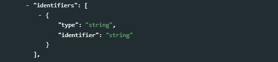
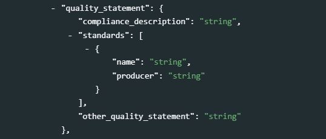
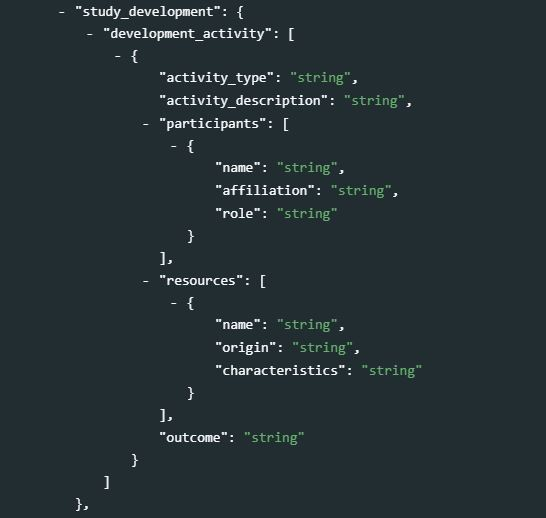
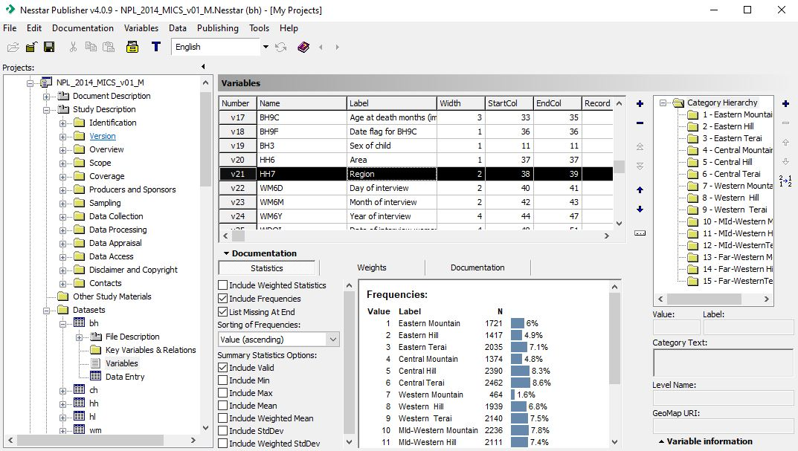

# Microdata {#chapter05}

<center>
{width=60%}
</center>
<br>

## Definition of microdata     

When surveys or censuses are conducted, or when administrative data are recorded, information is collected on each unit of observation. The unit of observation can be a person, a household, a firm, an agricultural holding, a facility, or other. Microdata are the data files resulting from these data collection activities, which contain the <u>unit-level</u> information (as opposed to aggregated data in the form of counts, means, or other). Information on each unit is stored in *variables*, which can be of different types (e.g. numeric or alphanumeric, discrete or continuous). These variables may contain data reported by the respondent (e.g., the marital status of a person), obtained by observation or measurement (e.g., the GPS location of a dwelling), or generated by calculation, recoding or derivation (e.g., the sample weight in a survey). 

For efficiency reasons, variables are often stored in numeric format (i.e. coded values), even when they contain qualitative information (coded values). For example, the sex of a respondent may be stored in a variable named ‘Q_01’, and include values 1, 2 and 9 where 1 represents "male", 2 represents "female", and 9 represents "unreported". Microdata must therefore be provided at a minimum with a data dictionary containing the variables and value labels and, for derived variables, information of the derivation process. But many other features of a micro-dataset should also be described such as the objectives and the methodology of data collection (including a description of the sampling design for sample surveys), the period of data collection, the identification of the primary investigator and other contributors, the scope and geographic coverage of the data, and much more. This information will make the data usable and discoverable.

## The Data Documentation Initiative (DDI) metadata standard

The DDI metadata standard provides a structured and comprehensive list of hundreds of elements and attributes which may be used to document microdata. It is unlikely that any one study would ever require using them all, but this list provides a convenient solution to foster completeness of the information, and to generate documentation that will meet the needs of users. 

The Data Documentation Initiative (DDI) metadata standard originated in the [Inter-university Consortium for Political and Social Research (ICPSR)](https://www.icpsr.umich.edu/web/pages/), a membership-based organization with more than 500 member colleges and universities worldwide. The DDI is now the project of an alliance of North American and European institutions. Member institutions comprise many of the largest data producers and data archives in the world. The DDI standard is used by a large community of data archivists, including data librarians from academia, data managers in national statistical agencies and other official data producing agencies, and international organizations. The standard has two branches: the [DDI-Codebook](https://ddialliance.org/Specification/DDI-Codebook/2.5/) (version 2.x) and the [DDI LifeCycle](https://ddialliance.org/Specification/DDI-Lifecycle/) (version 3.x). These two branches serve different purposes and audiences. For the purpose of data archiving and cataloguing, the schema we recommend in this Guide is the DDI-Codebook. We use a slightly simplified version of version 2.5 of the standard, to which we add a few elements (including the `tags` element common to all schemas described in the Guide.

The DDI standard is published under the terms of the [GNU General Public License]((http://www.gnu.org/licenses) (version 3 or later). 


### DDI-Codebook

The DDI Alliance developed the [DDI-Codebook](https://ddialliance.org/Specification/DDI-Codebook/2.5/) for organizing the content, presentation, transfer, and preservation of metadata in the social and behavioral sciences. It enables documenting microdata files in a simultaneously flexible and rigorous way. The DDI-Codebook aims to provide a straightforward means of recording and communicating all the salient characteristics of a micro-dataset. 

The DDI-Codebook is designed to encompass the kinds of data resulting from surveys, censuses, administrative records, experiments, direct observation and other systematic methodology for generating empirical measurements. The unit of observation can be individual persons, households, families, business establishments, transactions, countries or other subjects of scientific interest. 

The DDI Alliance publishes the DDI-Codebook as an XML schema. We present in this Guide a JSON implementation of the schema, which is used in our R package *NADAR* and Python Library *PyNADA*. The [NADA cataloguing](https://nada.ihsn.org/) application works with both the XML and the JSON version. A DDI-compliant metadata file can be converted from the JSON schema to the XML or from XML to JSON. 


### DDI-Lifecycle

As indicated by the [DDI Alliance website](https://ddialliance.org/Specification/DDI-Lifecycle/3.3/), **DDI-Lifecycle** is "designed to document and manage data across the entire life cycle, from conceptualization to data publication, analysis and beyond. It encompasses all of the DDI-Codebook specification and extends it. Based on XML Schemas, DDI-Lifecycle is modular and extensible." DDI-lifecycle can be used to "populate variable and question banks to explore available data and question structures for reuse in new surveys". As this is not our objective, and because using the DDI-Lifecycle adds significant complexity, we do not make use of it and this chapter only covers the DDI-Codebook.


## Some practical considerations

The DDI is a comprehensive schema that provides metadata elements to document a **study** (e.g., a survey, or an administrative datasets), the related **data files**, and the **variables** they contain. A separate schema is used to document the **related resources** (questionnaires, reports, and others); see Chapter 13. 

Some datasets may contain hundreds or even thousands of variables. For each variable, the DDI can include not only the variable name, label and description, but also summary statistics like the count of valid and missing observations, weighted and unweighted frequencies, means, and others. Generating a DDI file manually, in particular the variable-level metadata, can be a tedious and time consuming task. But variable names, summary statistics, and (when avaiulable) variable and value labels can be extracted directly from the data files. User-friendly solutions (specialized metadata editors) are available to automate a large part of this work. DDI can also be generated programmatically using R or Python. Section 5.5 provides examples of the use of specialized DDI metadata editors and programming languages to generate DDI-compliant metadata. 

Documenting microdata is more complex than documenting publications or other types of data like tables or indicators. The production of microdata often involves experts in survey design, sampling, data processing, and analysis. Generating the metadata should thus be a collective responsibility and will ideally be done in real time ("document as you survey"). Data documentation should be implemented during the whole lifecycle of data production, not as an *ex post* task. This is in line with what the [Generic Statistical Business process Model (GSBPM)](https://statswiki.unece.org/display/GSBPM/VI.+Overarching+Processes) recommends: "Good metadata management is essential for the efficient operation of statistical business processes. Metadata are present in every phase, either created, updated or carried forward from a previous phase or reused from another business process. In the context of this model, the emphasis of the overarching process of metadata management is on the creation/revision, updating, use and archiving of statistical metadata, though metadata on the different sub-processes themselves are also of interest, including as an input for quality management. The key challenge is to ensure that these metadata are captured as early as possible, and stored and transferred from phase to phase alongside the data they refer to." Too often, microdata are documented after completion of the data collection, sometimes by a team who was not directly involved in the production of the data. In such cases, some information may not have been captured and will be difficult to find or reconstruct. 


> **Suggestions and recommendations to data curators**<br>
   <br>
   - Generating detailed metadata at the variable level (including elements like the formulation of the questions, variable and value labels, interviewer instructions, universe, derivation procedures, etc.) may seem to be a tedious exercise, but it adds considerable value to the metadata. Indeed, it will (i) provide a detailed data dictionary, required to make the data usable, (ii) provide the necessary information for making the data more discoverable and to enable variable comparison tools, and (iii) guarantee the preservation of institutional memory. The cost of generating such metadata will be very small relative to the cost of generating the data.<br>
   - To make the data more discoverable, attention should be paid to provide a detailed description of the scope and objectives of the data collection. When a survey (or other microdataset) is used to generate statistical indicators, a list of these indicators should be provided in the metadata.<br>
   - The `keywords` metadata element provides a flexible solution to improve the discoverability of data. For example, a survey that collects data on children age, weight and height, will be relevant for measuring malnutrition and generating indicators like prevalence of stunting or wasting, overweight and underweight. The variable description alone would not make the data discoverable in keyword-based search engines, hence the importance of adding relevant terms and phrases in the `keyword` section.<br>
   - The DDI metadata will be saved as an XML or JSON file, i.e. as plain text. This means that the DDI metadata cannot include complex formulas. The description of some variables, as well as the description of a survey sample design, may require the use of formulas. In such case, the recommendation is to provide as much of the information as possible in the DDI, and to provide links to documents where the formulas can be found (these documents would be published with the metadata as *external resources*).  


## Schema description: DDI-Codebook 2.5

The DDI-Codebook is a comprehensive, structured list of elements to be used to document microdata of any source. The standard contains five main sections:

   - **Document description** (`doc_desc`), with elements used to <u>describe the metadata</u> (not the data); the term "document" refers here to the XML (or JSON) file that contains the metadata.
   - **Study description** (`study_desc`), which contains the elements used to describe the study itself (the survey, the administrative process, or the other activity that resulted in the production of the microdata). This section will contain information on the primary investigator, scope and coverage of the data, sampling, etc. 
   - **File description** (`data_files`), which provides elements to document each data file that compose the dataset (this is thus a repeatable block of elements).
   - **Variable description** (`variables`), with elements used to describe each variable contained in the data files, including the variable names, the variable and value labels, summary statistics for each variable, interviewers' instructions, description of recoding or derivation procedure, and more.
   - **Variable groups** (`variable_groups`), an optional section that allows organizing variables by thematic or other groups, independently from the data file they belong to. Variable groups are "virtual"; the grouping of variables does not affect the data files.
  <br>
  <br>
  {width=100%}
  <br>

The DDI-Codebook also provides a solution to describe OLAP cubes, which we do not make use of as our purpose is to use the standard to document and catalog datasets, not to manage data.

The `provenance`, `tags`, and `additional` sections are not part of the DDI standard. The `provenance` section allows data curators to store information on harvested metadata; the `tags` is a section common to all schemas (with the exception of the *external resources* schema), which provides a flexible solution to generate customized facets in data catalogs. The `additional` section allows data curators to supplement the DDI standard with their own metadata elements, without breaking compliance with the DDI. 

> NOTE: Each metadata element in the DDI standard has a name. In our JSON version of the standard, we do not make use of the exact same names. We adapted some of them for clarity. For example, we renamed the DDI element `titlStmt` as `title_statement`. In the documentation below, we provide the equivalence between the original element name and the name we use. The original name will be indicated as follows: `title_statement` *[DDI: \<titlStmt>\]*. JSON files created using our adapted version of the DDI can be exported as a DDI 2.5 compliant and validated XML file using R or Python scripts provided in the NADAR package and PyNADA library.

The documentation of the schema starts with a few elements which are not metadata elements, but are used to control how the metadata are published in a NADA catalog. These fields are only used when metadata are published using tools like R (NADAR) or Python (PyNADA) and the NADA API.

- **`repositoryid`** identifies the data catalog/collection in which the metadata will be published. 
- **`access_policy`** indicates the access policy to be applied to the microdata (open access, public use files, licensed access, no access, etc.)
- **`published`**: Indicates whether the metadata will be made visible to visitors of the catalog. By default, the value is 0 (unpublished). This value must be set to 1 (published) to make the metadata visible.
- **`overwrite`**: Indicates whether metadata that may have been previously uploaded for the same dataset can be overwritten. By default, the value is "no". It must be set to "yes" to overwrite existing information. Note that a dataset will be considered as being the same as a previously uploaded one if the identifier provided in the metadata element  `study_desc > title_statement > idno` is the same. 

### Document description  

**`doc_desc`** *[DDI: \<docDscr>\ ; Optional ; Not repeatable]* <br>
Documenting a study using the DDI-Codebook standard consists of generating a metadata file in XML or JSON format. This file is what is referred to as the metadata *document*. The `doc_desc` or **document description** is thus a description of the metadata file, and consists of bibliographic information describing the DDI-compliant document as a whole. As a same dataset can possibly be documented by more than one organization, and because metadata can be automatically harvested by on-line catalogs, traceability of the metadata is important. This section, which only contains five main elements, should be as complete as possible, and at least contain information on the `producer` and `prod_date`; information.

{width=100%}

- **`title`** *[DDI: \<@@@>\ ; Optional ; Not repeatable ; String]* <br>
The title of the metadata document (which may be the title of the study itself). The title should indicate the geographic scope of the data collection as well as the time period covered. For example: "Albania Living Standards Study 2012".

- **`idno`** *[DDI: \<@@@>\ ; Optional ; Not repeatable ; String]* <br>
A unique identifier for the metadata document (unique in the catalog; ideally also unique globally). This is different from the unique identifier found in section `study_description / title_statement / idno`, although it is good practice to generate identifiers that establish a clear connection between the two identifiers. For example, if the unique identifier of the document is "ALB_LSMS_2012", the identifier in the metadata_information generated by the World Bank Development Data Group could be "WBDG_ALB_LSMS_2012". 

- **`producers`** *[DDI: \<@@@>\ ; Optional ; Repeatable]* <br>
The producer (of the metadata) is the person or organization with the financial and/or administrative responsibility for the processes whereby the metadata document was created.
    - **`name`** *[DDI: \<@@@>\ ; Optional ; Not repeatable ; String]* <br> 
    The name of the person or organization in charge of the production of the DDI metadata. If the name of individuals cannot be provided due to an organization's data protection rules, the title of the person, or an anonymized identifier, can be provided (or this field can be left blank if no other option is available).
    - **`abbr`** *[DDI: \<@@@>\ ; Optional ; Not repeatable ; String]*  <br>
    The initials of the person, or the abbreviation of the organization's name mentioned in `name`.
    - **`affiliation`** *[DDI: \<@@@>\ ; Optional ; Not repeatable ; String]* <br> 
    The affiliation of the person or organization mentioned in `name`.
    - **`role`** *[DDI: \<@@@>\ ; Optional ; Not repeatable ; String]*  <br>
    The specific role of the person or organization in the production of the DDI metadata. <br><br>

- **`prod_date`** *[DDI: \<prodDate>\ ; Optional ; Not repeatable ; String]*  <br>
The date the DDI document was produced (not the date it was distributed or archived). It is recommended to enter the date in the ISO 8601 date format (YYYY-MM-DD or YYYY-MM or YYYY). 

- **`version_statement`** *[DDI: \<@@@>\ ; Optional ; Not repeatable]*  <br>
A version statement for the metadata (DDI) document. Documenting a dataset is not a trivial exercise. It may happen that, having identified errors or gaps in a DDI document, or after receiving suggestions for improvement or additional input, the DDI metadata are modified. The `version_statement` describes the version of the metadata document. It is good practice to provide a version number and date, and information on what distinguishes the current version from the previous one(s).
    - **`version`** *[DDI: \<@@@>\ ; Optional ; Not repeatable ; String]*  <br>
    The label of the version, also known as release or edition. For example, *Version 1.2* 
    - **`version_date`** *[DDI: \<@@@>\ ; Optional ; Not repeatable ; String]*  <br>
    The date when the version was produced, preferably identifying an exact date. This will usually correspond to the `prod_date` element. It is recommended to enter the date in the ISO 8601 date format (YYYY-MM-DD or YYYY-MM or YYYY). 
    - **`version_resp`** *[DDI: \<verResp>\ ; Optional ; Not repeatable ; String]*  <br>
    The organization or person responsible for the version of the work.
    - **`version_notes`** *[DDI: \<notes>\ ; Optional ; Not repeatable ; String]* <br>
    This element can be used to clarify information/annotation regarding the version.
    
  > Example in R:  

    ```{r, eval=F, echo=T}
    
    my_ddi <- list(
      
      doc_desc = list(
        title = "Albania Living Standards Study 2012",
        idno = "DDI_WB_ALB_2012_LSMS_v02",
        producers = list(
          list(name = "Development Data Group", 
               abbr = "DECDG", 
               affiliation = "World Bank", 
               role = "Production of the DDI-compliant metadata"
          )     
        ),
        prod_date = "2021-02-16",
        version_statement = list(
          version = "Version 2.0",
          version_date = "2021-02-16",
          version_resp = "OD",
          version_notes = "Version identical to Version 1.0 except for the Data Appraisal section which was added."
        )
      ),
      
      # ... (other sections of the DDI)
      
    )  
    ```

### Study description

**`study_desc`** *[DDI: \<stdyDscr>\ ; Required ; Not repeatable]*  <br>
The `study_desc` or **study description** consists of information about the data collection or study that the DDI-compliant documentation file describes. This section includes study-level information such as scope and coverage, objectives, producers, sampling, data collection dates and methods, etc. 

{width=100%}

- **`title_statement`**  *[DDI: \<titlStmt>\ ; Required ; Not repeatable]*  <br>
The title statement for the study. 
<br>
{width=100%}
<br>
    - **`idno`** *[DDI: \<IDNo>\ ; Required ; Not repeatable ; String]*  <br>
    `idno` is a unique identification number used to identify the study (survey, census or other). A unique identifier will be required by any data catalog. It will allow users to cite the dataset properly. The recommended option is to obtain a [Digital Object Identifier (DOI)](https://www.doi.org/) for the study, which will ensure that the identifier is unique globally. Alternatively, it can be an identifier constructed by an organization using a consistent scheme. The scheme could for example be "catalog-country-study-year-version", where *`country`* is the 3-letter ISO country code, *`producer`* is the abbreviation of the producing agency, *`study`* is the study acronym, *`year`* is the reference year (or the year the study started), *`version`* is a version number. Using that scheme, the Uganda 2005 Demographic and Health Survey for example would have the following ID (where "WBML" stand for "World Bank Microdata Library"): WBML_UGA_DHS_2005_v01. Note that the schema allows you to provide more than one identifier for a same study ; a catalog-specific identifier is thus not incompatible with a globally unique identifier like a DOI.  
    
    - **`identifiers`** *[DDI: \<@@@>\ ; Optional ; Repeatable]*  <br>
    This repeatable element is used to enter identifiers (IDs) other than the catalog ID entered in the `title_statement` (`idno`). It can for example be a Digital Object Identifier (DOI). The ID entered in the `title_statement` can be repeated here (the `title_statement` does not provide a `type` parameter; if a DOI or other standard reference ID is used as `idno`, it is recommended to repeat it here with the identification of its `type`). 
  <br>
  {width=100%}
  <br>    
    - **`type`** *[Optional ; Not repeatable ; String]* <br>
    The type of unique ID, e.g. "DOI".
    - **`identifier`** *[Required ; Not repeatable ; String]* <br>
    The identifier itself. <br>
<br>
     
    - **`title`** *[DDI: \<titl>\ ; Required ; Not repeatable ; String]*  <br>
    Provide here the full authoritative title for the study. Use unique names for distinct studies. The title should indicate the time period covered. For example, in a country conducting monthly labor force surveys, the title of a study would be like "Labor Force Survey, December 2020". When a survey spans two years (for example, a household income and expenditure survey conducted over a period of 12 months from June 2020 to June 2021), the range of years can be provided in the title, for example "Household Income and Expenditure Survey 2020-2021". The title for a survey should be its official name as stated on the questionnaire or other study documents (report, etc.). As the study title is a proper noun, the first letter of each word should be capitalized (except for prepositions or other conjunctions). Including the country name in the title is optional (another metadata element is used to identify the reference country/ies).
    
    - **`sub_title`** *[DDI: \<subTitl>\ ; Optional ; Not repeatable ; String]*  <br>
    Sub-title is optional. The `sub-title` is a secondary title used to amplify or state certain limitations on the main title, for example to add information usually associated with a sequential qualifier for a survey:
    <br>
    Title = "[country] Universal Primary Education Project, Impact Evaluation Survey 2007" ; Subtitle = "Baseline"
    Note that this could also be entered as a title: title = "[country] Universal Primary Education Project, Impact Evaluation Survey 2007 - Baseline")

    - **`alternate_title`** *[DDI: \<altTitl>\ ; Optional ; Not repeatable ; String]*  <br> 
    An alternative name used to refer to the study, such as an alias or an abbreviation. When an abbreviation is used, the study reference year(s) should be included in the `alternate_title`. For example, "DHS 2015" for the "Demographic and Health Survey 2005" or "HIES 2012-2013" for the "Household Income and Expenditure Survey 2012-2013"
    
    - **`translated_title`** *[DDI: \<altTitl>\ ; Optional ; Not repeatable ; String]*  <br>  
    In countries with more than one official language, a translation of the title may be provided. Likewise, the translated title may simply be a translation into English from a country's own language. Special characters should be properly displayed, such as accents and other stress marks or different alphabets.
<br>

  > Example in R:

  ```{r, eval=F, echo=T}
  my_ddi <- list(
    
    # ... ,
    
    study_desc = list(
      title_statement = list(
        idno = "ML_ALB_2012_LSMS_v02",
        identifiers = list(
          list(type = "DOI", identifier = "XXX-XXXX-XXX")
        ),
        title = "Living Standards Study 2012",
        alternate_title = "LSMS 2012",
        translated_title = "Anketa e Matjes së Nivelit të Jetesës (AMNJ) 2012"
      )
    ),
    
    # ...
  )  
  ```

- **`authoring_entity`** *[DDI: \<AuthEnty>\ ; Optional ; Repeatable]*  <br>
The name and affiliation of the person, corporate body, or agency responsible for the study's substantive and intellectual content (the "primary investigator"). Generally, in a survey, the authoring entity will be the institution implementing the survey. Repeat the element for each authoring entity, and enter the "affiliation" when relevant. If various institutions have been equally involved as main investigators, then should all be listed. This only includes the agencies responsible for the implementation of the study, not sponsoring agencies or entities providing technical assistance (for which other metadata elements are available). The order in which authoring entities are listed is discretionary. It can be alphabetic or by significance of contribution. Individual persons can also be mentioned, if not prohibited by privacy protection rules. 
<br>
{width=100%}
<br>
    - **`name`** *[DDI: \<@@@>\ ; Optional ; Not repeatable ; String]*  <br>
    The name of the person, corporate body, or agency responsible for the work's substantive and intellectual content. The primary investigator will in most cases be an institution, but could also be an individual in the case of small-scale academic surveys. If persons are mentioned, use the appropriate format of *Surname, First name*.
    - **`affiliation`** *[DDI: \<@@@>\ ; Optional ; Not repeatable ; String]*  <br>
    The affiliation of the person, corporate body, or agency mentioned in `name`.
<br>

  > Example in R:

    ```{r, eval=F, echo=T}
    my_ddi <- list(
      
      # ... ,
      
      study_desc = list(
        
        # ... ,
        
        authoring_entity = list(
          
          list(name = "National Statistics Office of Popstan (NSOP)", 
               affiliation = "Ministry of Planning"),
          
          list(name = "Department of Public Health of Popstan (DPH)", 
               affiliation = "Ministry of Health")
          
        ),
        
        # ...
      )
      
    )  
    ```

- **`oth_id`** *[DDI: \<othId>\ ; Optional ; Repeatable]*  <br>
This element is used to acknowledge any other people and organizations that have in some form contributed to the study. This does not include financial sponsors, which should be listed in the element `funding_agencies` (see below).
    - **`name`** *[DDI: \<othId - name>\ ; Required ; Not repeatable ; String]*  <br>
    The person or organization name.
    - **`role`** *[DDI: \<othId - role>\ ; Optional ; Not repeatable ; String]* <br>
    Describes the specific role of the person or organization mentioned in `name`.
    - **`affiliation`** *[DDI: \<othId - affiliation>\ ; Optional ; Not repeatable ; String]* <br>
    Affiliation of the person or organization mentioned in `name`.
<br>

  > Example in R:

    ```{r, eval=F, echo=T}
    my_ddi <- list(
      
      # ... ,
      
      study_desc = list(
        # ... ,
        
        oth_id = list(
          list(name = "John Doe", 
               role = "Technical advisor in sample design", 
               affiliation = "World Bank Group"
          )
        ),
        # ...
      
      )
      
    )  
    ```

- **`production_statement`** *[DDI: \<prodStmt>\ ; Optional ; Not repeatable]* <br>
A production statement for the work at the appropriate level. 
<br>
{width=100%}
<br>
    - **`producers`** *[DDI: \<producer>\ ; Optional ; Repeatable]* <br>
    This field is provided to list other interested parties and persons that have played a significant but not the leading technical role in implementing and producing the data (which will be listed in `authoring_entity`). Do not include here the financial sponsors.
        - **`name`** *[DDI: \<@@@>\ ; Required ; Not repeatable ; String]* <br>
        The name of the individual or organization.
        - **`abbr`** *[DDI: \<@@@>\ ; Optional ; Not repeatable ; String]* <br>
        The official abbreviation of the organization mentioned in `name`.
        - **`affiliation`** *[DDI: \<@@@>\ ; Optional ; Not repeatable ; String]*<br>
        The affiliation of the person or organization mentioned in `name`.
        - **`role`** *[DDI: \<@@@>\ ; Optional ; Not repeatable ; String]* <br>
        The role should be a short and succinct description of the specific contribution by the person or organization in the production of the data. <br>

    - **`copyright`** *[DDI: \<copyright>\ ; Optional ; Not repeatable ; String]* <br>
    A copyright statement for the study at the appropriate level. 
   
    - **`prod_date`** *[DDI: \<prodDate>\ ; Optional ; Not repeatable ; String]* <br>
    The [ISO 8601](https://en.wikipedia.org/wiki/ISO_8601) standard for dates is recommended. This is the date (preferably entered in ISO 8601 format: YYYY-MM-DD or YYYY-MM or YYYY) of the actual and final production of the dataset. Provide at least the month and year. Production dates of all versions should be carefully tracked. 

    - **`prod_place`** *[DDI: \<prodPlac>\ ; Optional ; Not repeatable ; String]* <br>
    The address of the organization that produced the study.
   
    - **`funding_agencies`** *[DDI: \<fundAg>\ ; Optional ; repeatable]* <br>
    The source(s) of funds for the production of the study. If different funding agencies sponsored different stages of the production process, use the `role` attribute to distinguish them. 
        - **`name`** *[DDI: \<fundAg - name>\ ; Required ; Not repeatable ; String]* <br>
        The name of the funding agency.
        - **`abbr`** *[DDI: \<fundAg - abbr>\ ; Optional ; Not repeatable ; String]* <br>
        The abbreviation (acronym) of the funding agency mentioned in `name`.
        - **`grant`** *[DDI: \<@@@>\ ; Optional ; Not repeatable ; String]* <br>
        The grant number. If an agency has provided more than one grant, list them all separated with a ";".
        - **`role`** *[DDI: \<fundAg - role>\ ; Optional ; Not repeatable ; String]* <br>
        The specific contribution of the funding agency mentioned in `name` (used when multiple funding agencies are listed to distinguish their specific contributions).<br>
<br>

  > Example in R: The Bangladesh 2018-2019 Demographic and Health Survey (DHS) 

    ```{r, eval=F, echo=T}
    my_ddi <- list(
      
      # ... ,
      
      study_desc = list(
        
        # ... ,
        
        production_statement = list(
          
          producers = list(
            
            list(name = "National Institute of Population Research and Training",
                 abbr = "NIPORT",
                 role = "Primary investigator"),
            
            list(name = "Medical Education and Family Welfare Division",
                 role = "Advisory"),
            
            list(name = "Ministry of Health and Family Welfare",
                 abbr = "MOHFW",
                 role = "Advisory"),
            
            list(name = "Mitra and Associates",
                 role = "Data collection - fieldwork"),
            
            list(name = "ICF (consulting firm)",
                 role = "Technical assistance / DHS Program")
          
          ),
          
          prod_date = "2019",   
          
          prod_place = "Dhaka, Bangladesh",
          
          funding_agencies = list(
            list(name = "United States Agency for International Development",
                 abbr = "USAID")
          )
          
        ),    
        # ...,    
        
      )
      # ...
      
    )
    ```

- **`distribution_statement`** *[DDI: \<distStmt>\; Optional ; Not repeatable]* <br>
A distribution statement for the study.
<br>
{width=100%}
<br>
    - **`distributors`** *[DDI: \<distrbtr>\ ; Optional ; Repeatable]* <br>
    The organization(s) designated by the author or producer to generate copies of the study output including any necessary editions or revisions.
        - **`name`** *[DDI: \<distrbtr - name>\ ; Required ; Not repeatable ; String]* <br>
        The name of the distributor. It can be an individual or an organization.
        - **`abbr`** *[DDI: \<distrbtr - abbr>\ ; Optional ; Not repeatable ; String]* <br>
        The official abbreviation of the organization mentioned in `name`. 
        - **`affiliation`** *[DDI: \<distrbtr - affiliation>\ ; Optional ; Not repeatable ; String]* <br>
        The affiliation of the person or organization mentioned in `name`.<br>
        - **`uri`** *[DDI: \<distrbtr - URI>\ ; Optional ; Not repeatable ; String]* <br>  
        A URL to the ordering service or download facility on a Web site.<br><br>

    - **`contact`** *[DDI: \<contact>\ ;  Optional ; Repeatable]* <br>
    Names and addresses of individuals responsible for the study. Individuals listed as contact persons will be used as resource persons regarding problems or questions raised by users.<br>
        - **`name`** *[DDI: \<contact - name>\ ; Required ; Not repeatable ; String]* <br>
        The name of the person or organization that can be contacted. 
        - **`affiliation`** *[DDI: \<contact - affiliation>\ ; Optional ; Not repeatable ; String]* <br>
        The affiliation of the person or organization mentioned in `name`.
        - **`email`** *[DDI: \<contact - email>\ ; Optional ; Not repeatable ; String]* <br>
        An email address for the contact mentioned in `name`. <br>
        - **`uri`** *[DDI: \<contact - URI>\ ; Optional ; Not repeatable ; String]* <br>  
        A URL to the contact.<br><br>

    - **`depositor`** *[DDI: \<depositr>\ ; Optional ; Repeatable]* <br>
    The name of the person (or institution) who provided this study to the archive storing it. <br>
        - **`name`** *[DDI: \<depositr - name>\ ; Required ; Not repeatable ; String]* <br>
        The name of the depositor. It can be an individual or an organization.
        - **`abbr`** *[DDI: \<depositr - abbr>\ ; Optional ; Not repeatable ; String]* <br>
        The official abbreviation of the organization mentioned in `name`.
        - **`affiliation`** *[DDI: \<depositr - affiliation>\ ; Optional ; Not repeatable ; String]* <br>
        The affiliation of the person or organization mentioned in `name`.
        - **`uri`** *[DDI: \<depositr - URI>\ ; Optional ; Not repeatable ; String]* <br>  
        A URL to the depositor<br><br>

    - **`deposit_date`** *[DDI: \<depDate>\ ; Optional ; Not repeatable ; String]* <br>
    The date that the study was deposited with the archive that originally received it. The date should be entered in the ISO 8601 format (YYYY-MM-DD). <br>

    - **`distribution_date`** *[DDI: \<distDate>\ ; Optional ; Not repeatable ; String]* <br>
    Date that the work was made available for distribution/presentation. The date should be entered in the ISO 8601 format (YYYY-MM-DD). <br>

  > Example in R:  @@@@@@@@@@@@

    ```{r, eval=F, echo=T}
    my_ddi <- list(
      doc_desc = list(
        # ... 
      ),
      study_desc = list(
        # ... ,
        
        distribution_statement = list(
          
           distributors = list(
             list(name = "World Bank Microdata Library",           
                  abbr = "WBML",
                  affiliation = "World Bank Group",
                  uri = "http:/microdata.worldbank.org")
           ),
           
           contact = list(
             list(name = "",
                  affiliation = "",
                  email = "",
                  uri = "")
           ),
           
           depositor = list(
             list(name = "",         
                  abbr = "",
                  affiliation = "",
                  uri = "")
           ),
           
           deposit_date = "",
           
           distribution_date = ""
           
        ),
        # ...
      )
      # ...
    )      
    ```

- **`series_statement`** *[DDI: \<serStmt>\ ; Optional; Not repeatable]* <br>
A series statement for the study. If the study does not belong to a series, leave this field empty. The URI attribute is provided to point to a central Internet repository of series information. Repeat this field if the study is part of more than one series. 
    <br>
    {width=100%}
    <br>
    - **`series_name`** *[DDI: \<serName>\ ; Optional ; Not repeatable ; String]* <br>
    The name of the series to which the study belongs. <br>
    - **`series_info`** *[DDI: \<serInfo>\ ; Optional ; Not repeatable ; String]* <br>
    A study may be repeated at regular intervals (such as an annual labor force survey), or be part of an international survey program (such as the MICS, DHS, LSMS and others). The series information is a description of this "collection" of studies. A brief description of the characteristics of the study, including when it started, how many rounds were already implemented, and who is in charge would be provided here. <br>

  > Example in R:

    ```{r, eval=F, echo=T}
    my_ddi <- list(
      doc_desc = list(
        # ... 
      ),
      
      study_desc = list(
        # ... ,
        series_statement = list(
          list(series_name = "Multiple Indicator Cluster Survey (MICS) by UNICEF",
               series_info = "The Multiple Indicator Cluster Survey, Round 3 (MICS3) is the third round of MICS surveys, previously conducted around 1995 (MICS1) and 2000 (MICS2). MICS surveys are designed by UNICEF, and implemented by national agencies in participating countries. MICS was designed to monitor various indicators identified at the World Summit for Children and the Millennium Development Goals. Many questions and indicators in MICS3 are consistent and compatible with the prior round of MICS (MICS2) but less so with MICS1, although there have been a number of changes in definition of indicators between rounds. Round 1 covered X countries, round 2 covered Y countries, and Round Z covered N countries.")
        ),
        # ...
      ),
      # ...
    )  
    ```

- **`version_statement`** *[DDI: \<verStmt>\ ; Optional; Not repeatable]* <br>
Version statement for the study. 
<br>
{width=100%}
<br>
The version statement should contain a version number followed by a version label. The version number should follow a standard convention to be adopted by the data repository. We recommend that larger series be defined by a number to the left of a decimal and iterations of the same series by a sequential number that identifies the release. The left number could for example be (0) for the raw, unedited dataset; (1) for the edited dataset, non anonymized, available for internal use at the data producing agency; and (2) the edited dataset, prepared for dissemination to secondary users (possibly anonymized). Example: <br>
    v0: Basic raw data, resulting from the data capture process, before any data editing is implemented.<br>
    v1.0: Edited data, first iteration, for internal use only. <br>
    v1.1: Edited data, second iteration, for internal use only.<br>
    v2.1: Edited data, anonymized and packaged for public distribution. <br>
    - **`version`** *[DDI: \<verStmt - version>\ ; Optional ; Not repeatable ; String]* <br>
    The version number, also known as release or edition. 
    - **`version_date`** *[DDI: \<verStmt - date>\ ; Optional ; Not repeatable ; String]* <br>
    The ISO 8601 standard for dates (YYYY-MM-DD) is recommended for use with the "date" attribute.
    - **`version_resp`** *[DDI: \<verResp>\ ; Optional ; Not repeatable ; String]* <br>
    The person(s) or organization(s) responsible for this version of the study.
    - **`version_notes`** *[DDI: \<verStmt - notes>\ ; Optional ; Not repeatable ; String]* <br>
    Version notes should provide a brief report on the changes made through the versioning process. The note should indicate how this version differs from other versions of the same dataset.<br>
<br>

  > Example in R:

    ```{r, eval=F, echo=T}
    my_ddi <- list(
      
        # ... 

      study_desc = list(
        
        # ... ,
        
        version_statement = list(
          version = "Version 1.1",
          version_date = "2021-02-09",
          version_resp = "National Statistics Office, Data Processing unit",
          version_notes = "This dataset contains the edited version of the data that were used to produce the Final Survey Report. It is equivalent to version 1.0 of the dataset, except for the addition of an additional variable (variable weight2) containing a calibrated version of the original sample weights (variable weight)"
        ),
        
        # ...
        
      ),
      
      # ...
      
    )  
    ```

- **`bib_citation`** *[DDI: \<biblCit>\ ; Optional ; Not repeatable ; String]* <br>
Complete bibliographic reference containing all of the standard elements of a citation that can be used to cite the study. The `bib_citation_format` (see below) is provided to enable specification of the particular citation style used, e.g., APA, MLA, Chicago, etc. 
<br>
{width=100%}  
<br>

- **`bib_citation_format`** *[DDI: \<biblCit - format>\ ; Optional ; Not repeatable ; String]* <br>
This element is used to specify the particular citation style used in the field `bib_citation` described above, e.g., APA, MLA, Chicago, etc. <br>

  > Example in R:

  ```{r, eval=F, echo=T}
    my_ddi <- list(
      doc_desc = list(
        # ... 
      ),
      study_desc = list(
        # ... ,
        bib_citation = "",
        bib_citation_format = ""
        # ...
      ),
      # ...
    )  
  ```

- **`holdings`** *[DDI: \<holdings>\ ; Optional ; Repeatable]* <br>
Information concerning either the physical or electronic holdings of the study being described. 
<br>
{width=100%}  
<br>
   -**`name`** *[DDI: \<@@@>\ ; Optional ; Not repeatable ; String]* <br>
   Name of the physical or electronic holdings of the cited study.<br>
   -**`location`** *[DDI: \<holdings - location>\ ; Optional ; Not repeatable ; String]* <br>
   The physical location where a copy of the study is held.<br>
   -**`callno`** *[DDI: \<holdings - callno>\ ; Optional ; Not repeatable ; String]* <br>
   The call number at the location specified in `location`.<br>
   -**`uri`** *[DDI: \<holdings -  URI>\ ; Optional ; Not repeatable ; String]* <br> 
   A URL for accessing the electronic copy of the cited study from the location mentioned in `name`.<br>
<br>

> Example in R:

```{r, eval=F, echo=T}
my_ddi <- list(
  doc_desc = list(
    # ... 
  ),
  study_desc = list(
    # ... ,
    holdings = list(
       name = "World Bank Microdata Library",
       location = "World Bank, Development Data Group",
       uri = "http://microdata.worldbank.org"
    ),
    # ...
  ),
  # ...
)  
```

- **`study_notes`** *[DDI: \<notes>\ ; Optional ; Not repeatable]* <br>
<br>
{width=100%}  
<br>
This element can be used to provide additional information on the study which cannot be accommodated in the specific metadata elements of the schema, in the form of a free text field.

- **`study_authorization`** *[DDI: \<studyAuthorization>\ ; Optional ; Not repeatable]* <br>
<br> 
{width=100%}
<br> 
Provides structured information on the agency that authorized the study, the date of authorization, and an authorization statement. This element will be used when a special legislation is required to conduct the data collection (for example a Census Act) or when the approval of an Ethics Board or other body is required to collect the data.
    - **`date`** *[DDI: \<studyAuthorization - date>\ ; Optional ; Not repeatable ; String]* 
    The date, preferably in ISO 8601 format (YYYY-MM-DD) when the authorization to conduct the study was granted.<br>
    - **`agency`** *[DDI: \<authorizingAgency>\ ; Optional ; Repeatable]* <br> 
    Identification of the agency that authorized the study.
       - **`name`** *[DDI: \<@@@>\ ; Optional ; Not repeatable ; String]* <br>
       Name of the agent or agency that authorized the study. 
       - **`affiliation`** *[DDI: \<authorizingAgency - affiliation>\ ; Optional ; Not repeatable ; String]* <br>
       The institutional affiliation of the authorizing agent or agency mentioned in `name`. 
       - **`abbr`** *[DDI: \<authorizingAgency - abbr>\ ; Optional ; Not repeatable ; String]* <br>
       The abbreviation of the authorizing agent's or agency's name.<br><br>
    - **`authorization_statement`** *[DDI: \<authorizationStatement>\ ; Optional ; Not repeatable ; String]* <br>
    The text of the authorization (or a description and link to a document or other resource containing the authorization statement). <br>

  > Example in R:

    ```{r, eval=F, echo=T}
    my_ddi <- list(
      doc_desc = list(
        # ... 
      ),
      study_desc = list(
        # ... ,
        study_authorization = list(
           date = "2018-02-23",
           agency = list(
              name = "Institutional Review Board of the University of Popstan",
              abbr = "IRB-UP")
        ),
        authorization_statement = "The required documentation covering the study purpose, disclosure information, questionnaire content, and consent statements was delivered to the IRB-UP on 2017-12-27 and was reviewed by the compliance officer. Statement of authorization for the described study was issued on 2018-02-23."
        # ...
      ),
      # ...
    )  
    ```

- **`study_info`** *[DDI: \<stdyInfo>\ ; Required ; Not repeatable]* <br>
This section contains the metadata elements needed to describe the core elements of a study including the dates of data collection and reference period, the country and other geographic coverage information, and more. These elements are not required in the DDI standard, but documenting a study without provinding at least some of this information would make the metadata mostly irrelevant.  

   - **`study_budget`** *[DDI: \<studyBudget>\ ; Optional ; Not repeatable ; String]* <br>
   <br> 
   {width=100%}
   <br>
   This is a free-text field, not a structured element. The budget of a study will ideally be described by budget line. The currency used to describe the budget should be specified. This element can also be used to document issues related to the budget (e.g., documenting possible under-run and over-run).<br>
<br>

  > Example in R:

    ```{r, eval=F, echo=T}
      my_ddi <- list(
      # ... ,
      study_desc = list(
        # ... ,
        study_info = list(
          study_budget = "The study had a total budget of 500,000 USD allocated as follows:
              By type of expense:
                - Staff: 150,000 USD
                - Consultants (incl. interviewers): 180,000 USD
                - Travel: 50,000 USD
                - Equipment: 90,000 USD
                - Other: 30,000 USD
              By activity
                - Study design (questionnaire design and testing, sampling, piloting): 100,000 USD
                - Data collection: 250,000 USD
                - Data processing and tabulation: 80,000 USD
                - Analysis and dissemination: 50,000 USD
                - Evaluation: 20,000 USD
              By source of funding:
                - Government budget: 300,000 USD 
                - External sponsors
                   - Grant ABC001 - 150,000 USD
                   - Grant XYZ987 - 50,000 USD",
          
          # ... 
          
      ),
      # ...
    )  
    ```
<br>
    - **`keywords`** *[DDI: \<keyword>\ ; Optional ; Repeatable]* <br>
    <br>
    {width=100%}
    <br>    
    Keywords are words or phrases that describe salient aspects of a data collection's content. The addition of keywords can significantly improve the discoverability of data. Keywords can summarize and improve the description of the content or subject matter of a study. For example, keywords "poverty", "inequality", "welfare", and "prosperity" could be attached to a household income survey used to generate poverty and inequality indicators (for which these keywords may not appear anywhere else in the metadata). A controlled vocabulary can be employed. Keywords can be selected from a standard thesaurus, preferably an international, multilingual thesaurus. <br>
       - **`keyword`** *[DDI: \<keyword>\ ; Required ; String ; Non repeatable]* <br>
       A keyword (or phrase).  
       - **`vocab`** *[DDI: \<keyword - vocab>\ ; Optional ; Not repeatable ; String]* <br>
       The controlled vocabulary from which the keyword is extracted, if any.  
       - **`uri`** *[DDI: \<keyword - vocabURI>\ ; Optional ; Not repeatable ; String]* <br>
       The URI of the controlled vocabulary used, if any.<br>
  <br>
  
  > Example in R 

  ```{r, eval=F, echo=T}

  my_ddi <- list(
    doc_desc = list(
      # ... 
    ),
    study_desc = list(
      # ... ,
      study_info = list(
        # ... ,
        
        keywords = list(
          list(keyword = "poverty",
               vocab = "UNESCO Thesaurus",
               uri = "http://vocabularies.unesco.org/browser/thesaurus/en/"),
          list(keyword = "income distribution",
               vocab = "UNESCO Thesaurus",
               uri = "http://vocabularies.unesco.org/browser/thesaurus/en/"),
          list(keyword = "inequality",
               vocab = "UNESCO Thesaurus",
               uri = "http://vocabularies.unesco.org/browser/thesaurus/en/")     
        ),
        
      # ...
    ),
    # ...
  )          
  ```

<br>
    - **`topics`** *[DDI: \<topcClas>\ ; Optional ; Repeatable]* <br>
    The `topics` field indicates the broad substantive topic(s) that the study covers. A topic classification facilitates referencing and searches in on-line data catalogs.
    <br>
    {width=100%}
    <br> 
       - **`topic`** *[DDI: \<topcClas>\ ; Required ; Not repeatable]* <br>
       The label of the topic. Topics should be selected from a standard controlled vocabulary such as the [Council of European Social Science Data Archives (CESSDA) Topic Classification](https://vocabularies.cessda.eu/vocabulary/TopicClassification).<br>
       - **`vocab`** *[DDI: \<topcClas - vocab>\ ; Required ; Not repeatable]* <br>
       The specification (name including the version) of the controlled vocabulary in use.<br>
       - **`uri`** *[DDI: \<topcClas - vocabURI>\ ; Required ; Not repeatable]* <br>
       A link (URL) to the controlled vocabulary website. <br>
  
  > Example in R:
    
    ```{r, eval=F, echo=T}
    my_ddi <- list(
      doc_desc = list(
        # ... 
      ),
      study_desc = list(
        # ... ,
        study_info = list(
          # ... ,
          
          topics = list(
            
            list(topic = "Equality, inequality and social exclusion",
                 vocab = "CESSDA topics classification",
                 uri = "https://vocabularies.cessda.eu/vocabulary/TopicClassification"),
            
            list(topic = "Social and occupational mobility",
                 vocab = "CESSDA topics classification",
                 uri = "https://vocabularies.cessda.eu/vocabulary/TopicClassification")
            
            ),
        # ...
      ),
      # ...
    ) 
    ```

<br>
    - **`abstract`** *[DDI: \<abstract>\ ; Optional ; Not repeatable ; String]* <br>
    An un-formatted summary describing the purpose, nature, and scope of the data collection, special characteristics of its contents, major subject areas covered, and what questions the primary investigator(s) attempted to answer when they conducted the study. The summary should ideally be between 50 and 5000 characters long. The abstract should provide a clear summary of the purposes, objectives and content of the survey. It should be written by a researcher or survey statistician aware of the study. Inclusion of this element is strongly recommended.<br>

  > Example in R: (for the Afrobarometer Survey 1999-2000, Merged Round 1 dataset) 

    ```{r, eval=F, echo=T}
    my_ddi <- list(
      doc_desc = list(
        # ... 
      ),
      study_desc = list(
        # ... ,
        study_info = list(
          # ... ,
          
          abstract = "The Afrobarometer is a comparative series of public attitude surveys that assess African citizen's attitudes to democracy and governance, markets, and civil society, among other topics.

The 12 country dataset is a combined dataset for the 12 African countries surveyed during round 1 of the survey, conducted between 1999-2000 (Botswana, Ghana, Lesotho, Mali, Malawi, Namibia, Nigeria South Africa, Tanzania, Uganda, Zambia and Zimbabwe), plus data from the old Southern African Democracy Barometer, and similar surveys done in West and East Africa.",
          
        # ...
      ),
      # ...
    ) 
    ```

<br>
    - **`time_periods`** *[DDI: \<timePrd>\ ; Optional ; Repeatable]* <br>
    This refers to the time period (also known as span) covered by the data, not the dates of data collection.<br> 
    <br>
    {width=100%}
    <br>
        - **`start`** *[DDI: \<timePrd event="start">\ ; Required ; Not repeatable ; String]* <br>
        The start date for the cycle being described. Enter the date in ISO 8601 format (YYYY-MM-DD or YYYY-MM or YYYY).<br>
        - **`end`** *[DDI: \<timePrd event="end">\ ; Required ; Not repeatable ; String]* <br>
        The end date for the cycle being described. Enter the date in ISO 8601 format (YYYY-MM-DD or YYYY-MM or YYYY). Indicate open-ended dates with two decimal points (..)<br>
        - **`cycle`** *[DDI: \<timePrd - cycle>\ ; Optional ; Not repeatable ; String]* <br>
        The `cycle` attribute permits specification of the relevant cycle, wave, or round of data.<br>   

<br>
    - **`coll_dates`** *[DDI: \<collDate>\ ; Optional ; Repeatable]* <br>
    Contains the date(s) when the data were collected, which may be different from the date the data refer to (see `time_periods` above). For example, data may be collected over a period of 2 weeks (`coll_dates`) about household expenditures during a reference week (`time_periods`) preceding the beginning of data collection. Use the event attribute to specify the "start" and "end" for each period entered.<br> 
    <br>
    {width=100%}
    <br>
        - **`start`** *[DDI: \<collDate  - start>\ ; Required ; Not repeatable ; String]* <br>
        Date the data collection started (for the specified cycle, if any). Enter the date in ISO 8601 format (YYYY-MM-DD or YYYY-MM or YYYY).<br>
        - **`end`** *[DDI: \<collDate  - end>\ ; Required ; Not repeatable ; String]* <br>
        Date the data collection ended  (for the specified cycle, if any). Enter the date in ISO 8601 format (YYYY-MM-DD or YYYY-MM or YYYY).<br>
        - **`cycle`** *[DDI: \<collDate  - cycle>\ ; Optional ; Not repeatable ; String]* <br>
        Identification of the cycle of data collection. The `cycle` attribute permits specification of the relevant cycle, wave, or round of data. For example, a household consumption survey could visit households in four phases (one per quarter). Each quarter would be a cycle, and the specific dates of data collection for each quarter would be entered.<br>

  > Example in R: (for an impact evaluation survey with a baseline and two follow-up surveys)

    ```{r, eval=F, echo=T}
    my_ddi <- list(
      doc_desc = list(
        # ... 
      ),
      study_desc = list(
        # ... ,
        study_info = list(
          # ... ,
          
          time_periods = list(
            
            list(start = "2020-01-10",
                 end   = "2020-01-16",
                 cycle = "Baseline survey"),
            
            list(start = "2020-07-10",
                 end   = "2020-07-16",
                 cycle = "First follow-up survey"),
            
            list(start = "2021-01-10",
                 end   = "2021-01-16",
                 cycle = "Second and last follow-up survey"),
          ),
          
          coll_dates = list(
            
            list(start = "2020-01-17",
                 end = "2020-01-25",
                 cycle = "Baseline survey"),
            
            list(start = "2020-07-17",
                 end = "2020-07-24",
                 cycle = "First follow-up survey"),
            
            list(start = "2021-01-17",
                 end = "2021-01-22",
                 cycle = "Second and last follow-up survey")
            ),
          
        # ...
      ),
      # ...
    )   
    ```

<br>
    - **`nation`** *[DDI: \<nation>\ ; Optional ; Repeatable]* <br>
    Indicates the country or countries (or "economies", or "territories") covered in the study (but not the sub-national geographic areas). If the study covers more than one country, they will be entered separately.
    <br>
    {width=100%}
    <br>
        - **`name`** *[DDI: \<nation>\ ; Required ; Not repeatable ; String]* <br>
        The country name, even in cases where the study does not cover the entire country.<br> 
        - **`abbreviation`** *[DDI: \<nation - abbr>\ ; Optional ; Not repeatable ; String]* <br>
        The `abbreviation` will contain a country code, preferably the 3-letter [ISO 3166-1 country code](https://en.wikipedia.org/wiki/ISO_3166-1_alpha-3). 
   <br>       

<br>   
   - **`bbox`** *[DDI: \<geoBndBox>\ ; Optional ; Repeatable]* <br>
   This element is used to define one or multiple bounding box(es), which are the rectangular fundamental geometric description of the geographic coverage of the data. A bounding box is defined by west and east longitudes and north and south latitudes, and includes the largest geographic extent of the dataset's geographic coverage. The bounding box provides the geographic coordinates of the top left (north/west) and bottom-right (south/east) corners of a rectangular area. This element can be used in catalogs as the first pass of a coordinate-based search. This element is optional, but if the `bound_poly` element (see below) is used, then the `bbox` element must be included.<br>
      <br>
      {width=100%}
      <br>
      - **`west`** *[DDI: \<geoBndBox - westBL>\ ; Required ; Not repeatable ; String]* <br>
      West longitude of the bounding box. <br>
      - **`east`** *[DDI: \<geoBndBox - eastBL>\ ; Required ; Not repeatable ; String]* <br>
      East longitude of the bounding box. <br>
      - **`south`** *[DDI: \<geoBndBox - southBL>\ ; Required ; Not repeatable ; String]* <br>
      South latitude of the bounding box. <br>
      - **`north`** *[DDI: \<geoBndBox - northBL>\ ; Required ; Not repeatable ; String]* <br>
      North latitude of the bounding box. <br>
        
  > Example in R: For a study covering the islands of Madagascar and Mauritius
    
    <br>
    {width=45%}
    <br>
    
    ```{r, eval=F, echo=T}
    my_ddi <- list(
      doc_desc = list(
        # ... 
      ),
      study_desc = list(
        # ... ,
        study_info = list(
          # ... ,
          
          nation = list(
            list(name = "Madagascar", abbreviation = "MDG"),
            list(name = "Mauritius",  abbreviation = "MUS")
          ),
          
          bbox = list(
            
            list(name  = "Madagascar",
                 west  = "43.2541870461", 
                 east  = "50.4765368996", 
                 south = "-25.6014344215", 
                 north = "-12.0405567359"),
            
            list(name  = "Mauritius",
                 west  = "56.6", 
                 east  = "72.466667", 
                 south = "-20.516667", 
                 north = "-5.25")
            
            ),
        # ...
      ),
      # ...
    )    
    ```
<br>
   - **`bound_poly`** *[DDI: \<boundPoly>\ ; Optional ; Repeatable]* <br>
   The `bbox` metadata element (see above) describes a rectangular area representing the entire geographic coverage of a dataset. The element `bound_poly` allows for a more detailed description of the geographic coverage, by allowing multiple and non-rectangular polygons (areas) to be described. This is done by providing list(s) of latitude and longitude coordinates that define the area(s). It should only be used to define the <U>outer</u> boundaries of the covered areas. This field is intended to enable a refined coordinate-based search, not to actually map an area. Note that if the `bound_poly` element is used, then the element `bbox` MUST be present as well, and all points enclosed by the `bound_poly` MUST be contained within the bounding box defined in `bbox`.<br> 
       <br>
       {width=100%}
       <br>
       - **`lat`** *[DDI: \<gringLat>\ ; Required ; Not repeatable ; String]* <br>
       The latitude of the coordinate. <br>
       - **`lon`** *[DDI: \<gringLon>\ ; Required ; Not repeatable ; String]* <br>
       The longitude of the coordinate. <br>
       
  > Example in R: polygon for the State of Nevada, USA
    
    ```{r, eval=F, echo=T}
    my_ddi <- list(
      doc_desc = list(
        # ... 
      ),
      study_desc = list(
        # ... ,
        study_info = list(
          # ... ,
          
          bound_poly = list(
            list(lat = "42.002207",      lon = "-120.005729004"),
            list(lat = "42.002207",      lon = "-114.039663"),
            list(lat = "35.9",           lon = "-114.039663"),
            list(lat = "36.080",         lon = "-114.544"),
            list(lat = "35.133",         lon = "-114.542"),
            list(lat = "35.00208499998", lon = "-114.63288"),
            list(lat = "35.00208499998", lon = "-114.63323"),
            list(lat = "38.999",         lon = "-120.005729004"),
            list(lat = "42.002207",      lon = "-120.005729004")
          ),
          
        # ...
      ),
      # ...
    )    
    ```

  <br>
    - **`geog_coverage`** *[DDI: \<geogCover>\ ; Optional ; Not repeatable ; String]* <br>
    <br>
    {width=100%}
    <br>
    Information on the geographic coverage of the study. This includes the total geographic scope of the data, and any additional levels of geographic coding provided in the variables. Typical entries will be "National coverage", "Urban areas", "Rural areas", "State of ...", "Capital city", etc. This does not describe where the data were collected; it describes which area the data are representative of. This means for example that a sample survey could be declared as having a national coverage even if some districts of the country where not included in the sample, as long as the sample is nationally representative.<br>
    <br>
    - **`geog_coverage_notes`***[DDI: \<@@@>\ ; Optional ; Not repeatable ; String]* <br>
    <br>
    {width=100%}
    <br>
    Additional information on the geographic coverage of the study entered as a free text field.<br>
    <br>
    - **`geog_unit`** *[DDI: \<geogUnit>\ ; Optional ; Not repeatable ; String]* <br>
    <br>
    {width=100%}
    <br>
    Describes the levels of geographic aggregation covered by the data. Particular attention must be paid to include information on the lowest geographic area for which data are representative.<br>
      
  > Example in R:

    ```{r, eval=F, echo=T}
    my_ddi <- list(
      doc_desc = list(
        # ... 
      ),
      study_desc = list(
        # ... ,
        study_info = list(
          # ... ,
          
          geog_coverage = "National coverage",
          
          geog_coverage_notes = "The sample covered the urban and rural areas of all provinces of the country. Some areas of province X were however not accessible due to civil unrest.",
          
          geog_unit = "The survey provides data representative at the national, provincial and district levels. For the capital city, the data are representative at the ward level.",
          
          # ...
        ),
      # ...
    )    
    ```

<br>
    - **`analysis_unit`** *[DDI: \<anlysUnit>\ ; Optional ; Not repeatable ; String]* <br>
    <br>
    {width=100%}
    <br>
    A study can have multiple units of analysis. This field will list the various units that can be analyzed. For example, a Living Standard Measurement Study (LSMS) may have collected data on households and their members (individuals), on dwelling characteristics, on prices in local markets, on household enterprises, on agricultural plots, and on characteristics of health and education facilities in the sample areas.
<br>

  > Example in R:

    ```{r, eval=F, echo=T}
    my_ddi <- list(
      doc_desc = list(
        # ... 
      ),
      study_desc = list(
        # ... ,
        study_info = list(
          # ... ,
          
          analysis_unit = "Data were collected on households, individuals (household members), dwellings, commodity prices at local markets, household enterprises, agricultural plots, and characteristics of health and education facilities."
          
          # ...
        ),
      # ...
    )    
    ```

<br>
    - **`universe`** *[DDI: \<universe>\ ; Optional ; Not repeatable ; String]* <br>
    <br>
    {width=100%}
    <br>
    The universe is the group of persons (or other units of observations, like dwellings, facilities, or other) that are the object of the study and to which any analytic results refer. The universe will rarely cover the entire population of the country. Sample household surveys, for example, may not cover homeless, nomads, diplomats, community households. Population censuses do not cover diplomats. Facility surveys may be limited to facilities of a certain type (e.g., public schools). Try to provide the most detailed information possible on the population covered by the survey/census, focusing on excluded categories of the population. For household surveys, age, nationality, and residence commonly help to delineate a given universe, but any of a number of factors may be involved, such as sex, race, income, veteran status, criminal convictions, etc. In general, it should be possible to tell from the description of the universe whether a given individual or element (hypothetical or real) is a member of the population under study.<br>

> Example in R:

    ```{r, eval=F, echo=T}
    my_ddi <- list(
      doc_desc = list(
        # ... 
      ),
      study_desc = list(
        # ... ,
        study_info = list(
          # ... ,
          
          universe = "The survey covered all de jure household members (usual residents), all women aged 15-49 years resident in the household, and all children aged 0-4 years (under age 5) resident in the household.",
          
          # ...
        ),
      # ...
    )   
    ```

<br>
    - **`data_kind`** *[DDI: \<dataKind>\ ; Optional ; Not repeatable ; String]* <br>
    <br>
    {width=100%}
    <br>
    This field describes the main type of microdata generated by the study: survey data, census/enumeration data, aggregate data, clinical data, event/transaction data, program source code, machine-readable text, administrative records data, experimental data, psychological test, textual data, coded textual, coded documents, time budget diaries, observation data/ratings, process-produced data, etc. A controlled vocabulary should be used as this information may be used to build facets (filters) in a catalog user interface.<br>

> Example in R:

    ```{r, eval=F, echo=T}
    my_ddi <- list(
      doc_desc = list(
        # ... 
      ),
      study_desc = list(
        # ... ,
        study_info = list(
          # ... ,
          
          data_kind = "Sample survey data",
          
          # ...
        ),
      # ...
    )  
    ```

<br>
    - **`notes`** *[DDI: \<@@@>\ ; Optional ; Not repeatable ; String]* <br>
    <br>
    {width=100%}
    <br>
    This element is provided to document any specific situations, observations, or events that occured during data collection. Consider stating such items like:         - Was a training of enumerators held? (elaborate) <br>
       - Was a pilot survey conducted? <br>
       - Did any events have a bearing on the data quality? (elaborate) <br>
       - How long did an interview take on average? <br>
       - In what language(s) were the interviews conducted? <br>
       - Were there any corrective actions taken by management when problems occurred in the field? <br>

> Example in R:

    ```{r, eval=F, echo=T}
    my_ddi <- list(
      doc_desc = list(
        # ... 
      ),
      study_desc = list(
        # ... ,
        study_info = list(
          # ... ,
          
          notes = "The pre-test for the survey took place from August 15, 2006 - August 25, 2006 and included 14 interviewers who would later become supervisors for the main survey.
Each interviewing team comprised of 3-4 female interviewers (no male interviewers were used due to the sensitivity of the subject matter), together with a field editor and a supervisor and a driver. A total of 52 interviewers, 14 supervisors and 14 field editors were used. Training of interviewers took place at the headquarters of the Statistics Office from July 1 to July 12, 2006.
Data collection took place over a period of about 6 weeks from September 2, 2006 until October 17, 2006. Interviewing took place everyday throughout the fieldwork period, although interviewing teams were permitted to take one day off per week.
Interviews averaged 35 minutes for the household questionnaire (excluding water testing), 23 minutes for the women's questionnaire, and 27 for the under five children's questionnaire (excluding the anthropometry). Interviews were conducted primarily in English, but occasionally used local translation.
Six staff members of the Statistics Office provided overall fieldwork coordination and supervision." 
        
          # ...
        ),
      # ...
    )    
    
    ```

<br>
    - **`quality_statement`** *[DDI: \<qualityStatement>\ ; Optional ; Not Repeatable]* <br>
    This section lists the specific standards complied with during the execution of this study, and provides the option to formulate a general statement on the quality of the data. Any known quality issue should be reported here. Such issues are better reported by the data producer or curator, not left to the secondary analysts to discover. Transparency in reporting quality issues will increase credibility and reputation of the data provider.
  <br>
  {width=100%}
  <br> 
  <br>
    - **`compliance_description`** *[DDI: \<@@@>\ ; Optional ; Not repeatable ; String]* <br>
    A statement on compliance with standard quality assessment procedures. The list of these standards can be documented in the next element, `standards`.
    - **`standards`** *[DDI: \<standardsCompliance>\ ; Optional ; Repeatable]* <br>    
       An itemized list of quality standards complied with during the execution of the study.<br>
          - **`name`** *[DDI: \<standardsCompliance - standardName>\ ; Optional ; Not repeatable ; String]* <br>
          The name of the quality standard, if such a standard was used. Include the date when the standard was published, and the version of the standard with which the study is compliant, and the "URI" attribute includes . <br>
          - **`producer`** *[DDI: \<standardsCompliance - producer>\ ; Optional ; Not repeatable ; String]* <br>
          The producer of the quality standard mentined in `name`.
    - **`other_quality_statement`** *[DDI: \<otherQualityStatement>\ ; Optional ; Not repeatable ; String]* <br>   
    Any additional statement on the quality of the data, entered as free text. This can be independent of any particular quality standard.<br>
  
> Example in R:   @@@ complete the example

    ```{r, eval=F, echo=T}
    my_ddi <- list(
      doc_desc = list(
        # ... 
      ),
      study_desc = list(
        # ... ,
        study_info = list(
          # ... ,
          
          quality_statement = list(
            
             compliance_description = "",
            
             standards = list(
               list(name = "",
                    producer = "")
             ),
             
             other_quality_statement = ""   
               
          ),
          
        # ...
      ),
      # ...
    ) 
    ```
<br>

   - **`ex_post_evaluation`** *[DDI: \<exPostEvaluation>\ ; Optional ; Not Repeatable]* <br>
   Ex-post evaluations are frequently done within large statistical or research organizations, in particular when a study is intended to be repeated. Such evaluations are recommended by the [Generic Statistical Business Process Model](https://statswiki.unece.org/display/GSBPM/Generic+Statistical+Business+Process+Model) (GSBPM). This section of the schema is used to describe the evaluation procedures and their outcomes.<br>
<br>
{width=100%}
<br>   
       - **`completion_date`** *[DDI: \<exPostEvaluation-  completionDate>\ ; Optional ; Not repeatable ; String]* <br>
       The date the ex-post evaluation was completed. <br>
       - **`type`** *[DDI: \<type>\ ; Optional ; Not Repeatable]* <br>
       The `type` attribute identifies the type of evaluation with or without the use of a controlled vocabulary.<br> 
       - **`evaluator`** *[DDI: \<evaluator>\ ; Optional ; Repeatable]* <br>
       The evaluator element identifies the person(s) and/or organization(s) involved in the evaluation.<br> 
          - **`name`** *[DDI: \<evaluator>\ ; Optional ; Not repeatable ; String]* <br>
          The name of the person or organization involved in the evaluation.<br>
          - **`affiliation`** *[DDI: \<affiliation>\ ; Optional ; Not repeatable ; String]* <br>
          The affiliation of the individual or organization mentioned in `name`. <br>
          - **`abbr`** *[DDI: \<abbr>\ ; Optional ; Not repeatable ; String]* <br>
          An abbreviation for the organization mentioned in `name`.<br>
          - **`role`** *[DDI: \<role>\ ; Optional ; Not repeatable ; String]* <br>
          The specific role played by the individual or organization mentioned in `name` in the evaluation process.<br>
       - **`evaluation_process`** *[DDI: \<evaluationProcess>\ ; Optional ; Not repeatable ; String]* <br>
       A description of the evaluation process. This may include information on the dates the evaluation was conducted, cost/budget, relevance, institutional or legal arrangements, et. <br>
       - **`outcomes`** *[DDI: \<outcomes>\ ; Optional ; Not repeatable ; String]* <br>
       A description of the outcomes of the evaluation. It may include a reference to an evaluation report.<br>

> Example in R:
    
    ```{r, eval=F, echo=T}
    my_ddi <- list(
      doc_desc = list(
        # ... 
      ),
      study_desc = list(
        # ... ,
        study_info = list(
          # ... ,
          
          ex_post_evaluation = list(
            
            completion_date = "2020-04-30",
            
            type = "Independent evaluation requested by the survey sponsor",
            
            evaluator = list(
              list(name = "John Doe",
                   affiliation = "Alpha Consulting, Ltd.",
                   abbr = "AC",
                   role = "Evaluation of the sampling methodology"),
              list(name = "Jane Smith",
                   affiliation = "Beta Statistical Services, Ltd.",
                   abbr = "BSS",
                   role = "Evaluation of the data processing and analysis")       
            ),
            
            evaluation_process = "In-depth review of pre-collection and collection procedures",
            
            outcomes = "The following steps were highly effective in increasing response rates."
            
          )
      ),
      # ...
    ) 
    ```

- **`study_development`** *[DDI: \<studyDevelopment>\ ; Optional ; Not repeatable]* <br>   
<br>
{width=100%}
<br>
This section is used to describe the process that led to the production of the final output of the study, from its inception/design to the dissemination of the final output. 
  - **`development_activity`** *[DDI: \<developmentActivity>\ ; Optional ; Repeatable]* <br>   @@@@ missing in schema; must be added then screenshot taken
  Each activity will be documented separately. The [Generic Statistical Business Process Model (GSBPM)](https://statswiki.unece.org/display/GSBPM/Generic+Statistical+Business+Process+Model) provides a useful decomposition of such a process, which can be used to list the activities to be described. This is a repeatable set of metadata elements; each activity should be documented separately.
<br>
{width=100%}
<br>
        - **`activity_type`** *[DDI: \<type>\ ; Optional ; Not repeatable ; String]* <br>
        The type of activity. A controlled vocabulary can be used, possibly comprising the main components of the GSBPM: `{Needs specification, Design, Build, Collect, Process, Analyze, Disseminate, Evaluate}`).<br>
        - **`activity_description`** *[DDI: \<description>\ ; Optional ; Not repeatable ; String]* <br>
        A brief description of the activity.<br>
        - **`participants`** *[DDI: \<participant >\ ; Optional ; Repeatable]* <br>
        A list of participants (persons or organizations) in the activity. This is a repeatable set of elements; each participant can be documented separately.<br>
            - **`name`** *[DDI: \<participant >\ ; Optional ; Not repeatable ; String]* <br>
            Name of the participating person or organization.<br>
            - **`affiliation`** *[DDI: \<affiliation>\ ; Optional ; Not repeatable ; String]* <br>
            Affiliation of the person or organization mentioned in `name`.<br>
            - **`role`** *[DDI: \<role>\ ; Optional ; Not repeatable ; String]* <br>
            Specific role (participation) of the person or organization mentioned in `name`.<br>
        - **`resources`** *[DDI: \<resource>\ ; Optional ; Not Repeatable]* <br>  
        A description of the data sources and other resources used to implement the activity.<br>
            - **`name`** *[DDI: \<@@@>\ ; Optional ; Not repeatable ; String]* <br>
            The name of the resource.<br>
            - **`origin`** *[DDI: \<srcOrig>\ ; Optional ; Not repeatable ; String]* <br>
            The origin of the resource mentioned in `name`.<br>
            - **`characteristics`** *[DDI: \<srcChar>\ ; Optional ; Not repeatable ; String]* <br>
            The characteristics of the resource mentioned in `name`.
        - **`outcome`** *[DDI: \<outcome>\ ; Optional ; Not repeatable ; String]*  <br>
        Description of the main outcome of the activity.<br>

> Example in R:

    ```{r, eval=F, echo=T}
    my_ddi <- list(
      doc_desc = list(
        # ... 
      ),
      study_desc = list(
        # ... ,
        study_info = list(
          # ... ),
          
        study_development = list(
          
          development_activity = list(
            
            list(
                activity_type = "Questionnaire design and piloting",
                activity_description = "",
                participants = list(
                  list(name = "",
                       affiliation = "",
                       role = ""),
                  list(name = "",
                       affiliation = "",
                       role = ""),
                  list(name = "",
                       affiliation = "",
                       role = "")
                ),
                resources = list(
                  list(name = "",
                       origin = "",
                       characteristics = "")
                ),
                outcome = ""
              ),
            
            list(
                activity_type = "Interviewers training",
                activity_description = "",
                participants = list(
                  list(name = "",
                       affiliation = "",
                       role = ""),
                  list(name = "",
                       affiliation = "",
                       role = ""),
                  list(name = "",
                       affiliation = "",
                       role = "")
                ),
                resources = list(
                  list(name = "",
                       origin = "",
                       characteristics = "")
                ),
                outcome = ""
              )
            
          )
          
        ),
        
      # ...
      
    )
    ```

- **`method`** *[DDI: \<method>\ ; Optional ; Not Repeatable]* <br>
This section describes the methodology and processing involved in a study.<br>
{width=100%}
<br>
    - **`data_collection`** *[DDI: \<dataColl>\ ; Optional ; Not Repeatable]* <br>
    A block of metadata elements used to describe the methodology employed in a data collection. This includes the design of the questionnaire, sampling, supervision of field work, and other characteristics of the data collection phase.
<br>
{width=100%}
<br>
       - **`time_method`** *[DDI: \<timeMeth>\ ; Optional ; Not repeatable ; String]* <br>
       The time method or time dimension of the data collection. A controlled vocabulary can be used. The entries for this element may include "panel survey", "cross-section", "trend study", or "time-series".
        
       - **`data_collectors`** *[DDI: \<dataCollector>\ ; Optional ; Not Repeatable]* <br>
       The entity (individual, agency, or institution) responsible for administering the questionnaire or interview or compiling the data.<br>
       <br>
       {width=100%}
       <br>
          - **`name`** *[DDI: \<dataCollector>\ ; Optional ; Not repeatable ; String]* <br>
          In most cases, we will record here the name of the agency, not the name of interviewers. Only in the case of very small-scale surveys, with a very limited number of interviewers, the name of persons will be included as well.
          - **`affiliation`** *[DDI: \<affiliation>\ ; Optional ; Not repeatable ; String]* <br>
          The affiliation of the data collector mentioned in `name`. 
          - **`abbr`** *[DDI: \<abbr>\ ; Optional ; Not repeatable ; String]* <br>
          The abbreviation given to the agency mentioned in `name`. 
          - **`role`** *[DDI: \<role>\ ; Optional ; Not repeatable ; String]* <br>
          The specific role of the person or agency mentioned in `name`.<br><br>

       - **`collector_training`** *[DDI: \<collectorTraining>\ ; Optional ; Repeatable]* <br>  
       Describes the training provided to data collectors including interviewer training, process testing, compliance with standards etc. This set of elements is repeatable, to capture different aspects of the training process. 
       <br>
       {width=100%}
       <br>
          - **`type`** *[DDI: \<collectorTraining - type>\ ; Optional ; Not repeatable ; String]* <br>
          The type of training being described. For example, "Training of interviewers", "Training of controllers", "Training of cartographers", "Training on the use of tablets for data collection", etc.<br>
          - **`training`** *[DDI: \<collectorTraining>\ ; Optional ; Not repeatable ; String]* <br>
          A brief description of the training. This may include information on the dates and duration, audience, location, content, trainers, issues, etc.<br>
            
       - **`frequency`** *[DDI: \<frequenc>\ ; Optional ; Not repeatable ; String]* <br>
       For data collected at more than one point in time, the frequency with which the data were collected.<br>

       - **`sampling_procedure`** *[DDI: \<sampProc>\ ; Optional ; Not repeatable ; String]* <br>
       This field only applies to sample surveys. It describes the type of sample and sample design used to select the survey respondents to represent the population. This section should include summary information that includes (but is not limited to): sample size (expected and actual) and how the sample size was decided; level of representation of the sample; sample frame used, and listing exercise conducted to update it; sample selection process (e.g., probability proportional to size or over sampling); stratification (implicit and explicit); design omissions in the sample; strategy for absent respondents/not found/refusals (replacement or not). Detailed information on the sample design is critical to allow users to adequately calculate sampling errors and confidence intervals for their estimates. To do that, they will need to be able to clearly identify the variables in the dataset that represent the different levels of stratification and the primary sampling unit (PSU).<br> 
In publications and reports, the description of sampling design often contains complex formulas and symbols. As the XML and JSON formats used to store the metadata are plain text files, they cannot contain these complex representations. You may however provide references (title/author/date) to documents where such detailed descriptions are provided, and make sure that the documents (or links to the documents) are provided in the catalog where the survey metadata are published.<br>
        
       - **`sample_frame`** *[DDI: \<sampleFrame>\ ; Optional ; Not Repeatable]* <br>
       A description of the sample frame used for identifying the population from which the sample was taken. For example, a telephone book may be a sample frame for a phone survey. Or the listing of enumeration areas (EAs) of a population census can provide a sample frame for a household survey. In addition to the name, label and text describing the sample frame, this structure lists who maintains the sample frame, the period for which it is valid, a use statement, the universe covered, the type of unit contained in the frame as well as the number of units available, the reference period of the frame and procedures used to update the frame.
      <br>
      {width=100%}
      <br>
          - **`name`** *[DDI: \<sampleFrameName>\ ; Optional ; Not Repeatable]* <br>
          The name (title) of the sample frame. <br>
          - **`valid_period`** *[DDI: \<validPeriod>\ ; Optional ; Repeatable]* <br>
          Defines a time period for the validity of the sampling frame, using a list of events and dates. <br>
             - **`event`** *[DDI: \<validPeriod - event>\ ; Optional ; Not repeatable ; String]* <br>
             The event can for example be `start` or `end`.
             - **`date`** *[DDI: \<@@@>\ ; Optional ; Not repeatable ; String]* <br>
             The date corresponding to the event, entered in ISO 8601 format: YYYY-MM-DD. 
          - **`custodian`** *[DDI: \<sampleFrame - custodian>\ ; Optional ; Not Repeatable]* <br>
            Custodian identifies the agency or individual responsible for creating and/or maintaining the sample frame.
          - **`universe`** *[DDI: \<sampleFrame - universe>\ ; Optional ; Not Repeatable]* <br>
          A description of the universe of population covered by the sample frame. Age,nationality, and residence commonly help to delineate a given universe, but any of a number of factors may be involved, such as sex, race, income, etc. The universe may consist of elements other than persons, such as housing units, court cases, deaths, countries, etc. In general, it should be possible to tell from the description of the universe whether a given individual or element (hypothetical or real) is included in the sample frame.
          - **`frame_unit`** *[DDI: \<sampleFrame - frameUnit>\ ; Optional ; Not Repeatable]* <br>
          Provides information about the sampling frame unit. 
             - **`is_primary`** *[DDI: \<frameUnit - isPrimary>\ ; Optional ; Boolean ; Not Repeatable]* <br>
             This boolean attribute (true/false) indicates whether the unit is primary or not.
             - **`unit_type`** *[DDI: \<frameUnit - unitType>\ ; Optional ; Not repeatable ; String]* <br>
             The type of the sampling frame unit (for example "household", or "dwelling").
             - **`num_of_units`** *[DDI: \<frameUnit - unitType - numberOfUnits>\ ; Optional ; Not Repeatable ; String]*<br>   
             The number of units in the sample frame, possibly with information on its distribution (e.g. by urban/rural, province, or other).   
         - **`reference_period`** *[DDI: \<referencePeriod>\ ; Optional ; Not Repeatable]* <br>
         Indicates the period of time in which the sampling frame was actually used for the study in question. Use ISO 8601 date format to enter the relevant date(s). 
            - **`event`** *[DDI: \<sampleFrame - referencePeriod - event>\ ; Optional ; Not repeatable ; String]* <br>
            Indicates the type of event that the date corresponds to, e.g., "start", "end", "single".
            - **`date`** *[DDI: \<@@@>\ ; Optional ; Not repeatable ; String]* <br>
            The relevant date in ISO 8601 date/time format.<br>
          - **`update_procedure`** *[DDI: \<sampleFrame - updateProcedure>\ ; Optional ; Not repeatable ; String]* <br>
          This element is used to describe how and with what frequency the sample frame is updated. For example: "The lists and boundaries of enumeration areas are updated every ten years at the occasion of the population census cartography work. Listing of households in enumeration areas are updated as and when needed, based on their selection in survey samples." <br>
<br>            
        - **`sampling_deviation`** *[DDI: \<deviat>\ ; Optional ; Not repeatable ; String]* <br>
        <br>
        {width=100%}
        <br>
        Sometimes the reality of the field requires a deviation from the sampling design (for example due to difficulty to access to zones due to weather problems, political instability, etc). If for any reason, the sample design has deviated, this can be reported here. This element will provide information indicating the correspondence as well as the possible discrepancies between the sampled units (obtained) and available statistics for the population (age, sex-ratio, marital status, etc.) as a whole.<br>

        - **`coll_mode`** *[DDI: \<collMode>\ ; Optional ; Repeatable ; String]* <br>   
        <br>
        {width=100%}
        <br>
        The mode of data collection is the manner in which the interview was conducted or information was gathered. Ideally, a controlled vocabulary will be used to constrain the entries in this field (which could include items like "telephone interview", "face-to-face paper and pen interview", "face-to-face computer-assisted interviews (CAPI)", "mail questionnaire", "computer-aided telephone interviews (CATI)", "self-administered web forms", "measurement by sensor", and others. 
<br>    
        This is a <u>repeatable</u> field, as some data collection activities implement multi-mode data collection (for example, a population census can offer respondents the options to submit information via web forms, telephone interviews, mailed forms, or face-to-face interviews. Note that in the API description (see screenshot above), the element is described as having type "null", not {}. This is due to the fact that the element can be entered either as a list (repeatable element) or as a string.
        <br>

        - **`research_instrument`** *[DDI: \<resInstru>\ ; Optional ; Not repeatable ; String]* <br>
        <br>
        {width=100%}
        <br>
        The research instrument refers to the questionnaire or form used for collecting data. The following should be mentioned: <br>
           - List of questionnaires and short description of each (all questionnaires must be provided as External Resources) <br>
           - In what language(s) was/were the questionnaire(s) available? <br>
           - Information on the questionnaire design process (based on a previous questionnaire, based on a standard model questionnaire, review by stakeholders). If a document was compiled that contains the comments provided by the stakeholders on the draft questionnaire, or a report prepared on the questionnaire testing, a reference to these documents can be provided here. 

        - **`instru_development`** *[DDI: \<instrumentDevelopment>\ ; Optional ; Not repeatable ; String]* <br>
        <br>
        {width=100%}
        <br>
        Describe any development work on the data collection instrument. This may include a description of the review process, standards followed, and a list of agencies/people consulted.<br>
        
        - **`instru_development_type`** *[DDI: \<instrumentDevelopment - type>\ ; Optional ; Repeatable ; String]* <br>   
        <br>
        {width=100%}
        <br>
        The instrument development type. This element will be used when a pre-defined list of options (controlled vocabulary) is available.

        - **`sources`** *[DDI: \<sources>\ ; Optional ; Repeatable]* <br>   
        A description of sources used for developing the methodology of the data collection.  
        <br>
        {width=100%}
        <br>
           - **`name`** *[DDI: \<@@@>\ ; Optional ; Not repeatable ; String]* <br> 
           The name and other information on the source. For example, "United States Internal Revenue Service Quarterly Payroll File"<br>
           - **`origin`** *[DDI: \<srcOrig>\ ; Optional ; Not repeatable ; String]* <br>
           For historical materials, information about the origin(s) of the sources and the rules followed in establishing the sources should be specified. This may not be relevant to survey data.
           - **`characteristics`** *[DDI: \<srcChar>\ ; Optional ; Not repeatable ; String]* <br>
           Assessment of characteristics and quality of source material. This may not be relevant to survey data. 
<br>
        - **`coll_situation`** *[DDI: \<collSitu>\ ; Optional ; Not repeatable ; String]* <br>
        <br>
        {width=100%}
        <br>
        A description of noteworthy aspects of the data collection situation. Includes information on factors such as cooperativeness of respondents, duration of interviews, number of call-backs, etc. <br>
<br>
        - **`act_min`** *[DDI: \<actMin>\ ; Optional ; Not repeatable ; String]* <br>
        <br>
        {width=100%}
        <br>
        A summary of actions taken to minimize data loss. This includes information on actions such as follow-up visits, supervisory checks, historical matching, estimation, etc. Note that this element does not have to include detailed information on response rates, as a specific metadata element is provided for that purpose in section `analysis_info / response_rate` (see below).<br>
<br>
        - **`control_operations`** *[DDI: \<ConOps>\ ; Optional ; Not repeatable ; String]* <br>
        <br>
        {width=100%}
        <br>        
        This element will provide information on the oversight of the data collection, i.e. on methods implemented to facilitate data control performed by the primary investigator or by the data archive. <br>
<br>
        - **`weight`** *[DDI: \<weight>\ ; Optional ; Not repeatable ; String]* <br>
        <br>
        {width=100%}
        <br>          
        This field only applies to sample surveys. The use of sampling procedures may make it necessary to apply weights to produce accurate statistical results. Describe here the criteria for using weights in analysis of a collection, and provide a list of variables used as weighting coefficient. If more than one variable is a weighting variable, describe how these variables differ from each other and what the purpose of each one of them is.<br>
<br>
        - **`cleaning_operations`** *[DDI: \<cleanOps>\ ; Optional ; Not repeatable ; String]* <br>
        <br>
        {width=100%}
        <br>        
        A description of the methods used to clean or edit the data, e.g., consistency checking, wild code checking, etc. The data editing should contain information on how the data was treated or controlled for in terms of consistency and coherence. This item does not concern the data entry phase but only the editing of data whether manual or automatic. It should provide answers to questions like: Was a hot deck or a cold deck technique used to edit the data? Were corrections made automatically (by program), or by visual control of the questionnaire? What software was used? If materials are available (specifications for data editing, report on data editing, programs used for data editing), they should be listed here and provided as external resources in data catalogs (the best documentation of data editing consists of well-documented reproducible scripts). <br>
<br>
    - **`method_notes`** *[DDI: \<@@@>\ ; Optional ; Not repeatable ; String]* <br>
    <br>
    {width=100%}
    <br>    
    This element is provided to capture any additional relevant information on the data collection methodology, which could not fit in the previous metadata elements.

> Example in R (for the `method` section):
    
    ```{r, eval=F, echo=T}
    my_ddi <- list(
      
      doc_desc = list(
        # ... 
      ),
      
      study_desc = list(
        # ... ,
        study_info = list(
          # ... ),
        study_development = list(
          # ... ),
          
        method = list(
          
          data_collection = list(
            
            time_method = "cross-section",
            
            data_collectors = list(
              list(name = "Staff from the Central Statistics Office", 
                   abbr = "NSO", 
                   affiliation = "Ministry of Planning")
            ),
            
            collector_training = list(
              list(
                 type = "Training of interviewers", 
                 training = "72 staff (interviewers) were trained from [date] to [date] at the NSO headquarters. The training included 2 days of field work."
              ),
              list(
                 type = "Training of controllers and supervisors", 
                 training = "A 3-day training of 10 controlers and 2 supervisors was organized from [date] to [date]. The controllers and supervisors had previously participated in the interviewer training."
              )
            ),
            
            sampling_procedure = "A list of 500 Enumeration Areas (EAs) were randomly selected from the sample frame, 300 in urban areas and 200 in rural areas. In each selected EA, 10 households were then randomly selected. 5000 households were thus selected for the sample (3000 urban and 2000 rural). The distribution of the sample (households) by province is as follows:
  - Province A: Total: 1800  Urban: 1000  Rural: 800
  - Province B: Total: 1200  Urban:  500  Rural: 700
  - Province C: Total: 2000  Urban: 1500  Rural: 500",
            
            sample_frame = list(
               name = "Listing of Enumeration Areas (EAs) from the Population and Housing Census 2011",
               custodian = "National Statistics Office",
               universe = "The sample frame contains 25365 EAs covering the entire territory of the country. EAs contain an average of 400 households in rural areas, and 580 in urban areas. ",
               frame_unit = list(
                 is_primary = true,        
                 unit_type = "Enumeration areas (EAs)",
                 num_of_units = "25365, including 15100 in urban areas, and 10265 in rural areas."
               ),
               update_procedure = "The sample frame only provides EAs; a full household listing was conducted in each selected EA to provide an updated list of households."
            ),
            
            sampling_deviation = "Due to floods in two sampled rural in province A, two EAs could not be reached. The sample was thus reduced to 4980 households. The response rate was 90%, so the actual final sample size was 4482 households.",
            
            coll_mode = "Face-to-face interviews, conducted using tablets (CAPI)",
            
            research_instrument = "The questionnaires for the Generic MICS were structured questionnaires based on the MICS3 Model Questionnaire with some modifications and additions. A household questionnaire was administered in each household, which collected various information on household members including sex, age, relationship, and orphanhood status. The household questionnaire includes household characteristics, support to orphaned and vulnerable children, education, child labour, water and sanitation, household use of insecticide treated mosquito nets, and salt iodization, with optional modules for child discipline, child disability, maternal mortality and security of tenure and durability of housing. 
In addition to a household questionnaire, questionnaires were administered in each household for women age 15-49 and children under age five. For children, the questionnaire was administered to the mother or caretaker of the child. 
The women's questionnaire include women's characteristics, child mortality, tetanus toxoid, maternal and newborn health, marriage, polygyny, female genital cutting, contraception, and HIV/AIDS knowledge, with optional modules for unmet need, domestic violence, and sexual behavior.
The children's questionnaire includes children's characteristics, birth registration and early learning, vitamin A, breastfeeding, care of illness, malaria, immunization, and anthropometry, with an optional module for child development.
The questionnaires were developed in English from the MICS3 Model Questionnaires and translated into local languages. After an initial review the questionnaires were translated back into English by an independent translator with no prior knowledge of the survey. The back translation from the local language version was independently reviewed and compared to the English original. Differences in translation were reviewed and resolved in collaboration with the original translators. The English and local language questionnaires were both piloted as part of the survey pretest.",
            
            instru_development = "The questionnaire was pre-tested with split-panel tests, as well as an analysis of non-response rates for individual items, and response distributions.",
            
            coll_situation = "Floods in province A made access to two selected enumeration areas impossible.",
            
            act_min = "Local authorities and local staff from the Ministry of Health contributed to an awareness campaign, which contributed to achieving a response rate of 90%.",
            
            control_operations = "Interviewing was conducted by teams of interviewers. Each interviewing team comprised of 3-4 female interviewers, a field editor and a supervisor, and a driver. Each team used a 4 wheel drive vehicle to travel from cluster to cluster (and where necessary within cluster). 
The role of the supervisor was to coordinate field data collection activities, including management of the field teams, supplies and equipment, finances, maps and listings, coordinate with local authorities concerning the survey plan and make arrangements for accommodation and travel. Additionally, the field supervisor assigned the work to the interviewers, spot checked work, maintained field control documents, and sent completed questionnaires and progress reports to the central office. 
The field editor was responsible for validating questionnaires at the end of the day when the data form interviews were transferred to their laptops. This included checking for missed questions, skip errors, fields incorrectly completed, and checking for inconsistencies in the data. The field editor also observed interviews and conducted review sessions with interviewers.
Responsibilities of the supervisors and field editors are described in the Instructions for Supervisors and Field Editors, together with the different field controls that were in place to control the quality of the fieldwork.
Field visits were also made by a team of central staff on a periodic basis during fieldwork. The senior staff of NSO also made 3 visits to field teams to provide support and to review progress.",
            
            weight = "Sample weights were calculated for each of the data files. Sample weights for the household data were computed as the inverse of the probability of selection of the household, computed at the sampling domain level (urban/rural within each region). The household weights were adjusted for non-response at the domain level, and were then normalized by a constant factor so that the total weighted number of households equals the total unweighted number of households. The household weight variable is called HHWEIGHT and is used with the HH data and the HL data. 
Sample weights for the women's data used the un-normalized household weights, adjusted for non-response for the women's questionnaire, and were then normalized by a constant factor so that the total weighted number of women's cases equals the total unweighted number of women's cases.
Sample weights for the children's data followed the same approach as the women's and used the un-normalized household weights, adjusted for non-response for the children's questionnaire, and were then normalized by a constant factor so that the total weighted number of children's cases equals the total unweighted number of children's cases.",
            
            cleaning_operations = "Data editing took place at a number of stages throughout the processing, including: 
               a) Office editing and coding
               b) During data entry
               c) Structure checking and completenes 
               d) Secondary editing
               e) Structural checking of SPSS data files
               Detailed documentation of the editing of data can be found in the 'Data processing guidelines' document provided as an external resource."
            )

          )
    
        ),
        # ...
      )  

    )
    
    ```

<br>
    - **`analysis_info`** *[DDI: \<anlyInfo>\ ; Optional ; Not Repeatable]* <br>
    This block of elements is used to organize information related to data quality and appraisal.<br>
<br>
{width=100%}
<br>
        - **`response_rate`** *[DDI: \<respRate>\ ; Optional ; Not repeatable ; String]* <br>
        The response rate is the percentage of sample units that participated in the survey based on the original sample size. Omissions may occur due to refusal to participate, impossibility to locate the respondent, or other reason. This element is used to provide a narrative description of the response rate, possibly by stratum or other criteria, and if possible with an identification of possible causes. If information is available on the causes of non-response (refusal/not found/other), it can be reported here. This field can also be used to describe non-responses in population censuses.<br>
<br>
        - **`sampling_error_estimates`** *[DDI: \<EstSmpErr>\ ; Optional ; Not repeatable ; String]* <br>
        Sampling errors are intended to measure how precisely one can estimate a population value from a given sample. For sampling surveys, it is good practice to calculate and publish sampling error. This field is used to provide information on these calculations (not to provide the sampling errors themselves, which should be made available in publications or reports). Information can be provided on which ratios/indicators have been subjected to the calculation of sampling errors, and on the software used for computing the sampling error. Reference to a report or other document where the results can be found can also be provided. <br>
<br>
        - **`data_appraisal`** *[DDI: \<dataAppr>\ ; Optional ; Not repeatable ; String]* <br>
        This section is used to report any other action taken to assess the reliability of the data, or any observations regarding data quality. Describe here issues such as response variance, interviewer and response bias, question bias, etc. For a population census, this can include information on the main results of a post enumeration survey (a report should be provided in external resources and mentioned here); it can also include relevant comparisons with data from other sources that can be used as benchmarks. <br>

> Example in R:
    
    ```{r, eval=F, echo=T}
    my_ddi <- list(
      doc_desc = list(
        # ... 
      ),
      study_desc = list(
        # ... ,
        study_info = list(
          # ... ),
        study_development = list(
          # ... ),
        method = list(
          # ... ,
          
          analysis_info = list(
            
            response_rate = "Of these, 4996 were occupied households and 4811 were successfully interviewed for a response rate of 96.3%. Within these households, 7815 eligible women aged 15-49 were identified for interview, of which 7505 were successfully interviewed (response rate 96.0%), and 3242 children aged 0-4 were identified for whom the mother or caretaker was successfully interviewed for 3167 children (response rate 97.7%). These give overall response rates (household response rate times individual response rate) for the women's interview of 92.5% and for the children's interview of 94.1%.",
            
            sampling_error_estimates = "Estimates from a sample survey are affected by two types of errors: 1) non-sampling errors and 2) sampling errors. Non-sampling errors are the results of mistakes made in the implementation of data collection and data processing. Numerous efforts were made during implementation of the 2005-2006 MICS to minimize this type of error, however, non-sampling errors are impossible to avoid and difficult to evaluate statistically. If the sample of respondents had been a simple random sample, it would have been possible to use straightforward formulae for calculating sampling errors. However, the 2005-2006 MICS sample is the result of a multi-stage stratified design, and consequently needs to use more complex formulae. The SPSS complex samples module has been used to calculate sampling errors for the 2005-2006 MICS. This module uses the Taylor linearization method of variance estimation for survey estimates that are means or proportions. This method is documented in the SPSS file CSDescriptives.pdf found under the Help, Algorithms options in SPSS. 
Sampling errors have been calculated for a select set of statistics (all of which are proportions due to the limitations of the Taylor linearization method) for the national sample, urban and rural areas, and for each of the five regions. For each statistic, the estimate, its standard error, the coefficient of variation (or relative error - the ratio between the standard error and the estimate), the design effect, and the square root design effect (DEFT - the ratio between the standard error using the given sample design and the standard error that would result if a simple random sample had been used), as well as the 95 percent confidence intervals (+/-2 standard errors). Details of the sampling errors are presented in the sampling errors appendix to the report and in the sampling errors table presented in the external resources.",
            
            data_appraisal = "A series of data quality tables and graphs are available to review the quality of the data and include the following: 
            - Age distribution of the household population 
            - Age distribution of eligible women and interviewed women 
            - Age distribution of eligible children and children for whom the mother or caretaker was interviewed 
            - Age distribution of children under age 5 by 3 month groups 
            - Age and period ratios at boundaries of eligibility 
            - Percent of observations with missing information on selected variables 
            - Presence of mother in the household and person interviewed for the under 5 questionnaire
            - School attendance by single year age 
            - Sex ratio at birth among children ever born, surviving and dead by age of respondent 
            - Distribution of women by time since last birth 
            - Scatter plot of weight by height, weight by age and height by age 
            - Graph of male and female population by single years of age 
            - Population pyramid 
            The results of each of these data quality tables are shown in the appendix of the final report.
            The general rule for presentation of missing data in the final report tabulations is that a column is presented for missing data if the percentage of cases with missing data is 1% or more. Cases with missing data on the background characteristics (e.g. education) are included in the tables, but the missing data rows are suppressed and noted at the bottom of the tables in the report."

          ),
          
          # ...
      )
      # ...
    )  
    ```

<br>
    - **`study_class`** *[DDI: \<stdyClas>\ ; Optional ; Repeatable ; String]* <br>  
    <br>  
    {width=100%}
    <br>
    This element can be used to give the data archive's class or study status number, which indicates the processing status of the study. But it can also be used as an element to indicate the type of study, based on a controlled vocabulary. The element is repeatable, allowing one study to belong to more than one class. Note that in the API description (see screenshot above), the element is described as having type "null", not {}. This is due to the fact that the element can be entered either as a list (repeatable element) or as a string.<br>
<br>
<br>
    - **`data_processing`** *[DDI: \<dataProcessing>\ ; Optional ; Repeatable]* <br>   @@@@ Improve definition of elements
    <br>  
    {width=100%}
    <br>
    This element is used to describe how data were electronically captured (e.g., entered in the field, in a centralized manner by data entry clerks, captured electronically using tablets and a CAPI application, via web forms, etc.). Information on devices and software used for data capture can also be provided here. Other data processing procedures not captured elsewhere in the documentation can be described here (tabulation, etc.) <br>
 <br>
      - **`data_processing`** *[DDI: \<dataProcessing>\ ; Optional ; Repeatable ; String]*
      A description of a data processing task. 
      - **`source`** *[DDI: \<@@@>\ ; Optional ; Repeatable ; String]*
      The source(s) used for the task.
      - **`type`** *[DDI: \<dataProcessing - type>\ ; Optional ; Not repeatable ; String]* <br> 
      The type attribute supports better classification of this activity, including the optional use of a controlled vocabulary. The vocabulary could include options like "data capture", "data validation", "variable derivation", "tabulation", "data visualizations", anonymization", "documentation", etc.<br>

<br>
    - **`coding_instructions`** *[DDI: \<codingInstructions>\ ; Optional ; Repeatable]* <br>   
    The `coding_instructions` elements can be used to describe specific coding instructions used in data processing, cleaning, or tabulation. Providing this information may however be complex and very tedious for datasets with a significant number of variables, where hundreds of commands are used to process the data. An alternative option, preferable in many cases, will be to publish reproducible data editing, tabulation and analysis scripts together with the data, as related resources.<br>
    <br>  
    {width=100%}
    <br>
       - **`related_processes`**  *[DDI: \<relatedProcesses>\ ; Optional ; Not repeatable ; String]* <br>
       The `related_processes` links a coding instruction to one or more processes such as "data editing", "recoding", "imputations and derivations", "tabulation", etc.<br>
       - **`type`** *[DDI: \<codingInstructionsType>\ ; Optional ; Not repeatable ; String]* <br>
       The "type" attribute supports the classification of this activity (e.g. "topcoding"). A controlled vocabulary can be used.<br>
       - **`txt`** *[DDI: \<txt>\ ; Optional ; Not repeatable ; String]* <br>
       A description of the code/command, in a human readable form. <br>
       - **`command`** *[DDI: \<command>\ ; Optional ; Not repeatable ; String]* <br>
       The command code for the coding instruction.<br>
       - **`formal_language`** *[DDI: \<formalLanguage>\ ; Optional ; Not repeatable ; String]* <br>
       The language of the command code, e.g. "Stata", "R", "SPSS", "SAS", "Python", etc.<br>

> Example in R:
    
    ```{r, eval=F, echo=T}
    my_ddi <- list(
      doc_desc = list(
        # ... 
      ),
      study_desc = list(
        # ... ,
        study_info = list(
          # ... ),
        study_development = list(
          # ... ),
        
        method = list(
          # ... ,
          study_class = "",
          
          data_processing = list(
            list(type = "Data capture",
                 description = "Data collection was conducted using tablets and Survey Solutions software. Multiple quality controls and validations are embedded in the questionnaire."),
            list(type = "Batch data editing",
                 description = "Data editing was conducted in batch using a R script, including techniques of hot deck, imputations, and recoding."),
            list(type = "Tabulation and visualizations",
                 description = "The 25 tables and the visualizations published in the survey report were produced using Stata (script 'tabulation.do')."),
            list(type = "Anonymization",
                 description = "An anonymized version of the dataset, published as a public use file, was created using the R package sdcMicro.")
            ),
          
          coding_instructions = list(
            list(related_processes = "",
                 type = "",
                 txt = "Suppression of observations with ...",
                 command = "",
                 formal_language = "Stata"),
            list(related_processes = "",
                 type = "",
                 txt = "Top coding age",
                 command = "",
                 formal_language = "Stata"),
            list(related_processes = "",
                 type = "",
                 txt = "",
                 command = "",
                 formal_language = "Stata")
          )
          
      )
      # ...
    )  
    ```

<br>
- **`data_access`** *[DDI: \<dataAccs>\ ; Optional ; Not Repeatable]* <br> 
This section describes the access conditions and terms of use for the dataset. This set of elements should be used when the access conditions are well-defined and are unlikely to change. An alternative option is to document the terms of use in the catalog where the data will be published, instead of "freezing" them in a metadata file. 
<br>
{width=100%}  
<br>
    - **`dataset_availability`** *[DDI: \<setAvail>\ ; Optional ; Not Repeatable]* <br> 
    Information on the availability and storage of the dataset.
      <br>      
      {width=100%}
      <br>
       - **`access_place`** *[DDI: \<accsPlac>\ ; Optional ; Not repeatable ; String]* <br>
       Name of the location where the data collection is currently stored.<br>
       - **`access_place_url`** *[DDI: \<accsPlac - URI>\ ; Optional ; Not repeatable ; String]* <br>
       The URL of the website of the location where the data collection is currently stored.<br>
       - **`original_archive`** *[DDI: \<origArch>\ ; Optional ; Not repeatable ; String]* <br>
       Archive from which the data collection was obtained, if any (the originating archive). Note that the schema we propose provides an element `provenance`, which is not part of the DDI, that can be used to document the origin of a dataset.<br>
       - **`status`** *[DDI: \<avlStatus>\ ; Optional ; Not repeatable ; String]* <br>
       A statement of the data availability. An archive may need to indicate that a collection is unavailable because it is embargoed for a period of time, because it has been superseded, because a new edition is imminent, etc. This element will rarely be used.<br>
       - **`coll_size`** *[DDI: \<collSize>\ ; Optional ; Not repeatable ; String]* <br>
       Extent of the collection. This is a summary of the number of physical files that exist in a collection. We will record here the number of files that contain data and note whether the collection contains other machine-readable documentation and/or other supplementary files and information such as data dictionaries, data definition statements, or data collection instruments. This element will rarely be used.<br>
       - **`complete`** *[DDI: \<complete>\ ; Optional ; Not repeatable ; String]* <br>
       This item indicates the relationship of the data collected to the amount of data coded and stored in the data collection. Information as to why certain items of collected information were not included in the data file stored by the archive should be provided here. Example: "Because of embargo provisions, data values for some variables have been masked. Users should consult the data definition statements to see which variables are under embargo." This element will rarely be used.<br>
       - **`file_quantity`** *[DDI: \<fileQnty>\ ; Optional ; Not repeatable ; String]* <br>
       The total number of physical files associated with a collection. This element will rarely be used.<br>
       - **`notes`** *[DDI: \<notes>\ ; Optional ; Not repeatable ; String]* <br>
       Additional information on the dataset availability, not included in one of the elements above.<br>
       <br>
<br>       
       
  > Example in R:

    ```{r, eval=F, echo=T}
    my_ddi <- list(
      doc_desc = list(
        # ... 
      ),
      study_desc = list(
        # ... ,
        study_info = list(
          # ... ),
        study_development = list(
          # ... ),
        method = list(
          # ...),
          
        data_access = list(
          
          dataset_availability = list(
            access_place = "World Bank Microdata Library",
            access_place_url = "http://microdata.worldbank.org",
            status = "Available for public use",
            coll_size = "4 data files + machine-readable questionnaire and report (2 PDF files) + data editing script (1 Stata do file).",
            complete = "The variables 'latitude' and 'longitude' (GPS location of respondents) is not included, for confidentiality reasons.",
            file_quantity = "7"
          ),
          
          # ...
        )
      )
      # ...
    )  
    ```
 
<br>
    - **`dataset_use`** *[DDI: \<useStmt>\ ; Optional ; Not Repeatable]* <br>
    Information on the terms of use for the study dataset. 
    <br>
    {width=100%}
    <br>
       - **`conf_dec`** *[DDI: \<confDec>\ ; Optional ; Repeatable]* <br>
       This element is used to determine if signing of a confidentiality declaration is needed to access a resource. We may indicate here what *Affidavit of Confidentiality* must be signed before the data can be accessed. Another option is to include this information in the next element (Access conditions). If there is no confidentiality issue, this field can be left blank.
<br>
          - **`txt`** *[DDI: \<confDec>\ ; Optional ; Not repeatable ; String]* <br>
          A statement on confidentiality and limitations to data use. This statement does not replace a more comprehensive data agreement (see `Access condition`). An example of statement could be the following: "Confidentiality of respondents is guaranteed by Articles N to NN of the National Statistics Act of [date]. Before being granted access to the dataset, all users have to formally agree:<br> 
- To make no copies of any files or portions of files to which s/he is granted access except those authorized by the data depositor. <br>
- Not to use any technique in an attempt to learn the identity of any person, establishment, or sampling unit not identified on public use data files. <br>
- To hold in strictest confidence the identification of any establishment or individual that may be inadvertently revealed in any documents or discussion, or analysis.<br>
- That such inadvertent identification revealed in her/his analysis will be immediately and in confidentiality brought to the attention of the data depositor." <br> 
          - **`required`** *[DDI: \<confDec - required>\ ; Optional ; Not repeatable ; String]* <br>
          The "required" attribute is used to aid machine processing of this element. The default specification is "yes". <br>
          - **`form_url`** *[DDI: \<confDec - URI>\ ; Optional ; Not repeatable ; String]* <br>
          The `"form_url` element is used to provide a link to an online confidentiality declaration form.<br>
          - **`form_id`** *[DDI: \<confDec - formNo>\ ; Optional ; Not repeatable ; String]* <br>
          Indicates the number or ID of the confidentiality declaration form that the user must fill out.<br> 
<br>          
       - **`spec_perm`** *[DDI: \<specPerm>\ ; Optional ; Repeatable]* <br>
       This element is used to determine if any special permissions are required to access a resource.<br>       
          - **`txt`** *[DDI: \<specPerm>\ ; Optional ; Not repeatable ; String]* <br>
          A statement on the special permissions required to access the dataset.<br>
          - **`required`** *[DDI: \<specPerm - required>\ ; Optional ; Not repeatable ; String]* <br>
          The `required` is used to aid machine processing of this element. The default specification is "yes". <br> 
          - **`form_url`** *[DDI: \<specPerm - URI>\ ; Optional ; Not repeatable ; String]* <br>
          The `form_url` is used to provide a link to a special on-line permissions form. <br>
          - **`form_id`** *[DDI: \<specPerm - formNo>\ ; Optional ; Not repeatable ; String]* <br>
          The "form_id" indicates the number or ID of the special permissions form that the user must fill out. <br>
            
<br>
       - **`restrictions`** *[DDI: \<restrctn>\ ; Optional ; Not repeatable ; String]* <br>
       Any restrictions on access to or use of the collection such as privacy certification or distribution restrictions should be indicated here. These can be restrictions applied by the author, producer, or distributor of the data. This element can for example contain a statement (extracted from the DDI documentation) like: "In preparing the data file(s) for this collection, the National Center for Health Statistics (NCHS) has removed direct identifiers and characteristics that might lead to identification of data subjects. As an additional precaution NCHS requires, under Section 308(d) of the Public Health Service Act (42 U.S.C. 242m), that data collected by NCHS not be used for any purpose other than statistical analysis and reporting. NCHS further requires that analysts not use the data to learn the identity of any persons or establishments and that the director of NCHS be notified if any identities are inadvertently discovered. Users ordering data are expected to adhere to these restrictions."<br>
<br>
       - **`contact`** *[DDI: \<useStmt - contact>\ ; Optional ; Repeatable]* <br>
       Users of the data may need further clarification and information on the terms of use and conditions to access the data. This set of elements is used to identify the contact persons who can be used as resource persons regarding problems or questions raised by the user community.<br>
          - **`name`** *[DDI: \<useStmt - contact>\ ; Optional ; Not repeatable ; String]* <br>
          Name of the person. Note that in some cases, it might be better to provide a title/function than the actual name of the person. Keep in mind that people do not stay forever in their position.<br>
          - **`affiliation`** *[DDI: \<useStmt - contact - affiliation>\ ; Optional ; Not repeatable ; String]* <br>
          Affiliation of the person.<br>
          - **`uri`** *[DDI: \<useStmt - contact - URI>\ ; Optional ; Not repeatable ; String]* <br>
          URI for the person; it can be the URL of the organization the person belongs to. <br>
          - **`email`** *[DDI: \<useStmt - contact - email>\ ; Optional ; Not repeatable ; String]* <br>
          The `email` element is used to indicate an email address for the contact individual mentioned in `name`. Ideally, a generic email address should be provided. It is easy to configure a mail server in such a way that all messages sent to the generic email address would be automatically forwarded to some staff members.<br>
<br>
       - **`cit_req`** *[DDI: \<citReq>\ ; Optional ; Not repeatable ; String]* <br>
       A citation requirement that indicates the way that the dataset should be referenced when cited in any publication. Providing a citation requirement will guarantee that the data producer gets proper credit, and that results of analysis can be linked to the proper version of the dataset. The data access policy should explicitly mention the obligation to comply with the citation requirement. The citation should include at least the primary investigator, the name and abbreviation of the dataset, the reference year, and the version number. Include also a website where the data or information on the data is made available by the official data depositor. Ideally, the citation requirement will include a DOI (see the [DataCite](https://datacite.org/) website for recommendations).<br>
<br>
       - **`deposit_req`** *[DDI: \<deposReq>\ ; Optional ; Not repeatable ; String]* <br>
       Information regarding data users' responsibility for informing archives of their use of data through providing citations to the published work or providing copies of the manuscripts. <br>
<br>
       - **`conditions`** *[DDI: \<conditions>\ ; Optional ; Not repeatable ; String]* <br>
       Indicates any additional information that will assist the user in understanding the access and use conditions of the data collection.<br>
<br>
       - **`disclaimer`** *[DDI: \<disclaimer>\ ; Optional ; Not repeatable ; String]* <br>
       A disclaimer limits the liability that the data producer or data custodian has regarding the use of the data. A standard legal statement should be used for all datasets from a same agency. The following formulation could be used: *The user of the data acknowledges that the original collector of the data, the authorized distributor of the data, and the relevant funding agency bear no responsibility for use of the data or for interpretations or inferences based upon such uses.* 

<br>
    - **`notes`** *[DDI: \<notes>\ ; Optional ; Not repeatable ; String]* <br><br>
    Any additional information related to data access that is not contained in the specific metadata elements provided in the section `data_access`.<br>
    
    > Example in R:

    ```{r, eval=F, echo=T}
    my_ddi <- list(
      doc_desc = list(
        # ... 
      ),
      study_desc = list(
        # ... ,
        study_info = list(
          # ... ),
        study_development = list(
          # ... ),
        method = list(
          # ...),
          
        data_access = list(
          # ...,
          
          dataset_use = list(
            
            conf_dec = list(
              list(txt = "Confidentiality of respondents is guaranteed by Articles N to NN of the National Statistics Act. All data users are required to sign an affidavit of confidentiality.", 
                   required = "yes", 
                   form_url = "http://datalibrary.org/affidavit", 
                   form_id = "F01_AC_v01")
            ),
            
            spec_perm = list(
              list(txt = "Permission will only be granted to residents of [country].", 
                   required = "yes", 
                   form_url = "http://datalibrary.org/residency", 
                   form_id = "F02_RS_v01")
            ),
            
            restrictions = "Data will only be shared with users who are registered to the National Data Center and have successfuly completed the training on data privacy and responsible data use. Only users who legally reside in [country] will be authorized to access the data.",
            
            contact = list(
              list(name = "Head, Data Processing Division", 
                   affiliation = "National Statistics Office", 
                   uri = "www.cso.org/databank", 
                   email = "dataproc@cso.org")
            ),

            cit_req = "National Statistics Office of Popstan. Multiple Indicators Cluster Survey 2000 (MICS 2000). Version 01 of the scientific use dataset (April 2001). DOI: XXX-XXXX-XXX",
            
            deposit_req = "To provide funding agencies with essential information about use of archival resources and to facilitate the exchange of information among researchers and development practitioners, users of the Microdata Library data are requested to send to the Microdata Library bibliographic citations for, or copies of, each completed manuscript or thesis abstract. Please indicate in a cover letter which data were used.",

            disclaimer = "The user of the data acknowledges that the original collector of the data, the authorized distributor of the data, and the relevant funding agency bear no responsibility for use of the data or for interpretations or inferences based upon such uses."
            
          )
          
      ),
      # ...
      
    )  
    ```


### Description of data files

**`data_files`** *[DDI: \<fileDscr>\ ; Optional ; Repeatable]* <br>   
The `data_files` section is the DDI section that contains the elements needed to describe each data file that form the study dataset. These are elements at the file level; it does not include the information at the variable level, which are contained in a separate section of the standard.
<br>
{width=100%}
<br>
   - **`file_id`** *[DDI: \<fileDscr - ID>\ ; Optional ; Not repeatable ; String]* <br>
   A unique file identifier (within the metadata document, not necessarily within a catalog). This will typically be the electronic file name.
<br>   
   - **`file_name`** *[DDI: \<fileName>\ ; Optional ; Not repeatable ; String]* <br>
   This is not the name of the electronic file (which is provided in the previous element). It is a short title (label) that will help distinguish a particular file/part from other files/parts in the dataset.<br>
<br>
   - **`file_type`** *[DDI: \<fileType>\ ; Optional ; Not repeatable ; String]* <br>   
   The type of data files. For example, raw data (ASCII), or software-dependent files such as SAS / Stata / SPSS data file, etc. Provide specific information (e.g. Stata 10 or Stata 15, SPSS Windows or SPSS Export, etc.) Note that in an on-line catalog, data can be made available in multiple formats. In such case, the `file_type` element is not useful.<br>
<br>
   - **`description`** *[DDI: \<fileDscr>\ ; Optional ; Not repeatable ; String]* <br>
   The `file_id` and `file_name` elements provide limited information on the content of the file. The `description` element is used to provide a more detailed description of the file content. This description should clearly distinguish collected variables and derived variables. It is also useful to indicate the availability in the data file of some particular variables such as the weighting coefficients. If the file contains derived variables, it is good practice to refer to the computer program that generated it. Information about the data file(s) that comprises a collection.<br>
<br>
   - **`case_count`** *[DDI: \<caseQnty>\ ; Optional ; Numeric ; Not Repeatable]* <br>
   Number of cases or observations in the data file. The value is 0 by default. 
<br>   
   - **`var_count`** *[DDI: \<varQnty>\ ; Optional ; Numeric ; Not Repeatable]* <br>
   Number of variables in the data file. The value is 0 by default.
<br>   
   - **`producer`** *[DDI: \<@@@>\ ; Optional ; Not repeatable ; String]* <br>
   The name of the agency that produced the data file. Most data files will have been produced by the survey primary investigator. In some cases however, auxiliary or derived files from other producers may be released with a data set. This may for example be a file containing derived variables generated by a researcher.
<br>   
   - **`data_checks`** *[DDI: \<dataChck>\ ; Optional ; Not repeatable ; String]* <br>
   Use this element if needed to provide information about the types of checks and operations that have been performed on the data file to make sure that the data are as correct as possible, e.g. consistency checking, wildcode checking, etc. Note that the information included here should be specific to the data file. Information about data processing checks that have been carried out on the data collection (study) as a whole should be provided in the `Data editing` element at the study level. You may also provide here a reference to an external resource that contains the specifications for the data processing checks (that same information may be provided also in the `Data Editing` filed in the `Study Description` section).
<br>
   - **`missing_data`** *[DDI: \<@@@>\ ; Optional ; Not repeatable ; String]* <br>
   A description of missing data (number of missing cases, cause of missing values, etc.)
<br>    
   - **`version`** *[DDI: \<@@@>\ ; Optional ; Not repeatable ; String]* <br>
   The version of the data file. A data file may undergo various changes and modifications. File specific versions can be tracked in this element. This field will in most cases be left empty.
<br>    
   - **`notes`** *[DDI: \<@@@>\ ; Optional ; Not repeatable ; String]* <br>
   This field aims to provide information on the specific data file not covered elsewhere.
<br>

   > Example in R: UNICEF MICS dataset

    ```{r, eval=F, echo=T}
    my_ddi <- list(
      doc_desc = list(
        # ... 
      ),
      study_desc = list(
        # ... 
      ),  
      
      data_files = list(
        
        list(file_id = "HHS2020_S01",
             file_name = "Household roster (demographics)",
             description = "The file contains the demographic information on all individuals in the sample",
             case_count: 10000,
             var_count: 12,
             producer = "National Statistics Office",
             missing_data = "Values of age outside valid range (0 to 100) have been replaced with 'missing'.",
             version = "1.0 (edited, not anonymized)",
             notes = ""
        ),
         
        list(file_id = "HHS2020_S03A",
             file_name = "Section 3A - Education",
             description = "The file contains data related to section 3A of the household survey questionnaire (Education of household members aged 6 to 24 years). It also contains the weighting coefficient, and various recoded variables on levels of education.",
             case_count: 2500,
             var_count: 17,
             producer = "National Statistics Office",
             data_checks = "Education level (variable EDUCLEV) has been edited using hotdeck imputation when the reported value was out of acceptable range considering the AGE of the person.",
             version = "1.0 (edited, not anonymized)"
        ),
        
        list(file_id = "HHS2020_CONSUMPTION",
             file_name = "Annualized household consumption by products and services",
             description = "The file contains derived data on household consumption, annualized and aggregated by category of products and services. The file also contains a regional price deflator variable and the household weighting coefficient. The file was generated using a Stata program named 'cons_aggregate.do'.",
             case_count: 42000,
             var_count: 15,
             producer = "National Statistics Office",
             data_checks = "Outliers have been detected (> median + 5*IQR) for each product/service; fixed by imputation (regression model).",
             missing_data = "Missing consumption values are treated as 0",
             version = "1.0 (edited, not anonymized)"
        )
        
      ),  
      
      # ...
    )       
    ```

### Variable description

The DDI Codebook metadata standard provides multiple elements to document variables contained in a micro-dataset. There is much value in documenting variables:
   - it makes the data **usable** by providing users with a detailed data dictionary; 
   - it makes the data more **discoverable** as all keywords included in the description of variables are indexed in data catalogs; 
   - it allows users to assess the comparability of data across sources; 
   - it enables the development of question banks; and 
   - it adds transparency and credibility to the data especially when derived or imputed variables are documented. 
All possible effort should thus be made to generate and publish detailed variable-level documentation.

A micro-dataset can contain many variables. Some survey datasets include hundreds or event thousands of variables. Documenting variables can thus be a tedious process. The use of a specialized DDI metadata editor can make this process considerably more efficient. Much of the variable-level metadata can indeed be automatically extracted from the electronic data files. Data files in Stata, SPSS or other common formats include variable names, variable and value labels, and in some cases notes that can be extracted. And the variable-level summary statistics that are part of the metadata can be generated from the data files. Further, software applications used for capturing data like [Survey Solutions](https://mysurvey.solutions/en/) from the World Bank or [CsPro](https://www.census.gov/data/software/cspro.html) from the US Census Bureau can export variable metadata, including the variable names, the variable and value labels, and possibly the formulation of questions and the interviewers instructions when the software is used for conducting computer assisted personal interviews (CAPI). Survey Solutions and CsPro can export metadata in multiple formats, including the DDI Codebook. Multiple options exist to make the documentation of variables efficient. As much as possible, tedious manual curation of variable-level information should be avoided.

**`variables`** *[DDI: \<var>\ ; Optional ; Repeatable]* <br>    
The metadata elements we describe below apply independently to each variable in the dataset.
<br>
{width=100%}
<br>
<br>
   - **`file_id`** *[DDI: \<fileid>\ ; Required ; Not repeatable ; String]*<br>
   A dataset can be composed of multiple data files. The `file_id` is the name of the data file that contains the variable being documented. This file name should correspond to a `file_id` listed in the `data_file` section of the DDI.<br> 
   - **`vid`** *[DDI: \<@@@>\ ; Required ; Not repeatable ; String]*<br>
   A unique identifier given to the variable. This can be a system-generated ID, such as a sequential number within each data file. The `vid` is not the variable name.<br>
   - **`name`**  *[DDI: \<name>\ ; Required ; Not repeatable ; String]*<br>
   The name of the variable in the data file. The `name` should be entered exactly as found in the data file (not abbreviated or converted to upper or lower cases, as some software applications are case-sensitive). This information can be programmatically extracted from the data file. The variable name is limited to eight characters in some statistical analysis software such as SAS or SPSS.<br>
   - **`labl`** *[DDI: \<@@@>\ ; Optional ; Not repeatable ; String]*<br>
   All variables should have a label that provides a short but clear indication of what the variable contains. Ideally, all variables in a data file will have a different label. File formats like Stata or SPSS often contain variable labels. Variable labels can also be found in data dictionaries in software applications like Survey Solutions or CsPro. Avoid using the question itself as a label (specific elements are available to capture the literal question text; see below). Think of a label as what you would want to see in a tabulation of the variables. Keep in mind that software applications like Stata and others impose a limit to the number of characters in a label (often, 80).<br>
   - **`var_intrvl`** *[DDI: \<intrvl>\ ; Optional ; Not repeatable ; String]*<br>
   This element indicates whether the intervals between values for the variable are `discrete` or `continuous`. <br>
   - **`var_dcml`** *[DDI: \<dcml>\ ; Optional ; Not repeatable ; String]*<br>
   This element refers to the number of decimal points in the values of the variable.<br>
   - **`var_wgt`** *[DDI: \<wgt>\ ; Optional ; Not repeatable ; Numeric]*<br>
   This element, which applies to dataset from sample surveys, indicates whether the variable is a sample weight (value "1") or not (value "0). Sample weights play an important role in the calculation of summary statistics and sampling errors, and should therefore be flagged. <br>
   - **`loc_start_pos`** *[DDI: \<location StartPos>\ ; Optional ; Not repeatable ; Numeric]*<br>   
   The starting position of the variable when the data are saved in an ASCII fixed-format data file. <br>     
   - **`loc_end_pos`** *[DDI: \<location EndPos>\ ; Optional ; Not repeatable ; Numeric]*<br>  
   The end position of the variable when the data are saved in an ASCII fixed-format data file.<br>  
   - **`loc_width`** *[DDI: \<width>\ ; Optional ; Not repeatable ; Numeric]*<br>  
   The length of the variable (the maximum number of characters used for its values) in an ASCII fixed-format data file.<br> 
   - **`loc_rec_seg_no`** *[DDI: \<width>\ ; Optional ; Not repeatable ; Numeric]*<br>   
   Record segment number, deck or card number the variable is located on.<br>
   - **`var_imputation`** *[DDI: \<imputation>\ ; Optional ; Not repeatable ; String]*<br> 
   Imputation is the process of estimating values for variables when a value is missing. The element is used to describe the procedure used to impute values when missing.<br>
   - **`var_derivation`** *[DDI: \<derivation>\ ; Optional ; Not repeatable ; String]*<br>  
   Used only in the case of a derived variable, this element provides both a description of how the derivation was performed and the command used to generate the derived variable, as well as a specification of the other variables in the study used to generate the derivation. The `var_derivation` element is used to provide a brief description of this process. As full transparency in derivation processes is critical to build trust and ensure replicability or reproducibility, the information captured in this element will often not be sufficient. A reference to a document and/or computer program can in such case be provided in this element, and the document/scripts provided as external resources. For example, a variable "TOT_EXP" containing the annualized total household expenditure obtained from a household budget survey may be the result of a complex process of aggregation, de-seasonalization, and more. In such case, the information provided in the `var_derivation` element could be: "TOT_EXP was obtained by aggregating expenditure data on all goods and services, available in sections 4 to 6 of the household questionnaire. It contains imputed rental values for owner-occupied dwellings. The values have been deflated by a regional price deflator available in variable REG_DEF. All values are in local currency. Outliers have been fixed by imputation. Details on the calculations are available in Appendix 2 of the Report on Data Processing, and in the Stata program [generate_hh_exp_total.do]."<br>
   - **`var_security`** *[DDI: \<security>\ ; Optional ; Not repeatable ; String]*<br>
   This element is used to provide information regarding levels of access, e.g., public, subscriber, need to know.<br>
   - **`var_respunit`** *[DDI: \<respUnit>\ ; Optional ; Not repeatable ; String]*<br>
   Provides information regarding who provided the information contained within the variable, e.g., head of household, respondent, proxy, interviewer.<br> 
   - **`var_qstn_preqtxt`** *[DDI: \<preQTxt>\ ; Optional ; Not repeatable ; String]*<br>
    The pre-question texts are the instructions provided to the interviewers and printed in the questionnaire before the literal question. This does not apply to all variables. Do not confuse this with instructions provided in the interviewer's manual.<br> 
   - **`var_qstn_qstnlit`** *[DDI: \<qstnLit>\ ; Optional ; Not repeatable ; String]*<br>
   The literal question is the full text of the questionnaire as the enumerator is expected to ask it when conducting the interview. This does not apply to all variables (it does not apply to derived variables).<br>
   - **`var_qstn_postqtxt`** *[DDI: \<postQTxt>\ ; Optional ; Not repeatable ; String]*<br>
   The post-question texts are instructions provided to the interviewers, printed in the questionnaire after the literal question. Post-question can be used to enter information on skips provided in the questionnaire. This does not apply to all variables. Do not confuse this with instructions provided in the interviewer's manual. 
   <br>
   With the previous three elements, one should be able to understand how the question was formulated in a questionnaire. In the example below (extracted from the UNICEF [Malawi 2006 MICS](https://microdata.worldbank.org/index.php/catalog/1798) survey questionnaire), we find:<br> 
      - a pre-question: *"Ask this question ONLY ONCE for each mother/caretaker (even if she has more children)."*<br>
      - a literal question: *"Sometimes children have severe illnesses and should be taken immediately to a health facility. What types of symptoms would cause you to take your child to a health facility right away?"*<br>
      - a post-question: *"Keep asking for more signs or symptoms until the mother/caretaker cannot recall any additional symptoms. Circle all symptoms mentioned. DO NOT PROMPT WITH ANY SUGGESTIONS"*<br>
      <br>
      {width=100%}
      <br>
   - **`var_forward`** *[DDI: \<forward>\ ; Optional ; Not repeatable ; String]* <br>   
   Contains a reference to the IDs of possible following questions. This can be used to document forward skip instructions.<br>   
   - **`var_backward`** *[DDI: \<backward>\ ; Optional ; Not repeatable ; String]* <br>  
   Contains a reference to IDs of possible preceding questions. This can be used to document backward skip instructions.<br>
   - **`var_qstn_ivuinstr`** *[DDI: \<ivuInstr>\ ; Optional ; Not repeatable ; String]* <br>  
   Specific instructions to the individual conducting an interview. The content will typically be entered by copy/pasting instructions in the interviewer's manual (or in the CAPI application). In cases where the same instructions relate to multiple variables, repeat the same information in the metadata for all these variables.<br>
<br>   
   - **`var_universe`** *[DDI: \<universe>\ ; Optional ; Not repeatable ; String]* <br>
   The universe at the variable level defines the population the question applied to. It reflects skip patterns in a questionnaire. This information can typically be copy/pasted from the survey questionnaire. Try to be as specific as possible. This information is critical for the analyst, as it explains why missing values may be found in a variable. In the example below (from the Malawi MICS 2006 survey questionnaire), the universe for questions ED1 to ED2 will be *"Household members age 5 and above"*, and the universe for Question ED3 will be *"Household members age 5 and above who ever attended school or pre-school"*.<br> 
      <br>
      {width=100%}
      <br>
<br>      
   - **`var_sumstat`** *[DDI: \<sumStat>\ ; Optional ; Repeatable]* <br>
   The DDI metadata standard provides multiple elements to capture various summary statistics such as minimum, maximum, or mean values (weighted and un-weighted) for each variable (note that frequency statistics for categorical variables are reported in `var_catgry` described below). The content of the `var_sumstat` section will be easy to fill out programmatically (using R or Python) or using a specialized DDI metadata editor, which can read the data file and generate the summary statistics. 
  <br>
  {width=100%}
  <br>   
       - **`type`** *[DDI: \<sumStat type>\ ; Required ; Not repeatable ; String]* <br>
       The type of statistics being shown: mean, median, mode, valid cases, invalid cases, minimum, maximum, or standard deviation.<br>
       - **`value`** *[DDI: \<sumStat>\ ; Required ; Not repeatable ; Numeric]* <br>
       The value of the summary statistics mentioned in `type`.<br>
       - **`wgtd`** *[DDI: \<sumStat wgtd>\ ; Required ; Not repeatable ; String]* <br>  
       Indicates whether the statistics reported in `value` are weighted or not (for variables in sample surveys). Enter "weighted" if weighted, otherwise leave this element empty.<br>
<br>       
   - **`var_txt`** *[DDI: \<txt>\ ; Optional ; Not repeatable ; String]* <br>
   This element provides a space to describe the variable in detail. Not all variables require a definition. <br>
<br>   
   - **`var_catgry`** *[DDI: \<catgry>\ ; Optional ; Repeatable]* <br>
   Variable categories are the lists of codes (and their meaning) that apply to a categorical variable. This block of elements is used to describe the categories (code and label) and optionally capture their weighted and/or un-weighted frequencies.<br> 
   <br>
   {width=100%}
   <br>
      - **`value`** *[DDI: \<ID>\ ; Required ; Not repeatable ; String]* <br>
      The value here is the code assigned to a variable category. For example, a variable "Sex" could have value 1 for "Male" and value 2 for "Female".<br>   
      - **`label`** *[DDI: \<labl>\ ; Required ; Not repeatable ; String]* <br>
    The label attached to the code mentioned in `value`.<br>
      - **`stats`** *[DDI: \<catStat>\ ; Optional ; Repeatable]* <br>
      This repeatable block of elements will contain the summary statistics for the category (not for the variable) being documented. This may include frequencies, percentages, or cross-tabulation results.  <br>
        - **`type`** *[DDI: \<catStat type>\ ; Required ; Not repeatable ; String]* <br>
        The type of the summary statistic. This will usually be `freq` for frequency.<br>
        - **`value`** *[DDI: \<catStat>\ ; Required ; Not repeatable ; Numeric]* <br>
        The value of the summary statistic, for the corresponding `type`.<br>
        - **`wgtd`** *[DDI: \<@@@>\ ; Optional ; Not repeatable ; String]* <br>   
        Indicates whether the statistic reported in `value` are weighted or not (for variables in sample surveys). Enter "weighted" if weighted, otherwise leave this element empty.<br>
<br>   
   - **`var_std_catgry`** *[DDI: \<stdCatgry>\ ; Optional ; Not repeatable]* <br>  
   This element is used to indicate that the codes used for a categorical variable are from a standard international or other classification, like COICOP, ISIC, ISO country codes, etc. <br> 
   <br>
   {width=100%}
   <br>
      - **`name`** *[DDI: \<ID>\ ; Required ; Not repeatable ; String]* <br>
      The name of the classification, e.g. "International Standard Industrial Classification of All Economic Activities (ISIC), Revision 4"<br>
      - **`source`** *[DDI: \<ID>\ ; Required ; Not repeatable ; String]* <br>
      The source of the classification, e.g. "United Nations" <br>
      - **`date`** *[DDI: \<ID>\ ; Required ; Not repeatable ; String]* <br>
      The version (typically a date) of the classification used for the study.<br>   
      - **`uri`** *[DDI: \<labl>\ ; Required ; Not repeatable ; String]* <br>
      A URL to a website where an electronic copy and more information on the classification can be obtained.<br>
   - **`var_codinstr`** *[DDI: \<codInstr>\ ; Optional ; Not repeatable ; String]* <br>
   The coder instructions for the variable. These are any special instructions to those who converted information from one form to another (e.g., textual to numeric) for a particular variable.<br>
<br>
   - **`var_concept`** *[DDI: \<concept>\ ; Optional ; Repeatable]* <br>  
   The general subject to which the parent element may be seen as pertaining. This element serves the same purpose as the keywords and topic classification elements, but at the variable description level.<br>  
<br>
{width=100%}
<br>
     - **`title`** *[DDI: \<concept>\ ; Optional ; Not repeatable ; String]* <br>
     The name (label) of the concept.     
     - **`vocab`** *[DDI: \<vocab>\ ; Optional ; Not repeatable ; String]* <br>
     The controlled vocabulary, if any, from which the concept `title' was taken. 
     - **`uri`** *[DDI: \<vocabURI>\ ; Optional ; Not repeatable ; String]* <br>
     The location for the controlled vocabulary mentioned in `vocab'. <br>
<br>     
   - **`var_format`** *[DDI: \<varFormat>\ ; Optional ; Not repeatable]* <br>
   The technical format of the variable in question. 
   <br>
  {width=100%}
  <br> 
      - **`type`** *[DDI: \<type>\ ; Optional ; Not repeatable ; String]* <br>
      Indicates if the variable is numeric, fixed string, dynamic string, or date. Numeric variables are used to store any number, integer or floating point (decimals). A fixed string variable has a predefined length which enables the publisher to handle this data type more efficiently. Dynamic string variables can be used to store open-ended questions.<br>
      - **`name`** *[DDI: \<formatname>\ ; Optional ; Not repeatable ; String]* <br>
      In some cases may provide the name of the particular, proprietary format used.<br>
      - **`note`** *[DDI: \<value>\ ; Optional ; Not repeatable ; String]* <br>  
      Additional information on the variable format. 
   - **`var_notes`** *[DDI: \<@@@>\ ; Optional ; Not repeatable ; String]* <br>
   This element is provided to record any additional or auxiliary information related to the specific variable.<br>
<br>

  > Example in R (for two variables only):

  ```{r, eval=F, echo=T}
  my_ddi <- list(
    doc_desc = list(
      # ... 
    ),
    study_desc = list(
      # ... 
    ),  
    data_files = list(
      # ...
    ),
    
    variables = list(
    
      list(file_id = "",
           vid = "",
           name = "",
           labl = "Main occupation",
           var_intrvl = "discrete",
           var_imputation = "",
           var_respunit = "",
           var_qstn_preqtxt = "",
           var_qstn_qstnlit = "",
           var_qstn_postqtxt = "",
           var_qstn_ivulnstr = "",
           var_universe = "",
           var_sumstat = list(list(type = "", value = "", wgtd = "")),
           var_txt = "",
           var_forward = "",
           var_catgry = list(list(value = "", 
                                  label = "", 
                                  stats = list(list(type = "", value = "", wgtd = ""),
                                               list(type = "", value = "", wgtd = ""),
                                               list(type = "", value = "", wgtd = "")),
    
                             list(value = "", 
                                  label = "", 
                                  stats = list(list(type = "", value = "", wgtd = ""),
                                               list(type = "", value = "", wgtd = ""),
                                               list(type = "", value = "", wgtd = "")),
           var_std_catgry = list(),
           var_codinstr = "",
           var_concept = list(list(title = "", vocab = "", uri = "")),
           var_format = list(type = "numeric", name = "")
      ),
      
      list(file_id = "",
           vid = "",
           name = "V75_HH_CONS",
           labl = "Household total consumption",
           var_intrvl = "continuous",
           var_dcml = "",
           var_wgt = 0,
           var_imputation = "",
           var_derivation = "",
           var_security = "",
           var_respunit = "",
           var_qstn_preqtxt = "",
           var_qstn_qstnlit = "",
           var_qstn_postqtxt = "",
           var_qstn_ivulnstr = "",
           var_universe = "",
           var_sumstat = list(list(type = "", value = "", wgtd = "")),
           var_txt = "",
           var_codinstr = "",
           var_concept = list(list(title = "", vocab = "", uri = "")),
           var_format = list(type = "", name = "", value = ""),
           var_notes = ""
      )

    ),
    # ...
  )
  ```

### Variable groups

**`variable_groups`** *[DDI: \<varGrp>\ ; Optional ; Repeatable]* <br>

In a dataset, variables are grouped by data file. For the convenience of users, the DDI allows data curators to organize the variables into different, "virtual" groups to organize variables by theme, type of respondent, or any other criteria. Grouping variables is optional, and will not impact the way variables are stored in the data files. One variable can belong to more than a group, and a group of variables can contain variables from more than one data file. The variable groups do not necessarily have to cover all variables in the data files. Variable groups can also contain other variable groups.<br>
<br>
{width=100%}
<br>
   - **`vgid`** *[DDI: \<varGrp - ID>\ ; Optional ; Not repeatable ; String]* <br>
   A unique identifier (within the DDI metadata file) for the variable group.<br>
   - **`variables`** *[DDI: \<@@@>\ ; Optional ; Not repeatable ; String]* <br>
   The list of variables (variable identifiers - `vid`) in the group. Enter a list with items separated by a space, e.g. "V21 V22, V30".<br>
   - **`variable_groups`** *[DDI: \<@@@>\ ; Optional ; Not repeatable ; String]* <br>
   The variable groups (`vgid`) that are embedded in this variable group. Enter a list with items separated by a space, e.g. "VG2, VG5".<br>
   - **`group_type`** *[DDI: \<varGrpType>\ ; Optional ; Subject ; Not Repeatable]* <br> 
   The type of grouping of the variables. A controlled vocabulary should be used. The DDI proposes the following vocabulary: {`section, multipleResp, grid, display, repetition, subject, version, iteration, analysis, pragmatic, record, file, randomized, other`}. A description of the groups can be found in [this document](https://zenodo.org/record/3823051/files/maddiewshop.pdf) by W. Thomas, W. Block, R. Wozniak and J. Buysse. <br>
   - **`label`** *[DDI: \<varGrpType - labl>\ ; Optional ; Not repeatable ; String]* <br>
   A short description of the variable group. <br>
   - **`universe`** *[DDI: \<varGrpType - universe>\ ; Optional ; Not repeatable ; String]* <br>
   The universe can be a population of individuals, households, facilities, organizations, or others, which can be defined by any type of criteria (e.g., "adult males", "private schools", "small and medium-size enterprises", etc.).<br>
   - **`notes`** *[DDI: \<varGrpType - notes>\ ; Optional ; Not repeatable ; String]* <br>
   Used to provide additional information about the variable group. <br>
   - **`txt`** *[DDI: \<varGrpType - txt>\ ; Optional ; Not repeatable ; String]* <br>
   A more detailed description of variable group than the one provided in `label`.<br>
   - **`definition`** *[DDI: \<varGrpType - defntn>\ ; Optional ; Not repeatable ; String]* <br>
   A brief rationale for the variable grouping.<br>

<br>

> Example in R:

```{r, eval=F, echo=T}
my_ddi <- list(
  doc_desc = list(
    # ... 
  ),
  study_desc = list(
    # ... 
  ),  
  data_files = list(
    # ...
  ),
  variables = list(
    # ...
  ),
  
  variable_groups = list(
    
    list(vgid = "vg01",
         variables = "",
         variable_groups = "",
         group_type = "subject",
         label = "",
         universe = "",
         notes = "",
         txt = "",
         definition = ""
    ),
    
    list(vgid = "vg02",
         variables = "",
         variable_groups = "",
         group_type = "subject",
         label = "",
         universe = "",
         notes = "",
         txt = "",
         definition = ""
    )
    
  ),
  
  # ...
)
```

### Provenance

<br>
{width=100%}
<br>

**`provenance`** *[Optional ; Repeatable]* <br>
Metadata can be programmatically harvested from external catalogs. The `provenance` group of elements is used to store information on the provenance of harvested metadata, and on alterations that may have been made to the harvested metadata. These elements are NOT part of the DDI metadata standard.<br>
   - **`origin_description`** *[Required ; Not repeatable]* <br>
   The `origin_description` elements are used to describe when and from where metadata have been extracted or harvested. <br> 
      - **`harvest_date`** *[Required ; Not repeatable ; String]* <br>
      The date and time the metadata were harvested, entered in ISO 8601 format.<br>
      - **`altered`** *[Optional ; Not repeatable ; Boolean]* <br>
      A boolean variable ("true" or "false"; "true by default) indicating whether the harvested metadata have been modified before being re-published. In many cases, the unique identifier of the study (element `idno` in the Study Description / Title Statement section) will be modified when published in a new catalog.<br>
      - **`base_url`** *[Required ; Not repeatable ; String]* <br>
      The URL from where the metadata were harvested.<br>
      - **`identifier`** *[Optional ; Not repeatable ; String]* <br>
      The unique dataset identifier (`idno` element) in the source catalog. When harvested metadata are re-published in a new catalog, the identifier will likely be changed. The `identifier` element in `provenance` is used to maintain traceability.<br>
      - **`date_stamp`** *[Optional ; Not repeatable ; String]* <br>
      The date stamp (in UTC date format) of the metadata record in the originating repository (this should correspond to the date the metadata were last updated in the source catalog).<br>
      - **`metadata_namespace`** *[Optional ; Not repeatable ; String]* <br>
      @@@@@@@ <br>

### Tags

- **`tags`** *[Optional ; Repeatable]* <br>
As shown in section 1.7 of the Guide, tags, when associated with `tag_groups`, provide a powerful and flexible solution to enable custom facets (filters) in data catalogs.
  <br>
  {width=100%}  
  <br>
    - **`tag`** *[Required ; Not repeatable ; String]* <br>
    A user-defined tag.
    - **`tag_group`** *[Optional ; Not repeatable ; String]* <br>
    A user-defined group (optional) to which the tag belongs. Grouping tags allows implementation of controlled facets in data catalogs.<br>

### Additional 

**`additional`** *[Optional ; Not repeatable]*<br>
The `additional` element is provided to allow users of the API to create their own elements and add them to the schema. It is not part of the DDI Codebook standard. All custom elements must be added within the `element` block; embedding them elsewhere in the schema would cause DDI schema validation to fail in NADA.<br>
<br>
{width=100%}
<br>


## Generating and publishing DDI metadata 

The DDI-Codebook metadata standard provides multiple elements to describe the variables in detail. This includes elements that are usually not found in data dictionaries, like summary statistics. Generating this information and manually capturing it in a DDI-compliant metadata file could be tedious. Indeed, some datasets contains hundreds or even thousands of variables. Some of the metadata (list of variables, possibly variable and value labels, and summary statistics) can be automatically extracted from the data files. Specialized metadata editors, who can read the data files, extract metadata, and generate DDI-compliant output are thus the preferred option to document microdata. Other software have the capability to generate variable-level metadata in DDI-compliant, such as CsPro and Survey Solutions (CAPI applications). Stata and R scripts also provide solutions to generate variable-level metadata out of data files. We present some of these tools below.    

### Using the Nesstar Publisher (DDI metadata editor)

The Nesstar Publisher is a freeware application developed by the Norwegian Social Data (NSD) archive. It is a specialized DDI metadata editor, which generates metadata files compliant with the DDI-Codebook 1.n version. The application is not actively maintained anymore; it will not be made compatible with more recent versions of DDI-Codebook, and the application cannot import data files saved in recent format (for example, Stata files cannot be imported for versions beyond 12). The Nesstar Publisher remains, however, a popular application.

The Nesstar Publisher allows users to development their own **metadata template**, i.e. their own customized subset of DDI elements to be used to document data files. Controlled vocabularies can be entered in these user-defined templates. 

{width=100%}

Documenting a dataset using this selected template will then require:
- Importing your data files. The application will automatically generate the list of files and variables, and extract metadata available in the data files (variable names, labels, and value labels). Summary statistics will be generated as well (for a default set of statistics, which can be changed by the data curator).

{width=100%}

Additional variable-level information can then be added to the metadata. This may include the formulation of the question, the universe, interviewers' instructions, description of derivation or imputation methods, definition of concepts, and more. These elements correspond to the metadata elements available for variable description in the DDI standard. Typically, this will be done by copy-pasting content from the questionnaire, interviewer manual, and others. 

{width=100%}

The metadata related to the other sections of the DDI-Codebook standard (study description, file description) can also be added, using entry forms that correspond to the selected template. 

{width=100%}

Finally, the application offers the possibility to document and provide links to various **external resources** related to the dataset (other than the data files). This may include documents in any electronic format (manuals, reports, questionnaires), scripts, photos, links to websites, or any other digital resource. 

{width=100%}

Once the documentation of the dataset is complete, the DDI file (extension .XML) can be exported. The Nesstar Publisher also exports metadata related to the external resources as a Dublin Core XML file (extension .RDF). These metadata are then ready for being published in DDI-compliant catalogs. 

{width=100%}

The Nesstar Publisher provides numerous options to facilitate the process of documenting datasets (importing metadata from other studies, pre-filling the template with default values, and more). Refer to the application manual for more information.


### Using the World Bank Metadata Editor

The World Bank Metadata Editor was developed as a replacement for the Nesstar Publisher. It replicates many of the features of the Nesstar Publisher, but is compliant with the DDI-Codebook 2.5. It is an open source software. [@@@@@ not yet - wait for license] It uses R to read data files and generate summary statistics. It is thus able to import data in recent formats, and benefits from updates of R package Haven. It is a flexible application that can also accommodate other standards and schemas such as the Dublin Core (for documents) and the ISO 19139 (for geospatial data).

When importing data files, variable-level metadata is automatically generated including variable names, summary statistics, and variable and value labels if available in the source data files. Additional variable-level metadata can then be added manually.
<br>

<br>

The Metadata Editor provides forms to enter all other related metadata using the DDI-Codebook 2.5 standard, including the study description and a description of external resources.
<br>
{width=100%}
<br>

The World Bank Metadata Editor exports the metadata (for microdataset) in DDI-Codebook 2.5 format and in JSON format. @@@@ XML DDI? Metadata related to external resources can be exported to a Dublin Core file. A transformation of the metadata files into a PDF document is also implemented.

<br>
{width=100%}
<br>


### Using R or Python

DDI-compliant metadata can also be generated and published in a NADA catalog programmatically. Programming languages like R and Python provides much flexibility to generate such metadata, including variable-level metadata. 

We provide here and example where a dataset is available in Stata format. We use two data files from the Core Welfare Indicator Questionnaire (CWIQ) survey conducted in Liberia in 2007 (the full dataset has 12 data files; the extension of the script to the full dataset would be straightforward). One data file, named "sec_abcde_individual.dta", contains individual-level variables. The other data file, named "sec_fgh_ _household.dta", contains household-level variables. The content of the Stata files is as follows:

<br>
<center>
{width=80%}
</center>
<br>

  > NOTE : When generating the variable-level metadata, we want to extract the value labels from the data files, keeping the original [code - value label] pairs as they are in the original dataset. For example, if the Stata dataset has codes 1 = Male and 2 = Female for variable *sex*, we do not want them to be changed for example to 1 = Female and 2 = Male by the data import process. The import process in R packages do not always maintain the code/label pairs; some convert categorical data into factors and assign codes and value labels independently from the original coding. 

```{r, eval=F, echo=T}

# In http://catalog.ihsn.org/catalog/1523

library(nadar)
library(haven)
library(rlist)
library(stringr)

# ----------------------------------------------------------------------------------
my_keys <- read.csv("C:/confidential/my_API_keys.csv", header=F, stringsAsFactors=F)
set_api_key("my_keys[1,1")  
set_api_url("https://.../index.php/api/") 
set_api_verbose(FALSE)
# ----------------------------------------------------------------------------------

id = "LBR_CWIQ_2007"

setwd("D:/LBR_CWIQ_2007")

thumb = "liberia_cwiq.JPG"  # This image will be used as a thumbnail

# The literal questions are only found in a PDF file; we extract them.
# If list of questions had been available in MS-Excel format of equivalent, we
# would import it from that file.
literal_questions = list(
  b1 = "Is [NAME] male or female?",
  b2 = "How long has [NAME] been away in the last 12 months?",
  b3 = "What is [NAME]'s relationship to the head of household?",
  b4 = "How old was [NAME] at last birthday?",
  b5 = "What is [NAME]'s marital status?",
  b6 = "Is [NAME]'s father alive?",
  b7 = "Is [NAME]'s father living in the household?",
  b8 = "Is [NAME]'s mother alive?",
  b9 = "Is [NAME]'s mother living in the household?",
  c1 = "Can [NAME] read and write in any language?",
  c2 = "Has [NAME] ever attended school?",
  c3 = "What is the highest grade [NAME] completed?",
  c4 = "Did [NAME] attend school last year?",
  c5 = "Is [NAME] currently in school?",
  c6 = "What is the current grade [NAME] is attending?",
  c7 = "Who runs the school [NAME] is attending?",
  c8 = "Did [NAME] have any problems with school?",
  c9 = "Why is [NAME] not currently in school?",
  c10= "Why has [NAME] not started school?"
  # Etc. (we do not include all questions in the example)
)  

# Generate file-level and variable-level metadata for the two data files

list_data_files = c("sec_abcde_individual.dta", "sec_fgh_household.dta")

list_var = list()
list_df = list()
vno = 1
fno = 1

for (datafile in list_data_files) {
  
  data <- read_dta(datafile)
  
  # Generate file-level metadata
  
  # Create a file identifier (sequential)
  fid = paste0("F", str_pad(fno, 2, pad = "0"))
  fno = fno + 1
  
  # Add core metadata
  case_n = nrow(data)  # Nb of observations in the data file
  var_n = length(data) # Nb of variables in the data file
  df = list(file_id = fid, 
            file_name = datafile, 
            case_count = case_n, 
            var_count = var_n)
  list_df = list.append(list_df, df)
  
  # Generate variable-level metadata
  
  for(v in 1:length(data)) {
    
    # Create a variable identifier (sequential)
    vid = paste0("V", str_pad(vno, 4, pad = "0"))
    vno = vno + 1
    
    # Variable name and literal question
    vname = names(data[v])
    question = as.character(literal_questions[vname])
    if(is.null(question)) question = ""
    
    # Extract the variable label (trim leading and trailing white spaces)
    var_lab <- trimws(attr(data[[v]], 'label'))
    if(is.null(var_lab)) var_lab = ""
    
    # Variable-level summary statistics
    vval = sum(!is.na(data[[v]]))
    vmis = sum(is.na(data[[v]]))
    vmin = as.character(min(data[[v]], na.rm = TRUE))
    vmax = as.character(max(data[[v]], na.rm = TRUE))  
    vstats = list(
      list(type = "valid", value = vval),
      list(type = "system missing", value = vmis),
      list(type = "minimum", value = vmin),
      list(type = "maximum", value = vmax)
    )
    
    # Extract the (original) codes and value labels and calculate frequencies
    freqs = list()
    val_lab <- attr(data[[v]], 'labels')
    if(!is.null(val_lab) & typeof(data[[v]]) != "character") {
      freq_tbl = table(data[[v]])
      for (i in 1:length(val_lab)) {
        f = list(value = as.character(val_lab[i]), 
                 labl  = as.character(names(val_lab[i])), 
                 stats = list(
                   list(type = "count", 
                        value = sum(data[[v]] == val_lab[i], na.rm = TRUE)
                   )
                 )
        )
        freqs = list.append(freqs, f)             
      }
    } 
    
    # Compile the variable-level metadata
    list_v = list(
      file_id = fid,
      vid = vid,
      name = vname,
      labl = var_lab,
      var_qstn_qstnlit = question,
      var_sumstat = vstats,
      var_catgry = freqs)
    
    # Add to the list of variables already documented    
    list_var = list.append(list_var, list_v)
    
  }
  
}

# Generate the DDI-compliant metadata

cwiq_ddi_metadata <- list(
  
  doc_desc = list(
    producers = list(
      list(name = "WB consultants")
    ), 
    prod_date = "2008-02-19"
  ),
  
  study_desc = list(
    
    title_statement = list(
      idno  = id,
      title = "Core Welfare Indicators Questionnaire 2007"
    ),
    
    authoring_entity = list(
      list(name = "Liberia Institute of Statistics and Geo_Information Services")
    ),
    
    study_info = list(
      
      coll_dates = list(
        list(start = "2007-08-06", end = "2007-09-22")
      ),
      
      nation = list(
        list(name = "Liberia", abbreviation = "LBR")
      ),
      
      abstract = "The Government of Liberia (GoL) is committed to producing a Poverty Reduction Strategy Paper (PSRP). To do this, the GoL will need to undertake an analysis of qualitative and quantitative sources to understand the nature of poverty ('Where are we?'); to develop a macro-economic framework, and conduct broad based and participatory consultations to choose objectives, define and prioritize strategies ('Where do we want to go? How far can we get?); and to develop a monitoring and evaluation system ('How will we know when we get there?). The analysis of the nature of poverty, the Poverty Profile, will establish the overall rate of poverty incidence, identifying the poor in relation to their location, habits, occupations, means of access to and use of government services, and their living standards in regard to health, education, nutrition. Given the capacity constraints it has been agreed that this information will be collected in a single visit survey using the Core Welfare Indicators Questionnaire (CWIQ) survey with an additional module to cover household income, expenditure and consumption. This will provide information to estimate welfare levels & poverty incidence, which can be combined and analyzed with the sectoral information from the main CWIQ questionnaire. While countries with more capacity usually do a household income, expenditure and consumption survey over 12 months, the single visit approach has been used in a number of countries (mainly in West Africa) fairly successfully.",
      
      geog_coverage = "National"
      
    ),
    
    method = list(
      
      data_collection = list(
        
        coll_mode = "face to face interview",
        
        sampling_procedure = "The CWIQ survey will be carried out on a sample of 3,600 randomly selected households located in 300 randomly selected clusters. This was the same basic sample used by the 2007 Liberian DHS. However, for Monrovia, a new listing was carried out and new EAs were chosen and the sampled households were chosen from that list. For rural areas, the same EAs were used but a new sample selection of housholds was drawn. Any household that may have participated in the LDHS was systematically eliminated. Twelve (12) households were selected in each of the 300 EA using systematic sampling. The total number of households and number of EAs sampled in each County are given in the table below. (More on the Sampling under the External Resources).",
        
        coll_situation = "On average, the interview process lasted about about 2 hours 45 minutes. The Income and Expenditure questionnaire alone took about 2 hours to complete. In many occasions, the questionnaire was completed in 2 sitting sessions."
        
      )
      
    )
    
  ),
  
  # Information of data files
  data_files = list_df,  
  
  # Information on variables
  variables = list_var
  
)

# Publish the metadata in the NADA catalog

microdata_add(
  idno = id,
  repositoryid = "central",
  access_policy = "licensed",
  published = 1,
  overwrite = "yes",
  metadata = cwiq_ddi_metadata,
  thumbnail = thumb
)

# Add links to data and documents

external_resources_add(
  title = "Liberia, CWIQ 2007, Dataset in Stata 15 format",
  idno = id,
  dcdate = "2007",
  language = "English",
  country = "Liberia",
  dctype = "dat/micro",
  file_path = "LBR_CWIQ_2007_Stata15.zip",
  description = "Liberia CWIQ dataset in Stata 15 format (2 data files)",
  overwrite = "yes"
)

external_resources_add(
  title = "Liberia, CWIQ 2007, Dataset in SPSS Windows format",
  idno = id,
  dcdate = "2007",
  language = "English",
  country = "Liberia",
  dctype = "dat/micro",
  file_path = "LBR_CWIQ_2007_Stata15.zip",
  description = "Liberia CWIQ dataset in SPSS for Windows [.sav] format (2 data files)",
  overwrite = "yes"
)

external_resources_add(
  title = "CWIQ 2007 Questionnaire",
  idno = id,
  dcdate = "2007",
  language = "English",
  country = "Liberia",
  dctype = "doc/ques",
  file_path = "LCWIQ2007_.pdf",
  overwrite = "yes"
)
```

After running the script, the metadata (and links) are available in the NADA catalog.

<br>
{width=100%}
<br>

<br>
{width=100%}
<br>

<br>
{width=100%}
<br>

<br>
{width=100%}
<br>

