#	Geographic data and services {#chapter06}

<br>
<center>
{width=25%}  
</center>
<br>

## Background 

To make geographic information discoverable and to facilitate their dissemination and use, the ISO Technical Committee on Geographic Information/Geomatics (ISO/TC211) created a set of metadata standards to describe geographic **datasets** (ISO 19115), geographic **data structures** (ISO 19115-2 / ISO 19110), and geographic **data services** (ISO 19119). These standards have been "unified" into a common XML specification (ISO 19139). This set of standards, known as the ISO 19100 series, served as the cornerstone of multiple initiatives to improve the documentation and management of geographic information such as the [Open Geospatial Consortium (OGC)](https://www.ogc.org/), the [US Federal Geographic Data Committee (FDGC)](https://www.fgdc.gov/), the [European INSPIRE directive](https://inspire.ec.europa.eu), or more recently the [Research Data Alliance (RDA)](https://rd-alliance.org/), among others.

The ISO 19100 standards have been designed to cover the large scope of geographic information. The level of detail they provide goes beyond the needs of most data curators. What we present in this Guide is a subset of the standards, which focuses on what we consider as the core requirements to describe and catalog geographic datasets and services. References and links to resources where more detailed information can be found are provided in appendix.

## Geographic information metadata standards

Geographic information metadata standards cover three types of resources: i) datasets, ii) data structure definitions, and iii) data services. Each one of these three components is the object of a specific standard. To support their implementation, a common XML specification (ISO 19139) covering the three standards has been developed. The geographic metadata standard is however, by far, the most complex and "specialized" of all schemas described in this Guide. Its use requires expertise not only in data documentation, but also in the use of geospatial data. We provide in this chapter some information that readers who are not familiar with geographic data may find useful to better understand the purpose and use of the geographic metadata standards.

### Documenting geographic datasets - The ISO 19115 standard

**Geographic datasets** "identify and depict geographic locations, boundaries and characteristics of features on the surface of the earth. They include geographic coordinates (e.g., latitude and longitude) and data associated to geographic locations (...)". (Source: https://www.fws.gov/gis/)

The ISO 19115 standard defines the structure and content of the metadata to be used to document geographic datasets. The standard is split into two parts covering:

1. **vector data** (ISO 19115-1), and 
2. **raster data** including imagery and gridded data (ISO 19115-2). 

*Vector* and *raster* spatial datasets are built with different structures and formats. The following summarizes how these two categories differ and how they can be processed using the R software. The descriptions of vector and raster data provided in this chapter are adapted from:
   - https://gisgeography.com/spatial-data-types-vector-raster/
   - https://datacarpentry.org/organization-geospatial/02-intro-vector-data/index.html]

**Vector data** 

Vector data are comprised of **points**, **lines**, and **polygons** (areas). 

A vector **point** is defined by a single x, y coordinate. Generally, vector points are a latitude and longitude with a spatial reference frame. A point can for example represent the location of a building or facility. When multiple dots are connected in a set order, they become a vector **line** with each dot representing a **vertex**. Lines usually represent features that are linear in nature, like roads and rivers. Each bend in the line represents a vertex that has a defined x, y location. When a set of 3 or more vertices is joined in a particular order and closed (i.e. the first and last coordinate pairs are the same), it becomes a **polygon**. Polygons are used to show boundaries. They will typically represent lakes, oceans, countries and their administrative subdivisions (provinces, states, districts), building footprints, or outline of survey plots. Polygons have an area (which will correspond to the square-footage for a building footprint, to the acreage for an agricultural plot, etc.) 

Vector data are often provided in one of the following file formats:

   - ESRI Shapefile (actually a zip set of files; not standard and limited as it is based on an outdated DBF format, but still widely used);
   - ESRI GeoDatabase file (not a standard format, but widely used);
   - GML: the Official OGC geospatial standard format, used by standard spatial data services;
   - GeoPackage: the OGC recommended standard for handling vector data;
   - GeoJSON: another OGC standard, often used when a *service* is associated to the data;
   - KML/KMZ: [Keyhole Markup Language](https://en.wikipedia.org/wiki/Keyhole_Markup_Language), an XML notation for expressing geographic annotation and visualization within two-dimensional maps and three-dimensional Earth browsers;
   - CSV file: Comma-separated values files, with geometries provided in OGC Well-Known-Text (WKT);
   - OSM: An XML-formatted file containing "nodes" (points), "ways" (connections), and "relations" from [OpenStreetMap](https://www.openstreetmap.org) format. 

-------------
Some examples
--------------

**EXAMPLE 1**

The figure below provides an example of vector data extracted from [Open Street Map](https://www.openstreetmap.org/node/1376501203#map=18/27.47008/89.63725) for a part of the city of Thimphu, Bhutan (as of 17 May, 2021). 

<center>
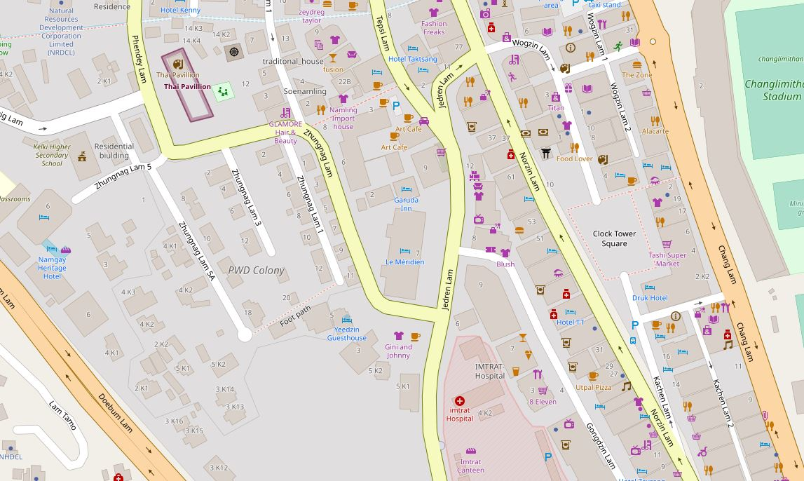{width=100%}
</center>

The content of this map can be exported as an OSM file.

<center>
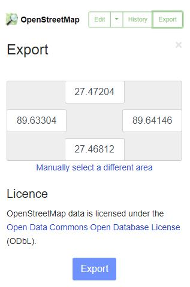{width=40%}
</center>

Multiple applications will allow users to read and process OSM files, including open source software applications like [QGIS](https://www.qgis.org/en/site/) or the R packages [sf](https://cran.r-project.org/package=sf) and [osmdata](https://cran.r-project.org/web/packages/osmdata/vignettes/osmdata.html)

```{r, eval=F, echo=T}
# Example of a R script that reads and shows the content of the map.osm file

library(sf)

# List the layers contained in the OSM file
lyrs <- st_layers("map.osm")

# Read the layers as sf objects
points   <- st_read("map.osm", layer = "points")
lines    <- st_read("map.osm", layer = "lines")
polygons <- st_read("map.osm", layer = "multipolygons")
```

**EXAMPLE 2**

In this second example, we use the R `sf` (Simple Features) package to read a shape (vector) file of refugee camps in Bangladesh, downloaded from the Humanitarian [Data Exchange (HDX)](https://data.humdata.org) website:

```{r, eval=F, echo=T}

# Load the sf package and utilities 

library(sf)
library(utils)

# Download and unzip the shape file (published by HDX as a compressed zip format)

setwd("E:/my_data")
url <- "https://data.humdata.org/dataset/1a67eb3b-57d8-4062-b562-049ad62a85fd/resource/ace4b0a6-ef0f-46e4-a50a-8c552cfe7bf3/download/200908_rrc_outline_camp_al1.zip"
download.file(url, destfile = "200908_RRC_Outline_Camp_AL1.zip")
unzip("E:/my_data/200908_RRC_Outline_Camp_AL1.zip")

# Read the file and display core information about its content

al1 <- st_read("./200908_RRC_Outline_Camp_AL1/200908_RRC_Outline_Camp_AL1.shp")
print(al1)
plot(al1)

# ------------------------------
# Output of the 'print' command:
# ------------------------------

# Simple feature collection with 35 features and 14 fields
# geometry type:  MULTIPOLYGON
# dimension:      XY
# bbox:           xmin: 92.12973 ymin: 20.91856 xmax: 92.26863 ymax: 21.22292
# geographic CRS: WGS 84
# First 10 features:
#       District Upazila      Settlement        Union         Name_Alias    SSID SMSD__Cnam            NPM_Name Area_Acres PeriMe_Met
# 1  Cox's Bazar   Ukhia Collective site Palong Khali Bagghona-Putibonia CXB-224    Camp 16 Camp 16 (Potibonia)  130.57004   4136.730
# 2  Cox's Bazar   Ukhia Collective site Palong Khali               <NA> CXB-203   Camp 02E            Camp 02E   96.58179   4803.162
# 3  ...
# 
#        Camp_Name         Area_SqM         Latitude        Longitude                       geometry
# 1        Camp 16  528946.95881724 21.1563813298438 92.1490685817901 MULTIPOLYGON (((92.15056 21...
# 2        Camp 2E 391267.799744003 21.2078084302778 92.1643360947381 MULTIPOLYGON (((92.16715 21...
# 3        ...

# Output of 'str' command:

# Classes 'sf' and 'data.frame':	35 obs. of  15 variables:
#  $ District  : chr  "Cox's Bazar" "Cox's Bazar" "Cox's Bazar" "Cox's Bazar" ...
#  $ Upazila   : chr  "Ukhia" "Ukhia" "Ukhia" "Ukhia" ...
#  $ Settlement: chr  "Collective site" "Collective site" "Collective site" "Collective site" ...
#  $ Union     : chr  "Palong Khali" "Palong Khali" "Palong Khali" "Raja Palong" ...
#  $ Name_Alias: chr  "Bagghona-Putibonia" NA "Jamtoli-Baggona" "Kutupalong RC" ...
#  $ SSID      : chr  "CXB-224" "CXB-203" "CXB-223" "CXB-221" ...
#  $ SMSD__Cnam: chr  "Camp 16" "Camp 02E" "Camp 15" "Camp KRC" ...
#  $ NPM_Name  : chr  "Camp 16 (Potibonia)" "Camp 02E" "Camp 15 (Jamtoli)" "Kutupalong RC" ...
#  $ Area_Acres: num  130.6 96.6 243.3 95.7 160.4 ...
#  $ PeriMe_Met: num  4137 4803 4722 3095 4116 ...
#  $ Camp_Name : chr  "Camp 16" "Camp 2E" "Camp 15" "Kutupalong RC" ...
#  $ Area_SqM  : chr  "528946.95881724" "391267.799744003" "985424.393160958" "387729.666427279" ...
#  $ Latitude  : chr  "21.1563813298438" "21.2078084302778" "21.1606399787906" "21.2120281895357" ...
#  $ Longitude : chr  "92.1490685817901" "92.1643360947381" "92.1428956454661" "92.1638095873048" ...
#  $ geometry  :sfc_MULTIPOLYGON of length 35; first list element: List of 1

# This information can be extracted and used to document the data

```

The output of the script shows that the shape file contains 35 features (or "objects"; in this case each object represents a refugee camp) and 14 fields (attributes and variables; including information like the camp name, administrative region, surface area, and more) related to each object. 

The *geometry type* (multipolygon) and *dimension* (XY) provide information on the type of object. "All geometries are composed of points. Points are coordinates in a 2-, 3- or 4-dimensional space. All points in a geometry have the same dimensionality. In addition to X and Y coordinates, there are two optional additional dimensions:

   - a Z coordinate, denoting the altitude;
   - an M coordinate (rarely used), denoting some measure that is associated with the point, rather than with the feature as a whole (in which case it would be a feature attribute); examples could be time of measurement, or measurement error of the coordinates.

The four possible cases then are:

   - two-dimensional points refer to x and y, easting and northing, or longitude and latitude, referred to as XY
   - three-dimensional points as XYZ
   - three-dimensional points as XYM
   - four-dimensional points as XYZM (the third axis is Z, the fourth is M)

The following seven simple feature types are the most common:

| Type               | Description                                                  |
| ------------------ | ------------------------------------------------------------ |
| POINT	             | zero-dimensional geometry containing a single point          |
| LINESTRING         | sequence of points connected by straight, non-self intersecting line pieces; one-dimensional geometry |
| POLYGON            | geometry with a positive area (two-dimensional); sequence of points form a closed, non-self intersecting ring; the first ring denotes the exterior ring, zero or more subsequent rings denote holes in this exterior ring |
| MULTIPOINT         | set of points; a MULTIPOINT is simple if no two Points in the MULTIPOINT are equal |
| MULTILINESTRING    | set of linestrings |
| MULTIPOLYGON       | set of polygons |
| GEOMETRYCOLLECTION | set of geometries of any type except GEOMETRYCOLLECTION |

The remaining ten geometries are rarer : CIRCULARSTRING, COMPOUNDCURVE, CURVEPOLYGON, MULTICURVE, MULTISURFACE, CURVE, SURFACE, POLYHEDRALSURFACE, TIN, TRIANGLE (see https://r-spatial.github.io/sf/articles/sf1.html).

The *geographic CRS* informs us on the coordinate reference system (CRS). Coordinates can only be placed on the Earth's surface when their CRS is known; this may be a spheroid CRS such as WGS 84, a projected, two-dimensional (Cartesian) CRS such as a UTM zone or Web Mercator, or a CRS in three-dimensions, or including time. In our example above, the CRS is the WGS 84 (World Geodetic System 84), a standard for use in cartography, geodesy, and satellite navigation including GPS.

The *bbox* is the bounding box. 

Information on a subset (top 10 - only 2 shown above) of the features is displayed in the output of the script, with the list of the 14 available fields.  
The `plot(al1)` command in R produces a visualization of the numeric fields in the data file:

<center>
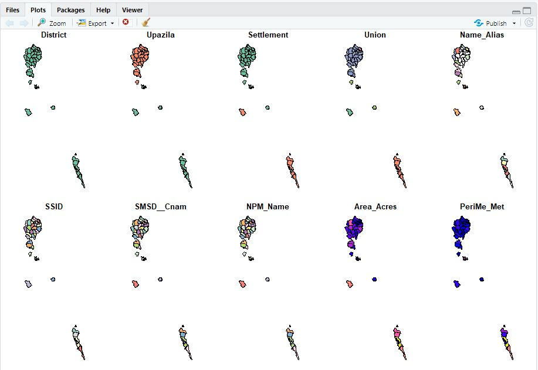{width=100%}
</center>

All this information represents important components of the metadata, which we will want to capture, enrich, and catalog (together with additional information) using the ISO metadata standard. "Enriching" (or "augmenting") the metadata will consist of providing more contextual information (who produced the data, when, why, etc.) and additional information on the features (e.g., what does the variable 'SMSD__Cnam' represent?). 

**Raster data**

**Raster data** are made up of pixels, also referred to as *grid cells*. Satellite imagery and other remote sensing data are raster datasets. Grid cells in raster data are usually (but not necessarily) regularly-spaced and square. Data stored in a raster format is arranged in a grid without storing the coordinates of each cell (pixel). The coordinates of the corner points and the spacing of the grid can be used to calculate (rather than to store) the coordinates of each location in a grid.

Any given pixel in a grid stores one or more values (in one or more bands). For example, each cell (pixel) value in a satellite image has a red, a green, and a blue value. Cells in raster data could represent anything from elevation, temperature, rainfall, land cover, population density, or others. (Source: https://worldbank.github.io/OpenNightLights/tutorials/mod2_1_data_overview.html) 

Raster data can be **discrete** or **continuous**. Discrete rasters have distinct themes or categories. For example, one grid cell can represent a land cover class, or a soil type. In a discrete raster, each thematic class can be discretely defined (usually represented by an integer) and distinguished from other classes. In other words, each cell is definable and its value applies to the entire area of the cell. For example, the value 1 for a class might indicate "urban area", value 2 "forest", and value 3 "others". Continuous (or non-discrete) rasters are grid cells with gradual changing values, which could for example represent elevation, temperature, or an aerial photograph.

The difference between vector and raster data, and between different types of vectors, is clearly illustrated in the figure below taken from the World Bank's [Light Every Night GitHub repository](https://worldbank.github.io/OpenNightLights/tutorials/mod2_1_data_overview.html).

<center>
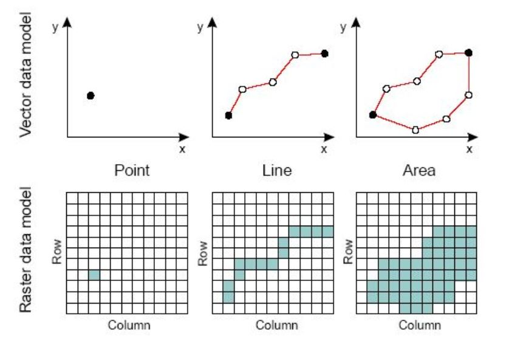{width=100%}
</center>

In GIS applications, vector and raster data are often combined into multi-layer datasets, as shown in the figure below extracted from the [County of San Bernardino (US) website](http://sbcounty.gov/). 

<center>
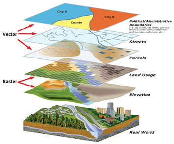{width=75%}
</center>

We may occasionally want to convert raster data into vector data. For example, a building footprint layer (vector data, composed of polygons) can be derived from a satellite image (raster data). Such conversions can be implemented in a largely automated manner using machine learning algorithms. 

<center>
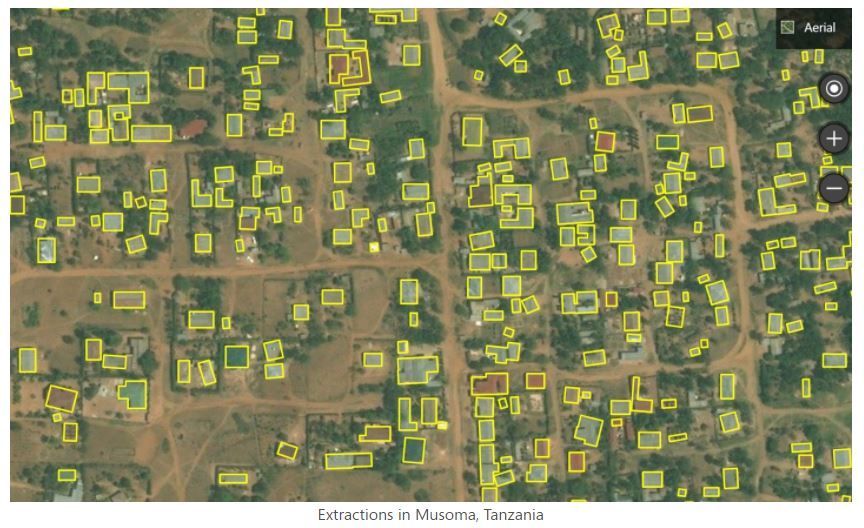{width=100%}
</center>
Source: https://blogs.bing.com/maps/2019-09/microsoft-releases-18M-building-footprints-in-uganda-and-tanzania-to-enable-ai-assisted-mapping

Raster data are often provided in one of the following file formats:

   - GeoTiFF (standard): Most of the remote sensing data are stored as GeoTIFF files. https://www.ogc.org/standards/geotiff
   - NetCDF (standard) https://www.unidata.ucar.edu/software/netcdf/docs/netcdf_introduction.html
   - ECW: https://en.wikipedia.org/wiki/ECW_(file_format)
   - JPEG 2000: https://fr.wikipedia.org/wiki/JPEG_2000
   - MrSid: https://en.wikipedia.org/wiki/MrSID
   - ArcGrid (ESRI Grid format)

**GeoTIFF** is a popular file format for raster data. A *Tagged Image File Format* (TIFF or TIF) is a file format designed to store raster-type data. A GeoTIFF file is a TIFF file that contains specific tags to store structured geospatial metadata including:

   - Spatial extent: the area coverage of the file
   - Coordinate reference system: the projection / coordinate reference system used
   - Resolution: the spatial extent of each pixel (spatial resolution)
   - Number of layers: number of layers or bands available in the file

TIFF files can be read using (among other options) the R package [*raster*](https://cran.r-project.org/package=raster) or the Python library [*rasterio*](https://pypi.org/project/rasterio/). 

GeoTIFF files can also be provided as **Cloud Optimized GeoTIFFS (COGs)**. In COGs, the data are structured in a way that allows them to be shared via web services which allow users to query, visualize, or download a user-defined subset of the content of the file, without having to download the entire file. This option can be a major advantage, as geoTIFF files generated by remote sensing/satellite imagery can be very large. Extracting only the relevant part of a file can save significant time and storage space.

-------------
Some examples
--------------

**EXAMPLE 1**

The first example below shows the spatial distribution of the Ethiopian population in 2020. The data file was downloaded from the [WorldPop](https://www.worldpop.org/) website on 17 May 2021.

<center>
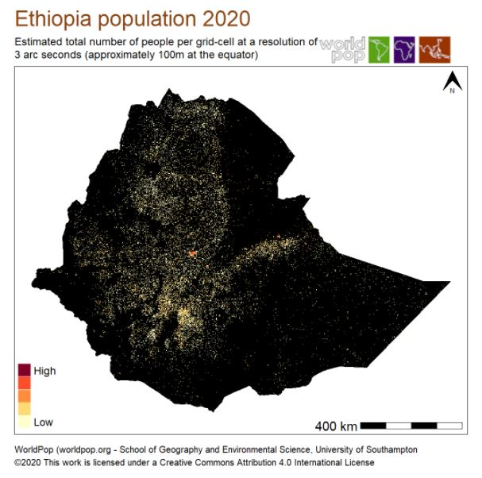{width=100%}
</center>

```{r, eval=F, echo=T}
# Load the raster R package 

library(raster)

# Download a TIF file (spatial distribution of population, Ethiopia, 2020) - 62Mb

setwd("E:/my_data")
url <- "https://data.worldpop.org/GIS/Population/Global_2000_2020_Constrained/2020/maxar_v1/ETH/eth_ppp_2020_constrained.tif"
file_name = basename(url)
download.file(url, destfile = file_name, mode = 'wb')

# Read the file and display core information about its content

my_raster_file <- raster(file_name)
print(my_raster_file)

# ------------------------------
# Output of the 'print' command:
# ------------------------------

# dimensions : 13893, 17983, 249837819  (nrow, ncol, ncell)
# resolution : 0.0008333333, 0.0008333333  (x, y)
# extent     : 32.99958, 47.98542, 3.322084, 14.89958  (xmin, xmax, ymin, ymax)
# crs        : +proj=longlat +datum=WGS84 +no_defs 
# source     : E:/my_data/eth_ppp_2020_constrained.tif 
# names      : eth_ppp_2020_constrained 
# values     : 1.36248, 847.9389  (min, max)
```

This output shows that the TIF file contains one layer of cells, forming an image of 13,893 by 17,983 cells. It also provides information on the projection system (datum): WGS 84 (World Geodetic System 84). This information (and more) will be part of the ISO-compliant metadata we want to generate to document and catalog a raster dataset.   

**EXAMPLE 2**

In the second example, we demonstrate the advantages of Cloud Optimized GeoTIFFS (COGs). We extract information from the World Bank [Light Every Night](https://worldbank.github.io/OpenNightLights/wb-light-every-night-readme.html#) repository.

```{r, eval=F, echo=T}
# Load 'aws.s3' package to access the Amazon Web Services (AWS) Simple Storage Service (s3)
library("aws.s3")

# Load 'raster' package to read the target GeoTiFF
library("raster")

# List files for World Bank bucket 'globalnightlight', setting a max number of items
contents <- get_bucket(bucket = 'globalnightlight', max = 10000)

# Get_bucket_df is similar to 'get_bucket' but returns the list as a dataframe
contents <- get_bucket_df(bucket = 'globalnightlight')

# Access DMSP-OLS data for satellite F12 in 1995
F12_1995 <- get_bucket(bucket = 'globalnightlight', 
                       prefix = "F121995")

# As data.frame, with all objects listed
F12_1995_df <- get_bucket_df(bucket = 'globalnightlight', 
                             prefix = "F121995", 
                             max = Inf)
# Number of objects
nrow(F12_1995_df) 

# Save the object
filename <- "F12199501140101.night.OIS.tir.co.tif"
save_object(bucket = 'globalnightlight', 
            object = "F121995/F12199501140101.night.OIS.tir.co.tif", 
            file = filename)

# Read it with raster package
rs <- raster(filename)
```


### Describing data structures - The ISO 19115-2 and ISO 19110 standards

The ISO 19115-2 provides the necessary metadata elements to describe the structure of raster data. The ISO 19115-1 standard does not provide all necessary metadata elements needed to describe the structure of vector datasets. The description of data structures for vector data (also referred to as *feature types*) is therefore often omitted. The ISO 19110 standard solves that issue, by providing the means to document the structure of vector datasets (column names and definitions, codes and value labels, measurement units, etc.), which will contribute to making the data more discoverable and usable.


### Describing data services - The ISO 19119 standard

More and more data are disseminated not in the form of datasets, but as data services via web applications. "Geospatial services provide the technology to create, analyze, maintain, and distribute geospatial data and information." (https://www.fws.gov/gis/) The ISO 19119 standard provides the elements to document such services.


### Unified metadata specification - The ISO/TS 19139 standard

The three metadata standards previously described - ISO 19115 for vector and raster datasets, ISO 19110 for vector data structures, and ISO 19119 for data services, provide a set of concepts and definitions useful to describe the geographic information. To facilitate their practical implementation, a digital specification, which defines how this information is stored and organized in an electronic metadata file, is required. The ISO/TS 19139 standard, an XML specification of the ISO 19115/10110/19119/, was created for that purpose.

The ISO/TS 19139 is a standard used worldwide to describe geographic information. It is the backbone for the implementation of [INSPIRE](https://inspire.ec.europa.eu/) dataset and service metadata in the European Union. It is supported by a wide range of tools, including desktop applications like [Quantum GIS](https://qgis.org/en/site/), [ESRI ArcGIS](https://www.arcgis.com/index.html)), and OGC-compliant metadata catalogs (e.g., [GeoNetwork](https://geonetwork-opensource.org/)) and geographic servers (e.g., [GeoServer](http://geoserver.org/)). 

ISO 19139-compliant metadata can be generated and edited using specialized metadata editors such as [CatMDEdit](http://catmdedit.sourceforge.net/) or [QSphere](https://www.fgdc.gov/organization/working-groups-subcommittees/mwg/iso-metadata-editors-registry/qsphere), or using programmatic tools like Java Apache SIS or the R packages [geometa](https://cran.r-project.org/web/packages/geometa/index.html) and [geoflow](https://github.com/eblondel/geoflow), among others.

The ISO 19139 specification is complex. To enable and simplify its use in our NADA cataloguing application, we produced a JSON version of (part of) the standard. We selected the elements we considered most relevant for our purpose, and organized them into the JSON schema described below. For data curators with limited expertise in XML and geographic data documentation, this JSON schema will make the production of metadata compliant with the ISO 19139 standard easier. 


## Schema description

### Introduction

Geographic metadata (for both *datasets* and *services*) should include **core metadata properties**, and metadata **sections** aiming to describe specific aspect of the resource (e.g., resource identification or resource distribution).

The content of some metadata elements is controlled by **codelists** (or **controlled vocabularies**). A codelist is a pre-defined set of values. The content of an element controlled by a codelist should be selected from that list. This may for example apply to the element "language", whose content should be selected from the ISO 639 list and codes codes for language names, instead of being free-text. The ISO 19139 suggests but does not impose codelists. It is highly recommended to make use of the suggested codelists (or of specific codelists that may be promoted by agencies or partnerships).

Some metadata elements (referred to as *common elements*) of the ISO 19139 can be repeated in different parts of a metadata file. For example, a standard set of fields is provided to describe a `contact`, a `citation`, or a `file format`. Such common elements can be used in multiple locations of a metadata file (e.g., to provide information on who the contact person is for information on data quality, on data access, on data documentation, etc.) 

In the following sections, we first present the **common elements**, then the elements that form the **core metadata properties** (information on the metadata themselves), followed by the elements from the main **metadata sections** used to describe the data, and finally the **features catalog** elements which are used to document attributes and variables related to vector data (ISO 19110).

### Common sets of elements

Common elements are blocks of metadata fields that can appear in multiple locations of a metadata file. For example, information on `contact` person(s) or organization(s) may have to be provided in the section of the file where we document the production and maintenance of the data, where we document the production and maintenance of the metadata, where we document the distribution and terms of use of the data, etc. Other types of common elements include online and offline resources, file formats, citations, keywords, constraints, and extent. We describe these sets of elements below.  

#### Contact / Responsible party

The ISO 19139 specification provides a structured set of metadata elements to describe a **contact**. A contact is the party (person or organization) responsible for a specific task. The following set of elements can be used to describe a contact:

| Element            | Description                                                  |
| ------------------ | ------------------------------------------------------------ |
| `individualName`   | Name of the individual                                       |
| `organisationName` | Name of the organization                                     |
| `positionName`     | Position of the individual in the organization               |
| `contactInfo`      | Contact information. The contact information is divided into 3 sections: `phone`(including either `voice` or `facsimile` numbers; `address`, handling the physical address elements (`deliveryPoint`, `city`, `postalCode`, `country`), contact e-mail (`electronicEmailAddress`), and `onlineResource` (e.g., the URL of the organization website) |
| `role`             | Role of the person/organization. A recommended controlled vocabulary is provided by ISO 19139, with the following options: `{resourceProvider, custodian, owner, sponsor, user, distributor, originator, pointOfContact, principalInvestigator, processor, publisher, author, coAuthor, collaborator, editor, mediator, rightsHolder, contributor, funder, stakeholder}` |

<center>
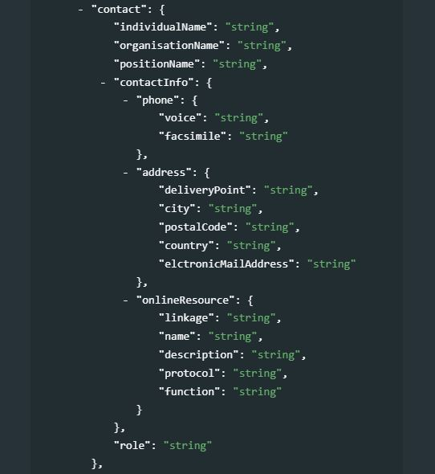{width=100%}
</center>


#### Online resource 

An **online resource** is a common set of elements frequently used in the geographic data/services schema. It can be used for example to provide a link to an organization website, to a data file or to a document, etc. An online resource is described with the following properties:

| Element       | Description                                                  |
| ------------- | ------------------------------------------------------------ |
| `linkage`     | URL of the online resource. In case of a geographic standard data services, only the <u>base URL</u> should be provided, without any service parameter. |
| `name`        | Name of the online resource. In case of a geographic standard data services, this should be filled with the identifier of the resource as published in the service. Example, for an OGC Web Map Service (WMS), we will use the layer name. |
| `description` | Description of the online resource                           |
| `protocol`    | Web protocol used to get the resource, e.g., FTP, HTTP. In case of a basic HTTP, the ISO 19139 suggests the value 'WWW:LINK-1.0-http--link'. For geographic standard data services, it is recommended to fill this element with the appropriate protocol identifier. For an OGC Web Map Service (WMS) link for example, use 'OGC:WMS-1.1.0-http-get-map' |
| `function`    | Function (purpose) of the online resource.                 |


#### Offline resource (Medium)

An **offline resource** (medium) is a common set of elements that can be used to describe a physical resource used to distribute a dataset, e.g., a DVD or a CD-ROM. A `medium` is described with the following properties:

| Element       | Description                                                  |
| ------------- | ------------------------------------------------------------ |
| `name`	| Name of the medium, eg. 'dvd'. Recommended code following the [ISO/TS 19139](http://standards.iso.org/iso/19139/resources/gmxCodelists.xmlMD_MediumNameCode) MediumName codelist. Suggested values: {cdRom, dvd, dvdRom, 3halfInchFloppy, 5quarterInchFloppy, 7trackTape, 9trackType, 3480Cartridge, 3490Cartridge, 3580Cartridge, 4mmCartridgeTape, 8mmCartridgeTape, 1quarterInchCartridgeTape, digitalLinearTape, onLine, satellite, telephoneLink, hardcopy} |
| `density`	| Density (list of) at which the data is recorded |
| `densityUnit`| Unit(s) of measure for the recording density |
| `volumes`	| Number of items in the media identified |
| `mediumFormat`	 | Method used to write to the medium, e.g. tar . Recommended code following the [ISO/TS 19139](http://standards.iso.org/iso/19139/resources/gmxCodelists.xmlMD_MediumFormatCode) MediumFormat codelist. Suggested values:  {cpio, tar, highSierra, iso9660, iso9660RockRidge, iso9660AppleHFS, udf} |
| `mediumNote`	| Description of other limitations or requirements for using the medium |


#### File format

The table below lists the ISO 19139 elements used to document a **file format**. A format is defined at a minimum by its `name`. It is also recommended to provide a `version`, and possibly a format `specification`. It is good practice to provide a standardized format name, using the file's *mime type*, e.g., `text/csv`, `image/tiff`. A list of available mime types is available from the [IANA](https://www.iana.org/assignments/media-types/media-types.xhtml) website.

| Element                      | Description                                       |
| ---------------------------- | ------------------------------------------------- |
| `name`                       | Format name - *Recommended*                       |
| `version`                    | Format version (if applicable) - *Recommended*    |
| `amendmentNumber`            | Amendment number (if applicable)                  |
| `specification`              | Name of the specification - *Recommended*         |
| `fileDecompressionTechnique` | Technique for file decompression (if applicable)  |
| `FormatDistributor`          | <u>Contact</u>(s) responsible of the distribution |


#### Citation

The **citation** is another common element that can be used in various parts of a geographic metadata file. Citations are used to provide detailed information on external resources related to the dataset or service being documented. A citation can be defined using the following set of (mostly optional) elements:

| Element                 | Description                                                  |
| ----------------------- | ------------------------------------------------------------ |
| `title`                 | Title of the resource                                        |
| `alternateTitle`        | An alternate title (if applicable)                           |
| `date`                  | Date(s) associated to a resource. This may include different types of dates. The type of date should be provided, and selected from the controlled vocabulary proposed by the ISO 19139: date of  `{creation, publication, revision, expiry, lastUpdate, lastRevision, nextUpdate, unavailable, inForce, adopted, deprecated, superseded, validityBegins, validityExpires, released, distribution}` |
| `edition`               | Edition of the resource                                      |
| `editionDate`           | Edition date                                                 |
| `identifier`            | A unique persistent identifier for the metadata. If a DOI is available for the resource, the DOI should be entered here. The same `fileIdentifier` should be used if no other persistent identifier is available.  |
| `citedResponsibleParty` | Contact(s)/party(ies) responsible for the resource.          |
| `presentationForm`      | Form in which the resource is made available. The ISO 19139 recommends the following controlled vocabulary: `{documentDigital, imageDigital, documentHardcopy, imageHardcopy, mapDigital, mapHardcopy, modelDigital, modelHardcopy, profileDigital, profileHardcopy, tableDigital, tableHardcopy, videoDigital, videoHardcopy, audioDigital, audioHardcopy, multimediaDigital, multimediaHardcopy, physicalSample, diagramDigital, diagramHardcopy}`. For a geospatial dataset or web-layer, the value `mapDigital` will be preferred. |
| `series`                | A description of the series, in case the resource is part of a series. This include the series `name`, `issueIdentification` and `page` |
| `otherCitationDetails`  | Any other citation details to specify                        |
| `collectiveTitle`       | A title in case the resource is part of a broader resource (e.g., data collection) |
| `ISBN`                  | International Standard Book Number (ISBN); an international standard identification number for uniquely identifying publications that are not intended to continue indefinitely.                                                         |
| `ISSN`                  | International Standard Serial Number (ISSN); an international standard for serial publications.                                                         |

<center>
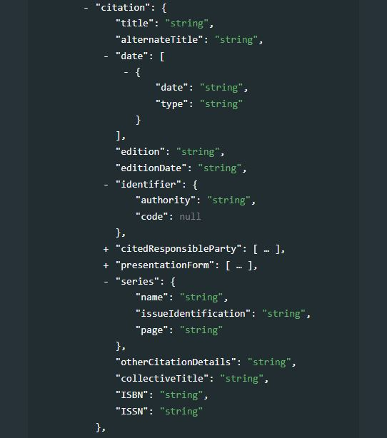{width=100%}
</center>

<center>
{width=100%}
</center>


#### Keywords

**Keywords** contribute significantly to making a resource more discoverable. Entering a list of relevant keywords is therefore highly recommended. Keywords can, but do not have to be selected from a controlled vocabulary (thesaurus). Keywords are documented using the following elements:

| Element         | Description                                                  |
| --------------- | ------------------------------------------------------------ |
| `type`          | Keywords type. The ISO 19139 provides a recommended controlled vocabulary with the following options: {`dataCenter`, `discipline`, `place`, `dataResolution`, `stratum`, `temporal`, `theme`, `dataCentre`, `featureType`, `instrument`, `platform`, `process`, `project`, `service`, `product`, `subTopicCategory`} |
| `keyword`       | The keyword itself. When possible, existing vocabularies should be preferred to writing free-text keywords. An example of global vocabulary is the [*Global Change Master Directory*](http://vocab.nerc.ac.uk/collection/P04/current/) that could be a valuable source to reference data domains / disciplines, or the [UNESCO Thesaurus](http://vocabularies.unesco.org/browser/thesaurus/en/).
| `thesaurusName` | A reference to a thesaurus (if applicable) from which the keywords are extracted. The thesaurus itself should then be documented as a <u>citation</u>. |


#### Constraints   @@@@ not clear. where is the element useLimitations? ... what are the elements used in the schema?

The **constraints** common set of elements will be used to document *legal* and *security* constraints associated with the documented dataset or data service. Both types of constraints have one property in common, `useLimitation`, used to describe the use limitation(s) as free text. 

In addition to the `useLimitation` element, **legal constraints** (`legalConstraints`) can be described using the following three metadata elements:

| Element             | Description                                                  |
| ------------------- | ------------------------------------------------------------ |
| `accessConstraints` | Access constraints. The ISO 19139 provides a controlled vocabulary with the following options: `{copyright, patent, patentPending, trademark, license, intellectualPropertyRights, restricted, otherRestrictions, unrestricted, licenceUnrestricted, licenceEndUser, licenceDistributor, private, statutory, confidential, SBU, in-confidence}` |
| `useConstraints`    | Use constraints. To be entered as free text. Filling this element will depend on the resource that is described. As best practice recommended to fill this element, this is where *terms of use*, *disclaimers*, *preferred citation* or* even *data limitations* can be captured |
| `otherConstraints`  | Any other constraints related to the resource.    |

<center>
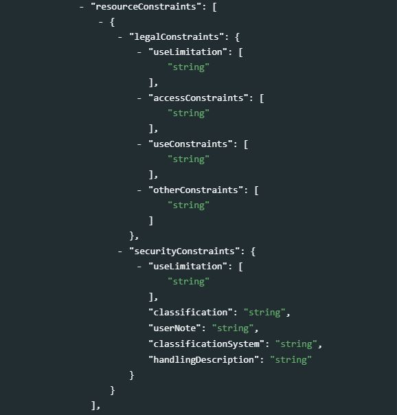{width=100%}
</center>

In addition to the `useLimitation` element, **security constraints** (`securityConstraints`) - which applies essentially to *classified* resources - can be described using the following four metadata elements:

| Element                | Description                                                  |
| ---------------------- | ------------------------------------------------------------ |
| `classification`       | Classification code. The ISO 19139 provides a controlled vocabulary with the following options: `{unclassified, restricted, confidential, secret, topSecret, SBU, forOfficialUseOnly, protected, limitedDistribution}` |
| `userNote`             | Note to users (free text)                                               |
| `classificationSystem` | Information on the system used to classify the information. Organizations may have their own system to `classify` the information. |
| `handlingDescription`  | Additional free-text description of the classification                 |


#### Extent

The **extent** defines the boundaries of the dataset in space (horizontally and vertically) and in time. The ISO 19139 standard defines the extent as follows:

 Element       | Description                                                  |
| ------------- | ------------------------------------------------------------ |
| `geographicElement`     | Spatial (horizontal) extent element. This can be defined either with a `geographicBoundingBox` providing the coordinates bounding the limits of the dataset, by means of four properties: `southBoundLongitude`, `westBoundLongitude`, `northBoundLongitude`, `eastBoundLongitude` (recommended); or using `geographicDescription` - free text that defines the area covered.|
| `verticalElement`        | Spatial (vertical) extent element, providing two properties: `minimumValue`, `maximumValue` and `verticalCRS` (reference to the vertical coordinate reference system)  |
| `temporalElement`   | Temporal extent element. Depending on the temporal characteristics of the dataset, this will consist in a `TimePeriod` (made of a `beginPosition` and `endPosition`) or a `TimeInstant` (made of a single `timePosition`) referencing date/time information according to [ISO 8601](https://www.iso.org/iso-8601-date-and-time-format.html)                |

<center>
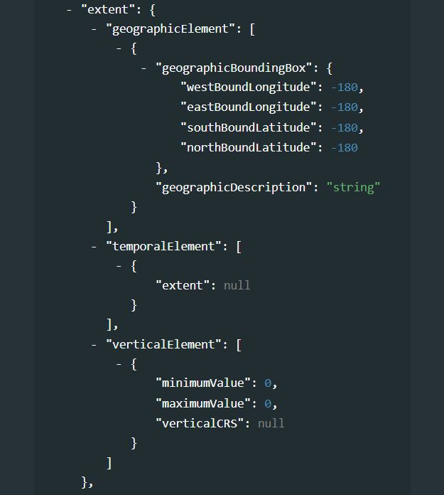{width=100%}
</center>

### Core metadata properties

A set of elements is provided in the ISO 19139 to document the core properties of the <u>metadata</u> (not the data). With a few exceptions, these elements apply to the metadata related to datasets and data services. The table below summarizes these elements and their applicability. A description of the elements follows.

| Property                  | Description                                                  | Used in *dataset metadata*      | Used in *service metadata*      |
| ------------------------- | ------------------------------------------------------------ | ------------------------------- | ------------------------------- |
| `fileIdentifier`          | Unique persistent identifier for the resource                | Yes                             | -                               |
| `language`                | Main language used in the metadata description               | Yes                             | Yes                             |
| `characterSet`            | Character set encoding used in the metadata description      | Yes                             | Yes                             |
| `parentIdentifier`        | Unique persistent identifier of the parent resource (if any) | Yes                             | Yes                             |
| `hierarchyLevel`          | Scope(s) / hierarchy level(s) of the resource. List of pre-defined values suggested by the ISO 19139. See details below. | Yes                             | Yes                             |
| `hierarchyLevelName`      | Alternative name definitions for hierarchy levels            | Yes                             | Yes                             |
| `contact`                 | <u>contact</u>(s) associated to the metadata, i.e. persons/organizations in charge of the metadata create/edition/maintenance. For more details, see section on ***common elements*** | Yes                             | Yes                             |
| `dateStamp`               | Date and time when the metadata record was created or updated | Yes                            | Yes                             |
| `metadataStandardName`    | Reference or name of the metadata standard used.             | Yes                             | Yes                             |
| `metadataStandardVersion` | Version of the metadata standard. For the ISO/TC211, the version corresponds to the creation/revision year. | Yes                             | Yes                             |
| `dataSetURI`              | Unique persistent link to reference the database             | Yes                             | -                               |
| `locale`                  | Local language definition(s). To use for multilingual descriptions. **Currently not supported by our JSON schema** | Yes                             | Yes                             |

<center>
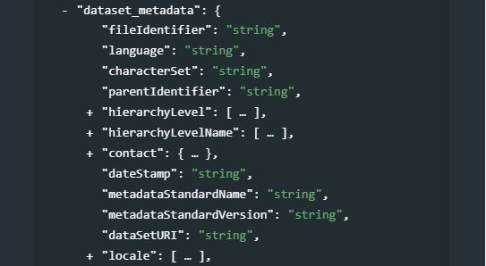{width=100%}
</center>

#### File identifier (`fileIdentifier`)

The `fileIdentifier` only applies to **dataset** resources (not to services). The `fileIdentifier` must provide a unique and persistent identifier for the dataset. A common approach consists in building a _semantic identifier_, constructed by concatenating some owner and data characteristics. Although this approach offers the advantages of readability of the identifier, it may not guarantee its global uniqueness and its persistence in time. The use of time periods and/or geographic extents as components of a file identifier is not recommended, as these elements may evolve over time. The use of random identifiers such as the Universally Unique Identifiers (UUID) is sometimes suggested as an alternative, but this approach is also not recommended. The use of [Digital Object Identifiers](https://www.doi.org/) (DOI) as global and unique file identifiers is recommended. 

#### Language (`language`)

The metadata language refers to the main language used in the metadata. The recommended practice is to use the [ISO 639-2 Language Code List](http://www.loc.gov/standards/iso639-2/) (also known as the alpha-3 language code), e.g. 'eng' for English or 'fra' for French.

#### Character set (`characterSet`)

The character set encoding of the metadata description. The best practice is to use the `utf8` encoding codelist value (UTF-8 encoding). It is capable of encoding all valid character code points in Unicode, a standard for the consistent encoding, representation, and handling of text expressed in most of the world's writing systems. The World Wide Web Consortium recommends UTF-8 as the default encoding in XML and HTML. UTF-8 is the most common encoding for the World Wide Web. Many text editors will provide you with an option to save your metadata (text) files in UTF-8, which will often be the default option (see below the example of Notepad++ and R Studio).

<center>
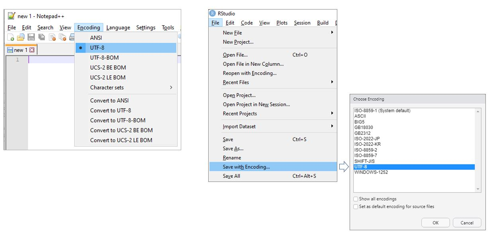{width=100%}
</center>

#### Parent Identifier (`parentIdentifier`)

A geographic data resource can be a subset of a larger dataset. For example, an aquatic species distribution map can be part of a data collection covering all species, or the 2010 population census dataset of a country can be part of a dataset that includes all population censuses for that country since 1900. In such case, the _parent identifier_ metadata element can be used to identify this higher-level resource. As for the `fileIdentifier`, the `parentIdentifier` must be a unique identifier persistent in time. In a data catalog, a `parentIdentifier` will allow the user to move from one dataset to another. The `parentIdentifier` is generally applied to *datasets*, although it may in some cases be used in *data services* descriptions.

#### Hierarchy level(s) (`hierarchyLevel`)

<center>
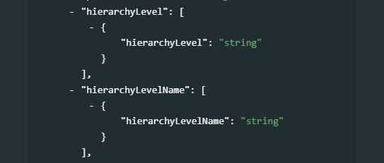{width=100%}
</center>

The `hierarchylevel` defines the scope of the resource. It indicates whether the resource is a collection, a dataset, a series, a service, or another type of resource. The ISO 19139 provides a controlled vocabulary for this element. It is recommended but not mandatory to make use of it. The most relevant levels for the purpose of cataloguing geographic data and services are **dataset** (for both raster and vector data), **service** (a capability which a service provider entity makes available to a service user entity through a set of interfaces that define a behavior), and **series**. `Series` will be used when the data represent an ordered succession, in time or in space; this will typically apply to time series, but it can also be used to describe other types of series (e.g., a series of ocean water temperatures collected at a succession of depths).

The recommended controlled vocabulary for `hierarchylevel` includes: `{dataset, series, service, attribute, attributeType, collectionHardware, collectionSession, nonGeographicDataset, dimensionGroup, feature, featureType, propertyType, fieldSession, software, model, tile, initiative, stereomate, sensor, platformSeries, sensorSeries, productionSeries, transferAggregate, otherAggregate}`

#### Hierarchy level name(s) (`hierarchyLevelname`)

The `hierarchyLevelName` provides an alternative to describe hierarchy levels, using free text instead of a controlled vocabulary. The use of `hierarchyLevel` is preferred to the use of `hierarchylevelName`.

#### Contact(s) (`contact`)

The `contact` element is a common element described in the ***common elements*** section of this chapter. When associated to the **metadata**, it is used to identify the person(s) or organization(s) in charge of the creation, edition, and maintenance of the <u>metadata</u>. The contact(s) responsible for the metadata are not necessarily the ones who are responsible for the dataset/service creation/edition/maintenance. The latter will be documented in the dataset identification elements of the metadata file.

#### Date stamp (`dateStamp`)

The date stamp associated to the metadata. The metadata date stamp may be automatically filled by metadata editors, and will ideally use the standard ISO 8601 date format: YYYY-MM-DD (possibly with a time).

<center>
{width=100%}
</center>

#### Metadata standard name (`metadataStandardName`)

The name of the geographic metadata standard used to describe the resource. The recommended values are:

* in the case of vector dataset metadata: *ISO 19115 Geographic information - Metadata*
* in the case of grid/imagery dataset metadata: *ISO 19115-2 Geographic Information - Metadata Part 2 Extensions for imagery and gridded data*
* in the case of service metadata: *ISO 19119 Geographic information - Services*

#### Metadata standard version (`metadataStandardVersion`)

The version of the metadata standard being used. It is good practice to enter the standard's inception/revision year. ISO standards are revised with an average periodicity of 10-year. Although the ISO TC211 geographic information metadata standards have been reviewed, it is still accepted to refer to the original version of the standard as many information systems/catalogs still make use of that version.

The recommended values are:

* in the case of vector dataset metadata: *ISO 19115:2003*
* in the case of grid/imagery dataset metadata: *ISO 19115-2:2009*
* in the case of service metadata: *ISO 19119:2005*

#### Dataset URI (`datasetURI`)

A unique resource identifier for the dataset, such as a web link that uniquely identifies the dataset. The use of a [Digital Object Identifier (DOI)](https://www.doi.org/) is recommended.

#### Locale(s) (`locale`)

The ISO standard allows the metadata to be provided in multiple languages in one same XML file. The (simplified) JSON schema we developed to document geographic data does not allow multilingual metadata files. We will therefore ignore this element (at least for now).

<center>
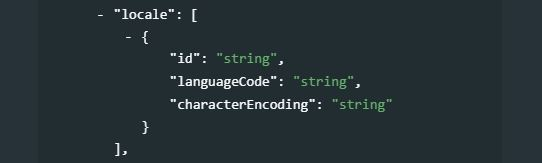{width=100%}
</center>


### Main metadata sections

Geographic data can be diverse and complex. Users need detailed information to discover data and to use them in an informed and responsible manner. The core of the information on data will be provided in various *sections* of the metadata file. This will include information on the type of data, on the coordinate system being used, on the scope and coverage of the data, on the format and location of the data, on possible quality issues that users need to be aware of, and more. The table below summarizes the main metadata *sections*, by order of appearance in the ISO 19139 specification. 

| Section                     | Description                                                  | Usability in *dataset metadata* | Usability in *service metadata* |
| --------------------------- | ------------------------------------------------------------ | ------------------------------- | ------------------------------- |
| `spatialRepresentationInfo` | The spatial representation of the dataset. Distinction is made between *vector* and *grid* (raster) spatial representations.  | Yes                             | -                               |
| `referenceSystemInfo`       | The reference systems used in the resource. In practice, this will often be limited to the geographic coordinate system. | Yes                             | Yes                             |
| `identificationInfo`        | Identifies the resource, including descriptive elements (eg. title, purpose, abstract, keywords) and contact(s) having a role in the resource provision. See details below | Yes                             | Yes                             |
| `contentInfo`               | The content of a dataset resource, i.e. how the dataset is structured (dimensions, attributes, variables, etc.). In the case of *vector* datasets, this relates to separate metadata files compliant with the ISO 19110 standard (Feature Catalogue). In the case of *raster* / *gridded* data, this is covered by the ISO 19115-2 extension for imagery and gridded data. | Yes                             | -                               |
| `distributionInfo`          | The mode(s) of distribution of the resource (format, online resources), and by whom it is distributed. | Yes                             | Yes                             |
| `dataQualityInfo`           | The quality reports on the resource (dataset or service), and in case of *datasets*, on the provenance / lineage information giving the process steps performed to obtain the dataset resource. | Yes                             | Yes                             |
| `metadataMaintenanceInfo`   | The metadata maintenance cycle operated for the resource. | Yes                             | Yes                             |

These sections are described in more detail below. 

#### Spatial representation (`spatialRepresentationInfo`)

<center>
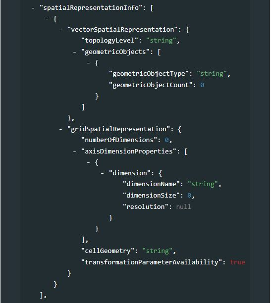{width=100%}
</center>

Information on the spatial representation is critical to properly describe a geospatial dataset. The ISO/TS 19139 distinguishes two types of spatial representations, characterized by different properties:

- The **vector spatial representation** describes the topology level and the geometric objects of **vector datasets** using the following two properties:

  - **Topology level** (`topologyLevel`) is the type of topology used in the vector spatial dataset. The ISO 19139 provides a controlled vocabulary with the following options: `{geometryOnly, topology1D, planarGraph, fullPlanarGraph, surfaceGraph, fullSurfaceGraph, topology3D, fullTopology3D, abstract}`. In most cases, vector datasets will be described as ``geometryOnly`` which covers common geometry types (points, lines, polygons).
  - **Geometric objects** (`geometricObjects`) will define:
    - Geometry type (`geometricObjectType`): The type of geometry handled. Possible values are: `{complex, composite, curve, point, solid, surface}`.
    - Geometry count (`geometricObjectCount`): The number (count) of geometries in the dataset.

  In the case of an homogeneous geometry type, a single `geometricObjects`element can be defined. For complex geometries (mixture of various geometry types), one `geometricObjects` element will be defined for each geometry type. 

- The **grid spatial representation** describes gridded (raster) data using the following three properties:

  - **Number of dimensions** (`numberOfDimensions`) in the grid.
  - **Axis dimension properties** (`axisDimensionProperties`): a list of each dimension including, for each dimension:
    - The name of the dimension type (`dimensionName`): the ISO 19139 provides a controlled vocabulary with the following options: `{row, column, vertical, track, crossTrack, line, sample, time}`. These options represent the following:
       - row:	ordinate (y) axis
       - column:	abscissa (x) axis
       - vertical: vertical (z) axis
       - track: along the direction of motion of the scan point
       - crossTrack: perpendicular to the direction of motion of the scan point
       - line: scan line of a sensor
       - sample: element along a scan line
       - time: duration
    In the Ethiopia population density file we used as an example of raster data, the types of dimensions will be row and column as the file is a spatial 2D raster. If we had a data with elevation or time dimensions, we would use respectively "vertical" and "time" dimension as name types.
    - The dimension size (`dimensionSize`): the length of the dimension.
    - The dimension resolution: a resolution number associated to a unit of measurement. This is the resolution of the grid cell dimension. For example:
    - for longitude/latitude dimensions, and a grid at 1deg x 5deg, the 'row' dimension will have a resolution of 1 deg, and the 'column' dimension will have a resolution of 5 deg 
       - for a "vertical" dimension, this will represent the elevation step. For example, the vertical resolution of the mean Ozone concentration between 40m and 50m altitude at a location of longitude x/ latitude y would be 10 m.
       - similar: in case of a spatial-temporal grid, the "time" resolution will represent the time lag (e.g., 1 year, 1 month, 1 week, etc.) between two measures.
    - **Cell geometry type** (`cellGeometry`): The type of geometry used for grid cells. Possible values are: `{point, area, voxel, stratum}` Most "grids" are commonly area-based, but in principle a grid goes beyond this and the grid cells can target a point, an area, or a volume.
       - point: each cell represents a point
       - area: each cell represents an area
       - voxel: each cell represents a volumetric measurement on a regular grid in a three dimensional space
       - stratum: height range for a single point vertical profile

#### Reference system(s) (`referenceSystemInfo`)

The reference system(s) typically (but not necessarily) applies to the **geographic reference system** of the dataset. Multiple reference systems can be listed if a dataset is distributed with different spatial reference systems. This block of elements may also apply to *service metadata*. A spatial web-service may support several map projections / geographic coordinate reference systems.

<center>
{width=100%}
</center>

A reference system is defined by two properties:

- the **identifier** of the reference system. The recommended practice is to use to the `Spatial Reference IDentifier` (SRID) number. For example, the SRID of the World Geodetic System (WGS 84) is *4326*.
- the **code space** of the source authority providing the SRID. The best practice is to use the [EPSG](https://epsg.org/home.html) authority code `EPSG` (as most of geographic reference systems are registered in it). Codes from other authorities can be used to define ad-hoc projections, for example: 
   - ESRI:54012 (Eckert IV equal area projection)
   - EPSG:4326 ([World Geodetic System 84 - aka WGS84](https://epsg.org/crs_4326/WGS-84.html)), the system used for GPS 
   - EPSG:3857 ([Web Mercator / Pseudo-Mercator](https://epsg.org/crs_3857/WGS-84-Pseudo-Mercator.html)) - widely used for map visualization from web map tile providers.

The main reference system registry is [EPSG](https://epsg.org/search/by-name), which provides a "search by name" tool for users who need to find a SRID (global or local/country-specific). Other websites reference geographic systems, but are not authoritative sources including http://epsg.io/ and https://spatialreference.org/ The advantage of these sites is that they go beyond the EPSG registry, and handle other specific registries given by providers like ESRI.

The following ESRI projections could be relevant, in particular those in support of world equal-area projected maps (maps conserving area proportions):

   - [ESRI:54012 (Eckert IV)](https://epsg.io/54012)
   - [ESRI:54009 (Mollweide)](https://epsg.io/54009)
   - [ESRI:54030 (Robinson)](https://epsg.io/54030)


#### Identification (`identificationInfo`)

The **identification information** (`identificationInfo`) is where the citation elements of the resource will be provided. This may include descriptive information like `title`, `abstract`, `purpose`, `keywords`, etc., and identification of the parties/contact(s) associated with the resource, such as the *owner*, *publisher*, *co-authors*, etc. Providing and publishing detailed information in these elements will contribute significantly to improving the discoverability of the data. 

The identification of a resource includes elements that are common to both *datasets* and *data services*, and others that are specific to the type of resource. The following table summarizes the **identification elements** that can be used for *dataset*, *service*, or both.


**Identification elements applicable to datasets and data services**

The following metadata elements apply to resources of type **dataset** and **service**.

| Element                 | Description                                                  |
| ----------------------- | ------------------------------------------------------------ |
| `citation`              | A  <u>citation</u> set of elements that will describe the dataset/service from a citation perspective, including `title`, associated contacts, etc. For more details, see section on ***common elements*** |
| `abstract`              | An abstract for the dataset/service resource                 |
| `purpose`               | A statement describing the purpose of the dataset/service resource |
| `credit`                | Credit information.                                          |
| `status`                | Status of the resource, with the following recommended controlled vocabulary: `{completed, historicalArchive, obsolete, onGoing, planned, required, underDevelopment, final, pending, retired, superseded, tentative, valid, accepted, notAccepted, withdrawn, proposed, deprecated}` |
| `pointOfContact`        | One ore more points of <u>contacts</u> to associate with the resource. People that can be contacted for information on the dataset/service. For more details, see section `contact` in the ***common elements*** section of the chapter. |
| `resourceMaintenance`   | Information on how the resource is maintained, essentially informing on the maintenance and update frequency (`maintenanceAndUpdateFrequency`). This frequency should be chosen among possible values recommended by the ISO 19139 standard: `{continual, daily, weekly, fortnightly, monthly, quarterly, biannually, annually, asNeeded, irregular, notPlanned, unknown}`. |
| `graphicOverview`       | One or more graphic overview(s) that provide a visual identification of the dataset/service. e.g., a link to a map overview image. A `graphicOverview` will be defined with 3 properties `fileName` (or URL), `fileDescription`, and optionally a `fileType`. |
| `resourceFormat`        | Resource format(s) description. For more details on how to describe a <u>format</u>, see the ***common elements*** section of the chapter. |
| `descriptiveKeywords`   | A set of keywords that describe the dataset. Keywords are grouped by keyword type, with the possibility to associate a thesaurus (if applicable). For more details how to describe <u>keywords</u>, see the ***common elements*** section of the chapter.|
| `resourceConstraints`   | Legal and/or Security *constraints* associated to the resource. For more details how to describe <u>constraints</u>, see the  ***common elements*** section of the chapter|
| `resourceSpecificUsage` | Information about specific usage(s) of the dataset/service, e.g., a research paper, a success story, etc. |
| `aggregationInfo`       | Information on an aggregate or parent resource to which the resource belongs, i.e. a collection. |

<center>
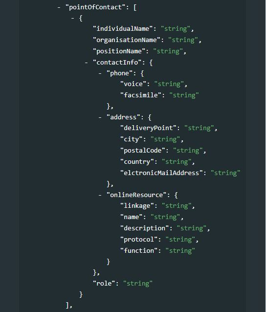{width=100%}
</center>

<center>
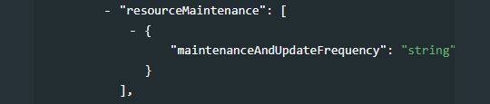{width=100%}
</center>

<center>
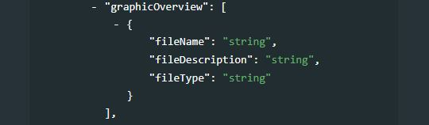{width=100%}
</center>

<center>
{width=100%}
</center>

Keywords

<center>
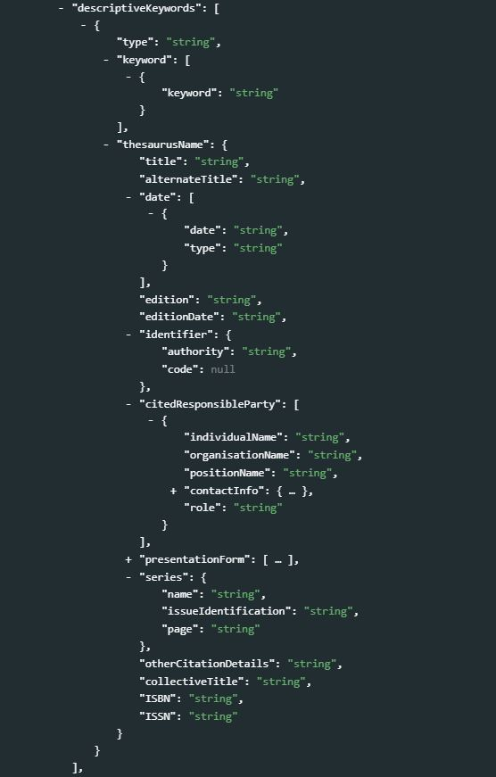{width=100%}
</center>

Resource constraints

<center>
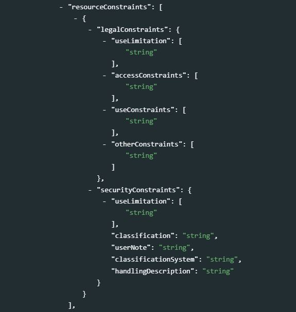{width=100%}
</center>

Resource specific usage

<center>
{width=100%}
</center>

Aggregation information

<center>
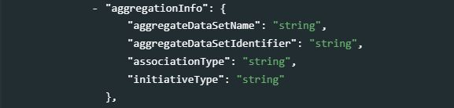{width=100%}
</center>


**Identification elements applicable to datasets**

The following metadata elements are specific to resources of type **dataset**.

| Element                     | Description                                                  |
| --------------------------- | ------------------------------------------------------------ |
| `spatialRepresentationType` | The spatial representation type of the dataset. Values should be selected from the following controlled vocabulary: `{vector, grid, textTable, tin, stereoModel, video}` |
| `spatialResolution`         | The spatial resolution of the data as numeric value associated to a unit of measure. |
| `language`                  | The language used in the dataset.                            |
| `characterSet`              | The character set encoding used in the dataset.              |
| `topicCategory`             | The topic category(ies) characterizing the dataset resource. Values should be selected from the following controlled vocabulary: `{farming, biota, boundaries, climatologyMeteorologyAtmosphere, economy, elevation, environment, geoscientificInformation, health, imageryBaseMapsEarthCover, intelligenceMilitary, inlandWaters, location, oceans, planningCadastre, society, structure, transportation, utilitiesCommunication, extraTerrestrial, disaster}` |
| `extent`                    | Defines the spatial (horizontal and vertical) and temporal region to which the content of the resource applies. For more details, see the **common elements** section of the chapter|  
| `supplementalInformation`   | Any additional information, provided as free text. |

<center>
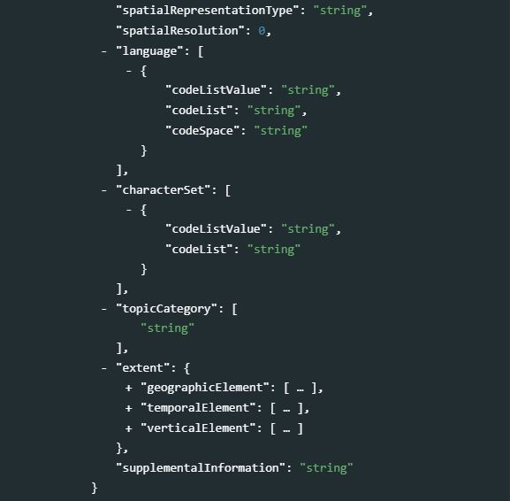{width=100%}
</center>


**Identification elements applicable to data services**

The following metadata elements are specific to resources of type **service**.

| Element              | Description                                                  |
| -------------------- | ------------------------------------------------------------ |
| `serviceType`        | The type of service (as free text),eg. OGC:WMS               |
| `serviceTypeVersion` | The version of the service e.g. 1.3.0                        |
| `accessProperties`   | Access properties, including description of `fees`, `plannedAvailableDateTime`, `orderingInstructions` and `turnaround` |
| `restrictions`       | Legal and/or Security <u>constraints</u> associated to the service. For more details, see the ***common elements*** section of the chapter.|
| `keywords`           | Set of service <u>keywords</u>. For more details, see the ***common elements*** section of the chapter. |
| `extent`             | Defines the spatial (horizontal and vertical) and temporal region to which the service applies (if applicable). see the ***common elements*** section of the chapter. |
| `coupledResource`    | Eventual resource(s) coupled to a service operation.         |
| `couplingType`       | The type of coupling between service and coupled resources. Values should be selected from the following controlled vocabulary: `{loose, mixed, tight}` |
| `containsOperations` | Operation(s) available for the service. See below for details. |
| `operatesOn`         | List of dataset identifiers on which the service operates.   |

<center>
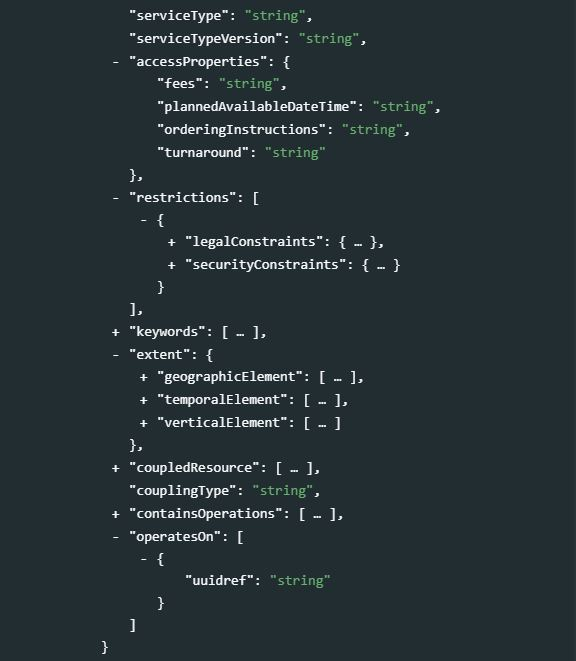{width=100%}
</center>


##### Service operation 

A data service operation is described with the following metadata elements:

| Element                | Description                                                  |
| ---------------------- | ------------------------------------------------------------ |
| `operationName`        | Name of the operation                                        |
| `DCP`                  | Distributed Computing Platform. Recommended value: 'WebServices' |
| `operationDescription` | Description of the operation                                 |
| `invocationName`       | Name of the operation as invoked when using the service    |
| `parameters`           | Operation parameter(s). A parameter can be defined with several properties including `name`, `description`, `direction` (in, out, or 'inout'), `optionality` ('Mandatory' or 'Optional'), `repeatability`(true/false), and the `valueType` (type of value expected, e.g., string, numeric, etc.) |
| `connectPoint`         | URL points, defined as <u>online resource</u>(s)             |
| `dependsOn`            | Service operation(s) the service operation depends on.       |

The *service operation*(s) descriptions are recommended when the *service* does not support the self-description of its operations.

<center>
{width=100%}
</center>


#### Content (`contentInfo`)

For vector datasets, the ISO 19115-1 does not provide all necessary elements; the structure of vector datasets is therefore documented using the `featureCatalogueDescription` of the ISO 19110 (*Feature Catalogue*) standard. The ISO 19110 is included in the unified ISO 19139 XML specification.

**Feature catalogue description** (`featureCatalogueDescription`)

The Feature Catalogue description aims to link the structural metadata (ISO 19110) to the dataset metadata (ISO 19115). This will be required when the structural metadata is not contained in the same metadata file as the dataset metadata.^[In our JSON schema, the structural metadata and the dataset metadata are stored in one same container.] The following elements are used to document this relationship:

| Element                    | Description                                                  |
| -------------------------- | ------------------------------------------------------------ |
| `complianceCode`           | Indicates whether the dataset complies with the feature catalogue description |
| `language`                 | Language used in the feature catalogue                       |
| `includedWithDataset`      | Indicates if the feature catalogue description is included with the dataset (essentially, as downloadable resource) |
| `featureCatalogueCitation` | A `citation` that references the ISO 19110 feature catalogue. As best practice, this citation will essentially use two properties: `uuidref` giving the persistent identifier of the feature catalogue, `href` giving a web link to access the ISO 19110 feature catalogue. |

<center>
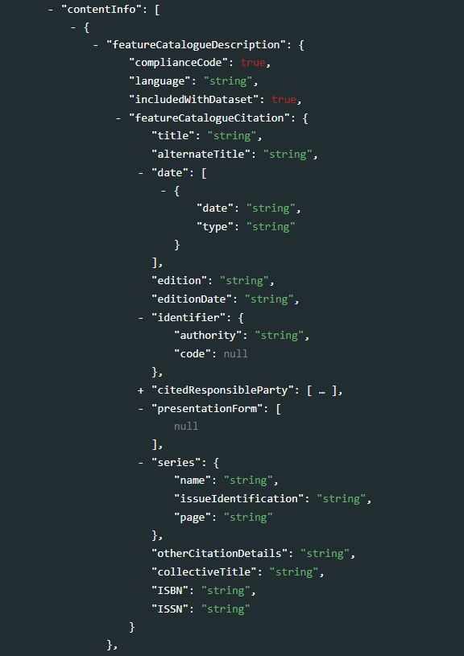{width=100%}
</center>

The feature catalog can be an external metadata file or document. We embedded it our JSON schema. See the section **ISO 19110 Feature Catalogue** below.

**Description of coverage** (`coverageDescription`)

The structure of raster/gridded datasets can be described using the ISO 19115-2 standard, using the `coverageDescription` element and the following two properties: 

| Element       | Description                                                  |
| ------------- | ------------------------------------------------------------ |
| `contentType` | Type of coverage content, e.g., 'image'. It is recommended to define the content type using the [controlled vocabulary](http://standards.iso.org/iso/19139/resources/gmxCodelists.xml#MD_CoverageContentTypeCode) suggested by the ISO 19139 which contains the following values: {`image`, `thematicClassification`, `physicalMeasurement`, `auxillaryInformation`, `qualityInformation`, `referenceInformation`, `modelResult`, `coordinate`, `auxilliaryData`} |
| `dimension`   | List of coverage dimensions. Each dimension can be defined by a `name` and a `type`. For the `type`, a good practice is to rely on primitive data types defined in the XML Schema https://www.w3.org/2009/XMLSchema/XMLSchema.xsd |
| `rangeElementDescription`	| List of range element descriptions. Each range element description will have a `name`/`definition` (corresponding to the dimension considered), and list of accepted values as `rangeElement`. For example, for a timeseries with series defined at specific instants in time, the `Time` dimension of the spatio-temporal coverage could be defined here giving the list of time instants supported by the time series. |

<center>
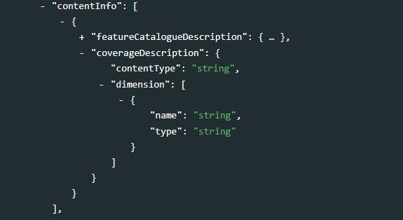{width=100%}
</center>

#### Distribution (`distributionInfo`)

The distribution information documents who is the actual *distributor* of the resources, and other aspects of the distribution in term of _format_ and _online resources_. This information is provided using the following elements:

| Element              | Description                                                  |
| -------------------- | ------------------------------------------------------------ |
| `distributionFormat` | Format(s) definitions. See the ***common elements*** section for information on how to document a format. |
| `distributor`        | <u>Contact</u>(s) in charge of the resource distribution. See the ***common elements*** section for information on how to document a contact.    |
| `transferOptions`    | Transfer option(s) to get the resource. To align with the ISO 19139, these resources should be set in an `onLine` element where all online resources available can be listed, or as `offLine` for media not available online. |

<center>
{width=100%}
</center>

#### Data quality (`dataQualityInfo`)

Information on the quality of the data will be useful to secondary analysts, to ensure proper use of the data. Data quality is documented in the section `dataQualityInfo` using three main metadata elements:

| Element   | Description                                                  |
| --------- | ------------------------------------------------------------ |
| `scope`   | Scope / hierarchy  level targeted by the data quality information section. The ISO 19139 recommends the use of a controlled vocabulary with the following options: {`attribute`, `attributeType`, `collectionHardware`, `collectionSession`, `dataset`, `series`, `nonGeographicDataset`, `dimensionGroup`, `feature`, `featureType`, `propertyType`, `fieldSession`, `software`, `service`, `model`, `tile`, `initiative`, `stereomate`, `sensor`, `platformSeries`, `sensorSeries`, `productionSeries`, `transferAggregate`, `otherAggregate`} |
| `report`  | Report(s) describing the quality information, for example a [INSPIRE](https://inspire.ec.europa.eu/metadata/6541) metadata compliance report. To see how to create a data quality conformance `report`, see details below. |
| `lineage` | The `lineage` provides the elements needed to describe the process that led to the production of the data. In combination with `report`, the lineage will allow data users to assess quality conformance. This is an important metadata element.|

##### Report (`report`)

<center>
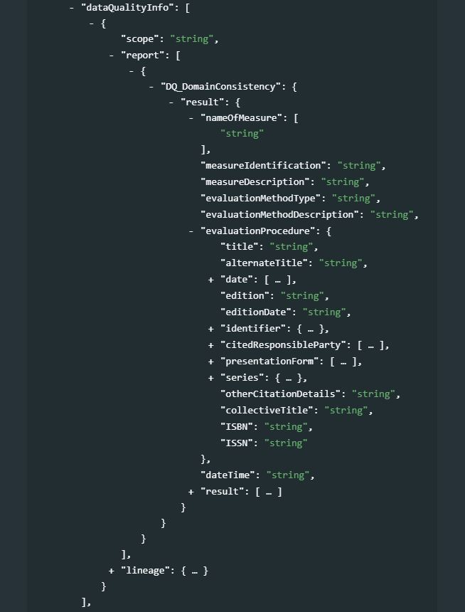{width=100%}
</center>

A `report` describes the *result* of an assessment of the conformance (or not) of a resource to consistency rules. The `result` is the main component of a report, which can be described with the following elements:

  - `nameOfMeasure`: One or more measure names used for the data quality report
  - `measureIdentification`: Identification of the measure, using a unique identifier (if applicable)
  - `measureDescription`: A description of the measure
  - `evaluationMethodType`: Type of evaluation method. The ISO 19139 recommends the use of a controlled vocabulary with the following options: `{directInternal, directExternal, indirect}`
  - `evaluationMethodDescription`: Description of the evaluation method
  - `evaluationProcedure`: Citation of the evaluation procedure (as <u>citation</u> element)
  - `dateTime`: Date time when the report was established
  - `report`: Result(s) associated to the report. Each result should be described with a `specification`, an `explanation` (of the result of conformance or not conformance), and a `pass` property indicating if the result was positive (true) or not (false).


##### Lineage (`lineage`)

The `lineage` provides a structured solution to describe the work flow that led to the production of the data/service, defined by:

- a general `statement` of the work flow performed
- sequence of process steps performed. Each `processStep` is defined by the following elements:
   - `description`: Description of the process step performed
   - `rationale`: Rationale of the process step
   - `dateTime`: Date of the processing
   - `processor`: Contact(s) acting as processor(s) for the target step
   - `source`: Source(s) used for the process step. Each `source` can have a `description` and a `sourceCitation` (as <u>citation</u> element).
  
<center>
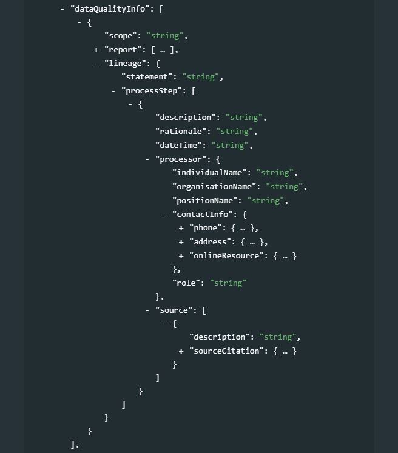{width=100%}
</center>

#### Metadata maintenance (`metadataMaintenanceInfo`)

The `metadataMaintenanceInfo` and `maintenanceAndUpdateFrequency` elements provide information on the maintenance of the metadata including the frequency of updates. The `metadataMaintenanceInfo` element is a free text element. The information provided in `maintenanceAndUpdateFrequency` should be chosen from values recommended by the ISO 19139 controlled vocabulary with the following options: `{continual, daily, weekly, fortnightly, monthly, quarterly, biannually, annually, asNeeded, irregular, notPlanned, unknown}`.

<center>
{width=100%}
</center>

<center>
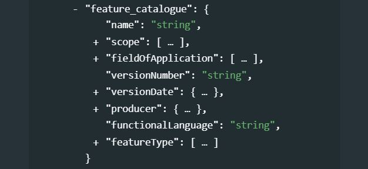{width=100%}
</center>


## ISO 19110 Feature Catalogue (`feature_catalogue`)

We describe below how the ISO 19110 feature catalogue is used to document the structure of a vector dataset (complementing the ISO 10119-1). This is equivalent to producing a "data dictionary" for the variables/features included in a vector dataset. An example of the implementation of such a feature catalogue using R is provided in the **Examples** section of this chapter (see Example 3 in section 5.5.3).

| Element              | Description                                                  |
| -------------------- | ------------------------------------------------------------ |
| `name`               | Name of the feature catalogue                                |
| `scope`              | Subject domain(s) of feature types defined in this feature catalogue |
| `fieldOfApplication` | One or more fields of applications for this feature catalogue. |
| `versionNumber`      | Version number of this feature catalogue, which may include both a major version number or letter and a sequence of minor release numbers or letters, such as '3.2.4a.' The format of this attribute may differ between cataloguing authorities. |
| `versionDate`        | Version `date`                                               |
| `producer`           | The `responsibleParty` in charge of the feature catalogue production |
| `functionalLanguage` | Formal functional language in which the feature operation formal definition occurs in this feature catalogue |
| `featureType`        | One or more feature type(s) defined in the Feature catalogue. The definition of several feature types can be considered when targeting various forms of a dataset (e.g., simplified vs. complete set of attributes, raw vs. aggregated, etc). In practice, a simple ISO 19110 feature catalogue will reference one feature type describing the unique dataset structure. See details below. |

<center>
{width=100%}
</center>

 The `featureType` is the actual data structure definition of a dataset (data dictionary), and has the following properties:

| Element                    | Description                                                  |
| -------------------------- | ------------------------------------------------------------ |
| `typeName`                 | Text string that uniquely identifies this feature type within the feature catalogue that contains this feature type |
| `definition`               | Definition of the feature type                               |
| `code`                     | Code that uniquely identifies this feature type within the feature catalogue that contains this feature type |
| `isAbstract`               | Indicates if the feature type is abstract or not             |
| `aliases`                  | One or more aliases as equivalent names of the feature type  |
| `carrierOfCharacteristics` | Feature attribute(s) / column(s) definitions. See below details. |

<center>
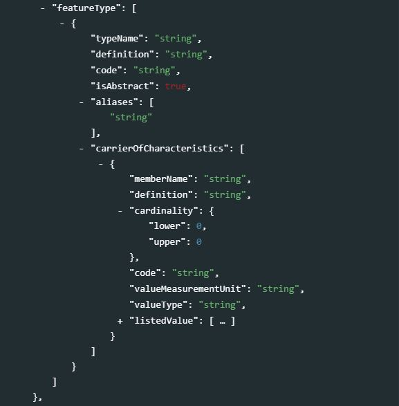{width=100%}
</center>

Each feature attribute, i.e. column that is a member of the vector data structure is defined as `carrier of characteristics`. Each set of characteristics can be defined with the following properties:

| Element                | Description                                                  |
| ---------------------- | ------------------------------------------------------------ |
| `memberName`           | Name of the property member of the feature type              |
| `definition`           | Definition of the property member                            |
| `cardinality`          | Definition of the member type cardinality. The cardinality is set of two properties: lower cardinality (`lower`) and upper cardinality (`upper`). For simple tabular datasets, the cardinality will be 1-1. Multiple cardinalities (eg. 1-N, N-N) apply particularly to feature catalogues/types that describe relational databases. |
| `code`                 | Code for the attribute member of the feature type. Corresponds to the actual column name in an attributes table. |
| `valueMeasurementUnit` | Measurement unit of the values (in case of the feature member corresponds to a measurable variable) |
| `valueType`            | Type of value. A good practice is to rely on primitive data types defined in the XML Schema https://www.w3.org/2009/XMLSchema/XMLSchema.xsd |
| `listedValue`          | List of controlled value(s) used in the attribute member. Each value corresponds to an object compound by 1) a `label`, 2) a `code` (as contained in the dataset), 3) a `definition`. This element will be used when the feature member relates to reference datasets, such as code lists or registers. e.g., list of countries, land cover types, etc. |


## Provenance

<br>
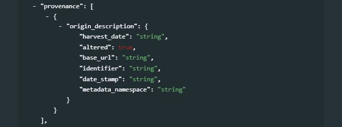{width=100%}
<br>

**`provenance`** *[Optional ; Repeatable]* <br>
Metadata can be programmatically harvested from external catalogs. The `provenance` group of elements is used to store information on the provenance of harvested metadata, and on alterations that may have been done to the harvested metadata. These elements are NOT part of the ISO 19139 metadata standard.<br>
   - **`origin_description`** *[Required ; Not repeatable]* <br>
   The `origin_description` elements are used to describe when and from where metadata have been extracted or harvested.  <br>
      - **`harvest_date`** *[Required ; Not repeatable ; String]* <br>
      The date and time the metadata were harvested, in ISO 8601 format.<br>
      - **`altered`** *[Optional ; Not repeatable ; Boolean]* <br>
      A boolean variable ("true" or "false"; "true by default) indicating whether the harvested metadata have been modified before being re-published. In many cases, the unique identifier of the study (element `idno` in the Study Description / Title Statement section) will be modified when published in a new catalog.<br>
      - **`base_url`** *[Required ; Not repeatable ; String]* <br>
      The URL from where the metadata were harvested.<br>
      - **`identifier`** *[Optional ; Not repeatable ; String]* <br>
      The unique dataset identifier (`idno` element) in the source catalog. When harvested metadata are re-published in a new catalog, the identifier will likely be changed. The `identifier` element in `provenance` is used to maintain traceability.<br>
      - **`date_stamp`** *[Optional ; Not repeatable ; String]* <br>
      The datestamp (in UTC date format) of the metadata record in the originating repository (this should correspond to the date the metadata were last updated in the source catalog).<br>
      - **`metadata_namespace`** *[Optional ; Not repeatable ; String]* <br>
      @@@@@@@ <br>


## Tags

- **`tags`** *[Optional ; Repeatable]* <br>
Tags provides easy way to include custom-facets in NADA. Should consider using one or multiple controlled vocabulary(ies). See section 1.7 for more on the importance and use of tags and tag_groups in data catalogs.
  <br>
  {width=100%}  
  <br>
    - **`tag`** *[Required ; Not repeatable ; String]* <br>
    A user-defined tag.
    - **`tag_group`** *[Optional ; Not repeatable ; String]* <br><br>
    A user-defined group to which the tag belongs. Grouping tags allows implementation of controlled facets (filters) in data catalogs.

## LDA topics

- **`lda_topics`** *[Optional ; Not repeatable]* <br>
  <br>
  {width=100%}  
  <br>
We mentioned in Chapter 1 the importance of producing rich metadata, and the opportunities that machine learning offers to enrich (or "augment") metadata in a largely automated manner. One application of machine learning, more specifically of natural language processing, to enrich metadata related to publications is the topic extraction using Latent Dirichlet Allocation (LDA) models. LDA models must be trained on large corpora of documents. They do not require any pre-defined taxonomy of topics. The approach consists of "clustering" words that are likely to appear in similar contexts (the number of "clusters" or "topics" is a parameter provided when training a model). Clusters of related words form "topics". A topic is thus defined by a list of keywords, each one of them provided with a score indicating its importance in the topic. Typically, the top 10 words that represent a topic will be used to describe it. The description of the topics covered by a document (in this case, the "document" is a compilation of elements from the dataset metadata) can be indexed to improve searchability (possibly in a selective manner, by setting thresholds on the topic shares and word weights).  
<br>
Once an LDA topic model has been trained, it can be used to infer the topic composition of any document. This inference will then provide the share that each topic represents in the document. The sum of all represented topics is 1 (100%).<br> 
<br>
The metadata element `lda_topics` is provided to allow data curators to store information on the inferred topic composition of the documents listed in a catalog. Sub-elements are provided to describe the topic model, and the topic composition.

> Important note: the topic composition of a document is specific to a topic model. To ensure consistency of the information captured in the `lda_topics` elements, it is important to make use of the same model(s) for generating the topic composition of all documents in a catalog. If a new, better LDA model is trained, the topic composition of all documents in the catalog should be updated.
<br>

- The `lda_topics` element includes the following metadata fields:<br> 
<br>
    - **`model_info`** *[Optional ; Not repeatable]* <br>
    Information on the LDA model.<br>
        - `source` *[Optional ; Not repeatable ; String]* <br>
        The source of the model (typically, an organization).<br>
        - `author` *[Optional ; Not repeatable ; String]* <br>
        The author(s) of the model.<br>
        - `version` *[Optional ; Not repeatable ; String]* <br>
        The version of the model, which could be defined by a date or a number.<br>
        - `model_id` *[Optional ; Not repeatable ; String]* <br>
        The unique ID given to the model.<br>
        - `nb_topics` *[Optional ; Not repeatable ; Numeric]* <br>
        The number of topics in the model (the number of topics to be extracted from a corpus is the key parameter of any LDA model).<br>
        - `description` *[Optional ; Not repeatable ; String]* <br>
        A brief description of the model.<br>
        - `corpus` *[Optional ; Not repeatable ; String]* <br>
        A brief description of the corpus on which the LDA model was trained.<br>
        - `uri` *[Optional ; Not repeatable ; String]* <br>
        A link to a web page where additional information on the model is available.<br>
        <br>
    - **`topic_description`** *[Optional ; Repeatable]* <br>
    The topic composition of the document.<br>
        - `topic_id` *[Optional ; Not repeatable ; String]* <br>
        The identifier of the topic; this will often be a sequential number (Topic 1, Topic 2, etc.).<br>
        - `topic_score` *[Optional ; Not repeatable ; Numeric]* <br>
        The share of the topic in the document (%).<br>
        - `topic_label` *[Optional ; Not repeatable ; String]* <br>
        The label of the topic, if any (not automatically generated by the LDA model).<br>
        - `topic_words` *[Optional ; Not repeatable]* <br>
        The list of N keywords describing the topic (e.g., the top 5 words).<br>
           - `word` *[Optional ; Not repeatable ; String]* <br>
           The word.<br>
           - `word_weight` *[Optional ; Not repeatable ; Numeric]* <br>
           The weight of the word in the definition of the topic. This is specific to the model, not to a document. <br>

<br>

  > Example in R:  
  ```{r, eval=F, echo=T}
  
  lda_topics = list(
    
     list(
    
        model_info = list(
          list(source      = "World Bank, Development Data Group",
               author      = "A.S.",
               version     = "2021-06-22",
               model_id    = "Mallet_WB_75",
               nb_topics   = 75,
               description = "LDA model, 75 topics, trained on Mallet",
               corpus      = "World Bank Documents and Reports (1950-2021)",
               uri         = ""))
        ),
        
        topic_description = list(
        
          list(topic_id    = "topic_27",
               topic_score = 32,
               topic_label = "Education",
               topic_words = list(list(word = "school",      word_weight = "")
                                  list(word = "teacher",     word_weight = ""),
                                  list(word = "student",     word_weight = ""),
                                  list(word = "education",   word_weight = ""),
                                  list(word = "grade",       word_weight = "")),
          
          list(topic_id    = "topic_8",
               topic_score = 24,
               topic_label = "Gender",
               topic_words = list(list(word = "women",       word_weight = "")
                                  list(word = "gender",      word_weight = ""),
                                  list(word = "man",         word_weight = ""),
                                  list(word = "female",      word_weight = ""),
                                  list(word = "male",        word_weight = "")),
          
          list(topic_id    = "topic_39",
               topic_score = 22,
               topic_label = "Forced displacement",
               topic_words = list(list(word = "refugee",     word_weight = "")
                                  list(word = "programme",   word_weight = ""),
                                  list(word = "country",     word_weight = ""),
                                  list(word = "migration",   word_weight = ""),
                                  list(word = "migrant",     word_weight = "")),
                                  
          list(topic_id    = "topic_40",
               topic_score = 11,
               topic_label = "Development policies",
               topic_words = list(list(word = "development", word_weight = "")
                                  list(word = "policy",      word_weight = ""),
                                  list(word = "national",    word_weight = ""),
                                  list(word = "strategy",    word_weight = ""),
                                  list(word = "activity",    word_weight = ""))
                                  
        )
        
     )
     
  )
  ```

 ## Embeddings
 
- **`embeddings`** *[Optional ; Repeatable]* <br>
  In Chapter 1 (section 1.n), we briefly introduced the concept of word embeddings and their use in implementation of semantic search tools. Word embedding models convert text (words, phrases, documents) into large-dimension numeric vectors (e.g., a vector of 100 or 200 numbers) that are representative of the semantic content of the text. In this case, the text would be a compilation of selected elements of the dataset metadata. The vectors are generated by submitting a text to a pre-trained word embedding model (possibly via an API). 
  
The word vectors do not have to be stored in the document metadata to be exploited by search engines. When a semantic search tool is implemented in a catalog, the vectors will be stored in a database end processed by a tool like Milvus. A metadata element is however provided to store the vectors for preservation and sharing purposes. This block of metadata elements is repeatable, allowing multiple vectors to be stored. When using vectors in a search engine, it is critical to only use vectors generated by one same model. 
  
  <br>
  {width=100%}  
  <br>

  The `embeddings` element contains four metadata fields:
    - **`id`** *[Optional ; Not repeatable ; String]* <br>
    A unique identifier of the word embedding model used to generate the vector.
    - **`description`** *[Optional ; Not repeatable ; String]* <br>
    A brief description of the model. This may include the identification of the producer, a description of the corpus on which the model was trained, the identification of the software and algorithm used to train the model, the size of the vector, etc.
    - **`date`** *[Optional ; Not repeatable ; String]* <br>
    The date the model was trained (or a version date for the model).
    - **`vector`** *[Required ; Not repeatable ; Object]* @@@@@@@@ do not offer options
    The numeric vector representing the document, provided as an object (array or string). <br><br>
    [1,4,3,5,7,9]

## Additional 

**`additional`** *[Optional ; Not repeatable]*<br>   
The `additional` element allows data curators to add their own metadata elements to the schema. All custom elements must be added within the `additional` block; embedding them elsewhere in the schema would cause schema validation to fail.
<br>
{width=100%}
<br>


## Complete examples

### Example 1 (vector - shape files): Bangladesh, Outline of camps of Rohingya refugees in Cox's Bazar, January 2021 

In this first example, we use a geographic dataset that contains the outline of Rohingya refugee camps, settlements, and sites in Cox's Bazar, Bangladesh. The dataset was imported from the [Humanitarian Data Exchange website](https://data.humdata.org/dataset/outline-of-camps-sites-of-rohingya-refugees-in-cox-s-bazar-bangladesh) on March 3, 2021. 

We include in the metadata a simple description of the features (variables) contained in the shape files. This information will significantly increase data discoverability, as it provide information of the content of the data files (which is not described elsewhere in the metadata). 

<center>
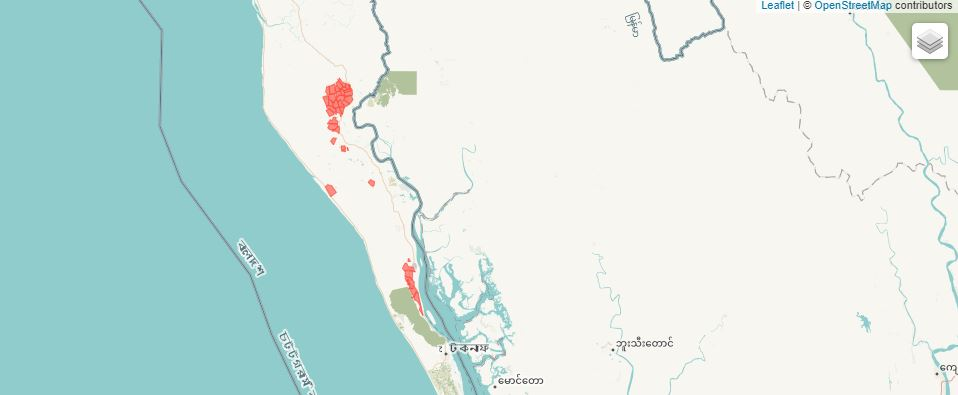{width=100%}
</center>

----------
**Generating the metadata using R**
----------

```{r, eval=F, echo=T}
library(nadar)
library(readr)     @@@@ used?
library(readxl)    @@@@ used?
library(writexl)   @@@@ used?
library(sf)

# ----------------------------------------------------------------------------------
# Enter credentials (API confidential key) and catalog URL
my_keys <- read.csv("C:/confidential/my_API_keys.csv", header=F, stringsAsFactors=F)
set_api_key("my_keys[1,1")  
set_api_url("https://.../index.php/api/") 
set_api_verbose(FALSE)
# ----------------------------------------------------------------------------------

setwd("C:/my_geo_data/") 

thumb = "shape_camps.JPG"

# Download the data files (if not already downloaded)
# Note: the data are frequently updated; the links below may have become invalid.
# Visit: https://data.humdata.org/dataset/1a67eb3b-57d8-4062-b562-049ad62a85fd for an update.

base_url = "https://data.humdata.org/dataset/1a67eb3b-57d8-4062-b562-049ad62a85fd/resource/"
urls <- list(
  paste0(base_url, "7cec91fb-d0a8-4781-9f8d-9b69772ef2fd/download/210118_rrc_geodata_al1al2al3.gdb.zip"),
  paste0(base_url, "ace4b0a6-ef0f-46e4-a50a-8c552cfe7bf3/download/200908_rrc_outline_camp_al1.zip"),
  paste0(base_url, "bd5351e7-3ffc-4eaa-acbc-c6d917b5549c/download/200908_rrc_outline_camp_al1.kmz"),
  paste0(base_url, "9d5693ec-eeb8-42ed-9b65-4c279f523276/download/200908_rrc_outline_block_al2.zip"),
  paste0(base_url, "ed119ae4-b13d-4473-9afe-a8c36e07870b/download/200908_rrc_outline_block_al2.kmz"),
  paste0(base_url, "0d2d87ae-52a5-4dca-b435-dcd9c617b417/download/210118_rrc_outline_subblock_al3.zip"),
  paste0(base_url, "6286c4a5-d2ab-499a-b019-a7f0c327bd5f/download/210118_rrc_outline_subblock_al3.kmz")
)  

for(url in urls) {
  f <- basename(url) 
  if (!file.exists(f)) download.file(url, destfile=f, mode="wb")
}

# Unzip and read the shape files to extract information
# The object contain the number of features, layers, geodetic CRS, etc.

unzip("200908_rrc_outline_camp_al1.zip", exdir = "AL1")
al1 <- st_read("./AL1/200908_RRC_Outline_Camp_AL1.shp")

unzip("200908_rrc_outline_block_al2.zip", exdir = "AL2")
al2 <- st_read("./AL2/200908_RRC_Outline_Block_AL2.shp")

unzip("210118_rrc_outline_subblock_al3.zip", exdir = "AL3")
al3 <- st_read("./AL3/210118_RRC_Outline_SubBlock_AL3.shp")

# ---------------

id = "BGD_2021_COX_CAMPS_GEO_OUTLINE"

my_geo_metadata <- list(
  
  metadata_information = list(
    title = "(Demo) Site Management Sector, RRRC, Inter Sector Coordination Group (ISCG)",
    producers = list(list(name = "NADA team")),
    production_date = "2022-02-18"
  ),
  
  description = list(
    
    idno = id,
    
    language = "eng",
    
    characterSet = list(codeListValue = "utf8"),
    
    hierarchyLevel = list("dataset"),
    
    contact = list(
      list(
        organisationName = "Site Management Sector, RRRC, Inter Sector Coordination Group (ISCG)",
        contactInfo = list(
          address = list(country = "Bangladesh"),
          onlineResource = list(
            linkage = "https://www.humanitarianresponse.info/en/operations/bangladesh/",
            name = "Website"
          )
        ),
        role = "owner"
      )
    ),

    dateStamp = "2021-01-20",
      
    metadataStandardName = "ISO 19115:2003/19139",
      
    spatialRepresentationInfo = list(
      
      # File 200908_rrc_outline_camp_al1.zip
      list(
        vectorSpatialRepresentationInfo = list(
          topologyLevel = "geometryOnly",
          geometricObjects = list(
            geometricObjectType = "surface",
            geometricObjectCount = "35" 
          )
        )
      ),
      
      # File 200908_rrc_outline_block_al2.zip
      list(
        vectorSpatialRepresentationInfo = list(
          topologyLevel = "geometryOnly",
          geometricObjects = list(
            geometricObjectType = "surface",
            geometricObjectCount = "173" 
          )
        )
      ),
      
      # File 210118_rrc_outline_subblock_al3.zip
      list(
        vectorSpatialRepresentationInfo = list(
          topologyLevel = "geometryOnly",
          geometricObjects = list(
            geometricObjectType = "surface",
            geometricObjectCount = "967" 
          )
        )
      )
      
    ),
    
    referenceSystemInfo = list(
      list(code = "4326", codeSpace = "EPSG"),
      list(code = "84",   codespace = "WGS")
    ),
    
    identificationInfo = list(
      
      list(
        
        citation = list(
          title = "Bangladesh, Outline of camps of Rohingya refugees in Cox's Bazar, January 2021",
          date = list(
            list(date = "2021-01-20", type = "creation")
          ),
          citedResponsibleParty = list(
            list(
              organisationName = "Site Management Sector, RRRC, Inter Sector Coordination Group (ISCG)",
              contactInfo = list(
                address = list(country = "Bangladesh"),
                onlineResource = list(
                  linkage = "https://www.humanitarianresponse.info/en/operations/bangladesh/",
                  name = "Website"
                )
              ),
              role = "owner"
            )
          )
        ),

        abstract = "These polygons were digitized through a combination of methodologies, originally using VHR satellite imagery and GPS points collected in the field, verified and amended according to Site Management Sector, RRRC, Camp in Charge (CiC) officers inputs, with technical support from other partners.",
        
        purpose = "Inform the UNHCR operations (and other support agencies') in refugee camps in Cox's Bazar.",
        
        credit = "Site Management Sector, RRRC, Inter Sector Coordination Group (ISCG)",
        
        status = "completed",
        
        pointOfContact = list(
          list(
            organisationName = "Site Management Sector, RRRC, Inter Sector Coordination Group (ISCG)",
            contactInfo = list(
              address = list(country = "Bangladesh"),
              onlineResource = list(
                linkage = "https://www.humanitarianresponse.info/en/operations/bangladesh/",
                name = "Website"
              )
            ),
            role = "pointOfContact"
          )  
        ),
        
        resourceMaintenance = list(
          list(maintenanceOrUpdateFrequency = "asNeeded")
        ),
        
        graphicOverview = list(    # @@@@@@@@@@@@
          list(fileName = "",
               fileDescription = "",
               fileType = "")
        ),
        
        resourceFormats = list(
          list(name = "application/zip", 
               specification = "ESRI Shapefile (zipped)", 
               FormatDistributor = list(organisationName = "ESRI")
          ),
          list(name = "application/vnd.google-earth.kmz", 
               specification = "KMZ file", 
               FormatDistributor = list(organisationName = "Google")
          ),
          list(name = "ESRI Geodatabase", 
               FormatDistributor = list(organisationName = "ESRI")
          )
        ),
        
        descriptiveKeywords = list(
          list(keyword = "refugee camp"), 
          list(keyword = "forced displacement"),
          list(keyword = "rohingya")
        ),
    
        resourceConstraints = list(
          list(
            legalConstraints = list(
              uselimitation = list("License: http://creativecommons.org/publicdomain/zero/1.0/legalcode"),
              accessConstraints = list("unrestricted"),
              useConstraints = list("licenceUnrestricted")
            )
          )
        ),
        
        extent = list(
          geographicElement = list(
            list(
              geographicBoundingBox = list(
                southBoundLatitude = 20.91856,  
                westBoundLongitude = 92.12973,
                northBoundLatitude = 21.22292,
                eastBoundLongitude = 92.26863
              )
            )
          )
        ),
        
        spatialRepresentationType = "vector",
        
        language = list("eng")
      
      )
    
    ),
    
    distributionInfo = list(
      
      distributionFormat = list(
        list(name = "application/zip", 
             specification = "ESRI Shapefile (zipped)", 
             FormatDistributor = list(organisationName = "ESRI")
        ),
        list(name = "application/vnd.google-earth.kmz", 
             specification = "KMZ file", 
             FormatDistributor = list(organisationName = "Google")
        ),
        list(name = "ESRI Geodatabase", 
             FormatDistributor = list(organisationName = "ESRI")
        )
      ),
      
      distributor = list(
        list(
          organisationName = "United Nations Office for the Coordination of Humanitarian Affairs (OCHA)", 
          contactInfo = list(
            onlineResource = list(
              linkage = "https://data.humdata.org/dataset/outline-of-camps-sites-of-rohingya-refugees-in-cox-s-bazar-bangladesh",
              name = "Website"
            )
          )
        )
      )#,
      
      # transferOptions = list(
      #   list(
      #     onLine = list(   # @@@@@@@@ / use external resources schema?
      #       list(
      #         linkage = "https://data.humdata.org/dataset/1a67eb3b-57d8-4062-b562-049ad62a85fd/resource/7cec91fb-d0a8-4781-9f8d-9b69772ef2fd/download/210118_rrc_geodata_al1al2al3.gdb.zip",
      #         name = "210118_RRC_GeoData_AL1,AL2,AL3.gdb.zip",
      #         description = "This zipped geodatabase file (GIS) contains the Camp boundary (Admin level-1) and and camp-block boundary (admin level-2 or camp sub-division) and sub-block boundary of Rohingya refugee camps and administrative level-3 or sub block division of Camp 1E-1W, Camp 2E-2W, Camp 8E-8W, Camp 4 Extension, Camp 3-7, Camp 9-20, and Camp 21-27 in Cox's Bazar, Bangladesh. Updated: January 20, 2021",
      #         protocol = "WWW:LINK-1.0-http--link"
      #       ),
      #       list(
      #         linkage = "https://data.humdata.org/dataset/1a67eb3b-57d8-4062-b562-049ad62a85fd/resource/ace4b0a6-ef0f-46e4-a50a-8c552cfe7bf3/download/200908_rrc_outline_camp_al1.zip",
      #         name = "200908_RRC_Outline_Camp_AL1.zip",
      #         description = "This zipped shape file (GIS) contains the Camp boundary (Admin level-1) of Rohinya refugees in Cox's Bazar, Bangladesh. Updated: September 8, 2020",
      #         protocol = "WWW:LINK-1.0-http--link"
      #       ),
      #       list(
      #         linkage = "https://data.humdata.org/dataset/1a67eb3b-57d8-4062-b562-049ad62a85fd/resource/bd5351e7-3ffc-4eaa-acbc-c6d917b5549c/download/200908_rrc_outline_camp_al1.kmz",
      #         name = "200908_RRC_Outline_Camp_AL1.kmzKMZ",
      #         description = "This kmz file (Google Earth) contains the Camp boundary (Admin level-1) of Rohinya refugees in Cox's Bazar, Bangladesh. Updated: September 8, 2020",
      #         protocol = "WWW:LINK-1.0-http--link"
      #       ),
      #       list(
      #         linkage = "https://data.humdata.org/dataset/1a67eb3b-57d8-4062-b562-049ad62a85fd/resource/9d5693ec-eeb8-42ed-9b65-4c279f523276/download/200908_rrc_outline_block_al2.zip",
      #         name = "200908_RRC_Outline_Block_AL2.zip",
      #         description = "This zipped shape file (GIS) contains the camp-block boundary (admin level-2 or camp sub-division) of Rohinya refugees in Cox's Bazar, Bangladesh. Updated: September 8, 2020",
      #         protocol = "WWW:LINK-1.0-http--link"
      #       ),
      #       list(
      #         linkage = "https://data.humdata.org/dataset/1a67eb3b-57d8-4062-b562-049ad62a85fd/resource/ed119ae4-b13d-4473-9afe-a8c36e07870b/download/200908_rrc_outline_block_al2.kmz",
      #         name = "200908_RRC_Outline_Block_AL2.kmzKMZ",
      #         description = "This kmz file (Google Earth) contains the camp-block boundary (admin level-2 or camp sub-division) of Rohinya refugees in Cox's Bazar, Bangladesh. Updated: September 8, 2020",
      #         protocol = "WWW:LINK-1.0-http--link"
      #       ),
      #       list(
      #         linkage = "https://data.humdata.org/dataset/1a67eb3b-57d8-4062-b562-049ad62a85fd/resource/0d2d87ae-52a5-4dca-b435-dcd9c617b417/download/210118_rrc_outline_subblock_al3.zip",
      #         name = "210118_RRC_Outline_SubBlock_AL3.zip",
      #         description = "This zipped shape file (GIS) contains the camp-sub-block (Admin level-3) of Camp 1E-1W, Camp 2E-2W, Camp 8E-8W, Camp 4 Extension, Camp 3-7, Camp 9-20, and Camp 21-27 in Cox's Bazar, Bangladesh. Updated: January 20, 2021",
      #         protocol = "WWW:LINK-1.0-http--link"
      #       ),
      #       list(
      #         linkage = "https://data.humdata.org/dataset/1a67eb3b-57d8-4062-b562-049ad62a85fd/resource/6286c4a5-d2ab-499a-b019-a7f0c327bd5f/download/210118_rrc_outline_subblock_al3.kmz",
      #         name = "210118_RRC_Outline_SubBlock_AL3.kmzKMZ",
      #         description = "This kmz file (Google Earth) contains the camp-sub-block (Admin level-3) of Camp 1E-1W, Camp 2E-2W, Camp 8E-8W, Camp 4 Extension, Camp 3-7, Camp 9-20, and Camp 21-27 in Cox's Bazar, Bangladesh. Updated: January 20, 2021",
      #         protocol = "WWW:LINK-1.0-http--link"
      #       )
      #     )
      #   )
      # )
      
    ),

    dataQualityInfo = list(
      list(
        scope = "dataset", 
        lineage = list(
          statement = "The camps are continuously expanding, and Camp Boundaries are structured around the GoB, RRRC official governance structure of the camps, taking into account the potential new land allocation. The database is kept as accurate as possible, given these challenges."
        )
      )  
    ),
    
    metadataMaintenance = list(maintenanceAndUpdateFrequency = "asNeeded"),
    
    feature_catalogue = list(
      
      name = "Feature Catalogue dataset xxxxx",
      scope = list("3 shape files: al1, al2, al3"),
    
      featureType = list(
        list(
          typeName =  "",
          definition = "",
          carrierOfCharacteristics = list(
            list(
              memberName = 'District',
              definition = 'Cox s Bazar'
            ),
            list(
              memberName = 'Upazila',
              definition = 'Teknaf, Ukhia',
            ),
            list(
              memberName = 'Settlement',
              definition = 'Collective site; Collective site with host community',
            ),
            list(
              memberName = 'Union',
              definition = 'Baharchhara; Nhilla; Palong Khali; Raja Palong; Whykong',
            ),
            list(
              memberName = 'Name_Alias',
              definition = 'Alikhali; Bagghona-Putibonia; Camp 20 Extension; 
                            Camp 4; Camp 4 Extension; Chakmarkul; Choukhali; 
                            Hakimpara; Jadimura; Jamtoli-Baggona; Jomer Chora; 
                            Kutupalong RC; Modur Chora; Nayapara; Nayapara RC; 
                            Shamlapur; Tasnimarkhola; Tasnimarkhola-Burmapara; 
                            Unchiprang'
            ),
            list(
              memberName = 'SSID',
              definition = 'CXB-017 to CXB-235',
            ),
            list(
              memberName = 'SMSD__Cnam',
              definition = 'Camp 01E; Camp 01W; Camp 02E; Camp 02W; Camp 03; Camp 04;
                            Camp 04X; Camp 05; Camp 06; Camp 07; Camp 08E; Camp 08W;
                            Camp 09; Camp 10; Camp 11; Camp 12; Camp 13; Camp 14;
                            Camp 15; Camp 16; Camp 17; Camp 18; Camp 19; Camp 20;
                            Camp 20X; Camp 21; Camp 22; Camp 23; Camp 24; Camp 25;
                            Camp 26; Camp 27; Camp KRC; Camp NRC; Choukhali',
            ),
            list(
              memberName = 'NPM_Name',
              definition = 'Camp 01E; Camp 01W; Camp 02E; Camp 02W; Camp 03; 
                            Camp 04; Camp 04 Extension; Camp 05; Camp 06; ; Camp 07; 
                            Camp 08E; Camp 08W; Camp 09; Camp 10; Camp 11; Camp 12; 
                            Camp 13  Camp 14 (Hakimpara); Camp 15 (Jamtoli); 
                            Camp 16 (Potibonia); Camp 17; Camp 18; Camp 19; Camp 20; 
                            Camp 20 Extension; Camp 21 (Chakmarkul); Camp 22 (Unchiprang); 
                            Camp 23 (Shamlapur); Camp 24 (Leda); Camp 25 (Ali Khali); 
                            Camp 26 (Nayapara); Camp 27 (Jadimura); Choukhali; 
                            Kutupalong RC; Nayapara RC',
            ),
            list(
              memberName = 'Area_Acres',
              definition = 'Area in acres',
            ),
            list(
              memberName = 'PeriMe_Met',
              definition = 'Perimeter in meters',
            ),
            list(
              memberName = 'Camp_Name',
              definition = 'Camp 10; Camp 11; Camp 12; Camp 13; Camp 14; Camp 15; 
                            Camp 16; Camp 17; Camp 18; Camp 19; Camp 1E; Camp 1W; 
                            Camp 20 Camp 20 Extension; Camp 21; Camp 22; Camp 23; 
                            Camp 24; Camp 25; Camp 26; Camp 27; Camp 2E; Camp 2W; 
                            Camp 3; Camp 4; Camp 4 Extension; Camp 5; Camp 6; 
                            Camp 7; Camp 8E; Camp 8W; Camp 9; Choukhali; 
                            Kutupalong RC; Nayapara RC',
            ),
            list(
              memberName = 'Area_SqM',
              definition = 'Area in square km',
            ),
            list(
              memberName = 'Latitude'
            ),
            list(
              memberName = 'Longitude'
            ),
            list(
              memberName = 'geometry'
            )
            #,
            #... al2, al3  @@@@@@@@@ complete
          )
        )
      )
    )

  )
  
)  


# Publish in NADA catalog

geospatial_add(
  idno = id, 
  metadata = my_geo_metadata, 
  repositoryid = "central", 
  published = 1, 
  thumbnail = thumb, 
  overwrite = "yes"
)

# Add a link to HDX as an external resource

external_resources_add(
  title = "Humanitarian Data Exchange website",
  idno = id,
  dctype = "web",
  file_path = "https://data.humdata.org/",
  overwrite = "yes"
)

```

**The result in NADA**

After running the script, the data and metadata will be available in NADA.

<br>
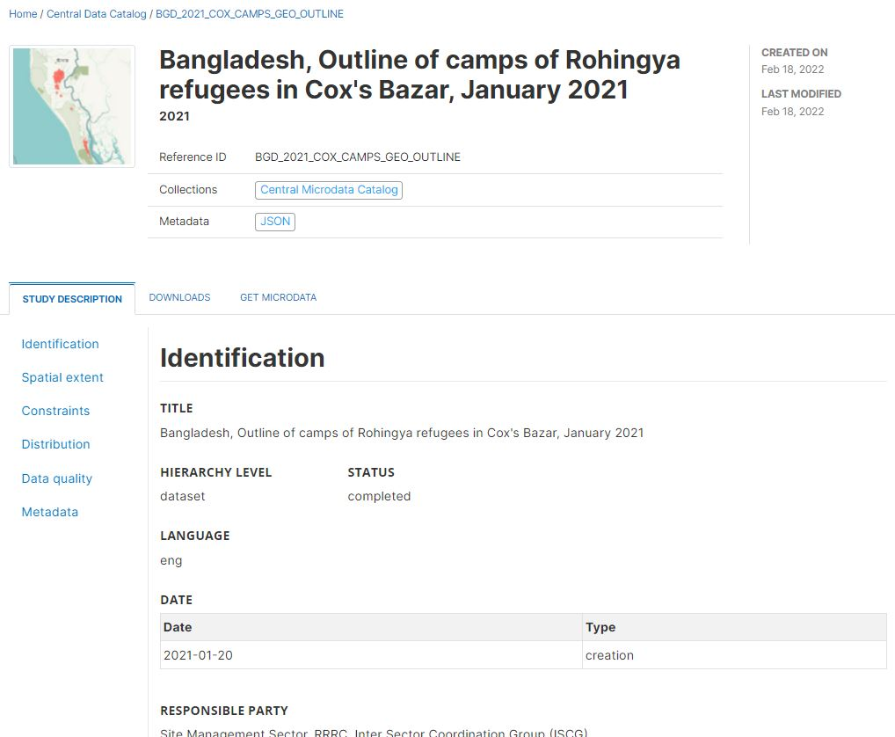{width=100%}
<br>


**Generating the metadata using Python**


### Example 2 (vector, CSV data): Syria Refugee Sites (OCHA)

The [Syria Refugee Sites](https://data.humdata.org/dataset/syria-refugee-sites) dataset used as a second example contains verified data about the geographic location (point geometry), name, and operational status of refugee sites hosting Syrian refugees in Turkey, Jordan, and Iraq. Only refugee sites operated by the United Nations High Commissioner for Refugees (UNHCR) or the Government of Turkey are included. Data are provided as CSV, TSV and XLSX files. This example demonstrates the use of the ISO 19115 standard.

----------
**Generating the metadata using R**
----------

```{r, eval=F, echo=T}

library(nadar)
library(sf)
library(sp)

# ----------------------------------------------------------------------------------
# Enter credentials (API confidential key) and catalog URL
my_keys <- read.csv("C:/confidential/my_API_keys.csv", header=F, stringsAsFactors=F)
set_api_key("my_keys[1,1")  
set_api_url("https://.../index.php/api/") 
set_api_verbose(FALSE)
# ----------------------------------------------------------------------------------

setwd("C:/my_geo_data/") 

options(stringsAsFactors = FALSE)

# Download and read the data file

url = "https://data.humdata.org/dataset/ff383a8b-396a-4d78-b403-687b0a783769/resource/cc3e9e48-e363-404e-948b-e42d13c316d9/download/syria_refugeesites_2016jan21_hiu_dos.csv"
data_file = basename(url)
if(!file.exists(data_file)) download.file(url, destfile = data_file, mode = "wb")

sf <- st_read(data_file)
sp <- as.data.frame(sf)
sp$Long <- as(sp$Long, "numeric")
sp$Lat  <- as(sp$Lat,  "numeric")
coordinates(sp) <- c("Long", "Lat")
proj4string(sp) <- CRS("+init=epsg:4326")

# Generate the metadata

id <- "EX2_SYR_REFUGEE_SITES"

my_geo_data <- list(
  
  metadata_information = list(
    title = "(Demo) Syria, Refugee Sites",
    producers = list(
      list(name = "NADA team")
    ),
    production_date = "2022-02-18"
  ),

  description = list(
    
    idno = id,
    
    language = "eng",
    
    characterSet = list(codeListValue = "utf8"),
    
    hierarchyLevel = list("dataset"),
    
    contact = list(
      list(
        organisationName = "U.S. Department of State - Humanitarian Information Unit",
        contactInfo = list(
          address = list(electronicEmailAddress = "HIU_DATA@state.gov"),
          onlineResource = list(linkage = "http://hiu.state.gov/", name = "Website")
        ),
        role = "pointOfContact"
      )
    ),
    
    dateStamp = "2018-06-18",
  
    metadataStandardName = "ISO 19115:2003/19139",
    
    spatialRepresentationInfo = list(
      list(
        vectorSpatialRepresentation = list(
          topologyLevel = "geometryOnly",
          geometricObjects = list(
            list(
              geometricObjectType = "point",
              geometricObjectCounty = nrow(sp)
            )
          )
        )
      )
    ),
    
    referenceSystemInfo = list(
      list(code = "4326", codeSpace = "EPSG")
    ),
    
    identificationInfo = list(
      
      list(

        citation = list(
          title = "Syria Refugee Sites",
          date = list(
            list(date = "2016-01-14", type = "creation"),
            list(date = "2016-02-04", type = "publication")
          ),
          identifier = list(authority = "IHSN", code = id),
          citedResponsibleParty = list(
            list(
              individualName = "Humanitarian Information Unit",
              organisationName = "U.S. Department of State - Humanitarian Information Unit",
              contactInfo = list(
                address = list(
                  electronicEmailAddress = "HIU_DATA@state.gov"
                ),
                onlineResource = list(
                  linkage = "http://hiu.state.gov/",
                  name = "Website"
                )
              ),
              role = "owner"
            )
          )
        ),
        
        abstract = "The 'Syria Refugee Sites' dataset is compiled by the U.S. Department of State, Humanitarian Information Unit (INR/GGI/HIU). This dataset contains open source derived data about the geographic location (point geometry), name, and operational status of refugee sites hosting Syrian refugees in Turkey, Jordan, and Iraq. Only refugee sites operated by the United Nations High Commissioner for Refugees (UNHCR) or the Government of Turkey are included. Compiled by the U.S Department of State, Humanitarian Information Unit (HIU), each attribute in the dataset (including name, location, and status) is verified against multiple sources. The name and status are obtained from UN and AFAD reporting and the UNHCR data portal (accessible at http://data.unhcr.org/syrianrefugees/regional.php). The locations are obtained from both the U.S. Department of State, PRM and the National Geospatial-Intelligence Agency's GEOnet Names Server (GNS) (accessible at http://geonames.nga.mil/ggmagaz/). The name and status for each refugee site is verified with PRM.  Locations are verified using high-resolution commercial satellite imagery and/or known areas of population. Additionally, all data is checked against various news sources. The data contained herein is entirely unclassified and is current as of 14 January 2016. The data is updated as needed.",

        purpose = "The 'Syria Refugee Sites' dataset contains verified data about the refugee sites hosting Syrian refugees in Turkey, Jordan, and Iraq. This file is compiled by the U.S Department of State, Humanitarian Information Unit (HIU) and is used in the production of the unclassified 'Syria: Numbers and Locations of Syrian Refugees' map product (accessible at https://hiu.state.gov/Pages/MiddleEast.aspx). The data contained herein is entirely unclassified and is current as of 14 January 2016.",

        credit = "U.S. Department of State - Humanitarian Information Unit",

        status = "onGoing",
        
        pointOfContact = list(
          list(
            individualName = "Humanitarian Information Unit",
            organisationName = "U.S. Department of State - Humanitarian Information Unit",
            contactInfo = list(
              address = list(electronicEmailAddress = "HIU_DATA@state.gov"),
              onlineResource = list(linkage = "http://hiu.state.gov/", name = "Website")
            ),
            role = "pointOfContact"
          )
        ),
        
        resourceMaintenance = list(
          list(maintenanceOrUpdateFrequency = "fortnightly")
        ),
        
        # graphicOverview = list(),
        
        resourceFormat = list(
          list(
            name = "text/csv",
            specification = "RFC4180 -  Common Format and MIME Type for Comma-Separated Values (CSV) Files"
          ),
          list(
            name = "text/tab-separated-values",
            specification = "Tab-Separated Values (CSV)"
          ),
          list(
            name = "xlsx",
            specification = "Microsoft Excel (XLSX)"
          )
        ),
        
        descriptiveKeywords = list(
          list(type = "theme", keyword = "Middle East"),
          list(type = "theme", keyword = "Refugees"),
          list(type = "theme", keyword = "Displacement"),
          list(type = "theme", keyword = "Refugee Camps"),
          list(type = "theme", keyword = "UNHCR"),
          list(type = "place", keyword = "Syria"),
          list(type = "place", keyword = "Turkey"),
          list(type = "place", keyword = "Lebanon"),
          list(type = "place", keyword = "Jordan"),
          list(type = "place", keyword = "Iraq"),
          list(type = "place", keyword = "Egypt")
        ),

        resourceConstraints = list(
          list(
            legalConstraints = list(
              uselimitation = list("License: Creative Commons Attribution 4.0 International License"),
              accessConstraints = list("unrestricted"),
              useConstraints = list("licenceUnrestricted")
            )
          ),
          list(
            securityConstraints = list(
              classification = "unclassified",
              handlingDescription = "All data contained herein are strictly unclassified with no restrictions on distribution. Accuracy of geographic data is not assured by the U.S. Department of State."
            )
          )
        ),
        
        extent = list(
          geographicElement = list(
            list(
              geographicBoundingBox = list(
                southBoundLatitude = bbox(sp)[2,1],
                westBoundLongitude = bbox(sp)[1,1],
                northBoundLatitude = bbox(sp)[2,2],
                eastBoundLongitude = bbox(sp)[1,2]
              )
            )
          )
        ),

        spatialRepresentationType = "vector",

        language = list("eng"),

        characterSet = list(
          list(codeListValue = "utf8")
        ),

        topicCategory = list("society")
      
      )  

    ),
    
    distributionInfo = list(
      
      distributionFormat = list(
        list(
          name = "text/csv", 
          specification = "RFC4180 -  Common Format and MIME Type for Comma-Separated Values (CSV) Files"
        ),
        list(
          name = "text/tab-separated-values", 
          specification = "Tab-Separated Values (CSV)"
        ),
        list(
          name = "xlsx", 
          specification = "Microsoft Excel (XLSX)"
        )
      ),
      
      distributor = list(
        list(
          individualName = "Humanitarian Information Unit",
          organisationName = "U.S. Department of State - Humanitarian Information Unit",
          contactInfo = list(
            address = list(electronicEmailAddress = "HIU_DATA@state.gov"),
            onlineResource = list(linkage = "http://hiu.state.gov/", name = "Website")
          ),
          role = "distributor"
        )
      ) #,
      
      # transferOptions = list(
      #   list(
      #     onLine = list(
      #       list(
      #         linkage = "https://data.humdata.org/dataset/syria-refugee-sites",
      #         name = "Source metadata (HTML View)",
      #         protocol = "WWW:LINK-1.0-http--link",
      #         "function" = "Information"
      #       ),
      #       list(
      #         linkage = "https://data.humdata.org/dataset/ff383a8b-396a-4d78-b403-687b0a783769/resource/cc3e9e48-e363-404e-948b-e42d13c316d9/download/syria_refugeesites_2016jan21_hiu_dos.csv",
      #         name = "syria_refugeesites_2016jan21_hiu_dos.csv",
      #         description = "Data download (CSV)",
      #         protocol = "WWW:LINK-1.0-http--link"
      #       ),
      #       list(
      #         linkage = "https://data.humdata.org/dataset/ff383a8b-396a-4d78-b403-687b0a783769/resource/42f7884c-f54d-478c-a970-623945740e5d/download/syria_refugeesites_2016jan21_hiu_dos.tsv",
      #         name = "syria_refugeesites_2016jan21_hiu_dos.tsv",
      #         description = "Data download (TSV)",
      #         protocol = "WWW:LINK-1.0-http--link"
      #       ),
      #       list(
      #         linkage = "https://data.humdata.org/dataset/ff383a8b-396a-4d78-b403-687b0a783769/resource/59660c9a-e41a-4d54-bfc2-dd8fd1032c97/download/syria_refugeesites_2016jan21_hiu_dos.xlsx",
      #         name = "syria_refugeesites_2016jan21_hiu_dos.xlsx",
      #         description = "Data download (TSV)",
      #         protocol = "WWW:LINK-1.0-http--link"
      #       )
      #     )
      #   )
      # )
      
    ),

    dataQualityInfo = list(
      list(
        scope = "dataset",
        lineage = list(
          statement = "Methodology: Compiled by the U.S Department of State, Humanitarian Information Unit (INR/GGI/HIU), each attribute in the dataset (including name, location, and status) is verified against multiple sources. The name and status are obtained from the UNHCR data portal (accessible at http://data.unhcr.org/syrianrefugees/regional.php). The locations are obtained from the U.S. Department of State, Bureau of Population, Refugees, and Migration (PRM) and the National Geospatial-Intelligence Agency's GEOnet Names Server (GNS) (accessible at http://geonames.nga.mil/ggmagaz/). The name and status for each refugee site is verified with PRM. Locations are verified using high-resolution commercial satellite imagery and/or known areas of population. Additionally, all data is checked against various news sources."
        )
      )
    ),

    metadataMaintenance = list(maintenanceAndUpdateFrequency = "fortnightly")
    
  )
  
)

# Publish in NADA catalog

geospatial_add(
  idno = id, 
  metadata = my_geo_data, 
  repositoryid = "central", 
  published = 1, 
  thumbnail = NULL, 
  overwrite = "yes"
)
```


----------
**Generating the metadata using Python**
----------


----------
**The result in NADA**
----------


### Example 3 (vector, with Feature Catalogue) - The GDIS (beta) dataset

This example demonstrates the use of the ISO 19115 (geographic dataset) and ISO 19110 (feature catalogue). Documenting features contained in datasets makes the metadata richer and more discoverable. It is recommended to provide such information, which can easily be extracted from shape files and others. The dataset used for the example is the [Geocoded Disasters (GDIS) Dataset, v1 (1960-2018)](https://beta.sedac.ciesin.columbia.edu/data/set/pend-gdis-1960-2018) 


```{r, eval=F, echo=T}

library(nadar)
library(sf)

# ----------------------------------------------------------------------------------
# Enter credentials (API confidential key) and catalog URL
my_keys <- read.csv("C:/confidential/my_API_keys.csv", header=F, stringsAsFactors=F)
set_api_key("my_keys[1,1")  
set_api_url("https://.../index.php/api/") 
set_api_verbose(FALSE)
# ----------------------------------------------------------------------------------

setwd("C:/my_geo_data/") 

thumb = "disaster.JPG"

# Load the dataset (2 Gb) to extract some information

load("pend-gdis-1960-2018-disasterlocations.rdata")
data = GDIS_disasterlocations
df = as.data.frame(GDIS_disasterlocations)
column_names = colnames(df)[!colnames(df) %in% c("geometry","centroid")]
exclude_listed_values_for = c("longitude", "latitude") #exclude ISO 19110 listed values for these columns

# Generate the metadata 

id <- "GDIS_TEST_01"

ttl = "Geocoded Disasters (GDIS) Dataset, v1 (1960–2018)"

my_geo_data <- list(
  
  metadata_information = list(
    title = ttl,
    idno = id,
    producers = list(
      list(name = "NADA team")
    ),
    production_date = "2022-02-18",
    version = "v1.0 2022-02"
  ),

  description = list(
  
    idno = id,
    language = "English",
    characterSet = list(
      codeListValue = "utf8",
      codeList = "http://standards.iso.org/iso/19139/resources/gmxCodelists.xml#MD_CharacterSetCode"
    ),
    hierarchyLevel = list("dataset"),
    contact = list(
      list(
        organisationName = "NASA Socioeconomic Data and Applications Center (SEDAC)",
        contactInfo = list(
          phone = list(
            voice = "+1 845-365-8920",
            facsimile = "+1 845-365-8922"
          ),
          address = list(
            deliveryPoint = "CIESIN, Columbia University, 61 Route 9W, P.O. Box 1000",
            city = "Palisades, NY",
            postalCode = "10964",
            electronicEmailAddress = "ciesin.info@ciesin.columbia.edu"
          )
        ),
        role = "pointOfContact"
      )
    ),
    dateStamp = "2021-03-10",
    metadataStandardName = "ISO 19115:2003/19139",
    dataSetURI = "https://beta.sedac.ciesin.columbia.edu/data/set/pend-gdis-1960-2018",
    
    spatialRepresentationInfo = list(
      list(
        vectorSpatialRepresentation = list(
          topologyLevel = "geometryOnly",
          geometricObjects = list(
            list(
              geometricObjectType = tolower(as.character(st_geometry_type(data)[1])),
              geometricObjectCounty = nrow(data)
            )
          )
        )
      )
    ),
    
    referenceSystemInfo = list(
      list(code = "4326", codeSpace = "EPSG")
    ),
    
    identificationInfo = list(
      list(
        citation = list(
          title = ttl,
          date = list(
            list(date = "2021-03-10", type = "publication")
          ),
          identifier = list(authority= "DOI", code = "10.7927/zz3b-8y61"),
          citedResponsibleParty = list(
            list(
              individualName = "Rosvold, E., and H. Buhaug",
              role = "owner"
            )
          ),
          edition = "1.00",
          presentationForm = list("raster", "map", "map service"),
          series = list(
            name = "Scientific Data",
            issueIdentification = "8:61"
          )
        ),
        abstract = "The Geocoded Disasters (GDIS) Dataset is a geocoded extension of a selection of natural disasters from the Centre for Research on the Epidemiology of Disasters' (CRED) Emergency Events Database (EM-DAT). The data set encompasses 39,953 locations for 9,924 disasters that occurred worldwide in the years 1960 to 2018. All floods, storms (typhoons, monsoons etc.), earthquakes, landslides, droughts, volcanic activity and extreme temperatures that were recorded in EM-DAT during these 58 years and could be geocoded are included in the data set. The highest spatial resolution in the data set corresponds to administrative level 3 (usually district/commune/village) in the Global Administrative Areas database (GADM, 2018). The vast majority of the locations are administrative level 1 (typically state/province/region).",
        purpose = "To provide the subnational location for different types of natural disasters recorded in EM-DAT between 1960-2018.",
        credit = "NASA Socioeconomic Data and Applications Center (SEDAC)",
        status = "completed",
        pointOfContact = list(
          list(
            organisationName = "NASA Socioeconomic Data and Applications Center (SEDAC)",
            contactInfo = list(
              phone = list(
                voice = "+1 845-365-8920",
                facsimile = "+1 845-365-8922"
              ),
              address = list(
                deliveryPoint = "CIESIN, Columbia University, 61 Route 9W, P.O. Box 1000",
                city = "Palisades, NY",
                postalCode = "10964",
                electronicEmailAddress = "ciesin.info@ciesin.columbia.edu"
              )
            ),
            role = "pointOfContact"
          )
        ),
        resourceMaintenance = list(
          list(maintenanceOrUpdateFrequency = "asNeeded")
        ),
        graphicOverview = list(
          list(
            fileName = "https://sedac.ciesin.columbia.edu/downloads/maps/pend/pend-gdis-1960-2018/sedac-logo.jpg", 
            fileDescription = "Geocoded Disasters (GDIS) Dataset", 
            fileType = "image/jpeg"
          )
        ),
        resourceFormat = list(
          list(
            name = "OpenFileGDB", 
            specification = "ESRI - GeoDatabase"
          ),
          list(
            name = "text/csv", 
            specification = "RFC4180 -  Common Format and MIME Type for Comma-Separated Values (CSV) Files"
          ),
          list(
            name = "application/geopackage+sqlite3", 
            specification = "http://www.geopackage.org/spec/"
          )
        ),
        descriptiveKeywords = list(
          list(type = "theme", keyword = "climatology"),
          list(type = "theme", keyword = "meteorology"),
          list(type = "theme", keyword = "atmosphere"),
          list(type = "theme", keyword = "earth science", 
               thesaurusName = "GCMD Science Keywords, Version 8.6"),
          list(type = "theme", keyword = "human dimension", 
               thesaurusName = "GCMD Science Keywords, Version 8.6"),
          list(type = "theme", keyword = "natural hazard", 
               thesaurusName = "GCMD Science Keywords, Version 8.6"),
          list(type = "theme", keyword = "drought", 
               thesaurusName = "GCMD Science Keywords, Version 8.6"),
          list(type = "theme", keyword = "earthquake", 
               thesaurusName = "GCMD Science Keywords, Version 8.6"),
          list(type = "theme", keyword = "flood", 
               thesaurusName = "GCMD Science Keywords, Version 8.6"),
          list(type = "theme", keyword = "landslides", 
               thesaurusName = "GCMD Science Keywords, Version 8.6"),
          list(type = "theme", keyword = "tropical cyclones", 
               thesaurusName = "GCMD Science Keywords, Version 8.6"),
          list(type = "theme", keyword = "cyclones", 
               thesaurusName = "GCMD Science Keywords, Version 8.6"),
          list(type = "theme", keyword = "volcanic eruption", 
               thesaurusName = "GCMD Science Keywords, Version 8.6")
        ),
        resourceConstraints = list(
          list(
            legalConstraints = list(
              uselimitation = list(
                "This work is licensed under the Creative Commons Attribution 4.0 International License (https://creativecommons.org/licenses/by/4.0). Users are free to use, copy, distribute, transmit, and adapt the work for commercial and non-commercial purposes, without restriction, as long as clear attribution of the source is provided.",
                "Recommended citation: Rosvold, E.L., Buhaug, H. GDIS, a global dataset of geocoded disaster locations. Scientific Data 8, 61 (2021). https://doi.org/10.1038/s41597-021-00846-6."
              ),
              accessConstraints = list("unrestricted"),
              useConstraints = list("licenceUnrestricted")
            )
          )
        ),
        extent = list(
          geographicElement = list(
            list(
              geographicBoundingBox = list(
                westBoundLongitude = -180,
                eastBoundLongitude = 180,
                southBoundLatitude = -58,
                northBoundLatitude = 90
              )
            )
          )#, 
          # temporalElement = list(
          #   list(
          #     extent = list(
          #       TimePeriod = list(
          #         beginPosition = "1960-01-01",
          #         endPosition = "2018-12-31"
          #       )
          #     )
          #   )
          # )
        ),
        spatialRepresentationType = "vector",
        language = list("eng"),
        characterSet = list(
          list(
            codeListValue = "utf8",
            codeList = "http://standards.iso.org/iso/19139/resources/gmxCodelists.xml#MD_CharacterSetCode"
          )
        )
      )
    ),
    
    distributionInfo = list(
      
      distributionFormat = list(
        list(name = "OpenFileGDB", 
             specification = "ESRI - GeoDatabase", 
             fileDecompressionTechnique = "Unzip"),
        list(name = "text/csv", 
             specification = "RFC4180 -  Common Format and MIME Type for Comma-Separated Values (CSV) Files", 
             fileDecompressionTechnique = "Unzip"),
        list(name = "application/geopackage+sqlite3", 
             specification = "http://www.geopackage.org/spec/", 
             fileDecompressionTechnique = "Unzip")
      ),
      
      distributor = list(
        list(
          organisationName = "NASA Socioeconomic Data and Applications Center (SEDAC)",
          contactInfo = list(
            phone = list(
              voice = "+1 845-365-8920",
              facsimile = "+1 845-365-8922"
            ),
            address = list(
              deliveryPoint = "CIESIN, Columbia University, 61 Route 9W, P.O. Box 1000",
              city = "Palisades, NY",
              postalCode = "10964",
              electronicEmailAddress = "ciesin.info@ciesin.columbia.edu"
            )
          ),
          role = "pointOfContact"
        )
      )#,
      
      # transferOptions = list(
      #   list(
      #     onLine = list(
      #       list(
      #         linkage = "https://beta.sedac.ciesin.columbia.edu/data/set/pend-gdis-1960-2018",
      #         name = "Source metadata (HTML View)",
      #         protocol = "WWW:LINK-1.0-http--link",
      #         "function" = "Information"
      #       ),
      #       list(
      #         linkage = "https://beta.sedac.ciesin.columbia.edu/downloads/data/pend/pend-gdis-1960-2018/pend-gdis-1960-2018-disasterlocations-gdb.zip",
      #         name = "pend-gdis-1960-2018-disasterlocations-gdb.zip",
      #         description = "Data download (Geodatabase)",
      #         protocol = "WWW:LINK-1.0-http--link"
      #       ),
      #       list(
      #         linkage = "https://beta.sedac.ciesin.columbia.edu/downloads/data/pend/pend-gdis-1960-2018/pend-gdis-1960-2018-disasterlocations-gpkg.zip",
      #         name = "pend-gdis-1960-2018-disasterlocations-gpkg.zip",
      #         description = "Data download (GeoPackage)",
      #         protocol = "WWW:LINK-1.0-http--link"
      #       ),
      #       list(
      #         linkage = "https://beta.sedac.ciesin.columbia.edu/downloads/data/pend/pend-gdis-1960-2018/pend-gdis-1960-2018-disasterlocations-csv.zip",
      #         name = "pend-gdis-1960-2018-disasterlocations-csv.zip",
      #         description="Data download (CSV)",
      #         protocol = "WWW:LINK-1.0-http--link"
      #       ),
      #       list(
      #         linkage = "https://beta.sedac.ciesin.columbia.edu/downloads/data/pend/pend-gdis-1960-2018/pend-gdis-1960-2018-priogrid-key-csv.zip",
      #         name = "pend-gdis-1960-2018-priogrid-key-csv.zip",
      #         description = "Data download (CSV)",
      #         protocol = "WWW:LINK-1.0-http--link"
      #       ),
      #       list(
      #         linkage = "https://beta.sedac.ciesin.columbia.edu/downloads/data/pend/pend-gdis-1960-2018/pend-gdis-1960-2018-disasterlocations-rdata.zip",
      #         name = "pend-gdis-1960-2018-disasterlocations-rdata.zip",
      #         description = "Data download (RData)",
      #         protocol = "WWW:LINK-1.0-http--link"
      #       ),
      #       list(
      #         linkage = "https://beta.sedac.ciesin.columbia.edu/downloads/data/pend/pend-gdis-1960-2018/pend-gdis-1960-2018-replicationcode-r.zip",
      #         name = "pend-gdis-1960-2018-replicationcode-r.zip",
      #         description = "Source code (R)",
      #         protocol = "WWW:LINK-1.0-http--link"
      #       ),
      #       list(
      #         linkage = "https://beta.sedac.ciesin.columbia.edu/downloads/data/pend/pend-gdis-1960-2018/pend-gdis-1960-2018-codebook.pdf",
      #         name = "pend-gdis-1960-2018-codebook.pdf",
      #         description = "Codebook (PDF)",
      #         protocol = "WWW:LINK-1.0-http--link"
      #       )
      #     )
      #   )
      # )
    ),
    
    dataQualityInfo = list(
      list(
        scope = "dataset",
        lineage = list(
          statement = "CIESIN follows procedures designed to ensure that data disseminated by CIESIN are of reasonable quality. If, despite these procedures, users encounter apparent errors or misstatements in the data, they should contact SEDAC User Services at +1 845-365-8920 or via email at ciesin.info@ciesin.columbia.edu. Neither CIESIN nor NASA verifies or guarantees the accuracy, reliability, or completeness of any data provided. CIESIN provides this data without warranty of any kind whatsoever, either expressed or implied. CIESIN shall not be liable for incidental, consequential, or special damages arising out of the use of any data provided by CIESIN."
        )
      )
    ),
    
    metadataMaintenance = list(
      maintenanceAndUpdateFrequency = "asNeeded"
    )
  
  ),

  # Feature catalog (ISO 19110/19139)
  
  feature_catalogue = list(
    name = sprintf("%s - Feature Catalogue", ttl),
    featureType = list(
      list(
        typeName =  ttl,
        definition = "Disaster locations",
        code = "pend-gdis-1960-2018-disasterlocations",
        isAbstract = FALSE,
        # carrierOfCharacteristics = lapply(column_names, function(column_name){
        #   print(column_name)
        #   values = unique(df[,column_name])
        #   values = values[order(values)]
        #   member = list(
        #     memberName = sprintf("Label for '%s'", column_name),
        #     definition = sprintf("Definition for '%s'", column_name),
        #     cardinality = list(lower = 1, upper = 1),
        #     code = column_name,
        #     valueType = switch(class(df[,column_name]), "character" = "xs:string", "integer" = "xs:int", "numeric" = "xs:decimal", "xs:string"),
        #     valueMeasurementUnit = NA,
        #     listedValue = if(column_name %in% exclude_listed_values_for) {list()} else {lapply(values, function(x){ list(label = sprintf("Label for '%s'", x), code = x, definition = sprintf("Definition for '%s'", x)) })}
        #   )
        #   return(member)
        # })
        carrierOfCharacteristics = list(
          list(
            memberName = 'id',
            definition = 'ID-variable identifying each disaster in the geocoded dataset. Contrary to disasterno each disaster in each country has a unique id number',
            cardinality = list(lower = 1, upper = 1),
            code = 'DFA01', # short for Disaster Feature Attribute 01
            valueType = switch(class(df[,'id']), "character" = "xs:string", "integer" = "xs:int", "numeric" = "xs:decimal", "xs:string"),
            valueMeasurementUnit = 'NA'
          ),
          list(
            memberName = 'country',
            definition = 'Name of the country within which the location is',
            cardinality = list(lower = 1, upper = 1),
            code = 'DFA02',
            valueType = switch(class(df[,'country']), "character" = "xs:string", "integer" = "xs:int", "numeric" = "xs:decimal", "xs:string"),
            valueMeasurementUnit = 'NA'
          ),
          list(
            memberName = 'iso3',
            definition = 'Three-letter country code, ISO 3166-1',
            cardinality = list(lower = 1, upper = 1),
            code = 'DFA03',
            valueType = switch(class(df[,'iso3']), "character" = "xs:string", "integer" = "xs:int", "numeric" = "xs:decimal", "xs:string"),
            valueMeasurementUnit = 'NA'
          ),
          list(
            memberName = 'gwno',
            definition = 'Gledistsch and Ward country code (Gleditsch & Ward, 1999)',
            cardinality = list(lower = 1, upper = 1),
            code = 'DFA04',
            valueType = switch(class(df[,'gwno']), "character" = "xs:string", "integer" = "xs:int", "numeric" = "xs:decimal", "xs:string"),
            valueMeasurementUnit = 'NA'
          ),
          list(
            memberName = 'geo_id',
            definition = 'Unique ID-variable for each location',
            cardinality = list(lower = 1, upper = 1),
            code = 'DFA05',
            valueType = switch(class(df[,'geo_id']), "character" = "xs:string", "integer" = "xs:int", "numeric" = "xs:decimal", "xs:string"),
            valueMeasurementUnit = 'NA'
          ),
          list(
            memberName = 'geolocation',
            definition = 'Name of the location of the observation, which corresponds to the highest (most disaggregated) level available. For instance, observations at the third administrative level will have geolocation values identical to the adm3 variable',
            cardinality = list(lower = 1, upper = 1),
            code = 'DFA06',
            valueType = switch(class(df[,'geolocation']), "character" = "xs:string", "integer" = "xs:int", "numeric" = "xs:decimal", "xs:string"),
            valueMeasurementUnit = 'NA'
          ),
          list(
            memberName = 'level',
            definition = 'The administrative level of the observation, ranges from 1-3 where 3 is the most disaggregated',
            cardinality = list(lower = 1, upper = 1),
            code = 'DFA07',
            valueType = switch(class(df[,'level']), "character" = "xs:string", "integer" = "xs:int", "numeric" = "xs:decimal", "xs:string"),
            valueMeasurementUnit = 'NA'
          ),
          list(
            memberName = 'adm1',
            definition = 'Name of administrative level 1 for the given location',
            cardinality = list(lower = 1, upper = 1),
            code = 'DFA08',
            valueType = switch(class(df[,'adm1']), "character" = "xs:string", "integer" = "xs:int", "numeric" = "xs:decimal", "xs:string"),
            valueMeasurementUnit = 'NA'
          ),
          list(
            memberName = 'adm2',
            definition = 'Name of administrative level 2 for the given location',
            cardinality = list(lower = 1, upper = 1),
            code = 'DFA09',
            valueType = switch(class(df[,'adm2']), "character" = "xs:string", "integer" = "xs:int", "numeric" = "xs:decimal", "xs:string"),
            valueMeasurementUnit = 'NA'
          ),
          list(
            memberName = 'location',
            definition = 'Name of administrative level 3 for the given location',
            cardinality = list(lower = 1, upper = 1),
            code = 'DFA10',
            valueType = switch(class(df[,'location']), "character" = "xs:string", "integer" = "xs:int", "numeric" = "xs:decimal", "xs:string"),
            valueMeasurementUnit = 'NA'
          ),
          list(
            memberName = 'historical',
            definition = 'Marks whether the disaster happened in a country that has since changed, takes the value 1 if the disaster happened in a country that has since changed, and 0 if not',
            cardinality = list(lower = 1, upper = 1),
            code = 'DFA11',
            valueType = switch(class(df[,'historical']), "character" = "xs:string", "integer" = "xs:int", "numeric" = "xs:decimal", "xs:string"),
            valueMeasurementUnit = 'NA'
          ),
          list(
            memberName = 'hist_country',
            definition = 'Name of country at the time of the disaster, if the observation takes the value 1 on the historical variable, this is different from the country variable',
            cardinality = list(lower = 1, upper = 1),
            code = 'DFA12',
            valueType = switch(class(df[,'hist_country']), "character" = "xs:string", "integer" = "xs:int", "numeric" = "xs:decimal", "xs:string"),
            valueMeasurementUnit = 'NA'
          ),
          list(
            memberName = 'disastertype',
            definition = 'Type of disaster as defined by EM-DAT (Guha-Sapir et al., 2014): flood, storm, earthquake, extreme temperature, landslide, volcanic activity, drought or mass movement (dry)',
            cardinality = list(lower = 1, upper = 1),
            code = 'DFA13',
            valueType = switch(class(df[,'disastertype']), "character" = "xs:string", "integer" = "xs:int", "numeric" = "xs:decimal", "xs:string"),
            valueMeasurementUnit = 'NA',
            listedValue = list(
              list(
                label = 'flood',
                code = 'flood',
                definition = 'A general term for the overflow of water from a stream channel onto normally dry land in the floodplain (riverine flooding), higher-than-normal levels along the coast and in lakes or reservoirs (coastal flooding) as well as ponding of water at or near the point where the rain fell (flash floods).'
              ),
              list(
                label = 'storm',
                code = 'storm',
                definition = 'A type of meteorological hazard generated by the heating of air and the availability of moist and unstable air masses. Convective storms range from localized thunderstorms (with heavy rain and/or hail, lightning, high winds, tornadoes) to meso-scale, multi-day events.'
              ),
              list(
                label = 'earthquake',
                code = 'earthquake',
                definition = 'Sudden movement of a block of the Earth’s crust along a geological fault and associated ground shaking.'
              ),
              list(
                label = 'extreme temperature',
                code = 'extreme temperature',
                definition = 'A general term for temperature variations above (extreme heat) or below (extreme cold) normal conditions.'
              ),
              list(
                label = 'landslide',
                code = 'landslide',
                definition = 'Independent of the presence of water, mass movement may also be triggered by earthquakes.'
              ),
              list(
                label = 'volcanic activity',
                code = 'volcanic activity',
                definition = 'A type of volcanic event near an opening/vent in the Earth’s surface including volcanic eruptions of lava, ash, hot vapor, gas, and pyroclastic material.'
              ),
              list(
                label = 'drought',
                code = 'drought',
                definition = 'An extended period of unusually low precipitation that produces a shortage of water for people, animals, and plants. Drought is different from most other hazards in that it develops slowly, sometimes even over years, and its onset is generally difficult to detect. Drought is not solely a physical phenomenon because its impacts can be exacerbated by human activities and water supply demands. Drought is therefore often defined both conceptually and operationally. Operational definitions of drought, meaning the degree of precipitation reduction that constitutes a drought, vary by locality, climate and environmental sector.'
              ),
              list(
                label = 'mass movement (dry)',
                code = 'mass movement (dry)',
                definition = 'Any type of downslope movement of earth materials.'
              )
            )
          ),
          list(
            memberName = 'disasterno',
            definition = 'ID-variable from EM-DAT (Guha-Sapir et al., 2014), use this to join the geocoded data with EM-DAT records in order to obtain information on the specific disasters',
            cardinality = list(lower = 1, upper = 1),
            code = 'DFA14',
            valueType = switch(class(df[,'disasterno']), "character" = "xs:string", "integer" = "xs:int", "numeric" = "xs:decimal", "xs:string"),
            valueMeasurementUnit = 'NA'
          )
        
        )
      )
    )
  )
)

# Publish in NADA catalog

geospatial_add(
  idno = id, 
  metadata = my_geo_data, 
  repositoryid = "central", 
  published = 1, 
  thumbnail = thumb, 
  overwrite = "yes")

# Add links as external resources

external_resources_add(
  idno = id,
  dctype = "web",
  title = "Website: Geocoded Disasters (GDIS) Dataset, v1 (1960–2018)",
  file_path = "https://beta.sedac.ciesin.columbia.edu/data/set/pend-gdis-1960-2018",
  overwrite = "yes"
)

```


### Example 4 (raster): Spatial distribution of the Ethiopian population in 2020 

This fourth example makes use of elements from the ISO 19115 to document a dataset generated by the WorldPop program using data from multiple sources and machine learning models. "WorldPop develops peer-reviewed research and methods for the construction of open and high-resolution geospatial data on population distributions, demographic and dynamics, with a focus on low and middle income countries." As of March 1st, 2021 WorldPop was publishing over 44,600 datasets on its website. See https://www.worldpop.org/project/categories?id=3.

<center>
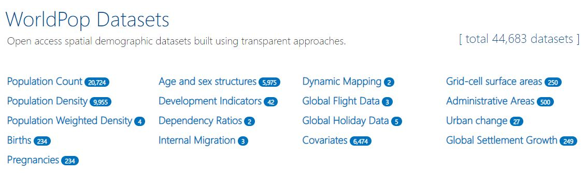{width=100%}
</center>

The selected example represents the spatial distribution of the Ethiopian population in 2020.  

<center>
{width=60%}
</center>


----------
**Generating the metadata using R**
----------

```{r, eval=F, echo=T}

library(nadar)
library(raster)

# ----------------------------------------------------------------------------------
# Enter credentials (API confidential key) and catalog URL
my_keys <- read.csv("C:/confidential/my_API_keys.csv", header=F, stringsAsFactors=F)
set_api_key("my_keys[1,1")  
set_api_url("https://.../index.php/api/") 
set_api_verbose(FALSE)
# ----------------------------------------------------------------------------------

setwd("C:/my_geo_data/") 

# Download and read the dataset 

url = "https://data.worldpop.org/GIS/Population/Global_2000_2020_Constrained/2020/maxar_v1/ETH/eth_ppp_2020_constrained.tif"
filename = basename(url)
if(!file.exists(filename)) download.file(url, destfile = filename, mode = "wb")
ras <- raster("eth_ppp_2020_constrained.tif")

id <- "WP_ETH_POP"
thumb <- "ethiopia_pop.JPG"

# Generate the metadata

my_geo_data <- list(
  
  metadata_information = list(
    title = "(Demo) Ethiopia Gridded Population 2020 (WorldPop)",
    producers = list(list(name = "NADA team")),
    production_date = "2022-02-18"
  ),
  
  description = list(
    
    idno = id,
    language = "eng",
    characterSet = list(codeListValue = "utf8"),
    hierarchyLevel = list("dataset"),
    contact = list(
      list(organisationName = "World Pop - School of Geography and Environmental Science, University of Southampton",
           contactInfo = list(
             onlineResource = list(
               linkage = "https://www.worldpop.org/", name = "Website"
             )
           ),
           role = "pointOfContact"
      )
    ),
    
    dateStamp = "2020-09-20",
    metadataStandardName = "ISO 19115:2003/19139",
    
    spatialRepresentationInfo = list(
      
      list(
        gridSpatialRepresentationInfo = list(
          numberOfDimensions = 2L,
          axisDimensionproperties = list(
            list(
              dimensionName = "row", dimensionSize = dim(ras)[1]
            ),
            list(
              dimensionName = "column", dimensionSize = dim(ras)[2]
            )
          ),
          cellGeometry = "area"
        )
      )
      
    ),
    
    referenceSystemInfo = list(
      list(code = "4326", codeSpace = "EPSG")
    ),
    
    identificationInfo = list(
      
      list(
        
        citation = list(
          title = "Ethiopia population 2020",
          alternateTitle = "Estimated total number of people per grid-cell at a resolution of 3 arc-seconds (approximately 100m at the equator)",
          date=list(
            list(date = "2020-09-12", type = "creation")
          ),
          identifier = list(authority = "DOI", code = id),
          citedResponsibleParty = list(
            list(
              organisationName = "World Pop - School of Geography and Environmental Science, University of Southampton",
              contactInfo = list(
                onlineResource = list(
                  linkage = "https://www.worldpop.org/",
                  name = "Website"
                )
              ),
              role = "owner"
            )
          )
        ),

        abstract = "The spatial distribution of population in 2020, Ethiopia",
        
        credit = "World Pop - School of Geography and Environmental Science, University of Southampton",
        
        status = "completed",
        
        pointOfContact = list(
          list(
            organisationName = "World Pop - School of Geography and Environmental Science, University of Southampton",
            contactInfo = list(
              onlineResource = list(
                linkage = "https://www.worldpop.org/",
                name = "Website"
              )
            ),
            role = "pointOfContact"
          )
        ),
        
        resourceMaintenance = list(
          list(maintenanceOrUpdateFrequency = "notPlanned")
        ),
        
        graphicOverview = list(
          list(fileName = thumb, fileDescription = "Ethiopia population 2020")
        ),
        
        resourceFormat = list(
          list(name = "image/tiff", specification = "GeoTIFF")
        ),
        
        descriptiveKeywords = list(
          list(type = "theme", keyword = "population density"),
          list(type = "theme", keyword = "gridded population"),
          list(type = "place", keyword = "Ethiopia")
        ),	
        
        resourceConstraints = list(
          list(
            legalConstraints = list(
              accessConstraints = list("unrestricted"),
              useConstraints = list("licenceUnrestricted"),
              uselimitation = list(
                "License: Creative Commons Attribution 4.0 International License",
                "Recommended citation: Bondarenko M., Kerr D., Sorichetta A., and Tatem, A.J. 2020. Census/projection-disaggregated gridded population datasets for 51 countries across sub-Saharan Africa in 2020 using building footprints. WorldPop, University of Southampton, UK. doi:10.5258/SOTON/WP00682"
              )
            )
          )
        ),
        
        extent = list(
          geographicElement = list(
            list(
              geographicBoundingBox = list(
                southBoundLatitude = bbox(ras)[2,1],
                westBoundLongitude = bbox(ras)[1,1],
                northBoundLatitude = bbox(ras)[2,2],
                eastBoundLongitude = bbox(ras)[1,2]
              )
            )
          )
        ),
        
        spatialRepresentationType = "grid",
        
        #spatialResolution = list(value = 3, uom = "arc_second"),
        
        language = list("eng"),
        
        characterSet = list(
          list(codeListValue = "utf8")
        ),
        
        topicCategory = list("society"),

        supplementalInformation = "References:
          - Stevens FR, Gaughan AE, Linard C, Tatem AJ (2015) Disaggregating Census Data for Population Mapping Using Random Forests with Remotely-Sensed and Ancillary Data. PLoS ONE 10(2): e0107042. https://doi.org/10.1371/journal.pone.0107042
          - WorldPop (www.worldpop.org - School of Geography and Environmental Science, University of Southampton; Department of Geography and Geosciences, University of Louisville; Departement de Geographie, Universite de Namur) and Center for International Earth Science Information Network (CIESIN), Columbia University (2018). Global High Resolution Population Denominators Project - Funded by The Bill and Melinda Gates Foundation (OPP1134076).
          - Dooley, C. A., Boo, G., Leasure, D.R. and Tatem, A.J. 2020. Gridded maps of building patterns throughout sub-Saharan Africa, version 1.1. University of Southampton: Southampton, UK. Source of building footprints \"Ecopia Vector Maps Powered by Maxar Satellite Imagery\"© 2020. doi:10.5258/SOTON/WP00677
          - Bondarenko M., Nieves J. J., Stevens F. R., Gaughan A. E., Tatem A. and Sorichetta A. 2020. wpgpRFPMS: Random Forests population modelling R scripts, version 0.1.0. University of Southampton: Southampton, UK. https://dx.doi.org/10.5258/SOTON/WP00665
          - Ecopia.AI and Maxar Technologies. 2020. Digitize Africa data. http://digitizeafrica.ai"
    
      )  
    ),
    
    distributionInfo = list(
      
      distributionFormat = list(
        list(name = "image/tiff", specification = "GeoTIFF")
      ),
      distributor = list(
        list(
          organisationName = "World Pop - School of Geography and Environmental Science, University of Southampton",
          contactInfo = list(
            onlineResource = list(
              linkage = "https://www.worldpop.org/",
              name = "Website"
            )
          ),
          role = "distributor"
        )
      )#,
      
      # transferOptions = list(    @@@ Use DC external resources?
      #   list(
      #     onLine = list(
      #       list(
      #         linkage = "https://www.worldpop.org/geodata/summary?id=49635",
      #         name = "Source metadata (HTML View)",
      #         protocol = "WWW:LINK-1.0-http--link"
      #       ),
      #       list(
      #         linkage = "https://www.worldpop.org/ajax/pdf/summary?id=49635",
      #         name = "Source metadata (PDF)",
      #         protocol = "WWW:LINK-1.0-http--link"
      #       ),
      #       list(
      #         linkage = "https://data.worldpop.org/GIS/Population/Global_2000_2020_Constrained/2020/maxar_v1/ETH/eth_ppp_2020_constrained.tif",
      #         name = "eth_ppp_2020_constrained.tif",
      #         description = "Data download (GeoTIFF)",
      #         protocol = "WWW:LINK-1.0-http--link"
      #       )
      #     )
      #   )
      # )
      
    ),
    
    dataQualityInfo = list(
      
      list(
        scope = "dataset", 
        lineage = list(
          statement = "Data management workflow",
          processStep = list(
            list(
              description = "This dataset was produced based on the 2020 population census/projection-based estimates for 2020 (information and sources of the input population data can be found here). Building footprints were provided by the Digitize Africa project of Ecopia.AI and Maxar Technologies (2020) and gridded building patterns derived from the datasets produced by Dooley et al. 2020. Geospatial covariates representing factors related to population distribution, were obtained from the \"Global High Resolution Population Denominators Project\" (OPP1134076)",
              rationale = "Source data acquisition"
            ),
            list(
              description = "The mapping approach is the Random Forests-based dasymetric redistribution developed by Stevens et al. (2015). The disaggregation was done by Maksym Bondarenko (WorldPop) and David Kerr (WorldPop), using the Random Forests population modelling R scripts (Bondarenko et al., 2020), with oversight from Alessandro Sorichetta (WorldPop).",
              rationale = "Mapping"
            )
          )
        )
      )
      
    ),
    
    metadataMaintenance = list(maintenanceAndUpdateFrequency = "notPlanned")
    
  )
  
)

# Publish the metadata in a NADA catalog

geospatial_add(
  idno = id, 
  metadata = my_geo_data, 
  repositoryid = "central", 
  published = 1, 
  thumbnail = thumb, 
  overwrite = "yes"
)

# Add a link to WorldPop website as an external resource

external_resources_add(
  idno = id,
  dctype = "web",
  title = "WorldPop website",
  file_path = "https://www.worldpop.org/",
  overwrite = "yes"
)

```

----------
**Generating the metadata using Python**
----------


----------
**The result in NADA**
----------


### Example 5 (service): The United Nations Geospatial website

The previous four examples documented geographic datasets (ISO 19115). In this fourth example, we document a **geographic service** using elements from the ISO 19119 standard. The service described in this example is the [United Nations Clear Map application](https://geoservices.un.org/Html5Viewer/index.html?viewer=clearmap) from [United Nations Geospatial](https://www.un.org/geospatial/).

<center>
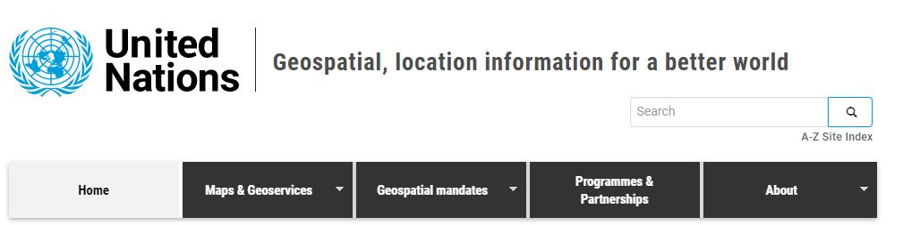{width=100%}
</center>

----------
**Generating the metadata using R**
----------

```{r, eval=F, echo=T}

library(nadar)

# ----------------------------------------------------------------------------------
# Enter credentials (API confidential key) and catalog URL
my_keys <- read.csv("C:/confidential/my_API_keys.csv", header=F, stringsAsFactors=F)
set_api_key("my_keys[1,1")  
set_api_url("https://.../index.php/api/") 
set_api_verbose(FALSE)
# ----------------------------------------------------------------------------------

setwd("C:/my_geo_data/") 

thumb = "un_clear_map.JPG"

id = "UN_GEO_CLEAR-MAP"

my_geo_service <- list(
  
  metadata_information = list(
    idno = id,
    title = "United Nations Geospatial, Clear Map",
    producers = list(
      list(name = "NADA team")
    ),
    production_date = "2022-02-18",
    version = "v1.0 2022-02"
  ),
  
  description = list(
    
    idno = id,
    language = "eng",
    characterSet = list(codeListValue = "utf8"),
    hierarchyLevel = list("service"),
    contact = list(
      list(
        organisationName = "United Nations Geospatial",
        contactInfo = list(
          address = list(
            electronicEmailAddress = "gis@un.org"
          ),
          onlineResource = list(
            linkage = "https://www.un.org/geospatial",
            name = "Website"
          )
        ),
        role = "owner"
      )
    ),
    dateStamp = "2022-02-22",
    metadataStandardName = "ISO 19119:2005/19139",
    
    referenceSystemInfo = list(
      list(code = "3857", codeSpace = "EPSG")
    ),
    
    identificationInfo = list(
      
      list(
        citation = list(
          title = "United Nations Clear Map - OGC Web Map Service",
          date = list(
            list(date = "2019-08-19", type = "creation"),
            list(date = "2020-03-19", type ="lastUpdate")
          ),
          citedResponsibleParty = list(
            list(
              organisationName = "United Nations Geospatial",
              contactInfo = list(
                address = list(electronicEmailAddress = "gis@un.org"),
                onlineResource = list(
                  linkage = "https://www.un.org/geospatial",
                  name = "Website"
                )
              ),
              role = "owner"
            )
          )
        ),
        
        abstract = "The United Nations Clear Map (hereinafter 'Clear Map') is a background reference web mapping service produced to facilitate 'the issuance of any map at any duty station, including dissemination via public electronic networks such as Internet' and 'to ensure that maps meet publication standards and that they are not in contravention of existing United Nations policies' in accordance with the in the Administrative Instruction on 'Regulations for the Control and Limitation of Documentation - Guidelines for the Publication of Maps' of 20 January 1997 (http://undocs.org/ST/AI/189/Add.25/Rev.1).",
        purpose = "Clear Map is created for the use of the United Nations Secretariat and community.  All departments, offices and regional commissions of the United Nations Secretariat including offices away from Headquarters using Clear Map remain bound to the instructions as contained in the Administrative Instruction and should therefore seek clearance from the UN Geospatial Information Section (formerly Cartographic Section) prior to the issuance of their thematic maps using Clear Map as background reference.",
        credit = "Produced by: United Nations Geospatial Contributor: UNGIS, UNGSC, Field Missions CONTACT US: Feedback is appreciated and should be sent directly to: Email:Clearmap@un.org / gis@un.org (UNCLASSIFIED) (c) UNITED NATIONS 2018",
        status = "onGoing",
        
        pointOfContact = list(
          list(
            organisationName = "United Nations Geospatial",
            contactInfo = list(
              address = list(electronicEmailAddress = "gis@un.org"),
              onlineResource = list(linkage = "https://www.un.org/geospatial", name = "Website")
            ),
            role = "pointOfContact"
          )
        ),
        
        resourceMaintenance = list(
          list(maintenanceOrUpdateFrequency = "asNeeded")
        ),
        
        graphicOverview = list(
          list(
            fileName = "https://geoportal.dfs.un.org/arcgis/sharing/rest/content/items/6f4eb9e136ee43758a62f587ceb0da01/info/thumbnail/thumbnail1567157577600.png",
            fileDescription = "Service overview",
            fileType = "image/png"
          )
        ),
        
        resourceFormat = list(
          list(name = "PNG32"),
          list(name = "PNG24"),
          list(name = "PNG"),
          list(name = "JPG"),
          list(name = "DIB"),
          list(name = "TIFF"),
          list(name = "EMF"),
          list(name = "PS"),
          list(name = "PDF"),
          list(name = "GIF"),
          list(name = "SVG"),
          list(name = "SVGZ"),
          list(name = "BMP")
        ),
        
        descriptiveKeywords = list(
          list(type = "theme", keyword = "wms"),
          list(type = "theme", keyword = "united nations"),
          list(type = "theme", keyword = "global boundaries"),
          list(type = "theme", keyword = "ocean coastline"),
          list(type = "theme", keyword = "authoritative")
        ),	
        
        resourceConstraints = list(
          list(
            legalConstraints = list(
              uselimitation = list("The designations employed and the presentation of material on this map do not imply the expression of any opinion whatsoever on the part of the Secretariat of the United Nations concerning the legal status of any country, territory, city or area or of its authorities, or concerning the delimitation of its frontiers or boundaries.
                Final boundary between the Republic of Sudan and the Republic of South Sudan has not yet been determined.
                Final status of the Abyei area is not yet determined.
                * Dotted line represents approximately the Line of Control in Jammu and Kashmir agreed upon by India and Pakistan. The final status of Jammu and Kashmir has not yet been agreed upon by the parties.
                ** Chagos Archipelago appears without prejudice to the question of sovereignty.
                *** A dispute exists between the Governments of Argentina and the United Kingdom of Great Britain and Northern Ireland concerning sovereignty over the Falkland Islands (Malvinas)."),
              accessConstraints = list("unrestricted"),
              useConstraints = list("licenceUnrestricted")
            )
          )
        ),
        
        extent = list(
          geographicElement = list(
            list(
              geographicBoundingBox = list(
                southBoundLongitude = -1.4000299034940418,
                westBoundLongitude  = -1.40477223188626,
                northBoundLongitude =  2.149247026187029,
                eastBoundLongitude  =  1.367128649366541
              )
            )
          )
        ),
        
        topicCategory = list("boundaries", "oceans"),
        
        serviceIdentification = list(
          serviceType = "OGC:WMS",
          serviceTypeVersion = "1.1.0"
        )
      )
    ),
    
    distributionInfo = list(
      
      distributionFormat = list(
        list(name = "PNG32"),
        list(name = "PNG24"),
        list(name = "PNG"),
        list(name = "JPG"),
        list(name = "DIB"),
        list(name = "TIFF"),
        list(name = "EMF"),
        list(name = "PS"),
        list(name = "PDF"),
        list(name = "GIF"),
        list(name = "SVG"),
        list(name = "SVGZ"),
        list(name = "BMP")
      ),
      
      distributor = list(
        list(
          organisationName = "United Nations Geospatial",
          contactInfo = list(
            address = list(electronicEmailAddress = "gis@un.org"),
            onlineResource = list(
              linkage = "https://www.un.org/geospatial",
              name = "Website"
            )
          ),
          role = "owner"
        )
      )
      #,
      
      # transferOptions = list(
      #   list(
      #     onLine = list(
      #       list(
      #         linkage = "https://geoportal.dfs.un.org/arcgis/home/item.html?id=541557fd0d4d42efb24449be614e6887",
      #         name = "Original metadata",
      #         description = "Original metadata from UN ClearMap portal",
      #         protocol = "WWW:LINK-1.0-http--link"
      #       ),
      #       list(
      #         linkage = "https://geoportal.dfs.un.org/arcgis/sharing/rest/content/items/541557fd0d4d42efb24449be614e6887/data",
      #         name = "UN ClearMap WMS map service user guide",
      #         description = "How to import and use WMS services of the UN Clear map",
      #         protocol = "WWW:LINK-1.0-http--link"
      #       ),
      #       list(
      #         linkage = "https://geoservices.un.org/arcgis/rest/services/ClearMap_Dark/MapServer?service=WMS",
      #         name = "ClearMap_Dark",
      #         description = "ClearMap Dark WMS",
      #         protocol = "OGC:WMS-1.1.0-http-get-map"
      #       ),
      #       list(
      #         linkage = "https://geoservices.un.org/arcgis/rest/services/ClearMap_Gray/MapServer?service=WMS",
      #         name = "ClearMap_Gray",
      #         description = "ClearMap Gray WMS",
      #         protocol = "OGC:WMS-1.1.0-http-get-map"
      #       ),
      #       list(
      #         linkage = "https://geoservices.un.org/arcgis/rest/services/ClearMap_Imagery/MapServer?service=WMS",
      #         name = "ClearMap_Imagery",
      #         description = "ClearMap Imagery WMS",
      #         protocol = "OGC:WMS-1.1.0-http-get-map"
      #       ),
      #       list(
      #         linkage = "https://geoservices.un.org/arcgis/rest/services/ClearMap_Plain/MapServer?service=WMS",
      #         name = "ClearMap_Plain",
      #         description = "ClearMap Plain WMS",
      #         protocol = "OGC:WMS-1.1.0-http-get-map"
      #       ),
      #       list(
      #         linkage = "https://geoservices.un.org/arcgis/rest/services/ClearMap_Topo/MapServer?service=WMS",
      #         name = "ClearMap_Topo",
      #         description = "ClearMap Topo WMS",
      #         protocol = "OGC:WMS-1.1.0-http-get-map"
      #       ),
      #       list(
      #         linkage = "https://geoservices.un.org/arcgis/rest/services/ClearMap_WebDark/MapServer?service=WMS",
      #         name = "ClearMap_WebDark",
      #         description = "ClearMap WebDark WMS",
      #         protocol = "OGC:WMS-1.1.0-http-get-map"
      #       ),
      #       list(
      #         linkage = "https://geoservices.un.org/arcgis/rest/services/ClearMap_WebGray/MapServer?service=WMS",
      #         name = "ClearMap_WebGray",
      #         description = "ClearMap WebGray WMS",
      #         protocol = "OGC:WMS-1.1.0-http-get-map"
      #       ),
      #       list(
      #         linkage = "https://geoservices.un.org/arcgis/rest/services/ClearMap_WebPlain/MapServer?service=WMS",
      #         name = "ClearMap_WebPlain",
      #         description = "ClearMap WebPlain WMS",
      #         protocol = "OGC:WMS-1.1.0-http-get-map"
      #       ),
      #       list(
      #         linkage = "https://geoservices.un.org/arcgis/rest/services/ClearMap_WebTopo/MapServer?service=WMS",
      #         name = "ClearMap_WebTopo",
      #         description = "ClearMap WebTopo WMS",
      #         protocol = "OGC:WMS-1.1.0-http-get-map"
      #       )
      #     )
      #   )
      # )
      
    ),
  
    metadataMaintenance = list(maintenanceAndUpdateFrequency = "asNeeded")
  
  )  
  
)

# Publish in a NADA catalog 

geospatial_add(
  idno = id, 
  metadata = my_geo_service, 
  repositoryid = "central", 
  published = 1, 
  thumbnail = thumb, 
  overwrite = "yes"
)

# Add links as external resources

external_resources_add(
  title = "United Nations Clear Map application",
  idno = id,
  dctype = "web",
  file_path = "https://www.un.org/geospatial/",
  overwrite = "yes"
)

external_resources_add(
  title = "United Nations Geospatial website",
  idno = id,
  dctype = "web",
  file_path = "https://geoservices.un.org/Html5Viewer/index.html?viewer=clearmap",
  overwrite = "yes"
)

```


----------
**Generating the metadata using Python**
----------

[to do]

----------
**The result in NADA**
----------


## Useful tools  

The ISO standard is complex and contains many nested elements. Using R or Python to generate the metadata is a convenient and powerful option, although it requires much attention to avoid errors. The [geometa R package](https://cran.r-project.org/web/packages/geometa/index.html) can be used to facilitate the process of documenting datasets using R.

Using a specialized metadata editor to generate the ISO-compliant metadata is a good alternative for those who have limited expertise in R or Python. The [GeoNetwork editor](https://geonetwork-opensource.org/) provides such a solution.   

