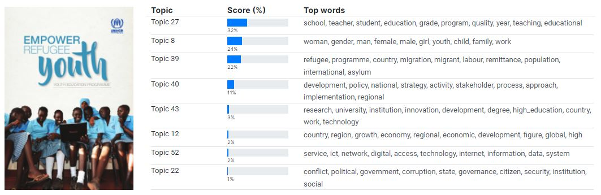
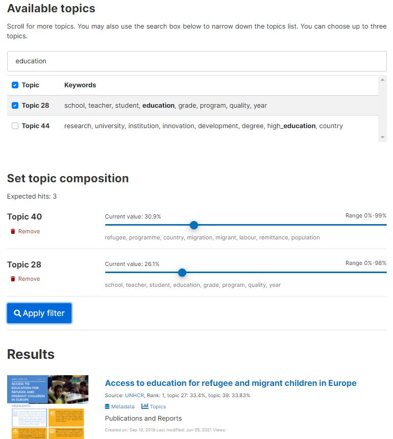
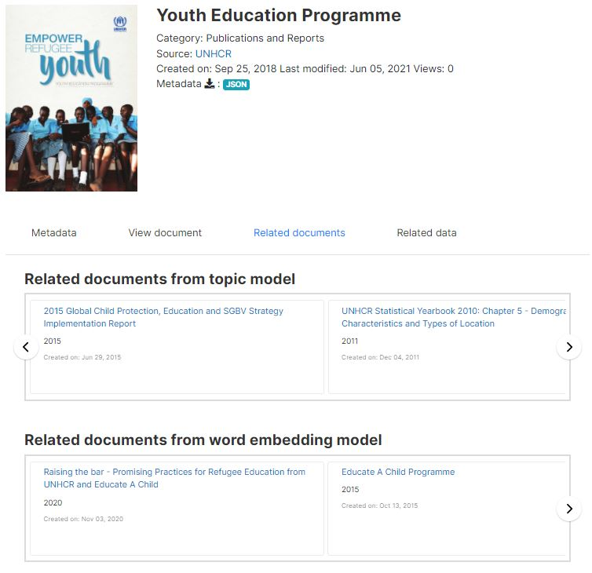
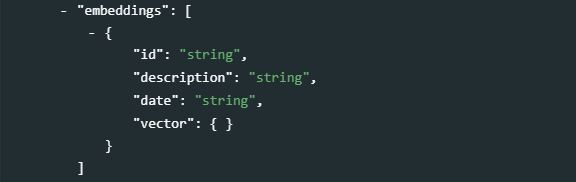

#	Databases of indicators {#chapter07}

<center>
{width=25%}  
</center>

##	Database vs indicators

The schema we describe in this chapter is intended to document *databases* of indicators or time series, not the indicators or time series themselves (a schema for the description of indicators and time series is presented in chapter 8). **Indicators** are summary measures related to key issues or phenomena, derived from observed facts. Indicators form **time series** when they are provided with a temporal ordering, i.e. when their values are provided with an ordered annual, quarterly, monthly, daily, or other time reference. Indicators and time series are often contained in multi-indicators databases, like the World Bank's [World Development Indicators - WDI](https://datatopics.worldbank.org/world-development-indicators/), whose on-line version contains series for 1,430 indicators (as of 2021). 

The metadata related to a database can be published in a catalog as specific entries, or as information attached to an indicator.
[provide example / screenshot in NADA]


## Schema description

The **database** schema is used to document the database that contains the time series, not to document the indicators or /series. 

<br>
```json
{
  "published": 0,
  "overwrite": "no",
  "metadata_information": {},
  "database_description": {},
  "provenance": [],
  "tags",
  "lda_topics": {},
  "embeddings": {},
  "additional": {}
}
```
<br>

The schema includes two elements that are not metadata, but parameters used when publishing the metadata in a NADA catalog:

- **`published`**: Indicates whether the metadata must be made visible to visitors of the catalog. By default, the value is 0 (unpublished), in which case it is only visible to catalog administrators. This value must be set to 1 (published) to make the metadata visible. Note that the database metadata will only be shown in NADA in association with the metadata of an indicator. 
- **`overwrite`**: Indicates whether metadata that may have been previously uploaded for the same database can be overwritten. By default, the value is "no". It must be set to "yes" to overwrite existing information. A database will be considered as being the same as a previously uploaded one if they have the same identifier (provided in the metadata element `database_description > title_statement > idno`).
  
#### Metadata information

**`metadata_information`** *[Optional, Not Repeatable]* <br>
The set of elements in `metadata_information` is used to provide information on the production of the database metadata. This information is used mostly for administrative purposes by data curators and catalog administrators.

<br>
```json
"metadata_information": {
  "title": "string",
  "idno": "string",
  "producers": [
    {
      "name": "string",
      "abbr": "string",
      "affiliation": "string",
      "role": "string"
    }
  ],
  "prod_date": "string",
  "version": "string"
}
```
<br>

- **`title`** *[Optional ; Not repeatable ; String]* <br>
The title of the metadata document containing the database metadata.<br>
- **`idno`** *[Required ; Not repeatable ; String]* <br>
A unique identifier of the database metadata document. It can be for example the identifier of the database preceded by a prefix identifying the metadata producer.<br>
- **`producers`** *[Optional ; Repeatable]* <br>
A list and description of the producers of the database metadata (not the producers of the database).<br>
  - **`name`** *[Optional ; Not repeatable ; String]* <br>
  The name of the person or organization who produced the metadata (or contributed to its production).<br>
  - **`abbr`** *[Optional ; Not repeatable ; String]* <br>
  The abbreviation (aconym) of the organization mentioned in `name`.<br>
  - **`affiliation`** *[Optional ; Not repeatable ; String]* <br>
  The affiliation of the person or organization mentioned in `name`.<br>
  - **`role`** *[Optional ; Not repeatable ; String]* <br>
  The specific role of the person or organization mentioned in `name` in the production of the metadata.<br>
- **`prod_date`** *[Optional ; Not repeatable ; String]* <br>
The date when the metadata was produced, preferably entered in ISO 8601 format (YYYY-MM-DD).<br>
- **`version`** *[Optional ; Not repeatable ; String]* <br>
The version of the metadata (not the version of the database).<br>
    
    
#### Database description    
    
**`database_description`** *[Required, Not Repeatable]* <br>

<br>
```json
"database_description": {
  "title_statement": {},
  "authoring_entity": [],
  "abstract": "string",
  "url": "string",
  "type": "string",
  "date_created": "string",
  "date_published": "string",
  "version": [],
  "update_frequency": "string",
  "update_schedule": [],
  "time_coverage": [],
  "time_coverage_note": "string",
  "periodicity": [],
  "themes": [],
  "topics": [],
  "keywords": [],
  "dimensions": [],
  "ref_country": [],
  "geographic_units": [],
  "geographic_coverage_note": "string",
  "bbox": [],
  "geographic_granularity": "string",
  "geographic_area_count": "string",
  "sponsors": [],
  "acknowledgments": [],
  "acknowledgment_statement": "string",
  "contacts": [],
  "links": [],
  "languages": [],
  "access_options": [],
  "errata": [],
  "license": [],
  "citation": "string",
  "notes": [],
  "disclaimer": "string",
  "copyright": "string"
}
```
<br>

- **`title_statement`** *[Required, Not Repeatable]* <br>

<br>
```json
"title_statement": {
  "idno": "string",
  "identifiers": [
    {
      "type": "string",
      "identifier": "string"
    }
  ],
  "title": "string",
  "sub_title": "string",
  "alternate_title": "string",
  "translated_title": "string"
}
```
<br>

  - **`idno`** *[Required ; Not repeatable ; String]* <br>
  A unique identifier of the database. For example, the World Bank's World Development Indicators database published in April 2020 could have `idno` = "WB_WDI_APR_2020".
  - **`identifiers`** *[Optional ; Repeatable]* <br>
  This element is used to store database identifiers (IDs) other than the catalog ID entered in `idno`. It can for example be a Digital Object Identifier (DOI). The `idno` can be repeated here (`idno` does not provide a `type` parameter; if a DOI or other standard reference ID is used as `idno`, it is recommended to repeat it here with the identification of its `type`).
    - **`type`** *[Optional ; Not repeatable ; String]* <br>
    The type of unique ID, e.g. "DOI".<br>
    - **`identifier`** *[Required ; Not repeatable ; String]* <br>
    The identifier itself.<br>
  - **`title`** *[Required ; Not repeatable ; String]* <br>
  The title is the name by which the database is formally known. It is good practice to include the year of production in the title (and possibly the month, or quarter, if a new version of the database is released more than once a year). For example, "World Development Indicators, April 2020".<br>  
  - **`sub_title`** *[Optional ; Not repeatable ; String]* <br>
  The database subtitle can be used when there is a need to distinguish characteristics of a database. This element will rarely be used.<br> 
  - **`alternate_title`** *[Optional ; Not repeatable ; String]* <br>
  This can be an acronym, or an alternative name of the database. For example, "WDI April 2020".<br>
  - **`translated_title`** *[Optional ; Not repeatable ; String]* <br>
  The title of the database in a secondary language (if more than one other language, they may be entered as one string, as this element is not repeatable).<br><br>


- **`authoring_entity`** *[Optional ; Repeatable]* <br>
This set of five elements is used to identify the organization(s) or person(s) who are the main producers/curators of the database. Note that a similar element is available at the indicator/series level.

<br>
```json
"authoring_entity": [
  {
    "name": "string",
    "affiliation": "string",
    "abbreviation": "string",
    "email": "string",
    "uri": "string"
  }
]
```
<br>

  - **`name`** *[Optional ; Not repeatable ; String]* <br>
  The name of the person or organization who maintains the contents of the database (back-end). Write the name in full (use the element `abbreviation` to capture the acronym of the organization, if relevant). 
  - **`affiliation`** *[Optional ; Not repeatable ; String]* <br>
  The affiliation of the person or organization mentioned in `name`.  
  - **`abbreviation`** *[Optional ; Not repeatable ; String]* <br>
  The abbreviated name (acronym) of the organization mentioned in `name`.
  - **`email`** *[Optional ; Not repeatable ; String]* <br>
  The public email contact of the person or organizations mentioned in `name`. It is good practice to provide a service account email address, not a personal one.
  - **`uri`** *[Optional ; Not repeatable ; String]* <br>
  A link (URL) to the website of the entity mentioned in `name`. <br><br>

                                                              
- **`abstract`** *[Optional ; Not repeatable ; String]* <br>

  The `abstract` is a brief description of the database. It can for example include a short statement on the database scope and coverage (not in detail, as other fields are available for that purpose), objectives, history, and expected audience.<br>


- **`url`** *[Optional ; Not repeatable ; String]* <br>

  The link to the public interface of the database (home page). <br>


- **`type`** *[Optional ; Not repeatable ; String]*<br>

  The type of database. <br>


- **`date_created`** *[Optional ; Not repeatable ; String]* <br>
This is the date the database was created. The date should be entered in ISO 8601 format (YYY-MM-DD, or YYYY-MM, or YYYY).


- **`date_published`** <br>
This is the date the database was made public. The date should be entered in ISO 8601 format (YYY-MM-DD, or YYYY-MM, or YYYY). <br>

                                                     
- **`version`** *[Optional ; Repeatable]* <br>
A database rarely remains static; it will be regularly updated and upgraded. The `version` element is a compound element and contains important information regarding the updating of the database. This includes any extension of the database (adding new series data), appending existing data, correcting existing data, etc. 

<br>
```json
"version": [
  {
    "version": "string",
    "date": "string",
    "responsibility": "string",
    "notes": "string"
  }
]
```
<br>

  - **`version`** *[Optional ; Not repeatable ; String]* <br>
  A label for the version. The version specification will be determined by a curator or a data manager under conventions determined by the authoring entity. 
  - **`date`** *[Optional ; Not repeatable ; String]* <br>
  The date the version was released. The date should be entered in ISO 8601 format (YYY-MM-DD, or YYYY-MM, or YYYY). 
  - **`responsibility`** *[Optional ; Not repeatable ; String]* <br>
  The organization or person in charge of this version of the database. 
  - **`notes`** *[Optional ; Not repeatable ; String]* <br>
  Additional information on this version of the database. Notes can for example be used to document how this version differs from previous ones.<br><br>

                              
- **`update_frequency`** *[Optional ; Not repeatable ; String]*<br>
Indicates at which frequency the database is updated (for example, "annual" or "quarterly"). The use of a controlled vocabulary is recommended. If a database contains many indicators, the update frequency may vary by indicator (e.g., some may be updated on a monthly or quarterly basis while others are only updated annually). The information provided in the `update_frequency` will correspond to the frequency of update for the indicators that are most frequently updated. 
<br>
  
 
- **`update_schedule`** *[Optional ; Repeatable]*<br>
The update schedule is intended to provide users with information on scheduled updates. This is a repeatable field that allows for capturing specific dates, but this information would then have to be regularly updated. Often a single description will be used, which would avoid having to regularly update the metadata. For example, "The database is updated in January, April, July, October of each year."

<br>
```json
"update_schedule": [
  {
    "update": "string"
  }
]
```
<br>

  - **`update`** *[Optional ; Not repeatable ; String]*<br>
  A description of the schedule of updates or a date entered in ISO 8601 format. <br><br>  

 
- **`time_coverage`** *[Optional ; Repeatable]* <br>
The time coverage is the time span of all the data contained in the database across all series. 
<br>
```json
"time_coverage": [
  {
    "start": "string",
    "end": "string"
  }
]
```
<br>
  - **`start`** *[Optional ; Not repeatable ; String]* <br>
  Indicates the start date of the period covered by the data (across all series) in the database. The date should be provided in ISO 8601 format (YYY-MM-DD, or YYYY-MM, or YYYY).
  - **`end`** *[Optional ; Not repeatable ; String]* <br>
  Indicates the end date of the period covered by the data (across all series) in the database. The date should be provided in ISO 8601 format (YYY-MM-DD, or YYYY-MM, or YYYY).<br><br>

- **`time_coverage_note`** *[Optional ; Not repeatable ; String]* <br>
The element is used to annotate and/or describe auxiliary information related to the time coverage described in `time_coverage`.<br>


- **`periodicity`** *[Optional ; Repeatable]* <br>
The periodicity of the data describes the periodicity of the indicators contained in the database. A database can contain series covering different periods, in which case the information will be repeated for each type of periodicity. A controlled vocabulary should be used.
<br>
```json
"periodicity": [
  {
    "period": "string"
  }
]
```
<br>

  - **`period`** *[Optional ; Not repeatable ; String]* <br>
Periodicity of the time series included in the database, for example, "annual", "quarterly", or "monthly". <br><br>


- **`themes`** *[Optional ; Repeatable]* <br>
Themes provide a general idea of the research that might guide the creation and/or demand for the series. A theme is broad and is likely also subject to a community based definition or list. A controlled vocabulary should be used. This element will rarely be used (the element `topics` described below will be used more often).

<br>
```json
"themes": [
  {
    "id": "string",
    "name": "string",
    "parent_id": "string",
    "vocabulary": "string",
    "uri": "string"
  }
]
```
<br>

  - **`id`** *[Optional ; Not repeatable ; String]*<br>
  The unique identifier of the theme. It can be a sequential number, or the identifier of the theme in a controlled vocabulary.
  - **`name`** *[Required ; Not repeatable ; String]* <br>
  The label of the theme associated with the data. 
  - **`parent_id`** *[Optional ; Not repeatable ; String]*<br>
  When a hierarchical (nested) controlled vocabulary is used, the `parent_id` field can be used to indicate a higher-level theme to which this theme belongs.
  - **`vocabulary`** *[Optional ; Not repeatable ; String]* <br>
  The name of the controlled vocabulary used, if any. 
  - **`uri`** *[Optional ; Not repeatable ; String]* <br>
  A link to the controlled vocabulary mentioned in field 'vocabulary'.<br><br>


- **`topics`** *[Optional ; Repeatable]*<br>
The `topics` field indicates the broad substantive topic(s) that the indicator/series covers. A topic classification facilitates referencing and searches in electronic survey catalogs. Topics should be selected from a standard controlled vocabulary such as the [Council of European Social Science Data Archives (CESSDA) topic classification](https://vocabularies.cessda.eu/vocabulary/TopicClassification).<br>

<br>
```json
"topics": [
  {
    "id": "string",
    "name": "string",
    "parent_id": "string",
    "vocabulary": "string",
    "uri": "string"
  }
]
```
<br>

  - **`id`** *[Optional ; Not repeatable ; String]* <br>
  The unique identifier of the topic. It can be a sequential number, or the identifier of the topic in a controlled vocabulary.
  - **`name`** *[Required ; Not repeatable ; String]* <br>
  The label of the topic associated with the data.  
  - **`parent_id`** *[Optional ; Not repeatable ; String]* <br>
  When a hierarchical (nested) controlled vocabulary is used, the `parent_id` field can be used to indicate a higher-level topic to which this topic belongs.
  - **`vocabulary`** *[Optional ; Not repeatable ; String]* <br>
  The name of the controlled vocabulary used, if any. 
  - **`uri`** <br>
  A link to the controlled vocabulary mentioned in field `vocabulary'.<br><br>


- **`keywords`** *[Optional ; Repeatable]* <br>
Words or phrases that describe salient aspects of a data collection's content. This can be used for building keyword indexes and for classification and retrieval purposes. Keywords can be selected from a standard thesaurus, preferably an international, multilingual thesaurus. The list of keywords can include keywords extracted from one or more controlled vocabularies and user-defined keywords. 

<br>
```json
"keywords": [
  {
    "name": "string",
    "vocabulary": "string",
    "uri": "string"
  }
]
```
<br>

  - **`name`** *[Required ; String ; Non repeatable]* <br>
  A keyword (or phrase).  
  - **`vocabulary`** *[Optional ; Not repeatable ; String]* <br>
  The name of the controlled vocabulary from which the keyword was extracted, if any.  
  - **`uri`** *[Optional ; Not repeatable ; String]* <br>
  The URI of the controlled vocabulary used, if any.<br><br>

- **`dimensions`** *[Optional ; Repeatable]* <br>
The dimensions available for the series included in the database. For example, "country, year". 

<br>
```json
"dimensions": [
  {
    "name": "string",
    "label": "string"
  }
]
```
<br>

  - **`name`** *[Required ; String ; Non repeatable]* <br>
  The name of the dimension.  
  - **`label`** *[Optional ; Not repeatable ; String]* <br>
  A label for the dimension.<br><br>

 
- **`ref_country`** *[Optional ; Repeatable]* <br>   
A list of countries for which data are available in the database. This element is somewhat redundant with the next element (`geographic_units`) which may also contain a list of countries. Identifying geographic areas of type "country" is important to enable filters and facets in data catalogs (country names are among the most frequent queries submitted to catalogs).

<br>
```json
"ref_country": [
  {
    "name": "string",
    "code": "string"
  }
]
```
<br>

  - **`name`** *[Required ; Not repeatable ; String]* <br>
  The name of the country.
  - **`code`** *[Optional ; Not repeatable ; String]* <br>
  The code of the country. The use of the [ISO 3166-1 alpha-3](https://en.wikipedia.org/wiki/ISO_3166-1_alpha-3) codes is recommended.<br><br> 
    
    
- **`geographic_units`** *[Optional ; Repeatable]* <br>
A list of geographic units (regions, countries, states, provinces, etc.) for which data are available in the database. This list is not limited to countries; it can contain sub-national areas, supra-national regions, or non-administrative area names. The `type` element is used to indicate the type of geographic area. Countries may, but do not have to be repeated here if provided in the eleement `ref_country`.
<br>
```json
"geographic_units": [
  {
    "name": "string",
    "code": "string",
    "type": "string"
  }
]
```
<br>

  - **`name`** *[Required ; Not repeatable ; String]* <br>
  The name of the geographic unit e.g. 'World', 'Sub-Saharan Africa', 'Afghanistan', 'Low-income countries'.
  - **`code`** *[Optional ; Not repeatable ; String]* <br>
  The code of the geographic unit as found in the database. If no code is available in the database, a code still can be added to the metadata. In such case, using the [ISO 3166-1 alpha-3](https://en.wikipedia.org/wiki/ISO_3166-1_alpha-3) codes is recommended for countries. 
  - **`type`** *[Optional ; Not repeatable ; String]* <br>
  Type of geographic unit e.g. country, state, region, province, or other grouping. <br>

- **`geographic_coverage_note`** *[Optional ; Not repeatable ; String]* <br>
The note can be used to capture additional information on the geographic coverage of the database.<br>

- **`bbox`** *[Optional ; Repeatable]* <br>
Bounding boxes are typically used for geographic datasets to indicate the geographic coverage of the data, but can be provided for databases as well, although this will rarely be done. A geographic bounding box defines a rectangular geographic area.
<br>
```json
"bbox": [
  {
    "west": "string",
    "east": "string",
    "south": "string",
    "north": "string"
  }
]
```
<br>

  - **`west`** *[Required ; Not repeatable ; String]* <br>
  Western geographic parameter of the bounding box.
  - **`east`** *[Required ; Not repeatable ; String]* <br>
  Eastern geographic parameter of the bounding box.
  - **`south`** *[Required ; Not repeatable ; String]* <br>
  Southern geographic parameter of the bounding box.
  - **`north`** *[Required ; Not repeatable ; String]* <br>
  Northern geographic parameter of the bounding box.
 
- **`geographic_granularity`** *[Optional ; Not repeatable ; String]* <br>

  Whereas the `geographic_units` element lists the various geographic levels for which there is data in the database, the `geographic_granularity` element will provide information on the geographic levels for which information is available in the database. For example: "The database contains data at the national, provincial (admin 1) and district (admin 2) levels."<br>
                                                                             
- **`geographic_area_count`** *[Optional ; Not repeatable ; String]*<br>
  
  The number of geographic areas for which data are provided in the database. The World Bank World Development Indicators for example provides data for 262 different areas (which includes countries and territories, geographic regions, and other country groupings).<br>


- **`sponsors`** *[Optional ; Repeatable]* <br>
The source(s) of funds for the production and maintenance of the database. If different funding agencies sponsored different stages of the database development, use the `role` attribute to distinguish their respective contributions.

<br>
```json
"sponsors": [
  {
    "name": "string",
    "abbreviation": "string",
    "role": "string",
    "grant": "string",
    "uri": "string"
  }
]
```
<br>

  - **`name`** *[Required ; Not repeatable ; String]* <br>
  Name of the funding agency/sponsor 
  - **`abbreviation`** *[Optional ; Not repeatable ; String]* <br>
  Abbreviation of the funding/sponsoring agency mentioned in `name`.
  - **`role`** *[Optional ; Not repeatable ; String]* <br>
  Role of the funding/sponsoring agency mentioned in `name`.
  - **`grant`** *[Optional ; Not repeatable ; String]* <br>
  Grant or award number. If an agency provided more than one grant, list all grants separated with a ";". 
  - **`uri`** *[Optional ; Not repeatable ; String]* <br>
  URI of the sponsor agency mentioned in `name`. <br><br>


- **`acknowledgments`** *[Optional ; Repeatable]* <br>
An itemized list of person(s) and/or organization(s) other than sponsors and contributors already mentioned in metadata elements `contributors` and `sponsors` whose contribution to the database must be acknowledged.

<br>
```json
"acknowledgments": [
  {
    "name": "string",
    "affiliation": "string",
    "role": "string",
    "uri": "string"
  }
]
```
<br>

  - **`name`** *[Optional ; Not repeatable ; String]* <br>
  The name of the person or agency being recognized for supporting the database. 
  - **`affiliation`** *[Optional ; Not repeatable ; String]* <br>
  Affiliation of the person or agency recognized or acknowledged for supporting the database.
  - **`role`** *[Optional ; Not repeatable ; String]* <br>
  Role of the person or agency that is being recognized or acknowledged for supporting the database.
  - **`uri`** *[Optional ; Not repeatable ; String]* <br>
  Website URL or email of the person or organization being recognized or acknowledged for supporting the database.


- **`acknowledgment_statement`** *[Optional ; Not repeatable ; String]*<br>

  An overall statement of acknowledgment, which can be used as an alternative (or supplement) to the itemized list provided in `acknowledgments`.<br><br>


- **`contacts`** *[Optional ; Repeatable]* <br>
The `contacts` element provides the public interface for questions associated with the development and maintenance of the database. There could be various contacts provided depending upon the organization.  

<br>
```json
"contacts": [
  {
    "name": "string",
    "role": "string",
    "affiliation": "string",
    "email": "string",
    "telephone": "string",
    "uri": "string"
  }
]
```
<br>

  - **`name`** *[Optional ; Not repeatable ; String]* <br>
  The name of the contact person that should be contacted. Instead of the name of an individual (which would be subject to change and require frequent update of the metadata), a title can be provided here (e.g. "data helpdesk"). 
  - **`role`** *[Optional ; Not repeatable ; String]* <br>
  The specific role of the contact person mentioned in `name`. This will be used when multiple contacts are listed, and is intended to help users direct their questions and requests to the right contact person.      
  - **`affiliation`** *[Optional ; Not repeatable ; String]* <br>
  The organization or affiliation of the contact person mentioned in `name`. 
  - **`email`** *[Optional ; Not repeatable ; String]* <br>
  The email address of the person or organization mentioned in `name`. Avoid using personal email accounts; the use of an anonymous email is recommended (e.g, "helpdesk@....org")
  - **`telephone`** *[Optional ; Not repeatable ; String]* <br>
  The phone number of the person or organization mentioned in `name`.
  - **`uri`** *[Optional ; Not repeatable ; String]* <br>
  The URI of the agency (typically, a URL to a "contact us" web page). <br><br>

                                             
- **`links`** *[Optional ; Repeatable]* <br>
This field allows for the association of auxiliary links referring to the database.

<br>
```json
"links": [
  {
    "uri": "string",
    "description": "string"
  }
]
```
<br>

  - **`uri`** *[Optional ; Not repeatable ; String]* <br>
  The URI for the associated link.
  - **`description`** *[Optional ; Not repeatable ; String]* <br>
  A brief description of the link, in relation to the database.
  <br><br>


- **`languages`** *[Optional ; Repeatable]* <br>
This set of elements is provided to list the languages that are supported in the database.
  <br>
  ```json
  "languages": [
    {
      "name": "string",
      "code": "string"
    }
  ]
  ```
  <br>
  
  - **`name`** *[Optional ; Not repeatable ; String]* <br>
  The official name of the language being supported; it is recommended to use a name from the [ISO 639-1 language name list](https://en.wikipedia.org/wiki/List_of_ISO_639-1_codes).
  - **`code`** *[Optional ; Not repeatable ; String]* <br>
  The code of the language mentioned in `name`, preferably the three letter [ISO 639-1 code](https://en.wikipedia.org/wiki/List_of_ISO_639-1_codes).<br><br>


- **`access_options`** *[Optional ; Repeatable]* <br>
This repeatable set of elements describes the different modes and formats in which the database is made accessible. When more than one mode of access is provided, describe them separately.

<br>
```json
"access_options": [
  {
    "type": "string",
    "uri": "string",
    "note": "string"
  }
]
```
<br>

  - **`type`** *[Optional ; Not repeatable ; String]* <br>
  The access type, e.g. "Application Programming Interface (API)", "Bulk download in CSV format", "On-line query interface", etc.
  - **`uri`** *[Optional ; Not repeatable ; String]* <br>
  The URI corresponding to the access mode mentioned in `type`. 
  - **`note`** *[Optional ; Not repeatable ; String]* <br>
  This element allows for annotating any specific information associated with the access mode mentioned in `type`. <br><br>


- **`errata`** *[Optional ; Repeatable]* <br>
A list of errata at the database level. Note that an `errata` element is also available in the schema used for the description of indicators/series.

<br>
```json
"errata": [
  {
    "date": "string",
    "description": "string"
  }
]
```
<br>

  - **`date`** *[Optional ; Not repeatable ; String]* <br>
  The date the erratum was published, preferably entered in ISO format.
  - **`description`** *[Optional ; Not repeatable ; String]* <br>
  A description of the error and of the measures taken to remedy.<br><br>


- **`license`** *[Optional ; Repeatable]* <br>
This set of elements is used to describe the access license(s) attached to the database.

<br>
```json
"license": [
  {
    "name": "string",
    "uri": "string",
    "note": "string"
  }
]
```
<br>

  - **`name`** *[Optional ; Not repeatable ; String]* <br>
  The name of the license, for example "Creative Commons Attribution 4.0 International license (CC-BY 4.0)". 
  - **`uri`** *[Optional ; Not repeatable ; String]* <br>
  A URI to a description of the license, for example "https://creativecommons.org/licenses/by/4.0/";
  - **`note`** *[Optional ; Not repeatable ; String]* <br>
  Any additional information to qualify the license requirements.<br><br>


- **`citation`** *[Optional ; Not repeatable ; String]* <br>

  The citation requirement for the database (i.e. how users should cite the database in publications and reports).  


- **`notes`** *[Optional ; Repeatable]* <br>
This element is provided to add notes that are relevant for describing the database, that cannot be provided in other metadata elements. 

<br>
```json
"notes": [
  {
    "note": "string"
  }
]
```
<br>

- **`note`** *[Optional ; Not repeatable ; String]* <br>
  A free-text note.


- **`disclaimer`** *[Optional ; Not repeatable ; String]* <br>

If the agency responsible for managing the database has determined that there may be some liability as a result of the data, the element may be used to provide a disclaimer statement.<br><br>


- **`copyright`** *[Optional ; Not repeatable ; String]* <br>
The copyright attached to the database, if any.


### Provenance

**`provenance`** *[Optional ; Repeatable]* <br>
Metadata can be programmatically harvested from external catalogs. The `provenance` group of elements is used to store information on the provenance of harvested metadata, and on alterations that may have been made to the harvested metadata.<br>
<br>
```json
"provenance": [
  {
    "origin_description": {
      "harvest_date": "string",
      "altered": true,
      "base_url": "string",
      "identifier": "string",
      "date_stamp": "string",
      "metadata_namespace": "string"
    }
  }
]
```
<br>

  - **`origin_description`** *[Required ; Not repeatable]* <br>
  The `origin_description` elements are used to describe when and from where metadata have been extracted or harvested.<br>
  
    - **`harvest_date`** *[Required ; Not repeatable ; String]* <br>
    The date and time the metadata were harvested, entered in ISO 8601 format.<br>
    - **`altered`** *[Optional ; Not repeatable ; Boolean]* <br>
    A boolean variable ("true" or "false"; "true by default) indicating whether the harvested metadata have been modified before being re-published. In many cases, the unique identifier of the study (element `idno` in the Document Description / Title Statement section) will be modified when published in a new catalog.<br>
    - **`base_url`** *[Required ; Not repeatable ; String]* <br>
    The URL from where the metadata were harvested.<br>
    - **`identifier`** *[Optional ; Not repeatable ; String]* <br>
    The unique dataset identifier (`idno` element) in the source catalog. When harvested metadata are re-published in a new catalog, the identifier will likely be changed. The `identifier` element in `provenance` is used to maintain traceability.<br>
    - **`date_stamp`** *[Optional ; Not repeatable ; String]* <br>
    The date stamp (in UTC date format) of the metadata record in the originating repository (this should correspond to the date the metadata were last updated in the source catalog).<br>
    - **`metadata_namespace`** *[Optional ; Not repeatable ; String]* <br>
    @@@@@@@ <br>


### Tags

**`tags`** *[Optional ; Repeatable]* <br>
As shown in section 1.7 of the Guide, tags, when associated with `tag_groups`, provide a powerful and flexible solution to enable custom facets (filters) in data catalogs.
<br>
```json
"tags": [
  {
    "tag": "string",
    "tag_group": "string"
  }
]
```
<br>

- **`tag`** *[Required ; Not repeatable ; String]* <br>
A user-defined tag.
- **`tag_group`** *[Optional ; Not repeatable ; String]* <br><br>
A user-defined group (optional) to which the tag belongs. Grouping tags allows implementation of controlled facets in data catalogs.


### LDA topics

**`lda_topics`** *[Optional ; Not repeatable]* <br>
<br>
```json
"lda_topics": [
	{
		"model_info": [
			{
				"source": "string",
				"author": "string",
				"version": "string",
				"model_id": "string",
				"nb_topics": 0,
				"description": "string",
				"corpus": "string",
				"uri": "string"
			}
		],
		"topic_description": [
			{
				"topic_id": null,
				"topic_score": null,
				"topic_label": "string",
				"topic_words": [
					{
						"word": "string",
						"word_weight": 0
					}
				]
			}
		]
	}
]
```
<br>

We mentioned in Chapter 1 the importance of producing rich metadata, and the opportunities that machine learning offers to enrich (or "augment") metadata in a largely automated manner. One application of machine learning, more specifically of natural language processing, to enrich metadata related to publications is the topic extraction using Latent Dirichlet Allocation (LDA) models. LDA models must be trained on large corpora of documents. They do not require any pre-defined taxonomy of topics. The approach consists of "clustering" words that are likely to appear in similar contexts (the number of "clusters" or "topics" is a parameter provided when training a model). Clusters of related words form "topics". A topic is thus defined by a list of keywords, each one of them provided with a score indicating its importance in the topic. Typically, the top 10 words that represent a topic will be used to describe it. The description of the topics covered by a document can be indexed to improve searchability (possibly in a selective manner, by setting thresholds on the topic shares and word weights).  
<br>
Once an LDA topic model has been trained, it can be used to infer the topic composition of any document. This inference will then provide the share that each topic represents in the document. The sum of all represented topics is 1 (100%).<br> 
<br>
The metadata element `lda_topics` is provided to allow data curators to store information on the inferred topic composition of the documents listed in a catalog. Sub-elements are provided to describe the topic model, and the topic composition.

:::note
Important note: the topic composition of a document is specific to a topic model. To ensure consistency of the information captured in the `lda_topics` elements, it is important to make use of the same model(s) for generating the topic composition of all documents in a catalog. If a new, better LDA model is trained, the topic composition of all documents in the catalog should be updated.
:::

The image below provides an example of topics extracted from a document from the United Nations High Commission for Refugees, using a LDA topic model trained by the World Bank (this model was trained to identify 75 topics; no document will cover all topics).

{width=100%}  

The `lda_topics` element includes the following metadata fields:<br> 

- **`model_info`** *[Optional ; Not repeatable]* <br>
Information on the LDA model.

  - `source` *[Optional ; Not repeatable ; String]* <br>
  The source of the model (typically, an organization).<br>
  - `author` *[Optional ; Not repeatable ; String]* <br>
  The author(s) of the model.<br>
  - `version` *[Optional ; Not repeatable ; String]* <br>
  The version of the model, which could be defined by a date or a number.<br>
  - `model_id` *[Optional ; Not repeatable ; String]* <br>
  The unique ID given to the model.<br>
  - `nb_topics` *[Optional ; Not repeatable ; Numeric]* <br>
  The number of topics in the model (the number of topics to be extracted from a corpus is the key parameter of any LDA model).<br>
  - `description` *[Optional ; Not repeatable ; String]* <br>
  A brief description of the model.<br>
  - `corpus` *[Optional ; Not repeatable ; String]* <br>
  A brief description of the corpus on which the LDA model was trained.<br>
  - `uri` *[Optional ; Not repeatable ; String]* <br>
  A link to a web page where additional information on the model is available.<br><br>
  
  
- **`topic_description`** *[Optional ; Repeatable]* <br>
The topic composition of the document.

  - `topic_id` *[Optional ; Not repeatable ; String]* <br>
  The identifier of the topic; this will often be a sequential number (Topic 1, Topic 2, etc.).<br>
  - `topic_score` *[Optional ; Not repeatable ; Numeric]* <br>
  The share of the topic in the document (%).<br>
  - `topic_label` *[Optional ; Not repeatable ; String]* <br>
  The label of the topic, if any (not automatically generated by the LDA model).<br>
  - `topic_words` *[Optional ; Not repeatable]* <br>
  The list of N keywords describing the topic (e.g., the top 5 words).<br>
     - `word` *[Optional ; Not repeatable ; String]* <br>
     The word.<br>
     - `word_weight` *[Optional ; Not repeatable ; Numeric]* <br>
     The weight of the word in the definition of the topic. This is specific to the model, not to a document. <br>

  
```{r, indent="", eval=F, echo=T}

lda_topics = list(
  
   list(
  
      model_info = list(
        list(source      = "World Bank, Development Data Group",
             author      = "A.S.",
             version     = "2021-06-22",
             model_id    = "Mallet_WB_75",
             nb_topics   = 75,
             description = "LDA model, 75 topics, trained on Mallet",
             corpus      = "World Bank Documents and Reports (1950-2021)",
             uri         = ""))
      ),
      
      topic_description = list(
      
        list(topic_id    = "topic_27",
             topic_score = 32,
             topic_label = "Education",
             topic_words = list(list(word = "school",      word_weight = "")
                                list(word = "teacher",     word_weight = ""),
                                list(word = "student",     word_weight = ""),
                                list(word = "education",   word_weight = ""),
                                list(word = "grade",       word_weight = "")),
        
        list(topic_id    = "topic_8",
             topic_score = 24,
             topic_label = "Gender",
             topic_words = list(list(word = "women",       word_weight = "")
                                list(word = "gender",      word_weight = ""),
                                list(word = "man",         word_weight = ""),
                                list(word = "female",      word_weight = ""),
                                list(word = "male",        word_weight = "")),
        
        list(topic_id    = "topic_39",
             topic_score = 22,
             topic_label = "Forced displacement",
             topic_words = list(list(word = "refugee",     word_weight = "")
                                list(word = "programme",   word_weight = ""),
                                list(word = "country",     word_weight = ""),
                                list(word = "migration",   word_weight = ""),
                                list(word = "migrant",     word_weight = "")),
                                
        list(topic_id    = "topic_40",
             topic_score = 11,
             topic_label = "Development policies",
             topic_words = list(list(word = "development", word_weight = "")
                                list(word = "policy",      word_weight = ""),
                                list(word = "national",    word_weight = ""),
                                list(word = "strategy",    word_weight = ""),
                                list(word = "activity",    word_weight = ""))
                                
      )
      
   )
   
)
```

The information provided by LDA models can be used to build a "filter by topic composition" tool in a catalog, to help identify documents based on a combination of topics, allowing users to set minimum thresholds on the share of each selected topic.

<center>
{width=85%}  
</center>


### Embeddings
 
**`embeddings`** *[Optional ; Repeatable]* <br>
In Chapter 1 (section 1.n), we briefly introduced the concept of word embeddings and their use in implementation of semantic search tools. Word embedding models convert text (words, phrases, documents) into large-dimension numeric vectors (e.g., a vector of 100 or 200 numbers) that are representative of the semantic content of the text. The vectors are generated by submitting a text to a pre-trained word embedding model (possibly via an API). These vector representations can be used to identify semantically-closed documents, by calculating the distance between vectors and identifying the closest ones, as shown in the example below.  

{width=100%}  

The word vectors do not have to be stored in the document metadata to be exploited by search engines. When a semantic search tool is implemented in a catalog, the vectors will be stored in a database end processed by a tool like Milvus. A metadata element is however provided to store the vectors for preservation and sharing purposes. This block of metadata elements is repeatable, allowing multiple vectors to be stored. When using vectors in a search engine, it is critical to only use vectors generated by one same model. 

{width=100%}  

The `embeddings` element contains four metadata fields:

  - **`id`** *[Optional ; Not repeatable ; String]* <br>
  A unique identifier of the word embedding model used to generate the vector.
  - **`description`** *[Optional ; Not repeatable ; String]* <br>
  A brief description of the model. This may include the identification of the producer, a description of the corpus on which the model was trained, the identification of the software and algorithm used to train the model, the size of the vector, etc.
  - **`date`** *[Optional ; Not repeatable ; String]* <br>
  The date the model was trained (or a version date for the model).
  - **`vector`** *[Required ; Not repeatable ; Object]* @@@@@@@@ do not offer options
  The numeric vector representing the document, provided as an object (array or string). <br><br>
  [1,4,3,5,7,9]

                                                
### Additional

**`additional`** *[Optional ; Not repeatable]*<br>
The `additional` element allows data curators to add their own metadata elements to the schema. All custom elements must be added within the `additional` block; embedding them elsewhere in the schema would cause schema validation to fail.

{width=100%}


#### Complete example

We use the World Bank's [World Development Indicators 2021 (WDI)](https://datatopics.worldbank.org/world-development-indicators/) database as an example. In this example, we assume that all information is entered manually in the script. In a real application, it is likely that some elements like the list and number of geographic areas covered in the database, or the start and end year of the period covered by the data, will be extracted programmatically by reading the data file (the WDI data and related metadata can be downloaded as CSV or MS-Excel files), or by extracting information from the database API (WDI metadata is available via [API](https://datahelpdesk.worldbank.org/knowledgebase/topics/125589-developer-information)).

--------
** Using R
--------

```{r, indent="", eval=F, echo=T}

# The code below creates an object `wdi_database` ready to be published in a NADA catalog (using the NADAR package).

wdi_database <- list(
  
  database_description = list(    
    
    title_statement = list(
      idno = "WB_WDI_2021_09_15",
      title = "World Development Indicators 2021",
      alternate_title = "WDI 2021"
    ),
    
    authoring_entity = list(name = "Development Data Group", 
                            affiliation = "The World Bank Group"),
    
    abstract = "The World Development Indicators is a compilation of relevant, high-quality, and internationally comparable statistics about global development and the fight against poverty. The database contains 1,400 time series indicators for 217 economies and more than 40 country groups, with data for many indicators going back more than 50 years.",
    
    url = "https://datatopics.worldbank.org/world-development-indicators/",
    
    type = "Time series database",
    
    date_created = "2021-09-15",
    date_published = "2021-09-15",
    
    version = list(
      list(version = "On-line public version (open data), 15 September 2021",
           date = "2021-09-15", 
           responsibility = "World Bank, Development Data Group")),

    update_frequency = "Quarterly",
    
    update_schedule = list(list(update = "April, July, September, December")),
    
    time_coverage = list(list(start = "1960", end = "2021")),
    
    periodicity = list(list(period = "Annual")),
    
    topics = list_topics,
    
    geographic_units = list(
      list(code = "ABW", name = "Aruba"),
      list(code = "AFE", name = "Africa Eastern and Southern"),
      list(code = "AFG", name = "Afghanistan"),
      list(code = "AFW", name = "Africa Western and Central"),
      list(code = "AGO", name = "Angola"),
      list(code = "ALB", name = "Albania"),
      list(code = "AND", name = "Andorra"),
      list(code = "ARB", name = "Arab World"),
      list(code = "ARE", name = "United Arab Emirates"),
      list(code = "ARG", name = "Argentina")
      # ... and 255 more - not shown here
    ),
    
    geographic_granularity = "global, national, regional",                           
    
    geographic_area_count = "265",           
    
    languages = list(
      list(code = "en", name = "English"),
      list(code = "sp", name = "Spanish"),
      list(code = "fr", name = "French"),
      list(code = "ar", name = "Arabic"),
      list(code = "cn", name = "Chinese")
    ),
    
    contacts = list(list(name = "Data Help Desk", 
                         affiliation = "World Bank",
                         uri = "https://datahelpdesk.worldbank.org/",
                         email = "data@worldbank.org")),    
    
    access_options = list(
      list(type = "API",   
           uri = "https://datahelpdesk.worldbank.org/knowledgebase/articles/889386"),
      list(type = "Bulk (CSV)",  
           uri = "https://data.worldbank.org/data-catalog/world-development-indicators"),
      list(type = "Query", 
           uri = "http://databank.worldbank.org/data/source/world-development-indicators"),
      list(type = "PDF",   
           uri = "https://openknowledge.worldbank.org/bitstream/handle/10986/26447/WDI-2017-web.pdf")),    
    
    license = list(list(type = "CC BY-4.0", 
                        uri = "https://creativecommons.org/licenses/by/4.0/")),
    
    citation = "World Development Indicators 2021 (September), The World Bank"
    
  ) 
  
)
```

--------
** Using Python
--------

```{python, indent="", eval=F, echo=T}

# The code below creates a dictionary `wdi_database` ready to be published in a NADA catalog (using the PyNADA library).

wdi_database: {
  
  "database_description" : {    
    
    "title_statement" : {
      "idno" : "WB_WDI_2021_09_15",
      "title" : "World Development Indicators 2021",
      "alternate_title" : "WDI 2021"
    },
    
    "authoring_entity" : {"name" : "Development Data Group", 
                          "affiliation" : "The World Bank Group"},
    
    abstract = "The World Development Indicators is a compilation of relevant, high-quality, and internationally comparable statistics about global development and the fight against poverty. The database contains 1,400 time series indicators for 217 economies and more than 40 country groups, with data for many indicators going back more than 50 years.",
    
    url = "https://datatopics.worldbank.org/world-development-indicators/",
    
    type = "Time series database",
    
    date_created = "2021-09-15",
    date_published = "2021-09-15",
    
    version = [{"version" : "On-line public version (open data), 15 September 2021",
                "date" : "2021-09-15", 
                "responsibility" : "World Bank, Development Data Group"}],

    update_frequency = "Quarterly",
    
    update_schedule = [{"update" : "April, July, September, December"}],
    
    time_coverage = [{"start" : "1960", "end" : "2021"}],
    
    periodicity = [{"period" : "Annual"}],
    
    topics = list_topics,
    
    geographic_units = [
      {"code" : "ABW", "name" : "Aruba"},
      {"code" : "AFE", "name" : "Africa Eastern and Southern"},
      {"code" : "AFG", "name" : "Afghanistan"},
      {"code" : "AFW", "name" : "Africa Western and Central"},
      {"code" : "AGO", "name" : "Angola"},
      {"code" : "ALB", "name" : "Albania"},
      {"code" : "AND", "name" : "Andorra"},
      {"code" : "ARB", "name" : "Arab World"},
      {"code" : "ARE", "name" : "United Arab Emirates"},
      {"code" : "ARG", "name" : "Argentina"}
      # ... and 255 more, not shown here
    ],
    
    geographic_granularity = "global, national, regional",                           
    
    geographic_area_count = "265",           
    
    languages = [
      {"code" : "en", "name" : "English"},
      {"code" : "sp", "name" : "Spanish"},
      {"code" : "fr", "name" : "French"},
      {"code" : "ar", "name" : "Arabic"},
      {"code" : "cn", "name" : "Chinese"}
    ],
    
    contacts = [{"name" : "Data Help Desk", 
                  "affiliation" : "World Bank",
                  "uri" : "https://datahelpdesk.worldbank.org/",
                  "email" : "data@worldbank.org"}],    
    
    access_options = [
      {"type" : "API",   
       "uri"  : "https://datahelpdesk.worldbank.org/knowledgebase/articles/889386"},
      {"type" : "Bulk (CSV)",  
       "uri"  : "https://data.worldbank.org/data-catalog/world-development-indicators"},
      {"type" : "Query", 
       "uri"  : "http://databank.worldbank.org/data/source/world-development-indicators"},
      {"type" : "PDF",   
       "uri"  : "https://openknowledge.worldbank.org/bitstream/handle/10986/26447/WDI-2017-web.pdf"}
    ],    
    
    license = [{"type" : "CC BY-4.0", 
                "uri"  : "https://creativecommons.org/licenses/by/4.0/"}],
    
    citation = "World Development Indicators 2021 (September), The World Bank"
    
  } 
  
}
```
