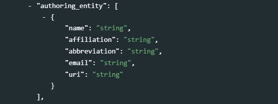
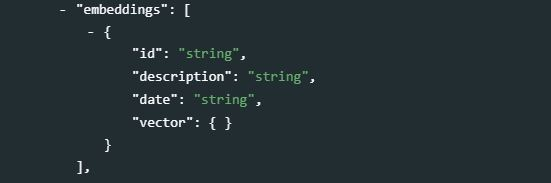
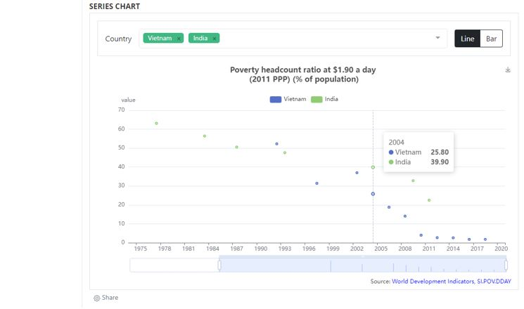

#	Indicators and time series {#chapter07}

<center>
{width=25%}  
</center>


##	Indicators, time series, database, and scope of the schema

**Indicators** are summary measures related to key issues or phenomena, derived from a series of observed facts. Indicators form **time series** when they are provided with a temporal ordering, i.e. when their values are provided with an ordered annual, quarterly, monthly, daily, or other time reference. In the context of this Guide, we consider as time series all indicators provided with an associated time, whether this time represents a regular, continuous series or not. For example, the indicators provided by the Demographic and Health Surveys (DHS) [StatCompiler](https://www.statcompiler.com/en/), which are only available for the years when DHS are conducted in countries (which for some countries can be a single year), would be considered as "time series".

Time series are often contained in multi-indicators databases, like the World Bank's [World Development Indicators - WDI](https://datatopics.worldbank.org/world-development-indicators/), whose on-line version contains series for 1,430 indicators (as of 2021). To document not only the series but also the databases they belong to, we propose two metadata schemas: one to document the series/indicators, the other one to document the databases they belong to. 

In the NADA application, a series can be documented and published without an associated database, but information on a database will only be published in association with a series. The information on a database is thus treated as an "attachment" to the information on a series. A **SERIES DESCRIPTION** tab will display all metadata related to the series, i.e. all content entered in the *series schema*. 

----------
<center>
{width=100%}
</center>
----------

The (optional) **SOURCE DATABASE** tab will display the metadata related to the database, i.e. all content entered in the *series database schema*. This information is displayed for information, but not indexed in the NADA catalog (i.e. not searchable).

----------
<center>
{width=100%}
</center>
----------


> Suggestions and recommendations to data curators<br>

   - Indicators and time series often come with metadata limited to the indicators/series name and a brief definition. This significantly reduces the discoverability of the indicators, and the possibility to implement semantic searchability and recommender systems. It is therefore highly recommended to generate more detailed metadata for each time series, including information on the purpose and typical use of the indicators, of its relevancy to different audiences, of its limitations, and more.
   - When documenting an indicator or time series, attention should be paid to include keywords and phrases in the metadata that reflect how data users are likely to formulate their queries when searching data catalogs. Subject-matter expertise, combined with regular assessment of queries submitted to data catalogs, can help in identifying such keywords. For example, the metadata related to an indicator "Prevalence of stunting" should contain the keyword "malnutrition", or the metadata related to "GDP per capita" should include keywords like "economic growth". By doing so, data curators will provide richer input to search engines and to machine learning models (topic models and word embedding models) used to enable semantic searchability and recommender systems. This will have a significant and direct impact on the searchability and discoverability of the data. 


## Schema description

An indicator or time series is documented using the **time series /indicators** schema. The **database** schema is optional, and used to document the database, if any, that the indicator belongs to. When multiple series of a same database are documented, the metadata related to the database will only need to be generated once, then applied to all series. One element in the **time series /indicators** schema is used to establish the link between the indicator and the database.

### The database schema

The **database** schema is used to document the database that contains the time series, not to document the indicators or /series. 

The schema includes two elements that are not metadata, but parameters used when publishing the metadata in a catalog:

- **`published`**: Indicates whether the metadata must be made visible to visitors of the catalog. By default, the value is 0 (unpublished). This value must be set to 1 (published) to make the metadata visible. Note that the database metadata will only be shown in NADA in association with the metadata of an indicator. 
<br>
{width=100%}
<br>
- **`overwrite`**: Indicates whether metadata that may have been previously uploaded for the same database can be overwritten. By default, the value is "no". It must be set to "yes" to overwrite existing information. Note that a database will be considered as being the same as a previously uploaded one if the identifier provided in the metadata element  `database_description > title_statement > idno` is the same.

**`metadata_information`** *[Optional, Not Repeatable]* <br>
The set of elements in `metadata_information` is used to provide information on the production of the database metadata. This information is used mostly for administrative purposes by data curators and catalog administrators. It is not useful to data users.
<br>
{width=100%}
<br>
    - **`title`** *[Optional ; Not repeatable ; String]* <br>
    The title of the metadata document containing the database metadata.
    - **`idno`** *[Required ; Not repeatable ; String]* <br>
    A unique identifier of the database metadata document. It can be for example the identifier of the database preceded by a prefix identifying the metadata producer.
    - **`producers`** *[Optional ; Repeatable]* <br>
    A list and description of the producers of the database metadata (not the producers of the database).
       - **`name`** *[Optional ; Not repeatable ; String]* <br>
       The name of the person or organization who produced the metadata (or contributed to its production).
       - **`abbr`** *[Optional ; Not repeatable ; String]* <br>
       The abbreviation (aconym) of the organization mentioned in `name`.
       - **`affiliation`** *[Optional ; Not repeatable ; String]* <br>
       The affiliation of the person or organization mentioned in `name`.
       - **`role`** *[Optional ; Not repeatable ; String]* <br>
       The specific role of the person or organization mentioned in `name` in the production of the metadata.
    - **`prod_date`** *[Optional ; Not repeatable ; String]* <br>
    The date when the metadata was produced, preferably entered in ISO 8601 format (YYYY-MM-DD).
    - **`version`** *[Optional ; Not repeatable ; String]* <br>
    The version of the metadata (not the version of the database).
    
**`database_description`** *[Required, Not Repeatable]* <br>

- **`title_statement`** *[Required, Not Repeatable]* <br>
<br>
{width=100%}
<br>
    - **`idno`** *[Required ; Not repeatable ; String]* <br>
    A unique identifier of the database. For example, the World Bank's World Development Indicators database, version of April 2020, could have `idno` = "WB_WDI_APR_2020".
    - **`identifiers`** *[Optional ; Repeatable]* <br>
    This element is used to enter database identifiers (IDs) other than the catalog ID entered in `idno`. It can for example be a Digital Object Identifier (DOI). The `idno` can be repeated here (`idno` does not provide a `type` parameter; if a DOI or other standard reference ID is used as `idno`, it is recommended to repeat it here with the identification of its `type`).
  <br>
  {width=100%}
  <br>    
      - **`type`** *[Optional ; Not repeatable ; String]* <br>
      The type of unique ID, e.g. "DOI".
      - **`value`** *[Required ; Not repeatable ; String]* <br>
      The identifier itself.<br>
    - **`title`** *[Required ; Not repeatable ; String]* <br>
    The title is the name by which the database is formally known. It is good practice to include the year of production in the title (and possibly the month, or quarter, if a new version of the database is released more than once a year). For example, "World Development Indicators, April 2020".  
    - **`sub_title`** *[Optional ; Not repeatable ; String]* <br>
    The database subtitle can be used when there is a need to distinguish characteristics of a database. This element will rarely be used. 
    - **`alternate_title`** *[Optional ; Not repeatable ; String]* <br>
    This can be an acronym, or an alternative name of the database. For example, "WDI April 2020".
    - **`translated_title`** *[Optional ; Not repeatable ; String]* <br>
    The title of the database in a secondary language (if more than one other language, they may be entered as one string, as this element is not repeatable).<br><br>

- **`authoring_entity`** *[Optional ; Repeatable]* <br>
This set of five elements is used to identify the organization(s) or person(s) who are the main producers/curators of the database. Note that a similar element is available at the indicator/series level.
<br>
{width=100%}
<br>
    - **`name`** *[Optional ; Not repeatable ; String]* <br>
    The name of the person or organization who maintains the contents of the database (back-end). Write the name in full (use the element `abbreviation` to capture the acronym of the organization, if relevant). 
    - **`affiliation`** *[Optional ; Not repeatable ; String]* <br>
    The affiliation of the person or organization mentioned in `name`.  
    - **`abbreviation`** *[Optional ; Not repeatable ; String]* <br>
    Abbreviated name (acronym) of the organization mentioned in `name`.
    - **`email`** *[Optional ; Not repeatable ; String]* <br>
    The public email contact of the person or organizations mentioned in `name`. It is good practice to provide a service account email address, not a personal one.
    - **`uri`** *[Optional ; Not repeatable ; String]* <br>
    A link (URL) to the website of the entity mentioned in `name`. <br><br>

- **`abstract`** *[Optional ; Not repeatable ; String]* <br>
<br>
{width=100%}
<br>
The `abstract` is a brief description of the database. It can for example include a short statement on the database scope and coverage (not in detail, as other fields are available for that purpose), objectives, history, and expected audience.

- **`url`** *[Optional ; Not repeatable ; String]* <br>
<br>
{width=100%}
<br>
The link to the public interface of the database (home page). 

- **`type`** *[Optional ; Not repeatable ; String]*<br>
<br>
{width=100%}
<br>
The type of database. 

- **`doi`** *[Optional ; Not repeatable ; String]* <br>
<br>
{width=100%}
<br>
The Digital Object Identifier (DOI) for the database, if available. This complements the `idno` field (note that the DOI can be used as `idno`). DOIs provide a solution to guarantee the global uniqueness of an identifier. Their use is highly recommended. DOIs should be included in citation requirements.  

- **`date_created`** *[Optional ; Not repeatable ; String]* <br>
This is the date the database was created. The date should be entered in ISO 8601 format (YYY-MM-DD, or YYYY-MM, or YYYY).
<br>
{width=100%}
<br>
- **`date_published`** <br>
This is the date the database was made public. The date should be entered in ISO 8601 format (YYY-MM-DD, or YYYY-MM, or YYYY). 

- **`version`** *[Optional ; Repeatable]* <br>
A database rarely remains static; it will be regularly updated and upgraded. The `version` element is a compound element and contains important information regarding the updating of the database. This includes any extension of the database (adding new series data), appending existing data, correcting existing data, etc. 
<br>
{width=100%}
<br>
    - **`version`** *[Optional ; Not repeatable ; String]* <br>
    A label for the version. The version specification will be determined by a curator or a data manager under conventions determined by the authoring entity. 
    - **`date`** *[Optional ; Not repeatable ; String]* <br>
    The date the version was released. The date should be entered in ISO 8601 format (YYY-MM-DD, or YYYY-MM, or YYYY). 
    - **`responsibility`** *[Optional ; Not repeatable ; String]* <br>
    The organization or person in charge of this version of the database. 
    - **`notes`** *[Optional ; Not repeatable ; String]* <br>
    Additional information on this version of the database. Notes can for example be used to document how this version differs from previous ones.<br><br>

- **`update_frequency`** *[Optional ; Not repeatable ; String]*<br>
Indicates at which frequency the database is updated (for example, "annual" or "quarterly"). The use of a controlled vocabulary is recommended. If a database contains many indicators, the update frequency may vary by indicator (e.g., some may be updated on a monthly or quarterly basis while others are only updated annually). The information provided in the `update_frequency` will correspond to the frequency of update for the indicators that are most frequently updated. 

<br>
{width=100%}
<br>
    
- **`update_schedule`** *[Optional ; Repeatable]*<br>
The update schedule is intended to provide users with information on scheduled updates. This is a repeatable field that allows for capturing specific dates, but this information would then have to be regularly updated. Often a single description will be used, which would avoid having to regularly update the metadata. For example, "The database is updated in January, April, July, October of each year."
    - **`update`** *[Optional ; Not repeatable ; String]*<br>
    A description of the schedule of updates or a date entered in ISO 8601 format.  

- **`time_coverage`** *[Optional ; Repeatable]* <br>
The time coverage is the time span of all the data contained in the database across all series. 
    - **`start`** *[Optional ; Not repeatable ; String]* <br>
    Indicates the start date of the period covered by the data (across all series) in the database. The date should be provided in ISO 8601 format (YYY-MM-DD, or YYYY-MM, or YYYY).
    - **`end`** *[Optional ; Not repeatable ; String]* <br>
    Indicates the end date of the period covered by the data (across all series) in the database. The date should be provided in ISO 8601 format (YYY-MM-DD, or YYYY-MM, or YYYY).
    
    <br>
    {width=100%}
    <br>

- **`time_coverage_note`** *[Optional ; Not repeatable ; String]* <br>
The element is used to annotate and/or describe auxiliary information related to the time coverage described in `time_coverage`.

- **`periodicity`** *[Optional ; Repeatable* <br>
The periodicity of the data describes the periodicity of the indicators contained in the database. A database can contain series covering different periods, in which case the information will be repeated for each type of periodicity. A controlled vocabulary should be used.
<br>
{width=100%}
<br>
    - **`period`** *[Optional ; Not repeatable ; String]* <br>
Periodicity of the time series included in the database, for example, "annual", "quarterly", or "monthly". <br><br>

- **`themes`** *[Optional ; Repeatable]* <br>
Themes provide a general idea of the research that might guide the creation and/or demand for the series. A theme is broad and is likely also subject to a community based definition or list. A controlled vocabulary should be used. This element will rarely be used (the element `topics` described below will be used more often).
<br>
{width=100%}
<br>
    - **`id`** *[Optional ; Not repeatable ; String]*<br>
    The unique identifier of the theme. It can be a sequential number, or the ID of the theme in a controlled vocabulary.
    - **`name`** *[Required ; Not repeatable ; String]* <br>
    The label of the theme associated with the data. 
    - **`parent_id`** *[Optional ; Not repeatable ; String]*<br>
    When a hierarchical (nested) controlled vocabulary is used, the `parent_id` field can be used to indicate a higher-level theme to which this theme belongs.
    - **`vocabulary`** *[Optional ; Not repeatable ; String]* <br>
    The name of the controlled vocabulary used, if any. 
    - **`uri`** *[Optional ; Not repeatable ; String]* <br>
    A link to the controlled vocabulary mentioned in field `vocabulary'.

- **`topics`** *[Optional ; Repeatable]*<br>
    The `topics` field indicates the broad substantive topic(s) that the indicator/series covers. A topic classification facilitates referencing and searches in electronic survey catalogs. Topics should be selected from a standard controlled vocabulary such as the [Council of European Social Science Data Archives (CESSDA) tpoic classification](https://vocabularies.cessda.eu/vocabulary/TopicClassification).<br>
<br>
{width=100%}
<br>
    - **`id`** *[Optional ; Not repeatable ; String]* <br>
    The unique identifier of the topic. It can be a sequential number, or the ID of the topic in a controlled vocabulary.
    - **`name`** *[Required ; Not repeatable ; String]* <br>
    The label of the topic associated with the data.  
    - **`parent_id`** *[Optional ; Not repeatable ; String]* <br>
    When a hierarchical (nested) controlled vocabulary is used, the `parent_id` field can be used to indicate a higher-level topic to which this topic belongs.
    - **`vocabulary`** *[Optional ; Not repeatable ; String]* <br>
    The name of the controlled vocabulary used, if any. 
    - **`uri`** <br>
    A link to the controlled vocabulary mentioned in field `vocabulary'.<br><br>

- **`keywords`** *[DDI: \<keyword>\ ; Optional ; Repeatable]* <br>
    Words or phrases that describe salient aspects of a data collection's content. This can be used for building keyword indexes and for classification and retrieval purposes. Keywords can be selected from a standard thesaurus, preferably an international, multilingual thesaurus. The list of keywords can include keywords extracted from one or more controlled vocabularies and user-defined keywords. <br>
<br>
{width=100%}
<br>
       - **`name`** *[DDI: \<keyword>\ ; Required ; String ; Non repeatable]* <br>
       A keyword (or phrase).  
       - **`vocab`** *[DDI: \<vocab>\ ; Optional ; Not repeatable ; String]* <br>
       The name of the controlled vocabulary from which the keyword was extracted, if any.  
       - **`uri`** *[DDI: \<vocabURI>\ ; Optional ; Not repeatable ; String]* <br>
       The URI of the controlled vocabulary used, if any.

- **`ref_country`** *[Optional ; Repeatable]* <br>   
A list of countries for which data are available in the database. This element is somewhat redundant with the next element (`geographic_units`) which may also contain a list of countries. Identifying geographic areas of type "country" is important to enable filters and facets in data catalogs (country names are among the most frequent queries submitted to catalogs).
<br>
{width=100%} 
<br>
    - **`name`** *[Required ; Not repeatable ; String]* <br>
    The name of the country.
    - **`code`** *[Optional ; Not repeatable ; String]* <br>
    The code of the country. The use of the [ISO 3166-1 alpha-3](https://en.wikipedia.org/wiki/ISO_3166-1_alpha-3) codes is recommended. 
    
- **`geographic_units`** *[Optional ; Repeatable]* <br>
A list of geographic units (regions, countries, states, provinces, etc.) for which data are available in the database. This list is not limited to countries; it can contain sub-national areas, supra-national regions, or non-administrative area names. The `typ` element is used to indicate the type of geographic area. Countries may, but do not have to be repeated here if provided in the eleement `ref_country`.
<br>
{width=100%}
<br>
    - **`name`** *[Required ; Not repeatable ; String]* <br>
    The name of the geographic unit e.g. 'World', 'Sub-Saharan Africa', 'Afghanistan', 'Low-income countries'.
    - **`code`** *[Optional ; Not repeatable ; String]* <br>
    The code of the geographic unit as found in the database. If no code is available in the database, a code still can be added to the metadata. In such case, using the [ISO 3166-1 alpha-3](https://en.wikipedia.org/wiki/ISO_3166-1_alpha-3) codes is recommended for countries. 
    - **`type`** *[Optional ; Not repeatable ; String]* <br>
    Type of geographic unit e.g. country, state, region, province, or other grouping. 

- **`geographic_coverage_note`** <br>
<br>
{width=100%}
<br>
The note can be used to capture additional information on the geographic coverage of the database.

- **`bbox`** *[Optional ; Repeatable]* <br>
Bounding boxes are typically used for geographic datasets to indicate the geographic coverage of the data, but can be provided for databases as well, although this will rarely be done. A geographic bounding box defines a rectangular geographic area.
<br>
{width=100%}
<br>
    - **`west`** *[Required ; Not repeatable ; String]* <br>
    Western geographic parameter of the bounding box.
    - **`east`** *[Required ; Not repeatable ; String]* <br>
    Eastern geographic parameter of the bounding box.
    - **`south`** *[Required ; Not repeatable ; String]* <br>
    Southern geographic parameter of the bounding box.
    - **`north`** *[Required ; Not repeatable ; String]* <br>
    Northern geographic parameter of the bounding box.

- **`geographic_granularity`** *[Optional ; Not repeatable ; String]* <br>
<br>
{width=100%}
<br>
Whereas the `geographic_units` element lists the various geographic levels for which there is data in the database, the `geographic_granularity` element will provide information on the geographic levels for which information is available in the database. For example: "The database contains data at the national, provincial (admin 1) and district (admin 2) levels."

- **`geographic_area_count`** *[Optional ; Not repeatable ; String]*<br>
<br>
{width=100%}
<br>
The number of geographic areas for which data are provided in the database. The World Bank World Development Indicators for example provides data for 262 different areas (which includes countries and territories, geographic regions, and other country groupings).

- **`sponsors`** *[Optional ; Repeatable]* <br>
The source(s) of funds for the production and maintenance of the database. If different funding agencies sponsored different stages of the database development, use the `role` attribute to distinguish their respective contributions.
<br>
{width=100%}
<br>
    - **`name`** *[Required ; Not repeatable ; String]* <br>
    Name of the funding agency/sponsor 
    - **`abbreviation`** *[Optional ; Not repeatable ; String]* <br>
    Abbreviation of the funding/sponsoring agency mentioned in `name`.
    - **`role`** *[Optional ; Not repeatable ; String]* <br>
    Role of the funding/sponsoring agency mentioned in `name`.
    - **`grant`** *[Optional ; Not repeatable ; String]* <br>
    Grant or award number. If an agency provided more than one grant, list all grants separated with a ";". 
    - **`uri`** *[Optional ; Not repeatable ; String]* <br>
    URI of the sponsor agency mentioned in `name`. <br><br>

- **`acknowledgments`** *[Optional ; Repeatable]* <br>
An itemized list of person(s) and/or organization(s) other than sponsors and contributors already mentioned in metadata elements `contributors` and `sponsors` whose contribution to the database must be acknowledged.
<br>
{width=100%}
<br>
    - **`name`** *[Optional ; Not repeatable ; String]* <br>
    The name of the person or agency being recognized for supporting the database. 
    - **`affiliation`** *[Optional ; Not repeatable ; String]* <br>
    Affiliation of the person or agency recognized or acknowledged for supporting the database.
    - **`role`** *[Optional ; Not repeatable ; String]* <br>
    Role of the person or agency that is being recognized or acknowledged for supporting the database.
    - **`uri`** *[Optional ; Not repeatable ; String]* <br>
    Website URL or email of the person or organization being recognized or acknowledged for supporting the database.
    
- **`acknowledgment_statement`** *[Optional ; Not repeatable ; String]*<br>
<br>
{width=100%}
<br>
An overall statement of acknowledgment, which can be used as an alternative (or supplement) to the itemized list provided in `acknowledgments`.<br><br>

- **`contacts`** *[Optional ; Repeatable]* <br>
The contacts element provides the public interface for questions associated with the development and maintenance of the database. There could be various contacts provided depending upon the organization.  
<br>
{width=100%}
<br>
    - **`name`** *[Optional ; Not repeatable ; String]* <br>
    The name of the contact person that should be contacted. Instead of the name of an individual (which would be subject to change and require frequent update of the metadata), a title can be provided here (e.g. "data helpdesk"). 
    - **`role`** *[Optional ; Not repeatable ; String]* <br>
    The specific role of the contact person mentioned in `name`. This will be used when multiple contacts are listed, and is intended to help users direct their questions and requests to the right contact person.      
    - **`affiliation`** *[Optional ; Not repeatable ; String]* <br>
    The organization or affiliation of the contact person mentioned in `name`. 
    - **`email`** *[Optional ; Not repeatable ; String]* <br>
    The email address of the person or organization mentioned in `name`. Avoid using personal email accounts; the use of an anonymous email is recommended (e.g, "helpdesk@....org")
    - **`telephone`** *[Optional ; Not repeatable ; String]* <br>
    The phone number of the person or organization mentioned in `name`.
    - **`uri`** *[Optional ; Not repeatable ; String]* <br>
    The URI of the agency (typically, a URL to a "contact us" web page). <br><br>

- **`links`** *[Optional ; Repeatable]* <br>
This field allows for the association of auxiliary links referring to the database.
<br>
{width=100%}
<br>
    - **`uri`** *[Optional ; Not repeatable ; String]* <br>
    The URI for the associated link.
    - **`description`** *[Optional ; Not repeatable ; String]* <br>
    A brief description of the link, in relation to the database.
    <br><br>

- **`languages`** *[Optional ; Repeatable]* <br>
This set of elements is provided to list the languages that are supported in the database.
<br>
{width=100%}
<br>
    - **`name`** *[Optional ; Not repeatable ; String]* <br>
    The official name of the language being supported; it is recommended to use a name from the [ISO 639-1 language name list](https://en.wikipedia.org/wiki/List_of_ISO_639-1_codes).
    - **`code`** *[Optional ; Not repeatable ; String]* <br>
    The code of the language mentioned in `name`, preferably the three letter [ISO 639-1 code](https://en.wikipedia.org/wiki/List_of_ISO_639-1_codes).<br><br>

- **`access_options`** *[Optional ; Repeatable]* <br>
This repeatable set of elements describes the different modes and formats in which the database is made accessible. When more than one mode of access is provided, describe them separately.
<br>
{width=100%}
<br>
    - **`type`** *[Optional ; Not repeatable ; String]* <br>
    The access type, e.g. "Application Programming Interface (API)", "Bulk download in CSV format", "On-line query interface", etc.
    - **`uri`** *[Optional ; Not repeatable ; String]* <br>
    The URI corresponding to the access mode mentioned in `type`. 
    - **`note`** *[Optional ; Not repeatable ; String]* <br>
    This element allows for annotating any specific information associated with the access mode mentioned in `type`. <br><br>

- **`license`** *[Optional ; Repeatable]* <br>
This set of elements is used to describe the access license(s) attached to the database.
<br>
{width=100%}
<br>
    - **`type`** *[Optional ; Not repeatable ; String]* <br>
    The name of the license, for example "Creative Commons Attribution 4.0 International license (CC-BY 4.0)". 
    - **`uri`** *[Optional ; Not repeatable ; String]* <br>
    A URI to a description of the license, for example "https://creativecommons.org/licenses/by/4.0/";
    - **`note`** *[Optional ; Not repeatable ; String]* <br>
    Any additional information to qualify the license requirements.<br><br>

- **`citation`** *[Optional ; Not repeatable ; String]* <br>
<br>
{width=100%}
<br>
The citation requirement for the database (i.e. how users should cite the database in publications and reports).  

- **`notes`** *[Optional ; Repeatable]* <br>
This element is provided to add notes that are relevant for describing the database, that cannot be provided in other metadata elements. 
<br>
{width=100%}
<br>
    - **`note`** *[Optional ; Not repeatable ; String]* <br>
    A free-text note.

- **`disclaimer`** *[Optional ; Not repeatable ; String]* <br>
<br>
{width=100%}
<br>
If the agency responsible for managing the database has determined that there may be some liability as a result of the data, the element may be used to provide a disclaimer statement.

- **`copyright`** *[Optional ; Not repeatable ; String]* <br>
The copyright attached to the database, if any.
<br>
{width=100%}
<br>

**`additional`**
The `additional` element allows data curators to create their own metadata elements and add them to the schema. All custom element must be added within the `additional` block; embedding them elsewhere in the schema may cause schema validation to fail. 
<br>
{width=100%}
<br>


#### Complete example

We use the World Bank's [World Development Indicators 2021 (WDI)](https://datatopics.worldbank.org/world-development-indicators/) database as an example. In this example, we assume that all information is entered manually in the script. In a real application, it is likely that some elements like the list and number of geographic areas covered in the database, or the start and end year of the period covered by the data, will be extracted programmatically by reading the data file (the entire WDI database can be bulk-downloaded as a CSV or MS-Excel file), or by extracting information from the database API (WDI metadata is available via [API](https://datahelpdesk.worldbank.org/knowledgebase/topics/125589-developer-information)).

--------
** Using R
--------

```{r, eval=F, echo=T}

wdi_database <- list(
  
  database_description = list(    
    
    title_statement = list(
      idno = "WB_WDI_2021_09_15",
      title = "World Development Indicators 2021",
      alternate_title = "WDI 2021"
    ),
    
    authoring_entity = list(name = "Development Data Group", 
                            affiliation = "The World Bank Group"),
    
    abstract = "The World Development Indicators is a compilation of relevant, high-quality, and internationally comparable statistics about global development and the fight against poverty. The database contains 1,400 time series indicators for 217 economies and more than 40 country groups, with data for many indicators going back more than 50 years.",
    
    url = "https://datatopics.worldbank.org/world-development-indicators/",
    
    type = "Time series database",
    
    date_created = "2021-09-15",
    date_published = "2021-09-15",
    
    version = list(
      list(version = "On-line public version (open data), 15 September 2021",
           date = "2021-09-15", 
           responsibility = "World Bank, Development Data Group")),

    update_frequency = "Quarterly",
    
    update_schedule = list(list(update = "April, July, September, December")),
    
    time_coverage = list(list(start = "1960", end = "2021")),
    
    periodicity = list(list(period = "Annual")),
    
    topics = list_topics,
    
    geographic_units = list(
      list(code = "ABW", name = "Aruba"),
      list(code = "AFE", name = "Africa Eastern and Southern"),
      list(code = "AFG", name = "Afghanistan"),
      list(code = "AFW", name = "Africa Western and Central"),
      list(code = "AGO", name = "Angola"),
      list(code = "ALB", name = "Albania"),
      list(code = "AND", name = "Andorra"),
      list(code = "ARB", name = "Arab World"),
      list(code = "ARE", name = "United Arab Emirates"),
      list(code = "ARG", name = "Argentina")
      # ... and 255 more
    ),
    
    geographic_granularity = "global, national, regional",                           
    
    geographic_area_count = "265",           
    
    languages = list(
      list(code = "en", name = "English"),
      list(code = "sp", name = "Spanish"),
      list(code = "fr", name = "French"),
      list(code = "ar", name = "Arabic"),
      list(code = "cn", name = "Chinese")
    ),
    
    contacts = list(list(name = "Data Help Desk", 
                         affiliation = "World Bank",
                         uri = "https://datahelpdesk.worldbank.org/",
                         email = "data@worldbank.org")),    
    
    access_options = list(
      list(type = "API",   
           uri = "https://datahelpdesk.worldbank.org/knowledgebase/articles/889386"),
      list(type = "Bulk (CSV)",  
           uri = "https://data.worldbank.org/data-catalog/world-development-indicators"),
      list(type = "Query", 
           uri = "http://databank.worldbank.org/data/source/world-development-indicators"),
      list(type = "PDF",   
           uri = "https://openknowledge.worldbank.org/bitstream/handle/10986/26447/WDI-2017-web.pdf")),    
    
    license = list(list(type = "CC BY-4.0", 
                        uri = "https://creativecommons.org/licenses/by/4.0/")),
    
    citation = "World Development Indicators 2021 (September), The World Bank"
    
  ) 
  
)
```

--------
** Using Python
--------

```{python, eval=F, echo=T}

wdi_database: {
  
  "database_description" : {    
    
    "title_statement" : {
      "idno" : "WB_WDI_2021_09_15",
      "title" : "World Development Indicators 2021",
      "alternate_title" : "WDI 2021"
    },
    
    "authoring_entity" : {"name" : "Development Data Group", 
                          "affiliation" : "The World Bank Group"},
    
    abstract = "The World Development Indicators is a compilation of relevant, high-quality, and internationally comparable statistics about global development and the fight against poverty. The database contains 1,400 time series indicators for 217 economies and more than 40 country groups, with data for many indicators going back more than 50 years.",
    
    url = "https://datatopics.worldbank.org/world-development-indicators/",
    
    type = "Time series database",
    
    date_created = "2021-09-15",
    date_published = "2021-09-15",
    
    version = [
      list("version" : "On-line public version (open data), 15 September 2021",
           "date" : "2021-09-15", 
           "responsibility" : "World Bank, Development Data Group")],

    update_frequency = "Quarterly",
    
    update_schedule = [{"update" : "April, July, September, December"}],
    
    time_coverage = [{"start" : "1960", "end" : "2021"}],
    
    periodicity = [{"period" : "Annual"}],
    
    topics = list_topics,
    
    geographic_units = list(
      {"code" : "ABW", "name" : "Aruba"),
      {"code" : "AFE", "name" : "Africa Eastern and Southern"),
      {"code" : "AFG", "name" : "Afghanistan"),
      {"code" : "AFW", "name" : "Africa Western and Central"),
      {"code" : "AGO", "name" : "Angola"),
      {"code" : "ALB", "name" : "Albania"),
      {"code" : "AND", "name" : "Andorra"),
      {"code" : "ARB", "name" : "Arab World"),
      {"code" : "ARE", "name" : "United Arab Emirates"),
      {"code" : "ARG", "name" : "Argentina")
      # ... and 255 more
    ),
    
    geographic_granularity = "global, national, regional",                           
    
    geographic_area_count = "265",           
    
    languages = {
      {"code" : "en", "name" : "English"),
      {"code" : "sp", "name" : "Spanish"),
      {"code" : "fr", "name" : "French"),
      {"code" : "ar", "name" : "Arabic"),
      {"code" : "cn", "name" : "Chinese")
    ),
    
    contacts = [{"name" : "Data Help Desk", 
                  "affiliation" : "World Bank",
                  "uri" : "https://datahelpdesk.worldbank.org/",
                  "email" : "data@worldbank.org")),    
    
    access_options = list(
      {"type" : "API",   
       "uri"  : "https://datahelpdesk.worldbank.org/knowledgebase/articles/889386"),
      {"type" : "Bulk (CSV)",  
       "uri"  : "https://data.worldbank.org/data-catalog/world-development-indicators"),
      {"type" : "Query", 
       "uri"  : "http://databank.worldbank.org/data/source/world-development-indicators"),
      {"type" : "PDF",   
       "uri"  : "https://openknowledge.worldbank.org/bitstream/handle/10986/26447/WDI-2017-web.pdf")),    
    
    license = list({"type" : "CC BY-4.0", 
                    "uri"  : "https://creativecommons.org/licenses/by/4.0/")),
    
    citation = "World Development Indicators 2021 (September), The World Bank"
    
  ) 
  
)
```


### The time series (indicators) schema

The time series schema is used to document an indicator or a time series. In NADA, the data and metadata of an indicator can (but does not have to) be published with information on the database it belongs to (if any). A metadata element is provided to indicate the identifier of that database (if any), and to establish the link between the indicator metadata and the database metadata generated using the schema described above.

{width=100%}

#### Cataloguing parameters

The first elements of the schema (`repositoryid`, `access_policy`, `data_remote_url`, `published`, and `overwrite`) are not part of the series metadata. They are parameters used to indicate how the series will be published in a NADA catalog. 

**`repositoryid`** identifies the collection in which the metadata will be published. By default, the metadata will be published in the central catalog. To publish them in a collection, the collection must have been previously created in NADA. 

**`access_policy`** indicates the access policy to be applied to the data: direct access, open access, public use files, licensed access, data accessible from an external repository, and data not accessible. A controlled vocabulary is provided and must be used, with the following respective options: {`direct; open ; public ; licensed ; remote ; data_na`}.

**`data_remote_url`** provides the link to an external website where the data can be obtained, if the `access_policy` has been set to `remote`.

**`published`**: Indicates whether the metadata must be made visible to visitors of the catalog. By default, the value is 0 (unpublished). This value must be set to 1 (published) to make the metadata visible.

**`overwrite`**: Indicates whether metadata that may have been previously uploaded for the same series can be overwritten. By default, the value is "no". It must be set to "yes" to overwrite existing information. Note that a series will be considered as being the same as a previously uploaded one if the identifier provided in the metadata element `series_description > idno` is the same.

#### Information on the metadata production

**`metadata_creation`** *[Optional ; Not repeatable]* <br>
This block is used to describe who produced the metadata and when. This is an optional section of the schema. It is useful for archivist more than data users. The description of the series itself is found in the section `series_description.` 
<br>
{width=100%}
<br>

- **`producers`** *[Optional ; Repeatable]*  <br>
This is a list of producers involved in the documentation (production of the metadata) of the series.  
    - **`name`** *[Optional ; Not repeatable, String]*  <br>
    The name of the agency that is responsible for the documentation of the series. 
    - **`abbr`** *[Optional ; Not repeatable, String]*  <br>
    Abbreviation (acronym) of the agency mentioned in `name`.
    - **`affiliation`** *[Optional ; Not repeatable, String]*  <br>
    Affiliation of the agency mentioned in `name`.
    - **`role`** *[Optional ; Not repeatable, String]*  <br>
    The specific role of the agency mentioned in `name` in the production of the metadata. This element will be used when more than one person or organization is listed in the `producers` element to distinguish the specific contribution of each metadata producer.<br><br>
  
- **`prod_date`** *[Optional ; Not repeatable, String]*  <br>
The date the metadata was generated. The date should be entered in ISO 8601 format (YYYY-MM-DD or YYYY-MM or YYYY).
  
- **`version`** *[Optional ; Not repeatable, String]* <br>
The version of the metadata on this series. This element will rarely be used.

> Example in R:

```{r, eval=F, echo=T}
metadata_creation = list(
  
  producers = list(list(name = "Development Data Group", 
                        abbr = "DECDG", 
                        affiliation = "World Bank")),
  
  prod_date = "2021-10-15"
  
)
```

#### Series description

**`series_description`** *[Required ; Repeatable]* <br>
This section contains all elements used to describe a specific series or indicator.

- **`idno`** *[Required ; Not repeatable ; String]* <br>
<br>
{width=100%}
<br>
A unique identifier (ID) for the series. Most agencies and databases will have a coherent coding convention to generate their series IDs. For example, the name of the series in the World Bank's World Development Indicators series are composed of the following elements, separated by a dot:
    - Topic code (2 digits). 
    - General subject code (3 digits)
    - Specific subject code (4 digits)
    - Extensions (2 digits each) <br>
For example, the series with identifier "DT.DIS.PRVT.CD" is the series containing data on "External debt disbursements by private creditors in current US dollars" (for more information, see [*How does the World Bank code its indicators?*]( https://datahelpdesk.worldbank.org/knowledgebase/articles/201175-how-does-the-world-bank-code-its-indicators).<br>

- **`doi`** *[Optional ; Not repeatable ; String]* <br>  
<br>
{width=100%}
<br>
A Digital Object Identifier (DOI) for the the series. 

- **`name`** *[Required ; Not repeatable ; String]* <br>
<br>
{width=100%}
<br>
The name (label) of the series. Note that a field `alias` is provided (see below) to capture alternative names for the series. 

- **`database_id`** *[Optional ; Not repeatable ; String]* <br>
<br>
{width=100%}
<br>
The unique identifier of the database the series belongs to. This field must correspond to the element `database_description > title_statement > idno` of the database schema described above. This is the only field that is needed to establish the link between the database metadata and the indicator metadata. 

- **`aliases`** *[Optional ; Repeatable]* <br>
A series or an indicator can be referred to using different names. The `aliases` element is provided to capture the multiple names and labels that may be associated with (i.e synomyms of) the documented series or indicator.
<br>
{width=100%}
<br>
    - **`alias`** *[Optional ; Not repeatable ; String]* <br>
    An alternative name for the indicator or series being documented. <br><br>

- **`alternate_identifiers`** *[Optional ; Not repeatable ; String]*<br>
The element `idno` described above is the reference unique identifier for the catalog in which the metadata is intended to be published. But the same indicator/metadata may be published in other catalogs. For example, a data catalog may publish metadata for series extracted from the World Bank World Development Indicators (WDI) database. And the WDI itself contains series generated and published by other organizations, such as the World Health Organization or UNICEF. Catalog administrators may want to assign a unique identifier specific to their catalog (the `idno` element), but keep track of the identifier of the series or indicator in other catalogs or databases. The `alternate_identifiers` element serves that purpose. 
    <br>
    {width=100%}
    <br>
    - **`identifier`** *[Required ; Not repeatable ; String]* <br>
    An identifier for the series other than the identifier entered in `idno` (note that the identifier entered in `idno` can be included in this list, if it is useful to provide it with a type identifier (see `name` element below) which is not provided in `idno`. This can be the identifier of the indicator in another database/catalog, or a global unique identifier.
    - **`name`** <br>  
    This element will be used to define the type of identifier. This will typically be used to flag DOIs by entering "Digital Object Identifier (DOI)".
    - **`database`** <br>
    The name of the database (or catalog) where this alternative identifier is used, e.g. "IMF, International Financial Statistics (IFS)".<br>
    - **`uri`** *[Optional ; Not repeatable ; String]* <br>
    A link (URL) to the database mentioned in `database`.
<br>

- **`measurement_unit`** *[Optional ; Not repeatable ; String]* <br>
<br>
{width=100%}
<br>
The unit of measurement. Note that in many databases the measurement unit will be included in the series name/label. In the World Bank's World Development Indicators for example, series are named as follows: 
   - CO2 emissions (kg per 2010 US$ of GDP)
   - GDP per capita (current US$)
   - GDP per capita (current LCU)
   - Population density (people per sq. km of land area)
In such case, the name of the series should not be changed, but the measurement unit may be extracted from it and stored in element `measurement_unit`.
<br>
 
- **`dimensions`** *[Optional ; Repeatable]* <br>  
An indicator or time series can be made available at different levels of disaggregation. For example, an indicator containing estimates of the "Population" of a country by year can be available by sex. The data curators in such case will have two options: (i) create and document three separate indicators, namely "Population, Total", "Population, Female", and "Population, Male"; or create a single indicator "Population" and attach a *dimension* "sex" to it, with values "Total", "Female", and "Male". The `dimensions` are features (or "variables") that define the different levels of disaggregation within an indicator/series. The element `dimensions` is used to provide an itemized list of disaggregations that correspond exactly to the published data. Note that when an indicator is available at two "non-overlapping" levels of disaggregation, it should be split into two indicators. For example, if the Population indicator is available by male/female and by urban/rural, but not by male/urban/male/rural/female urban/female rural, it should be treated as two separate indicators ("Population by sex" with dimension sex = "male / female" and "Population by area of residence" with dimension area = "urban / rural".) Note also that another element in the schema, `disaggregation`, is also provided, in which a narrative description of the actual or recommended disaggregations can be documented.<br>
<br>
{width=100%}
<br>
   - **`label`** *[Required ; Not repeatable ; String]* <br>
   The label of the disaggregation level, for example "sex", or "urban/rural".
   - **`description`** *[Optional ; Not repeatable ; String]* <br>
   A description of the disaggregation level (for example, if the label was "age group", the description can provide detailed information on the age groups, e.g. "The age groups in the database are 0-14, 15-49, 50-64, and 65+ years old".)<br>

- **`periodicity`** *[Optional ; Not repeatable ; String]* <br>
<br>
{width=100%}
<br>
The periodicity of the series. It is recommended to use a controlled vocabulary with values like *annual*, *quarterly*, *monthly*, *daily*, etc. 

- **`base_period`** *[Optional ; Not repeatable ; String]* <br>
<br>
{width=100%}
<br>
The base period for the series. This field will only apply to series that require a base year (or other reference time) used as a benchmark, like a Consumer Price Index (CPI) which will have a value of 100 for a reference base year. 

- **`definition_short`** *[Optional ; Not repeatable ; String]* <br>
A short definition of the series. The short definition captures the essence of the series.<br>
<br>
{width=100%}
<br>

- **`definition_long`** *[Optional ; Not repeatable ; String]* <br>
A long(er) version of the definition of the series. If only one definition is available (not a short/long version), it is recommended to capture it in the `definition_short` element. ALternatively, the same definition can be stored in both `definition_short` and `definition_long`.

- **`definition_references`** *[Optional ; Repeatable]* <br>
This element is provided to link to an external resources from which the definition was extracted. 
    <br>
    {width=100%}
    <br>
    - **`source`** *[Optional ; Not repeatable ; String]* <br>
    The source of the definition (title, or label).
    - **`uri`** *[Optional ; Not repeatable ; String]* <br>
    A link (URL) to the source of the definition.
    - **`note`** *[Optional ; Not repeatable ; String]* <br>
    This element provides for annotating or explaining the reason the reference has been included as part of the metadata.<br><br>

- **`statistical_concept`** *[Optional ; Not repeatable ; String]* <br>
<br>
{width=100%}
<br>
This element allows to insert a reference of the series with content of a statistical character. This can include coding concepts or standards that are applied to render the data statistically relevant.

- **`concepts`** *[Optional ; Repeatable]* <br>
This repeatable element can be used to document concepts related to the indicators or time series (other than the main statistical concept that may have been entered in `statisticsl_concept`). For example, the concept of *malnutrition* could be documented in relation to the indicators "Prevalence of stunting" and "Prevalence of wasting".
    <br>
    {width=100%}
    <br>
    - **`name`** *[Required ; Not repeatable ; String]* <br>
    A concise and standardized name (label) for the concept.
    - **`definition`** *[Required ; Not repeatable ; String]* <br>
    The definition of the concept. 
    - **`uri`** *[Optional ; Not repeatable ; String]* <br>
    A link (URL) to a resource providing more detailed information on the concept.
<br>

- **`methodology`** *[Optional ; Not repeatable ; String]* <br>
<br>
{width=100%}
<br>
This element documents methodological details on the production of the series or indicator. 

- **`imputation`** *[Optional ; Not repeatable ; String]* <br>
<br>
{width=100%}
<br>
Data may have been imputed to account for data gaps or for other reasons (harmonization/standardization, and others). If imputations have been made, this element provides the space for their description.

- **`missing`** *[Optional ; Not repeatable ; String]*<br>
<br>
{width=100%}
<br>
Information on missing values in the series or indicator. This information can be related to treatment of missing values, to the cause(s) of missing values, and others.

- **`quality_checks`** *[Optional ; Not repeatable ; String]* <br>
<br>
{width=100%}
<br>
Data may have gone through data quality checks to assure that the values are reasonable and coherent, which can be described in this element. These quality checks may include checking for outlying values or other. A brief description of such quality control procedures will contribute to reinforcing the credibility of the data being disseminated. 

- **`quality_note`** *[Optional ; Not repeatable ; String]* <br>
<br>
{width=100%}
<br>
Additional notes or an overall statement on data quality. These could for example cover non-standard quality notes and/or information on independent reviews on the data quality.

- **`sources_discrepancies`** *[Optional ; Not repeatable ; String]*<br>
<br>
{width=100%}
<br>
This element is used to describe and explain why the data in the series may be different from the data for the same series published in other sources. International organizations, for example, may apply different techniques to make data obtained from national sources comparable across countries, in which cases the data published in international databases may differ from the data published in national, official databases.

- **`series_break`** *[Optional ; Not repeatable ; String]* <br>
<br>
{width=100%}
<br>
Breaks in statistical series occur when there is a change in the standards, sources of data, or reference year used in the compilation of a series. Breaks in series must be well documented. The documentation should include the reason(s) for the break, the time it occured, and information on the impact on comparability of data over time.

- **`limitation`** *[Optional ; Not repeatable ; String]* <br>
<br>
{width=100%}
<br>
This element is used to communicate to the user any limitations or exceptions in using the data. The limitations may result from the methodology, from issues of quality or consistency in the data source, or other. 

- **`themes`** *[Optional ; Repeatable]* <br>
Themes provide a general idea of the research that might guide the creation and/or demand for the series. A theme is broad and is likely also subject to a community based definition or list. A controlled vocabulary should be used. This element will rarely be used (the element `topics` described below will be used more often).
    <br>
    {width=100%}
    <br>
    - **`id`** *[Optional ; Not repeatable ; String]*<br>
    The unique identifier of the theme. It can be a sequential number, or the ID of the theme in a controlled vocabulary.
    - **`name`** *[Required ; Not repeatable ; String]* <br>
    The label of the theme associated with the data. 
    - **`parent_id`** *[Optional ; Not repeatable ; String]*<br>
    When a hierarchical (nested) controlled vocabulary is used, the `parent_id` field can be used to indicate a higher-level theme to which this theme belongs.
    - **`vocabulary`** *[Optional ; Not repeatable ; String]* <br>
    The name of the controlled vocabulary used, if any. 
    - **`uri`** *[Optional ; Not repeatable ; String]* <br>
    A link to the controlled vocabulary mentioned in field `vocabulary'.

- **`topics`** *[Optional ; Repeatable]*<br>
    The `topics` field indicates the broad substantive topic(s) that the indicator/series covers. A topic classification facilitates referencing and searches in electronic survey catalogs. Topics should be selected from a standard controlled vocabulary such as the [Council of European Social Science Data Archives (CESSDA) topics classification](https://vocabularies.cessda.eu/vocabulary/TopicClassification). <br>
    <br>
    {width=100%}
    <br>
    - **`id`** *[Optional ; Not repeatable ; String]* <br>
    The unique identifier of the topic. It can be a sequential number, or the ID of the topic in a controlled vocabulary.
    - **`name`** *[Required ; Not repeatable ; String]* <br>
    The label of the topic associated with the data.  
    - **`parent_id`** *[Optional ; Not repeatable ; String]* <br>
    When a hierarchical (nested) controlled vocabulary is used, the `parent_id` field can be used to indicate a higher-level topic to which this topic belongs.
    - **`vocabulary`** *[Optional ; Not repeatable ; String]* <br>
    The name of the controlled vocabulary used, if any. 
    - **`uri`** <br>
    A link to the controlled vocabulary mentioned in field `vocabulary`.<br><br>

- **`disciplines`** *[Optional ; Repeatable]* <br>
Information on the academic disciplines related to the content of the document. A controlled vocabulary will preferably be used, for example the one provided by the list of academic fields in [Wikipedia](https://en.wikipedia.org/wiki/List_of_academic_fields). 
    <br>
    {width=100%}
    <br>
This is a block of five elements: 
    - **`id`** *[Optional ; Not repeatable ; String]* <br>
    The ID of the discipline, preferably taken from a controlled vocabulary.
    - **`name`** *[Optional ; Not repeatable ; String]* <br>
    The name (label) of the discipline, preferably taken from a controlled vocabulary.
    - **`parent_id`** *[Optional ; Not repeatable ; String]* <br>
    The parent ID of the discipline (ID of the item one level up in the hierarchy), if a hierarchical controlled vocabulary is used.
    - **`vocabulary`** *[Optional ; Not repeatable ; String]* <br>
    The name (including version number) of the controlled vocabulary used, if any.
    - **`uri`** *[Optional ; Not repeatable ; String]* <br>
    The URL to the controlled vocabulary used, if any.<br><br>
   
- **`relevance`** *[Optional ; Not repeatable ; String]* <br>
<br>
{width=100%}
<br>
This field documents the relevance of an indicator or series in relation to a social imperative or policy objective.<br>

- **`time_periods`** *[Optional ; Repeatable]* <br>
The time period covers the entire span of data available for the series. The time period has a start and an end and is reported according to the periodicity provided in a previous element. 
    <br>
    {width=100%}
    <br>
    - **`start`** *[Required ; Not repeatable ; String]* <br>
    The initial date of the series in the dataset. The start date should be entered in ISO 8601 format (YYYY-MM-DD or YYYY-MM or YYYY).
    - **`end`** *[Required ; Not repeatable ; String]* <br>
    The end date is the latest date for which an estimate for the indicator is available. The end date should be entered in ISO 8601 format (YYYY-MM-DD or YYYY-MM or YYYY).<br><br>

- **`ref_country`** *[Optional ; Repeatable]* <br>   
A list of countries for which data are available in the series. This element is somewhat redundant with the next element (`geographic_units`) which may also contain a list of countries. Identifying geographic areas of type "country" is important to enable filters and facets in data catalogs (country names are among the most frequent queries submitted to catalogs).
<br>
{width=100%} 
<br>
    - **`name`** *[Required ; Not repeatable ; String]* <br>
    The name of the country.
    - **`code`** *[Optional ; Not repeatable ; String]* <br>
    The code of the country. The use of the [ISO 3166-1 alpha-3](https://en.wikipedia.org/wiki/ISO_3166-1_alpha-3) codes is recommended. 
    
- **`geographic_units`** *[Optional ; Repeatable]* <br>
List of geographic units (regions, countries, states, provinces, etc.) for which data are available for the series.
    <br>
    {width=100%}
    <br>
    - **`name`** *[Required ; Not repeatable ; String]* <br>
    Name of the geographic unit e.g. "World, "Africa", "Afghanistan", "OECD countries", "Bangkok".
    - **`code`** *[Optional ; Not repeatable ; String]* <br>
    Code of the geographic unit. The [ISO 3166-1 alpha-3](https://en.wikipedia.org/wiki/ISO_3166-1_alpha-3)  code is preferred when the unit is a country.
    - **`type`** *[Optional ; Not repeatable ; String]* <br>
    Type of geographic unit e.g. "country", "state", "region", "province", "city", etc. <br><br>

- **`aggregation_method`** *[Optional ; Not repeatable ; String]* <br>
<br>
{width=100%}
<br>
The `aggregation_method` element describes how values can be aggregated from one geographic level (for example, a country) to a higher-level geographic area (for example, a group of country defined based on a geographic criteria (region, world) or another criteria (low/medium/high-income countries, island countries, OECD countries, etc.). The aggregation method can be simple (like "sum" or "population-weighted average") or more complex, involving weighting of values.<br>

- **`disaggregation`** *[Optional ; Not repeatable ; String]* <br>
<br>
{width=100%}
<br>
This element is intended to inform users that an indicator or series is available at various levels of disaggregation. The related series should be listed (by andme and/or identifier). For indicator "Population, total" for example, one may inform the user that the indicator is also available (in other series) by sex, urban/rural, and age group (in series "Population, male" and "Population, female", etc.).

- **`license`** *[Optional ; Repeatable]* <br>
The license refers to the accessibility and terms of use associated with the data. Providing a license and a link to the terms of the license allos data users to determine, with full clarity, what they can and cannot do with the data.
    <br>
    {width=100%}
    <br>
    - **`name`** *[Required ; Not repeatable ; String]*<br>
    The name of the license, e.g. "Creative Commons Attribution 4.0 International license (CC-BY 4.0)".
    - **`uri`** *[Optional ; Not repeatable ; String]* <br>
    The URL of a website where the licensed is described in detail, for example "https://creativecommons.org/licenses/by/4.0/".
<br>

- **`confidentiality`** *[Optional ; Not repeatable ; String]* <br>
<br>
{width=100%}
<br>
A statement of confidentiality for the series. 

- **`confidentiality_status`** *[Optional ; Not repeatable ; String]*  <br>
<br>
{width=100%}
<br>
This indicates a confidentiality status for the series. A controlled vocabulary should be used with possible options "public", "official use only", "confidential", "strictly confidential". When all series are made publicly available, and belong to a database that has an open or public access policy, this element can be ignored.

- **`confidentiality_note`** *[Optional ; Not repeatable ; String]* <br>
<br>
{width=100%}
<br>
This element is reserved for additional notes regarding confidentiality of the data. This could involve references to specific laws and circumstances regarding the use of data.<br>

- **`links`** *[Optional ; Repeatable]* <br>
This element provides links to online resources of any type that could be useful to the data users. This can be links to description of methods and reference documents, analytics tools, visualizations, data sources, or other. 
    <br>
    {width=100%}
    <br>
    - **`type`** *[Optional ; Not repeatable ; String]* <br>
    This element allows to classify the link that is provided. 
    - **`description`** *[Optional ; Not repeatable ; String]* <br>
    A description of the link that is provided. 
    - **`uri`** *[Optional ; Not repeatable ; String]* <br>
    The uri (URL) to the described resource.<br><br>

- **`api_documentation`** *[Optional ; Not repeatable]* <br>
Increasingly, data are made accessible via Application Programming Interfaces (APIs). The API associated with a series must be documented. The documentation will usually not be specific to a series, but apply to all series in a same database.
    <br>
    {width=100%}
    <br>
    - **`description`** *[Optional ; Not repeatable ; String]* <br>
    This element will not contain the API documentation itself, but information on what documentation is available.
    - **`uri`** *[Optional ; Not repeatable ; String]* <br>
    The URL of the API documentation.<br><br>
    
- **`authoring_entity`** *[Optional ; Repeatable]* <br>
This set of five elements is used to identify the organization(s) or person(s) who are the main producers/curators of the indicator. Note that a similar element is provided at the database level. The authoring_entity for the indicator can be different from the authoring_entity of the database. For example, the World Bank is the authoring entity for the World Development Indicators database, which contains indicators obtained from the International Monetary Fund, World Health Organization, and other organizations that are thus the authoring entitis for specific indicators.  
<br>
{width=100%}
<br>
    - **`name`** *[Optional ; Not repeatable ; String]* <br>
    The name of the person or organization who is responsible for the production of the indicator or series. Write the name in full (use the element `abbreviation` to capture the acronym of the organization, if relevant). 
    - **`affiliation`** *[Optional ; Not repeatable ; String]* <br>
    The affiliation of the person or organization mentioned in `name`.  
    - **`abbreviation`** *[Optional ; Not repeatable ; String]* <br>
    Abbreviated name (acronym) of the organization mentioned in `name`.
    - **`email`** *[Optional ; Not repeatable ; String]* <br>
    The public email contact of the person or organizations mentioned in `name`. It is good practice to provide a service account email address, not a personal one.
    - **`uri`** *[Optional ; Not repeatable ; String]* <br>
    A link (URL) to the website of the entity mentioned in `name`. <br><br>

- **`sources`** *[Optional ; Not repeatable ; String]* <br>
This element provides information on the source(s) of data that were used to generate the indicator. A source can refer to an organization (e.g., "Source: World Health Organization"), or to a dataset (e.g., for a national poverty headcount indicator, the sources will likely be a list of sample household surveys). In `sources`, we are mainly interested in the latter. When a series in a database is a series extracted from another database (e.g., when the World Bank World Development Indicators include a series from the World Health Organization in its database), the source organization should be mentioned in the `authoring_entity` element of the schema. The `sources` element is a repeatable element. In international databases where series cover many countries, a series may have a large number of sources (for example, the World Bank poverty headcount data are extracted from hundreds of different national household surveys). The content of this element can thus be quite large. This information is however useful, as it contributes to establish the traceability and credibility of the data.  
    <br>
    {width=100%}
    <br>
    - **`id`** *[Required ; String]* <br>
    This element records the unique identifier of a source. It is a required element. If the source does not have a specific unique identifier, a sequential number can be used. If the source is a dataset or database that has its own unique identifier (possibly a DOI), this identifier should be used. 
    - **`name`** *[Optional ; String]* <br>
    The name (title, or label) of the source. 
    - **`organization`** *[Optional ; String]* <br>
    The organization responsible for the source data.  
    - **`type`** *[Optional ; String]* <br>
    The type of source, e.g. "household survey", "administrative data", or "external database".  
    - **`note`** *[Optional ; String]* <br>
    This element can be used to provide additional information regarding the source data.<br><br>

- **`sources_note`** *[Optional ; Not repeatable ; String]*<br>
<br>
{width=100%}
<br>
Additional information on the source(s) of data used to generate the series or indicator.

- **`keywords`** *[DDI: \<keyword>\ ; Optional ; Repeatable]* <br>
Words or phrases that describe salient aspects of a data collection's content. Can be used for building keyword indexes and for classification and retrieval purposes. A controlled vocabulary can be employed. Keywords should be selected from a standard thesaurus, preferably an international, multilingual thesaurus. <br>
  <br>
  {width=100%}
  <br>
   - **`name`** *[DDI: \<keyword>\ ; Required ; String ; Non repeatable]* <br>
   Keyword (or phrase). Keywords summarize the content or subject matter of the study. 
   - **`vocab`** *[DDI: \<vocab>\ ; Optional ; Not repeatable ; String]* <br>
   Controlled vocabulary from which the keyword is extracted, if any.  
   - **`uri`** *[DDI: \<vocabURI>\ ; Optional ; Not repeatable ; String]* <br>
   The URI of the controlled vocabulary used, if any.

- **`acronyms`** *[Optional ; Repeatable]* <br>
The `acronyms` element is used to document the meaning of all acronyms used in the metadata of a series. If some acronyms are well known (like "GDP", or "IMF" for example), others may be less obvious or could be uncertain (does "PPP" mean "public-private partnership", or "purchasing power parity"?). In any case, providing a list of acronyms with their meaning will help users and make your metadata more discoverable. Note that acronyms should not include country codes used in the documentation of the geographic coverage of the data. 
    <br>
    {width=100%}
    <br>
    - **`acronym`** *[Required ; Not repeatable ; String]* <br>
    An acronym referenced in the series metadata (e.g. "GDP").
    - **`expansion`** *[Required ; Not repeatable ; String]* <br>
    The expansion of the acronym, i.e. the full name or title that it represents (e.g., "Gross Domestic Product").
    - **`occurrence`** *[Optional ; Not repeatable ; Numeric]* <br>
    This numeric element can be used to indicate the number of times the acronym is mentioned in the metadata. The element will rarely be used.<br><br>

- **`notes`** *[Optional ; Repeatable]* <br>
This element is open and reserved for explanatory notes deemed useful to the users of the data. Notes should account for additional information that might help: replicate the series; access the data and research area, or discoverability in general. 
    <br>
    {width=100%}
    <br>
    - **`note`** *[Required ; Repeatable ; String]* <br>
    The note itself.
<br>

- **`related_indicators`** *[Optional ; Repeatable]* <br>
This element allows to reference indicators that are often associated with the indicator being documented.
    <br>
    {width=100%}
    <br>
    - **`code`** *[Optional ; Not repeatable ; String]* <br>
    The code for the indicator that is referenced in the document. It will likely be an ID that is used by that indicator.
    - **`label`** *[Optional ; Not repeatable ; String]* <br>
    The name or label of the indicator that is associated with the indicator being documented.
    - **`uri`** *[Optional ; Not repeatable ; String]* <br>
    A link to the related indicator.<br><br>

- **`compliance`** *[Optional ; Repeatable]* <br>  
For some indicators, international standards have been established. This is for example the case of indicators like the unemployment or unemployment rate, for which the International Conference of Labour Statisticians defines the standards concepts and methods. The `compliance` element is used to document the compliance of a series with one or multiple national or international standards.  
    <br>
    {width=100%}
    <br>
    - **`standard`** *[Optional ; Not repeatable ; String]* <br>
    The name of the standard that the series complies with. This name will ideally include a label and a version or a date. For example: "International Standard Industrial Classification of All Economic Activities (ISIC) Revision 4, published in 2007"
    - **`abbreviation`** *[Optional ; Not repeatable ; String]* <br>
    The acronym of the standard that the series complies with.
    - **`custodian`** *[Optional ; Not repeatable ; String]* <br>
    The organization that maintains the standard that is being used for compliance. For example: "United Nations Statistics Division".
    - **`uri`** *[Optional ; Not repeatable ; String]* <br>
    A link to a public website site where information on the compliance standard can be obtained. For example: "https://unstats.un.org/unsd/classifications/Family/Detail/27<br><br>

- **`framework`** *[Optional ; Repeatable]* <br>   
Some national, regional, and international agencies develop monitoring frameworks, with goals, targets, and indicators. Some well-known examples are the [Millennium Development Goals](https://www.un.org/millenniumgoals/) and the [Sustainable Development Goals](https://sdgs.un.org/goals) which establish international goals for human development, or the World Summit for Children (1990) which set international goals in the areas of child survival, development and protection, supporting sector goals such as womens health and education, nutrition, child health, water and sanitation, basic education, and children in difficult circumstances. The `framework` element is used to link an indicator or series to the framework, goal, and target associated with it. 
    <br>
    {width=100%}
    <br>
    - **`name`** *[Optional ; Not repeatable ; String]*<br>
    The name of the framework. 
    - **`description`** *[Optional ; Not repeatable ; String]*<br>
    A brief description of the framework. 
    - **`custodian`** *[Optional ; Not repeatable ; String]*<br>
    The name of the organization that is the official custodian of the framework.
    - **`goal_id`** *[Optional ; Not repeatable ; String]*<br>
    The identifier of the Goal that the indicator or series is associated with.
    - **`goal_name`** *[Optional ; Not repeatable ; String]*<br>
    The name (label) of the Goal that the indicator or series is associated with.  
    - **`goal_description`** *[Optional ; Not repeatable ; String]*<br>
    A brief description of the Goal that the indicator or series is associated with.
    - **`target_id`** *[Optional ; Not repeatable ; String]*<br>
    The identifier of the Target that the indicator or series is associated with.
    - **`target_name`** *[Optional ; Not repeatable ; String]*<br>
    The name (label) of the Target that the indicator or series is associated with.
    - **`target_description`** *[Optional ; Not repeatable ; String]*<br>
    A brief description of the Target that the indicator or series is associated with.
    - **`indicator_id`** *[Optional ; Not repeatable ; String]*<br>
    The identifier of the indicator, as provided in the framework (this is not the `idno` identifier).
    - **`indicator_name`** *[Optional ; Not repeatable ; String]*<br>
    The name of the indicator, as provided in the framework (which may be different from the name provided in `name`)
    - **`indicator_description`** *[Optional ; Not repeatable ; String]*<br>
    A brief description of the indicator, as provided in the framework.
    - **`uri`** *[Optional ; Not repeatable ; String]*<br>
    A link to a website providing detailed information on the framework, its goals, targets, and indicators.
    - **`notes`** *[Optional ; Not repeatable ; String]*<br>
    Any additional information on the relationship between the indicator/series and the framework.

- **`lda_topics`** *[Optional ; Not repeatable]* <br>
  <br>
  {width=100%}  
  <br>
We mentioned in Chapter 1 the importance of producing rich metadata, and the opportunities that machine learning offers to enrich (or "augment") metadata in a largely automated manner. One application of machine learning, more specifically of natural language processing, to enrich metadata related to publications is the topic extraction using Latent Dirichlet Allocation (LDA) models. LDA models must be trained on large corpora of documents. They do not require any pre-defined taxonomy of topics. The approach consists of "clustering" words that are likely to appear in similar contexts (the number of "clusters" or "topics" is a parameter provided when training a model). Clusters of related words form "topics". A topic is thus defined by a list of keywords, each one of them provided with a score indicating its importance in the topic. Typically, the top 10 words that represent a topic will be used to describe it. The description of the topics covered by a document can be indexed to improve searchability (possibly in a selective manner, by setting thresholds on the topic shares and word weights).  
<br>
Once an LDA topic model has been trained, it can be used to infer the topic composition of any text. In the case of indicators and time series, this text will be a concatenation of some metadata elements including the series' name, definitions, keywords, concepts, and possibly others. This inference will then provide the share that each topic represents in the metadata. The sum of all represented topics is 1 (100%). 
<br>
The `lda_topics` element includes the following metadata fields. An example in R was provided in Chapter 4 - Documents.
<br> 
<br>
    - **`model_info`** *[Optional ; Not repeatable]* <br>
    Information on the LDA model.<br>
        - `source` *[Optional ; Not repeatable ; String]* <br>
        The source of the model (typically, an organization).<br>
        - `author` *[Optional ; Not repeatable ; String]* <br>
        The author(s) of the model.<br>
        - `version` *[Optional ; Not repeatable ; String]* <br>
        The version of the model, which could be defined by a date or a number.<br>
        - `model_id` *[Optional ; Not repeatable ; String]* <br>
        The unique ID given to the model.<br>
        - `nb_topics` *[Optional ; Not repeatable ; Numeric]* <br>
        The number of topics in the model (the number of topics to be extracted from a corpus is the key parameter of any LDA model).<br>
        - `description` *[Optional ; Not repeatable ; String]* <br>
        A brief description of the model.<br>
        - `corpus` *[Optional ; Not repeatable ; String]* <br>
        A brief description of the corpus on which the LDA model was trained.<br>
        - `uri` *[Optional ; Not repeatable ; String]* <br>
        A link to a web page where additional information on the model is available.<br>
        <br>
    - **`topic_description`** *[Optional ; Repeatable]* <br>
    The topic composition extracted from selected elements of the series metadata (typically, the name, definitions, and concepts).<br>
        - `topic_id` *[Optional ; Not repeatable ; String]* <br>
        The identifier of the topic; this will often be a sequential number (Topic 1, Topic 2, etc.).<br>
        - `topic_score` *[Optional ; Not repeatable ; Numeric]* <br>
        The share of the topic in the metadata (%).<br>
        - `topic_label` *[Optional ; Not repeatable ; String]* <br>
        The label of the topic, if any (not automatically generated by the LDA model).<br>
        - `topic_words` *[Optional ; Not repeatable]* <br>
        The list of N keywords describing the topic (e.g., the top 5 words).<br>
           - `word` *[Optional ; Not repeatable ; String]* <br>
           The word.<br>
           - `word_weight` *[Optional ; Not repeatable ; Numeric]* <br>
           The weight of the word in the definition of the topic.<br>

<br>

- **`embeddings`** *[Optional ; Repeatable]* <br>
  In Chapter 1 (section 1.n), we briefly introduced the concept of word embeddings and their use in implementation of semantic search tools. Word embedding models convert text (words, phrases, documents) into large-dimension numeric vectors (e.g., a vector of 100 or 200 numbers) that are representative of the semantic content of the text. The vectors are generated by submitting a text to a pre-trained word embedding model (possibly via an API). 
  
  The word vectors do not have to be stored in the series/indicator metadata to be exploited by search engines. When a semantic search tool is implemented in a catalog, the vectors will be stored in a database end processed by a tool like Milvus. A metadata element is however provided to store the vectors for preservation and sharing purposes. This block of metadata elements is repeatable, allowing multiple vectors to be stored. When using vectors in a search engine, it is critical to only use vectors generated by one same model. 
  <br>
  {width=100%}  
  <br>
  The `embeddings` element contains four metadata fields:
    - **`id`** *[Optional ; Not repeatable ; String]* <br>
    A unique identifier of the word embedding model used to generate the vector.
    - **`description`** *[Optional ; Not repeatable ; String]* <br>
    A brief description of the model. This may include the identification of the producer, a description of the corpus on which the model was trained, the identification of the software and algorithm used to train the model, the size of the vector, etc.
    - **`date`** *[Optional ; Not repeatable ; String]* <br>
    The date the model was trained (or a version date for the model).
    - **`vector`** *[Required ; Not repeatable ; @@@@]* 
    The numeric vector representing the series metadata. <br><br>

- **`series_groups`** *[Optional ; Repeatable]* <br>
This element allows organizing indicators and series by thematic or other groups. These groups are "virtual" and do not affect the data. One indicator/series can belong to more than one group. 
    <br>
    {width=100%}
    <br>
    - **`name`** *[Optional ; Not repeatable ; String]* <br>
    The name of the series group.<br>
    - **`description`** *[Optional ; Not repeatable ; String]* <br>   
    A brief description of the series group.<br>
    - **`version`** *[Optional ; Not repeatable ; String]* <br>
    The version of the grouping.<br>
    - **`uri`** *[Optional ; Not repeatable ; String]* <br>
    A URL to a site describing the grouping.<br>

### Provenance

**`provenance`** *[Optional ; Repeatable]* <br>
Metadata can be programmatically harvested from external catalogs. The `provenance` group of elements is used to store information on the provenance of harvested metadata, and on alterations that may have been made to the harvested metadata.<br>
<br>
{width=100%}
<br>
   - **`origin_description`** *[Required ; Not repeatable]* <br>
   The `origin_description` elements are used to describe when and from where metadata have been extracted or harvested.  <br>
      - **`harvest_date`** *[Required ; Not repeatable ; String]* <br>
      The date and time the metadata were harvested, entered in ISO 8601 format.<br>
      - **`altered`** *[Optional ; Not repeatable ; Boolean]* <br>
      A boolean variable ("true" or "false"; "true by default) indicating whether the harvested metadata have been modified before being re-published. In many cases, the unique identifier of the study (element `idno` in the Document Description / Title Statement section) will be modified when published in a new catalog.<br>
      - **`base_url`** *[Required ; Not repeatable ; String]* <br>
      The URL from where the metadata were harvested.<br>
      - **`identifier`** *[Optional ; Not repeatable ; String]* <br>
      The unique dataset identifier (`idno` element) in the source catalog. When harvested metadata are re-published in a new catalog, the identifier will likely be changed. The `identifier` element in `provenance` is used to maintain traceability.<br>
      - **`date_stamp`** *[Optional ; Not repeatable ; String]* <br>
      The date stamp (in UTC date format) of the metadata record in the originating repository (this should correspond to the date the metadata were last updated in the source catalog).<br>
      - **`metadata_namespace`** *[Optional ; Not repeatable ; String]* <br>
      @@@@@@@ <br>

### Tags

- **`tags`** *[Optional ; Repeatable]* <br>
As shown in section 1.7 of the Guide, tags, when associated with `tag_groups`, provide a powerful and flexible solution to enable custom facets (filters) in data catalogs.
  <br>
  {width=100%}  
  <br>
    - **`tag`** *[Required ; Not repeatable ; String]* <br>
    A user-defined tag.
    - **`tag_group`** *[Optional ; Not repeatable ; String]* <br><br>
    A user-defined group (optional) to which the tag belongs. Grouping tags allows implementation of controlled facets in data catalogs.

**`additional`** *[Optional ; Not repeatable]*<br>
The `additional` element allows data curators to add their own metadata elements to the schema. All custom elements must be added within the `additional` block; embedding them elsewhere in the schema would cause schema validation to fail.
  <br>
  {width=100%}
  <br>


## Generating and publishing compliant metadata - Complete example

We use a series from the World Bank's World Development Indicators (WDI 2021) as an example: the series ["Poverty headcount ratio at $1.90 a day (2011 PPP) (% of population)"](https://databank.worldbank.org/source/millennium-development-goals/Series/SI.POV.DDAY)

> Note that we only show how metadata are generated and published in a NADA catalog. We do not demonstrate the (optional) publishing of the underlying data in a MongoDB database, which makes the data accessible via API and allows activation of data visualizations in the NADA catalog. This is covered in the NADA documentation.

### Using R 

```{r, eval=F, echo=T}

library(nadar)

# ----------------------------------------------------------------------------------
# Enter credentials (API confidential key) and catalog URL
my_keys <- read.csv("C:/confidential/my_API_keys.csv", header=F, stringsAsFactors=F)
set_api_key("my_keys[1,1")  
set_api_url("https://.../index.php/api/") 
set_api_verbose(FALSE)
# ----------------------------------------------------------------------------------

setwd("C:/my_indicators/")

thumb = "poverty.JPG"   # To be used as thumbnail in the data catalog

# Document the database (WDI)

db_id = "WB_WDI_2021_09_15"  # The WDI database identifier

wdi_database <- list(
  
  database_description = list(
    
    title_statement = list(
      idno = db_id,
      title = "World Development Indicators 2021",
      alternate_title = "WDI 2021"
    ),
    
    authoring_entity = list(
      list(name = "Development Data Group", 
           role = "Producer", 
           affiliation = "The World Bank Group")
    ),
    
    update_frequency = "Quarterly",
    
    access_options = list(
      list(type = "API",   
           uri = "https://datahelpdesk.worldbank.org/knowledgebase/articles/889386"),
      list(type = "Bulk download",  
           uri = "https://data.worldbank.org/data-catalog/world-development-indicators"),
      list(type = "Query interface", 
           uri = "http://databank.worldbank.org/data/source/world-development-indicators")
    )
    
  ) 
  
)

# Document the indicator (Poverty headcount ratio at $1.90 a day)

this_series = list(
  
  metadata_creation = list(
    producers = list(
      list(name = "Development Data Group",
           abbr = "DECDG",
           affiliation = "World Bank",
           role = "Metadata curation")
    ),  
    prod_date = "2021-10-15",
    version = "Example v 1.0"
  ),
  
  series_description = list(
    
    idno = "SI.POV.DDAY",
    
    name = "Poverty headcount ratio at $1.90 a day (2011 PPP) (% of population)",
    
    database_id = db_id,
    
    measurement_unit = "% of population",
    
    periodicity = "Annual",
    
    definition_short = "Poverty headcount ratio at $1.90 a day is the percentage of the population living on less than $1.90 a day at 2011 international prices. As a result of revisions in PPP exchange rates, poverty rates for individual countries cannot be compared with poverty rates reported in earlier editions.",
    
    definition_references = list(
      list(source = "World Bank, Development Data Group",
           uri = "https://databank.worldbank.org/metadataglossary/millennium-development-goals/series/SI.POV.DDAY"
      )
    ),
    
    methodology = "International comparisons of poverty estimates entail both conceptual and practical problems. Countries have different definitions of poverty, and consistent comparisons across countries can be difficult. Local poverty lines tend to have higher purchasing power in rich countries, where more generous standards are used, than in poor countries. Since World Development Report 1990, the World Bank has aimed to apply a common standard in measuring extreme poverty, anchored to what poverty means in the world's poorest countries. The welfare of people living in different countries can be measured on a common scale by adjusting for differences in the purchasing power of currencies. The commonly used $1 a day standard, measured in 1985 international prices and adjusted to local currency using purchasing power parities (PPPs), was chosen for World Development Report 1990 because it was typical of the poverty lines in low-income countries at the time. As differences in the cost of living across the world evolve, the international poverty line has to be periodically updated using new PPP price data to reflect these changes. The last change was in October 2015, when we adopted $1.90 as the international poverty line using the 2011 PPP. Prior to that, the 2008 update set the international poverty line at $1.25 using the 2005 PPP. Poverty measures based on international poverty lines attempt to hold the real value of the poverty line constant across countries, as is done when making comparisons over time. The $3.20 poverty line is derived from typical national poverty lines in countries classified as Lower Middle Income. The $5.50 poverty line is derived from typical national poverty lines in countries classified as Upper Middle Income. Early editions of World Development Indicators used PPPs from the Penn World Tables to convert values in local currency to equivalent purchasing power measured in U.S dollars. Later editions used 1993, 2005, and 2011 consumption PPP estimates produced by the World Bank. The current extreme poverty line is set at $1.90 a day in 2011 PPP terms, which represents the mean of the poverty lines found in 15 of the poorest countries ranked by per capita consumption. The new poverty line maintains the same standard for extreme poverty - the poverty line typical of the poorest countries in the world - but updates it using the latest information on the cost of living in developing countries. As a result of revisions in PPP exchange rates, poverty rates for individual countries cannot be compared with poverty rates reported in earlier editions. The statistics reported here are based on consumption data or, when unavailable, on income surveys. Analysis of some 20 countries for which income and consumption expenditure data were both available from the same surveys found income to yield a higher mean than consumption but also higher inequality. When poverty measures based on consumption and income were compared, the two effects roughly cancelled each other out: there was no significant statistical difference.",
    
    limitation = "Despite progress in the last decade, the challenges of measuring poverty remain. The timeliness, frequency, quality, and comparability of household surveys need to increase substantially, particularly in the poorest countries. The availability and quality of poverty monitoring data remains low in small states, countries with fragile situations, and low-income countries and even some middle-income countries. The low frequency and lack of comparability of the data available in some countries create uncertainty over the magnitude of poverty reduction. Besides the frequency and timeliness of survey data, other data quality issues arise in measuring household living standards. The surveys ask detailed questions on sources of income and how it was spent, which must be carefully recorded by trained personnel. Income is generally more difficult to measure accurately, and consumption comes closer to the notion of living standards. And income can vary over time even if living standards do not. But consumption data are not always available: the latest estimates reported here use consumption data for about two-thirds of countries. However, even similar surveys may not be strictly comparable because of differences in timing or in the quality and training of enumerators. Comparisons of countries at different levels of development also pose a potential problem because of differences in the relative importance of the consumption of nonmarket goods. The local market value of all consumption in kind (including own production, particularly important in underdeveloped rural economies) should be included in total consumption expenditure but may not be. Most survey data now include valuations for consumption or income from own production, but valuation methods vary.",
    
    topics = list(
      list(id = "1",
           name = "Economics, Consumption and consumer behaviour",
           vocabulary = "",
           uri = "https://vocabularies.cessda.eu/vocabulary/TopicClassification"),
      list(id = "2",
           name = "Economics, Economic conditions and indicators",
           vocabulary = "CESSDA Version 4.1",
           uri = "https://vocabularies.cessda.eu/vocabulary/TopicClassification"),
      list(id = "3",
           name = "Economics, Economic systems and development",
           vocabulary = "CESSDA Version 4.1",
           uri = "https://vocabularies.cessda.eu/vocabulary/TopicClassification"),
      list(id = "4",
           name = "Social stratification and groupings, Equality, inequality and social exclusion",
           vocabulary = "CESSDA Version 4.1",
           uri = "https://vocabularies.cessda.eu/vocabulary/TopicClassification")
    ),
    
    relevance = "The World Bank Group is committed to reducing extreme poverty to 3 percent or less, globally, by 2030. Monitoring poverty is important on the global development agenda as well as on the national development agenda of many countries. The World Bank produced its first global poverty estimates for developing countries for World Development Report 1990: Poverty (World Bank 1990) using household survey data for 22 countries (Ravallion, Datt, and van de Walle 1991). Since then there has been considerable expansion in the number of countries that field household income and expenditure surveys. The World Bank's Development Research Group maintains a database that is updated annually as new survey data become available (and thus may contain more recent data or revisions) and conducts a major reassessment of progress against poverty every year. PovcalNet is an interactive computational tool that allows users to replicate these internationally comparable $1.90, $3.20 and $5.50 a day global, regional and country-level poverty estimates and to compute poverty measures for custom country groupings and for different poverty lines. The Poverty and Equity Data portal provides access to the database and user-friendly dashboards with graphs and interactive maps that visualize trends in key poverty and inequality indicators for different regions and countries. The country dashboards display trends in poverty measures based on the national poverty lines alongside the internationally comparable estimates, produced from and consistent with PovcalNet.",
    
    time_periods = list(list(start = "1960", end = "2020")),
    
    geographic_units = list(
      list(name = "Afghanistan", code = "AFG", type = "country/economy"),
      list(name = "Africa Eastern and Southern", code = "AFE", type = "geographic region"),
      list(name = "Africa Western and Central", code = "AFW", type = "geographic region"),
      list(name = "Albania", code = "ALB", type = "country/economy"),
      list(name = "Algeria", code = "DZA", type = "country/economy"),
      list(name = "Angola", code = "AGO", type = "country/economy"),
      list(name = "Aruba", code = "ABW", type = "country/economy")
      # ... and many more - In a real situation, this would be programmatically extracted from the data
    ),
    
    license = list(name = "CC BY-4.0", uri = "https://creativecommons.org/licenses/by/4.0/"),
    
    api_documentation = list(
      description = "See the Developer Information webpage for detailed documentation of the API",
      uri = "https://datahelpdesk.worldbank.org/knowledgebase/topics/125589-developer-information"
    ),
    
    source = "World Bank, Development Data Group (DECDG) and Poverty and Inequality Global Practice. Data are based on primary household survey data obtained from government statistical agencies and World Bank country departments. Data for high-income economies are from the Luxembourg Income Study database. For more information and methodology, see PovcalNet website: http://iresearch.worldbank.org/PovcalNet/home.aspx",
    
    keywords = list(
      list(name = "poverty rate"),
      list(name = "poverty incidence"),
      list(name = "global poverty line"),
      list(name = "international poverty line"),
      list(name = "welfare"),
      list(name = "prosperity"),
      list(name = "inequality"),
      list(name = "income")
    ),
    
    acronyms = list(
      list(acronym = "PPP", expansion = "Purchasing Power Parity")
    ),
    
    related_indicators = list(
      list(code = "SI.POV.GAPS",
           label = "Poverty gap at $1.90 a day (2011 PPP) (%)",
           uri = "https://databank.worldbank.org/source/millennium-development-goals/Series/SI.POV.GAPS"),
      list(code = "SI.POV.NAHC",
           label = "Poverty headcount ratio at national poverty lines (% of population)",
           uri = "https://databank.worldbank.org/source/millennium-development-goals/Series/SI.POV.NAHC")
    ),
    
    framework = list(
      list(name = "Sustainable Development Goals (SDGs)",
           description = "The 2030 Agenda for Sustainable Development, adopted by all United Nations Member States in 2015, provides a shared blueprint for peace and prosperity for people and the planet, now and into the future. At its heart are the 17 Sustainable Development Goals (SDGs), which are an urgent call for action by all countries - developed and developing - in a global partnership.",
           goal_id = "SDG Goal 1",
           goal_name = "End poverty in all its forms everywhere",
           target_id = "SDG Target 1.1",
           target_name = "By 2030, eradicate extreme poverty for all people everywhere, currently measured as people living on less than $1.25 a day",
           indicator_id = "SDG Indicator 1.1.1",
           indicator_name = "Proportion of population below the international poverty line, by sex, age, employment status and geographical location (urban/rural)",
           uri = "https://sdgs.un.org/goals")
    )
    
  ) 
  
)

# Publish the metadata in NADA, with a link to the WDI website

  # Database-level metadata
  timeseries_database_add(idno = db_id, 
                          published = 1, 
                          overwrite = "yes", 
                          metadata = wdi_database)
  
  # Indicator-level metadata
  timeseries_add(
    idno = this_series$series_description$idno, 
    repositoryid = "central", 
    published = 1, 
    overwrite = "yes", 
    metadata = this_series, 
    thumbnail = thumb
  )

# Add a link to the WDI website as an external resource
  
external_resources_add(
  title = "World Development Indicators website",
  idno = this_series$series_description$idno,
  dctype = "web",
  file_path = "https://datatopics.worldbank.org/world-development-indicators/",
  overwrite = "yes"
)
```

After uploading the above metadata, and activating some visualization widgets, the result in NADA will be as follows (not all metadata displayed here; see https://nada-demo.ihsn.org/index.php/catalog/study/SI.POV.DDAY for the full view): 

<br>
{width=100%}  
{width=100%}
{width=100%}
{width=100%}
{width=100%}
<br>


### Using Python 

The equivalent in Python of the R script provided above is as follows.

```
# Same example in Python @@@@@@@@
```


