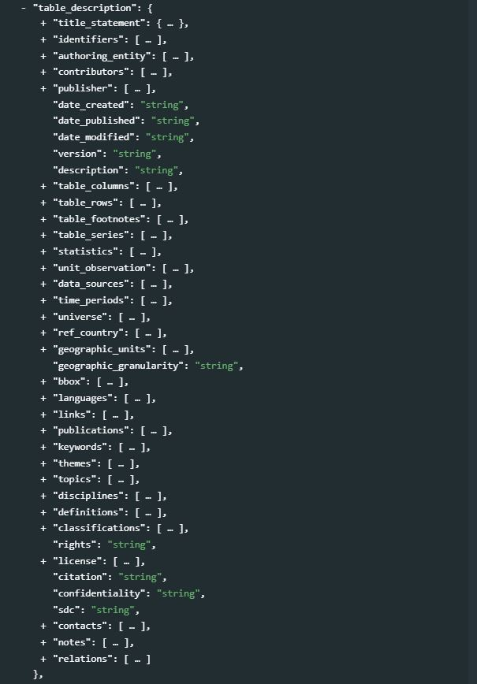
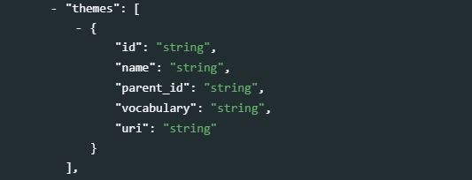
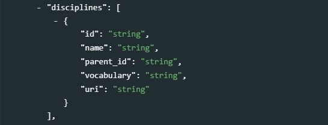
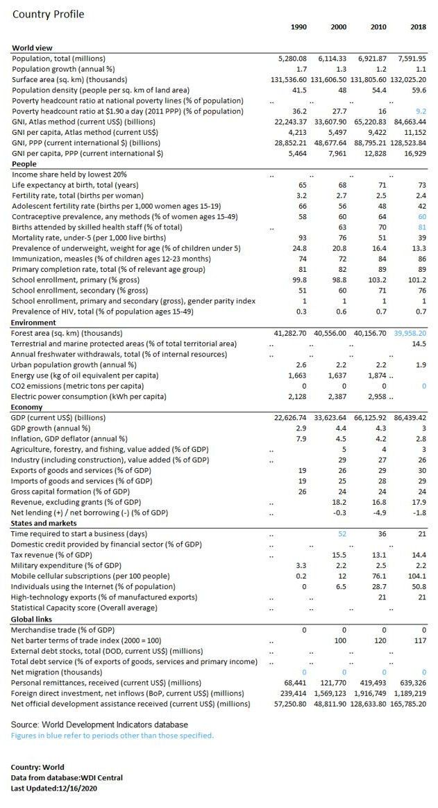

# Statistical tables {#chapter08}

<center>
{width=25%}  
</center>


## Introduction

A statistical table (*cross tabulation* or *contingency table*) is a summary presentation of data. The [OECD Glossary of Statistical Terms](https://stats.oecd.org/glossary/) defines it as “observation data gained by a purposeful aggregation of statistical microdata conforming to statistical methodology [organized in] groups or aggregates, such as counts, means, or frequencies.” 

Tables are produced as an array of rows and columns that display numeric aggregates in a clearly labeled fashion. They may have a complex structure and become quite elaborate. They are typically found in publications such as statistical yearbooks, census and survey reports, research papers, or published on-line. 

Statistical tables can be understood by a broad audience. In some cases, they may be the only publicly-available output of a data collection activity. Even when other output is available --such as microdata, dashboards, or databases accessible via user interfaces or APIs-- statistical tables are an important component of data dissemination. It is thus important to make tables as discoverable as possible. The schema described in this chapter was designed to structure and foster the comprehensiveness of information on tables by rendering the pertinent metadata into a structured, machine-readable format. It is intended for the purpose of improving data discoverability. The schema is not intended to store information to programmatically re-create tables.

The schema description is available at http://dev.ihsn.org/nada/api-documentation/catalog-admin/index.html#tag/Tables


## Anatomy of a table

The figure below, adapted from [LabWrite Resources](https://labwrite.ncsu.edu/res/gh/gh-tables.html), provides an illustration of what statistical tables typically look like. The main parts of a table are highlighted. They provide a content structure for the metadata schema we describe in this chapter. 

<center>
{width=100%}
</center>

**Table number and title**: Every table must have a title, and should have a number. Tables in yearbooks, report and papers are usually numbered in the order that they are referred to in the document. They can be numbered sequentially (Table 1, Table 2, and so on), by chapter (Table 1.1, Table 1.2, Table 2.1, ...), or based on other reference system. The Table number typically precedes the table title. The title provides a description of the contents of the table. It should be concise and include the key elements shown in the table. 

**Column spanner, column heads, and stub head**: The column headings (and sub-headings) identify what data are listed in the table in a vertical arrangement. A column heading placed above the leftmost column is often referred to as the *stubhead*, and the column is the *stub column*. A heading that sits above two or more columns to indicate a certain grouping is referred to as a *column spanner*. 

**Stubs**: The horizontal headings and sub-headings of the rows are called *row captions*. Together, they form the *stub*. 

**Table body**: The actual data (values) in a table (containing for example percentages, means, or counts of certain variables) form the *table body*.

**Table spanner**: A table spanner is located in the body of the table in order to divide the data in a table without changing the columns. Spanners go the entire length of the table. 

**Table notes**: Table notes are used to provide information that is not self-explanatory (e.g., to provide the expanded form of acronyms used in row or column captions). 

**Table source**: The source identifies the dataset(s) or database(s) that contain the data used to generate the table. This can for example be a survey or a census dataset.  


## Schema description

The table schema contains six blocks of elements. The first block of three elements (`repository_id`, `published`, and `overwrite`) do not describe the table, but are used by the NADA cataloguing application to determine where and how the table metadata is published in the catalog. The second block, `metadata_information`, contains "metadata on the metadata" and is used mainly for archiving purpose. The third block, `table_description`, contains the elements used to describe the table and its production process. A fourth block `provenance`, is used to document the origin of metadata that may be harvested from other catalogs. The block `tags` is used to add information (in the form of words or short phrases) that will be useful to create *facets* in the a catalog user interface. Last, an empty block `additional` is provided as a container for additional metadata elements that users may want to create. 
<br>
{width=100%}
<br>

### Cataloguing parameters

The following elements are used by the NADA application API (see the NADA documentation for more information):

- **`repositoryid`**: A NADA catalog can be composed of multiple *collections*. The *repositoryid* element identifies in which collection the table will be published. This collection must have been previously created in the catalog. By default, the table will be published in the `central` catalog (i.e. in no particular collection).  

- **`published`**: The NADA catalog allows tables to be published (in which case they will be visible to users of the catalog) or unpublished (in which case they will only be visible by administrators). The default value is 0 (unpublished). Code 1 is used to set the status to "published".  

- **`overwrite`**: This element defines what action will be taken when a command is issued to add the table to a catalog and a table with the same identifier (element *idno*) is already in the catalog. By default, the command will not overwrite the existing table (the default value of overwrite is "no"). Set this parameter to "yes" to allow the existing table to be overwritten in the catalog.


### Metadata information 

**`metadata_information`** *[Optional, Not Repeatable]* <br>
The `metadata_information` block is used to document the table metadata (not the table itself). It provides information on the process of generating the table metadata. This block is optional. The information it contains is useful to catalog administrators, not to the public. It is however recommended to enter at least the identification of the metadata producer, her/his affiliation, and the date the metadata were created. One reason for this is that metadata can be shared and harvested across catalogs/organizations, so the metadata produced by one organization can be found in other data centers (complying with standards and schema is precisely intended to facilitate inter-operability of catalogs and automated information sharing).
<br>
{width=100%}
<br>

- **`idno`** *[Optional, Not Repeatable, String]* <br> 
A unique identifier for the metadata document (the *metadata document* is the JSON file containing the table metadata). This is different from the table unique identifier (see section `title_statement` below), although the same identifier can be used, and it is good practice to generate IDs that would maintain an easy connection between the metadata IDNO and the table IDNO. For example, if the unique ID of the table is "TBL_0001", the IDNO in the metadata_information could be "META_TBL_001".

- **`producers`** *[Optional, Repeatable]* <br>
This refers to the producer(s) of the table <u>metadata</u>, not to the producer(s) of the table. This could for example be the data curator in a data center. Four elements can be used to provide information on the metadata producer(s):

   - **`name`** *[Optional, Not Repeatable, String]* <br>
   The name of the metadata producer/curator. An alternative to entering the name of the curator (e.g. for privacy protection purpose) is to enter the curator identifier (see the element *abbr* below) 
   - **`abbr`** *[Optional, Not Repeatable, String]* <br>
   This element can be used to provide an identifier of the metadata producer/curator mentioned in `name`.
   - **`affiliation`** *[Optional, Not Repeatable, String]* <br>
   The affiliation of the metadata producer/curator mentioned in `name`.
   - **`role`** *[Optional, Not Repeatable, String]* <br>
   The specific role of the metadata producer/curator mentioned in `name` (applicable when more than one person was involved in the production of the metadata).

- **`production_date`** *[Optional, Not Repeatable, String]* <br>
The date the metadata (not the table) was produced. The date will preferably be entered in ISO 8601 format (YYYY-MM-DD).

- **`version`** *[Optional, Not Repeatable, String]* <br>
The version of the metadata (not the version of the table). 

> Example in R:

```{r, eval=F, echo=T}
my_table = list(
  # ... ,
  metadata_information = list(
    idno = "META_TBL_POP_PC2001_02-01", 
    producers = list(
      list(name = "John Doe",
           affiliation = "National Data Center of Popstan")
      ),
    production_date = "2020-12-27",
    version = "version 1.0"
  ),
  # ... 
)
```


### Table description

**`table_description`** *[Required, Not Repeatable]* <br>
This section contains the metadata elements that describe the table itself. Not all elements will be required to fully document a table, but efforts should be made to provide as much and as detailed information as possible, as richer metadata will make the table more discoverable. 
<br>
{width=100%}
<br>

- **`title_statement`** *[Required, Not Repeatable]* <br>
   <br>
   {width=100%}
   <br>
   - **`idno`** *[Required, Not Repeatable, String]* <br>
   A unique identifier to the table. Do not include spaces in the `idno`. This identifier must be unique to the catalog in which the table will be published. Some organizations have their own system to assign unique identifiers to tables. Ideally, an identifier that guarantees uniqueness globally will be used, such as a Digital Object Identifier (DOI) or an ISBN number. Note that a table may have more than one identifier. In such case, the element `idno` (as a non-repeatable element) will contain the main identifier (as selected as the "reference" one by the catalog administrator). The other identifiers will be provided in the element `identifiers` (see below).<br>
    - **`table_number`** *[Optional, Not Repeatable, String]* <br>
    The table number. The table number will usually begin with the word “Table” followed by a numeric identifier such as: Table 1 or Table 2.1 etc. Different publications may use different ways to reference a table. This is particularly the case for publications that are part of a standard survey program and have well-defined table templates. The following are different ways to number a table:
    
        | Type            | Description                           |
        | --------------- | ------------------------------------- |
        |	Sequential      | This is a sequential number given to each table produced and appearing within the publication (e.g., Table 1, Table 2 to Table n). |
        | Thematic        | Provides a numbering scheme based on the theme and a sequential number |
        |	Chapter         | The tables can be numbered according to the chapter and then a sequential reference within that reference such as: Table 1.1 or Table 3.5 etc. |
        |	Annex           | Tables in an annex will usually be given a letter number referring to the annex and a sequential number such as Table A.1 or Table B.3. |
        | Note            | A table number is usually set apart from the title with a colon. The word “Table” should never abbreviated. |
<br>
   - **`title`** *[Required, Not Repeatable, String]* <br>
   The title of the table. The title provides a brief description of the content of the table. It should be concise and include the key elements shown in the table. There are varying styles for writing a table title. A consistent style should be applied to all tables published in a catalog. <br>

    - **`sub_title`** *[Optional, Not Repeatable, String]* <br>
    A subtitle can provide further descriptive or explanatory content to the table. 
    
    - **`alternate_title`** *[Optional, Not Repeatable, String]* <br>
    The alternate title element is usually used to provide a translation of the title in countries where more than one official language is used or if a publication is widely disseminated in two languages. 
   
    - **`abbreviated_title`** *[Optional, Not Repeatable, String]* <br>
    An abbreviated title (seldom used). <br>
    
     > Example in R:

    ```{r, eval=F, echo=T}
    my_table = list(
      # ... 
      table_description = list(
            title_statement = list(
               idno         = "EXAMPLE_TBL_001",
               table_number = "Table 1.0",
               title        = "Resident population by age group, sex, and area of residence, 2020",
               sub_title    = "District of X, as of June 30",
               alternate_title = "Population residente par groupe d'âge, sexe et zone de residence, 2020 (District X, au 30 juin)"
            ),
            # ...
      )
    )
    
    ```

- **`identifiers`** *[Optional ; Repeatable]* <br>
This element is used to enter document identifiers other than the catalog identifier entered in the `title_statement` (`idno`). It can for example be a Digital Object Identifier (DOI). The identifier entered in the `title_statement` can be repeated here (the `title_statement` does not provide a `type` parameter; if a DOI or other standard reference ID is used as `idno`, it is recommended to repeat it here with the identification of its `type`).
    <br>
    {width=100%}
    <br>
    - **`type`** *[Optional, Not Repeatable, String]* <br>
    The type of unique ID, e.g. "DOI".
    - **`value`** *[Required, Not Repeatable, String]* <br>
    The identifier itself. <br><br>

    > Example in R:

    ```{r, eval=F, echo=T}
    my_table = list(
      # ... ,
      table_description = list(
            # ... ,
            identifiers = list(
              type  = "DOI",
              value = "XXX.XXX.XXXX"
            ),
      # ...
      )
    )
    ```

- **`authoring_entity`** *[Optional, Not Repeatable]* <br>
The authoring entity identifies the person(s) or organization(s) responsible for the production of the table. An authoring entity is identified by its name, affiliation, abbreviation, URI, and author's identifiers (if any).
   <br>
   {width=100%}
   <br>
   - **`name`** *[Optional, Not Repeatable, String]* <br>
   The name of person(s) or organization responsible for the production and content of the table.
   - **`affiliation`** *[Optional, Not Repeatable, String]* <br>
   The affiliation of the person(s) or organization(s) mentioned in `name`.
   - **`abbreviation`** *[Optional, Not Repeatable, String]* <br>
   The abbreviation (acronym) of the organization mentioned in `name`.
   - **`uri`** *[Optional, Not Repeatable, String]* <br>
   The URI can be a link to the website, or the email address, of the authoring entity mentioned in `name`. <br>
   - **`author_id`** *[Optional ; Repeatable]* <br>
  The author identifier in a registry of academic researchers such as the [Open Researcher and Contributor ID (ORCID)](https://orcid.org/). <br>
     - **`type`** *[Optional ; Not repeatable ; String]* <br>
     The type of identifier, i.e. the identification of the registry that assigned the author's identifier, e.g. "ORCID". <br>
     - **`id`** *[Optional ; Not repeatable ; String]* <br>
     The identifier of the author in the registry mentioned in `type`. 
   <br>

    > Example in R:

    ```{r, eval=F, echo=T}
    my_table = list(
      # ... ,
      table_description = list(
            # ... ,
            authoring_entity = list(
              name         = "John Doe",
              affiliation  = "National Research Center, Popstan",
              abbreviation = "NRC",
              uri          = "www. ...",
              author_id = list(
                list(type = "ORCID", id = "XYZ123")
              )
            ),  
            # ...
      )
    )
    ```

- **`contributors`** *[Optional, Repeatable]* <br>
This set of elements identifies the person(s) and/or organization(s), other than the authoring entity, who contributed to the production of the table.<br>
    <br>
    {width=100%}
    <br>
    - **`name`** *[Optional, Not Repeatable, String]* <br>
    The name of the contributor (person or organization). 
    - **`affiliation`** *[Optional, Not Repeatable, String]* <br>
    The affiliation of the contributor mentioned in `name`. This could be a government agency, a university or a department in a university, etc.
    - **`abbreviation`** *[Optional, Not Repeatable, String]* <br>
    The abbreviation for the institution which has been listed as the affiliation of the contributor.     
    - **`role`** *[Optional, Not Repeatable, String]* <br>
    The specific role of the contributor mentioned in `name`. This could for example be ""Research assistant", "Technical specialist", "Programmer", or "Reviewer".
    - **`uri`** *[Optional, Not Repeatable, String]* <br>
    A URI (link to a website, or email address) for the contributor mentioned in `name`. <br><br>

    > Example in R:

    ```{r, eval=F, echo=T}
    my_table = list(
      # ... ,
      table_description = list(
            # ... ,
            contributors = list(
              name         = "John Doe",
              affiliation  = "National Research Center",
              abbreviation = "NRC",
              role         = "Research assistant; Stata programming",
              uri          = "www. ..."
            ),  
            # ...
      )
    )
    ```


- **`publisher`** *[Optional, Not repeatable]* <br>
The entity responsible for publishing the table. 
    <br>
    {width=100%}
    <br>
    - **`name`** *[Optional, Not Repeatable, String]* <br>
    The name of the publisher (person or organization). 
    - **`affiliation`** *[Optional, Not Repeatable, String]* <br>
    The affiliation of the publisher. This could be a government agency, a university or a department in a university, etc.
    - **`abbreviation`** *[Optional, Not Repeatable, String]* <br>
    The abbreviation for the institution which has been listed as the affiliation of the publisher.
    - **`role`** *[Optional, Not Repeatable, String]* <br>
    The specific role of the publisher (this element is unlikely to be used as the role is obvious).
    - **`uri`** *[Optional, Not Repeatable, String]* <br>
    A URI (link to a website, or email address) of the publisher. <br><br>

    > Example in R:

    ```{r, eval=F, echo=T}
    my_table = list(
      # ... ,
      table_description = list(
            # ... ,
            publisher = list(
              name = "National Statistics Office, Publishing Department",
              affiliation = "Ministry of Planning, National Statistics Office",
              abbreviation = "NSO",
              uri = "www. ..."
            ),  
            # ...
      )
    )
    ```


- **`date_created`** *[Optional, Not Repeatable, String]* <br>
The date the table was created. It is recommended to enter the date in ISO 8601 format (YYYY-MM-DD or YYYY-MM or YYYY). The date the table is created refers to the date that the output was produced and considered ready for publication.
<br>
{width=100%}
<br>

- **`date_published`** *[Optional, Not Repeatable, String]* <br>
The date the table was published. It is recommended to enter the date in ISO 8601 format (YYYY-MM-DD or YYYY-MM or YYYY). If the table is contained in a document (report, paper, book, etc.), the date the table is published is associated with the publication date of that document. If the table is found in a statistics yearbook for example, then the publication date will be the date the yearbook is published. 
<br>
{width=100%}
<br>

- **`date_modified`** *[Optional, Not Repeatable, String]* <br>
The date the table was last modified. It is recommended to enter the date in ISO 8601 format (YYYY-MM-DD or YYYY-MM or YYYY). Modifications, revisions, or re-publications of the table are recorded in this element.
<br>
{width=100%}
<br>

- **`version`** *[Optional, Not Repeatable, String]* <br>
The version of the table refers to the published version of the table. If for some reason, data in a published table are revised, then the version of the table is captured in this element.
<br>
{width=100%}
<br>

- **`description`** *[Optional, Not Repeatable, String]* <br>
A brief "narrative" description of the table. The description can contain information on the content, purpose, production process, or other relevant information.
<br>
{width=100%}
<br>

  > Example in R:
    
    ```{r, eval=F, echo=T}
    my_table = list(
      # ... ,
      table_description = list(
            # ... ,
            date_created = "2020-06-15",
            date_published = "2020-10-30",
            version = "Version 1.0",
            description = "The table is part of a series of tables extracted from the Population Census 2020 dataset. It presents counts of resident population by type of disability, sex, and age group, by province and at the national level. The data were collected in compliance with questions from the Washington Group.",
            # ...
      )
    )
    ```

- **`table_columns`** *[Optional, Repeatable]* <br>
The columns description is composed of the column spanner and the column heads. Columns spanners group the column heads together in a logical fashion to present the data to the user. Not all columns presented in a table will have a column spanner. The column spanners can become quite complicated; when a table is documented, the information found in the column spanner and heads can be merged and edited. What matters is not to document the exact structure of the table, but to ensure that the text of the spanners and heads is included in the metadata as this text will be used by search engines to find tables in data catalogs.
    <br>
    {width=100%}  
    <br>
    - **`label`** *[Required, Not Repeatable, String]* <br>
    The labels of the table columns (or *column captions*) are vital for discoverability. The column labels will include both column spanners and column headers. Columns spanners are captions that join various column headers together. 
    - **`var_name`** *[Optional, Not Repeatable, String* <br>
    This refers to the name of the variables found in the dataset (typically microdata) used to produce the table. The objective of this optional field is to help establish a link between the source dataset and the table, to foster reproducibility.    
    - **`dataset`** *[Optional, Not Repeatable, String]* <br>
    This refers to the dataset (typically microdata) used to produce the table. If the dataset is available in a catalog and has a unique identifier (DOI or other), this identifier can be entered here. Alternatively, the title of the dataset or a permanent URI can be provided.<br><br>

    > Example in R: 
    
    The column captions of the following table can be documented in the following manner: 
    <br>
    {width=100%}
    <br>
    
    ```{r, eval=F, echo=T}
    my_table = list(
      # ... ,
      table_description = list(
            # ... ,
            table_columns = list(
              
              list(label = "Area of residence: National (total)", 
                   var_name = "urbrur", dataset = "pop_census_2020_v01"),
              
              list(label = "Area of residence: Urban", 
                   var_name = "urbrur", dataset = "pop_census_2020_v01"),
              
              list(label = "Area of residence: Rural", 
                   var_name = "urbrur", dataset = "pop_census_2020_v01"),
              
              list(label = "Sex: total", 
                   var_name = "sex", dataset = "pop_census_2020_v01")
              
              list(label = "Sex: male", 
                   var_name = "sex", dataset = "pop_census_2020_v01")
              
              list(label = "Sex: female", 
                   var_name = "sex", dataset = "pop_census_2020_v01")
              
            ),  
            # ...
      )
    )
    ```

    Or, in a more concise but also valid version:

    ```{r, eval=F, echo=T}
    my_table = list(
      # ... ,
      table_description = list(
            # ... ,
            table_columns = list(
              
              list(label = "Area of residence: national (total) / urban / rural",
                   var_name = "urbrur", dataset = "pop_census_2020_v01"),
              
              list(label = "Sex: total / male / female", 
                   var_name = "sex", dataset = "pop_census_2020_v01")
              
            ),  
            # ...
      )
    )
    ```

- **`table_rows`** *[Required, Not Repeatable, String]* <br> 
Like the column spanner and column heads, the `table_rows` section is composed of the stub head and stubs (*row captions*). The stubs are the captions of the rows of data and the stub head is the label that groups the rows together in a logical fashion. As for `table_columns`, the information found in the stubs can be merged and edited to be optimized for clarity and discoverability.
    <br>
    {width=100%}  
    <br>
    - **`label`** *[Required, Not Repeatable, String]* <br>
    As with the column labels, the content in this `row_label` is designed to include the stub head, stubs and any captions included. 
    - **`var_name`** *[Optional, Not Repeatable, String]* <br>
    As with the column variables, this optional element is reserved to identify those variables found in the source dataset that are associated with the row of data.
    - **`dataset`** *[Optional, Not Repeatable, String]* <br>
    This refers to the dataset (typically microdata) used to produce the table. If the dataset is available in a catalog and has a unique identifier (DOI or other), this identifier can be entered here. Alternatively, the title of the dataset or a permanent URI can be provided. Note also that the schema provides a `data_sources` element (see below) to describe in more detail the sources of data. The content of the `dataset` element must be compatible with the information provided in that other element.<br><br>

    > Example (using the same table as for `table_columns`):
    
    ```{r, eval=F, echo=T}
    my_table = list(
      # ... ,
      
      table_description = list(
        # ... ,
        
        table_rows = list(
          
          list(label    = "Age group; 0-4 years",
               var_name = "age", dataset  = "pop_census_2020_v01"),
          
          list(label    = "Age group; 5-9 years",
               var_name = "age",
               dataset  = "pop_census_2020_v01"),
          
          list(label    = "Age group; 10-14 years",
               var_name = "age", 
               dataset  = "pop_census_2020_v01"),
          
          list(label = "Age group; 15-19 years",
               var_name = "age", 
               dataset  = "pop_census_2020_v01")
          
        ),  
        # ...
      )
    )
    ```
    
    The same information can be provided in a more concise version as follows:
    
    ```{r, eval=F, echo=T}
    my_table = list(
      # ... ,
      table_description = list(
        # ... ,
        table_rows = list(
          list(label = "Age group; 0-4 years, 5-9 years, 10-14 years, 15-19 years",
               var_name = "age", 
               dataset = "pop_census_2020_v01")
        ),  
        # ...
      )
    )
    ```

- **`table_footnotes`** *[Optional, Repeatable]* <br>
Footnotes provide additional clarity. They may for example be used to assure that the user is aware of conditions and exceptions that may apply to a table. Footnotes may include statements of missing data, imputation of data, or other content that is not included in the body of the publication. 
    <br>
    {width=100%}
    <br>
    - **`number`** *[Optional, Not Repeatable, String]* <br>
    A sequential number is usually given to the footnotes, which starts with 1 for each table.
    - **`text`** *[Required, Not Repeatable, String]* <br>
    The text of the footnote. <br><br>

    > Example in R:

    ```{r, eval=F, echo=T}
    my_table = list(
      # ... ,
      table_description = list(
        # ... ,
        
        table_footnotes = list(
          
          list(number = "1", 
               text = "Data refer to the resident population only."),
          
          list(number = "2", 
               text = "Figures for the district of X have been imputed.")
          
        ),  
        
        # ...
      )
    )
    ```

- **`table_series`** *[Optional, Repeatable]* <br>
Table series may be organized into series, typically by theme.
    <br>
    {width=100%}
    <br>
    - **`name`** *[Optional, Not Repeatable, String]* <br>
    The name (label) of the series.
    - **`maintainer`** *[Optional, Not Repeatable, String]* <br>
    The person or organization in charge of maintaining the series. This will often be the same person/organization that produce and publish the table. This optional element will often be ignored. 
    - **`uri`** *[Optional, Not Repeatable, String]* <br>
    A URI to the series information. This optional element will often be ignored.
    - **`description`** *[Optional, Not Repeatable, String]* <br>
    A description of the series.<br><br>

    > Example in R:

    ```{r, eval=F, echo=T}
    my_table = list(
      # ... ,
      table_description = list(
        # ... ,
        
        table_series = list(
          
          list(name = "Population Census - Age distribution", 
               description = "Series 1 - Tables on demographic composition of the population")
          
        ),  
        
        # ...
      )
    )
    ```

- **`statistics`** *[Optional, Repeatable]* <br>
The table metadata will not contain data. What the `statistics` element refers to is the <u>type of statistics</u> included in the table. Some tables may only contain counts, such as a table of population by age group and sex (which shows counts of persons; other tables could be counts of households, facilities, or any other observation unit). But statistical tables can contain many other types of summary statistics. This element is used to list these types of statistics. 
    <br>
    {width=100%}
    <br>
    - **`value`** *[Required, Not Repeatable, String]* <br>
    The use of a controlled vocabulary is recommended. This list could contain (but does not have to be limited to):
        - Count (frequencies)
        - Number of missing values
        - Mean (average)
        - Median
        - Mode
        - Minimum value
        - Maximum value
        - Range
        - Standard deviation
        - Variance
        - Confidence interval (95%) - Lower limit
        - Confidence interval (95%) - Upper limit
        - Standard error
        - Sum
        - Inter-quartile Range (IQR)
        - Percentile (possibly with specification, e,g, "10th percentile")
        - Mean Absolute Deviation
        - Mean Absolute Deviation from the Median (MADM)
        - Coefficient of Variation (COV)
        - Coefficient of Dispersion (COD)
        - Skewness
        - Kurtosis
        - Entropy
        - Regression coefficient
        - R-squared 
        - Adjusted R-squared
        - Z-score
        - Accuracy
        - Precision
        - Mean squared logarithmic error (MSLE)
        <br><br>

    > Example in R for a table showing the distribution of the population by age goup and sex, and the mean age by sex

    ```{r, eval=F, echo=T}
    my_table = list(
      # ... ,
      table_description = list(
        # ... ,
        statistics = list(
          list(value = "count"),
          list(value = "mean")
        ),  
        # ...
      )
    )
    ```

- **`unit_observation`** *[Optional, Repeatable]* <br>
The element provides information on the unit(s) of observations that correspond to the values shown in the table.
    <br>
    {width=100%}
    <br>
    - **`value`** *[Required, Not repeatable, String]*
    The `value` is not a numeric value; it is the label (description) of the observation unit, e.g, "individual" or "person", "household", "dwelling", enterprise, "country", etc. <br><br>

    > Example in R:

    ```{r, eval=F, echo=T}
    my_table = list(
      # ... ,
      table_description = list(
        # ... ,
        unit_observation = list(
          list(value = "individual")
        ),  
        # ...
      )
    )
    ```

- **`data_sources`** *[Optional, Repeatable]* <br>     
The data sources are often cited in the footnote section of a table. The `name`, `source_id`, and `link` elements are optional, but at least one of them must be provided.
  <br>
  {width=100%}
  <br>
    - **`name`** *[Optional, Not repeatable, String]* <br>
    The name (title) of the data source. For example, a table data may be extracted from the "Population Census 2020".  
    - **`abbreviation`** *[Optional, Not repeatable, String]* <br>
    The abbreviation (acronym) of the data source. 
    - **`source_id`** *[Optional, Not repeatable, String]*  
    A unique identifier for the source, such as a Digital Object Identifier (DOI).
    - **`note`** *[Optional, Not repeatable, String]* <br>
    A note that describes how the source was used, possibly mentioning issues in the use of the source.
    - **`uri`** *[Optional, Not repeatable, String]* <br>
    A link (URL) to the source dataset.
    <br>

    

  > Example in R: 

    ```{r, eval=F, echo=T}
    my_table = list(
      # ... ,
      table_description = list(
        # ... ,
        data_sources = list(
          list(source = "Population and Housing Census 2020",
               abbreviation = "PHC 2020",
               source_id = "ABC_PHC_2020_PUF"
          )
        ),  
        # ...
      )
    )
    ```

- **`time_periods`** *[Optional, Repeatable]* <br>
The time periods consists of a list or periods (range of years / quarters / months / days) that the data relate to, preferably entered in ISO 8601 format (YYYY, or YYYY-MM, or YYYY-MM-DD). If the data are by quarter, convert them into ISO 8601 format (e.g., first quarter of 2020 would be "from 2020-01 to 2020-03). This is a repeatable field. If the time periods are for example 1990, 2000 to 2004, and 2014 to June 2019, do not enter the time period as a single range 1990-2019 as this would include irrelevant periods. It should be entered as three separate ranges as in the example below. For data that are related to a specific date (for example, the population of a country as of the census day), enter the date in both the `from` and `to` fields.
    <br>
    {width=100%}
    <br>
   - **`from`** *[Required, Not repeatable, String]* <br>
   The start date of the time period covered by the table, preferably entered in ISO 8601 format (YYYY, or YYYY-MM, or YYYY-MM-DD).   
   - **`to`** *[Required, Not repeatable, String]* <br>
   The end date of the time period covered by the table, preferably entered in ISO 8601 format (YYYY, or YYYY-MM, or YYYY-MM-DD).

    > Example in R:

    ```{r, eval=F, echo=T}
    my_table = list(
      # ... ,
      table_description = list(
        # ... ,
        
        time_periods = list(
          list(from = "1990", to = "1990"),
          list(from = "2000", to = "2004"),
          list(from = "2014", to = "2019-06")
        ),  
        
        # ...
      )
    )
    ```

- **`universe`** *[Optional, Repeatable]* <br>
The universe of a table refers to the population (or *respondents*) covered in the data. It does not have to be a population of individuals; it can for example be a population of households, facilities, firms, groups of persons, or even objects. The description of the universe should clearly inform the data users of inclusions and exclusions that they may not expect.
   <br>
   {width=100%}
   <br>
   - **`value`** *[Required, Not repeatable, String]* <br>
   A textual description of the universe covered by the data.
   
   > Example in R:

    ```{r, eval=F, echo=T}
    my_table = list(
      # ... ,
      table_description = list(
        # ... ,
        universe = list(
          list(value = "Resident male population aged 0 to 6 years; this excludes visitors and people present in the country under a diplomatic status.
               Nomadic and homeless populations are included.")
        ),  
        # ...
      )
    )
    ```

- **`ref_country`** *[Optional, Repeatable]* <br>
This element is used to document the list of countries for which data are in the table. This element serves to assure that the country name and code are easily discoverable and contribute to a virtual national catalog. If the table only refers to part of a country (for example a city), the `ref_country` field should still be filled. Another element called `geographic_units`is provided (see below) to capture more detailed information on the table's geographic coverage. 
    <br>
    {width=100%}
    <br>
    - **`name`** *[Required, Not repeatable, String]* <br>
    The name of a country for which data are in the table. 
    - **`code`** *[Required, Not repeatable, String]* <br>
    The code of the country mentioned in `name`, preferably an [ISO 3166 country code](https://en.wikipedia.org/wiki/ISO_3166-1). <br> 

- **`geographic_units`** *[Optional, Repeatable]* <br>
An itemized list of geographic areas covered by the data in the table, other than the country/countries that must be entered in `ref_country`.
    <br>
    {width=100%}
    <br>
    - **`name`** *[Required, Not repeatable, String]* <br>
    The name of the geographic unit.
    - **`code`** *[Optional, Not repeatable, String]* <br>
    The code of the geographic unit mentioned in `name`. 
    - **`type`** *[Optional, Not repeatable, String]* <br> 
    The type of geographic unit mentioned in `name` (e.g., "State", "Province", "Town", "Region", etc.)<br><br>

    > Example in R:
    
    ```{r, eval=F, echo=T}
    my_table = list(
      # ... ,
      table_description = list(
        # ... ,
        
        ref_country = list(
          list(name = "Malawi", code = "MWI")
        ),  
        
        geographic_units = list(
          list(name = "Northern", type = "region"),
          list(name = "Central",  type = "region"),
          list(name = "Southern", type = "region"),
          list(name = "Lilongwe", type = "town"),
          list(name = "Mzuzu",    type = "town"),
          list(name = "Blantyre", type = "town")
        ),
        
        # ...
      )
    )
    ```

- **`geographic_granularity`** *[Optional, Not repeatable, String]* <br>
A description of the geographic levels for which data are presented in the table. This is not a list of specific geographic areas, but a list of the administrative <u>level(s)</u> that correspond to these geographic areas. <br>
    <br>
    {width=100%}
    <br>

    > Example in R: For a table showing the population of a country by State, district, and sub-district (+ total)

    ```{r, eval=F, echo=T}
    my_table = list(
      # ... ,
      table_description = list(
        # ... ,
        ref_country = list(
          list(name = "India", code = "IND")
        ),  
        
        geographic_granularity = "national, state (admin 1), district (admin 2), sub-district (admin 3)",
        
        # ...
      )
    )
    ```

- **`bbox`** *[Optional ; Repeatable]* <br>
Bounding boxes are typically used for geographic datasets to indicate the geographic coverage of the data, but can be provided for tables as well, although this will rarely be done. A geographic bounding box defines a rectangular geographic area.
<br>
{width=100%}
<br>
    - **`west`** *[Required ; Not repeatable ; String]* <br>
    Western geographic parameter of the bounding box.
    - **`east`** *[Required ; Not repeatable ; String]* <br>
    Eastern geographic parameter of the bounding box.
    - **`south`** *[Required ; Not repeatable ; String]* <br>
    Southern geographic parameter of the bounding box.
    - **`north`** *[Required ; Not repeatable ; String]* <br>
    Northern geographic parameter of the bounding box.

- **`languages`** *[Optional, Repeatable]* <br>
Most tables will only be provided in one language. This is however a repeatable field, to allow for more than one language to be listed.
    <br>
    {width=100%}
    <br>
    - **`name`** *[Required, Not repeatable, String]* <br>
    The name of the language(s) in which the table is published, preferably extracted from the [ISO 639 standardized nomenclature of languages](https://en.wikipedia.org/wiki/List_of_ISO_639-1_codes).  
    - **`code`** *[Optional, Not repeatable, String]* <br>
    The code of the language, preferably from the [ISO 639 code list](https://en.wikipedia.org/wiki/List_of_ISO_639-1_codes). 

    > Example in R:

    ```{r, eval=F, echo=T}
    my_table = list(
      # ... ,
      table_description = list(
        # ... ,
        
        languages = list(
          list(name = "English", code = "EN"),
          list(name = "French",  code = "FR")
        ),  
        
        # ...
      )
    )
    ```

- **`links`** *[Optional, Repeatable]* <br>
A list of associated links related to the table.
    <br>
    {width=100%}
    <br>
    - **`uri`** *[Required, Not repeatable, String]* <br>
    The URI to an external resource.
    - **`description`** *[Optional, Not repeatable, String]* <br>
    A brief description of the resource. <br><br>

    > Example in R: For a table extracted from the Gambia Demographic and Health Survey 2019/2020 Report, the links could be the following:

    ```{r, eval=F, echo=T}
    my_table = list(
      # ... ,
      table_description = list(
        # ... ,
        
        links = list(
          
          list(uri = "https://dhsprogram.com/pubs/pdf/FR369/FR369.pdf", 
               description = "The Gambia, Demographic and Health Survey 2019/2020 Report"),
          
          list(uri = "https://dhsprogram.com/data/available-datasets.cfm", 
               description = "DHS microdata for The Gambia")
        
        ),  
        
        # ...
      )
    )
    ```

- **`publications`** *[Optional, Repeatable]* <br>
This element identifies the publication(s) where the table is published. This could for example be a Statistics Yearbook, a report, a paper, etc. <br>
    <br>
    {width=100%}
    <br>
    - **`title`** *[Required, Not repeatable, String]* <br>
    The title of the publication (including the producer and the year).
    - **`uri`** *[Optional, Not repeatable, String]* <br>
    A link to the publication.

    > Example in R:

    ```{r, eval=F, echo=T}
    my_table = list(
      # ... ,
      table_description = list(
        # ... , 
        
        publications = list(
          list(title = "United Nations Statistical Yearbook, Fifty-second issue, May 2023", 
               uri   = "https://www.un-ilibrary.org/content/books/9789210557566")
        ), 
        
        # ...
      )
    )
    ```

- **`keywords`** *[Optional ; Repeatable]* <br>
    <br>
    {width=100%}
    <br> 
A list of keywords that provide information on the core content of the table. Keywords provide a convenient solution to improve the discoverability of the table, as it allows terms and phrases not found in the table itself to be indexed and to make a table discoverable by text-based search engines. A controlled vocabulary will preferably be used (although not required), such as the [UNESCO Thesaurus](http://vocabularies.unesco.org/browser/thesaurus/en/). The list provided here can combine keywords from multiple controlled vocabularies, and user-defined keywords.  
    - **`name`** *[Required ; Not repeatable ; String]* <br>
    The keyword itself.
    - **`vocabulary`** *[Optional ; Not repeatable ; String]* <br>
    The controlled vocabulary (including version number or date) from which the keyword is extracted, if any.
    - **`uri`** *[Optional ; Not repeatable ; String]* <br>
    The URL of the controlled vocabulary from which the keyword is extracted, if any.<br><br>

  > Example in R:

    ```{r, eval=F, echo=T}
      my_table = list(
        # ... ,
        table_description = list(
          # ... ,
          
          keywords = list(
            list(name = "Migration", vocabulary = "Unesco Thesaurus (June 2021)", 
                 uri = "http://vocabularies.unesco.org/browser/thesaurus/en/page/concept427"),
            list(name = "Migrants", vocabulary = "Unesco Thesaurus (June 2021)", 
                 uri = "http://vocabularies.unesco.org/browser/thesaurus/en/page/concept427"),
            list(name = "Refugee", vocabulary = "Unesco Thesaurus (June 2021)", 
                 uri = "http://vocabularies.unesco.org/browser/thesaurus/en/page/concept427"),
            list(name = "Forced displacement"),
            list(name = "Forcibly displaced")
          ),
          
          # ...
        ),
        # ... 
      )  
    ``` 

 
- **`themes`** *[Optional ; Repeatable]* <br>
  <br>
  {width=100%}
  <br> 
A list of themes covered by the table. A controlled vocabulary will preferably be used. Note that `themes` will rarely be used as the elements `topics` and `disciplines` are more appropriate for most uses. This is a block of five fields:
    - **`id`** *[Optional ; Not repeatable ; String]* <br>
    The ID of the theme, taken from a controlled vocabulary.
    - **`name`** *[Required ; Not repeatable ; String]* <br>
    The name (label) of the theme, preferably taken from a controlled vocabulary.
    - **`parent_id`** *[Optional ; Not repeatable ; String]* <br>
    The parent ID of the theme (ID of the item one level up in the hierarchy), if a hierarchical controlled vocabulary is used.
    - **`vocabulary`** *[Optional ; Not repeatable ; String]* <br>
    The name (including version number) of the controlled vocabulary used, if any.
    - **`uri`** *[Optional ; Not repeatable ; String]* <br>
    The URL to the controlled vocabulary used, if any. <br>    

- **`topics`** *[Optional ; Repeatable]* <br>
  <br>
  {width=100%}
  <br> 
Information on the topics covered in the table. A controlled vocabulary will preferably be used, for example the [CESSDA Topics classification](https://vocabularies.cessda.eu/vocabulary/TopicClassification), a typology of topics available in 11 languages; or the [Journal of Economic Literature (JEL) Classification System](https://en.wikipedia.org/wiki/JEL_classification_codes), or the [World Bank topics classification](https://documents.worldbank.org/en/publication/documents-reports/docadvancesearch). Note that you may use more than one controlled vocabulary. 
This element is a block of five fields: 
    - **`id`** *[Optional ; Not repeatable ; String]* <br>
    The identifier of the topic, taken from a controlled vocabulary.
    - **`name`** *[Required ; Not repeatable ; String]* <br>
    The name (label) of the topic, preferably taken from a controlled vocabulary.
    - **`parent_id`** *[Optional ; Not repeatable ; String]* <br>
    The parent identifier of the topic (identifier of the item one level up in the hierarchy), if a hierarchical controlled vocabulary is used.
    - **`vocabulary`** *[Optional ; Not repeatable ; String]* <br>
    The name (including version number) of the controlled vocabulary used, if any.
    - **`uri`** *[Optional ; Not repeatable ; String]* <br>
    The URL to the controlled vocabulary used, if any. <br><br>

  > Example in R:

  ```{r, eval=F, echo=T}
    my_table <- list(
      # ... ,
      table_description = list(
        # ... ,
        
        topics = list(
          list(name = "Demography.Migration", 
               vocabulary = "CESSDA Topic Classification", 
               uri = "https://vocabularies.cessda.eu/vocabulary/TopicClassification"),
          list(name = "Demography.Censuses", 
               vocabulary = "CESSDA Topic Classification", 
               uri = "https://vocabularies.cessda.eu/vocabulary/TopicClassification"),
          list(id = "F22", 
               name = "International Migration", 
               parent_id = "F2 - International Factor Movements and International Business", 
               vocabulary = "JEL Classification System", 
               uri = "https://www.aeaweb.org/econlit/jelCodes.php?view=jel#J"),
          list(id = "O15", 
               name = "Human Resources - Human Development - Income Distribution - Migration", 
               parent_id = "O1 - Economic Development", 
               vocabulary = "JEL Classification System", 
               uri = "https://www.aeaweb.org/econlit/jelCodes.php?view=jel#J")
        ),
        
        # ...
      
      ),
      
    )  
  
  ```

- **`disciplines`** *[Optional ; Repeatable]* <br>   
  <br>
  {width=100%}
  <br> 
Information on the academic disciplines related to the content of the table. A controlled vocabulary will preferably be used, for example the one provided by the list of academic fields in [Wikipedia](https://en.wikipedia.org/wiki/List_of_academic_fields). 
This is a block of five elements: 
    - **`id`** *[Optional ; Not repeatable ; String]* <br>
    The identifier of the discipline, taken from a controlled vocabulary.
    - **`name`** *[Optional ; Not repeatable ; String]* <br>
    The name (label) of the discipline, preferably taken from a controlled vocabulary.
    - **`parent_id`** *[Optional ; Not repeatable ; String]* <br>
    The parent identifier of the discipline (identifier of the item one level up in the hierarchy), if a hierarchical controlled vocabulary is used.
    - **`vocabulary`** *[Optional ; Not repeatable ; String]* <br>
    The name (including version number) of the controlled vocabulary used, if any.
    - **`uri`** *[Optional ; Not repeatable ; String]* <br>
    The URL to the controlled vocabulary used, if any.<br><br>

  > Example in R: 
    
  ```{r, eval=F, echo=T}
    my_table <- list(
      # ... ,
      table_description = list(
        # ... ,  
        
        disciplines = list(
          
          list(name = "Economics", 
               vocabulary = "Wikipedia List of academic fields (as of 21 June 2021)", 
               uri = "https://en.wikipedia.org/wiki/List_of_academic_fields"),
               
          list(name = "Agricultural economics", 
               vocabulary = "Wikipedia List of academic fields (as of 21 June 2021)", 
               uri = "https://en.wikipedia.org/wiki/List_of_academic_fields"),
          
          list(name = "Econometrics", 
               vocabulary = "Wikipedia List of academic fields (as of 21 June 2021)", 
               uri = "https://en.wikipedia.org/wiki/List_of_academic_fields")
               
        ),
        
        # ...
      ),
      # ... 
    )  
  ```

- **`definitions`** *[Optional, Repeatable]*  <br>
Definitions or concepts covered by the table.
    <br>
    {width=100%}
    <br>
    - **`name`** *[Required, Not repeatable, String]*  <br>
    The name (or label) of the term, indicator, or concept being defined.
    - **`definition`** *[Required, Not repeatable, String]*  <br>
    The definition of the term, indicator, or concept.
    - **`uri`** *[Optional, Not repeatable, String]*  <br>
    A link to the source of the definition, or to a site providing a more detailed definition.<br><br>

    > Example in R, for a table on malnutrition that would include estimates of stunting and wasting prevalence:

    ```{r, eval=F, echo=T}
    my_table = list(
      # ... ,
      table_description = list(
        # ... ,
        definitions = list(
          
          list(name = "stunting", 
               definition = "Prevalence of stunting is the percentage of children under age 5 whose height for age is more than two standard deviations below the median for the international reference population ages 0-59 months. For children up to two years old height is measured by recumbent length. For older children height is measured by stature while standing. The data are based on the WHO's new child growth standards released in 2006.",
               uri = "https://data.worldbank.org/indicator/SH.STA.STNT.ZS?locations=1W"),
          
          list(name = "wasting", 
               definition = "Prevalence of wasting, male,is the proportion of boys under age 5 whose weight for height is more than two standard deviations below the median for the international reference population ages 0-59.", 
               uri = "https://data.worldbank.org/indicator/SH.STA.WAST.MA.ZS?locations=1W")
        
        ),  
        # ...
      )
    )
    ```

- **`classifications`** *[Optional, Repeatable]* <br>
The element is used to document the use of standard classifications (or "ontologies", or "taxonomies") in the table.
    <br>
    {width=100%}
    <br>
    - **`name`** *[Required, Not repeatable, String]* <br>
    Name (label) of the classification, ontology, or taxonomy.
    - **`version`** *[Optional, Not repeatable, String]* <br>
    Version of the classification, ontology, or taxonomy used in the table.
    - **`organization`** *[Optional, Not repeatable, String]* <br>
    Organization that is the custodian of the classification, ontology, or taxonomy.
    - **`uri`** *[Optional, Not repeatable, String]* <br>
    Link to an external resource where detailed information on the classification, ontology, or taxonomy can be obtained.
    <br>

    > Example in R:

    ```{r, eval=F, echo=T}
    my_table = list(
      # ... ,
      table_description = list(
        # ... ,
        
        classifications = list(
          
          list(name = "International Standard Classification of Occupations (ISCO)", 
               version = "ISCO-08", 
               organization = "International Labour Organization (ILO)",
               uri = "https://www.ilo.org/public/english/bureau/stat/isco/")
          
        ),  
        # ...
        
      )
      
    )
    ```

- **`rights`** *[Optional, Not repeatable, String]* <br>
Information on the rights or copyright that applies to the table.
<br>
{width=100%}
<br>

- **`license`** *[Optional, Repeatable]* <br>
A table may require a license to use or reproduce. This is done to protect the intellectual content of the research product. The licensing entity may be different from the researcher or the publisher. It is the entity which has the intellectual rights to the table (s) and would grant rights or restrictions on the reuse of the table.
    <br>
    {width=100%}
    <br>
    - **`name`** *[Required, Not repeatable, String]* <br>
    The name of the license".
    - **`uri`** *[Optional, Not repeatable, String]* <br>
    A link to a publicly-accessible description of the terms of the license.
    <br>

    > Example in R:

    ```{r, eval=F, echo=T}
    my_table = list(
      # ... ,
      table_description = list(
        # ... ,
        
        license = list(
          list(name = "Attribution 4.0 International (CC BY 4.0)", 
               uri = "https://creativecommons.org/licenses/by/4.0/")
        ), 
        
        # ...
      )
      
    )
    ```

- **`citation`** *[Optional, Not repeatable, String]* <br>
A citation requirement for the table (i.e. an indication of how the table should be cited in publications).
<br>
{width=100%}
<br>

- **`confidentiality`** *[Optional, Not repeatable, String]* <br>
A published table may be protected through a confidentiality agreement between the publisher and the researcher. It may also determine certain rights regarding the use of the research and the data presented to the table. The data may also present confidential information that is produced for selective audiences. This element is used to provide a statement on any limitations ore restrictions on use of the table based on confidential data or agreements.
<br>
{width=100%}
<br>

- **`sdc`** *[Optional, Not repeatable, String]* <br>  
Information on statistical disclosure control measures applied to the table. This can include cell suppression, or other techniques. Specialized packages have been developed for this purpose, like [*sdcTable: Methods for Statistical Disclosure Control in Tabular Data*](https://cran.r-project.org/web/packages/sdcTable/index.html) and https://cran.r-project.org/web/packages/sdcTable/sdcTable.pdf <br>
The information provided here should be such that it does not provide intruders with useful information for reverse-engineering the protection measures applied to the table.
<br>
{width=100%}
<br>

- **`contacts`** *[Optional, Repeatable]* <br>
Users of the data may need further clarification and information. This section may include the name-affiliation-email-URI of one or multiple contact persons. This block of elements will identify contact persons who can be used as resource persons regarding problems or questions raised by the user community. The URI attribute should be used to indicate a URN or URL for the homepage of the contact individual. The email attribute is used to indicate an email address for the contact individual. It is recommended to avoid putting the actual name of individuals. The information provided here should be valid for the long term. It is therefore preferable to identify contact persons by a title. The same applies for the email field. Ideally, a "generic" email address should be provided. It is easy to configure a mail server in such a way that all messages sent to the generic email address would be automatically forwarded to some staff members.
<br>
{width=75%}
<br>
    - **`name`** *[Required, Not repeatable, String]* <br>
    Name of a person or unit (such as a data help desk). It will usually be better to provide a title/function than the actual name of the person. Keep in mind that people do not stay forever in their position.
    - **`role`** *[Optional, Not repeatable, String]* <br>
    The specific role of `name`, in regards to supporting users. This element is used when multiple names are provided, to help users identify the most appropriate person or unit to contact. 
    - **`affiliation`** *[Optional, Not repeatable, String]* <br>
    Affiliation of the person/unit.
    - **`email`** *[Optional, Not repeatable, String]* <br>
    E-mail address of the person.
    - **`telephone`** *[Optional, Not repeatable, String]* <br>
    A phone number that can be called to obtain information or provide feedback on the table. This should never be a personal phone number; a corporate number (typically of a data help desk) should be provided.
    - **`uri`** *[Optional, Not repeatable, String]* <br>
    A link to a website where contact information for `name` can be found.<br>

    > Example in R:

    ```{r, eval=F, echo=T}
    my_table = list(
      # ... ,
      table_description = list(
        # ... ,
        
        contacts = list(
          
          list(name = "Data helpdesk", 
               role = "Support to data users",
               affiliation = "National Statistics Office",
               email = "data_helpdesk@ ...")
          
        )  
      )
    )
    ```

- **`notes`** *[Optional, Repeatable]* <br>
The notes provide a space to include observations or open-ended content that may be material in understanding the table, which have not been captured in other elements of the schema.
    <br>
    {width=100%}
    <br>
    - **`note`** *[Required, Not repeatable, String]* <br>
    The note itself.
    <br><br>

- **`relations`** *[Optional ; Repeatable]* <br>
If the table has a relation to other resources (e.g., it is a subset of another resource, or a translation of another resource), the relation(s) and associated resources can be listed in this element.
    <br>
    {width=100%}
    <br>
    - **`name`** *[Optional ; Not repeatable ; String]* <br>
    The related resource. Recommended practice is to identify the related resource by means of a URI. If this is not possible or feasible, a string conforming to a formal identification system may be provided.
    - **`type`** *[Optional ; Not repeatable ; String]* <br>
    The type of relationship. The use of a controlled vocabulary is recommended. The Dublin Core proposes the following vocabulary: `isPartOf, hasPart, isVersionOf, isFormatOf, hasFormat, references, isReferencedBy, isBasedOn, isBasisFor, replaces, isReplacedBy, requires, isRequiredBy`.
    
| Type                    | Description                                                  |
| ------------------------| ------------------------------------------------------------ |
| isPartOf                |  The described resource is a physical or logical part of the referenced resource. |
| hasPart                 |   |
| isVersionOf	            | The described resource is a version edition or adaptation of the referenced resource. A change in version implies substantive changes in content rather than differences in format.|
| isFormatOf              | |
| hasFormat 	            | The described resource pre-existed the referenced resource, which is essentially the same intellectual content presented in another format.|
| references              | |
| isReferencedBy          | |
| isBasedOn               | |
| isBasisFor              | |
| replaces                | The described resource supplants, displaces or supersedes the referenced resource.|
| isReplacedBy            | The described resource is supplanted, displaced or superseded by the referenced resource.|
| requires                | |
<br>

**`provenance`** *[Optional ; Repeatable]* <br>
<br>
{width=100%}
<br>
Metadata can be programmatically harvested from external catalogs. The `provenance` group of elements is used to store information on the provenance of harvested metadata, and on alterations that may have been made to the harvested metadata. <br>
   - **`origin_description`** *[Required ; Not repeatable]* <br>
   The `origin_description` elements are used to describe when and from where metadata have been extracted or harvested.<br>
      - **`harvest_date`** *[Required ; Not repeatable ; String]* <br>
      The date and time the metadata were harvested, entered in ISO 8601 format.<br>
      - **`altered`** *[Optional ; Not repeatable ; Boolean]* <br>
      A boolean variable ("true" or "false"; "true by default) indicating whether the harvested metadata have been modified before being re-published. In many cases, the unique identifier of the study (element `idno` in the Table Description / Title Statement section) will be modified when published in a new catalog.<br>
      - **`base_url`** *[Required ; Not repeatable ; String]* <br>
      The URL from where the metadata were harvested.<br>
      - **`identifier`** *[Optional ; Not repeatable ; String]* <br>
      The unique dataset identifier (`idno` element) in the source catalog. When harvested metadata are re-published in a new catalog, the identifier will likely be changed. The `identifier` element in `provenance` is used to maintain traceability.<br>
      - **`date_stamp`** *[Optional ; Not repeatable ; String]* <br>
      The date stamp (in UTC date format) of the metadata record in the originating repository (this should correspond to the date the metadata were last updated in the source catalog).<br>
      - **`metadata_namespace`** *[Optional ; Not repeatable ; String]* <br>
      @@@@@@@ <br>

### Tags

- **`tags`** *[Optional ; Repeatable]* <br>
As shown in section 1.7 of the Guide, tags, when associated with `tag_groups`, provide a powerful and flexible solution to enable custom facets (filters) in data catalogs. See section 1.7 for an example in R.
<br>
    {width=100%}
    <br>
    - **`tag`** *[Required ; Not repeatable ; String]* <br>
    A user-defined tag.
    - **`tag_group`** *[Optional ; Not repeatable ; String]* <br><br>
    A user-defined group (optional) to which the tag belongs. Grouping tags allows implementation of controlled facets in data catalogs.

### Additional (custom) elements

**`additional`** *[Optional ; Not repeatable]*<br>
The `additional` element allows data curators to add their own metadata elements to the schema. All custom elements must be added within the `additional` block; embedding them elsewhere in the schema would cause schema validation to fail.
<br>
{width=100%}
<br>


## Complete examples

We provide here examples of documentation of actual tables, and their publishing in a NADA catalog. We use the R package NADAR and the Python library PyNada to publish metadata in the catalog. The example only demonstrate the production and publishing of table metadata. We do not show in the example how the **data** can also be published in a NADA database (MongoDB), to be made available via API. The use of the data API is covered in the NADA documentation. 

### Example 1 

This first example is a table presenting the evolution since 1960 of the number of households by size and of the average household size in the United States, published by the US Census Bureau. This table, published in MS-Excel format, was downloaded on 20 February 2021 from https://www.census.gov/data/tables/time-series/demo/families/households.html. 
<br>
{width=100%}
<br>

**Using R**

```{r, eval=F, echo=T}

library(nadar)

# ----------------------------------------------------------------------------------
# Enter credentials (API confidential key) and catalog URL
my_keys <- read.csv("C:/confidential/my_API_keys.csv", header=F, stringsAsFactors=F)
set_api_key("my_keys[1,1")  
set_api_url("https://.../index.php/api/") 
set_api_verbose(FALSE)
# ----------------------------------------------------------------------------------

setwd("C:/my_tables/")

id = "TBL_EXAMPLE_01"
thumb = "household_pic.JPG"   # To be used as thumbnail in the data catalog

# Document the table

my_table_hh4 <- list(
  
  metadata_information = list(
    idno = "META_TBL_EXAMPLE-01",
    producers = list(
      list(name = "Olivier Dupriez",affiliation = "World Bank")
    ),
    production_date = "2021-02-20"
  ),
  
  table_description = list(
    
    title_statement = list(
      idno = id,
      table_number = "Table HH-4",
      title = "Households by Size: 1960 to Present",
      sub_title = "(Numbers in thousands, except for averages)"
    ),
    
    authoring_entity = list(
      list(name = "United States Census Bureau",
           affiliation = " U.S. Department of Commerce",
           abbreviation = "US BUCEN",
           uri = "https://www.census.gov/en.html"
      )
    ),
    
    date_created = "2020",
    
    date_published = "2020-12",
    
    table_columns = list(
      list(label = "Year"),
      list(label = "All households (number)"),
      list(label = "Number of people: One"),
      list(label = "Number of people: Two"),
      list(label = "Number of people: Three"),
      list(label = "Number of people: Four"),
      list(label = "Number of people: Five"),
      list(label = "Number of people: Six"),
      list(label = "Number of people: Seven or more"),
      list(label = "Average number of people per household")
    ),
    
    table_rows = list(
      list(label = "Year (values from 1960 to 2020)")
    ),
    
    table_footnotes = list(
      
      list(number = "1", 
           text = "This table uses the householder's person weight to describe characteristics of people living in households. As a result, estimates of the number of households do not match estimates of housing units from the Housing Vacancy Survey (HVS). The HVS is weighted to housing units, rather than the population, in order to more accurately estimate the number of occupied and vacant housing units. If you are primarily interested in housing inventory estimates, then see the published tables and reports here: http://www.census.gov/housing/hvs/. If you are primarily interested in characteristics about the population and people who live in households, then see the H table series and reports here: https://www.census.gov/topics/families/families-and-households.html."),
      
      list(number = "2", 
           text = "Details may not sum to total due to rounding."),
      
      list(number = "3", 
           text = "1993 figures revised based on population from the most recent decennial census."),
      
      list(number = "4", 
           text = "The 2014 CPS ASEC included redesigned questions for income and health insurance coverage. All of the approximately 98,000 addresses were selected to receive the improved set of health insurance coverage items. The improved income questions were implemented using a split panel design.  Approximately 68,000 addresses were selected to receive a set of income questions similar to those used in the 2013 CPS ASEC. The remaining 30,000 addresses were selected to receive the redesigned income questions. The source of data for this table is the CPS ASEC sample of 98,000 addresses.")
      
    ),
    
    table_series = list(
      list(name = "Historical Households Tables",
           maintainer = "United States Census Bureau",
           uri = "https://www.census.gov/data/tables/time-series/demo/families/households.html",
           description = "Tables on households generated from the Current Population Survey")
    ),
    
    statistics = list(
      list(value = "Count"),
      list(value = "Average")
    ),
    
    unit_observation = list(
      list(value = "Household")
    ),
    
    data_sources = list(
      list(source = "U.S. Census Bureau, Current Population Survey, March and Annual Social and Economic Supplements")
    ),
    
    time_periods = list(
      list(from = "1960", to = "2020")
    ),
    
    universe = list(
      list(value = "US resident population")
    ),
    
    ref_country = list(
      list(name = "United States", code = "USA")
    ),
    
    geographic_granularity = "Country",
    
    languages = list(
      list(name = "English", code = "EN")
    ),
    
    links = list(
      list(uri = "https://www2.census.gov/programs-surveys/demo/tables/families/time-series/households/hh4.xls",
           description = "Table in MS-Excel formal"),
      list(uri = "https://www.census.gov/programs-surveys/cps/technical-documentation/complete.html",
           description = "Technical documentation with information about ASEC, including the source and accuracy statement")
    ),
    
    topics = list(
      list(
        id = "1",
        name = "Demography - Censuses",
        parent_id = "Demography",
        vocabulary = "CESSDA Controlled Vocabulary for CESSDA Topic Classification v. 3.0 (2019-05-20)",
        uri = "https://vocabularies.cessda.eu/vocabulary/TopicClassification?v=3.0"
      )
    ),
    
    contacts = list(
      list(name = "Fertility and Family Statistics Branch",
           affiliation = "US Census Bureau",
           telephone = "+1 - 301-763-2416",
           uri = "ask.census.gov")
    )
    
  )

)    
  
# Publish the table in a NADA catalog

table_add(idno = id, 
          metadata = my_table_hh4, 
          repositoryid = "central", 
          published = 1, 
          thumbnail = thumb, 
          overwrite = "yes")

# Provide a link to the table series page (US Bucen website)

external_resources_add(
  title = "Historical Households Tables (US Bucen web page)",
  idno = id,
  dctype = "web",
  file_path = "https://www.census.gov/data/tables/time-series/demo/families/households.html",
  overwrite = "yes"
)

```

The result in NADA will be as follows (only part of metadata displayed):

<br>
{width=100%}
<br>


**Using Python**

The same result can be achieved in Python; the script will be as follows:

```
# Python script

```


### Example 2 

For this second example, we use a regional table from the World Bank: ["World Development Indicators - Country profiles"](https://databank.worldbank.org/views/reports/reportwidget.aspx?Report_Name=CountryProfile&Id=b450fd57&tbar=y&dd=y&inf=n&zm=n). The table is available on-line in Excel and in PDF formats, for many geographic areas: world, geographic regions, country groups (income level, etc), and country. A separate table is available for each of these areas. Metadata common to all table files is available in a separate Excel file. 

<br>
{width=100%}
<br>
{width=100%}
<br>

As the same metadata applies to all tables, we generate the metadata once, and use a function to publish the geography-specific tables in one loop. In our example, we only generate the tables for the following geographies: world, World Bank regions, and countries of South Asia. This will result in the documentation and publishing of 15 tables. By providing the list of all countries to the loop, we would publish 200+ tables using this script.

We include definitions in the metadata. These definitions are extracted from the [World Development Indicators API](https://datahelpdesk.worldbank.org/knowledgebase/articles/889392-about-the-indicators-api-documentation). 

In the script, we assume that we only want to publish the metadata in the catalog, and provide a link to the originating World Bank website. In other words, we do not make the XLSX or PDF directly accessible from the NADA catalog (which would be easy to implement). 

**Using R** 

```{r, eval=F, echo=T}

# --------------------------------------------------------------------------
# Load libraries and establish the catalog administrator credentials
# --------------------------------------------------------------------------

library(nadar)
library(jsonlite)
library(httr)
library(rlist)

# ----------------------------------------------------------------------------------
# Enter credentials (API confidential key) and catalog URL
my_keys <- read.csv("C:/confidential/my_API_keys.csv", header=F, stringsAsFactors=F)
set_api_key("my_keys[1,1")  
set_api_url("https://.../index.php/api/") 
set_api_verbose(FALSE)
# ----------------------------------------------------------------------------------

setwd("C:/my_tables/")

thumb_file <- "WB_country_profiles_WLD.jpg"

src_data <- "World Bank, World Development Indicators database - WDI Central, 2021"

# The tables contain data extracted from WDI time series. We identified these 
# series ID and we list them here in their order of appearance in the table. 

tbl_wdi_indicators = list(
  "SP.POP.TOTL", "SP.POP.GROW", "AG.SRF.TOTL.K2", "EN.POP.DNST",
  "SI.POV.NAHC", "SI.POV.DDAY", "NY.GNP.ATLS.CD", "NY.GNP.PCAP.CD",
  "NY.GNP.MKTP.PP.CD", "NY.GNP.PCAP.PP.CD", "SI.DST.FRST.20",
  "SP.DYN.LE00.IN", "SP.DYN.TFRT.IN", "SP.ADO.TFRT", "SP.DYN.CONU.ZS",
  "SH.STA.BRTC.ZS", "SH.DYN.MORT", "SH.STA.MALN.ZS", "SH.IMM.MEAS",
  "SE.PRM.CMPT.ZS", "SE.PRM.ENRR", "SE.SEC.ENRR", "SE.ENR.PRSC.FM.ZS",
  "SH.DYN.AIDS.ZS", "AG.LND.FRST.K2", "ER.PTD.TOTL.ZS", 
  "ER.H2O.FWTL.ZS", "SP.URB.GROW", "EG.USE.PCAP.KG.OE", 
  "EN.ATM.CO2E.PC", "EG.USE.ELEC.KH.PC", "NY.GDP.MKTP.CD", 
  "NY.GDP.MKTP.KD.ZG", "NY.GDP.DEFL.KD.ZG", "NV.AGR.TOTL.ZS", 
  "NV.IND.TOTL.ZS", "NE.EXP.GNFS.ZS", "NE.IMP.GNFS.ZS",
  "NE.GDI.TOTL.ZS", "GC.REV.XGRT.GD.ZS", "GC.NLD.TOTL.GD.ZS", 
  "FS.AST.DOMS.GD.ZS", "GC.TAX.TOTL.GD.ZS", "MS.MIL.XPND.GD.ZS",
  "IT.CEL.SETS.P2", "IT.NET.USER.ZS", "TX.VAL.TECH.MF.ZS", 
  "IQ.SCI.OVRL", "TG.VAL.TOTL.GD.ZS", "TT.PRI.MRCH.XD.WD", 
  "DT.DOD.DECT.CD", "DT.TDS.DECT.EX.ZS", "SM.POP.NETM", 
  "BX.TRF.PWKR.CD.DT", "BX.KLT.DINV.CD.WD", "DT.ODA.ODAT.CD"
)

rows = list()
defs = list()

# We then use the WDI API to retrieve information on the series (name, label, 
# definition) to be included in the published metadata. 

for(s in tbl_wdi_indicators) {
  
  url = paste0("https://api.worldbank.org/v2/sources/2/series/", s, 
               "/metadata?format=JSON")
  s_meta <- GET(url)
  if(http_error(s_meta)){
    stop("The request failed")
  } else {
    s_metadata <- fromJSON(content(s_meta, as = "text"))  
    s_metadata <- s_metadata$source$concept[[1]][[2]][[1]][[2]][[1]]
  }
  
  indic_lbl = s_metadata$value[s_metadata$id=="IndicatorName"]
  indic_def = s_metadata$value[s_metadata$id=="Longdefinition"]
  
  this_row = list(var_name = s, dataset = src_data, label = indic_lbl)
  rows = list.append(rows, this_row)
  
  this_def = list(name = indic_lbl, definition = indic_def)
  defs = list.append(defs, this_def)
  
}

# --------------------------------------------------------------------------
# We create a function that takes two parameters: the country (or region) 
# name, and the country (or region) code. This function will generate the 
# table metadata and publish the selected table in the NADA catalog.
# --------------------------------------------------------------------------

publish_country_profile <- function(country_name, country_code) {
  
  # Generate the country/region-specific unique table ID and table title
  
  idno_meta <- paste0("UC013_", country_code)
  idno_tbl  <- paste0("UC013_", country_code)
  tbl_title <- paste0("World Development Indicators, Country Profile, ", 
                      country_name, " - 2021")
  citation  <- paste("World Bank,", tbl_title, 
                     ", https://datacatalog.worldbank.org/dataset/country-profiles, accessed on [date]")
  
  # Generate the schema-compliant metadata
  
  my_tbl <- list(
    
    metadata_information = list(    
      producers = list(list(name = "NADA team")),
      production_date = "2021-09-14",
      version = "v01"
    ),
    
    table_description = list(
      
      title_statement = list(
        idno = idno_tbl,
        title = tbl_title
      ),
      
      authoring_entity = list(
        list(name = "World Bank, Development Data Group",
             abbreviation = "WB",
             uri = "https://data.worldbank.org/")
      ),
      
      date_created = "2021-07-03",
      date_published = "2021-07",
      
      description = "Country profiles present the latest key development data drawn from the World Development Indicators (WDI) database. They follow the format of The Little Data Book, the WDI's quick reference publication.",
      
      table_columns = list(
        list(label = "Year 1990"),
        list(label = "Year 2000"),
        list(label = "Year 2010"),
        list(label = "Year 2018")
      ),
      
      table_rows = rows,
      
      table_series = list(
        list(name = "World Development Indicators, Country Profiles",
             maintainer = "World Bank, Development Data Group (DECDG)")
      ),
      
      data_sources = list(
        list(source = src_data)
      ),
      
      time_periods = list(
        list(from = "1990", to = "1990"),
        list(from = "2000", to = "2000"),
        list(from = "2010", to = "2010"),
        list(from = "2018", to = "2018")
      ),
      
      ref_country = list(
        list(name = country_name, code = country_code)
      ),
      
      geographic_granularity = area,
      
      languages = list(
        list(name = "English", code = "EN")
      ),
      
      links = list(
        list(uri = "https://datacatalog.worldbank.org/dataset/country-profiles",
             description = "Country Profiles in World Bank Data Catalog website"),
        list(uri = "http://wdi.worldbank.org/tables",
             description = "Country Profiles in World Bank Word Development Indicators website"),
        list(uri = "https://datatopics.worldbank.org/world-development-indicators/",
             description = "Word Development Indicators website")
      ),
      
      keywords = list(
        list(name = "World View"),
        list(name = "People"),
        list(name = "Environment"),
        list(name = "Economy"),
        list(name = "States and markets"),
        list(name = "Global links")
      ),
      
      topics = list(
        list(id = "1", name = "Demography", 
             vocabulary = "CESSDA", 
             uri = "https://vocabularies.cessda.eu/vocabulary/TopicClassification"),
        list(id = "2", name = "Economics", 
             vocabulary = "CESSDA", 
             uri = "https://vocabularies.cessda.eu/vocabulary/TopicClassification"),
        list(id = "3", name = "Education", 
             vocabulary = "CESSDA", 
             uri = "https://vocabularies.cessda.eu/vocabulary/TopicClassification"),
        list(id = "4", name = "Health", 
             vocabulary = "CESSDA", 
             uri = "https://vocabularies.cessda.eu/vocabulary/TopicClassification"),
        list(id = "5", name = "Labour And Employment", 
             vocabulary = "CESSDA", 
             uri = "https://vocabularies.cessda.eu/vocabulary/TopicClassification"),
        list(id = "6", name = "Natural Environment", 
             vocabulary = "CESSDA", 
             uri = "https://vocabularies.cessda.eu/vocabulary/TopicClassification"),
        list(id = "7", name = "Social Welfare Policy and Systems", 
             vocabulary = "CESSDA", 
             uri = "https://vocabularies.cessda.eu/vocabulary/TopicClassification"),
        list(id = "8", name = "Trade Industry and Markets", 
             vocabulary = "CESSDA", 
             uri = "https://vocabularies.cessda.eu/vocabulary/TopicClassification"),
        list(id = "9", name = "Economic development")
      ),
      
      definitions = defs,
      
      license  = list(
        list(name = "Creative Commons - Attribution 4.0 International - CC BY 4.0",
             uri = "https://creativecommons.org/licenses/by/4.0/")
      ),
      
      citation = citation,
      
      contacts = list(
        list(name = "World Bank, Development Data Group, Help Desk",
             telephone = "+1 (202) 473-7824 or +1 (800) 590-1906",
             email = "data@worldbank.org",
             uri = "https://datahelpdesk.worldbank.org/")
      )
      
    ) 
    
  )  
  
  # Publish the table in the NADA catalog
  
  table_add(idno = my_tbl$table_description$title_statement$idno, 
            metadata = my_tbl, 
            repositoryid = "central", 
            published = 1, 
            overwrite = "yes",
            thumbnail = thumb_file)  
  
  # Add a link to the WDI website as an external resource
  
  external_resources_add(
    title = "World Development Indicators - Regional tables",
    idno = idno_tbl,
    dctype = "web",
    file_path = "http://wdi.worldbank.org/table",
    overwrite = "yes"
  )
  
}

# --------------------------------------------------------------------------
# We run the function in a loop to publish the selected tables 
# --------------------------------------------------------------------------

# List of countries/regions

geo_list <- list(
  list(name = "World",                        code = "WLD", area = "World"),
  list(name = "East Asia and Pacific",        code = "EAP", area = "Region"),
  list(name = "Europe and Central Asia",      code = "ECA", area = "Region"),
  list(name = "Latin America and Caribbean",  code = "LAC", area = "Region"),
  list(name = "Middle East and North Africa", code = "MNA", area = "Region"),
  list(name = "South Asia",                   code = "SAR", area = "Region"),
  list(name = "Sub-Saharan Africa",           code = "AFR", area = "Region"),
  list(name = "Afghanistan",                  code = "AFG", area = "Country"),
  list(name = "Bangladesh",                   code = "BGD", area = "Country"),
  list(name = "Bhutan",                       code = "BHU", area = "Country"),
  list(name = "India",                        code = "IND", area = "Country"),
  list(name = "Maldives",                     code = "MDV", area = "Country"),
  list(name = "Nepal",                        code = "NPL", area = "Country"),
  list(name = "Pakistan",                     code = "PAK", area = "Country"),
  list(name = "Sri Lanka",                    code = "LKA", area = "Country"))

# Loop through the list of countries/region to publish the tables

for(i in 1:length(geo_list)) {
  area <- as.character(geo_list[[i]][3])
  publish_country_profile(
    country_name = as.character(geo_list[[i]][1]), 
    country_code = as.character(geo_list[[i]][2]))
}  

```

** Using Python**

```
# Python script

```

**The result in NADA**

<center>
{width=100%}
</center>


### Example 3  

This example is selected to show how the documentation can take advantage of R or Python to extract information from the table. Here we have the table in MS-Excel format. The table contains a long list of countries, which would be tedious to manually enter. A script reads the Excel file and extracts some of the information which is then added to the table metadata. The table also contains the definitions of the indicators shown in the table.

Here we assume we want to provide the XLS and PDF tables in addition to a link to the source website. We will identify and upload the resources (XLS and PDF) on our web server.

The table: 

{width=100%}

> Using R 

```{r, eval=F, echo=T}

library(nadar)
library(readxl)
library(rlist)

# ----------------------------------------------------------------------------------
# Enter credentials (API confidential key) and catalog URL
my_keys <- read.csv("C:/confidential/my_API_keys.csv", header=F, stringsAsFactors=F)
set_api_key("my_keys[1,1")  
set_api_url("https://.../index.php/api/") 
set_api_verbose(FALSE)
# ----------------------------------------------------------------------------------

setwd("C:/my_tables/")

thumb = "SDGs.jpg"

id = "TBL_EXAMPLE-03"

# ---------------------------------------------------------------------------
# We read the MS-Excel file and extract the list of countries and definitions
# ---------------------------------------------------------------------------

# We generate the list of countries
df <- read_xlsx("WV2_Global_goals_ending_poverty_and_improving_lives.xlsx", 
                range = "A5:A230")
ctry_list <- list()
for(i in 1:nrow(df)) {
  c <- list(name = as.character(df[[1]][i]))
  ctry_list <- list.append(ctry_list, c)
}

# We extract the definitions found in the table.  
# Note that we could have instead copy/pasted the definitions. 
# For example, the command line:
#   list(name = as.character(df[1,1]), definition = as.character(df[3,1]))
# is equivalent to:
#   list(name = "Income share held by lowest 20%",
#        definition = "Percentage share of income or consumption is the share that accrues to subgroups of population indicated by deciles or quintiles. Percentage shares by quintile may not sum to 100 because of rounding.")

df <- read_xlsx("WV2_Global_goals_ending_poverty_and_improving_lives.xlsx", 
                range = "A241:A340", col_names = FALSE)

def_list = list(
  list(name = as.character(df[1,1]),  definition = as.character(df[3,1])),
  list(name = as.character(df[11,1]), definition = as.character(df[13,1])),
  list(name = as.character(df[21,1]), definition = as.character(df[23,1])),
  list(name = as.character(df[31,1]), definition = as.character(df[33,1])),
  list(name = as.character(df[41,1]), definition = as.character(df[43,1])),
  list(name = as.character(df[51,1]), definition = as.character(df[53,1])),
  list(name = as.character(df[61,1]), definition = as.character(df[63,1])),
  list(name = as.character(df[71,1]), definition = as.character(df[73,1])),
  list(name = as.character(df[78,1]), definition = as.character(df[80,1])),
  list(name = as.character(df[85,1]), definition = as.character(df[87,1])),
  list(name = as.character(df[92,1]), definition = as.character(df[94,1]))
)  

# We generate the table metadata

my_tbl <- list(
  
  metadata_information = list(
    idno = "META_TBL_EXAMPLE-03",
    producers = list(
      list(name = "Olivier Dupriez", affiliation = "World Bank")
    ),
    production_date = "2021-02-20"
  ),
  
  table_description = list(
    
    title_statement = list(
      idno = id,
      table_number = "WV.2",
      title = "Global Goals: Ending Poverty and Improving Lives"
    ),
    
    authoring_entity = list(
      list(name = "World Bank, Development Data Group",
           abbreviation = "WB",
           uri = "https://data.worldbank.org/")
    ),
    
    date_created = "2020-12-16",
    date_published = "2020-12",
    
    description = "",
    
    table_columns = list(
      list(label = "Percentage share of income or consumption - Lowest 20% - 2007-18"),
      list(label = "Prevalence of child malnutrition - Stunting, height for age - %  of children under 5 - 2011-19"),
      list(label = "Maternal mortality ratio - Modeled estimates - per 100,000 live births - 2017"),
      list(label = "Under-five mortality rate - Total - per 1,000 live births - 2019"),
      list(label = "Incidence of HIV, ages 15-49 (per 1,000 uninfected population ages 15-49) - 2019"),
      list(label = "Incidence of tuberculosis - per 100,000 people - 2019"),
      list(label = "Mortality caused by road traffic injury - per 100,000 people - 2016"),
      list(label = "Primary completion rate - Total - % of relevant age group - 2018"),
      list(label = "Contributing family workers	- Male - % of male employment - 2018"),
      list(label = "Contributing family workers - Female - % of female employment - 2018"),
      list(label = "Labor productivity - GDP per person employed - % growth - 2015-18")
    ),
    
    table_rows = list(
      list(label = "Country or region")
    ),
    
    table_series = list(
      list(name = "World Development Indicators - World View",
           description = "World Development Indicators includes data spanning up to 56 years-from 1960 to 2016. World view frames global trends with indicators on population, population density, urbanization, GNI, and GDP. As in previous years, the World view online tables present indicators measuring the world's economy and progress toward improving lives, achieving sustainable development, providing support for vulnerable populations, and reducing gender disparities. Data on poverty and shared prosperity are now in a separate section, while highlights of progress toward the Sustainable Development Goals are now presented in the companion publication, Atlas of Sustainable Development Goals 2017.
           
  The global highlights in this section draw on the six themes of World Development Indicators:
  - Poverty and shared prosperity, which presents indicators that measure progress toward the World Bank Group's twin goals of ending extreme poverty by 2030 and promoting shared prosperity in every country.
  - People, which showcases indicators covering education, health, jobs, social protection, and gender and provides a portrait of societal progress across the world.
  - Environment, which presents indicators on the use of natural resources, such as water and energy, and various measures of environmental degradation, including pollution, deforestation, and loss of habitat, all of which must be considered in shaping development strategies.
  - Economy, which provides a window on the global economy through indicators that describe the economic activity of the more than 200 countries and territories that produce, trade, and consume the world's output.
  - States and markets, which encompasses indicators on private investment and performance, financial system development, quality and availability of infrastructure, and the role of the public sector in nurturing investment and growth.
  - Global links, which presents indicators on the size and direction of the flows and links that enable economies to grow, including measures of trade, remittances, equity, and debt, as well as tourism and migration.",
           uri = "http://wdi.worldbank.org/tables",
           maintainer = "World Bank, Development Data Group (DECDG)")
    ),
    
    data_sources = list(
      list(source = "World Bank, World Development Indicators database, 2020")
    ),
    
    time_periods = list(
      list(from = "2007", to = "2019")  # The table cover all years from 2007 to 2019 
    ),
    
    ref_country = ctry_list,
    geographic_granularity = "Country, WB geographic region, other country groupings",
    
    languages = list(
      list(name = "English", code = "EN")
    ),
    
    links = list(
      list(uri = "http://wdi.worldbank.org/tables",
           description = "World Development Indicators - Global Goals tables"),
      list(uri = "https://datatopics.worldbank.org/world-development-indicators/",
           description = "Word Development Indicators website"),
      list(uri = "https://sdgs.un.org/goals",
           description = "United Nations, Sustainable Development Goals (SDG) website")
    ),
    
    keywords = list(
      list(name = "Sustainable Development Goals (SDGs)"),
      list(name = "Shared prosperity"),
      list(name = "HIV - AIDS")
    ),
    
    topics = list(
      list(id = "1",
           name = "Demography", 
           vocabulary = "CESSDA", 
           uri = "https://vocabularies.cessda.eu/vocabulary/TopicClassification"),
      list(id = "2",
           name = "Economics", 
           vocabulary = "CESSDA", 
           uri = "https://vocabularies.cessda.eu/vocabulary/TopicClassification"),
      list(id = "3",
           name = "Education", 
           vocabulary = "CESSDA", 
           uri = "https://vocabularies.cessda.eu/vocabulary/TopicClassification"),
      list(id = "4",
           name = "Health", 
           vocabulary = "CESSDA", 
           uri = "https://vocabularies.cessda.eu/vocabulary/TopicClassification")
    ),
    
    disciplines = list(
      list(name = "Economics")
    ),
    
    definitions = def_list,
    
    license  = list(
      list(name = "Creative Commons - Attribution 4.0 International - CC BY 4.0",
           uri = "https://creativecommons.org/licenses/by/4.0/")
    ),
    
    citation = "",
    
    contacts = list(
      list(name = "World Bank, Development Data Group, Help Desk",
           telephone = "+1 (202) 473-7824 or +1 (800) 590-1906",
           email = "data@worldbank.org",
           uri = "https://datahelpdesk.worldbank.org/")
    )
    
  )
)  

# We publish the table in the catalog

table_add(idno = id, 
          metadata = my_tbl, 
          repositoryid = "central", 
          published = 1, 
          overwrite = "yes",
          thumbnail = thumb)

# We add the MS-Excel and PDF versions of the table as external resources

external_resources_add(
  title = "Global Goals: Ending Poverty and Improving Lives (in MS-Excel format)",
  idno = id,
  dctype = "tbl",
  file_path = "WV2_Global_goals_ending_poverty_and_improving_lives.xlsx",
  overwrite = "yes"
)

external_resources_add(
  title = "Global Goals: Ending Poverty and Improving Lives (in PDF format)",
  idno = id,
  dctype = "tbl",
  file_path = "WV2_Global_goals_ending_poverty_and_improving_lives.pdf",
  overwrite = "yes"
)
```

The table will now be available in the NADA catalog.

<center>
{width=100%}
</center>

> Using Python

```
#Python script
```


