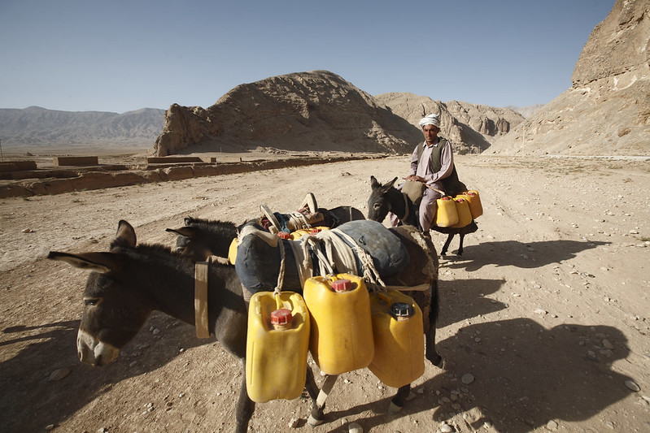

# Images {#chapter09}

<br>
<center>
{width=70%}
</center>
<br>


## Image metadata 

This chapter describes the use of two metadata standards for the documentation of images. Images may include both electronic and physical representations, but we are here interested in images available as electronic files, intended to be catalogued and published in on-line catalogs/albums. These files will typically be available in one of the following formats: JPG, PNG, or TIFF. Images can be photos taken by digital cameras, images generated by computer, or scanned images. The metadata standards we describe are intended to make these images discoverable, accessible, and usable. For that purpose, metadata must be provided on the content of the image (in the form of caption, description, keywords, etc.), on the location and date the image was generated, on the author, and more. Information on use license and copyrights, on possible privacy protection issues (persons, possibly minors, etc.) is needed to provide users with information they need to ensure their use of the data is legal.

The device used to generate images in the form of electronic files (such as digital cameras) contain embedded metadata. Digital cameras generate EXIF metadata. This information may be useful to some users, but (with a few exceptions like the date the photo was taken and the GPS location if generated), they lack information on the content of the image (what is represented in it), required for discoverability. This information must added by curators. Part of it will be entered manually, other can be extracted in a largely automated manner using machine learning models and APIs. This information must be structured and stored in compliance with a metadata standard. We present in this chapter two standards that can serve that purpose: the comprehensive (and somewhat complex) [IPTC standard](https://iptc.org/), and the simpler [Dublin Core (DCMI)](https://dublincore.org/) standard. The metadata schema we propose embeds both options; when using the schema, users will select either one or the other to document their images. We also make references to the [ImageObject metadata schema](https://schema.org/ImageObject) from schema.org, and include some of their elements in our schema.

> "Although photographs may be more explicit than a long discourse for humans, they don't describe themselves in term of content as texts do. For texts, authors use many clues to indicate what they are talking about: titles, abstract, keywords, etc. which may be used for automatic cataloguing. Searching for photos must rely on manual cataloguing, or relate texts and documents that come with the photos." *(Source: 
https://citeseerx.ist.psu.edu/viewdoc/download?doi=10.1.1.43.5077&rep=rep1&type=pdf)*

We start with a brief presentation of the EXIF metadata, then describe the schema we propose for the documentation and cataloguing of images. 

### Embedded metadata: EXIF

Modern digital cameras automatically generate metadata and embed it into the image file. This metadata is known as the Exchangeable Image File Format or EXIF. EXIF will record information on the date and time the image was taken, on the GPS location coordinates (latitude & longitude, possibly altitude) if the camera was equipped with a GPS and geolocation was enabled, information on the device including manufacturer and model, technical information (lens type, focal range, aperture, shutter speed, flash settings), the system-generated unique image identifier, and more.

There are several ways to extract or view an image's EXIF Data. For example, the R packages ExifTool and ExifR allow extraction and use of EXIF metadata; or applications like Flickr will display EXIF content.

<br>
{width=100%}
<br>

But with the exception of the date, location (if captured), and unique image identifier, the content of the EXIF does not provide information that users interested in identifying images based on their source and/or content will find useful. Most of the image metadata will have to be obtained from another source or using other tools.   

### IPTC and Dublin Core standards 

The metadata schema we propose for documenting images contains two options: the Dublin Core, as a simple option, and the IPTC as a more complex and advanced solutions. The schema also contains a few metadata elements that will be used no matter which option is selected. The schema is structured as follows:

   - A few elements are provided to document the metadata (not the image itself), to provide some cataloguing parameters, and to set a unique identifier for the image being documented. 

   - Then come the two options for documenting the image itself: the IPTC block of metadata elements, and the Dublin Core block of elements. Users will make use of one of them, not both.

      - The IPTC is the most detailed and complex schema. The version embedded in our schema is 2019.1 According to the [IPTC website](https://iptc.org/standards/photo-metadata/iptc-standard/), *"The IPTC Photo Metadata Standard is the most widely used standard to describe photos, because of its universal acceptance among news agencies, photographers, photo agencies, libraries, museums, and other related industries. It structures and defines metadata properties that allow users to add precise and reliable data about images."* The IPTC standard consists of two schemas: IPTC Core and IPTC Extension. They provide a comprehensive set of fields to document an image including information on time and geographic coverage, people and objects shown in the image, information on rights, and more. The schema is complex and in most cases only a small subset of fields will be used to document an image. Controlled vocabularies are recommended for some elements. 

      - The Dublin Core (DCMI) is a much simpler and highly flexible standard, composed of 15 core elements which we supplement with a few additional elements mostly taken from the ImageObject schema.  

   - Last, a small number of additional metadata elements are provided, which will apply no matter which option is used to document the image. 


### Augmenting image metadata

To make images discoverable, metadata that describe the content depicted in an image, the source of the image and the rights and licensing associated with it, are essential but not provided in the EXIF. Additional metadata must be provided. The metadata schema we propose is intended to structure the detailed metadata that can be associated with an image.

Some of these metadata will have to be generated by image authors and/or curators, other can be generated in a much automated manner using machine learning models and tools. Image processing algorithms that make it possible to augmented metadata include algorithms of face detection, person identification, automated labeling, text extraction, and others. Before describing the proposed metadata schema in the following sections, we present here some example of tools that make such metadata enhancement easy and affordable. 

The example we provide below makes use of the [Google Vision API](https://cloud.google.com/vision/docs/drag-and-drop) to generate image metadata. Google Vision is one out of multiple tools that can be used for that purpose such as [Amazon Rekognition](https://aws.amazon.com/rekognition/), or [Microsoft Azure Computer Vision](https://azure.microsoft.com/en-us/services/cognitive-services/computer-vision/). This example makes use of a photo selected from the [World Bank Flickr album](https://www.flickr.com/photos/worldbank/1543136297/in/album-72157634086023459/).

<center>
{width=100%}
</center>

The image comes with a brief description that identifies the photographer, the location (name of the country and town, not GPS location), and the content of the image. The description of the image includes important keywords that, when indexed in a catalog, will support discoverability of the image. This information, to be manually entered, is valuable and must be part of the curated image metadata.

-----------
<center>
{width=70%}
</center>
-----------

But we can add useful additional information in an automated manner and at low cost using machine learning models. In the example below, we use the (free) on-line ["Try it" tool](https://cloud.google.com/vision) of the Google Vision application. 

<center>
{width=85%}
</center>

The Google Vision API returns and displays the results of the image processing in multiple tabs. The same content is available programmatically in JSON format. The content of this JSON file can be mapped to elements of the metadata schema, for automatic addition to the image metadata.

The first tab is the result of **faces** detection. Each detected face has a bounding box and metadata such as the derived emotion of the person. The bounding box can be used to automatically flag images that have one or multiple "significant size" face(s) and may have to be excluded from the published images for privacy protection reasons.

<center>
{width=85%}
</center>

The second tab reports on detected **objects**.

<center>
{width=85%}
</center>

The third tab suggests **labels** that could be attached to the image, provided with a degree of confidence. A threshold can be set to automatically add (or not) each proposed label as a keyword in the image metadata.  

<center>
{width=85%}
</center>

{width=30%}
{width=30%}
{width=30%}

The fourth tab shows the **text** detected in the image. The quality of text detection and recognition depends on the resolution of the image and on the size and orientation of the text in the image. In our example, the algorithm fails to read (most of) the small, rotated and truncated text. 

<center>
{width=65%}
</center>

The tool managed to recognize some, but not all characters. In this case, this would be considered as not useful information to be added to the image metadata.

<center>
{width=85%}
</center>

We are not interested in the **properties** tab which does not provide information that can be used for discoverability of images based on their content or source.

The last tab, **Safe search**, could be used as warnings if you plan to make the image publicly accessible.

<center>
{width=85%}
</center>

This "Try it" tool demonstrates the capabilities of the application which, for automating the processing of a collection of images, would be accessed programmatically using R, Python or another programming language. We provide an example of such a script in the *Example 3* section of this chapter. Accessing the application's API requires a key. The cost of image labeling, face detection, and other image processing is low. The table below shows as an example the [Google vision pricing](https://cloud.google.com/vision/pricing) as of 26 February 2021. Pricing from equivalent service by other companies is very similar. 
<br>
<center>
{width=85%}
</center>
<br>


## Schema description

The schema contains two options to document images: the IPTC and the Dublin Core metadata standards. The schema contains four main groups of metadata elements: 
(i) A small set of "common elements" (used no matter what option -- IPTC or Dublin Core -- is used), used mostly for cataloguing purpose. 
(ii) The IPTC metadata elements
(iii) The Dublin Core (DCMI) elements
(iv) Another small set of common elements.

The description of IPTC metadata elements is largely taken from the Photo Metadata section of the [IPTC website](https://iptc.org/standards/photo-metadata/).

{width=100%}

### Common elements {-}

- **`metadata_information`** *[Optional ; Not repeatable]* <br> 
This block is used to describe who produced the metadata and when. This is an optional section of the schema. It is useful for archivist more than data users. The description of the image itself is found in the `IPTC` or `DCMI` section.
  <br>
  {width=100%} 
  <br>
  
  - **`title`** *[Optional ; Not Repeatable ; String]* <br>
  The title of the image metadata. This can be the same as the image title.
  
  - **`idno`** *[Optional ; Not Repeatable ; String]* <br>
  The unique identifier of the image metadata document.
  
  - **`producers`** *[Optional ; Repeatable]*  <br>
  This is a list of producers involved in the documentation (production of the metadata) of the image. 
      - **`name`** *[Optional ; Not repeatable, String]*  <br>
      The name of the agency that is responsible for the documentation of the image. 
      - **`abbr`** *[Optional ; Not repeatable, String]*  <br>
      Abbreviation (acronym) of the agency mentioned in `name`.
      - **`affiliation`** *[Optional ; Not repeatable, String]*  <br>
      Affiliation of the agency mentioned in `name`.
      - **`role`** *[Optional ; Not repeatable, String]*  <br>
    The specific role of the agency mentioned in `name` in the production of the metadata. This element will be used when more than one person or organization is listed in the `producers` element to distinguish the specific contribution of each metadata producer.<br>
    
  - **`production_date`** *[Optional ; Not repeatable, String]*  <br>   
  The date the image metadata was generated (not the date the image was created), preferably entered in ISO 8601 format (YYYY-MM-DD or YYYY-MM or YYYY).
  
  - **`version`** *[Optional ; Not repeatable, String]* <br>
  The version of the metadata on this image. This element will rarely be used.

- **`image_description`** *[Required ; Not Repeatable]* <br>
The `image_description` will contain the metadata related to one image. DC or IPTC.

  - **`idno`** *[Required ; Not Repeatable, String]* <br>
  The (main) unique identifier of the image, to be used for cataloguing purpose.
  <br>
  {width=100%} 
  <br>
  
  - **`identifiers`** *[Optional, Repeatable]* <br>
  The repeatable element `identifiers` is used to list image identifiers other than the one used in `idno`. Some images may have unique identifiers assigned by different organizations or cataloguing systems; this element is used to document them. 
     <br>
     {width=100%} 
     <br>
     - **`type`** *[Optional, Not Repeatable, String]*
     The type of identifiers. This could be for example "DOI", or the identification of the organization or catalog that issued the identifier.
     - **`identifier`** *[Required, Not Repeatable, String]*
     The identifier itself.

### IPTC {-}

  - **`iptc`** *[Optional ; Not Repeatable]* <br>
  The schema provides two options (standards) to document an image: the IPTC, and the Dublin Core. Only one of these standards, not both, will be used to document an image. The block `iptc` will be used when IPTC is the preferred option. In such case, the `dcmi` block describe later in this chapter will be left empty. IPTC is the most complex of these two options. 
  <br>
  {width=100%}
  <br>
   - **`photoVideoMetadataIPTC`** *[Required ; Not Repeatable ; String]* <br>
   Contains all elements used to describe the image using the IPTC standard.

      - **`title`** *[Optional ; Not Repeatable ; String]* <br>
      <br>
      {width=100%}
      <br>
      The title is a shorthand reference for the digital image. It provides a short verbal and human readable name which can be a text and/or a numeric reference. It is not the same as the Headline (see below). Some may use the `title` field to store the file name of the image, though the field may be used in many ways. This element should not be used to provide the unique ID of the image, as such identifiers are captured in the `Registry Entry` property.
      
      - **`imageSupplierImageId`** *[Optional ; Not Repeatable ; String]* <br>
      A unique identifier assigned by the Image Supplier to the image.
      <br>
      {width=100%}
      <br>
      
      - **`registryEntries`** *[Optional ; Repeatable]* <br>
      A structured element used to provide cataloguing information (i.e. an entry in a registry). It includes the unique identifier for the image issued by the registry and the registry’s organization identifier. 
        <br>
        {width=100%}
        <br>
         - **`role`**: *[Optional ; Not Repeatable ; String]* <br>
         An identifier of the reason and/or purpose for this Registry Entry.
         - **`assetIdentifier`** *[Optional ; Not Repeatable ; String]* <br>
         A unique identifier created by the registry and applied by the creator of the digital image. This value shall not be changed after being applied. This identifier is linked to a corresponding Registry Organization Identifier. Enter the unique identifier created by a registry and applied by the creator of the digital image. This value shall not be changed after being applied. This identifier may be globally unique by itself, but it must be unique for the issuing registry. An input to this field should be made mandatory.
         - **`registryIdentifier`** *[Optional ; Not Repeatable ; String]* <br>
         An identifier for the registry/organization which issued the corresponding Registry Image Id. 
      
      - **`digitalImageGuid`** *[Optional ; Not Repeatable ; String]* <br>
      <br>
      {width=100%}
      <br>
      A globally unique identifier for the image. This identifier is created and applied by the creator of the digital image at the time of its creation. This value shall not be changed after that time. The identifier can be generated using an algorithm that would guarantee that the created identifier is globally unique. Device that create digital images like digital or video cameras or scanners usually create such an identifier at the time of the creation of the digital data, and add it to the metadata embedded in the image file (e.g., the EXIF metadata).IPTC’s requirements for unique ids are as follows:
         - It must be globally unique. Algorithms for this purpose exist.
         - It should identify the camera body.
         - It should identify each individual photo from this camera body.
         - It should identify the date and time of the creation of the picture.
         - It should be secured against tampering.

      - **`dateCreated`** *[Optional ; Not Repeatable ; String]* <br>
      <br>
      {width=100%}
      <br>
      Designates the date and optionally the time the content of the image was created. For a photo, this will be the date and time the photo was taken. When no information is available on the time, the time is set to 00:00:00. The preferred format for the `dateCreated` element is the truncated DateTime format, for example: 2021-02-22T21:24:06Z

      - **`headline`** *[Optional ; Not Repeatable ; String]* <br>
      <br>
      {width=100%}
      <br>
      A brief publishable summary of the contents of the image. Note that a headline is not the same as a title.
      
      - **`eventName`** *[Optional ; Not Repeatable ; String]* <br>
      <br>
      {width=100%}
      <br>
      The name or a brief description of the event where the image was taken. If this is a sub-event of a larger event, mention both in the description. For example: "Opening statement, 1st International Conference on Metadata Standards, New York, November 2021". 
      
      - **`description`** *[Optional ; Not Repeatable ; String]* <br>
      <br>
      {width=100%}
      <br>
      A textual description, including captions, of the image. This describes the who, what, and why of what is happening in this image. This might include names of people, and/or their role in the action that is taking place within the image. Example: "The president of the Metadata Association delivers the keynote address".
      
      - **`captionWriter`** *[Optional ; Not Repeatable ; String]* <br>
      <br>
      {width=100%}
      <br>
      An identifier, or the name, of the person involved in writing, editing or correcting the description of the image. 
      
      - **`keywords`**: *[Optional ; Repeatable ; String]* <br>
      <br>
      {width=100%}
      <br>      
      Keywords (terms or phrases) to express the subject of the image. Keywords do not have to be taken from a controlled vocabulary.  

      - **`sceneCodes`** *[Optional ; Repeatable ; String]* <br>
      <br>
      {width=100%}
      <br>         
      The `sceneCodes` describe the scene of a photo content. The [IPTC Scene-NewsCodes](http://cv.iptc.org/newscodes/scene) controlled vocabulary (published under a Creative Commons Attribution (CC BY) 4.0 license) should be used, where a scene is represented as a string of 6 digits.
         <br>
         
         | code  | Scene            | Description                       |
         |:-----:|:----------------:|-----------------------------------|
         |010100 | headshot         | A head only view of a person (or animal/s) or persons as in a montage.|
         |010200 | half-length      | A torso and head view of a person or persons.|
         |010300 | full-length      | A view from head to toe of a person or persons |
         |010400 | profile          | A view of a person from the side |
         |010500 | rear view        | A view of a person or persons from the rear. |
         |010600 | single           | A view of only one person, object or animal. |
         |010700 | couple           | A view of two people who are in a personal relationship, for example engaged, married or in a romantic partnership. |
         |010800 | two              | A view of two people |
         |010900 | group            | A view of more than two people |
         |011000 | general view     | An overall view of the subject and its surrounds |
         |011100 | panoramic view   | A panoramic or wide angle view of a subject and its surrounds |
         |011200 | aerial view      | A view taken from above |
         |011300 | under-water      | A photo taken under water |
         |011400 | night scene      | A photo taken during darkness |
         |011500 | satellite        | A photo taken from a satellite in orbit |
         |011600 | exterior view    | A photo that shows the exterior of a building or other object |
         |011700 | interior view    | A scene or view of the interior of a building or other object |
         |011800 | close-up         | A view of, or part of a person/object taken at close range in order to emphasize detail or accentuate mood. Macro photography. |
         |011900 | action           | Subject in motion such as children jumping, horse running |
         |012000 | performing       | Subject or subjects on a stage performing to an audience |
         |012100 | posing           | Subject or subjects posing such as a "victory" pose or other stance that symbolizes leadership. |
         |012200 | symbolic         | A posed picture symbolizing an event - two rings for marriage |
         |012300 | off-beat         | An attractive, perhaps fun picture of everyday events - dog with sunglasses, people cooling off in the fountain |
         |012400 | movie scene      | Photos taken during the shooting of a movie or TV production. |
<br>
      - **`subjectCodes`** *[Optional ; Repeatable ; String]* <br>
      <br>
      {width=100%}
      <br>        
         Specifies one or more subjects from the [IPTC Subject-NewsCodes](http://cv.iptc.org/newscodes/subjectcode) controlled vocabulary to categorize the image. Each Subject is represented as a string of 8 digits. The vocabulary consists of about 1400 terms organized into 3 levels (users can decide to use only the first, or the first two levels; the more detail is provided, the better the discoverability of the image).   <br>
          <br><br>
         The first level of the controlled vocabulary is as follows: 
<br>        

         | code   | Subject          | Description                       |
         |:------:|:-----------------:|-----------------------------------|
         |01000000| arts, culture and entertainment | Matters pertaining to the advancement and refinement of the human mind, of interests, skills, tastes and emotions |
         |02000000| crime, law and justice | Establishment and/or statement of the rules of behaviour in society, the enforcement of these rules, breaches of the rules and the punishment of offenders. Organizations and bodies involved in these activities. |
         |03000000| disaster and accident | Man made and natural events resulting in loss of life or injury to living creatures and/or damage to inanimate objects or property.|
         |04000000| economy, business and finance | All matters concerning the planning, production and exchange of wealth.|
         |05000000| education | All aspects of furthering knowledge of human individuals from birth to death.|
         |06000000| environmental issue | All aspects of protection, damage, and condition of the ecosystem of the planet earth and its surroundings.|
         |07000000| health | All aspects pertaining to the physical and mental welfare of human beings.|
         |08000000| human interest | Lighter items about individuals, groups, animals or objects.
         |09000000| labour | Social aspects, organizations, rules and conditions affecting the employment of human effort for the generation of wealth or provision of services and the economic support of the unemployed.|
         |10000000| lifestyle and leisure | Activities undertaken for pleasure, relaxation or recreation outside paid employment, including eating and travel.|
         |11000000| politics | Local, regional, national and international exercise of power, or struggle for power, and the relationships between governing bodies and states.|
         |12000000| religion and belief | All aspects of human existence involving theology, philosophy, ethics and spirituality.|
         |13000000| science and technology | All aspects pertaining to human understanding of nature and the physical world and the development and application of this knowledge|
         |14000000| social issue | Aspects of the behavior of humans affecting the quality of life.|
         |15000000| sport | Competitive exercise involving physical effort. Organizations and bodies involved in these activities.|
         |16000000| unrest | conflicts and war Acts of socially or politically motivated protest and/or violence.|
         |17000000| weather | The study, reporting and prediction of meteorological phenomena.
         <br>
         <br>
         As an example of subjects at the three levels, the list below zooms on the subject "education".
<br>      

         | code   | Subject            | Description                       |
         |:------:|:----------------------:|-----------------------------------|
         |05000000| education              | All aspects of furthering knowledge of human individuals from birth to death|
         |05001000|   Adult education      | Education provided for older students outside the usual age groups of 5-25|
         |05002000|   Further education    | Any form of education beyond basic education of several levels|
         |05003000|   parent organisation  | Groups of parents set up to support schools|
         |05004000|   preschool            | Education for children under the national compulsory education age|
         |05005000|   school               | A building or institution in which education of various sorts is provided|
         |05005001|     elementary schools | Schools usually of a level from kindergarten through 11 or 12 years of age|
         |05005002|     middle schools     | Transitional school between elementary and high school, 12 through 13 years of age|
         |05005003|     high schools       | Pre-college/ university level education 14 to 17 or 18 years of age, called freshman, sophomore, junior and senior|
         |05006000|   teachers union       | Organization of teachers for collective bargaining and other purposes|
         |05007000|   university           | Institutions of higher learning capable of providing doctorate degrees|
         |05008000|   upbringing           | Lessons learned from parents and others as one grows up|
         |05009000|   entrance examination | Exams for entering colleges, universities, junior and senior high schools, and all other higher and lower education institutes, including cram schools, which help students prepare for exams for entry to prestigious schools.|
         |05010000|   teaching and learning| Either end of the education equation|
         |05010001|     students           | People of any age in a structured environment, not necessarily a classroom, in order to learn something|
         |05010002|     teachers           | People with knowledge who can impart that knowledge to others|
         |05010003|     curriculum         | The courses offered by a learning institution and the regulation of those courses|
         |05010004|     test/examination   | A measurement of student accomplishment|
         |05011000|   religious education  | Instruction by any faith, in that faith or about other faiths, usually, but not always, conducted in schools run by religious bodies|
         |05011001|     parochial school   | A school run by the Roman Catholic faith|
         |05011002|     seminary           | A school of any faith specifically designed to train ministers|
         |05011003|     yeshiva            | A school for training rabbis|
         |05011004|     madrasa            | A school for teaching Islam|
<br>
      - **`creatorNames`** *[Optional ; Repeatable ; String]* <br> 
      <br>
      {width=100%}
      <br>        
      Enter details about the creator or creators of this image. The Image Creator must often be attributed in association with any use of the image. The Image Creator, Copyright Owner, Image Supplier and Licensor may be the same or different entities.
      
      - **`creatorContactInfo`** *[Optional ;Not repeatable ; String]* <br>
      <br>
      {width=100%}
      <br>        
      The creator’s contact information provides all necessary information to get in contact with the creator of this image and comprises a set of elements for proper addressing. Note that if the creator is also the licensor, his or her contact information should be provided in the `licensor` fields. 
         - **`country`** *[Optional ; Not Repeatable ; String]* <br>
         The Country name for the address of the person that created this image.
         - **`emailwork`** *[Optional ; Not Repeatable ; String]* <br>
         The work email address(es) for the creator of the image. Multiple email addresses can be given, in which case they should be separated by a comma.
         - **`region`** *[Optional ; Not Repeatable ; String]* <br>
         The state or province for the address of the creator of the image.
         - **`phonework`** *[Optional ; Not Repeatable ; String]* <br>
         The work phone number(s) for the creator of the image. Use the international format including the country code, such as +1 (123) 456789. Multiple numbers can be given, in which case they should be separated by a comma.
         - **`weburlwork`** *[Optional ; Not Repeatable ; String]* <br>
         The work web address for the creator of the image. Multiple addresses can be given, in which case they should be separated by a comma.
         - **`address`** *[Optional ; Not Repeatable ; String]* <br>
         The address of the creator of the image. This may comprise a company name.
         - **`city`** *[Optional ; Not Repeatable ; String]* <br>
         The city for the address of the person that created the image.
         - **`postalCode`** *[Optional ; Not Repeatable ; String]* <br>
         Enter the local postal code for the address of the person who created the image.<br>
      
      - **`creditLine`** *[Optional ; Not Repeatable ; String]* <br>
      <br>
      {width=100%}
      <br>      
         The credit to person(s) and/or organization(s) required by the supplier of the image to be used when published. This is a free-text field. <br>

      - **`digitalSourceType`** *[Optional ; Not Repeatable ; String]* <br>
      <br>
      {width=100%}
      <br>          
         The type of the source of this digital image. One value should be selected from the IPTC controlled vocabulary (published under a Creative Commons Attribution (CC BY) 4.0 license license) that contains the following values: 
<br>

         | Type               | Source             | Description                       |
         |:------------------:|:------------------:|-----------------------------------|
         |digitalCapture      | Original digital capture of a real life scene | The digital image is the original and only instance and was taken by a digital camera|
         |negativeFilm        | Digitized from a negative on film | The digital image was digitized from a negative on film on any other transparent medium|
         |positiveFilm        | Digitized from a positive on film | The digital image was digitized from a positive on a transparency or any other transparent medium |
         |print               | Digitized from a print on non-transparent medium | The digital image was digitized from an image printed on a non-transparent medium|
         |softwareImage       | Created by software | The digital image was created by computer software
          <br>     
      - **`jobid`** *[Optional ; Not Repeatable ; String]* <br>
      <br>
      {width=100%}
      <br>       
         Number or identifier for the purpose of improved workflow handling (control or tracking). This is a user created identifier related to the job for which the image is supplied. <br>
         Note: As this identifier references a job of the receiver’s workflow it must first be issued by the receiver, then transmitted to the creator or provider of the news object and finally added by the creator to this field.
              
      - **`jobtitle`** *[Optional ; Not Repeatable ; String]* <br>
      <br>
      {width=100%}
      <br>       
         The job title of the photographer (the person listed in `creatorNames`). The use of this element implies that the photographer information (`creatorNames` is not empty).  
      
      - **`source`** *[Optional ; Not Repeatable ; String]* <br>
      <br>
      {width=100%}
      <br>        
         The name of a person or party who has a role in the content supply chain. The `source` can be different from the `creator` and from the entities listed in the Copyright Notice. <br>
      
      - **`locationsShown`** *[Optional ; Repeatable]* <br> 
      <br>
      {width=100%}
      <br>
      This block of elements is used to document the location shown in the image. This information should be provided with as much detail as possible. It contains elements that can be used to provide a "nested" description of the location, from a high geographic level (world region) down to a very specific location (city and sub-location within a city). 
        - **`name`** *[Optional ; Not Repeatable ; String]* <br>
        The full name of the location.
        - **`identifiers`** *[Optional ; Repeatable ; String]* <br>
        A globally unique identifier of the location shown.
        - **`worldRegion`** *[Optional ; Not Repeatable ; String]* <br>
        The name of a world region. This element is at the first (top) level of the top-down geographical hierarchy.<br>
        - **`countryName`** *[Optional ; Not Repeatable ; String]* <br>
        The name of a country of a location. This element is at the second level of a top-down geographical hierarchy. 
        - **`countryCode`** *[Optional ; Not Repeatable ; String]* <br>
        The ISO code of the country mentioned in `countryName`.  
        - **`provinceState`** *[Optional ; Not Repeatable ; String]* <br>
        The name of a sub-region of the country - for example a province or a state name. This element is at the third level of a top-down geographical hierarchy.    
        - **`city`** *[Optional ; Not Repeatable ; String]* <br>
        The name of the city. This element is at the fourth level of a top-down geographical hierarchy. 
        - **`sublocation`** *[Optional ; Not Repeatable ; String]* <br>
        The sublocation name could either be the name of a sublocation to a city or the name of a well known location or (natural) monument outside a city. This element is at the fifth (lowest) level of a top-down geographical hierarchy. 
        - **`gpsAltitude`** *[Optional ; Not Repeatable ; Numeric]* <br>
        The altitude in meters of a WGS84 based position of this location
        - **`gpsLatitude`** *[Optional ; Not Repeatable ; Numeric]* <br>
        Latitude of a WGS84 based position of this location (in some cases, this information may be contained in the EXIF metadata).
        - **`gpsLongitude`** *[Optional ; Not Repeatable ; Numeric]* <br>
        Longitude of a WGS84 based position of this location (in some cases, this information may be contained in the EXIF metadata).
         
      - **`imageRating`** *[Optional ; Not Repeatable ; Numeric]* <br>
      <br>
      {width=100%}
      <br> 
      Rating of the image by its user or supplier. The value shall be -1 or in the range 0 to 5. -1 indicates "rejected" and 0 "unrated". If an explicit value is not provided, the default value is 0 will be assumed.
       
      - **`supplier`** *[Optional ; Repeatable]* <br>
        <br>
        {width=100%}
        <br> 
         - **`name`** *[Optional ; Not Repeatable ; String]* <br>
         The name of the supplier of the image (person or organization).
         - **`identifiers`** *[Optional ; Repeatable ; String]* <br>
         The identifier for the most recent supplier of this image. This will not necessarily be the creator or the owner of the image. 
      
      - **`copyrightNotice`** *[Optional ; Not Repeatable ; String]* <br>
      <br>
      {width=100%}
      <br> 
      Contains any necessary copyright notice for claiming the intellectual property for this photograph and should identify the current owner of the copyright for the photograph. Other entities like the creator of the photograph may be added in the corresponding field. Notes on usage rights should be provided in "Rights usage terms". Example: ©2008 Jane Doe. If the copyright ownership must be expressed in a more controlled manner, use the fields "Copyright Owner", "Copyright Owner ID", "Copyright Owner Name" described below instead of the `copyrightNotice` element.  
      
      - **`copyrightOwners`** *[Optional ; Repeatable]* <br>
      Owner or owners of the copyright in the licensed image, described in a structured format (as an alternative to the element `copyrightNotice` described above. This block serves the same purpose of identifying the rights holder/s for the image. The Copyright Owner, Image Creator and Licensor may be the same or different entities.
        <br>
        {width=100%}
        <br> 
         - **`name`** *[Optional ; Not Repeatable ; String]* <br>
         The name of the owner of the copyright in the licensed image.
         - **`role`** *[Optional ; Repeatable ; String]* <br>
         The role the entity.  @@@@@
         - **`identifiers`** *[Optional ; Repeatable ; String]* <br>
         The identifier of the owner of the copyright in the licensed image.
      
      - **`usageTerms`** *[Optional ; Not Repeatable ; String]* <br>
      <br>
      {width=100%}
      <br> 
      The licensing parameters of the image expressed in free-text. Enter instructions on how this image can legally be used. The PLUS fields of the IPTC Extension can be used in parallel to express the licensed usage in more controlled terms.
      
      - **`embdEncRightsExpr`** *[Optional ; Repeatable]* <br>
      An embedded rights expression using a rights expression language which is encoded as a string. 
      Embedded Encoded Rights Expression (EERE) structure
      A structure providing details of an embedded encoded rights expression
        <br>
        {width=100%}
        <br> 
         -**`encRightsExpr`** *[Optional ; Not Repeatable ; String]* <br> 
         Rights Expression Language ID. An identifier of the rights expression language used by the rights expression. 
         -**`rightsExprEncType`** *[Optional ; Not Repeatable ; String]* <br>
         The encoding type of the rights expression, identified by an IANA Media Type. 
         -**`rightsExprLangId`** *[Optional ; Not Repeatable ; String]* <br> 
         An embedded rights expression using any rights expression language. 
      https://www.iptc.org/std/photometadata/specification/IPTC-PhotoMetadata#embedded-encoded-rights-expression-eere-structure
      
      - **`linkedEncRightsExpr`** *[Optional ; Repeatable]* <br>
      Link to Encoded Rights Expression
         <br>
         {width=100%}
         <br>       
         -**`linkedRightsExpr`** *[Optional ; Not Repeatable ; String]* <br>
         The link to a web resource representing an encoded rights expression.
         -**`rightsExprEncType`** *[Optional ; Not Repeatable ; String]* <br>
         The encoding type of the rights expression, identified by an IANA Media Type. 
         -**`rightsExprLangId`** *[Optional ; Not Repeatable ; String]* <br>
         The identifer of the rights expression language used by the rights expression.<br>
      
      - **`webstatementRights`** *[Optional ; Not Repeatable ; String]* <br>
        <br>
        {width=100%}
        <br>       
      URL referencing a web resource providing a statement of the copyright ownership and usage rights of the image.        
      
      - **`instructions`** *[Optional ; Not Repeatable ; String]* <br>
        <br>
        {width=100%}
        <br>        
      Any of a number of instructions from the provider or creator to the receiver of the image which might include any of the following: embargoes and other restrictions not covered by the "Rights Usage Terms" field; information regarding the original means of capture (scanning notes, colourspace info) or other specific text information that the user may need for accurate reproduction; additional permissions required when publishing; credits for publishing if they exceed the IIM length of the credit field.
      
      - **`genres`** *[Optional ; Repeatable]* <br>
        <br>
        {width=100%}
        <br> 
         - **`cvId`** *[Optional ; Not Repeatable ; String]* <br>
         The globally unique identifier of the Controlled Vocabulary the term is from. 
         - **`cvTermName`** *[Optional ; Not Repeatable ; String]* <br>
         The natural language name of the term from a Controlled Vocabulary. 
         - **`cvTermId`** *[Optional ; Not Repeatable ; String]* <br>
         The globally unique identifier of the term from a Controlled Vocabulary. 
         - **`cvTermRefinedAbout`** *[Optional ; Not Repeatable ; String]* <br>
         Optionally enter a refinement of the 'about' relationship of the term with the content of the image. This must be a globally unique identifier from a Controlled Vocabulary. May be used to refine the generic about relationship. <br>
         Artistic, style, journalistic, product or other genre(s) of the image (expressed by a term from any Controlled Vocabulary) <br><br>
      
      - **`intellectualGenre`** *[Optional ; Not Repeatable ; String]* <br>
        <br>
        {width=100%}
        <br>        
         A term to describe the nature of the image in terms of its intellectual or journalistic characteristics (for example "actuality", "interview", "background", "feature", "summary", "wrapup" for journalistic genres, or "daybook", "obituary", "press release", "transcript" for news category related genres. It is advised to use terms from a controlled vocabulary such as the [NewsCodes Scheme](http://cv.iptc.org/newscodes/genre) published by the IPTC under a Creative Commons Attribution (CC BY) 4.0 license.<br>

         | Genre              | Description                       |
         |:------------------:|-----------------------------------|
         |Actuality           | Recording of an event|
         |Advertiser Supplied | Content is supplied by an organization or individual that has paid the news provider for its placement|
         |Advice              | Letters and answers about readers' personal problems|
         |Advisory            | Recommendation on editorial or technical matters by a provider to its customers|
         |On This Day         | List of data, including birthdays of famous people and items of historical significance, for a given day|
         |Analysis            | Data and conclusions drawn by a journalist who has conducted in depth research for a story|
         |Archival material   | Material selected from the originator's archive that has been previously distributed|
         |Background          | Scene setting and explanation for an event being reported|
         |Behind the Story    | The content describes how a story was reported and offers context on the reporting|
         |Biography           | Facts and background about a person|
         |Birth Announcement  | News of newly born children|
         |Current Events      | Content about events taking place at the time of the report|
         |Curtain Raiser      | Information about the staging and outcome of an immediately upcoming event|
         |Daybook             | Items filed on a regular basis that are lists of upcoming events with time and place, designed to inform others of events for planning purposes.|
         |Exclusive           | Information content, in any form, that is unique to a specific information provider.|
         |Fact Check          | The news item looks into the truth or falsehood of another reported news item or assertion (for example a statement on social media by a public figure)|
         |Feature             | The object content is about a particular event or individual that may not be significant to the current breaking news.|
         |Fixture             | The object contains data that occurs often and predictably.|
         |Forecast            | The object contains opinion as to the outcome of a future event.|
         |From the Scene      | The object contains a report from the scene of an event.|
         |Help us to Report   | The news item is a call for readers to provide information that may help journalists to investigate a potential news story|
         |History             | The object content is based on previous rather than current events.|
         |Horoscope           | Astrological forecasts|
         |Interview           | The object contains a report of a dialogue with a news source that gives it significant voice (includes Q and A).|
         |Listing of facts    | Detailled listing of facts related to a topic or a story|
         |Music               | The object contains music alone.|
         |Obituary            | The object contains a narrative about an individual's life and achievements for publication after his or her death.|
         |Opinion             | The object contains an editorial comment that reflects the views of the author.|
         |Polls and Surveys   | The object contains numeric or other information produced as a result of questionnaires or interviews.|
         |Press Release       | The object contains promotional material or information provided to a news organisation.|
         |Press-Digest        | The object contains an editorial comment by another medium completely or in parts without significant journalistic changes.|
         |Profile             | The object contains a description of the life or activity of a news subject (often a living individual).|
         |Program             | A news item giving lists of intended events and time to be covered by the news provider. Each program covers a day, a week, a month or a year. The covered period is referenced as a keyword.|
         |Question and Answer Session | The object contains the interviewer and subject questions and answers.|
         |Quote               | The object contains a one or two sentence verbatim in direct quote.|
         |Raw Sound           | The object contains unedited sounds.|
         |Response to a Question | The object contains a reply to a question.|
         |Results Listings and Statistics | The object contains alphanumeric data suitable for presentation in tabular form.|
         |Retrospective       | The object contains material that looks back on a specific (generally long) period of time such as a season, quarter, year or decade.|
         |Review              | The object contains a critique of a creative activity or service (for example a book, a film or a restaurant).|
         |Satire              | Uses exaggeration, irony, or humour to make a point; not intended to be understood as factual|
         |Scener              | The object contains a description of the event circumstances.|
         |Side bar and supporting information | Related story that provides additional context or insight into a news event|
         |Special Report      | In-depth examination of a single subject requiring extensive research and usually presented at great length, either as a single item or as a series of items|
         |Sponsored           | Content is produced on behalf of an organisation or individual that has paid the news provider for production and may approve content publication|
         |Summary             | Single item synopsis of a number of generally unrelated news stories|
         |Supported           | Content is produced with financial support from an organisation or individual, yet not approved by the underwriter before or after publication|
         |Synopsis            | The object contains a condensed version of a single news item.|
         |Text only           | The object contains a transcription of text.|
         |Transcript and Verbatim | A word for word report of a discussion or briefing|
         |Update              | The object contains an intraday snapshot (as for electronic services) of a single news subject.|
         |Voicer              | Content is only voice|
         |Wrap                | Complete summary of an event|
         |Wrapup              | Recap of a running story|
<br>
      - **`artworkOrObjects`** *[Optional ; Repeatable]* <br>  @@@@@@ change order in schema to match the order below then redo screenshot
      This block provides a set of metadata elements to be used to describe the object or artwork shown in the image.
        <br>
        {width=100%}
        <br>       
         - **`title`** *[Optional ; Not Repeatable ; String]* <br>
         A human readable name of the object or artwork shown in the image.
         - **`contentDescription`** *[Optional ; Not Repeatable ; String]* <br>
         A textual description of the content depicted in the object or artwork.
         - **`physicalDescription`** *[Optional ; Not Repeatable ; String]* <br>
         A textual description of the physical characteristics of the artwork or object, without reference to the content depicted. This would be used to describe the object type, materials,  techniques, and measurements.
         - **`creatorNames`** *[Optional Repeatable ; String]* <br>
         The name of the person(s) (possibly an organization) who created the object or artwork shown in the image.
         - **`creatorIdentifiers`** *[Optional ; Repeatable ; String]* <br>
        One or multiple globally unique identifier(s) for the artist who created the artwork or object shown in the image. This could be an identifier issued by an online registry of persons or companies. Make sure to enter these identifiers in the exact same sequence as the names entered in the field `creatorNames`.<br>
         - **`contributionDescription`** *[Optional ; Not Repeatable ; String]* <br>
         A description of any contributions made to the artwork or object. It should include the type, date and location of contribution, and details about the contributor.
         - **`stylePeriod`** *[Optional ; Repeatable ; String]* <br>
         The style, historical or artistic period, movement, group, or school whose characteristics are represented in the artwork or object. It is advised to take the terms from a Controlled Vocabulary.
         - **`dateCreated`** *[Optional ; Not Repeatable ; String]* <br>
         The date and optionally the time the artwork or object shown in the image was created.<br>
         - **`circaDateCreated`** *[Optional ; Not Repeatable ; String]* <br>
         The approximate date or range of dates associated with the creation and production of an artwork or object or its components.
         - **`source`** *[Optional ; Not Repeatable ; String]* <br>
         The name of the organization or body holding and registering the artwork or object in this image for inventory purposes.
         - **`sourceInventoryNr`** *[Optional ; Not Repeatable ; String]* <br>
         The inventory number issued by the organization or body holding and registering the artwork or object in the image.
         - **`sourceInventoryUrl`** *[Optional ; Not Repeatable ; String]* <br>
         A reference URL for the metadata record of the inventory maintained by the Source.
         - **`currentCopyrightOwnerName`** *[Optional ; Not Repeatable ; String]* <br>
         The name of the current owner of the copyright of the artwork or object.
         - **`currentCopyrightOwnerIdentifier`** *[Optional ; Not Repeatable ; String]* <br>
         A globally unique identifier for the current copyright owner e.g. issued by an online registry of persons or companies.
         - **`copyrightNotice`** *[Optional ; Not Repeatable ; String]* <br>
         Any necessary copyright notice for claiming the intellectual property for artwork or an object in the image and should identify the current owner of the copyright of this work with associated intellectual property rights.
         - **`currentLicensorName`** *[Optional ; Not Repeatable ; String]* <br>
         Name of the current licensor of the artwork or object.
         - **`currentLicensorIdentifier`** *[Optional ; Not Repeatable ; String]* <br>
         A globally unique identifier for the current licensor e.g. issued by an online registry of persons or companies.
<br>

      - **`personInImageNames`** *[Optional ; Repeatable ; String]* <br>
      <br>
      {width=100%}
      <br>  
      This repeatable block of elements is used to provide information on the person(s) shown in the image.
      
      - **`personsShown`** *[Optional ; Repeatable]* <br>
      Details about person(s) shown in the image. It is not required to list all, just those details which can be recognized.
        <br>
        {width=100%}
        <br>  
         - **`name`**  *[Optional ; Not Repeatable ; String]* <br>
         The name of a person shown in the image.
         - **`description`**  *[Optional ; Not Repeatable ; String]* <br>
         A textual description of the person. For example, you may include actions taken, emotional expressions shown and more.
         - **`identifiers`** *[Optional ; Not Repeatable ; String]* <br>
         Globally Unique identifiers of the person, such as those from [WikiData](https://www.wikidata.org/wiki/Wikidata:Main_Page).  
         - **`characteristics`** *[Optional ; Not Repeatable ; String]* <br>
         A property or trait of the person, provided as a term selected from a Controlled Vocabulary.
            - **`cvId`** *[Optional ; Not Repeatable ; String]* <br>
            The globally unique identifier of the Controlled Vocabulary the term is from. 
            - **`cvTermName`** *[Optional ; Not Repeatable ; String]* <br>
            The natural language name of the term from a Controlled Vocabulary. 
            - **`cvTermId`** *[Optional ; Not Repeatable ; String]* <br>
            The globally unique identifier of the term from a Controlled Vocabulary. 
            - **`cvTermRefinedAbout`** *[Optional ; Not Repeatable ; String]* <br>
            The refined 'about' relationship of the term with the content. Optionally enter a refinement of the 'about' relationship of the term with the content of the image. This must be a globally unique identifier from a Controlled Vocabulary. <br><br>
      
      - **`modelAges`** *[Optional ; Repeatable ; Numeric]* <br>
        <br>
        {width=100%}
        <br> 
         Age of the human model(s) at the time the image was taken. Be aware of any legal implications of providing ages for young models. Ages below 18 years should not be included.<br>
      
      - **`additionalModelInfo`** *[Optional ; Not Repeatable ; String]* <br>
         <br>
         {width=100%}
         <br> 
         Information about other facets of the model(s). <br>   

      - **`minorModelAgeDisclosure`** *[Optional ; Not Repeatable ; String]* <br>
         <br>
         {width=100%}
         <br> 
         The age of the youngest model pictured in the image, at the time the image was created. This information is not intended to be displayed publicly; it is intended to be used as a filter for inclusion/exclusion of images in catalogs and dissemination processes.
      
      - **`modelReleaseDocuments`** *[Optional ; Repeatable ; String]* <br>
         <br>
         {width=100%}
         <br>       
         Identifier associated with each Model Release. <br>
      
      - **`modelReleaseStatus`** *[Optional ; Not Repeatable]* <br>
         <br>
         {width=100%}
         <br>  
         - **`cvId`** *[Optional ; Not Repeatable ; String]* <br>
         The globally unique identifier of the Controlled Vocabulary the term is from. 
         - **`cvTermName`** *[Optional ; Not Repeatable ; String]* <br>
         The natural language name of the term from a Controlled Vocabulary. 
         - **`cvTermId`** *[Optional ; Not Repeatable ; String]* <br>
         The globally unique identifier of the term from a Controlled Vocabulary. 
         - **`cvTermRefinedAbout`** *[Optional ; Not Repeatable ; String]* <br>
         The refined 'about' relationship of the term with the content. Optionally enter a refinement of the 'about' relationship of the term with the content of the image. This must be a globally unique identifier from a Controlled Vocabulary. May be used to refine the generic about relationship. <br><br>
         
      - **`organisationInImageNames`** *[Optional ; Repeatable ; String]* <br>
         <br>
         {width=100%}
         <br>        
        The name of the organization or company which is featured in the image. 
      
      - **`organisationInImageCodes`** *[Optional ; Repeatable ; String]* <br>
         <br>
         {width=100%}
         <br>          
         The code, extracted from a controlled vocabulary, used to identify the organization or company featured in the image. For example a stock ticker symbol may be used. Enter an identifier for the controlled vocabulary, then a colon, and finally the code from the vocabulary assigned to the organization (e.g. nasdaq:companyA)
<br>     
      - **`productsShown`** *[Optional ; Repeatable]* <br> 
      Details about a product shown in the image.
         <br>
         {width=100%}
         <br>        
         - **`description`** *[Optional ; Not Repeatable ; String]* <br>
         A textual description of the product.
         - **`gtin`** *[Optional ; Not Repeatable ; String]* <br>
         The [Global Trade Item Number (GTIN)](https://www.gs1.org/standards/id-keys/gtin) of the product (GTIN-8 to GTIN-14 codes can be used).
         - **`name`** *[Optional ; Not Repeatable ; String]* <br>
         The name of the product. 
<br>      
<br>      
      - **`maxAvailHeight`** *[Optional ; Not Repeatable ; Numeric]* <br>
         <br>
         {width=100%}
         <br>  
         The maximum available height in pixels of the original photo from which this photo has been derived by downsizing. <br>
      
      - **`maxAvailWidth`** *[Optional ; Not Repeatable ; Numeric]* <br>
         <br>
         {width=100%}
         <br>  
         The maximum available width in pixels of the original photo from which this photo has been derived by downsizing. <br>
      
      - **`propertyReleaseStatus`** *[Optional ; Not Repeatable]* <br>
      <br>
      {width=100%}
      <br>  
      This summarizes the availability and scope of property releases authorizing usage of the properties appearing in the photograph. One value should be selected from a controlled vocabulary. It is recommended to apply the value PR-UPR very carefully and to check the wording of the property release thoroughly before applying it.
         
         - **`cvId`** *[Optional ; Not Repeatable ; String]* <br>
         The globally unique identifier of the Controlled Vocabulary the term is from. 
         - **`cvTermName`** *[Optional ; Not Repeatable ; String]* <br>
         The natural language name of the term from a Controlled Vocabulary. 
         - **`cvTermId`** *[Optional ; Not Repeatable ; String]* <br>
         The globally unique identifier of the term from a Controlled Vocabulary. 
         - **`cvTermRefinedAbout`** *[Optional ; Not Repeatable ; String]* <br>
         Refined 'about' relationship of the CV-Term. The refined 'about' relationship of the term with the content. Optionally enter a refinement of the 'about' relationship of the term with the content of the image. This must be a globally unique identifier from a Controlled Vocabulary.
      
      - **`propertyReleaseDocuments`** *[Optional ; Repeatable ; String]* <br>
      <br>
      {width=100%}
      <br>  
      Optional identifier associated with each Property Release. <br>


   > The IPTC elements are followed by a small set of common elements: see `license`, `tags`, and `album` in section **`Additional elements`**.


### Dublin Core {-}

We introduced the Dublin Core Metadata Initiative (DCMI) specification in chapter 3 - Documents. It contains 15 core elements, which are generic and versatile enough to be used for documenting different types of resources. Other elements can be added to the specification to increase its relevancy for specific uses. In the schema we recommend for the documentation of publications, we added elements inspired by the MARC 21 standard. We take a similar approach for the use of the Dublin Core for documenting images, by adding elements inspired by the [ImageObject](https://schema.org/ImageObject) schema from schema.org to the 15 elements.

The fifteen elements, with their definition extracted from the [Dublin Core website](https://dublincore.org/), are the following:

| Element name         | Description                                                      | 
| -------------------- | ---------------------------------------------------------------- | 
| identifier           | An unambiguous reference to the resource within a given context. |
| type                 | The nature or genre of the resource.                             |
| title                | A name given to the resource.                                    |
| description          | An account of the resource.                                      |
| subject              | The topic of the resource.                                       |
| creator              | An entity primarily responsible for making the resource.         |
| contributor          | An entity responsible for making contributions to the resource.  |
| publisher            | An entity responsible for making the resource available.         |
| date                 | A point or period of time associated with an event in the life cycle of the resource. |
| coverage             | The spatial or temporal topic of the resource, the spatial applicability of the resource, or the jurisdiction under which the resource is relevant.|
| format               | The file format, physical medium, or dimensions of the resource. |
| language             | A language of the resource.                                      |
| relation             | A related resource.                                              |
| rights               | Information about rights held in and over the resource.          |
| source               | A related resource from which the described resource is derived. |

We do not use the `identifier` element, as we already have a unique identifier in the common element `idno`. 

We add the following elements, not part of the core list of the DCMI: 

   - identifiers
   - caption
   - keywords
   - topics
   - country
   - gps (latitude, longitude, altitude)
   - note

The common additional elements `license`, `album` and `tags` also complement the DCMI metadata (see section **`Additional elements`**).

We describe below how DCMI elements are used to document images. 

  - **`dcmi`** *[Optional, Not repeatable]* <br>
  Users of the schema will chose either IPTC or Dublin Core (not both) to document their images. If the choice is Dublin Core, the elements under `dcmi` will be used. 
      <br>
      {width=100%}
      <br>  
    - **`type`** *[Required, Not Repeatable, String]* <br>
    The Dublin Core schema is flexible and versatile, and can be used to document different types of resources. This element is used to document the type of resource being documented. The DCMI provides a list of suggested categories, including "image" which is the relevant type to be entered here. Some users may want to be more specific in the description of the type of resource, for example distinguishing color from black & white images. This distinction should not be made in this element; another element can be used for such purpose (like tags and tag groups). 
    
    - **`title`** *[Optional, Not Repeatable, String]* <br> 
    The title of the photo. 
    
    - **caption`** *[Optional, Not Repeatable, String]* <br>
    A caption for the photo. 
    
    - **`description`** *[Optional, Not Repeatable, String]* <br>
    A brief description of the content depicted in the image. This element will typically provide more detailed information than the title or caption. Note that other elements can be used to provide a more specific and "itemized" description of an image; the element `keywords` for example can be used to list labels associated with an image (possibly generated in an automated manner using machine learning tools).
    
    - **`subject`** *[Optional, Not Repeatable, String]* <br> 
    The topic of the resource, described in a narrative manner.
    
    - **`topics`** *[Optional ; Repeatable]*<br>
    The `topics` field indicates the broad substantive topic(s) that the image represents. A topic classification facilitates referencing and searches in electronic survey catalogs. Topics should be selected from a standard controlled vocabulary such as the [Council of European Social Science Data Archives (CESSDA) thesaurus](https://vocabularies.cessda.eu/vocabulary/TopicClassification). The [Library of Congress Subject Headings](https://www.loc.gov/aba/publications/FreeLCSH/freelcsh.html) may also be used here.<br>
        <br>
        {width=100%}
        <br> 
        - **`id`** *[Optional ; Not repeatable ; String]* <br>
        The unique identifier of the topic. It can be a sequential number, or the ID of the topic in a controlled vocabulary.
        - **`name`** *[Required ; Not repeatable ; String]* <br>
        The label of the topic associated with the data.  
        - **`parent_id`** *[Optional ; Not repeatable ; String]* <br>
        When a hierarchical (nested) controlled vocabulary is used, the `parent_id` field can be used to indicate a higher-level topic to which this topic belongs.
        - **`vocabulary`** *[Optional ; Not repeatable ; String]* <br>
        The name of the controlled vocabulary used, if any. 
        - **`uri`** <br>
        A link to the controlled vocabulary mentioned in field `vocabulary'.<br><br>
    
    - **`keywords`** *[Optional ; Repeatable]* <br>
    Words or phrases that describe salient aspects of an image content. Can be used for building keyword indexes and for classification and retrieval purposes. A controlled vocabulary can be employed. Keywords should be selected from a standard thesaurus, preferably an international, multilingual thesaurus. <br>
       <br>
       {width=100%}
       <br>
       - **`name`** *[Required ; String ; Non repeatable]* <br>
       Keyword (or phrase). Keywords summarize the content or subject matter of the image. 
       - **`vocabulary`** *[Optional ; Not repeatable ; String]* <br>
       Controlled vocabulary from which the keyword is extracted, if any.  
       - **`uri`** *[Optional ; Not repeatable ; String]* <br>
       The URI of the controlled vocabulary used, if any.
    
    - **`creator`** *[Optional, Not Repeatable, String]* <br> 
    The name of the person (or organization) who has taken the photo or created the image.
    
    - **`contributor`** *[Optional, Not Repeatable, String]* <br> 
    The contributor could be a person or organization, possibly a sponsoring organizations.
    
    - **`publisher`** *[Optional, Not Repeatable, String]* <br> 
    The person or organization who publish the image.
    
    - **`date`** *[Optional, Not Repeatable, String]* <br> 
    The date when the photo was taken / the image was created.
    
    - **`country`** *[Optional, Repeatable]* <br>
       <br>
       {width=100%}
       <br>
       - **`name`** *[Optional, Not Repeatable, String]* <br>
       The name of the country/economy where the photo was taken.
       - **`code`** *[Optional, Not Repeatable, String]* <br>
       The code of the country/economy mentioned in `name`. This will preferably be the ISO country code.
    
    - **`coverage`** *[Optional, Not Repeatable, String]* <br> 
    In the Dublin Core, the coverage can be either temporal or geographic. In the use of the schema, `coverage` is used to document the geographic coverage of the image. This element complements the `country` element, and allows more specific information to be provided.
    
    - **`gps`** *[Optional, Not Repeatable]* <br>
      The geographic location where the photo was taken. Some digital cameras equipped with GPS can, when the option is activated, capture and store in the EXIF metadata the exact geographic location where the photo was taken. 
       <br>
       {width=100%}
       <br>      
       - **`latitude`** *[Optional, Not Repeatable, String]* <br>
       The latitude of the geographic location where the photo was taken.
       - **`longitude`** *[Optional, Not Repeatable, String]* <br>
       The longitude of the geographic location where the photo was taken.
       - **`altitude`** *[Optional, Not Repeatable, String]* <br>
       The altitude of the geographic location where the photo was taken.
       
    - **`format`** *[Optional, Not Repeatable, String]* <br> 
    This refers to the image file format. It is typically expressed using a MIME format.
    
    - **`languages`** *[Optional, Not repeatable, String]* <br> 
    The language(s) in which the image metadata (caption, title) is provided. This is a block of two elements (at least one must be provided for each language).
       <br>
       {width=100%}
       <br>  
        - **`name`** *[Optional ; Not repeatable ; String]* <br>
        The name of the language.
        - **`code`** *[Optional ; Not repeatable ; String]* <br>
        The code of the language. The use of [ISO 639-2](https://www.loc.gov/standards/iso639-2/php/code_list.php) (the alpha-3 code in Codes for the representation of names of languages) is recommended. Numeric codes must be entered as strings. <br>
    
    - **`relations`** *[Optional, Repeatable, String]* <br> 
    A list of related resources (images or of other type)
      <br>
      {width=100%}
      <br>     
      - **`name`** *[Optional ; Not repeatable ; String]* <br>
      The name (title) of the related resource.
      - **`type`** *[Optional ; Not repeatable ; String]* <br>
      A brief description of the type of relation. A controlled vocabulary could be used.
      - **`uri`** *[Optional ; Not repeatable ; String]* <br>
      A link to the related resource being described.
    
    - **`rights`** *[Optional, Not Repeatable, String]* <br> 
    The copyrights for the photograph. License is in another (common) element.
    
    - **`source`** *[Optional, Not Repeatable, String]* <br>
    A related resource from which the described image is derived.
    
    - **`note`** *[Optional, Not Repeatable, String]* <br>
    Any additional information on the image, not captured in one of the other metadata elements.
    

### Additional elements {-}

- **`license`** *[Optional ; Repeatable]* <br>
The license under which the image is published.
   <br>
   {width=100%}
   <br>  
   - **`name`** *[Optional ; Not Repeatable ; String]* <br>
   The name of the license.
   - **`uri`** *[Optional ; Not Repeatable ; String]* <br>
   A URL where detailed information on the license / terms of use can be found.

- **`album`** *[Optional ; Repeatable]* <br>
If your catalog contains many images, you will likely want to group them by album. Albums are collections of images organized by theme, period, location, photographer, or other criteria. One image can belong to more than one album. Albums are thus "virtual collections". 
   <br>
   {width=100%}
   <br> 
   - **`name`** *[Optional ; Not Repeatable ; String]* <br>
   A short name (label) given to the album.
   - **`description`** *[Optional ; Not Repeatable ; String]* <br>
   A brief description of the album.
   - **`owner`** *[Optional ; Not Repeatable ; String]* <br>]
   Identification of the owner/custodian of the album. This can be the name of a person or an organization.
   - **`uri`** *[Optional ; Not Repeatable ; String]* <br>
   A URL for the album.

**`provenance`** *[Optional ; Repeatable]* <br>  @@@@@@@@@@ add to schema
<br>
{width=100%}  @@@@@@@ take specific screenshot
<br>
Metadata can be programmatically harvested from external catalogs. The `provenance` group of elements is used to store information on the provenance of harvested metadata, and on alterations that may have been done to the harvested metadata. These elements are NOT part of the IPTC or DCMI metadata standard.
   - **`origin_description`** *[Required ; Not repeatable]* <br>
   The `origin_description` elements are used to describe when and from where metadata have been extracted or harvested.  
      - **`harvest_date`** *[Required ; Not repeatable ; String]* <br>
      The date and time the metadata were harvested, in ISO 8601 format.
      - **`altered`** *[Optional ; Not repeatable ; Boolean]* <br>
      A boolean variable ("true" or "false"; "true by default) indicating whether the harvested metadata have been modified before being re-published. In many cases, the unique identifier of the study (element `idno` in the Study Description / Title Statement section) will be modified when published in a new catalog.
      - **`base_url`** *[Required ; Not repeatable ; String]* <br>
      The URL from where the metadata were harvested.
      - **`identifier`** *[Optional ; Not repeatable ; String]* <br>
      The unique dataset identifier (`idno` element) in the source catalog. When harvested metadata are re-published in a new catalog, the identifier will likely be changed. The `identifier` element in `provenance` is used to maintain traceability.
      - **`date_stamp`** *[Optional ; Not repeatable ; String]* <br>
      The datestamp (in UTC date format) of the metadata record in the originating repository (this should correspond to the date the metadata were last updated in the source catalog).
      - **`metadata_namespace`** *[Optional ; Not repeatable ; String]* <br>
      @@@@@@@ 

- **`tags`** *[Optional ; Repeatable]* <br>
Tags provides easy way to include custom-facets in NADA. Should consider using one or multiple controlled vocabulary(ies). See section 1.7 for more on the importance and use of tags and tag_groups in data catalogs.
   <br>
   {width=100%}
   <br> 
    - **`tag`** *[Required ; Not repeatable ; String]* <br>
    A user-defined tag.
    - **`tag_group`** *[Optional ; Not repeatable ; String]* <br><br>
    A user-defined group to which the tag belongs. Grouping tags allows implementation of controlled facets (filters) in data catalogs.

- additional ???? @@@@@@@@@@@


## Examples 

Use schema and resource schema for publishing links.

### Example

We selected an image from the World Bank Flickr collection. The image is available at https://www.flickr.com/photos/worldbank/8120361619/in/album-72157648790716931/
Some metadata is provided with the photo. 

<center>
{width=80%}
</center>

Metadata:

<center>
{width=80%}
</center>

The image is made available in multiple formats. We assume that we want to only provide access to the small, medium and original version of the image available in our NADA catalog. We also assume that instead of uploading the images to our catalog server to make them available directly from our catalog, we want to provide link to the images in the source repository (Flickr in this case).

{width=40%}

**Using R**

```{r, eval=F, echo=T}
library(nadar)

# Set catalog URL - The on-line catalog where the image will be published
catalog_url <- "http://my_NADA_catalog/index.php/api"
set_api_url(catalog_url)
my_keys <- read.csv("C:/myfolder/my_API_keys.csv", header=F, stringsAsFactors=F)
my_key  <- my_keys[17,1]
set_api_key(my_key)

setwd("C:/my_files")

# Download image files from Flickr (different resolutions)
download.file("https://live.staticflickr.com/4858/31953178928_77e4d7abae_o_d.jpg", 
              destfile = "img_001_original.jpg", mode = "wb")
download.file("https://live.staticflickr.com/4858/31953178928_44abb01418_w_d.jpg", 
              destfile = "img_001_small.jpg", mode = "wb")

# Generate image metadata (using the IPTC metadata elements)

pic_desc <- list(
  metadata_information = list(
    producers = list(name = "OD"),
    production_date = "2022-01-10"
  ),
  idno = "image_001",
  
  # Option 1: Using the IPTC option to document the image
  
  image_description = list(
    iptc = list(
      photoVideoMetadataIPTC = list(
        title                = "Man fetching water, Afghanistan",
        imageSupplierImageId = "Image_001",
        headline             = "Residents get water",
        dateCreated          = "2008-09-20T00:00:00Z",
        creatorNames         = list("Sofie Tesson, Taimani Films"),
        description          = "View of villagers, getting some water. 
                                World Bank Emergency Horticulture and Livestock Project",
        digitalImageGuid     = "72157648790716931",
        locationsShown       = list(list(countryCode = "AFG", countryName = "Afghanistan")),
        keywords             = list("Water and sanitation"),
        sceneCodes           = list("010600, 011000, 011100, 011900"),
        subjectCodes         = list("06000000, 09000000, 14000000"),
        source               = "World Bank",
        supplier             = list(list(name = "World Bank"))
      )
    ),
  
  # Option 2: Using the Dublin Core (DCMI) option to document the image 
  
  # image_description = list(
  #   dcmi = list(
  #     identifier = "72157648790716931",
  #     type = "image",
  #     title = "Man fetching water, Afghanistan",
  #     caption = "Residents get water",
  #     description = "View of villagers, getting some water. 
  #                    World Bank Emergency Horticulture and Livestock Project",
  #     subject = "",
  #     topics = list(),
  #     keywords = list(
  #       list(name = "water and sanitation")
  #     ),
  #     creator = "Sofie Tesson, Taimani Films",
  #     publisher = "World Bank",
  #     date = "2008-09-20T00:00:00Z",
  #     country = list(name = "Afghanistan", code = "AFG"),
  #     language = "English"
  #   ),
    
    license = list(list(name = "Attribution 2.0 Generic (CC BY 2.0)", 
                        uri = "https://creativecommons.org/licenses/by/2.0/")),

    album   = list(list(name = "World Bank Projects in Afghanistan"))
  )
)

# Publish the image metadata in the NADA catalog

image_add(idno = "image_001", 
          metadata = pic_desc,
          repositoryid = "central",
          overwrite = "yes", 
          published = 1,
          thumbnail = thumb)

# Upload the image files (original and small sizes) and provide link to originating repository

external_resources_add(
  idno = "image_001",
  dctype = "pic",
  title = "Man fetching water, Afghanistan (Flickr link)",
  file_path = "https://www.flickr.com/photos/water_alternatives/31953178928/in/photolist-QFAoS5",
  overwrite = "yes"
)
external_resources_add(
  idno = "image_001",
  dctype = "pic",
  title = "Man fetching water, Afghanistan (original size)",
  file_path = "img_001_original.jpg",
  overwrite = "yes"
)
external_resources_add(
  idno = "image_001",
  dctype = "pic",
  title = "Man fetching water, Afghanistan (small size)",
  file_path = "img_001_small.jpg",
  overwrite = "yes"
)
```


**Using Python **

```
# Python script
```


**Result in NADA**

The metadata, links, and images will be displayed in NADA.

<center>
{width=80%}
</center>

<br><br>
Different views (mosaic, list, page views) are available. If the metadata contained a GPS location, a map showing the exact location where the photo was taken will also be displayed in the image page. 

<center>
{width=80%}
</center>


## References

https://iptc.org/standards/photo-metadata/guidelines-support/
