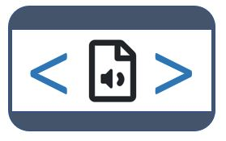

# Audio {#chapter10}

@@@@ Do all screenshots

<br>
<center>
{width=25%}  
</center>
<br>
  
The schema we propose to document audio recordings is a combination of elements from the [Dublin Core Metadata Initiative](https://dublincore.org/) and from the [AudioObject (from schema.org)](https://schema.org/AudioObject) schemas. 

The Dublin Core is a generic and versatile standard, which we use (in an augmented form) for the documentation of Documents (Chapter 4), Images (Chapter 9), and Videos (chapter 11). It contains 15 core elements, to which we added a selection of elements from VideoObject. We also included the elements `keywords`, `topics`, `tags`, `provenance` and `additional` that are found in other schemas documented in the Guide.   

This schema is not intended to document and publish metadata specific to recordings of music. For that purpose, a specialized standard like the [MEAD (Media Enrichment and Description)](https://kb.ddex.net/pages/viewpage.action?pageId=13470928) is more suitable. The schema we propose is intended to be used for archiving and cataloguing any type of audio file, such as recording of interviews, jingles, radio announcements, and others. The schema is kept simple, but it contains the elements needed to document the resources and their content in a way that will foster their discoverability in data catalogs. Compliance with AudioObject elements contributes to search engine optimization, as search engines like Google, Bing and others "reward" metadata published in formats compatible with the schema.org recommendations.

When published in a NADA catalog, the metadata will appear in a specific tab.  @@@ Add Audio" to NADA tabs

<br>
  {width=100%}
<br>
  
## Augmenting audio metadata

Audio recordings typically come with limited metadata. To make them more discoverable, a transcription of the recording can be generated, stored, and indexed in the catalog. This will significantly increase the discoverability of the resource, and offer the possibility to apply semantic searchability on audio metadata. Machine learning solutions are available to automatically generate transcriptions at a very low cost. Tools like [Amazon Transcribe](https://aws.amazon.com/transcribe/), [Google Speech-to-Text](https://cloud.google.com/speech-to-text?hl=en), or [Microsoft Azure's Speech to Text](https://azure.microsoft.com/en-us/services/cognitive-services/speech-to-text/#overview) can reliably convert spoken audio (from audio or video files) to text. The metadata schema we propose includes an element `transcription` that can store transcriptions (and possibly their automatically-generated translations) in the audio recording metadata. Word embedding models and topic models can be applied to the transcriptions to further augment the metadata. 

  
## Schema description 
  
The first three elements of the schema (`repositoryid`, `published`, and `overwrite`) are not part of the audio metadata. They are parameters used to indicate how the audio recording metadata will be published in a NADA catalog. 

   - **`repositoryid`** identifies the collection in which the metadata will be published. By default, the metadata will be published in the central catalog. To publish them in a collection, the collection must have been previously created in NADA. 

   - **`published`**: Indicates whether the metadata must be made visible to visitors of the catalog. By default, the value is 0 (unpublished). This value must be set to 1 (published) to make the metadata visible.

   - **`overwrite`**: Indicates whether metadata that may have been previously uploaded for the same audio recording can be overwritten. By default, the value is "no". It must be set to "yes" to overwrite existing information. Note that an audio recording will be considered as being the same as a previously uploaded one if the identifier provided in the metadata element `audio_description > idno` is the same.

**`metadata_information`** *[Optional ; Not Repeatable]*
The metadata information set is used to document the video <u>metadata</u> (not the audio file itself). This provides information useful for archiving purposes. This block is optional. It is recommended however to enter at least the identification and affiliation of the metadata producer, and the date of creation of the metadata. One reason for this is that metadata can be shared and harvested across catalogs/organizations, so metadata produced by one organization can be found in other data centers. 
  <br>
  {width=100%}
  <br>
  - **`title`** *[Optional ; Not Repeatable ; String]* <br>
  The title of the audio recording.<br>
  - **`idno`** *[Optional ; Not Repeatable ; String]* <br> 
  A unique identifier for the metadata document (unique in the catalog; ideally also unique globally). This is different from the audio file unique ID (see `idno` element in section *audio_description* below), although it is good practice to generate IDs that would maintain an easy connection between the metadata IDNO and the audio IDNO.<br>   
  - **`producers`** *[Optional ; Repeatable]* <br>
  This refers to the producer(s) of the metadata, NOT to the producer(s) of the audio recording. This could for example be the data curator in a data center.<br>
     - **`name`** *[Optional ; Not repeatable ; String]* <br> 
     Name of the metadata producer/curator. An alternative to entering the name of the curator (e.g. for privacy protection purpose) is to enter the curator ID (see the element *abbr* below)<br>
     - **`abbr`** *[Optional ; Not repeatable ; String]* <br> 
     Can be used to provide an ID of the metadata producer/curator.<br>
     - **`affiliation`** *[Optional ; Not repeatable ; String]* <br> 
     Affiliation of the metadata producer/curator.<br>
     - **`role`** *[Optional ; Not repeatable ; String]* <br> 
     Specific role of the metadata producer/curator.<br>
   - **`production_date`** *[Optional ; Not repeatable ; String]* <br> 
   Date the metadata (not the table) was produced.<br>
   - **`version`** *[Optional ; Not repeatable ; String]* <br> 
   Version of the metadata (not version of the table).<br>

**`audio_description`** *[Required ; Not Repeatable]* <br>
The `audio_description` section contains all elements that will be used to describe the audio recording and its content. These are the elements that will be indexed and made searchable in data catalogs.

- **`idno`** *[Mandatory, Not Repeatable ; String]* <br>
  <br>
  {width=100%}
  <br>
  `idno` is a unique identification number that is used to uniquely identify an audio recording. Such a unique identifier will be required by any data catalog. It will also help users of the data cite the audio file properly. The best option is to obtain a [Digital Object Identifier (DOI)](https://www.doi.org/) for the recording, as it will ensure that the ID is unique globally. Alternatively, it can be an ID constructed by an organization using a consistent scheme. Note that the schema allows you to provide more than one ID for an audio recording (see the `other_ids` field described below). This element maps to the "identifier" element in the Dublin Core. 

- **`identifiers`** *[Optional ; Repeatable]* <br>  
   <br>
   {width=100%}
   <br>
   This element is used to enter video identifiers other than the `idno` element described above). It can for example be a Digital Object Identifier (DOI). Note that the identifier entered in `idno` can be repeated here, allowing to attach a "type" attribute to it.
      - **`type`** *[Optional ; Not repeatable ; String]* <br>
      The type of unique identifier, e.g., "DOI".
      - **`value`** *[Required ; Not repeatable ; String]* <br>
      The identifier. <br><br>
  
  - **`title`** *[Required ; Not repeatable ; String]* <br>
  <br>
  {width=100%}
<br>
  The title of the audio recording. This element maps to the element *caption* in AudioObject. 

- **`alt_title`** *[Optional ; Not repeatable ; String]* <br>
  <br>
  {width=100%}
<br>
  An alias for the audio recording title. This element maps to the element *alternateName* in AudioObject.

- **`description`** *[Optional ; Not repeatable ; String]* <br>
  <br>
  {width=100%}
<br>
  A summary of the audio recording, usually about a paragraph long (around 150 to 250 words). This element maps to the element *abstract* in AudioObject.

- **`genre`** *[Optional ; Repeatable ; String]* <br>
  <br>
  {width=100%}
<br>
  Genre of the audio recording, broadcast channel or group. This is a AudioObject element. A controlled vocabulary can be used.

- **`keywords`** *[Optional ; Repeatable]* <br>  
   <br>
   {width=100%}
   <br>
   A list of keywords that provide information on the core content of the audio recording. Keywords provide a convenient solution to improve the discoverability of the audio recording, as it allows terms and phrases not found elsewhere in the audio recording metadata to be indexed and to make the audio recording discoverable by text-based search engines. A controlled vocabulary will preferably be used (although not required), such as the [UNESCO Thesaurus](http://vocabularies.unesco.org/browser/thesaurus/en/). The list can combine keywords from multiple controlled vocabularies, and user-defined keywords.  
      - **`name`** *[Required ; Not repeatable ; String]* <br>
      The keyword itself.
      - **`vocabulary`** *[Optional ; Not repeatable ; String]* <br>
      The controlled vocabulary (including version number or date) from which the keyword is extracted, if any.
      - **`uri`** *[Optional ; Not repeatable ; String]* <br>
      The URL of the controlled vocabulary from which the keyword is extracted, if any.<br><br>

     > Example in R:

 ```{r, eval=F, echo=T}
    my_audio <- list(
      # ... ,
      audio_description = list(
        # ... ,
        
        keywords = list(
          list(name = "Migration", vocabulary = "Unesco Thesaurus (June 2021)", 
               uri = "http://vocabularies.unesco.org/browser/thesaurus/en/page/concept427"),
          list(name = "Migrants", vocabulary = "Unesco Thesaurus (June 2021)", 
               uri = "http://vocabularies.unesco.org/browser/thesaurus/en/page/concept427"),
          list(name = "Refugee", vocabulary = "Unesco Thesaurus (June 2021)", 
               uri = "http://vocabularies.unesco.org/browser/thesaurus/en/page/concept427"),
               
          list(name = "Forced displacement"),
          list(name = "Internally displaced population (IDP)")
        ),
        
        # ...
      ),
      # ... 
    )  
  ```  

- **`topics`** *[Optional ; Repeatable]* <br>   
   <br>
   {width=100%}
   <br>
Information on the topics covered in the audio recording. A controlled vocabulary will preferably be used, for example the [CESSDA Topics classification](https://vocabularies.cessda.eu/vocabulary/TopicClassification), a typology of topics available in 11 languages; or the [Journal of Economic Literature (JEL) Classification System](https://en.wikipedia.org/wiki/JEL_classification_codes), or the [World Bank topics classification](https://documents.worldbank.org/en/publication/documents-reports/docadvancesearch). Note that you may use more than one controlled vocabulary. 
This element is a block of five fields: 
    - **`id`** *[Optional ; Not repeatable ; String]* <br>
    The identifier of the topic, taken from a controlled vocabulary.
    - **`name`** *[Required ; Not repeatable ; String]* <br>
    The name (label) of the topic, preferably taken from a controlled vocabulary.
    - **`parent_id`** *[Optional ; Not repeatable ; String]* <br>
    The parent identifier of the topic (identifier of the item one level up in the hierarchy), if a hierarchical controlled vocabulary is used.
    - **`vocabulary`** *[Optional ; Not repeatable ; String]* <br>
    The name (including version number) of the controlled vocabulary used, if any.
    - **`uri`** *[Optional ; Not repeatable ; String]* <br>
    The URL to the controlled vocabulary used, if any. <br><br>

  > Example in R:

  ```{r, eval=F, echo=T}
    my_audio <- list(
      # ... ,
      audio_description = list(
        # ... ,
        
        topics = list(
        
          list(name = "Demography.Migration", 
               vocabulary = "CESSDA Topic Classification", 
               uri = "https://vocabularies.cessda.eu/vocabulary/TopicClassification"),
          
          list(name = "Demography.Censuses", 
               vocabulary = "CESSDA Topic Classification", 
               uri = "https://vocabularies.cessda.eu/vocabulary/TopicClassification"),
          
          list(id = "F22", 
               name = "International Migration", 
               parent_id = "F2 - International Factor Movements and International Business", 
               vocabulary = "JEL Classification System", 
               uri = "https://www.aeaweb.org/econlit/jelCodes.php?view=jel#J"),
          
          list(id = "O15", 
               name = "Human Resources - Human Development - Income Distribution - Migration", 
               parent_id = "O1 - Economic Development", 
               vocabulary = "JEL Classification System", 
               uri = "https://www.aeaweb.org/econlit/jelCodes.php?view=jel#J"),
          
          list(id = "O12", 
               name = "Microeconomic Analyses of Economic Development", 
               parent_id = "O1 - Economic Development", 
               vocabulary = "JEL Classification System", 
               uri = "https://www.aeaweb.org/econlit/jelCodes.php?view=jel#J"),
          
          list(id = "J61", 
               name = "Geographic Labor Mobility - Immigrant Workers", 
               parent_id = "J6 - Mobility, Unemployment, Vacancies, and Immigrant Workers", 
               vocabulary = "JEL Classification System", 
               uri = "https://www.aeaweb.org/econlit/jelCodes.php?view=jel#J")
               
        ),
        
        # ...
      ),
    )  
  
  ```
  
- **`persons`** *[Optional ; Repeatable]* <br>
    <br>
    {width=100%}
  <br>
    A list of persons who appear in the audio recording.
  - **`name`** *[Required ; Not repeatable ; String]* <br>
    The name of the person.
  - **`role`** *[Optional ; Not repeatable, String]* <br>
    The role of the person.
  
  > Example in R:
    
    ```{r, eval=F, echo=T}
  my_audio <- list(
    metadata_information = list(
      # ... 
    ),
    audio_description = list(
      # ... ,
      
      persons = list(
        list(name = "John Smith",
             role = "Keynote speaker"),
        list(name = "Jane Doe",
             role = "Debate moderator")
      ),
      
      # ...
    ) 
    ```
    <br>
    - **`main_entity`** *[Optional ; Not repeatable ; String]* <br> 
      <br>
      {width=100%}
    <br>
      Indicates the primary entity described in the audio recording. This element maps to the element `mainEntity` in AudioObject. 
    
    - **`date_created`** *[Optional, Not Repeatable ; String]* <br>
      <br>
      {width=100%}
    <br>
      The date the audio recording was created. It is recommended to enter the date in the ISO 8601 format (YYYY-MM-DD or YYYY-MM or YYYY). The date the audio recording is created refers to the date that the audio recording was produced and considered ready for dissemination. 
    
    - **`date_published`** *[Optional, Not Repeatable ; String]* <br>
      <br>
      {width=100%}
    <br>
      The date the audio recording was published. It is recommended to use the ISO 8601 format (YYYY-MM-DD or YYYY-MM or YYYY). 
    
    - **`version`** *[Optional, Not Repeatable ; String]* <br>
      <br>
      {width=100%}
    <br>
      The version of the audio recording refers to the published version of the audio recording.

    - **`status`** *[Optional ; Not repeatable, String]* <br> 
    <br>
    {width=100%}
    <br>
    The status of the audio recording in terms of its stage in a lifecycle. Example terms include `{Incomplete, Draft, Published, Obsolete}`. Some organizations define a set of terms for the stages of their publication lifecycle. This element maps to the element *creativeWorkStatus* in AudioObject.   
    
    - **`ref_country`** *[Optional ; Repeatable]* <br>  
    <br>
      {width=100%}
    <br>
   The list of countries (or regions) covered by the audio recording, if applicable. This refers to the <u>content</u> of the audio recording, not to the country where the recording was released. This is a repeatable block of two elements:
      - **`name`** *[Required ; Not repeatable ; String]* <br>
      The country/region name. Note that many organizations have their own policies on the naming of countries/regions/economies/territories, which data curators will have to comply with.
      - **`code`** *[Optional ; Not repeatable ; String]* <br>
      The country/region code (entered as a string, even for numeric codes). It is recommended to use a standard list of countries and regions, such as the ISO country list ([ISO 3166](https://en.wikipedia.org/wiki/List_of_ISO_3166_country_codes)).

    - **`spatial_coverage`** *[Optional ; Not repeatable ; String]* <br> 
      <br>
      {width=100%}
    <br>
      The spatial coverage indicates the place(s) which are the focus of the content of the audio recording, if any. This field complements the `ref_country` element and allows for more specificity to be provided.  
    
    - **`content_reference_time`** *[Optional ; Not repeatable ; String]* <br>
      <br>
      {width=100%}
    <br>
      The specific time (date/time) described by the audio recording, for works that emphasize a particular moment within an event. This element maps to the element `contentReferenceTime` in AudioObject. 
    
    - **`temporal_coverage`** *[Optional ; Not repeatable ; String]* <br>
      <br>
      {width=100%}
    <br>
      Indicates the period that the audio recording describes, either as a DateTime or as a textual string indicating a time period in ISO 8601 time interval format. This element maps to the element `temporalCoverage` in AudioObject.
    
    - **`recorded_at`** *[Optional ; Not repeatable ; String]* <br>
      <br>
      {width=100%}
    <br>
      The event where the audio was recorded. The audio recording may capture all or part of that event. This element maps to the element `recordedAt` in the AudioObject schema. 
    
    - **`audience`** *[Optional ; Not repeatable ; String]* <br>
      <br>
      {width=100%}
    <br>
      A description of the intended audience, i.e. a group for whom the audio recording was created.
    
    - **`bbox`** *[Optional ; Repeatable]* <br>   
    <br>
      {width=100%}
    <br>
      This element is used to define one or multiple bounding box(es), which are the (rectangular) fundamental geometric description of the geographic coverage of the audio recording. A bounding box is defined by west and east longitudes and north and south latitudes, and includes the largest geographic extent of the audio's geographic coverage. The bounding box provides the geographic coordinates of the top left (north/west) and bottom-right (south/east) corners of a rectangular area. This element can be used in catalogs as the first pass of a coordinate-based search. 
      - **`west`** *[Required ; Not repeatable ; String]* <br>
      West longitude of the box
      - **`east`** *[Required ; Not repeatable ; String]* <br>
      East longitude of the box
      - **`south`** *[Required ; Not repeatable ; String]* <br>
      South latitude of the box
      - **`north`** *[Required ; Not repeatable ; String]* <br>
      North latitude of the box

   - **`languages`** *[Optional, Repeatable]* <br>   
   <br>
   {width=100%}
   <br>
   Most audio recording will only be provided in one language. This is however a repeatable field, to allow for more than one language to be listed. For the language code, ISO codes will preferably be used. The language refers to the language in which the audio recording is published. 
      - **`name`** *[Optional ; Not repeatable ; String]* <br>
      The name of the language.
      - **`code`** *[Optional ; Not repeatable ; String]* <br>
      The code of the language. The use of [ISO 639-2](https://www.loc.gov/standards/iso639-2/php/code_list.php) (the alpha-3 code in Codes for the representation of names of languages) is recommended. Numeric codes must be entered as strings. <br><br>
    
   - **`creator`** *[Optional, Not repeatable ; String]* <br>	
   <br>
   {width=100%}
   <br>
   The organization or person who created/authored the audio recording. 

   - **`production_company`** *[Optional, Not repeatable ; String]* <br> 
   <br>
   {width=100%}
   <br>
   The production company or studio responsible for the recording. This element maps to the element *productionCompany* in AudioObject.

   - **`contributors`** *[Optional, Repeatable]* <br> 
   <br>
   {width=100%}
   <br>
   Identifies the person(s) and/or organization(s) who contributed to the production of the audio recording. The `role` attribute allows defining what the specific contribution of the identified person or organization was. <br>
      - **`name`** *[Optional, Not Repeatable ; String]* <br>
      The name of the contributor (person or organization). 
      - **`affiliation`** *[Optional, Not Repeatable ; String]* <br>
      The affiliation of the contributor. 
      - **`abbreviation`** *[Optional, Not Repeatable ; String]* <br>
      The abbreviation for the institution which has been listed as the affiliation of the contributor.         
      - **`role`** *[Optional, Not Repeatable ; String]* <br>
      The specific role of the contributor. This could for example be "Sound engineer", etc.
      - **`uri`** *[Optional, Not Repeatable ; String]* <br>
      A URI (link to a website, or email address) for the contributor. <br><br>

    > Example in R:

    ```{r, eval=F, echo=T}
    my_audio = list(
      # ... ,
      audio_description = list(
            # ... ,
        
            contributors = list(
              list(name         = "",
                   affiliation  = "",
                   abbreviation = "",
                   role         = "",
                   uri          = "")
            ),  
            
            # ...
      )
    )
    ```

   - **`publisher`** *[Optional, Not repeatable]* <br>
   <br>
   {width=100%}
   <br>
   The entity responsible for publishing the video. 
      - **`name`** *[Optional, Not Repeatable ; String]* <br>
      The name of the publisher (person or organization). 
      - **`affiliation`** *[Optional, Not Repeatable ; String]* <br>
      The affiliation of the publisher. 
      - **`abbreviation`** *[Optional, Not Repeatable ; String]* <br>
      The abbreviation for the institution which has been listed as the affiliation of the publisher.
      - **`role`** *[Optional, Not Repeatable ; String]* <br>
      The specific role of the publisher (this element is unlikely to be used).
      - **`uri`** *[Optional, Not Repeatable ; String]* <br>
      A URI (link to a website, or email address) of the publisher. <br><br>

    > Example in R:

    ```{r, eval=F, echo=T}
    my_audio = list(
      # ... ,
      audio_description = list(
            # ... ,
        
            publisher = list(
              name = "",
              affiliation = "",
              abbreviation = "",
              role = "",
              uri = ""
            ),  
            
            # ...
      )
    )
    ```

   - **`repository`** *[Optional ; Not repeatable ; String]* <br>
   <br>
   {width=100%}
   <br>
   The name of the repository (organization).
   
   - **`funders`** *[Optional ; Repeatable]* <br> 
   <br>
   {width=100%}
   <br>
   This element is used to list the funders (sponsors) of the audio recording. If different funding agencies sponsored different stages of the production process, use the "role" attribute to distinguish them.
      - **`name`** *[Required ; Not repeatable ; String]* <br>
      The name of the sponsor (person or organization)
      - **`abbr`** *[Optional ; Not repeatable ; String]* <br>
      The abbreviation (acronym) of the sponsor.
      - **`grant`** *[Optional ; Not repeatable ; String]* <br>
      The grant number.
      - **`role`** *[Optional ; Not repeatable ; String]* <br>
      The specific role of the sponsor.
        
   - **`translators`** *[Optional ; Repeatable]* <br>
   <br>
   {width=100%}
   <br>
   Organization or person who adapted the audio recording to different languages. This element maps to the element *translator* in AudioObject.
      - **`first_name`** *[Optional ; Not repeatable ; String]* <br>
      The first name of the translator.
      - **`initial`** *[Optional ; Not repeatable ; String]* <br>
      The initials of the translator.
      - **`last_name`** *[Optional ; Not repeatable ; String]* <br>
      The last name of the translator.
      - **`affiliation`** *[Optional ; Not repeatable ; String]* <br>
      The affiliation of the translator. <br><br>

   - **`is_based_on`** *[Optional ; Not repeatable, String]* <br>
   <br>
   {width=100%}
   <br>
   A resource from which this audio recording is derived or from which it is a modification or adaption. This element maps to the element *isBasedOn* in AudioObject. 
     
   - **`is_part_of`** *[Optional ; Not repeatable, String]* <br>
   <br>
   {width=100%}
   <br>
   Indicates another audio recording (or other type of resource, like a video) that this audio recording is part of. This element maps to the element *isPartOf* in AudioObject. 

   - **`relation`** *[Optional ; Not repeatable, String]* <br>
   <br>
   {width=100%}
   <br>
   Defines, as a free text field, the relation between the audio recording being documented and other resources. This is a Dublin Core element.

   - **`audio_provider`** *[Optional ; Not repeatable, String]* <br>
   <br>
   {width=100%}
   <br>
   The person or organization who provides the audio recording. This element maps to the element *provider* in AudioObject. 

   - **`audio_url`** *[Optional ; Not repeatable, String]* <br>
   <br>
   {width=100%}
   <br>
   URL of the audio recording. This element maps to the element *url* in AudioObject.

   - **`embed_url`** *[Optional ; Not repeatable, String]* <br>
   <br>
   {width=100%}
   <br>
   A URL pointing to a player for a specific audio file. This element maps to the element *embedUrl* in AudioObject.

   - **`encoding_format`**  *[Optional ; Not repeatable, String]* <br>
   <br>
   {width=100%}
   <br>
   The media type typically expressed using a MIME format. This element maps to the *encodingFormat* element of the AudioObject schema and to the *format* element of the Dublin Core.
   
   - **`media`** *[Optional ; Repeatable]* <br>   @@@@@@ Not in ReDoc      
   A description of the media on which the recording is stored (other than the online file format); e,g., "CD-ROM". 

   - **`duration`** *[Optional ; Not repeatable, String]* <br>
   <br>
   {width=100%}
   <br>
   The duration of the audio recording in ISO 8601 date format. This element is a AudioObject element.

   ISO 8601 durations are expressed using the following format, where (n) is replaced by the value for each of the date and time elements that <u>follows</u> the (n). For example: (3)H means 3 hours. 

   **`P(n)Y(n)M(n)DT(n)H(n)M(n)S`**

    Where:
    
       - P is the **Period designator** and is always placed at the beginning of the duration
         - (n)Y represents the number of years
         - (n)M represents the number of months
         - (n)W represents the number of weeks
         - (n)D represents the number of days
       - T is the **Time designator** and always precedes the time components
         - (n)H represents the number of hours
         - (n)M represents the number of minutes
         - (n)S represents the number of seconds

   For example, **P1Y2M20DT3H30M8S** represents a duration of one year, two months, twenty days, three hours, thirty minutes, and eight seconds.

   Date and time elements including their designator may be omitted if their value is zero, and lower-order elements may also be omitted for reduced precision. For example, "P23DT23H" and "P4Y" are both acceptable duration representations.

   - **`rights`** *[Optional ; Not repeatable, String]* <br>
   <br>
   {width=100%}
   <br>
   A textual description of the rights associated to the audio recording. If a copyright is available, the three following elements will be used instead of this element. 

   - **`copyright_holder`** *[Optional ; Not repeatable, String]* <br>
   <br>
   {width=100%}
   <br>
   The party holding the legal copyright to the audio recording. This element maps to the *copyrightHolder* element of the AudioObject schema.

   - **`copyright_notice`** *[Optional ; Not repeatable, String]* <br>
   <br>
   {width=100%}
   <br>
   Text of a notice appropriate for describing the copyright aspects of the audio recording, ideally indicating the owner of the copyright. This element maps to the *copyrightNotice* element of the AudioObject schema

   - **`copyright_year`** *[Optional ; Not repeatable, String]* <br>
   <br>
   {width=100%}
   <br>
   The year during which the claimed copyright for the audio recording was first asserted. This element maps to the *copyrightYear* element of the AudioObject schema.

   - **`credit_text`** *[Optional ; Not repeatable, String]* <br>  
   <br>
   {width=100%}
   <br>
   This element that can be used to credit the person(s) and/or organization(s) associated with a published audio recording. This element maps to the *creditText* element of the AudioObject schema.
   
   - **`citation`** *[Optional ; Not repeatable, String]* <br>  
   <br>
   {width=100%}
   <br>
   This element provides a required or recommended citation of the audio file.
   
   - **`transcript`** *[Optional ; Repeatable]* <br>   
   <br>
   {width=100%}
   <br>
   The transcript of the audio recording content, provided as a text. Note that if the text is very long, an alternative is to save it in a separate text file and to make it available in a data catalog as an external resource.
      - **`language`** *[Optional ; Not repeatable ; String]* <br>   
      The language of the transcript.
      - **`text`** *[Optional ; Not repeatable ; String]* <br>   
      The transcript itself.

   - **`album`** *[Optional ; Repeatable]* <br>   
   <br>
   {width=100%}
   <br>
   When an audio recording is published in a catalog containing many other audio recording, it may be desirable to organize them by album. Albums are collections of audio recording organized by theme, period, location, author, or other criteria. One audio recording can belong to more than one album. Albums are "virtual collections". 
      - **`name`** *[Optional ; Not Repeatable ; String]* <br>
      The name (label) of the album. 
      - **`description`** *[Optional ; Not Repeatable ; String]* <br>
      A brief description of the album.
      - **`owner`** *[Optional ; Not Repeatable ; String]* <br>
      The owner of the album.
      - **`uri`** *[Optional ; Not Repeatable ; String]* <br>
      A link (URL) to the album.

   - **`provenance`** *[Optional ; Repeatable]* <br>  
   <br>
   {width=100%}  
   <br>
   Metadata can be programmatically harvested from external catalogs. The `provenance` group of elements is used to store information on the provenance of harvested metadata, and on alterations that may have been done to the harvested metadata. These elements are NOT part of the IPTC or DCMI metadata standard.<br>
     - **`origin_description`** *[Required ; Not repeatable]* <br>
     The `origin_description` elements are used to describe when and from where metadata have been extracted or harvested.<br>  
        - **`harvest_date`** *[Required ; Not repeatable ; String]* <br>
        The date and time the metadata were harvested, in ISO 8601 format.<br>
        - **`altered`** *[Optional ; Not repeatable ; Boolean]* <br>
        A boolean variable ("true" or "false"; "true by default) indicating whether the harvested metadata have been modified before being re-published. In many cases, the unique identifier of the study (element `idno` in the Study Description / Title Statement section) will be modified when published in a new catalog.<br>
        - **`base_url`** *[Required ; Not repeatable ; String]* <br>
        The URL from where the metadata were harvested.<br>
        - **`identifier`** *[Optional ; Not repeatable ; String]* <br>
        The unique dataset identifier (`idno` element) in the source catalog. When harvested metadata are re-published in a new catalog, the identifier will likely be changed. The `identifier` element in `provenance` is used to maintain traceability.<br>
        - **`date_stamp`** *[Optional ; Not repeatable ; String]* <br>
        The datestamp (in UTC date format) of the metadata record in the originating repository (this should correspond to the date the metadata were last updated in the source catalog).<br>
        - **`metadata_namespace`** *[Optional ; Not repeatable ; String]* <br>
        @@@@@@@ <br>

   - **`tags`** *[Optional ; Repeatable]* <br>        
     As shown in section 1.7 of the Guide, tags, when associated with `tag_groups`, provide a powerful and flexible solution to enable custom facets (filters) in data catalogs. See section 1.7 for an example in R.
  <br>
  {width=100%}  
  <br>
    - **`tag`** *[Required ; Not repeatable ; String]* <br>
    A user-defined tag.
    - **`tag_group`** *[Optional ; Not repeatable ; String]* <br><br>
    A user-defined group (optional) to which the tag belongs. Grouping tags allows implementation of controlled facets in data catalogs.

   - **`additional`** *[Optional ; Not repeatable]*<br>
   The `additional` element allows data curators to add their own metadata elements to the schema. All custom elements must be added within the `additional` block; embedding them elsewhere in the schema would cause schema validation to fail.
  <br>
  {width=100%} 
  <br>


## Complete example


### In R

```{r, eval=F, echo=T}

library(nadar)

# ----------------------------------------------------------------------------------
# Enter credentials (API confidential key) and catalog URL
my_keys <- read.csv("C:/confidential/my_API_keys.csv", header=F, stringsAsFactors=F)
set_api_key("my_keys[1,1")  
set_api_url("https://.../index.php/api/") 
set_api_verbose(FALSE)
# ----------------------------------------------------------------------------------

setwd("E:\my_recordings")
thumb = "audio_001.jpg"

# Generate the metadata
my_audio = list(
  
  metadata_information = list(
    title = "",
    idno = "",
    producers = list(
      list(name = "", 
           affiliation = "")
    ),
    production_date = ""
  ),
  
  audio_description = list(
    
      idno = "AUDIO_001",
      
      title = "Interview of the prime minister of Popstan on the 2020 Population and Housing Census",
      date_published = "2020-01-15",
      
      description = "Recording of an interview of the prime minister of Popstan by the Popstan Broadcast Corporation (broadcasted on 2020-01-15) about the June 2020 Population and Housing Census.",
      genre = "Interview",
      
      persons = list(
        list(name = "Mr. John Elected", 
             role = "Prime Minister, Popstan"),
        list(name = "Ms. Jane Star", 
             role = "Interviewer, Popstan Broadcast Corporation (PBC)")
      ),  
      
      main_entity = "",
      
      ref_country = list(
         list(name = "Popstan", code = "POP")
      ),   
      
      topics
      keywords
      
      
      content_location = "PBC Studio",
      
      content_reference_time = "2020-06",
      
      languages = list(
        list(name = "English", code = "EN")
      ),
      
      creator = "",
      
      audio_url = "",
      
      embed_url = ""
      
      duration = "PT35M20S"   # 35 minutes, 20 seconds
      
  )
  
)

# Publish in NADA catalog

audio_add(idno = id, 
          published = 1, 
          overwrite = "yes", 
          metadata = my_audio, 
          thumbnail = thumb)

```

@@@ Result in NADA (screenshots)

### In Python

Script
