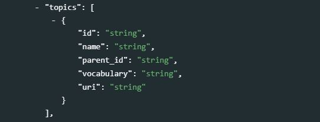
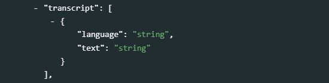

# Videos {#chapter11}

<center>
{width=25%}  
</center>

The schema we propose to document video files is a combination of elements extracted from the [Dublin Core Metadata Initiative](https://dublincore.org/) (DCMI) and from the [VideoObject (from schema.org)](https://schema.org/VideoObject) schemas. This schema is very similar to the schema we proposed for audio files (see chapter 10). 

The Dublin Core is a generic and versatile standard, which we also use (in an augmented form) for the documentation of *Documents* (Chapter 4), *Images* (Chapter 9), and *Audio* files (chapter 10). It contains 15 core elements, to which we added a selection of elements from VideoObject. We also included the elements `keywords`, `topics`, `tags`, `provenance` and `additional` that are found in other schemas documented in the Guide. 

The resulting metadata schema is simple, but it contains the elements needed to document the resources and their content in a way that will foster their discoverability in data catalogs. Compliance with the VideoObject elements contributes to search engine optimization, as search engines like Google, Bing and others "reward" metadata published in formats compatible with the schema.org recommendations. 

<br>
{width=100%}
<br>

When published in a NADA catalog, the metadata related to video files will appear in a specific tab. 

<br>
{width=100%}
<br>

## Augmenting video metadata

Videos typically come with limited metadata. To make them more discoverable, a transcription of the video content can be generated, stored, and indexed in the catalog. This will significantly increase the discoverability of the resource, and offer the possibility to apply semantic searchability on video metadata. Machine learning solutions are available to automatically generate transcriptions at a very low cost. Tools like [Amazon Transcribe](https://aws.amazon.com/transcribe/), [Google Speech-to-Text](https://cloud.google.com/speech-to-text?hl=en), or [Microsoft Azure's Speech to Text](https://azure.microsoft.com/en-us/services/cognitive-services/speech-to-text/#overview) can reliably convert spoken audio (from audio or video files) to text. The metadata schema we propose includes an element `transcription` that can store transcriptions (and possibly their automatically-generated translations) in the video metadata. Word embedding models and topic models can be applied to the transcriptions to further augment the metadata. 

## Schema description 

The first three elements of the schema (`repositoryid`, `published`, and `overwrite`) are not part of the video metadata. They are parameters used to indicate how the video metadata will be published in a NADA catalog. 

   - **`repositoryid`** identifies the collection in which the metadata will be published. By default, the metadata will be published in the central catalog. To publish them in a collection, the collection must have been previously created in NADA. 

   - **`published`**: Indicates whether the metadata must be made visible to visitors of the catalog. By default, the value is 0 (unpublished). This value must be set to 1 (published) to make the metadata visible.

   - **`overwrite`**: Indicates whether metadata that may have been previously uploaded for the same video can be overwritten. By default, the value is "no". It must be set to "yes" to overwrite existing information. Note that a video will be considered as being the same as a previously uploaded one if the identifier provided in the metadata element `video_description > idno` is the same.


**`metadata_information`** *[Optional ; Not Repeatable]*
The metadata information set is used to document the video <u>metadata</u> (not the video itself). This provides information useful for archiving purposes. This set is optional. It is recommended however to enter at least the identification and affiliation of the metadata producer, and the date of creation of the metadata. One reason for this is that metadata can be shared and harvested across catalogs/organizations, so metadata produced by one organization can be found in other data centers. 
  <br>
  {width=100%}
  <br>
   - **`title`** *[Optional ; Not Repeatable ; String]* <br>
   The title of the video.<br>
   - **`idno`** *[Optional ; Not Repeatable ; String]* <br> 
   A unique identifier for the metadata document (unique in the catalog; ideally also unique globally). This is different from the video unique ID (see `idno` element in section *video_description* below), although it is good practice to generate identifiers that would maintain an easy connection between the metadata `idno` element and the video `idno` found under `video_description` (see below).<br>
   - **`producers`** *[Optional ; Repeatable]* <br>
   This refers to the producer(s) of the metadata, NOT to the producer(s) of the video. This could for example be the data curator in a data center.<br>
      - **`name`** *[Optional ; Not repeatable ; String]* <br> 
      Name of the metadata producer/curator. An alternative to entering the name of the curator (e.g. for privacy protection purpose) is to enter the curator ID (see the element *abbr* below)<br>
      - **`abbr`** *[Optional ; Not repeatable ; String]* <br> 
      Can be used to provide an ID of the metadata producer/curator.<br>
      - **`affiliation`** *[Optional ; Not repeatable ; String]* <br> 
      Affiliation of the metadata producer/curator.<br>
      - **`role`** *[Optional ; Not repeatable ; String]* <br> 
      Specific role of the metadata producer/curator.<br>
   - **`production_date`** *[Optional ; Not repeatable ; String]* <br> 
   Date the metadata (not the table) was produced.<br>
   - **`version`** *[Optional ; Not repeatable ; String]* <br> 
   Version of the metadata (not version of the table).<br>

**`video_description`** *[Required ; Not Repeatable]* <br>
The `video_description` section contains all elements that will be used to describe the video and its content. These are the elements that will be indexed and made searchable when published in a data catalog.

   - **`idno`** *[Mandatory, Not Repeatable ; String]* <br>
   <br>
   {width=100%}
   <br>
   `idno` is an identification number that is used to uniquely identify a video in a catalog. It will also help users of the data cite the video properly. The best option is to obtain a [Digital Object Identifier (DOI)](https://www.doi.org/) for the video, as it will ensure that the ID is unique globally. Alternatively, it can be an identifier constructed by an organization using a consistent scheme. Note that the schema allows you to provide more than one identifier for a video (see `identifiers` below). This element maps to the “identifier” element in the Dublin Core. 

   - **`identifiers`** *[Optional ; Repeatable]* <br>  
   <br>
   {width=100%}
   <br>
   This element is used to enter video identifiers other than the `idno` element described above). It can for example be a Digital Object Identifier (DOI). Note that the identifier entered in `idno` can be repeated here, allowing to attach a "type" attribute to it.
      - **`type`** *[Optional ; Not repeatable ; String]* <br>
      The type of unique identifier, e.g., "DOI".
      - **`value`** *[Required ; Not repeatable ; String]* <br>
      The identifier. <br><br>

   - **`title`** *[Required ; Not repeatable ; String]* <br>
   <br>
   {width=100%}
   <br>
   The title of the video. This element maps to the element *caption* in VideoObject. 

   - **`alt_title`** *[Optional ; Not repeatable ; String]* <br>
   <br>
   {width=100%}
   <br>
   An alias for the video title. This element maps to the element *alternateName* in VideoObject.

   - **`description`** *[Optional ; Not repeatable ; String]* <br>
   <br>
   {width=100%}
   <br>
   A brief description of the video, typically about a paragraph long (around 150 to 250 words). This element maps to the element *abstract* in VideoObject.

   - **`genre`** *[Optional ; Repeatable ; String]* <br>
   <br>
   {width=100%}
   <br>
   The genre of the video, broadcast channel or group. This is a VideoObject element. A controlled vocabulary can be used.

   - **`keywords`** *[Optional ; Repeatable]* <br>  
   <br>
   {width=100%}
   <br>
   A list of keywords that provide information on the core content of the video. Keywords provide a convenient solution to improve the discoverability of the video, as it allows terms and phrases not found elsewhere in the video metadata to be indexed and to make the video discoverable by text-based search engines. A controlled vocabulary will preferably be used (although not required), such as the [UNESCO Thesaurus](http://vocabularies.unesco.org/browser/thesaurus/en/). The list can combine keywords from multiple controlled vocabularies, and user-defined keywords.  
      - **`name`** *[Required ; Not repeatable ; String]* <br>
      The keyword itself.
      - **`vocabulary`** *[Optional ; Not repeatable ; String]* <br>
      The controlled vocabulary (including version number or date) from which the keyword is extracted, if any.
      - **`uri`** *[Optional ; Not repeatable ; String]* <br>
      The URL of the controlled vocabulary from which the keyword is extracted, if any.<br><br>

     > Example in R:

 ```{r, eval=F, echo=T}
    my_video <- list(
      # ... ,
      video_description = list(
        # ... ,
        
        keywords = list(
        
          list(name = "Migration", 
               vocabulary = "Unesco Thesaurus (June 2021)", 
               uri = "http://vocabularies.unesco.org/browser/thesaurus/en/page/concept427"),
          
          list(name = "Migrants", 
               vocabulary = "Unesco Thesaurus (June 2021)", 
               uri = "http://vocabularies.unesco.org/browser/thesaurus/en/page/concept427"),
          
          list(name = "Refugee", 
               vocabulary = "Unesco Thesaurus (June 2021)", 
               uri = "http://vocabularies.unesco.org/browser/thesaurus/en/page/concept427"),
               
          list(name = "Forced displacement"),
          
          list(name = "Internally displaced population (IDP)")
        
        ),
        
        # ...
      ),
      # ... 
    )  
  ```  

   - **`topics`** *[Optional ; Repeatable]* <br>   
   <br>
   {width=100%}
   <br>
Information on the topics covered in the video. A controlled vocabulary will preferably be used, for example the [CESSDA Topics classification](https://vocabularies.cessda.eu/vocabulary/TopicClassification), a typology of topics available in 11 languages; or the [Journal of Economic Literature (JEL) Classification System](https://en.wikipedia.org/wiki/JEL_classification_codes), or the [World Bank topics classification](https://documents.worldbank.org/en/publication/documents-reports/docadvancesearch). Note that you may use more than one controlled vocabulary. This element is a block of five fields:<br> 
    - **`id`** *[Optional ; Not repeatable ; String]* <br>
    The identifier of the topic, taken from a controlled vocabulary.<br>
    - **`name`** *[Required ; Not repeatable ; String]* <br>
    The name (label) of the topic, preferably taken from a controlled vocabulary.<br>
    - **`parent_id`** *[Optional ; Not repeatable ; String]* <br>
    The parent identifier of the topic (identifier of the item one level up in the hierarchy), if a hierarchical controlled vocabulary is used.<br>
    - **`vocabulary`** *[Optional ; Not repeatable ; String]* <br>
    The name (including version number) of the controlled vocabulary used, if any.<br>
    - **`uri`** *[Optional ; Not repeatable ; String]* <br>
    The URL to the controlled vocabulary used, if any. <br><br>

  > Example in R:

  ```{r, eval=F, echo=T}
    my_video <- list(
      # ... ,
      video_description = list(
        # ... ,
        
        topics = list(
        
          list(name = "Demography.Migration", 
               vocabulary = "CESSDA Topic Classification", 
               uri = "https://vocabularies.cessda.eu/vocabulary/TopicClassification"),
          
          list(name = "Demography.Censuses", 
               vocabulary = "CESSDA Topic Classification", 
               uri = "https://vocabularies.cessda.eu/vocabulary/TopicClassification"),
          
          list(id = "F22", 
               name = "International Migration", 
               parent_id = "F2 - International Factor Movements and International Business", 
               vocabulary = "JEL Classification System", 
               uri = "https://www.aeaweb.org/econlit/jelCodes.php?view=jel#J"),
          
          list(id = "O15", 
               name = "Human Resources - Human Development - Income Distribution - Migration", 
               parent_id = "O1 - Economic Development", 
               vocabulary = "JEL Classification System", 
               uri = "https://www.aeaweb.org/econlit/jelCodes.php?view=jel#J"),
          
          list(id = "O12", 
               name = "Microeconomic Analyses of Economic Development", 
               parent_id = "O1 - Economic Development", 
               vocabulary = "JEL Classification System", 
               uri = "https://www.aeaweb.org/econlit/jelCodes.php?view=jel#J"),
          
          list(id = "J61", 
               name = "Geographic Labor Mobility - Immigrant Workers", 
               parent_id = "J6 - Mobility, Unemployment, Vacancies, and Immigrant Workers", 
               vocabulary = "JEL Classification System", 
               uri = "https://www.aeaweb.org/econlit/jelCodes.php?view=jel#J")
               
        ),
        
        # ...
      ),
    )  
  ```

   - **`persons`** *[Optional ; Repeatable]* <br>
   <br>
   {width=100%}
   <br>
   A list of persons who appear in the video.<br>
      - **`name`** *[Required ; Not repeatable ; String]* <br>
      The name of the person.<br>
      - **`role`** *[Optional ; Not repeatable, String]* <br>
      The role of the person mentioned in `name`.<br>
<br>   

  > Example in R:
    
  ```{r, eval=F, echo=T}
  my_video <- list(
    metadata_information = list(
      # ... 
    ),
    video_description = list(
      # ... ,
      
      persons = list(
        
        list(name = "John Smith",
             role = "Keynote speaker"),
        
        list(name = "Jane Doe",
             role = "Debate moderator")
        
      ),
    # ...
  ) 
  ```

   - **`main_entity`** *[Optional ; Not repeatable ; String]* <br> 
   <br>
   {width=100%}
   <br>
   Indicates the primary entity described in the video. This element maps to the element `mainEntity` in VideoObject. 

   - **`date_created`** *[Optional, Not Repeatable ; String]* <br>
   <br>
   {width=100%}
   <br>
   The date the video was created. It is recommended to enter the date in the ISO 8601 format (YYYY-MM-DD or YYYY-MM or YYYY). The date the video is created refers to the date that the video was produced and considered ready for dissemination. 

   - **`date_published`** *[Optional, Not Repeatable ; String]* <br>
   <br>
   {width=100%}
   <br>
   The date the video was published. It is recommended to use the ISO 8601 format (YYYY-MM-DD or YYYY-MM or YYYY). 

   - **`version`** *[Optional, Not Repeatable ; String]* <br>
   <br>
   {width=100%}
   <br>
   The version of the video refers to the published version of the video.

   - **`status`** *[Optional ; Not repeatable, String]* <br> 
   <br>
   {width=100%}
   <br>
   The status of the video in terms of its stage in a lifecycle. A controlled vocabulary should be used. Example terms include {`Incomplete, Draft, Published, Obsolete`}. Some organizations define a set of terms for the stages of their publication lifecycle. This element maps to the element *creativeWorkStatus* in VideoObject. 
   
   - **`country`** *[Optional ; Repeatable]* <br>   
   <br>
   {width=100%}
   <br>
   The list of countries (or regions) covered by the video, if applicable. This refers to the <u>content</u> of the video, not to the country where the video was released. This is a repeatable block of two elements:
      - **`name`** *[Required ; Not repeatable ; String]* <br>
      The country/region name. Note that many organizations have their own policies on the naming of countries/regions/economies/territories, which data curators will have to comply with.
      - **`code`** *[Optional ; Not repeatable ; String]* <br>
      The country/region code (entered as a string, even for numeric codes). It is recommended to use a standard list of countries and regions, such as the ISO country list ([ISO 3166](https://en.wikipedia.org/wiki/List_of_ISO_3166_country_codes)).

   - **`spatial_coverage`** *[Optional ; Not repeatable ; String]* <br> 
   <br>
   {width=100%}
   <br>
   Indicates the place(s) which are depicted or described in the video. This element maps to the element `contentLocation` in VideoObject. This element complements the `ref_country` element. It can be used to qualify the geographic coverage of the video, in the form of a free text. 

   - **`bbox`** *[Optional ; Repeatable]* <br>   
   <br>
   {width=100%}
   <br>
   This element is used to define one or multiple bounding box(es), which are the (rectangular) fundamental geometric description of the geographic coverage of the video. A bounding box is defined by west and east longitudes and north and south latitudes, and includes the largest geographic extent of the video's geographic coverage. The bounding box provides the geographic coordinates of the top left (north/west) and bottom-right (south/east) corners of a rectangular area. This element can be used in catalogs as the first pass of a coordinate-based search. 
      - **`west`** *[Required ; Not repeatable ; String]* <br>
      West longitude of the box
      - **`east`** *[Required ; Not repeatable ; String]* <br>
      East longitude of the box
      - **`south`** *[Required ; Not repeatable ; String]* <br>
      South latitude of the box
      - **`north`** *[Required ; Not repeatable ; String]* <br>
      North latitude of the box
      
   - **`content_reference_time`** *[Optional ; Not repeatable ; String]* <br>
   <br>
   {width=100%}
   <br>
   The specific time described by the video, for works that emphasize a particular moment within an event. This element maps to the element `contentReferenceTime` in VideoObject. 

   - **`temporal_coverage`** *[Optional ; Not repeatable ; String]* <br>
   <br>
   {width=100%}
   <br>
   Indicates the period that the video applies to, i.e. that it describes, either as a DateTime or as a textual string indicating a time period in ISO 8601 time interval format. This element maps to the element `temporalCoverage` in VideoObject.

   - **`recorded_at`** *[Optional ; Not repeatable ; String]* <br>
   <br>
   {width=100%}
   <br>
   This element maps to the element `recordedAt` in VideoObject schema. It identifies the event where the video was recorded (e.g., a conference, or a demonstration). 

   - **`audience`** *[Optional ; Not repeatable ; String]* <br>
   <br>
   {width=100%}
   <br>
   A brief description of the intended audience of the video, i.e. the group for whom it was created.

   - **`language`** *[Optional, Repeatable]* <br>   
   <br>
   {width=100%}
   <br>
   Most videos will only be provided in one language. This is however a repeatable field, to allow for more than one language to be listed. For the language code, ISO codes will preferably be used. The language refers to the language in which the video is published. This is a block of two elements (at least one must be provided for each language):
      - **`name`** *[Optional ; Not repeatable ; String]* <br>
      The name of the language.
      - **`code`** *[Optional ; Not repeatable ; String]* <br>
      The code of the language. The use of [ISO 639-2](https://www.loc.gov/standards/iso639-2/php/code_list.php) (the alpha-3 code in Codes for the representation of names of languages) is recommended. Numeric codes must be entered as strings. <br><br>
    
   - **`creator`** *[Optional, Not repeatable ; String]* <br>	 
   <br>
   {width=100%}
   <br>
   Organization or person who created/authored the video. 

   - **`production_company`** *[Optional, Not repeatable ; String]* <br>   
   <br>
   {width=100%}
   <br>
   The production company or studio responsible for the item. This element maps to the element *productionCompany* in VideoObject.

   - **`contributors`** *[Optional, Repeatable]* <br> 
   <br>
   {width=100%}
   <br>
   Identifies the person(s) and/or organization(s) who contributed to the production of the video. The `role` attribute allows defining what the specific contribution of the identified person or organization was. <br>
      - **`name`** *[Optional, Not Repeatable ; String]* <br>
      The name of the contributor (person or organization). 
      - **`affiliation`** *[Optional, Not Repeatable ; String]* <br>
      The affiliation of the contributor. 
      - **`abbreviation`** *[Optional, Not Repeatable ; String]* <br>
      The abbreviation for the institution which has been listed as the affiliation of the contributor.         
      - **`role`** *[Optional, Not Repeatable ; String]* <br>
      The specific role of the contributor. This could for example be "Cameraman", "Sound engineer", etc.
      - **`uri`** *[Optional, Not Repeatable ; String]* <br>
      A URI (link to a website, or email address) for the contributor. <br><br>

    > Example in R:

    ```{r, eval=F, echo=T}
    my_video = list(
      # ... ,
      video_description = list(
            # ... ,
            contributors = list(
              list(
                name         = "",
                affiliation  = "",
                abbreviation = "",
                role         = "",
                uri          = "")
            ),  
            # ...
      )
    )
    ```

   - **`publisher`** *[Optional, Not repeatable ; String]* <br>   
   <br>
   {width=100%}
   <br>

    > Example in R:

    ```{r, eval=F, echo=T}
    my_video = list(
      # ... ,
      video_description = list(
            # ... ,
            publisher = "@@@@@",
            # ...
      )
    )
    ```

   - **`repository`** *[Optional ; Not repeatable ; String]* <br>
   <br>
   {width=100%}
   <br>
   The name of the repository (organization).

- **`contacts`** *[Optional, Repeatable]* <br>   @@@@@ Do screenshot
Users of the video may need further clarification and information. This section may include the name-affiliation-email-URI of one or multiple contact persons. This block of elements will identify contact persons who can be used as resource persons regarding problems or questions raised by the user community. The URI attribute should be used to indicate a URN or URL for the homepage of the contact individual. The email attribute is used to indicate an email address for the contact individual. It is recommended to avoid putting the actual name of individuals. The information provided here should be valid for the long term. It is therefore preferable to identify contact persons by a title. The same applies for the email field. Ideally, a "generic" email address should be provided. It is easy to configure a mail server in such a way that all messages sent to the generic email address would be automatically forwarded to some staff members.
<br>
   {width=100%}  @@@@
   <br>
    - **`name`** *[Required, Not repeatable, String]* <br>
    Name of a person or unit (such as a data help desk). It will usually be better to provide a title/function than the actual name of the person. Keep in mind that people do not stay forever in their position.
    - **`role`** *[Optional, Not repeatable, String]* <br>
    The specific role of `name`, in regards to supporting users. This element is used when multiple names are provided, to help users identify the most appropriate person or unit to contact. 
    - **`affiliation`** *[Optional, Not repeatable, String]* <br>
    Affiliation of the person/unit.
    - **`email`** *[Optional, Not repeatable, String]* <br>
    E-mail address of the person.
    - **`telephone`** *[Optional, Not repeatable, String]* <br>
    A phone number that can be called to obtain information or provide feedback on the table. This should never be a personal phone number; a corporate number (typically of a data help desk) should be provided.
    - **`uri`** *[Optional, Not repeatable, String]* <br>
    A link to a website where contact information for `name` can be found.<br>

   - **`sponsors`** *[Optional ; Repeatable]* <br> (@@@@@@ redo screenshot)
   <br>
   {width=100%}
   <br>
   This element is used to list the funders/sponsors of the video. If different funding agencies financed different stages of the production process, use the "role" attribute to distinguish them.
      - **`name`** *[Required ; Not repeatable ; String]* <br>
      The name of the sponsor (person or organization)
      - **`abbr`** *[Optional ; Not repeatable ; String]* <br>
      The abbreviation (acronym) of the sponsor.
      - **`grant`** *[Optional ; Not repeatable ; String]* <br>
      The grant (or contract) number.
      - **`role`** *[Optional ; Not repeatable ; String]* <br>
      The specific role of the sponsor.
        
   - **`translators`** *[Optional ; Repeatable]* <br>   
   <br>
   {width=100%}
   <br>
   Organization or person who adapted the video to different languages. This element maps to the element *translator* in VideoObject.
      - **`first_name`** *[Optional ; Not repeatable ; String]* <br>
      The first name of the translator.
      - **`initial`** *[Optional ; Not repeatable ; String]* <br>
      The initials of the translator.
      - **`last_name`** *[Optional ; Not repeatable ; String]* <br>
      The last name of the translator.
      - **`affiliation`** *[Optional ; Not repeatable ; String]* <br>
      The affiliation of the translator. <br><br>

   - **`is_based_on`** *[Optional ; Not repeatable, String]* <br>
   <br>
   {width=100%}
   <br>
   A resource from which this video is derived or from which it is a modification or adaption. This element maps to the element *isBasedOn* in VideoObject. 
   
   - **`is_part_of`** *[Optional ; Not repeatable, String]* <br>
   <br>
   {width=100%}
   <br>
   Indicates another video that this video is part of. This element maps to the element *isPartOf* in VideoObject. 

   - **`relations`** *[Optional ; Repeatable, String]* <br>   @@@@ Added ("relations" in ReDoc; fix and redo screenshot)
   <br>
   {width=100%}
   <br>
   Defines, as a free text field, the relation between the video being documented and other resources. This is a Dublin Core element.

   - **`video_provider`** *[Optional ; Not repeatable, String]* <br>
   <br>
   {width=100%}
   <br>
   The person or organization who provides the video. This element maps to the element *provider* in VideoObject. 

   - **`video_url`** *[Optional ; Not repeatable, String]* <br>
   <br>
   {width=100%}
   <br>
   URL of the video. This element maps to the element *url* in VideoObject.

   - **`embed_url`** *[Optional ; Not repeatable, String]* <br>  @@@@ how not to include the embedded image in the Guide?
   <br>
   {width=100%}
   <br>
   A URL pointing to a player for a specific video. This element maps to the element *embedUrl* in VideoObject. For example, "<iframe width="560" height="315" src="https://www.youtube.com/embed/7Aif1xjstws" title="YouTube video player" frameborder="0" allow="accelerometer; autoplay; clipboard-write; encrypted-media; gyroscope; picture-in-picture" allowfullscreen></iframe>"
   @@@@@@@@@ Provide a description of what this is, and how to get that content. 

   - **`encoding_format`**  *[Optional ; Not repeatable, String]* <br> 
   <br>
   {width=100%}
   <br>
   The video file format, typically expressed using a MIME format. This element corresponds to the "encodingFormat" element of VideoObject and maps to the element *format* of the Dublin Core.

   - **`duration`** *[Optional ; Not repeatable, String]* <br>
   <br>
   {width=100%}
   <br>
   The duration of the item (movie, audio recording, event, etc.) in ISO 8601 format. This element is a VideoObject element. 
   
   ISO 8601 durations are expressed using the following format, where (n) is replaced by the value for each of the date and time elements that <u>follows</u> the (n). For example: (3)H means 3 hours. 

   **`P(n)Y(n)M(n)DT(n)H(n)M(n)S`**

  Where:<br>
   - P is the **Period designator** and is always placed at the beginning of the duration<br>
     - (n)Y represents the number of years<br>
     - (n)M represents the number of months<br>
     - (n)W represents the number of weeks<br>
     - (n)D represents the number of days<br>
   - T is the **Time designator** and always precedes the time components<br>
     - (n)H represents the number of hours<br>
     - (n)M represents the number of minutes<br>
     - (n)S represents the number of seconds<br>

   For example, **P1Y2M20DT3H30M8S** represents a duration of one year, two months, twenty days, three hours, thirty minutes, and eight seconds.

   Date and time elements including their designator may be omitted if their value is zero, and lower-order elements may also be omitted for reduced precision. For example, "P23DT23H" and "P4Y" are both acceptable duration representations.

   As *M* can represent both Month and Minutes, the time designator *T* is used. For example, "P1M" is a one-month duration and "PT1M" is a one-minute duration.

   This information on the ISO 8601 was adapted from [wikipedia](https://en.wikipedia.org/wiki/ISO_8601) where more detailed information can be found.

   - **`rights`** *[Optional ; Not repeatable, String]* <br>
   <br>
   {width=100%}
   <br>
   A textual description of the rights associated to the video. If a copyright is available, the three following elements will be used instead of this element. 

   - **`copyright_holder`** *[Optional ; Not repeatable, String]* <br>
   <br>
   {width=100%}
   <br>
   The party holding the legal copyright to the video. This element corresponds to the "copyrightHolder" element of VideoObject.

   - **`copyright_notice`** *[Optional ; Not repeatable, String]* <br>
   <br>
   {width=100%}
   <br>
   Text of a notice appropriate for describing the copyright aspects of the video, ideally indicating the owner of the copyright. This element corresponds to the "copyrightNotice" element of VideoObject.

   - **`copyright_year`** *[Optional ; Not repeatable, String]* <br>
   <br>
   {width=100%}
   <br>
   The year during which the claimed copyright for the video was first asserted. This element corresponds to the "copyrightYear" element of VideoObject.

   - **`credit_text`** *[Optional ; Not repeatable, String]* <br>   
   <br>
   {width=100%}
   <br>
   This element can be used to credit the person(s) and/or organization(s) associated with a published video. This element corresponds to the "creditText" element of VideoObject.
   
   - **`citation`** *[Optional ; Not repeatable, String]* <br>   
   <br>
   {width=100%}
   <br>
   This element provides a required or recommended citation of the audio file.

   - **`transcript`** *[Optional ; Repeatable, String]* <br>   
   <br>
   {width=100%}
   <br>
   The transcript of the video content, provided as a text. Note that if the text is very long, an alternative is to save it in a separate text file and to make it available in a data catalog as an external resource.
      - **`language`** *[Optional ; Not repeatable ; String]* <br>   
      The language of the transcript.
      - **`text`** *[Optional ; Not repeatable ; String]* <br>   
      The transcript itself.
      
   - **`media`** *[Optional ; Repeatable ; String]* <br>        
   <br>
   {width=100%}
   <br>
   A description of the media on which the recording is stored (other than the online file format); e,g., "CD-ROM".    

   - **`album`** *[Optional ; Repeatable]* <br>  
   <br>
   {width=100%}
   <br>
   When a video is published in a catalog containing many other videos, it may be desirable to organize them by album. Albums are collections of videos organized by theme, period, location, or other criteria. One video can belong to more than one album. Albums are "virtual collections". 
      - **`name`** *[Optional ; Not Repeatable ; String]* <br>
      The name (label) of the album. 
      - **`description`** *[Optional ; Not Repeatable ; String]* <br>
      A brief description of the album.
      - **`owner`** *[Optional ; Not Repeatable ; String]* <br>
      The owner of the album.
      - **`uri`** *[Optional ; Not Repeatable ; String]* <br>
      A link (URL) to the album.

   - **`provenance`** *[Optional ; Repeatable]* <br>  
   <br>
   {width=100%}  
   <br>
   Metadata can be programmatically harvested from external catalogs. The `provenance` group of elements is used to store information on the provenance of harvested metadata, and on alterations that may have been done to the harvested metadata. These elements are NOT part of the IPTC or DCMI metadata standard.<br>
     - **`origin_description`** *[Required ; Not repeatable]* <br>
     The `origin_description` elements are used to describe when and from where metadata have been extracted or harvested. <br> 
        - **`harvest_date`** *[Required ; Not repeatable ; String]* <br>
        The date and time the metadata were harvested, in ISO 8601 format.<br>
        - **`altered`** *[Optional ; Not repeatable ; Boolean]* <br>
        A boolean variable ("true" or "false"; "true by default) indicating whether the harvested metadata have been modified before being re-published. In many cases, the unique identifier of the study (element `idno` in the Study Description / Title Statement section) will be modified when published in a new catalog.<br>
        - **`base_url`** *[Required ; Not repeatable ; String]* <br>
        The URL from where the metadata were harvested.<br>
        - **`identifier`** *[Optional ; Not repeatable ; String]* <br>
        The unique dataset identifier (`idno` element) in the source catalog. When harvested metadata are re-published in a new catalog, the identifier will likely be changed. The `identifier` element in `provenance` is used to maintain traceability.<br>
        - **`date_stamp`** *[Optional ; Not repeatable ; String]* <br>
        The datestamp (in UTC date format) of the metadata record in the originating repository (this should correspond to the date the metadata were last updated in the source catalog).<br>
        - **`metadata_namespace`** *[Optional ; Not repeatable ; String]* <br>
        @@@@@@@ <br>

   - **`tags`** *[Optional ; Repeatable]* <br>
   As shown in section 1.7 of the Guide, tags, when associated with `tag_groups`, provide a powerful and flexible solution to enable custom facets (filters) in data catalogs. See section 1.7 for an example in R.
  <br>
  {width=100%}  
  <br>
    - **`tag`** *[Required ; Not repeatable ; String]* <br>
    A user-defined tag.
    - **`tag_group`** *[Optional ; Not repeatable ; String]* <br><br>
    A user-defined group (optional) to which the tag belongs. Grouping tags allows implementation of controlled facets in data catalogs.

   - **`additional`** *[Optional ; Not repeatable]*<br>
   The `additional` element allows data curators to add their own metadata elements to the schema. All custom elements must be added within the `additional` block; embedding them elsewhere in the schema would cause schema validation to fail.
  <br>
  {width=100%} 
  <br>


## Complete example


### In R

```{r, eval=F, echo=T}

library(nadar)

# ----------------------------------------------------------------------------------
# Enter credentials (API confidential key) and catalog URL
my_keys <- read.csv("C:/confidential/my_API_keys.csv", header=F, stringsAsFactors=F)
set_api_key("my_keys[1,1")  
set_api_url("https://.../index.php/api/") 
set_api_verbose(FALSE)
# ----------------------------------------------------------------------------------

setwd("C:/my_videos")

id = "MDA_VDO_001"

thumb = "vdo_001.jpg"

# Generate the metadata

my_video = list(
  
  metadata_information = list(
    title = "Mogadishu, Somalia: A Call for Help",
    idno = id,
    producers = list(
      list(name = "John Doe", affiliation = "National Library")
    ),
    production_date = "2021-09-03"
  ),
  
  video_description = list(
    
    idno = id,
    
    title = "Mogadishu, Somalia: A Call for Help",
    
    alt_title = "Somalia: Guterres in Mogadishu",
    
    date_published = "2011-09-01",
    
    description = "During a landmark visit, the United Nations High Commissioner for Refugees calls on the international community to rapidly increase aid to Somalia.",
    
    genre = "Documentary",
    
    persons = list(
      list(name = "António Guterres", role = "High Commissioner for Refugees"),
      list(name = "Fadhumo", role = "Somali internally displaced person (IDP)")
    ),
    
    main_entity = "United Nations High Commission for Refugees (UNHCR), the UN Refugee Agency",
    
    country = list(
      list(name = "Somalia", code = "SOM")
    ),
    
    spatial_coverage = "Mogadishu, Somalia",
    
    content_reference_time = "2011-09",
    
    languages = list(
      list(name = "English", code = "EN")
    ),
    
    creator = "United Nations High Commission for Refugees (UNHCR)",
    
    video_url = "https://www.youtube.com/watch?v=7Aif1xjstws",
    
    embed_url = '<iframe width="560" height="315" src="https://www.youtube.com/embed/7Aif1xjstws" title="YouTube video player" frameborder="0" allow="accelerometer; autoplay; clipboard-write; encrypted-media; gyroscope; picture-in-picture" allowfullscreen></iframe>',
    
    duration = "PT2M14S"  # 2 minutes and 14 seconds
    
  )
  
)

# Publish in the NADA catalog

video_add(idno = id, 
          published = 1, 
          overwrite = "yes", 
          metadata = my_video, 
          thumbnail = thumb)

```

In NADA, the video will now appear in the "All" tab and in the "Videos" tab. 

  <br>
  {width=100%} 
  <br>
  
If the `embed_url` element was provided, the video can be played within the NADA page. 
@@@@ provide some additional information: what are the conditions to make a video playable from NADA; what if not in YouTube?

  <br>
  {width=100%} 
  <br>


### In Python

Script

