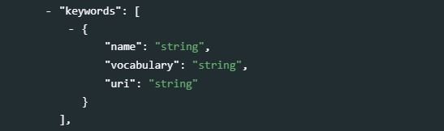
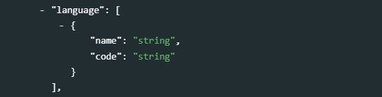

@@@@@@@@@ resequence ReDoc

# Videos {#chapter11}

<center>
{width=25%}  
</center>

The schema we propose is a combination of elements from the [Dublin Core Metadata Initiative](https://dublincore.org/) and from the [VideoObject (from schema.org)](https://schema.org/VideoObject) schemas. The schema is very similar to the schema used for audio files (see chapter 10). 

The Dublin Core is a generic and versatile standard, which we use (in an augmented form) for the documentation of 8Documents* (Chapter 4), *Images* (Chapter 9), and *Audio* files (chapter 10). It contains 15 core elements, to which we added a selection of elements from VideoObject. We also ensure that the structure of our video schema is, as much as possible, consistent with other schemas described in this Guide. We included the elements `keywords`, `topics`, `tags` also found in the schemas used to document microdata, documents, time series, tables, images, and scripts.  

The resulting metadata schema is simple, but it contains the elements needed to document the resources and their content in a way that will foster their discoverability in data catalogs. Compliance with the VideoObject elements contributes to search engine optimization, as search engines like Google, Bing and others "reward" metadata published in formats compatible with the schema.org recommendations. 

<br>
{width=100%}
<br>

When published in a NADA catalog, the metadata will appear in a specific tab. 

<br>
{width=100%}
<br>

## Schema description 

The first block of metadata elements, `metadata_information`, is used to document the metadata (not the video itself). This provides information useful for archiving purposes. This block is optional. It is recommended however to enter at least the identification and affiliation of the metadata producer, and the date of creation of the metadata. One reason for this is that metadata can be shared and harvested across catalogs/organizations, so metadata produced by one organization can be found in other data centers. 

**`metadata_information`** *[Optional ; Not Repeatable]*
  <br>
  {width=100%}
  <br>
   - **`title`** *[Optional ; Not Repeatable ; String]* <br>
   The title of the video.<br>
   - **`idno`** *[Optional ; Not Repeatable ; String]* <br> 
   A unique identifier for the metadata document (unique in the catalog; ideally also unique globally). This is different from the video unique ID (see `idno` element in section *video_description* below), although it is good practice to generate IDs that would maintain an easy connection between the metadata IDNO and the video IDNO.<br>
   - **`producers`** *[Optional ; Repeatable]* <br>
   This refers to the producer(s) of the metadata, NOT to the producer(s) of the video. This could for example be the data curator in a data center.<br>
      - **`name`** *[Optional ; Not repeatable ; String]* <br> 
      Name of the metadata producer/curator. An alternative to entering the name of the curator (e.g. for privacy protection purpose) is to enter the curator ID (see the element *abbr* below)<br>
      - **`abbr`** *[Optional ; Not repeatable ; String]* <br> 
      Can be used to provide an ID of the metadata producer/curator.<br>
      - **`affiliation`** *[Optional ; Not repeatable ; String]* <br> 
      Affiliation of the metadata producer/curator.<br>
      - **`role`** *[Optional ; Not repeatable ; String]* <br> 
      Specific role of the metadata producer/curator.<br>
   - **`production_date`** *[Optional ; Not repeatable ; String]* <br> 
   Date the metadata (not the table) was produced.<br>
   - **`version`** *[Optional ; Not repeatable ; String]* <br> 
   Version of the metadata (not version of the table).<br>

**`video_description`** *[Required ; Not Repeatable]* <br>
The `video_description` section contains all elements that will be used to describe the video and its content. These are the elements that will be indexed and made searchable in data catalogs.

   - **`idno`** *[Mandatory, Not Repeatable ; String]* <br>
   <br>
   {width=100%}
   <br>
   `idno` is a unique identification number that is used to uniquely identify a video. Such a unique identifier will be required by any data catalog. It will also help users of the data cite the video properly. The best option is to obtain a [Digital Object Identifier (DOI)](https://www.doi.org/) for the video, as it will ensure that the ID is unique globally. Alternatively, it can be an ID constructed by an organization using a consistent scheme. Note that the schema allows you to provide more than one ID for a video (see the `other_ids` field described below). This element maps to the “identifier” element in the Dublin Core. 

   - **`id_numbers`** *[Optional ; Repeatable]* <br>  @@@@@@@@@ add in ReDoc
   <br>
   {width=100%}
   <br>
   This element is used to enter document ID others than the archive catalog ID (i.e. other than the `idno` element described above). It can for example be a Digital Object Identifier (DOI), if the DOI was not used in `idno`.
      - **`type`** *[Optional ; Not repeatable ; String]* <br>
      The type of unique ID.
      - **`value`** *[Required ; Not repeatable ; String]* <br>
      The ID <br><br>

   - **`title`** *[Required ; Not repeatable ; String]* <br>
   <br>
   {width=100%}
   <br>
   The title of the video. This element maps to the element *caption* in VideoObject. 

   - **`alt_title`** *[Optional ; Not repeatable ; String]* <br>
   <br>
   {width=100%}
   <br>
   An alias for the item title. This element maps to the element *alternateName* in VideoObject.

   - **`description`** *[Optional ; Not repeatable ; String]* <br>
   <br>
   {width=100%}
   <br>
   A summary of the video, usually about a paragraph long (around 150 to 250 words). This element maps to the element *abstract* in VideoObject.

   - **`genre`** *[Optional ; Repeatable ; String]* <br>
   <br>
   {width=100%}
   <br>
   Genre of the creative work, broadcast channel or group. This is a VideoObject element.

   - **`keywords`** *[Optional ; Repeatable]* <br>  @@@@@@@@@@@ Not structured in ReDoc
   <br>
   {width=100%}
   <br>
   Words or phrases that describe salient aspects of the video. A controlled vocabulary can be employed. Keywords should be selected from a standard thesaurus, preferably an international, multilingual thesaurus. <br>
      - **`keyword`** *[Required ; String ; Non repeatable]* <br>
      Keyword (or phrase). Keywords summarize the content or subject matter of the video. 
      - **`vocab`** *[Optional ; Not repeatable ; String]* <br>
      Controlled vocabulary from which the keyword is extracted, if any. The "vocab" attribute is provided for specification of the controlled vocabulary in use, e.g., the [Library of Congress Subject Headings (LCSH)](https://www.loc.gov/aba/cataloging/subject/).  
      - **`uri`** *[Optional ; Not repeatable ; String]* <br>
      URI of the controlled vocabulary used, if any.

     > Example:

    ```{r, eval=F, echo=T}
    my_video <- list(
      # ... 
      video_description = list(
        # ... ,
        keywords = list(
          list(keyword = "",
               vocab = "",
               uri = ""),
          list(keyword = "",
               vocab = "",
                uri = "")
           ),
        # ...
        ),
      # ...    
    )          
    ```

   - **`topics`** *[Optional ; Repeatable]* <br>
   <br>
   {width=100%}
   <br>
   The classification field indicates the broad substantive topic(s) that the video cover. A topic classification facilitates referencing and searches in electronic survey catalogs. <br>
      - **`topic`** *[Required ; Not repeatable]* <br>
      Topics should be selected from a standard thesaurus, preferably an international, multilingual thesaurus, such as the thesaurus used by the [Council of European Social Science Data Archives (CESSDA)](https://vocabularies.cessda.eu/vocabulary/TopicClassification). 
      - **`vocab`** *[Required ; Not repeatable]* <br>
      The `vocab` attribute is provided for specification of the controlled vocabulary in use.
      - **`uri`** *[Required ; Not repeatable]* <br>
      URI of the controlled vocabulary used, if any. 
   
     > Example:
    
    ```{r, eval=F, echo=T}
    my_video <- list(
      metadata_information = list(
        # ... 
      ),
      video_description = list(
        # ... ,
        topics = list(
          list(topic = "",
               vocab = "",
               uri = ""),
          list(topic = "",
               vocab = "",
               uri = "")
          ),
      # ...
    ) 
    ```

   - **`persons`** *[Optional ; Repeatable]* <br>
   <br>
   {width=100%}
   <br>
   A list of persons who appear in the video.
      - **`name`** *[Required ; Not repeatable ; String]* <br>
      The name of the person.
      - **`role`** *[Optional ; Not repeatable, String]* <br>
      The role of the person.
   
     > Example:
    
    ```{r, eval=F, echo=T}
    my_video <- list(
      metadata_information = list(
        # ... 
      ),
      video_description = list(
        # ... ,
        persons = list(
          list(name = "John Smith",
               role = "Keynote speaker"),
          list(name = "Jane Doe",
               role = "Debate moderator")
          ),
      # ...
    ) 
    ```

   - **`main_entity`** *[Optional ; Not repeatable ; String]* <br> 
   <br>
   {width=100%}
   <br>
   Indicates the primary entity described in the video. This element maps to the element `mainEntity` in VideoObject. 

   - **`date_created`** *[Optional, Not Repeatable ; String]* <br>
   <br>
   {width=100%}
   <br>
   The date the video was created. It is recommended to enter the date in the ISO 8601 format (YYYY-MM-DD or YYYY-MM or YYYY). The date the video is created refers to the date that the video was produced and considered ready for dissemination. 

   - **`date_published`** *[Optional, Not Repeatable ; String]* <br>
   <br>
   {width=100%}
   <br>
   The date the video was published. It is recommended to use the ISO 8601 format (YYYY-MM-DD or YYYY-MM or YYYY). 

   - **`version`** *[Optional, Not Repeatable ; String]* <br>
   <br>
   {width=100%}
   <br>
   The version of the video refers to the published version of the video.

   - **`ref_country`** *[Optional ; Repeatable]* <br>   @@@@@@@@@ `country` in ReDoc
   <br>
   {width=100%}
   <br>
   The list of countries (or regions) covered by the video, if applicable. This refers to the <u>content</u> of the video, not to the country where the video was released. This is a repeatable block of two elements:
       - **`name`** *[Required ; Not repeatable ; String]* <br>
       The country/region name. Note that many organizations have their own policies on the naming of countries, which data curators will have to comply with.
       - **`abbreviation`** *[Optional ; Not repeatable ; String]* <br>
       In the field "Abbreviation", we recommend that you enter the 3-letter ISO code of the country. 
       - **`code`** *[Optional ; Not repeatable ; String]* <br>
       The country/region code (entered as a string, even for numeric codes). It is recommended to use a standard list of countries and regions, such as the ISO country list (ISO 3166).

   - **`content_location`** *[Optional ; Not repeatable ; String]* <br> 
   <br>
   {width=100%}
   <br>
   The location depicted or described in the video. This element maps to the element `contentLocation` in VideoObject. This element complements the `ref_country` element. It can be used to qualify the geographic coverage of the video, in the form of a free text.

   - **`spatial_coverage`** *[Optional ; Not repeatable ; String]* <br> @@@@@@@@ keep?
   <br>
   {width=100%}
   <br>
   Indicates the place(s) which are the focus of the video.  

   - **`content_reference_time`** *[Optional ; Not repeatable ; String]* <br>
   <br>
   {width=100%}
   <br>
   The specific time described by the video, for works that emphasize a particular moment within an event. This element maps to the element `contentReferenceTime` in VideoObject. 

   - **`temporal_coverage`** *[Optional ; Not repeatable ; String]* <br>
   <br>
   {width=100%}
   <br>
   Indicates the period that the video applies to, i.e. that it describes, either as a DateTime or as a textual string indicating a time period in ISO 8601 time interval format. This element maps to the element `temporalCoverage` in VideoObject.

   - **`recorded_at`** *[Optional ; Not repeatable ; String]* <br>
   <br>
   {width=100%}
   <br>
   This element maps to the element `recordedAt` in VideoObject schema. The Event where the CreativeWork was recorded. The CreativeWork may capture all or part of the event.

   - **`audience`** *[Optional ; Not repeatable ; String]* <br>
   <br>
   {width=100%}
   <br>
   (VideoObject) : A description of the intended audience, i.e. a group for whom something was created.

   - **`bbox`** *[Optional ; Repeatable]* <br>   @@@@@@@ Not in ReDoc
   <br>
   {width=100%}
   <br>
   This element is used to define one or multiple bounding box(es), which are the (rectangular) fundamental geometric description of the geographic coverage of the video. A bounding box is defined by west and east longitudes and north and south latitudes, and includes the largest geographic extent of the video's geographic coverage. The bounding box provides the geographic coordinates of the top left (north/west) and bottom-right (south/east) corners of a rectangular area. This element can be used in catalogs as the first pass of a coordinate-based search. 
      - **`west`** *[Required ; Not repeatable ; String]* <br>
      West longitude of the box
      - **`east`** *[Required ; Not repeatable ; String]* <br>
      East longitude of the box
      - **`south`** *[Required ; Not repeatable ; String]* <br>
      South latitude of the box
      - **`north`** *[Required ; Not repeatable ; String]* <br>
      North latitude of the box

   - **`languages`** *[Optional, Repeatable]* <br>   @@@@@@@@ Language / not repeatable in ReDoc
   <br>
   {width=100%}
   <br>
   Most videos will only be provided in one language. This is however a repeatable field, to allow for more than one language to be listed. For the language code, ISO codes will preferably be used. The language refers to the language in which the video is published. 
       - **`name`** *[Mandatory, Not repeatable ; String]* <br>
       Enter the full name of the language(s) that apply for which the video is provided. It is recommended to enter the name of the language as listed in the [ISO 639 standardized nomenclature of languages](https://en.wikipedia.org/wiki/List_of_ISO_639-1_codes).  
       - **`code`** *[Optional, Not repeatable ; String]* <br>
       It is recommended to make use of the 2-character ISO 639 code. 
    
   - **`creator`** *[Optional, Not repeatable ; String]* <br>	
   <br>
   {width=100%}
   <br>
   Organization or person who created/authored the video. 

   - **`production_company`** *[Optional, Not repeatable ; String]* <br> 
   <br>
   {width=100%}
   <br>
   The production company or studio responsible for the item. This element maps to the element *productionCompany* in VideoObject.

   - **`contributors`** *[Optional, Repeatable]* <br> @@@@@@@@@@@@ not structured in ReDoc
   <br>
   {width=100%}
   <br>
   Identifies the person(s) and/or organization(s) who contributed to the production of the video. The `role` attribute allows defining what the specific contribution of the identified person or organization was. <br>
      - **`name`** *[Optional, Not Repeatable ; String]* <br>
      The name of the contributor (person or organization). 
      - **`affiliation`** *[Optional, Not Repeatable ; String]* <br>
      The affiliation of the contributor. 
      - **`abbreviation`** *[Optional, Not Repeatable ; String]* <br>
      The abbreviation for the institution which has been listed as the affiliation of the contributor.         - **`role`** *[Optional, Not Repeatable ; String]* <br>
      The specific role of the contributor. This could for example be "Cameraman", "Sound engineer", etc.
      - **`uri`** *[Optional, Not Repeatable ; String]* <br>
      A URI (link to a website, or email address) for the contributor. <br><br>

    > Example:

    ```{r, eval=F, echo=T}
    my_video = list(
      # ... ,
      video_description = list(
            # ... ,
            contributors = list(
              list(name         = "",
              affiliation  = "",
              abbreviation = "",
              role         = "",
              uri          = "")
            ),  
            # ...
      )
    )
    ```

   - **`publisher`** *[Optional, Not repeatable]* <br>   @@@@@@@@@@ Not structured in ReDoc
   <br>
   {width=100%}
   <br>
   The entity responsible for publishing the video. 
      - **`name`** *[Optional, Not Repeatable ; String]* <br>
      The name of the publisher (person or organization). 
      - **`affiliation`** *[Optional, Not Repeatable ; String]* <br>
      The affiliation of the publisher. 
      - **`abbreviation`** *[Optional, Not Repeatable ; String]* <br>
      The abbreviation for the institution which has been listed as the affiliation of the publisher.
      - **`role`** *[Optional, Not Repeatable ; String]* <br>
      The specific role of the publisher (this element is unlikely to be used).
      - **`uri`** *[Optional, Not Repeatable ; String]* <br>
      A URI (link to a website, or email address) of the publisher. <br><br>

    > Example:

    ```{r, eval=F, echo=T}
    my_video = list(
      # ... ,
      video_description = list(
            # ... ,
            publisher = list(
              name = "",
              affiliation = "",
              abbreviation = "",
              role = "",
              uri = ""
            ),  
            # ...
      )
    )
    ```

   - **`funder`** *[Optional ; Repeatable]* <br> 
   <br>
   {width=100%}
   <br>
   This element is used to list the sponsors of the video. If different funding agencies sponsored different stages of the production process, use the "role" attribute to distinguish them.
      - **`name`** *[Required ; Not repeatable ; String]* <br>
      The name of the sponsor (person or organization)
      - **`abbr`** *[Optional ; Not repeatable ; String]* <br>
      The abbreviation (acronym) of the sponsor.
      - **`grant`** *[Optional ; Not repeatable ; String]* <br>
      The grant number.
      - **`role`** *[Optional ; Not repeatable ; String]* <br>
      The specific role of the sponsor.
        
   - **`translators`** *[Optional ; Repeatable]* <br>
   <br>
   {width=100%}
   <br>
   Organization or person who adapted the video to different languages. This element maps to the element *translator* in VideoObject.
      - **`first_name`** *[Optional ; Not repeatable ; String]* <br>
      The first name of the translator
      - **`initial`** *[Optional ; Not repeatable ; String]* <br>
      The initials of the translator
      - **`last_name`** *[Optional ; Not repeatable ; String]* <br>
      The last name of the translator
      - **`affiliation`** *[Optional ; Not repeatable ; String]* <br>
      The affiliation of the translator <br><br>
    
   - **`status`** *[Optional ; Not repeatable, String]* <br> 
   <br>
   {width=100%}
   <br>
   The status of the video in terms of its stage in a lifecycle. Example terms include Incomplete, Draft, Published, Obsolete. Some organizations define a set of terms for the stages of their publication lifecycle. This element maps to the element *creativeWorkStatus* in VideoObject. 

   - **`is_based_on`** *[Optional ; Not repeatable, String]* <br>
   <br>
   {width=100%}
   <br>
   A resource from which this work is derived or from which it is a modification or adaption. This element maps to the element *isBasedOn* in VideoObject. 
     
   - **`is_part_of`** *[Optional ; Not repeatable, String]* <br>
   <br>
   {width=100%}
   <br>
   Indicates another video that this video is part of. This element maps to the element *isPartOf* in VideoObject. 

   - **`relation`** *[Optional ; Not repeatable, String]* <br>
   <br>
   {width=100%}
   <br>
   Defines, as a free text field, the relation between the video being documented and other resources. This is a Dublin Core element.

   - **`video_provider`** *[Optional ; Not repeatable, String]* <br>
   <br>
   {width=100%}
   <br>
   The person or organization who provides the video. This element maps to the element *provider* in VideoObject. 

   - **`video_url`** *[Optional ; Not repeatable, String]* <br>
   <br>
   {width=100%}
   <br>
   URL of the video. This element maps to the element *url* in VideoObject.

   - **`embed_url`** *[Optional ; Not repeatable, String]* <br>
   <br>
   {width=100%}
   <br>
   A URL pointing to a player for a specific video. This element maps to the element *embedUrl* in VideoObject.

   - **`encodingFormat`**  *[Optional ; Not repeatable, String]* <br>
   <br>
   {width=100%}
   <br>
   The media type typically expressed using a MIME format. This element is a VideoObject element and maps to the element *format* of the Dublin Core.

   - **`duration`** *[Optional ; Not repeatable, String]* <br>
   <br>
   {width=100%}
   <br>
   The duration of the item (movie, audio recording, event, etc.) in ISO 8601 date format. This element is a VideoObject element.

   ISO 8601 durations are expressed using the following format, where (n) is replaced by the value for each of the date and time elements that follow the (n):

   P(n)Y(n)M(n)DT(n)H(n)M(n)S

    Where:
    
       - P is the Period designator and is always placed at the beginning of the duration
       - (n)Y represents the number of years
       - (n)M represents the number of months
       - (n)W represents the number of weeks
       - (n)D represents the number of days
       - T is the Time designator and always precedes the time components
       - (n)H represents the number of hours
       - (n)M represents the number of minutes
       - (n)S represents the number of seconds

   For example, **P1Y2M20DT3H30M8S** represents a duration of one year, two months, twenty days, three hours, thirty minutes, and eight seconds.

   Date and time elements including their designator may be omitted if their value is zero, and lower-order elements may also be omitted for reduced precision. For example, "P23DT23H" and "P4Y" are both acceptable duration representations.

   As *M* can represent both Month and Minutes, the time designator *T* is used. For example, "P1M" is a one-month duration and "PT1M" is a one-minute duration.

   This information on the ISO 8601 was adapted from [wikipedia](https://en.wikipedia.org/wiki/ISO_8601) where more detailed information can be found.

   - **`rights`** *[Optional ; Not repeatable, String]* <br>
   <br>
   {width=100%}
   <br>
   A textual description of the rights associated to the video. If a copyright is available, the three following elements will be used instead of this element. 

   - **`copyrightHolder`** *[Optional ; Not repeatable, String]* <br>
   <br>
   {width=100%}
   <br>
   The party holding the legal copyright to the video. This element is a VideoObject element.

   - **`copyrightNotice`** *[Optional ; Not repeatable, String]* <br>
   <br>
   {width=100%}
   <br>
   Text of a notice appropriate for describing the copyright aspects of the video, ideally indicating the owner of the copyright. This element is a VideoObject element.

   - **`copyrightYear`** *[Optional ; Not repeatable, String]* <br>
   <br>
   {width=100%}
   <br>
   The year during which the claimed copyright for the video was first asserted. This element is a VideoObject element.

   - **`creditText`** *[Optional ; Not repeatable, String]* <br>   @@@@@@ Not in ReDoc
   <br>
   {width=100%}
   <br>
   This element that can be used to credit the person(s) and/or organization(s) associated with a published video. This element is a VideoObject element.

   - **`transcript`** *[Optional ; Not repeatable, String]* <br>   @@@@@@ Not in ReDoc
   <br>
   {width=100%}
   <br>
   The transcript of the video content, provided as a text. Note that if the text is very long, an alternative is to save it in a separate text file and to make it available in a data catalog as an external resource.
      - **`language`** *[Optional ; Not repeatable ; String]* <br>   
      The language of the transcript.
      - **`text`** *[Optional ; Not repeatable ; String]* <br>   
      The transcript itself.

   - **`album`** *[Optional ; Repeatable]* <br>   @@@@@@ Not in ReDoc
   <br>
   {width=100%}
   <br>
   When a video is published in a catalog containing many other videos, it may be desirable to organize them by album. Albums are collections of videos organized by theme, period, location, or other criteria. One video can belong to more than one album. Albums are "virtual collections". 
      - **`name`** *[Optional ; Not Repeatable ; String]* <br>
      The name (label) of the album. 
      - **`description`** *[Optional ; Not Repeatable ; String]* <br>
      A brief description of the album.
      - **`owner`** *[Optional ; Not Repeatable ; String]* <br>
      The owner of the album.
      - **`uri`** *[Optional ; Not Repeatable ; String]* <br>
      A link (URL) to the album.

   - **`provenance`** *[Optional ; Repeatable]* <br>  
   <br>
   {width=100%}  
   <br>
   Metadata can be programmatically harvested from external catalogs. The `provenance` group of elements is used to store information on the provenance of harvested metadata, and on alterations that may have been done to the harvested metadata. These elements are NOT part of the IPTC or DCMI metadata standard.
     - **`origin_description`** *[Required ; Not repeatable]* <br>
     The `origin_description` elements are used to describe when and from where metadata have been extracted or harvested.  
        - **`harvest_date`** *[Required ; Not repeatable ; String]* <br>
        The date and time the metadata were harvested, in ISO 8601 format.
        - **`altered`** *[Optional ; Not repeatable ; Boolean]* <br>
        A boolean variable ("true" or "false"; "true by default) indicating whether the harvested metadata have been modified before being re-published. In many cases, the unique identifier of the study (element `idno` in the Study Description / Title Statement section) will be modified when published in a new catalog.
        - **`base_url`** *[Required ; Not repeatable ; String]* <br>
        The URL from where the metadata were harvested.
        - **`identifier`** *[Optional ; Not repeatable ; String]* <br>
        The unique dataset identifier (`idno` element) in the source catalog. When harvested metadata are re-published in a new catalog, the identifier will likely be changed. The `identifier` element in `provenance` is used to maintain traceability.
        - **`date_stamp`** *[Optional ; Not repeatable ; String]* <br>
        The datestamp (in UTC date format) of the metadata record in the originating repository (this should correspond to the date the metadata were last updated in the source catalog).
        - **`metadata_namespace`** *[Optional ; Not repeatable ; String]* <br>
        @@@@@@@ 

   - **`tags`** *[Optional ; Repeatable]* <br>
   Tags provides easy way to include custom-facets in data catalogs. 
  <br>
  {width=100%}  
  <br>
      - `tag` *[Required ; Not repeatable ; String]* <br>
      The tag.
      - `tag_group` *[Optional ; Not repeatable ; String]* <br>
      The tag group (tag groups are used to organize tags in facets in data catalogs).<br>
      
   - **`additional`**
  <br>
  {width=100%}  
  <br>


## Complete example


### In R

```{r, eval=F, echo=T}

library(nadar)

setwd("E:\my_documents")

# Set API key and URL
set_api_key("my_api_key")                                # Enter a valid API key
set_api_url("http://my_catalog.ihsn.org/index.php/api/") # Provide the NADA catalog URL

thumb = "vdo_001.jpg"

# Generate the metadata
my_video = list(
  
  metadata_information = list(
    title = "Mogadishu, Somalia: A Call for Help",
    idno = "MDA_VDO_001",
    producers = list(
      list(name = "Olivier Dupriez", 
           affiliation = "My Data Archive")
    ),
    production_date = "2021-09-03"
  ),
  
  video_description = list(
      idno = "VDO_001",
      title = "Mogadishu, Somalia: A Call for Help",
      alt_title = "Somalia: Guterres in Mogadishu",
      date_published = "2011-09-01",
      description = "During a landmark visit, the UN High Commissioner for Refugees calls on the international community to rapidly increase aid to Somalia.",
      genre = "Documentary",
      persons = list(
        list(name = "António Guterres", role = "High Commissioner for Refugees"),
        list(name = "Fadhumo", role = "Somali internally displaced person (IDP)")
      ),  
      main_entity = "United Nations High Commission for Refugees (UNHCR), the UN Refugee Agency",
      ref_country = list(
         list(name = "Somalia", code = "SOM")
      ),   
      content_location = "Mogadishu, Somalia",
      content_reference_time = "2011-09",
      languages = list(
        list(name = "English", code = "EN")
      ),
      creator = "United Nations High Commission for Refugees (UNHCR)",
      video_url = "https://www.youtube.com/watch?v=7Aif1xjstws",
      embed_url = '<iframe width="560" height="315" src="https://www.youtube.com/embed/7Aif1xjstws" title="YouTube video player" frameborder="0" allow="accelerometer; autoplay; clipboard-write; encrypted-media; gyroscope; picture-in-picture" allowfullscreen></iframe>'
      duration = "PT2M14S"  # 2 minutes and 14 seconds
  )
  
)

# Publish in NADA catalog
video_add(idno = id, published = 1, overwrite = "yes", metadata = my_video, thumbnail = thumb)

```


### In Python

Script

