# Research projects and scripts {#chapter12}

<br>
<center>
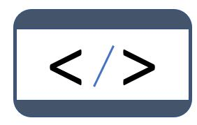{width=25%}  
</center>
<br>

## Rationale

Documenting, cataloguing and disseminating **data** has the potential to increase the volume and diversity of data analysis. There is also much value in documenting, cataloguing and disseminating **data processing and analysis scripts**. Technological solutions such as GitHub, [Jupyter Notebooks or Jupiter Lab](https://jupyter.org/) facilitate the preservation and sharing of code, and enable collaborative work around data analysis. Coding style guides like the [Google style guides](https://google.github.io/styleguide/) and the [Guide to Reproducible Code in Ecology and Evolution](https://www.britishecologicalsociety.org/wp-content/uploads/2017/12/guide-to-reproducible-code.pdf) by the British Ecological Society, contribute to foster the usability, adaptability, and reproducibility of code. But these tools and guidelines do not fully address the issue of cataloguing and discoverability of the data processing and analysis programs and scripts. We propose --as a complement to collaboration tools and style guides-- a metadata schema to document data analysis projects and scripts. The production of structured metadata will contribute not only to discoverability, but also to the reproducibility, replicability, and auditability of data analytics. 

There are multiple reasons to make reproducibility, replicability, and auditability of data analytics a component of a data dissemination system. This will:  

   -	Improve the **quality of research and analysis**. Public scrutiny enables contestability and independent quality control of the output of research and analysis; these are strong incentives for additional rigor in data analysis. 
   -	Allow the **re-purposing or expansion of analysis** by the research community, thereby increasing the relevance, utility and value of both the data and of the analytical work. 
   -	Strengthen the **reputation and credibility** of the analysis. 
   -	Provide students and peers with rich **training materials**.  
   -	In some cases, satisfy a **requirement** imposed by peer reviewed journals or financial sponsors of research activities. For example, the [Data and Policy Code of the American Economic Association](https://www.aeaweb.org/journals/policies/data-code) (accessed on June 29, 2020), states that *It is the policy of the American Economic Association to publish papers only if the data and code used in the analysis are clearly and precisely documented, and access to the data and code is clearly and precisely documented and is non-exclusive to the authors. Authors of accepted papers that contain empirical work, simulations, or experimental work must provide, prior to acceptance, information about the data, programs, and other details of the computations sufficient to permit replication, as well as information about access to data and programs.* 
   -	Contribute to **assuring the fairness of policy advice and interventions** resulting from data analysis. Data analysis may be used to identify or target the beneficiaries of policies and programs, or may contribute otherwise to the design and implementation of development policies and projects. By doing so, they also contribute to identifying populations to be excluded from these interventions. Errors and biases may be introduced in analysis by accidental or intentional human errors, by the algorithms themselves, or they can result from flaws in the data. The analysis that informs such projects and policies should therefore be made auditable and contestable, i.e. documented and published. 


## Motivation for open analytics

[Stodden et al (2013)](http://stodden.net/icerm_report.pdf) make a useful distinction between five levels of research openness:

1.	**Reviewable research**. The descriptions of the research methods can be independently assessed, and the results judged credible. This includes both traditional peer review and community review and does not imply reproducibility. 
2.	**Replicable research**. Tools are made available that would allow one to duplicate the results of the research, for example by running the authors' code to produce the plots shown in the publication. (Here tools might be limited in scope, e.g., only essential data or executables, and might only be made available to referees or only upon request.)
3.	**Confirmable research**. The main conclusions of the research can be attained independently without the use of software provided by the author. (But using the complete description of algorithms and methodology provided in the publication and any supplementary materials.)
4.	**Auditable research**. Sufficient records (including data and software) have been archived so that the research can be defended later if necessary or differences between independent confirmations resolved. The archive might be private. 
5.	**Open or Reproducible research**. This is auditable research made openly available. This comprised well-documented and fully open code and data that are publicly available that would allow one to (a) fully audit the computational procedure, (b) replicate and also independently reproduce the results of the research, and (c) extend the results or apply the method to new problems.


## Schema description

To make data processing and analysis scripts more discoverable and usable, we propose a metadata schema inspired by the schemas available to document datasets. The proposed schema contains two main blocks of metadata elements: the *document description* intended to document the metadata themselves (the term *document* refers to the file that will contain the metadata), and the *project description* used to document the research or analytical work and the related scripts. We also include in the schema the `tags`, `provenance`, and `additional` elements common to all schemas.  

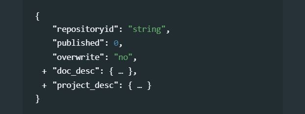{width=100%}

### Document description

**`doc_desc`** *[Optional ; Not repeatable]* <br>
The document description is a description of the metadata file being generated. It provides metadata about the metadata. This block is optional. It is used to document the research project metadata (not the project itself). This information is not needed to document the project; it only provides information, useful for archiving purposes, on the process of generating the project metadata. The information it contains are typically useful to a catalog administrator; they are not useful to the public and do not need to be displayed in the publicly-available catalog interface. This block is optional. It is recommended to enter at least the identification of the metadata producer, her/his affiliation, and the date the metadata were created. One reason for this is that metadata can be shared and harvested across catalogs/organizations, so the metadata produced by one organization can be found in other data centers (complying with standards and schema is precisely intended to facilitate inter-operability of catalogs and automated information sharing). Keeping track of who documented a resource is thus useful.

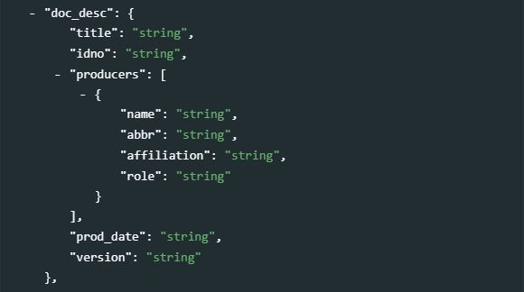{width=100%}

- **`title`** *[Optional ; Not Repeatable ; String]* <br>
The title of the project. This will usually be the same as the element `title` in the project description section. 

- **`idno`** *[Optional ; Not Repeatable ; String]* <br>
A unique identifier for the metadata document.

- **`producers`** *[Optional ; Not Repeatable]* <br>
A list of producers <u>of the metadata</u> (who may be but do not have to be the authors of the research project and scripts being documented). These can be persons or organizations. The following four elements are used to identify them and specify their specific role as and if relevant (this block of four elements is repeated for each contributor to the metadata):

   - **`name`** *[Optional ; Not Repeatable ; String]* <br>
   Name of the person or organization who documented the project. 
   - **`abbr`**: *[Optional ; Not Repeatable ; String]* <br>
   The abbreviation of the organization that is referenced under 'name' above. 
   - **`affiliation`** *[Optional ; Not Repeatable ; String]* <br>
   Affiliation of the person(s) or organization(s) who documented the project. 
   - **`role`** *[Optional ; Not Repeatable ; String]* <br>
   This attribute is used to distinguish different stages of involvement in the metadata production process.  <br><br>

- **`prod_date`** *[Optional ; Not Repeatable ; String]* <br> 
The date the metadata on this project was produced (not distributed or archived), preferably in ISO 8601 format (YYYY-MM-DD or YYY-MM).

- **`version`** *[Optional ; Not Repeatable ; String]* <br>
Documenting a research project is not a trivial exercise. It may happen that, having identified errors or omissions in the metadata or having received suggestions for improvement, a new version of the metadata is produced. This element is used to identify and describe the current version of the metadata. It is good practice to provide a version number, and information on what distinguishes this version from the previous one(s) if relevant. 

  > Example

    ```{r, eval=F, echo=T}
    my_project = list(
      doc_desc = list(
        idno = "META_RP_001", 
        producers = list(
          list(name = "John Doe",
               affiliation = "National Data Center of Popstan")
        ),
        prod_date = "2020-12-27",
        version = "Version 1.0 - Original version of the documentation provided by the author of the project"
      ),
      # ... 
    )
    ```


### Project description 

**`project_desc`** *[Required ; Not repeatable]* <br>
The project description contains the metadata related to the project itself. All efforts should be made to provide as much and as detailed information as possible.

- **`title_statement`** *[Required ; Non repeatable]* <br>
The *title_statement* is a group of five elements, two of them mandatory. 

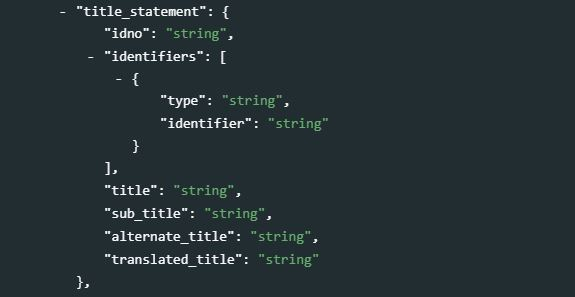{width=100%}

   - **`idno`** *[Required ; Not Repeatable ; String]* <br>
   A unique identifier to the project. Define and use a consistent scheme to use. Avoid including spaces in the ID.  The ID number of a research project is a unique number that is used to identify a particular project. This ID number is a vital reference. A research project can be the formal cause of a survey, scripts, tables and knowledge products. Do not include spaces in the idno element. Use a system that guarantees uniqueness of the ID (DOI, own reference number).
   - **`identifiers`** *[Optional ; Repeatable]*  <br> 
   This repeatable element is used to enter identifiers (IDs) other than the `idno` entered in the `title_statement`. It can for example be a Digital Object Identifier (DOI). Note that the identifier entered in `idno` can (and in some cases should) be repeated here. The element `idno` does not provide a `type` parameter; repeating it in this section makes it possible to add that information. 
      - **`type`** *[Optional ; Not repeatable ; String]* <br>
      The type of unique ID, e.g. "DOI".
      - **`identifier`** *[Required ; Not repeatable ; String]* <br>
      The identifier itself. <br>
   - **`title`** *[Required ; Not Repeatable ; String]* <br>
    The title is the official name of the project as it may be stated in reports, papers or other documents. The title will in most cases be identical to the Document Title (see above). The title may correspond to the title of an academic paper, of a project impact evaluation, etc. Pay attention to capitalization in the title.
   - **`sub_title`** *[Optional ; Not Repeatable ; String]*  <br>
   Subtitle is optional and rarely used. A short subtitle for the project. Often the sub title is used to qualify the title or rephrase the title.    - **`alternate_title`** *[Optional ; Not Repeatable ; String]* <br>
   An alternate title of the project. This would be any alternate title that would help discover the research project. In countries with more than one official language, a translation of the title may be provided. Likewise, the translated title may simply be a translation into English from a country's own language.  
   - **`abbreviated_title`** *[Optional ; Not Repeatable ; String]* <br>
   An abbreviated version of the title of the project. Some projects may be referred to using a short name.    
   - **`translated_title`** *[Optional ; Not Repeatable ; String]* <br>
   A translated version of the title (this will be used for example when a catalog documents all entries in English, but wants to preserve the title of a project in its original language when the original language is not English).

<br>

   > Example in R:
  
    ```{r, eval=F, echo=T}
    my_project = list(
      # ... ,
      project_desc = list(
        
      	title_statement = list(
      		idno = "RR_WB_2020_001",
      		identifiers = list(
      	    list(type = "DOI", identifier = "XXX-XXX-XXXX")
      	  ),
      		date = "2020",
      		title = "Predicting Food Crises - Econometric Model"
      	),

      	# ...
      ),
      # ...
    )
    ```

- **`abstract`** *[Optional ; Non repeatable ; String]* <br>
The abstract should provide a clear summary of the purposes, objectives and content of the project. An abstract can make reference to the various outputs associated with the research project. 
{width=100%}

	> Example in R (extracted from https://microdata.worldbank.org/index.php/catalog/4218):

    ```{r, eval=F, echo=T}
    my_project = list(
      # ... ,
      project_desc = list(
    		# ... ,
        
    		abstract = "Food price inflation is an important metric to inform economic policy but traditional sources of consumer prices are often produced with delay during crises and only at an aggregate level. This may poorly reflect the actual price trends in rural or poverty-stricken areas, where large populations reside in fragile situations.
This data set includes food price estimates and is intended to help gain insight in price developments beyond what can be formally measured by traditional methods. The estimates are generated using a machine-learning approach that imputes ongoing subnational price surveys, often with accuracy similar to direct measurement of prices. The data set provides new opportunities to investigate local price dynamics in areas where populations are sensitive to localized price shocks and where traditional data are not available.",

    		# ...
      ),
      # ...
    )
    ```

- **`review_board`** *[Optional ; Non repeatable ; String]* <br>
Information on whether and when the project was submitted, reviewed, and approved by an institutional review board (or independent ethics committee, ethical review board (ERB), research ethics board, or equivalent).
<br>
{width=100%}
<br>

- **`output`** *[Optional ; Repeatable]* <br>
This element will describe and reference all substantial/intended products of the research project, which may include publications, reports, websites, datasets, interactive applications, presentations, visualizations, and others. An output may also be referred to as a "deliverable". 
<br>
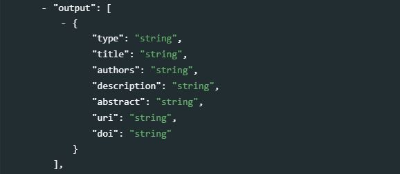{width=100%}
<br>
The `output` is a repeatable block of seven elements, used to document all output of the research project:
    - **`type`** *[Optional ; Non repeatable]* <br>
    Type of output. The type of output relates to the media which is used to convey or communicate the intended results, findings or conclusions of the research project. This field may be controlled by a controlled vocabulary. The kind on content could be "Working paper", "Database", etc. 
    
   - **`title`** *[Required ; Non repeatable]* <br>
   Formal title of the output. Depending upon the kind of output, the title will vary in formality.
   - **`authors`** *[Optional ; Non repeatable]* <br>
   Authors of the output; if multiple, they will be listed in one same text field. 
   - **`description`** *[Optional ; Non repeatable]* <br>
   Brief description of the output (NOT an abstract) 
   - **`abstract`** *[Optional ; Non repeatable]* <br>
   If the output consists of a document, the abstract will be entered here. 
   - **`uri`** *[Optional ; Non repeatable]* <br>
   A link where the output or information on the output can be found. 
   - **`doi`** *[Optional ; Non repeatable]*v
   Digital Object Identifier (DOI) of the output, if available. <br><br>

	> Example in R:

    ```{r, eval=F, echo=T}
    my_project = list(
      # ... ,
      project_desc = list(
    		# ... ,
        
    		output = list(
    		  
    		  list(type = "working paper",
    		       title = "Estimating Food Price Inflation from Partial Surveys",
    		       authors = "Andrée, B. P. J.",
    		       description = "World Bank Policy Research Working Paper",
    		       abstract = "The traditional consumer price index is often produced at an aggregate level, using data from few, highly urbanized, areas. As such, it poorly describes price trends in rural or poverty-stricken areas, where large populations may reside in fragile situations. Traditional price data collection also follows a deliberate sampling and measurement process that is not well suited for monitoring during crisis situations, when price stability may deteriorate rapidly. To gain real-time insights beyond what can be formally measured by traditional methods, this paper develops a machine-learning approach for imputation of ongoing subnational price surveys. The aim is to monitor inflation at the market level, relying only on incomplete and intermittent survey data. The capabilities are highlighted using World Food Programme surveys in 25 fragile and conflict-affected countries where real-time monthly food price data are not publicly available from official sources. The results are made available as a data set that covers more than 1200 markets and 43 food types. The local statistics provide a new granular view on important inflation events, including the World Food Price Crisis of 2007–08 and the surge in global inflation following the 2020 pandemic. The paper finds that imputations often achieve accuracy similar to direct measurement of prices. The estimates may provide new opportunities to investigate local price dynamics in markets where prices are sensitive to localized shocks and traditional data are not available.",
    		       uri = "http://hdl.handle.net/10986/36778"),
    		       
    		  list(type = "dataset",
    		       title = "Monthly food price estimates",
    		       authors = "Andrée, B. P. J.",
    		       description = "A dataset of derived data, published as open data",
    		       abstract = "Food price inflation is an important metric to inform economic policy but traditional sources of consumer prices are often produced with delay during crises and only at an aggregate level. This may poorly reflect the actual price trends in rural or poverty-stricken areas, where large populations reside in fragile situations.
This data set includes food price estimates and is intended to help gain insight in price developments beyond what can be formally measured by traditional methods. The estimates are generated using a machine-learning approach that imputes ongoing subnational price surveys, often with accuracy similar to direct measurement of prices. The data set provides new opportunities to investigate local price dynamics in areas where populations are sensitive to localized price shocks and where traditional data are not available."
    		       uri = "https://microdata.worldbank.org/index.php/catalog/4218"),
    		       doi = "https://doi.org/10.48529/2ZH0-JF55")
    		
    		),
      
    		# ...
      )
      # ...
    )  
    ```

- **`approval_process`** *[Optional ; Repeatable]* <br>
The *`approval_process`* is a group of six elements used to describe the formal approval process(es) (if any) that the project had to go through. This may for example include an approval by an Ethics Board to collect new data, followed by an internal review process to endorse the results.
<br>
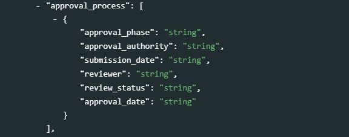{width=100%}
<br>
   - **`approval_phase`** *[Optional ; Non repeatable]* <br>
   A label that describes the approval phase.
   - **`approval_authority`** *[Optional ; Non repeatable]* <br>
   Identification of the person(s) or organization(s) whose approval was required or sought. 
   - **`submission_date`** *[Optional ; Non repeatable]* <br>
   The date, entered in ISO 8601 format (YYYY-MM-DD), when the project (or a component of it) was submitted for approval. 
   - **`reviewer`** *[Optional ; Non repeatable]* <br>
   Identification of the reviewer(s). 
   - **`review_status`** *[Optional ; Non repeatable]* <br>
   Status of approval. 
   - **`approval_date`** *[Optional ; Non repeatable]* <br>
   Date the approval was formally received, preferably entered in ISO 8601 format (YYYY-MM-DD). <br><br>

	> Example in R:

    ```{r, eval=F, echo=T}
    my_project = list(
      # ... ,
      project_desc = list(
    		# ... ,
        
    		approval_process = list(
    		  
    		  list(approval_phase = "Authorization to conduct the survey",
    		       approval_authority = "Internal Ethics Board, [Organization]",
    		       submission_date = "2019-01-15",
    		       review_status = "Approved (permission No ABC123)",
    		       approval_date = "2020-04-30"),
    		  
    		  list(approval_phase = "Review of research output and authorization to publish",
    		       approval_authority = "Internal Ethics Board, [Organization]",
    		       submission_date = "2021-07-15",
    		       review_status = "Approved",
    		       approval_date = "2021-10-30")
    		  
    		),
    		# ...
      )
      # ...
    )  
    ```

- **`project_website`** *[Optional ; Repeatable ; String]*  <br>
URL of the project website.
<br>
{width=100%}
<br>

- **`languages`** *[Optional ; Repeatable]* <br>
A block of two elements describing the language(s) of the project. At least one of the two elements must be provided for each listed language. The use of [ISO 639-2](https://www.loc.gov/standards/iso639-2/php/code_list.php) (the alpha-3 code in Codes for the representation of names of languages) is recommended.
<br>
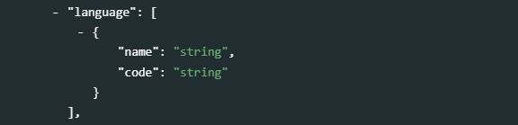{width=100%}
<br>
   - **`name`** *[Optional ; Not repeatable ; String]* <br>
   The name of the language.
   - **`code`** *[Optional ; Not repeatable ; String]* <br>
   The code of the language. Numeric codes must be entered as strings. <br><br>

	> Example in R:

    ```{r, eval=F, echo=T}
    my_project = list(
      # ... ,
      project_desc = list(
    		# ... ,
        
    		languages = list(
    		  list(name = "English", code = "EN"),
    		  list(name = "French",  code = "FR")
    		),
    		
    		# ...
      )
      # ...
    )
    ```

- **`production_date`** <br> 
The date in ISO 8601 format (YYYY-MM-DD) the project was completed (this refers to the version that is being documented and released.)
<br>
{width=100%}
<br>

- **`version_statement`** *[Optional ; Repeatable]* <br>
This repeatable block of four elements is used to list and describe the successive versions of the project.
<br>
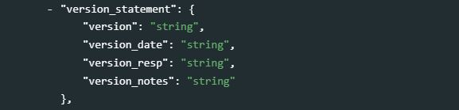{width=100%}
<br>
   - **`version`** *[Optional ; Not repeatable ; String]* <br>
   A label describing the version. For example, "Version 1.2" *[String]*
   - **`version_date`** *[Optional ; Not repeatable ; String]* <br>
   Date (in ISO 8601 format, YYYY-MM-DD) the version was released *[String]*
   - **`version_resp`** *[Optional ; Not repeatable ; String]* <br>
   Person(s) or organization(s) responsible for this version. *[String]*
   - **`version_notes`** *[Optional ; Not repeatable ; String]* <br>
   Additional information on the version if any; it is good practice to describe what distinguishes this version from the previous one(s). The version must be entered as a string, even when composed only of numbers. <br><br>
  
	> Example in R:

    ```{r, eval=F, echo=T}
    my_project = list(
      # ... ,
      project_desc = list(
    		# ... ,
        
        version_statement = list(
          
          list(version = "v1.0", 
               version_date = "2021-12-27",
               version_resp = "University of Popstan, Department of Economics",
               version_notes = "First version approved for open dissemination")
          
        ), 
        
      # ...
    )  
    ```

- **`errata`** *[Optional ; Repeatable]* <br>   
This field is used to list and describe errata.
<br>
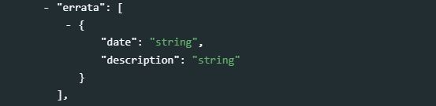{width=100%}
<br>
   - **`date`** *[Optional ; Not repeatable ; String]* <br>
   Date (in ISO 8601 format, YYYY-MM-DD) the erratum was released.
   - **`description`** *[Optional ; Not repeatable ; String]* <br>
   Description of the error(s) and measures taken to address it/them. <br><br>

	> Example in R:

    ```{r, eval=F, echo=T}
    my_project = list(
      # ... ,
      project_desc = list(
    		# ... ,
        
        errata = list(
          list(date = "2021-10-30", 
               description = "Outliers in the data for Afghanistan resulted in unrealistic model estimates of the food prices for January 2020. In the latest version of the 'model.R' script, outliers are detected and dropped from the input data file. The published dataset has been updated."
          )
        ),
        
        # ...
      )
    )  
    ```

- **`process`** *[Optional ; Repeatable]* <br>
This element is used to document the life cycle of the research project, from its design and inception to its conclusion. This can include phases of fundraising, IRB, concept note review, data acquisition, analysis, publishing of a working paper, peer review, publishing in journal, presentation to conferences, publishing, evaluation, reporting to sponsors, etc. It is recommended to provide these steps in a chronological order. 
<br>
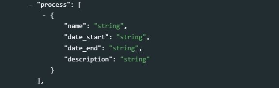{width=100%}
<br>
   - **`name`**: *[Optional ; Not repeatable ; String]* <br>
   This is a header for the phase of the process. 
   - **`date_start`** *[Optional ; Not repeatable ; String]* <br>
   Date the phase started (preferably in ISO 8601 format, YYYY-MM-DD)
   - **`description`** *[Optional ; Not repeatable ; String]* <br>
   A brief description of the phase. <br><br>

	> Example in R:

    ```{r, eval=F, echo=T}
    my_project = list(
      # ... ,
      project_desc = list(
    		# ... ,
        
        process = list(
          
          list(name = "Presentation of the concept note at the Review Committee decision meeting", 
               date_start = "2018-02-23",
               date_end = "2018-02-23",
               description = "Presentation of the research objectives and method by the primary investigator to the Review Committee, which resulted in the approval of the concept note."
          ),
          
          list(name = "Fundraising", 
               date_start = "2018-02-24",
               date_end = "2018-02-30",
               description = "Discussion with project sponsors, and conclusion of the funding agreement."
          ),
          
          list(name = "Data acquisition and analytics", 
               date_start = "2018-03-15",
               date_end = "2019-01-30",
               description = "Implementation of web scraping, then data analysis"
          ),  
          
          list(name = "Working paper", 
               date_start = "2019-01-30",
               date_end = "2019-02-25",
               description = "Production (and copy editing) of the working paper"
          ),
          
          list(name = "Presentation to conferences", 
               date_start = "2019-04-12",
               date_end = "2019-04-12",
               description = "Presentation of the paper by the primary investigator at the ... conference, London"
          ),
          
          list(name = "Curation and dissemination of data and code", 
               date_start = "2019-02-25",
               date_end = "2019-03-18",
               description = "Data and script documentation, and publishing in the National Microdata Library"
          )
          
        ),
        
        # ...
      )
    )  
    ```

- **`authoring_entity`** *[Optional ; Repeatable]* <br>
This section will identify the person(s) and/or organization(s) in charge of the intellectual content of the research project, and specify their respective role.
<br>
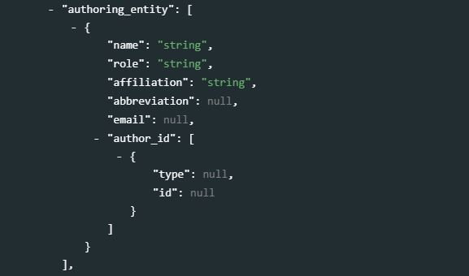{width=100%}
<br>
  - **`name`** *[Optional ; Not repeatable ; String]* <br>
  Name of the person or organization responsible for the research project.
  - **`role`** *[Optional ; Not repeatable ; String]* <br>
  Specific role of the person or organization mentioned in `name`.  
  - **`affiliation`** *[Optional ; Not repeatable ; String]* <br>
  Agency or organization affiliation of the author/primary investigator mentioned in `name`.
  - **`abbreviation`** *[Optional ; Not repeatable ; String]* <br>
  Abbreviation used to identify the agency stated under `affiliation`. 
  - **`email`** *[Optional ; Not repeatable ; String]* <br>
  Depending on the agency policies, a researcher may provide a personal email or an agency email to field inquires related to the project. 
  - **`author_id`** *[Optional ; Repeatable]* <br>
  A block of two elements used to provide unique identifiers of the authors, as provided by different registers of researchers. For example, this can be an ORCID number (ORCID is a non-profit organization supported by a global community of member organizations, including research institutions, publishers, sponsors, professional associations, service providers, and other stakeholders in the research ecosystem.) 
     - **`type`** *[Optional ; Not repeatable ; String]* <br>
     The type of ID; for example, "ORCID". 
     - **`id`** *[Required ; Not repeatable ; String]* <br>
     A unique identification number/code for the authoring entity, entered as a string variable.<br><br>

	> Example in R:

    ```{r, eval=F, echo=T}
    my_project = list(
      # ... ,
      project_desc = list(
    		# ... ,
        
        authoring_entity = list(
          
          list(name = "", 
               role = "",
               affiliation = "",
               email = "",
               author_id = list(
                 list(type = "", id = "ORCID")
              )   
          )
          
        ),
        
        # ...
      )
    )  
    ```

- **`contributors`** *[Optional ; Repeatable]* This section is provided to record other contributors to the research project and provide recognition for the roles they provided. 

  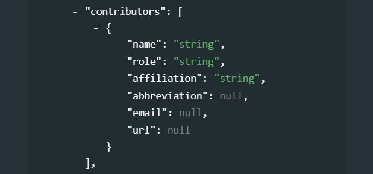{width=100%}

   - **`name`** *[Optional ; Not repeatable ; String]* <br>
   Name of the person, corporate body, or agency contributing to the intellectual content of the project (other than the PI). If a person, invert first and last name and use commas.
   - **`role`**  *[Optional ; Not repeatable ; String]* <br>
   Title of the person (if any) responsible for the work's substantive and intellectual content.
   - **`affiliation`** *[Optional ; Not repeatable ; String]* <br>
   Agency or organization affiliation of the contributor.
   - **`abbreviation`** *[Optional ; Not repeatable ; String]* <br>
   Abbreviation used to identify the agency stated under `affiliation`. 
   - **`email`** *[Optional ; Not repeatable ; String]* <br>
   Depending on the agency policies, a researcher may provide a personal email or an agency email to field inquires related to the project.  
   - **`url`** *[Optional ; Not repeatable ; String]* <br>
   Thhe URL that provides information on the contributor or its affiliate <br><br>

	  > Example in R:

    ```{r, eval=F, echo=T}
    my_project = list(
      # ... ,
      project_desc = list(
    		# ... ,
        
        contributors = list(
          list(name = "", 
               role = "",
               affiliation = "",
               email = ""
          )
        ),
        
        # ...
      )
    )  
    ```

- **`sponsors`** *[Optional ; Repeatable]* <br> The source(s) of funds for production of the work. If different funding agencies sponsored different stages of the production process, use the 'role' attribute to distinguish them.
  <br>
  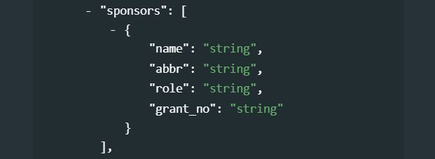{width=100%}
  <br>
   - **`name`** *[Optional ; Not repeatable ; String]* <br>
   Name of the funding agency/sponsor. 
   - **`abbr`** *[Optional ; Not repeatable ; String]* <br>
   Abbreviation of the funding/sponsoring agency. 
   - **`role`** *[Optional ; Not repeatable ; String]* <br>
   Specific role of the funding/sponsoring agency.     
   - **`grant_no`** *[Optional ; Not repeatable ; String]* <br> 
   Grant or award number. 

	  > Example in R:

    ```{r, eval=F, echo=T}
    my_project = list(
      # ... ,
      project_desc = list(
    		# ... ,
        
        sponsors = list(
          
          list(name = "ABC Foundation", 
               abbr = "ABCF",
               role = "Purchase of the data",
               grant_no = "ABC_001_XYZ"
          ),
          
          list(name = "National Research Foundation", 
               abbr = "NRF",
               role = "Funding of staff and research assistant costs, and variable costs for participation in conferences",
               grant_no = "NRF_G01"
          )
          
        ),
        
        # ...
      )
    )  
    ```

- **`curators`** *[Optional ; Repeatable]* <br>
A list of persons and/or organizations in charge of curating the resources associated with the project.
  <br>
  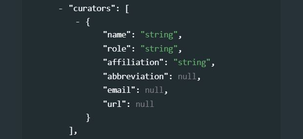{width=100%}
  <br>
   - **`name`** *[Optional ; Not repeatable ; String]* <br>
   The name of the person or organization.  
   - **`role`** *[Optional ; Not repeatable ; String]* <br>
   The specific role of the person or organization in the curation of the project resources.
   - **`affiliation`** *[Optional ; Not repeatable ; String]* <br>
   The affiliation of the person or organization.
   - **`abbreviation`** *[Optional ; Not repeatable ; String]* <br>
   An acronym of the organization, if an organization was entered in `name`.
   - **`email`** *[Optional ; Not repeatable ; String]* <br>
   The email address of the person or organization. The use of personal email addresses must be avoided.
   - **`url`** *[Optional ; Not repeatable ; String]* <br>
   A link to the website of the person or organization. 
   <br><br>

	  > Example in R:

    ```{r, eval=F, echo=T}
    my_project = list(
      # ... ,
      project_desc = list(
    		# ... ,
        
        curators = list(
          
          list(name = "National Data Archive of Popstan", 
               role = "Documentation, preservation and dissemination of the data and reproducible code",
               email = "helpdesk@nda. ...",
               url = "popstan_nda,org"
          )
          
        ),
        
        # ...
      )
    )  
    ```

- **`reviews_comments`** *[Optional ; Repeatable]* <br>   
Many research projects will be subject to a review process, which may happen at different stages of the project implementation (from design to review of the final output). This block is intended to document the comments received by reviewers during this process. It is a repeatable block of metadata elements, which can be used to document comments with a fine granularity. 
  <br>
  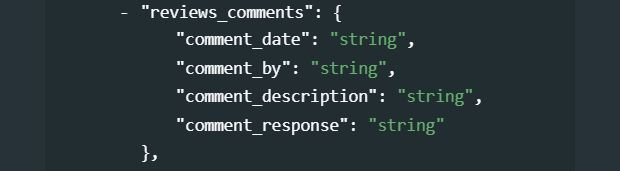{width=100%}
  <br>
   - **`comment_date`** *[Optional ; Not repeatable ; String]* <br>
   The date the comment was provided, in ISO 8601 format (YYYY-MM-DD or YYYY-MM).
   - **`comment_by`** *[Optional ; Not repeatable ; String]* <br>
   The name of the person or organization that provided the comment. 
   - **`comment_description`** *[Optional ; Not repeatable ; String]* <br>
   The comment itself, in its original formulation or in a summary version.
   - **`comment_response`** *[Optional ; Not repeatable ; String]* <br>
   The response provided by teh research team/person to the comment, in its original formulation or in a summary version.
   <br><br>

	  > Example in R:

    ```{r, eval=F, echo=T}
    my_project = list(
      # ... ,
      project_desc = list(
    		# ... ,
        reviews_comments = list(
          list(comment_date = "", 
               comment_by = "",
               comment_description = "",
               comment_response = ""
          )
        ),
        # ...
      )
    )  
    ```

- **`acknowledgments`** *[Optional ; Repeatable]* <br>
This repeatable block of elements is used to provide an itemized list of persons and organizations whose contribution to the project must be acknowledged. Note that specific metadata elements are available for listing financial sponsors and main contributors to the study.<br> 
An alternative to this field is the `acknowledgment_statement` field (see below) which can be used to provide the acknowledgment in the form of an unstructured text.
  <br>
  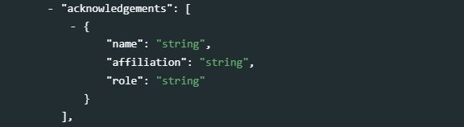{width=100%}
  <br>
   - **`name`** *[Optional ; Not repeatable ; String]* <br>
   The name of the person or agency being recognized for supporting the project.
   - **`affiliation`** *[Optional ; Not repeatable ; String]* <br>
   The affiliation of the person or agency being acknowledged.
   - **`role`** *[Optional ; Not repeatable ; String]* <br>
   A brief description of the role of the person or agency that is being recognized or acknowledged for supporting the project.<br><br>

	  > Example in R:

    ```{r, eval=F, echo=T}
    my_project = list(
      # ... ,
      project_desc = list(
    		# ... ,
        acknowledgements = list(
          list(name = "", 
               affiliation = "",
               role = ""
          ),
          list(name = "", 
               affiliation = "",
               role = ""
          )
        ),
        # ...
      )
    )  
    ```

- **`acknowledgement_statement`** *[Optional ; Not repeatable ; String]* <br> 
This field is used to provide acknowledgments in the form of an unstructured text. An alternative to this field is the *acknowledgments* field which provides a solution to itemize the acknowledgments. 
{width=100%}

- **`disclaimer`** *[Optional ; Not repeatable ; String]* <br>  
Disclaimers limit the responsibility or liability of the publishing organization or researchers associated with the research project. Disclaimers assure that any research in the public domain produced by an organization has limited repercussions to the publishing organization. A disclaimer is intended to prevent liability from any effects occurring as a result of the acts or omissions in the research. 
{width=100%} 

- **`confidentiality`** *[Optional ; Not repeatable ; String]* <br>  
A confidentiality statement binds the publisher to ethical considerations regarding the subjects of the research. In most cases, the individual identity of an individual that is the subject of research can not be released and special effort is required to assure the preservation of privacy.
{width=100%} 

- **`citation_requirement`** *[Optional ; Not repeatable ; String]* <br>  
The citation requirement is specific to the output and is a preferred shorthand or means to refer to the publication or published good.
{width=100%} 

- **`related_projects`** *[Optional ; Repeatable]* <br>
The objective of this block is to provide links (URLs) to other, related projects which can be documented and disseminated in the same catalog or any other location on the internet.
  <br>
  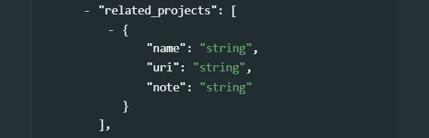{width=100%}
  <br>
   - **`name`** *[Optional ; Not repeatable ; String]* <br>
   The name (title) of the related project.
   - **`uri`** *[Optional ; Not repeatable ; String]* <br>
   A link (URL) to the related project web page.
   - **`note`** *[Optional ; Not repeatable ; String]* <br>
   A brief description or other relevant information on the related project. <br><br>

	> Example in R:

    ```{r, eval=F, echo=T}
    my_project = list(
      # ... ,
      project_desc = list(
    		# ... ,
        related_projects = list(
          list(name = "", 
               uri = "", 
               note = "")
        ),
        # ...
      )
    )  
    ```

- **`geographic_units`** *[Optional ; Repeatable]* <br>
The geographic areas covered by the project. When the project relates to one or more countries, or part of one or more countries, it is important to provide the country name. This means that for a project related to a specific province or town of a country, the country name will be entered in addition to the province or town (as separate entries in this repeatable block of elements). Note that the area does not have to be an administrative area; it can for example be an ocean.
  <br>
  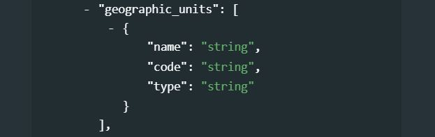{width=100%}
  <br>
  - **`name`** *[Optional ; Not repeatable ; String]* <br>
  The name of the geographic area.
  - **`code`** *[Optional ; Not repeatable ; String]* <br>
  The code of the geographic area. For countries, it is recommended to use the [ISO 3166](https://en.wikipedia.org/wiki/List_of_ISO_3166_country_codes) country codes and names. 
  - **`type`** *[Optional ; Not repeatable ; String]* <br>
  The type of geographic area.
  <br>

	> Example in R:

    ```{r, eval=F, echo=T}
    my_project = list(
      # ... ,
      project_desc = list(
    		# ... ,
        
        geographic_units = list(
          list(name = "India",     code = "IND", type = "Country"),
          list(name = "New Delhi",               type = "City"),
          list(name = "Kerala",                  type = "State"),
          list(name = "Nepal",     code = "NPL", type = "Country"),
          list(name = "Kathmandu",               type = "City")
        ),
        
        # ...
      )
    )  
    ```

- **`keywords`** *[Optional ; Repeatable]* <br>
  <br>
  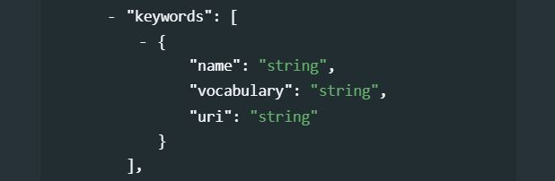{width=100%}
  <br>    
A list of keywords that provide information on the core scope and objectives of the research project. Keywords provide a convenient solution to improve the discoverability of the research, as it allows terms and phrases not found elsewhere in the metadata to be indexed and to make a project discoverable by text-based search engines. A controlled vocabulary will preferably be used (although not required), such as the [UNESCO Thesaurus](http://vocabularies.unesco.org/browser/thesaurus/en/). The list provided here can combine keywords from multiple controlled vocabularies, and user-defined keywords.  
    - **`name`** *[Required ; Not repeatable ; String]* <br>
    The keyword itself.
    - **`vocabulary`** *[Optional ; Not repeatable ; String]* <br>
    The controlled vocabulary (including version number or date) from which the keyword is extracted, if any.
    - **`uri`** *[Optional ; Not repeatable ; String]* <br>
    The URL of the controlled vocabulary from which the keyword is extracted, if any.<br><br>

  > Example in R:

  ```{r, eval=F, echo=T}
    my_project <- list(
      # ... ,
      project_desc = list(
        # ... ,
        
        keywords = list(
        
          list(name = "Migration", 
               vocabulary = "Unesco Thesaurus (June 2021)", 
               uri = "http://vocabularies.unesco.org/browser/thesaurus/en/page/concept427"),
          
          list(name = "Migrants", 
               vocabulary = "Unesco Thesaurus (June 2021)", 
               uri = "http://vocabularies.unesco.org/browser/thesaurus/en/page/concept427"),
          
          list(name = "Refugee", 
               vocabulary = "Unesco Thesaurus (June 2021)", 
               uri = "http://vocabularies.unesco.org/browser/thesaurus/en/page/concept427"),
               
          list(name = "Conflict"),
          list(name = "Asylum seeker"),
          list(name = "Forced displacement"),
          list(name = "Forcibly displaced"),
          list(name = "Internally displaced population (IDP)"),
          list(name = "Population of concern (PoC)")
          list(name = "Returnee")
          list(name = "UNHCR")
        ),
        
        # ...
      ),
      # ... 
    )  
  ```  

- **`themes`** *[Optional ; Repeatable]* <br>
  <br>
  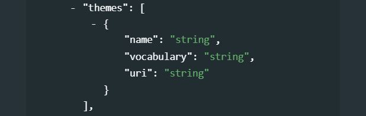{width=100%}
  <br> 
A list of themes covered by the research project. A controlled vocabulary will preferably be used. Note that `themes` will rarely be used as the elements `topics` and `disciplines` are more appropriate for most uses. This is a block of five fields:
    - **`id`** *[Optional ; Not repeatable ; String]* <br>
    The ID of the theme, taken from a controlled vocabulary.
    - **`name`** *[Required ; Not repeatable ; String]* <br>
    The name (label) of the theme, preferably taken from a controlled vocabulary.
    - **`parent_id`** *[Optional ; Not repeatable ; String]* <br>
    The parent ID of the theme (ID of the item one level up in the hierarchy), if a hierarchical controlled vocabulary is used.
    - **`vocabulary`** *[Optional ; Not repeatable ; String]* <br>
    The name (including version number) of the controlled vocabulary used, if any.
    - **`uri`** *[Optional ; Not repeatable ; String]* <br>
    The URL to the controlled vocabulary used, if any. <br>

- **`topics`** *[Optional ; Repeatable]* <br>
  <br>
  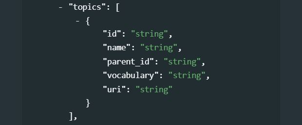{width=100%}
  <br> 
Information on the topics covered in the research project. A controlled vocabulary will preferably be used, for example the [CESSDA Topics classification](https://vocabularies.cessda.eu/vocabulary/TopicClassification), a typology of topics available in 11 languages; or the [Journal of Economic Literature (JEL) Classification System](https://en.wikipedia.org/wiki/JEL_classification_codes), or the [World Bank topics classification](https://documents.worldbank.org/en/publication/documents-reports/docadvancesearch). Note that you may use more than one controlled vocabulary. 
This element is a block of five fields: 
    - **`id`** *[Optional ; Not repeatable ; String]* <br>
    The identifier of the topic, taken from a controlled vocabulary.
    - **`name`** *[Required ; Not repeatable ; String]* <br>
    The name (label) of the topic, preferably taken from a controlled vocabulary.
    - **`parent_id`** *[Optional ; Not repeatable ; String]* <br>
    The parent identifier of the topic (identifier of the item one level up in the hierarchy), if a hierarchical controlled vocabulary is used.
    - **`vocabulary`** *[Optional ; Not repeatable ; String]* <br>
    The name (including version number) of the controlled vocabulary used, if any.
    - **`uri`** *[Optional ; Not repeatable ; String]* <br>
    The URL to the controlled vocabulary used, if any. <br><br>

	> Example in R:

    ```{r, eval=F, echo=T}
    my_project = list(
      # ... ,
      
      project_desc = list(
    		# ... ,

        topics = list(
          
          list(name = "Demography.Migration", 
               vocabulary = "CESSDA Topic Classification", 
               uri = "https://vocabularies.cessda.eu/vocabulary/TopicClassification"),
          
          list(name = "Demography.Censuses", 
               vocabulary = "CESSDA Topic Classification", 
               uri = "https://vocabularies.cessda.eu/vocabulary/TopicClassification"),
          
          list(id = "F22", 
               name = "International Migration", 
               parent_id = "F2 - International Factor Movements and International Business", 
               vocabulary = "JEL Classification System", 
               uri = "https://www.aeaweb.org/econlit/jelCodes.php?view=jel#J"),
          
          list(id = "O15", 
               name = "Human Resources - Human Development - Income Distribution - Migration", 
               parent_id = "O1 - Economic Development", 
               vocabulary = "JEL Classification System", 
               uri = "https://www.aeaweb.org/econlit/jelCodes.php?view=jel#J"),
          
          list(id = "O12", 
               name = "Microeconomic Analyses of Economic Development", 
               parent_id = "O1 - Economic Development", 
               vocabulary = "JEL Classification System", 
               uri = "https://www.aeaweb.org/econlit/jelCodes.php?view=jel#J"),
          
          list(id = "J61", 
               name = "Geographic Labor Mobility - Immigrant Workers", 
               parent_id = "J6 - Mobility, Unemployment, Vacancies, and Immigrant Workers", 
               vocabulary = "JEL Classification System", 
               uri = "https://www.aeaweb.org/econlit/jelCodes.php?view=jel#J")
        ),
        
        # ...
      )
    )  
    ```

- **`disciplines`** *[Optional ; Repeatable]* <br>
  <br>
  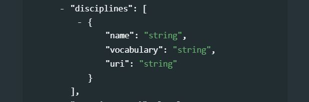{width=100%}
  <br> 
Information on the academic disciplines related to the content of the research project. A controlled vocabulary will preferably be used, for example the one provided by the list of academic fields in [Wikipedia](https://en.wikipedia.org/wiki/List_of_academic_fields). 
This is a block of five elements: 
    - **`id`** *[Optional ; Not repeatable ; String]* <br>
    The identifier of the discipline, taken from a controlled vocabulary.
    - **`name`** *[Optional ; Not repeatable ; String]* <br>
    The name (label) of the discipline, preferably taken from a controlled vocabulary.
    - **`parent_id`** *[Optional ; Not repeatable ; String]* <br>
    The parent identifier of the discipline (identifier of the item one level up in the hierarchy), if a hierarchical controlled vocabulary is used.
    - **`vocabulary`** *[Optional ; Not repeatable ; String]* <br>
    The name (including version number) of the controlled vocabulary used, if any.
    - **`uri`** *[Optional ; Not repeatable ; String]* <br>
    The URL to the controlled vocabulary used, if any.<br><br>

  > Example in R: 
    
  ```{r, eval=F, echo=T}
    my_project <- list(
      # ... ,
      
      project_desc = list(
        # ... ,  
        
        disciplines = list(
          
          list(name = "Economics", 
               vocabulary = "Wikipedia List of academic fields (as of 21 June 2021)", 
               uri = "https://en.wikipedia.org/wiki/List_of_academic_fields"),
               
          list(name = "Agricultural economics", 
               vocabulary = "Wikipedia List of academic fields (as of 21 June 2021)", 
               uri = "https://en.wikipedia.org/wiki/List_of_academic_fields"),
          
          list(name = "Econometrics", 
               vocabulary = "Wikipedia List of academic fields (as of 21 June 2021)", 
               uri = "https://en.wikipedia.org/wiki/List_of_academic_fields")
               
        ),
        
        # ...
      ),
      # ... 
    )  
  ```

- **`repository_uri`** In the process of producing the outputs of the research project, a researcher may want to share their source code for transparency and replicability. This repository provides information for finding the repository where the source code is kept. 

  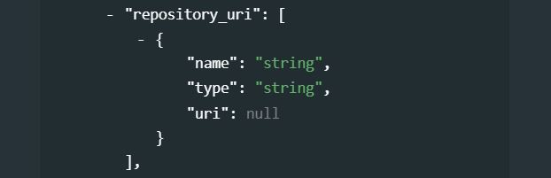{width=100%}

   - **`name`** *[Optional ; Not repeatable ; String]* <br>
   Name of the repository where code is hosted. 
   - **`type`** *[Optional ; Not repeatable ; String]* <br>
   Repository type e.g.GitHub, Bitbucket, etc.
   - **`uri`** *[Required ; Not repeatable ; String]* <br>
   URI of the project source code/script repository <br><br>

	> Example in R:

    ```{r, eval=F, echo=T}
    my_project = list(
      # ... ,
      
      project_desc = list(
    		# ... ,
        
        repository_uri = list(
          list(name = "A comparative assessment of machine learning classification algorithms applied to poverty prediction", 
               type = "GitHub public repo", 
               uri = "https://github.com/worldbank/ML-classification-algorithms-poverty")
        ),
        
        # ...
      )
    )  
    ```

- **`license`** *[Optional ; Repeatable]* <br>
Information on the license(s) attached to the research project resources, which defines their terms of use. 
    - **`name`** *[Required ; Not repeatable ; String]* <br>
    The name of the license.
    - **`uri`** *[Optional ; Not repeatable ; String]* <br>
    The URL of the license, where detailed information on the license can be obtained.
    <br>
    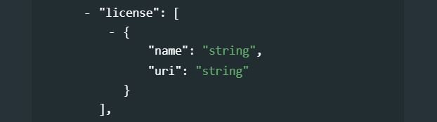{width=100%}
    <br>
    
  > Example in R:

  ```{r, eval=F, echo=T}
    my_project <- list(
      # ... ,
      project_desc = list(
        # ... ,
        
        license = list(
        
          list(name = "Attribution 4.0 International (CC BY 4.0)", 
               uri  = "https://creativecommons.org/licenses/by/4.0/")
               
        ),
        
        # ...
      ),
      # ... 
    )  
  ```
- **`copyright`** *[Optional ; Not repeatable ; String]* <br>   
Information on the copyright, if any, that applies to the research project metadata.
{width=100%}

- **`technology_environment`** *[Optional ; Not repeatable ; String]* <br>
This field is used to provide a description (as detailed as possible) of the computational environment under which the scripts were implemented and are expected to be reproducible. A substantial challenge in reproducing analyses is installing and configuring the web of dependencies of specific versions of various analytical tools. Virtual machines (a computer inside a computer) enable you to efficiently share your entire computational environment with all the dependencies intact. (https://ropensci.github.io/reproducibility-guide/sections/introduction/) 

  {width=100%}

- **`technology_requirements`** *[Optional ; Not repeatable ; String]* <br>
Software/hardware or other technology requirements needed to run the scripts and replicate the outputs

- **`reproduction_instructions`** *[Optional ; Not repeatable ; String]* <br>

- **`methods`** *[Optional ; Repeatable]* <br>
A list of analytic, statistical, econometric, machine learning methods used in the project. The objective is to allow users to find projects based on a search on methods applied, e.g. answer a query like *"poverty prediction using random forest"*.
  <br>
  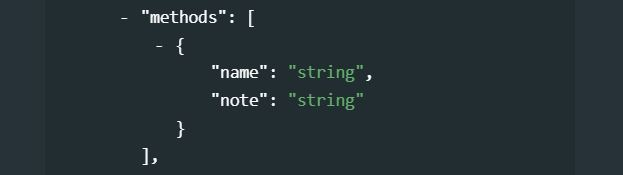{width=100%}
  <br>
   - **`name`** *[Required ; Not repeatable ; String]* <br>
   A short name for the method being described.
   - **`note`** *[Optional ; Not repeatable ; String]* <br>
   Any additional information on the method.
   <br><br>

	> Example in R:

    ```{r, eval=F, echo=T}
    my_project = list(
      # ... ,
      project_desc = list(
    		# ... ,
        
        methods = list(
          
          list(name = "linear regression", 
               note = "Implemented using R package 'stats'"),
          
          list(name = "random forest", 
               note = "Used for both regression and classification"),
          
          list(name = "lasso regression (least asolute shrinkage and selection operator)", 
               note = "Implemented using R package glmnet"),
          
          list(name = "gradient boosting machine (GBM)"),
          
          list(name = "cross validation"),
          
          list(name = "mean square error, quadratic loss, L2 loss", 
               note = "Loss functions used to fit models")
          
        ),
        
        # ...
      )
    )  
    ```

- **`software`** *[Optional ; Repeatable]* <br>
This field is used to list the software and the specialized packages and libraries/packages that were used to implement the project and that are required to reproduce the scripts. The libraries that are loaded by the scripts (e.g., by the R *require* or *library* command) are included (not all their own dependencies, which will be assumed to be installed automatically).
  <br>
  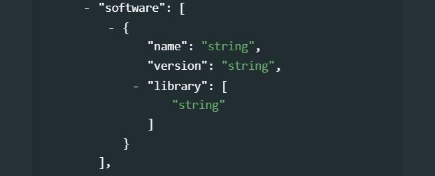{width=100%} 
  <br>
   - **`name`** *[Required ; Not repeatable ; String]* <br>
   The name of the software. 
   - **`version`** *[Optional ; Not repeatable ; String]* <br>
   The version of the software. 
   - **`library`** *[Optional ; Not repeatable]* <br>  
   A list of libraries/packages required to run the scripts. Note that the specific version of each package is not documented here; it is expected to be found in the script or in the reproduction instructions. 
   
 	> Example in R:

    ```{r, eval=F, echo=T}
    my_project = list(
      # ... ,
      project_desc = list(
    		# ... ,
        
        software = list(
          
          list(name    = "R", 
               version = "4.0.2",
               library = list("caret", "dplyr", "ggplot2"),
          
          list(name    = "Stata", 
               version = "15"),
          
          list(name    = "Python", 
               version = "3.7 (Anaconda install)",
               library = list("pandas", "scikit-learn")
          
        ),
        
        # ...
      )
    )  
    ```

- **`scripts`** *[Optional ; Repeatable]* <br>
This field is used to describe the scripts written by the project authors. All scripts are expected to have been written using software listed in the field *software*.
  <br>
  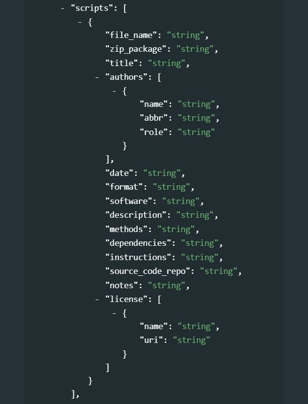{width=100%} 
  <br>
   - **`file_name`** *[Optional ; Not repeatable ; String]* <br> 
   Name of the script file (for R users, this will typically include files with extension [.R], for Stata users it will be files with extension [.do], for Python users ...). But this can also include other files related and required to run the scripts (for example lookup CSV files, etc.) This does not include the data files, which are described ina  specific field. 
   - **``zip_package``** *[Optional ; Not repeatable]* <br> 
   If the script files have been saved as or in a compressed file (zip, rar, of equivalent), we provide here the name of the zip file containing the script. 
   - **`title`** *[Optional ; Not repeatable ; String]* <br>
   A title (label) given to the script file 
   - **`authors`** *[Optional ; Repeatable]* <br>
   This is a repeatable block that allows entering a list of authors and co-authors of a script 
	    - **`name`** *[Optional ; Not repeatable ; String]* <br>
	    Name of the author (person or organization) of the script 
			- **`abbr`**  *[Optional ; Not repeatable ; String]* <br>
			The acronym of the organization who authored the script.
			- **`role`** *[Optional ; Not repeatable ; String]* <br>
			Specific role of the person or organization in the production of the script. 
   - **`date`** [Optional ; Not repeatable ; String]* <br>
   Date the script was produced, in ISO 8601 format (YYYY-MM-DD) 
   - **`format`** *[Optional ; Not repeatable ; String]* <br>
   File format 
   - **`software`** *[Optional ; Not repeatable ; String]* <br>
   Software used to run the script 
   - **`description`** *[Optional ; Not repeatable ; String]* <br>
   Brief description of the script 
   - **`methods`** *[Optional ; Not repeatable ; String]* <br>
   Statistical/analytic methods included in the script 
   - **`dependencies`** *[Optional ; Not repeatable ; String]* <br>
   Any dependencies (packages/libraries) that the script relies on. This field is not needed if dependencies were described in the `library` element. 
   - **`instructions`** *[Optional ; Not repeatable ; String]* <br>
   Instructions for running the script. Information on the sequence in which the scripts must be run is critical. 
   - **`source_code_repo`** *[Optional ; Not repeatable ; String]* <br>
   Repository (e.g. GitHub repo) where the script has been published. 
   - **`notes`** *[Optional ; Not repeatable ; String]* <br>
   Any additional information on the script.
   - **`license`** *[Optional ; Not repeatable]* <br>
      License, if any, under which the script is published.
			- **`name`** *[Optional ; Not repeatable ; String]* <br>
			Name (label) of the license  
			- **`uri`** *[Optional ; Not repeatable ; String]* <br>
			License URI <br><br>

	> Example in R:

    ```{r, eval=F, echo=T}
    my_project = list(
      # ... ,
      project_desc = list(
    		# ... ,
        
        scripts = list(
          
          list(file_name = "00_script.R", 
               zip_package = "all_scripts.zip", 
               title = "Project X - Master script", 
               authors = list(name = "John Doe", 
                              abbr = "JD", 
                              role = "Writing, testing and documenting the script"),
               date = "2020-12-27",
               format = "R script",
               software = "R x64 4.0.2",
               description = "Master script for automated reproduction of the analysis. Calls all other scripts in proper sequence to reproduce the full analysis.",
               methods = "box-cox transformation of data",
               dependencies = "",
               instructions = "",
               source_code_repo = "",
               notes = "",
               license = list(name = "CC BY 4.0", 
                              uri = "https://creativecommons.org/licenses/by/4.0/deed.ast")),
          
          list(file_name = "01_regression.R", 
               zip_package = "", 
               title = "Charts and maps", 
               authors = list(name = "", 
                              abbr = "", 
                              role = ""),
               date = "",
               format = "R script",
               software = "R",
               description = "This script runs all linear regressions and PCA presented in the working paper.",
               methods = "linear regression; principal component analysis",
               dependencies = "",
               instructions = "",
               source_code_repo = "",
               notes = "",
               license = list(name = "CC BY 4.0", 
                              uri = "https://creativecommons.org/licenses/by/4.0/deed.ast")),
          
          list(file_name = "02_visualization", 
               zip_package = "", 
               title = "", 
               authors = list(name = "", 
                              abbr = "", 
                              role = ""),
               date = "",
               format = "",
               software = "",
               description = "",
               instructions = "",
               source_code_repo = "",
               notes = "",
               license = list(name = "CC BY 4.0", 
                              uri = "https://creativecommons.org/licenses/by/4.0/deed.ast")),
          
        ),
        # ...
      )
    )  
    ```

- **`data_statement`** *[Optional ; Not repeatable ; String]* <br>
An overall statement on the data used in the project. A separate field is provided to list and document the origin and key characteristics of the datasets.

  {width=100%} 

- **`datasets`** *[Optional ; Repeatable]* <br>
This field is used to provide an itemized list of datasets used in the project. The data are not documented here (specific metadata are available for documenting data of different types, like the DDI for microdata, the ISO 19139 for geographic datasets, etc.)
  <br>
  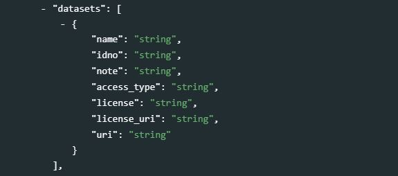{width=100%} 
  <br>
    - **`name`** *[Optional ; Not repeatable ; String]* <br>
    The dataset name (title) 
    - **`idno`** *[Optional ; Not repeatable ; String]* <br>
    The unique identifier of the dataset
    - **`note`** *[Optional ; Not repeatable ; String]* <br>
    A brief description of the dataset.
    - **`access_type`** *[Optional ; Not repeatable ; String]* <br>
    The access policy pplied to the dataset.
    - **`license`** *[Optional ; Not repeatable ; String]* <br>
    The access license that applies to the dataset.
    - **`license_uri`** *[Optional ; Not repeatable ; String]* <br>
    The URL of a web page where more information on the license can be obtained. 
    - **`uri`** *[Optional ; Not repeatable ; String]* <br>
    The URI where the dataset (or a detailed description of it) can be obtained.
    <br><br>

	> Example in R:

    ```{r, eval=F, echo=T}
    my_project = list(
      # ... ,
      project_desc = list(
    		# ... ,
        
        datasets = list(
          
          list(name = "Multiple Indicator Cluster Survey 2019, Round 6, Chad", 
               idno = "TCD_2019_MICS_v01_M", 
               uri  = "https://microdata.worldbank.org/index.php/catalog/4150"),
          
          list(name = "World Bank Group Country Survey 2018, Chad", 
               idno = "TCD_2018_WBCS_v01_M", 
               access_type = "Public access", 
               uri = "https://microdata.worldbank.org/index.php/catalog/3058")
          
        ),
        # ...
      )
    )  
    ```

- **`contacts`** *[Optional ; Repeatable]* <br>
The contacts element provides the public interface for questions associated with the research project. There could be various contacts provided depending upon the organization. It is important to assure that the proper contacts are provided to channel public inquiry. 
  <br>
  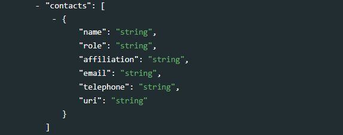{width=100%} 
  <br>
   - **`name`** *[Required ; Not repeatable ; String]* <br>
   The name of the contact person that should be contacted depending on the role defined below. 
   - **`affiliation`** *[Optional ; Not repeatable ; String]* <br>
   The organization or affiliation of the contact person. This is usually the organization that the contact person represents.
   - **`role`** *[Optional ; Not repeatable ; String]* <br>
   Role of the contact person. A research project may have contact persons depending on the output or some of the technical input. Some complex projects may have various data collection processes that have different processing channels and contacts. This section should provide for a key primary public interface that can refer the public inquiry or provide a collection of entry points. 
   - **`uri`** *[Optional ; Not repeatable ; String]* <br>
   The URI of the agency or organization of the contact organization. This may be the same as the web page of the project or may be a permanent contact name at an institutional level and not project related. Eventually a project web site may be removed but there may still be need to have a contact. In this case, it is recommended to have a contact that is permanent.
   - **`phone`** *[Optional ; Not repeatable ; String]* <br>
   Phone number of the responsible institution or division of the research project or output. <br><br>

	> Example in R:

    ```{r, eval=F, echo=T}
    my_project = list(
      # ... ,
      project_desc = list(
    		# ... ,
        
        contacts = list(
          
          list(name = "Data helpdesk", 
               affiliation = "National Data Center", 
               role = "Support to data users", 
               uri = "helpdesk@ndc. ...")
        ),
        
        # ...
      )
    )  
    ```

**`provenance`** *[Optional ; Repeatable]* <br>
Metadata can be programmatically harvested from external catalogs. The `provenance` group of elements is used to store information on the provenance of harvested metadata, and on alterations that may have been made to the harvested metadata. 
  <br>
  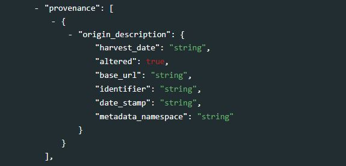{width=100%} 
  <br>
   - **`origin_description`** *[Required ; Not repeatable]* <br>
   The `origin_description` elements are used to describe when and from where metadata have been extracted or harvested.  <br>
      - **`harvest_date`** *[Required ; Not repeatable ; String]* <br>
      The date and time the metadata were harvested, entered in ISO 8601 format.<br>
      - **`altered`** *[Optional ; Not repeatable ; Boolean]* <br>
      A boolean variable ("true" or "false"; "true by default) indicating whether the harvested metadata have been modified before being re-published. In many cases, the unique identifier of the study (element `idno` in the Document Description / Title Statement section) will be modified when published in a new catalog.<br>
      - **`base_url`** *[Required ; Not repeatable ; String]* <br>
      The URL from where the metadata were harvested.<br>
      - **`identifier`** *[Optional ; Not repeatable ; String]* <br>
      The unique dataset identifier (`idno` element) in the source catalog. When harvested metadata are re-published in a new catalog, the identifier will likely be changed. The `identifier` element in `provenance` is used to maintain traceability.<br>
      - **`date_stamp`** *[Optional ; Not repeatable ; String]* <br>
      The date stamp (in UTC date format) of the metadata record in the originating repository (this should correspond to the date the metadata were last updated in the source catalog).<br>
      - **`metadata_namespace`** *[Optional ; Not repeatable ; String]* <br>
      @@@@@@@ <br>

- **`tags`** *[Optional ; Repeatable]* <br>
As shown in section 1.7 of the Guide, tags, when associated with `tag_groups`, provide a powerful and flexible solution to enable custom facets (filters) in data catalogs. See section 1.7 for an example in R.
  <br>
  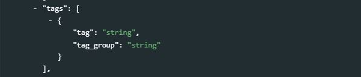{width=100%}  
  <br>
    - **`tag`** *[Required ; Not repeatable ; String]* <br>
    A user-defined tag.
    - **`tag_group`** *[Optional ; Not repeatable ; String]* <br><br>
    A user-defined group (optional) to which the tag belongs. Grouping tags allows implementation of controlled facets in data catalogs.

**`additional`** *[Optional ; Not repeatable]*<br>   @@@@ add this to the schema and do screenshot
The `additional` element allows data curators to add their own metadata elements to the schema. All custom elements must be added within the `additional` block; embedding them elsewhere in the schema would cause schema validation to fail.
  <br>
  {width=100%}
  <br>

## Generating compliant metadata

For this example of documentation and publishing of reproducible research, we use the [Replication data for: Does Elite Capture Matter? Local Elites and Targeted Welfare Programs in Indonesia](https://www.openicpsr.org/openicpsr/project/116471/version/V1/view;jsessionid=31C3E76620D0DDD1CABADAA263A1E491) published in the OpenICPSR website. The primary investigators for the project were Vivi Alatas, Abhijit Banerjee, Rema Hanna, Benjamin A. Olken, Ririn Purnamasari, and Matthew Wai-Poi.

"A service of the Inter-university Consortium for Political and Social Research (ICPSR), openICPSR is a self-publishing repository for social, behavioral, and health sciences research data. openICPSR is particularly well-suited for the deposit of replication data sets for researchers who need to publish their raw data associated with a journal article so that other researchers can replicate their findings." (from [OpenICPSR website](https://www.openicpsr.org/openicpsr/about))

### Full example, using R 

```{r, eval=F, echo=T}

library(jsonlite)
library(httr)
library(dplyr)
library(nadar)

# ----credentials and catalog URL --------------------------------------------------
my_keys <- read.csv("C:/confidential/my_API_keys.csv", header=F, stringsAsFactors=F)
set_api_key("my_keys[1,1")  
set_api_url("https://.../index.php/api/") 
set_api_verbose(FALSE)
# ----------------------------------------------------------------------------------

setwd("C:\my_project")       
thumb = "elite_capture.JPG"  # Will be used as thumbnail in the data catalog

id = "IDN_2019_ECTWP_v01_RR" 

# Generate the metadata

my_project_metadata <- list(
  
  # Information on metadata production
  
  doc_desc = list(
    
    producers = list(
      list(name = "OD", affiliation = "National Data Center")
    ),
    
    prod_date = "2022-01-15"
    
  ),
  
  # Documentation of the research project, and scripts
  
  project_desc = list(
    
    title_statement = list(
      idno  = id,
      title = "Does Elite Capture Matter? Local Elites and Targeted Welfare Programs in Indonesia",
      sub_title = "Reproducible scripts"
    ),
    
    production_date = list("2019"),
    
    geographic_units = list(
      list(name="Indonesia", code="IDN", type="Country")
    ),
    
    authoring_entity   = list(
      
      list(name        = "Vivi Alatas", 
           role        = "Primary investigator",
           affiliation = "World Bank",
           email       = "valatas@worldbank.org"),
      
      list(name        = "Abhijit Banerjee", 
           role        = "Primary investigator",
           affiliation = "Department of Economics, MIT",
           email       = "banerjee@mit.edu"),
      
      list(name        = "Rema Hanna", 
           role        = "Primary investigator",
           affiliation = "Harvard Kennedy School",
           email       = "rema_hanna@hks.harvard.edu"),
      
      list(name        = "Benjamin A. Olken", 
           role        = "Primary investigator",
           affiliation = "Department of Economics, MIT",
           email       = "bolken@mit.edu"),
      
      list(name        = "Ririn Purnamasari", 
           role        = "Primary investigator",
           affiliation = "World Bank",
           email       = "rpurnamasari@worldbank.org"),
      
      list(name        = "Matthew Wai-Poi", 
           role        = "Primary investigator",
           affiliation = "World Bank",
           email       = "mwaipoi@worldbank.org")
      
    ),
    
    abstract = "This paper investigates how elite capture affects the welfare gains from targeted government transfer programs in Indonesia, using both a high-stakes field experiment that varied the extent of elite influence and nonexperimental data on a variety of existing government programs. While the relatives of those holding formal leadership positions are more likely to receive benefits in some programs, we argue that the welfare consequences of elite capture appear small: eliminating elite capture entirely would improve the welfare gains from these programs by less than one percent.",
    
    keywords = list(
      list(name="proxy-means test (PMT)"),
      list(name="experimental design")
    ),
    
    topics = list(
      
      list(id="D72", 
           name = "Political Processes: Rent-seeking, Lobbying, Elections, Legislatures, and Voting Behavior", 
           vocabulary = "JEL codes", 
           uri = "https://www.aeaweb.org/econlit/jelCodes.php"), 
      
      list(id = "H53", 
           name = "National Government Expenditures and Welfare Programs", 
           vocabulary = "JEL codes", 
           uri = "https://www.aeaweb.org/econlit/jelCodes.php"),
      
      list(id = "I38", 
           name = "Welfare, Well-Being, and Poverty: Government Programs; Provision and Effects of Welfare Programs", 
           vocabulary = "JEL codes", 
           uri = "https://www.aeaweb.org/econlit/jelCodes.php"), 
      
      list(id = "O15", 
           name = "Economic Development: Human Resources; Human Development; Income Distribution; Migration", 
           vocabulary = "JEL codes", 
           uri = "https://www.aeaweb.org/econlit/jelCodes.php"), 
      
      list(id = "O17", 
           name = "Formal and Informal Sectors; Shadow Economy Institutional Arrangements", 
           vocabulary = "JEL codes", 
           uri = "https://www.aeaweb.org/econlit/jelCodes.php")
      
    ),
    
    output_types = list(
      
      list(type  = "Article", 
           title = "Does Elite Capture Matter Local Elites and Targeted Welfare Programs in Indonesia",
           description = "AEA Papers and Proceedings 2019, 109: 334-339", 
           uri = "https://doi.org/10.1257/pandp.20191047",
           doi = "10.1257/pandp.20191047"),
      
      list(type = "Working Paper", 
           title = "Does Elite Capture Matter? Local Elites and Targeted Welfare Programs in Indonesia",
           description = "NBER Working Paper No. 18798, February 2013", 
           uri = "https://www.nber.org/papers/w18798")
      
    ),
    
    version_statement = list(version = "1.0", version_date  = "2019"),  
    
    language = list(
      list(name = "English", code = "EN")
    ),   
    
    methods = list(
      list(name = "linear regression with large dummy-variable set (areg)"),
      list(name = "probit regression"),
      list(name = "Test linear hypotheses after estimation")
    ),
    
    software  = list(
      list(name= "Stata", version = "14")
    ),
    
    reproduction_instructions = "The master do file should run start to finish in less than five minutes from the master do file '0MASTER 20190918.do'. Original data is in data-PUBLISH/originaldata and is all that is needed to run the code; all data in data-PUBLISH/codeddata is created from the coding do files. All results are then created and saved in output-PUBLISH/tables.
  
      Key Subfolders:
      1. code-PUBLISH: This folder contains all relevant code. The master do file is located here ('0Master20190918.do') as well as the two folders that are necessary for the creation of datasets/coding ('coding_matching' folder) and for the analysis/table creation ('analysis' folder). Users should update the directory on the master file to reflect the location of the directory on their computers once downloaded. Following that, all the data and output files needed to replicate the main findings of the paper (Tables 1A-1D, Table 2 and the 4 Appendix Tables) will be generated. The sub do files provide specific notes on the variables created where relevant.
      2. data-PUBLISH: This folder contains all relevant .dta files. The first folder, 'original data' contains the 'Baseline' folder that has the original baseline survey information. Under 'original data' you will also find the 'Others' folder with the randomization results, the 2008 PPLS data and the PODES 2008 village level administrative data. The 'Endline2' folder contains the endline survey information. These datasets have been modified only to mask sensitive information. Finally, the 'codeddata' folder that stores intermediate datasets that are created through the sub 'coding_matching' do files.
      3. log-PUBLISH: This folder contains the latest log file. When users run the master do file, a new log file will automatically be created and stored here.
      4. output-PUBLISH: This folder contains all the tables of the main paper and appendix. When users run the master do file, these tables will be automatically overwritten.",
    
    confidentiality = "The published materials do not contain confidential information.",
    
    datasets = list(
      
      list(name = "Village survey (original data; baseline)", 
           idno = "", 
           note = "Stata 14 data files", 
           access_type = "Public", 
           uri = "https://www.openicpsr.org/openicpsr/project/119802/version/V1/view"),
      
      list(name = "Village survey (original data; endline)", 
           idno = "", 
           note = "Stata 14 data files", 
           access_type = "Public", 
           uri = "https://www.openicpsr.org/openicpsr/project/119802/version/V1/view"),
      
      list(name = "Randomization data", 
           idno = "", 
           note = "Stata 14 data files", 
           access_type = "Public", 
           uri = "https://www.openicpsr.org/openicpsr/project/119802/version/V1/view"),
      
      list(name = "2008 PPLS", 
           idno = "", 
           note = "Stata 14 data files", 
           access_type = "Public", 
           uri = "https://www.openicpsr.org/openicpsr/project/119802/version/V1/view"),
      
      list(name = "2008 PODES - Village level administrative data", 
           idno = "", 
           note = "Stata 14 data files", 
           access_type = "Public", 
           uri = "https://www.openicpsr.org/openicpsr/project/119802/version/V1/view"),
      
      list(name = "Coded data (intermediary data files generated by the scripts)", 
           idno = "", 
           note = "Stata 14 data files", 
           access_type = "Public", 
           uri = "https://www.openicpsr.org/openicpsr/project/119802/version/V1/view")
      
    ),
    
    sponsors = list(
      
      list(name="Australian Aid (World Bank Trust Fund)",
           abbr="AusAID",
           role="Financial support"),
      
      list(name="3ie",
           grant_no="OW3.1055",
           role="Financial support"),
      
      list(name="NIH",
           grant_no="P01 HD061315",
           role="Financial support")
      
    ),
    
    acknowledgements = list(
      
      list(name = "Jurist Tan, Talitha Chairunissa, Amri Ilmma, Chaeruddin Kodir, He Yang, and Gabriel Zucker",
           role    = "Research assistance"),
      
      list(name    = "Scott Guggenheim",
           role    = "Provided comments"),
      
      list(name    = "Mitra Samya, BPS, TNP2K, and SurveyMeter",
           role    = "Field cooperation")
      
    ),
    
    disclaimer = "Users acknowledge that the original collector of the data, ICPSR, and the relevant funding agency bear no responsibility for use of the data or for interpretations or inferences based upon such uses.",
    
    scripts = list(
      
      list(file_name   = "0MASTER-20190918.do",
           zip_package = "119802-V1.zip",
           title       = "Master Stata do file",
           authors     = list(list(name="Rema Hanna, Ben Olken (PIs) and Sam Solomon (RA)")),
           format      = "Stata do file",
           software    = "Stata 14",
           description = "Master do file; this script calls all do files required to replicate the output from start to finish (in no more than a few minutes)",
           notes       = "Original data is in data-PUBLISH/originaldata and is all that is needed to run the code; all data in data-PUBLISH/codeddata is created from the coding do files. All results are then created and saved in output-PUBLISH/tables."),
      
      list(file_name   = "coding baseline.do",
           title       = "coding baseline variables",
           zip_package = "119802-V1.zip",
           format      = "Stata do file",
           software    = "Stata 14",
           description = "Coding/matching script 1/7"),
      
      list(file_name   = "coding suseti pmt.do",
           title       = "coding pmt",
           zip_package = "119802-V1.zip",
           format      = "Stata do file",
           software    = "Stata 14",
           description = "Coding/matching script 2/7"),
      
      list(file_name   = "coding elite relation.do",
           title       = "coding additional variables for analysis",
           zip_package = "119802-V1.zip",
           format      = "Stata do file",
           software    = "Stata 14",
           description = "Coding/matching script 3/7"),
      
      list(file_name   = "matching hybrid.do",
           title       = "matching baseline survey data and matching results",
           zip_package = "119802-V1.zip",
           format      = "Stata do file",
           software    = "Stata 14",
           description = "Coding/matching script 4/7; Generates poverty density measure"),
      
      list(file_name   = "coding existing social programs.do",
           title       = "coding existing social programs",
           zip_package = "119802-V1.zip",
           format      = "Stata do file",
           software    = "Stata 14",
           description = "Coding/matching script 5/7"),
      
      list(file_name   = "coding kitchen-sink variables.do",
           title       = "coding miscellaneous variables",
           zip_package = "119802-V1.zip",
           format      = "Stata do file",
           software    = "Stata 14",
           description = "Coding/matching script 6/7"),
      
      list(file_name   = "coding_partV_hybrid.do",
           title       = "coding for part V of analysis plan",
           zip_package = "119802-V1.zip",
           format      = "Stata do file",
           software    = "Stata 14",
           description = "Coding/matching script 7/7"),
      
      list(file_name   = "0 Table 1AB.do",
           title       = "Table 1: formal vs. informal elites - Panels A and B: historical benefits",
           zip_package = "119802-V1.zip",
           format      = "Stata do file",
           software    = "Stata 14",
           description = "Analysis script 1/7"),
      
      list(file_name   = "0 Table 1CD.do",
           title       = "Table 1: formal vs. informal elites - Panels C and D: PKH Experiment",
           zip_package = "119802-V1.zip",
           format      = "Stata do file",
           software    = "Stata 14",
           description = "Analysis script 2/7"),
      
      list(file_name   = "0 Table 2 Appendix Table 3.do",
           title       = "Table 7: Social welfare simulations",
           zip_package = "119802-V1.zip",
           format      = "Stata do file",
           software    = "Stata 14",
           description = "Analysis script 3/7"),
      
      list(file_name   = "0 Appendix Table 1A.do",
           title       = "Table 2A: Elite capture in historical programs",
           zip_package = "119802-V1.zip",
           format      = "Stata do file",
           software    = "Stata 14",
           description = "Analysis script 4/7"),
      
      list(file_name   = "0 Appendix Table 1B.do",
           title       = "Table 2B: Elite capture in PKH experiment",
           zip_package = "119802-V1.zip",
           format      = "Stata do file",
           software    = "Stata 14",
           description = "Analysis script 5/7"),
      
      list(file_name   = "0 Appendix Table 2.do",
           title       = "Appendix Table 12: Probit Model from Table 7",
           zip_package = "119802-V1.zip",
           format      = "Stata do file",
           software    = "Stata 14",
           description = "Analysis script 6/7"),
      
      list(file_name   = "0 Appendix Table 4.do",
           title       = "Appendix Table 13: Social welfare simulations -- PKH - Additional model from Table 7",
           zip_package = "119802-V1.zip",
           format      = "Stata do file",
           software    = "Stata 14",
           description = "Analysis script 7/7"),
      
      list(file_name   = "master_log_09182019.smcl",
           title       = "Log file - Run of master do file",
           zip_package = "119802-V1.zip",
           format      = "Stata log file",
           software    = "Stata 14",
           description = "Latest log file obtained by running the master do file")
    )
    
  )
  
)


# Publish the project metadata in the NADA catalog

script_add(idno = id, 
           metadata = my_project_metadata, 
           repositoryid = "central", 
           published = 1, 
           thumbnail = thumb, 
           overwrite = "yes")


# Add links to ICPSROpen website and AEA website as external resources:

external_resources_add(
  title = "Elite Capture Paper (Alatas et Al., 2019) - Project page - OpenICPSR",
  idno = id,
  dctype = "web",
  file_path = "https://www.openicpsr.org/openicpsr/project/116471/version/V1/view;jsessionid=31C3E76620D0DDD1CABADAA263A1E491",
  overwrite = "yes"
)

external_resources_add(
  title = "American Economic Association (AEA) paper: Does Elite Capture Matter? Local Elites and Targeted Welfare Programs in Indonesia",
  idno = id,
  dctype = "doc/anl",
  file_path = "https://www.aeaweb.org/articles?id=10.1257/pandp.20191047",
  overwrite = "yes"
)

```

The metadata and all resources (script files, etc.) are now available in the NADA catalog.  
@@@@@ redo screenshot when displays external resources

<br>
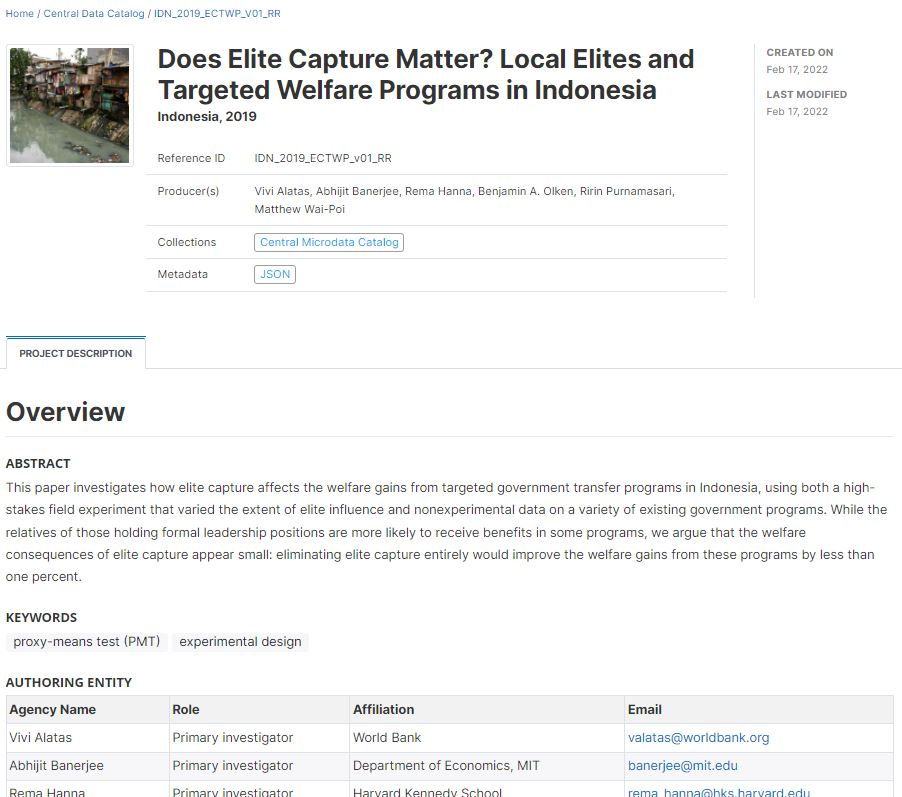  
<br>


### Full example, using Python 


