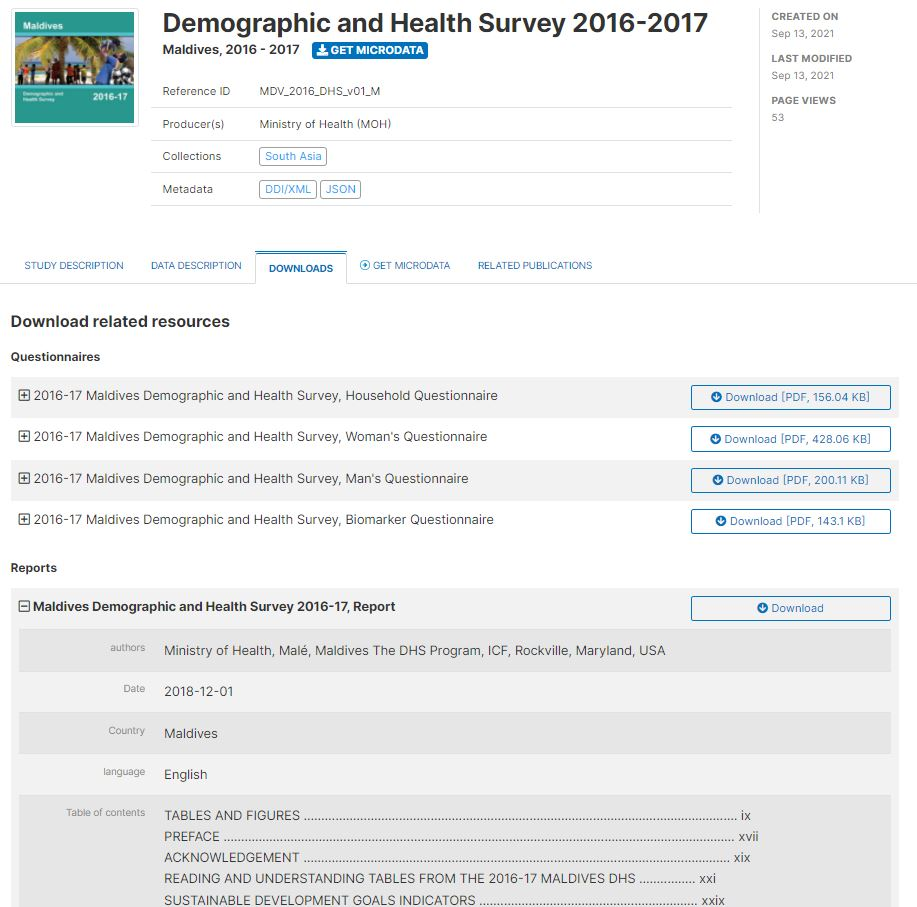
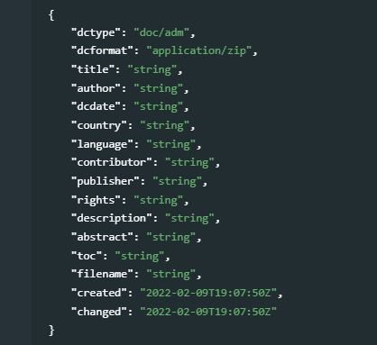

# External resources {#chapter13}

The metadata schemas presented in chapters 4 to 12 of the Guide are intended to document in detail resources of multiple types (data and scripts). When published in a NADA catalog, these metadata will be made visible and searchable. But publishing metadata in an HTML format is not enough. In most cases, you will also want to made files (data files, documents, or others) accessible in your catalog, and provide links to other, related resources. These files will have to be uploaded on your web server, and the links created, with some documentation. These related materials are what is referred to as "external resources". 

**External resources** are not a specific type of data. They are resources of any type (data, document, web page, or any other type of resource that can be provided as an electronic file or a web link) that can be attached as a "related resource" to a catalog entry. A schema that is intentionally kept very simple, based on the Dublin Core standard, is used to describe these resources. This schema will never be used independently; it will always be used in combination with one of the other metadata standards and schemas documented in this Guide.

The table below shows some examples of the kind of external resources that may be attached to the metadata of different data types.

| Data type          | Resources that may be documented and published as external resources  |
| ------------------ | ------------------------------------------------------------ |
| Document           | MS-Excel version of tables included in a publication ; PDF/DOC version of the publication ; visualizations files (scripts and image) for visualizations included in the publication ; link to electronic annexes |
| Microdata          | survey questionnaire ; survey report ; technical documentation (sampling, etc.) ; data entry application ; survey budget in Excel ; microdata files in different formats ; link to an external website|
| Geographic dataset | link to an interactive web application ; technical documentation in PDF ; data analysis scripts ; publicly accessible data files |
| Time series        | link to a database query interface ; technical documents ; link to external websites ; visualization scripts |
| Tables             | link to an organization website ; tabulation scripts | electronic copy of the table |
| Images             | image files in different formats and resolutions ; link to a photo album application ; link to a photographer website |
| Audio recordings   | audio file in MP3 or other format ; transcript in PDF |
| Videos             | video file in WAV or other format ; transcript in PDF |
| Scripts            | publication ; link to a package/library web page ; link to datasets | 

Note that a catalog entry (e.g. a document, or a table) can itself be provided as a link (i.e. as an external resource) for another catalog entry.

In a NADA catalog, the external resources will not appear as catalog entries. Their list and description will be displayed (and the resources made accessible) in a "DOWNLOAD" tab for the entry to which they are attached.

<br>
{width=100%}
<br>  

The schema used to document external resources only contains 16 elements.

<br>
{width=100%}
<br>  

**`dctype`** *[Optional, Not Repeatable, String]* <br>
This element defines the type of external resource being documented. This element plays an important role in the cataloguing system (NADA), as it is used to determine where and how the resource will be published. Particular attention must be paid to the type "Microdata File" (`dat/micro`) and to other data types, when the datasets will be published in a data catalog but with access restrictions). The NADA catalog allows data to be published under different levels of accessibility: open data, direct access, public use files, licensed data, access in data enclave, or no access. Most standards include an element **`access_policy`** which is used to determine the type of access to a resource, and will apply to data of type `dat/micro`. The resource type `dctype` must be selected from a controlled vocabulary:

  - **doc/adm**: Document, Administrative [doc/adm] <br>
  - **doc/anl**: Document, Analytical [doc/anl]<br>
  - **doc/oth**: Document, Other [doc/oth]<br>
  - **doc/qst**: Document, Questionnaire [doc/qst]<br>
  - **doc/ref**: Document, Reference [doc/ref]<br>
  - **doc/rep**: Document, Report [doc/rep]<br>
  - **doc/tec**: Document, Technical [doc/tec]<br>
  - **aud**: Audio [aud]<br>
  - **dat**: Database [dat] (not including microdata)<br>
  - **map**: Map [map]<br>
  - **dat/micro**: Microdata File [dat/micro]<br>
  - **pic**: Photo / image [pic]<br>
  - **prg**: Program / script [prg]<br>
  - **tbl**: Table [tbl]<br>
  - **vid**: Video [vid]<br>
  - **web**: Web Site [web]<br>

**`dcformat`** *[Optional, Not Repeatable, String]* <br>
The resource file format. This format can be entered using a controlled vocabulary. Options could include:

  - **application/x-compressed**: Compressed, Generic<br>
  - **application/zip**: Compressed, ZIP<br>
  - **application/x-cspro**: Data, CSPro<br>
  - **application/dbase**: Data, dBase<br>
  - **application/msaccess**: Data, Microsoft Access<br>
  - **application/x-sas**: Data, SAS<br>
  - **application/x-spss**: Data, SPSS<br>
  - **application/x-stata**: Data, Stata<br>
  - **text**: Document, Generic<br>
  - **text/html**: Document, HTML<br>
  - **application/msexcel**: Document, Microsoft Excel<br>
  - **application/mspowerpoint**: Document, Microsoft PowerPoint<br>
  - **application/msword**: Document, Microsoft Word<br>
  - **application/pdf**: Document, PDF<br>
  - **application/postscript**: Document, Postscript<br>
  - **text/plain**: Document, Plain<br>
  - **text/wordperfect**: Document, WordPerfect<br>
  - **image/gif**: Image, GIF<br>
  - **image/jpeg**: Image, JPEG<br>
  - **image/png**: Image, PNG<br>
  - **image/tiff**: Image, TIFF<br>

**`title`** *[Required, Not Repeatable, String]* <br>
The title of the resource.

**`author`** *[Optional, Not Repeatable, String]* <br>
The author(s) of the resource. If more than one, separate the names with a ";".

**`dcdate`** *[Optional, Not Repeatable, String]* <br>
The date the resource was produced or released, preferably entered in ISO 8601 format (YYYY-MM-DD or YYYY-MM or YYYY).

**`country`** *[Optional, Not Repeatable, String]* <br>
The country name, if the resource is specific to a country. If more than one, enter the country names separated with a ";".

**`language`** *[Optional, Not Repeatable, String]* <br>
The language name. If more than one, enter the language names separated with a ";".

**`contributor`** *[Optional, Not Repeatable, String]* <br>
List of contributor (free text). If more than one, enter the names separated with a ";".

**`publisher`** *[Optional, Not Repeatable, String]* <br>
List of contributor (free text). If more than one, enter the names separated with a ";".

**`rights`** *[Optional, Not Repeatable, String]* <br>
The rights associated with the resource.

**`description`** *[Optional, Not Repeatable, String]* <br>
A brief description of the resource (but not the abstract; see the next element).

**`abstract`** *[Optional, Not Repeatable, String]* <br>
And abstract for the resource.

**`toc`** *[Optional, Not Repeatable, String]* <br>
The table of content of the resource (if the resource is a publication), entered as free text.

**`filename`** *[Optional, Not Repeatable, String]* <br>
A file name or a URL.


## Example of use of external resources

The "complete examples" provided in the previous chapters included some examples of the use of the "external_resources_add" command (from the Nadar R package) or "..." (from the PyNada Python library). We provide here one more example.

```
# R example  @@@@
```


```
# Python example  @@@@
```

