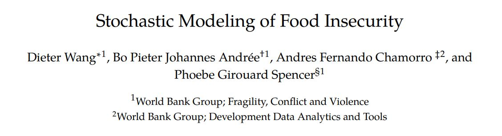
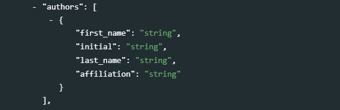
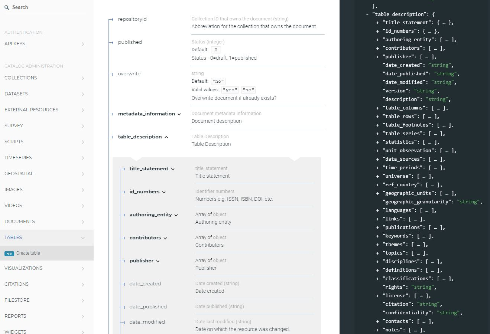
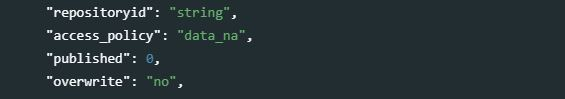
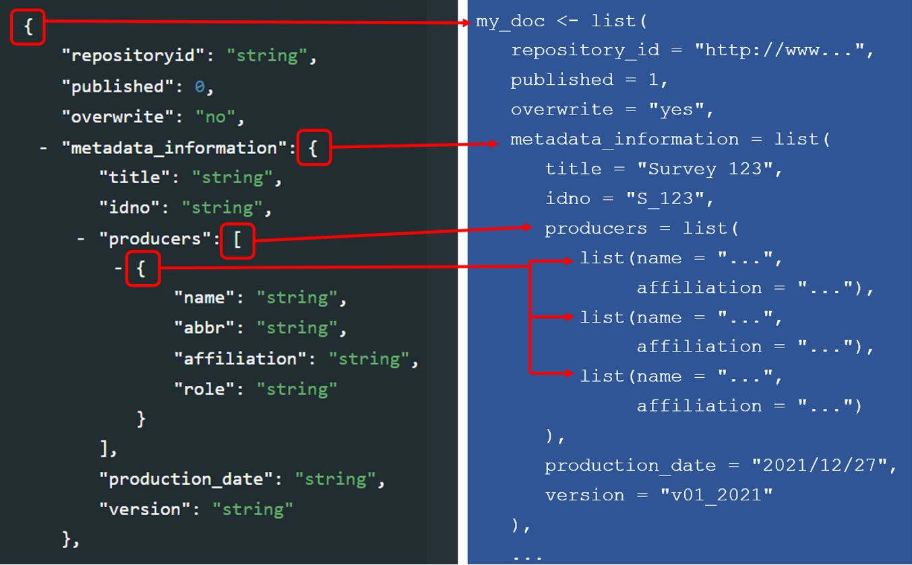
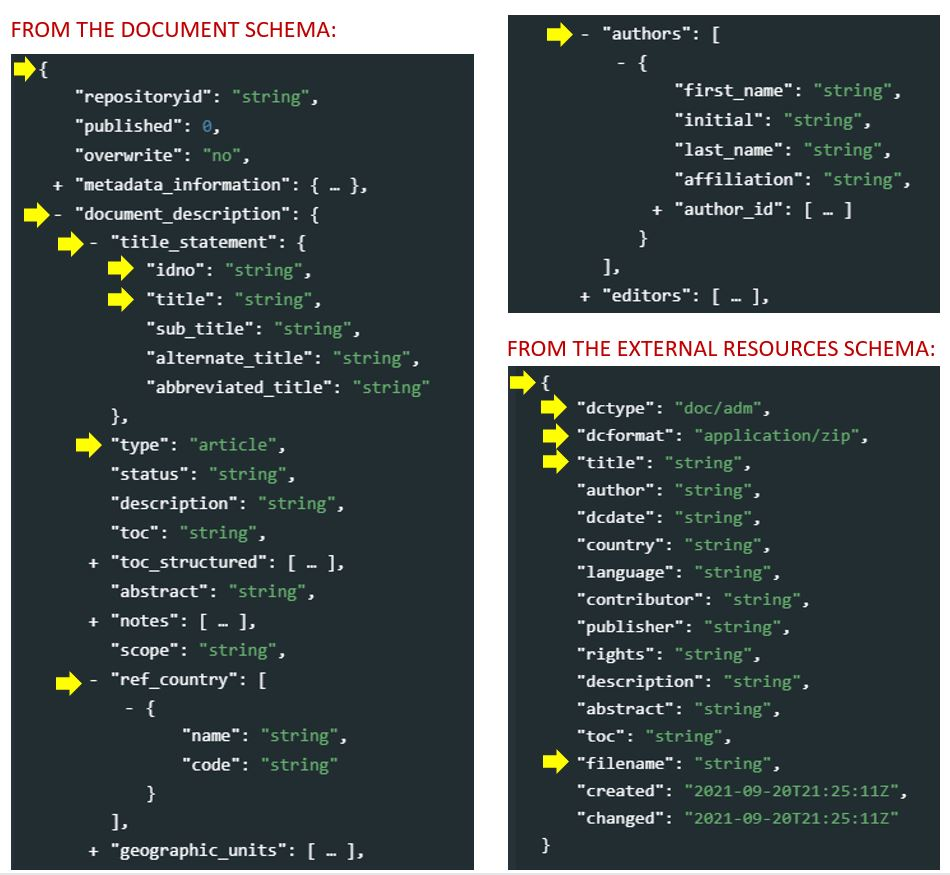
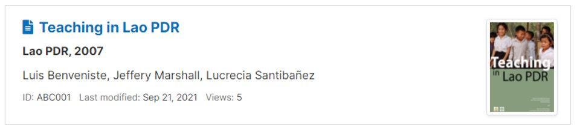
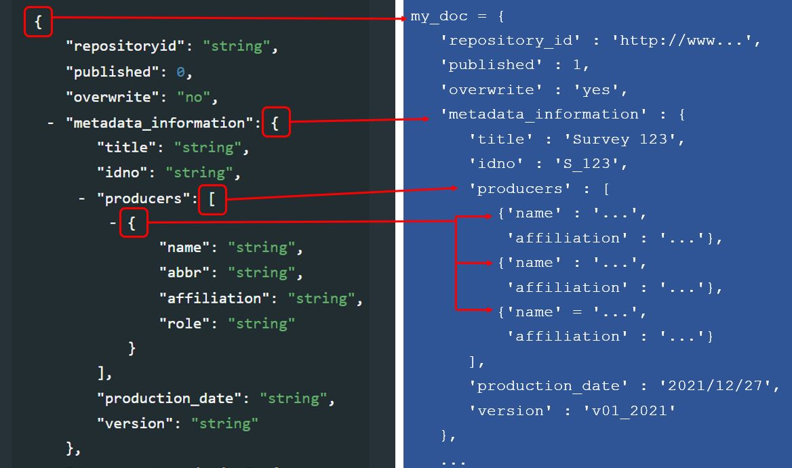
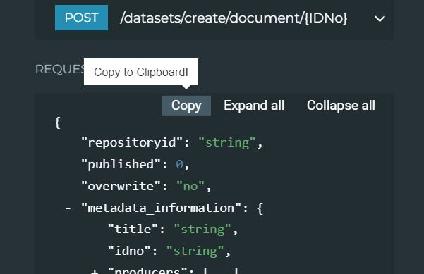

# Metadata formats and tools {#chapter02}


 <!--       _  _____  ____  _   _  __   ____  __ _       -->
 <!--      | |/ ____|/ __ \| \ | | \ \ / /  \/  | |      -->
 <!--      | | (___ | |  | |  \| |  \ V /| \  / | |      -->
 <!--  _   | |\___ \| |  | | . ` |   > < | |\/| | |      -->
 <!-- | |__| |____) | |__| | |\  |  / . \| |  | | |____  -->
 <!--  \____/|_____/ \____/|_| \_| /_/ \_\_|  |_|______| -->
                                                   
## The JSON and XML formats 

Metadata standards and schemas consist of structured lists of metadata fields. They serve multiple purposes. First, they help data curators generate complete and usable documentation of their datasets. Metadata standards that are intuitive and *human-readable* better serve this purpose. Second, they help generate *machine-readable* metadata that are the input to software applications like on-line data catalogs. Metadata available in open file formats like JSON (JavaScript Object Notation) and XML (eXtended Markup Language) are most suitable for this purposes.

Some international metadata standards like the Data Documentation Initative (DDI Codebook, for microdata), the ISO 19139 (for geospatial data), or the Dublin Core (a more generic metadata specification) are described and published as XML specifications. Any XML standard or schema can be "translated" into JSON, which is our preferred format (a choice we justify in the next section).   

JSON and XML formats have similarities: 

   - Both are non-proprietary text files
   - Both are hierarchical (they may contain values within values)
   - Both can be parsed and used by many programming languages including R and Python

JSON files are however easier to parse than XML, easier to generate programmatically, and easier to read by humans. This makes them our preferred choice for describing and using metadata standards and schemas.

Metadata in JSON are stored as *key/value* pairs, where the keys correspond to the names of the metadata elements in the standard. Values can be string, numeric, boolean, arrays, null, or JSON objects (for a more detailed description of the JSON format, see [www.w3schools.com](https://www.w3schools.com/js/js_json_intro.asp)). Metadata in XML are stored within named tags. The example below shows how the JSON and XML formats are used to document the list of authors of a [document](http://hdl.handle.net/10986/34511), using elements from the Dublin Core metadata standard.

<center>
{width=100%}
</center>
<br>

In the *documents* schema, authors are documented in the metadata element `authors` which contains the following sub-elements: `first_name`, `initial`, `last_name`, and `affiliation`.

<center>
{width=100%}
</center>
<br>

In JSON, this information will be stored in key/value pairs as follows. 

```{json}
"authors" : [
  {"first_name" : "Dieter", 
   "last_name"  : "Wang", 
   "affiliation": "World Bank Group; Fragility, Conflict and Violence"},
  {"first_name" : "Bo",     
   "initial"    : "P.J.", 
   "last_name"  : "Andrée", 
   "affiliation": "World Bank Group; Fragility, Conflict and Violence"},
  {"first_name" : "Andres", 
   "initial"    : "F.", 
   "last_name"  : "Chamorro", 
   "affiliation": "World Bank Group; Development Data Analytics and Tools"},
  {"first_name" : "Phoebe", 
   "initial"    : "G.", 
   "last_name"  : "Spencer",  
   "affiliation":"World Bank Group; Fragility, Conflict and Violence"}
]
```

In XML, the same information will be stored within named tags as follows. 

```{xml}
<authors>
  <author>
    <first_name>Dieter</first_name> 
    <last_name>Wang</last_name> 
    <affiliation>World Bank Group; Fragility, Conflict and Violence</affiliation>
  </author>
  <author>
    <first_name>Bo</first_name> 
    <initial>P.J.</initial> 
    <last_name>Andrée</last_name> 
    <affiliation>World Bank Group; Fragility, Conflict and Violence</affiliation>
  </author>
  <author>
    <first_name>Andres</first_name> 
    <initial>E.</initial>
    <last_name>Chamorro</last_name> 
    <affiliation>World Bank Group; Development Data Analytics and Tools</affiliation>
  </author>
  <author>
    <first_name>Phoebe</first_name> 
    <initial>G.</initial>
    <last_name>Spencer</last_name> 
    <affiliation>World Bank Group; Fragility, Conflict and Violence</affiliation>
  </author>
</authors>
```


<!--  __          ___                    -->
<!--  \ \        / / |                   -->
<!--   \ \  /\  / /| |__   ___ _ __ ___  -->
<!--    \ \/  \/ / | '_ \ / _ \ '__/ _ \ -->
<!--     \  /\  /  | | | |  __/ | |  __/ -->
<!--      \/  \/   |_| |_|\___|_|  \___| -->
                                   
## Where to find the schemas' documentation

The most recent documentation of the schemas described in the Guide is available on-line at https://ihsn.github.io/nada-api-redoc/catalog-admin/#. 

<center>
{width=100%}
</center>
<br>

The documentation of each standard or schema starts with four common elements that are not actually part of the standard or schema, but that contain information that will be used when the metadata are published in a data catalog that uses the NADA application. If NADA is not used, these "administrative elements" can be ignored.

<center>
{width=100%}
</center>
<br>

   - **`repositoryid`** identifies the collection in which the metadata will be published. 
   - **`access_policy`** determines if and how the <u>data files</u> will be accessible from the catalog in which the metadata are published. This element only applies to the microdata and geographic metadata standards. It makes use of a controlled vocabulary with the following access policy options: 
      - **`direct`**: data can be downloaded without requiring them to be registered; 
      - **`open`**: same as "direct", with an open data license attached to the dataset; 
      - **`public`**: public use files, which only require users to be registered in the catalog;
      - **`licensed`**: access to data is restricted to registered users who receive authorization to use the data, after submitting a request;
      - **`remote`**: data are made available by an external data repository;
      - **`data_na`**: data are not accessible to the public (only metadata are published). 
   - **`published`** determines the status of the metadata in the on-line catalog (with options 0 = draft and 1 = published). Published entries are visible to all visitors of the on-line catalog; unpublished (draft) entries will only be visible by the catalog administrators and reviewers. 
   - **`overwrite`** determines whether the metadata already in the catalog for this entry can be overwritten (iwith options yes or no, 'no' being the default).  

This set of administrative elements is followed by one or multiple sections that contain the elements specific to each standard/schema. For example, the DDI Codebook metadata standard, used to document microdata, contains the following main sections:
   
   - **`document description`**: a description of the metadata (who documented the dataset, when, etc.) Most schemas will contain such a section describing the metadata, useful mainly to data curators and catalog administrators. In other schemas, this section may be named `metadata_description`. 
   - **`study description`**: the description of the survey/census/study, not including the data files and data dictionary.
   - **`file description`**: a list and description of data files associated to the study.
   - **`variable description`**: the data dictionary (description of variables).

The schema-specific sections are followed by a few other metadata elements common to most schemas. These elements are used to provide additional information useful for cataloguing and discoverability purposes. They include **tags** (which allow catalog administrators to attach tags to datasets independently of their type, which can be used as filters in the catalog), and **external resources**. 

Some schemas provide the possibility for data curators to add their own metadata elements in an **additional** section. The use of additional elements should be the exception, as metadata standards and schemas are designed to provide all elements needed to fully document a data resource. 

In each standard and schema, metadata elements can have the following properties:

   - **Optional** or **required**. When an element is declared as *required* (or *mandatory*), the metadata will be considered invalid if it contains no information in that element. To keep the schemas flexible, very few elements are set as required. Note that it is possible for a metadata element to be `required` but have all its components (for elements that have sub-elements) declared as optional. This will be the case when at least one (but any) of the sub-element must contain information. It is also possible for an element to be declared *optional* but have one or more of its sub-elements declared `mandatory` (this means that the field is optional, but if it is used, some of its features MUST be provided.) 
   - **Repeatable** or **Not repeatable**. For example, the element `nation` in the DDI standard is *Repeatable* because a dataset can cover more than one country, while the element `title` is *Not repeatable* because a study should be identified by a unique title. 
   - **Type**. This indicates the format of the information contained in an element. It can be a *string* (text), a *numeric* value, a *boolean* variable (TRUE/FALSE), or an *array*.

Some schemas may recommend controlled vocabularies for some elements. For example, the ISO 19139 used to document geographic datasets recommends ...

In most cases however, controlled vocabularies are not part of the metadata standard or schema. They will be selected and activated in templates and applications.
...example...


 <!--  _______                  _       _   _              -->
 <!-- |__   __|                | |     | | (_)             -->
 <!--    | |_ __ __ _ _ __  ___| | __ _| |_ _ _ __   __ _  -->
 <!--    | | '__/ _` | '_ \/ __| |/ _` | __| | '_ \ / _` | -->
 <!--    | | | | (_| | | | \__ \ | (_| | |_| | | | | (_| | -->
 <!--    |_|_|  \__,_|_| |_|___/_|\__,_|\__|_|_| |_|\__, | -->
 <!--                                                __/ | -->
 <!--                                               |___/  -->
                                               
## How to generate metadata? 

Metadata compliant with the standards and schemas described in this Guide can be generated in two different ways: **programmatically** using a programming language like R or Python, or by **using a specialized metadata editor** application. The first option provides a high degree of flexibility and efficiency. It offers multiple opportunities to automate part of the metadata generation process, and to exploit advanced machine learning solutions to enhance metadata. Also, metadata generated using R or Python can also be published in a NADA catalog using the NADA API and the R package NADAR or the Python library PyNADA. The programmatic option may thus be the preferred option for organizations that have strong expertise in R or Python. For other organizations, and for some types of data, the use of a specialized metadata editor may be a better option. Metadata editors are specialized software applications designed to offer a user-friendly alternative to the programmatic generation of metadata. We provide in this section a brief description of how structured metadata can be generated and published using respectively R, Python, and a metadata editor application. 

### Generating compliant metadata using R

All schemas described in the [on-line documentation](https://ihsn.github.io/nada-api-redoc/catalog-admin/#) can be used to generate compliant metadata using R scripts. Generating metadata using R will consist of producing a *list* object (itself containing lists). In the documentation of the standards and schemas, curly brackets indicate to R users that a *list* must be created to store the metadata elements. Square brackets indicate that a block of elements is repeatable, which corresponds in R to a *list of lists*. For example (using the [DOCUMENT]((https://ihsn.github.io/nada-api-redoc/catalog-admin/#operation/createDocument)) metadata schema): 

<center>
{width=100%}
</center>

:::note
The sequence in which the metadata elements are created when documenting a dataset using R or Python does not have to match the sequence in the schema documentation.
:::

Metadata compliant with a standard/schema can be generated using R, and directly uploaded in a NADA catalog without having to be saved as a JSON file. An object (a list) must be created in the R script that contains metadata compliant with the JSON schema. The example below shows how such an object is created and published in a NADA catalog. We assume here that we have a document with the following information: 

   - document unique id: *WB_10986/7710* 
   - title: *Teaching in Lao PDR*
   - authors: *Luis Benveniste, Jeffery Marshall, Lucrecia Santibañez (World Bank)*
   - date published: *2007*
   - countries: *Lao PDR*. 
   - The document is available from the World Bank Open knowledge Repository at http://hdl.handle.net/10986/7710.   

We will use the [DOCUMENT schema](https://ihsn.github.io/nada-api-redoc/catalog-admin/#tag/Documents) to document the publication, and the [EXTERNAL RESOURCE schema](https://ihsn.github.io/nada-api-redoc/catalog-admin/#tag/External-resources) to publish a link to the document in NADA.

<center>
{width=100%}
</center>
<br>

Publishing data and metadata in a NADA catalog (using R and the NADAR package or Python and the PyNADA library) requires to first identify the on-line catalog where the metadata will be published (by providing its URL in the `set_api_url` command line) and to provide a key to authenticate as a catalog administrator (in the `set_api_key` command line; note that this key should never be entered in clear in a script to avoid accidental disclosure). 

We then create an object (a list in R, or a dictionary in Python) that we will for example name *my_doc*. Within this list (or dictionary), we will enter all metadata elements. Some will be simple elements, others will be lists (or dictionaries). The first element to be included is the required `document_description`. Within it, we include the `title_statement` which is also required and contains the mandatory elements `idno` and `title` (all documents must have a unique ID number for cataloguing purpose, and a title). The list of countries that the document covers is a <u>repeatable</u> element, i.e. a list of lists (although we only have one country in this case). Information on the authors is a repeatable element, allowing us to capture the information on the three co-authors individually. 

This *my_doc* object is then published in the NADA catalog using the `add_document` function. Last, we publish (as an external resource) a link to the file, with only basic information. We do not need to document this resource in detail, as it corresponds to the metadata provided in *my_doc*. If we had a different external resource (for example an MS-Excel table that contains all tables shown in the publication), we would make use of more of the external resources metadata elements to document it. Note that instead of a URL, we could have provided a path to an electronic file (e.g., to the PDF document), in which case the file would be uploaded to the web server and made available directly from the on-line catalog. We had previously captured a screenshot of the cover page of the document to be used as thumbnail in the catalog (optional).

```{r eval=F, echo=T}

library(nadar)

# Define the NADA catalog URL and provide an API key

set_api_url("http://nada-demo.ihsn.org/index.php/api/")
set_api_key("a1b2c3d4e5")  
    # Note: an administrator API key must always be kept strictly confidential; 
    # It is good practice to read it from an external file, not to enter it in clear 

thumb  <- "C:/DOCS/teaching_lao.JPG"  # Cover page image to be used as thumbnail

# Generate and publish the metadata on the publication

doc_id <- "WB_10986/7710" 

my_doc <- list(

   document_description = list(
   
      title_statement = list(
        idno = doc_id, 
        title = "Teaching in Lao PDR"
      ),
      
      date_published = "2007",
  
      ref_country = list(
        list(name = "Lao PDR",  code = "LAO")
      ),
      
      # Authors: we only have one author, but this is a list of lists 
      # as the 'authors' element is a repeatable element in the schema
      authors = list(
        list(first_name = "Luis",     last_name = "Benveniste", affiliation = "World Bank"),
        list(first_name = "Jeffery",  last_name = "Marshall",   affiliation = "World Bank"),
        list(first_name = "Lucrecia", last_name = "Santibañez", affiliation = "World Bank")
      )
   )
)

# Publish the metadata in the central catalog 

add_document(idno = doc_id, 
             metadata = my_doc, 
             repositoryid = "central", 
             published = 1,
             thumbnail = thumb,
             overwrite = "yes")

# Add a link as an external resource of type document/analytical (doc/anl).

external_resources_add(
  title = "Teaching in Lao PDR",
  idno = doc_id,
  dctype = "doc/anl",
  file_path = "http://hdl.handle.net/10986/7710",
  overwrite = "yes"
)

```

The document is now available in the NADA catalog.

<center>
{width=100%}
</center>


### Generating compliant metadata using Python

Generating metadata using Python will consist of producing a *dictionary* object, which will itself contain lists and dictionaries. Non-repeatable metadata elements will be stored as dictionaries, and repeatable elements as lists of dictionaries. In the [metadata documentation](https://ihsn.github.io/nada-api-redoc/catalog-admin/#), curly brackets indicate that a *dictionary* must be created to store the metadata elements. Square brackets indicate that a dictionary containing dictionaries must be created. 

<center>
{width=100%}
</center>

<br>

:::idea
Dictionaries in Python are very similar to JSON schemas. When documenting a dataset, data curators who use Python can copy a schema from the ReDoc website, paste it in their script editor, then fill out the relevant metadata elements and delete the ones that are not used.
:::
  
<center>
{width=75%}
</center>

<br>

The Python equivalent of the R example we provided above is as follows:

```{python eval=F, echo=T}

import pynada as nada

# Define the NADA catalog URL and provide an API key

set_api_url("http://nada-demo.ihsn.org/index.php/api/")
set_api_key("a1b2c3d4e5")  
    # Note: an administrator API key must always be kept strictly confidential; 
    # It is good practice to read it from an external file, not to enter it in clear  

thumb  <- "C:/DOCS/teaching_lao.JPG"  # Cover page image to be used as thumbnail

# Generate and publish the metadata on the publication

doc_id = "WB_10986/7710"

document_description = {

  'title_statement': {
      'idno': "WB_10986/7710",
      'title': "Teaching in Lao PDR"
  },
  
  'date_published': "2007",

  'ref_country': [
		{'name': "Lao PDR", 'code': "Lao"}
	],
  
  # Authors: we only have one author, but this is a list of lists 
  # as the 'authors' element is a repeatable element in the schema
  'authors': [
      {'first_name': "Luis",     'last_name': "Benveniste", 'affiliation' = "World Bank"},
      {'first_name': "Jeffery",  'last_name': "Marshall",   'affiliation' = "World Bank"},
      {'first_name': "Lucrecia", 'last_name': "Santibañez", 'affiliation' = "World Bank"},
  ]
}

# Publish the metadata in the central catalog 

nada.create_document_dataset(
  dataset_id = doc_id,
  repository_id = "central",
  published = 1,
  overwrite = "yes",
  my_doc_metadata,             @@@@@@
  thumbnail_path = thumb)

# Add a link as an external resource of type document/analytical (doc/anl).

nada.add_resource(
  dataset_id = doc_id,
  dctype = "doc/anl",
  title = "Teaching in Lao PDR",
  file_path = "http://hdl.handle.net/10986/7710",
  overwrite = "yes")

```

### Generating compliant metadata using metadata editors

R and Python are powerful tools to generate metadata in a flexible and efficient manner. They offer opportunities to automate tasks, to extract metadata from APIs or data files, to augment metadata, and to provide full transparency and replicability in the metadata production process. But this requires a level of expertise in R or Python that many organizations may not have. To support users who do not have such expertise, and to facilitate the use of complex metadata standards, specialized *metadata editors* have been developed to document certain types of data, in particular microdata (with the DDI metadata standard) and geospatial data (with the ISO 19139 metadata standard).

The [Nesstar Publisher](http://www.nesstar.com/software/publisher.html) is a popular DDI metadata editor used to document microdata. The application, developed and published by the Norwegian Centre for Research Data, was built around the DDI Codebook 1.n version. It also makes use of Dublin Core elements to document external resources. The application, built on an outdated technology and DDI version, is however not maintained anymore. The World Bank has initiated the development of a more modern and open source version of this application, compatible with the most recent version of DDI Codebook (and other metadata standards). 

Template for the selection of elements, default values, controlled vocabularies
Then UI with (for some types) import of data and automated generation of some metadata.

Example of microdata
Example of document


For documenting geographic datasets and services, the [GeoNetwork metadata editor](https://geonetwork-opensource.org/), an [OSGeo](https://www.osgeo.org/) project, supports ISO 19115/19119/19110 standards. Other tools like the open-source R package [geometa](https://cran.r-project.org/web/packages/geometa/index.html) (*Tools for Reading and Writing ISO/OGC Geographic Metadata*) can also help data curators in the production of structured metadata.
