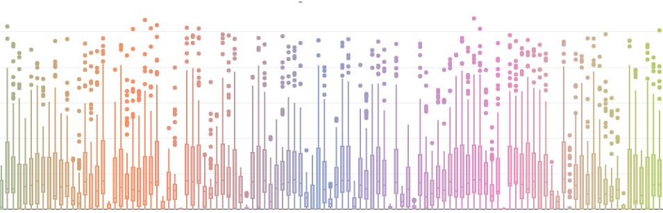

--- 
title: "[DRAFT - WORK IN PROGRESS] Metadata Standards and Schemas for Improved Data Discoverability and Usability"
author: "Olivier Dupriez and Mehmood Asghar"
date: "`r Sys.Date()`"
knit: bookdown::render_book
site: bookdown::bookdown_site
documentclass: krantz
monofont: "Source Code Pro"
monofontoptions: "Scale=0.7"
biblio-style: apalike
link-citations: yes
description: ""
github-repo: ""
cover-image: "./images/cover2.jpg"
url: ''
colorlinks: yes
graphics: yes
---

# Preface {-}

```{asis, echo=identical(knitr:::pandoc_to(), 'html')}
<p style="text-align: center;"></p>
```
Numerous organizations --government agencies, international organizations, the private sector, the academia, and others-- invest in data collection and creation. Their datasets often possess intrinsic value not only for their creators but also for a broader community of secondary users and researchers. By repurposing and reusing data, this community contributes to adding significant social and economic value to the data. However, many valuable datasets remain difficult to find, access, and use, and are therefore underexploited. To address this issue, concerted efforts to enhance the discoverability, accessibility, and usability of data are required. Such efforts would largely hinge on the quality of the **metadata** associated with the data. This Guide on the Use of Metadata Standards and Schemas for Improved Data Discoverability and Usability aims to promote and facilitate the production and effective use of structured metadata, ultimately promoting responsible data utilization.

The primary audience for the Guide are data curators, administrators of data catalogs or data libraries, and developers of data management and dissemination platforms who seek to maximize the value of their socio-economic data in a responsible and technically proficient manner.

The Guide is part of a broader toolset, complemented by a specialized metadata editor and a cataloging tool, focused on addressing the *technical* aspects of data documentation and dissemination. *Legal* and *ethical* considerations are equally vital in this context. Other tools and guidelines are available to address these critical issues.

## Acknowledgments {-}

The Guide was written by Olivier Dupriez (Deputy Chief Statistician, World Bank) and Mehmood Asghar (Senior Data Engineer, World Bank). Kamwoo Lee (Data Scientist, World Bank) produced some of the examples of the use of metadata schemas included in the Guide and contributed to the testing of the schemas. Emmanuel Blondel (consultant) contributed much of chapter 6. Geoffrey Greenwell (consultant) provided input to chapter 9. Tefera Bekele Degefu and Cathrine Machingauta (Data Scientists, World Bank) participated in the testing of the metadata schemas. Matthew Welch (Senior Economist-Statistician, World Bank) provided comments on the Guide.

The production of the Guide and related tools has been made possible by financial contributions from:

   - The [International Household Survey Network (IHSN)](www.ihsn.org) Trust Fund, project P167116, Grant No TF0A7461, by the UK government.
   - The UK Aid-UNHCR-World Bank research program Building the Evidence on Protracted Forced Displacement, funded by the UK government (FCV Data Platform component, project P174529, Grant No TF0B4149). This project supported the development of a data platform which led to the improvement and testing of some of the metadata schemas described in the Guide.
   - The World Bank-UNHCR Joint Data Center Microdata Library project P174080, Grant No TF0B4772, administered by the World Bank Development Data Group.
   - The World Bank administrative budget.

The Guide was created using [R Bookdown](https://bookdown.org/) and is licensed under a [Creative Commons Attribution- NonCommercial- NoDerivatives 4.0 International License](https://creativecommons.org/licenses/by-nc-nd/4.0/). chatGPT was used as a copy editor (not to write content, but to improve style and grammar).

We welcome feedback and suggestions. The Guide's source code is stored in GitHub (https://github.com/mah0001/schema-guide). Feedback and suggestions can be sent to [odupriez@worldbank.org]

{width=20%}
</center>
